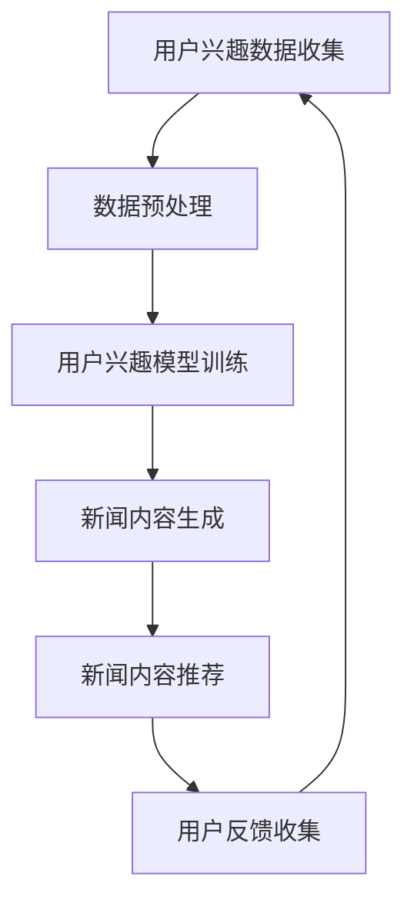

                 

关键词：大型语言模型，个性化新闻生成，定制化信息服务，机器学习，自然语言处理

> 摘要：本文将探讨大型语言模型（LLM）在个性化新闻生成中的应用，以及如何通过定制化信息服务提升用户体验。文章首先介绍个性化新闻生成的背景和重要性，接着深入分析LLM的工作原理和优势，随后详细阐述算法原理和数学模型，并通过实际项目实践展示其效果。文章最后探讨未来应用前景，面临的挑战及展望。

## 1. 背景介绍

个性化新闻生成是一种利用机器学习和自然语言处理技术，根据用户兴趣和行为数据生成个性化新闻内容的方法。随着互联网的普及和信息爆炸，人们每天接触到的信息量呈指数级增长，而个体的时间和精力是有限的。因此，如何有效地筛选和推送用户感兴趣的新闻内容成为了一个亟待解决的问题。

传统的方法主要包括基于内容的推荐系统和基于协同过滤的方法。然而，这些方法往往存在信息过载和个性化不足的问题。基于内容的推荐系统依赖于新闻内容的特征，而忽略了用户的兴趣偏好；基于协同过滤的方法则依赖于用户的历史行为数据，可能无法充分满足用户的即时需求。

为了解决这些问题，近年来，越来越多的研究开始将大型语言模型（LLM）应用于个性化新闻生成。LLM是一种基于深度学习的自然语言处理模型，可以理解并生成人类语言。与传统的推荐系统相比，LLM具有以下几个显著优势：

1. **强大的语言理解能力**：LLM能够理解新闻内容的语义和上下文，从而生成更符合用户兴趣的新闻。
2. **灵活的生成能力**：LLM可以根据不同的用户需求和场景，生成多样化、个性化的新闻内容。
3. **实时性**：LLM可以实时生成新闻内容，满足用户的即时需求。

## 2. 核心概念与联系

### 2.1 大型语言模型（LLM）

大型语言模型（LLM）是一种基于深度学习的自然语言处理模型，通常采用神经网络架构，如Transformer。LLM通过对海量文本数据进行训练，学习到语言的统计规律和语义信息，从而能够理解并生成人类语言。

### 2.2 个性化新闻生成

个性化新闻生成是指根据用户的兴趣和行为数据，利用机器学习和自然语言处理技术，生成符合用户需求的新闻内容。个性化新闻生成的核心是理解用户的兴趣偏好，并通过文本生成模型生成个性化新闻。

### 2.3 定制化信息服务

定制化信息服务是指根据用户的需求和偏好，提供个性化的信息内容和服务。在个性化新闻生成的场景中，定制化信息服务意味着根据用户的兴趣和阅读习惯，生成和推荐个性化的新闻内容。

### 2.4 Mermaid 流程图



## 3. 核心算法原理 & 具体操作步骤

### 3.1 算法原理概述

个性化新闻生成的核心算法是大型语言模型（LLM）。LLM通过以下步骤实现个性化新闻生成：

1. **用户兴趣数据收集**：收集用户在阅读新闻时的行为数据，如阅读时间、阅读频次、点击行为等。
2. **数据预处理**：对收集到的用户兴趣数据进行清洗、去噪和处理，以生成高质量的输入数据。
3. **用户兴趣模型训练**：利用训练数据训练一个用户兴趣模型，用于预测用户的兴趣偏好。
4. **新闻内容生成**：根据用户兴趣模型和新闻数据，利用LLM生成个性化的新闻内容。
5. **新闻内容推荐**：将生成的新闻内容推荐给用户，并根据用户的反馈进行调整。

### 3.2 算法步骤详解

#### 3.2.1 用户兴趣数据收集

用户兴趣数据可以通过用户行为日志、阅读历史和社交媒体数据等渠道收集。具体步骤如下：

1. **用户行为日志收集**：收集用户在阅读新闻时的行为数据，如阅读时间、阅读频次、点击行为等。
2. **阅读历史收集**：收集用户的历史阅读记录，包括阅读的标题、正文、分类等。
3. **社交媒体数据收集**：收集用户在社交媒体平台上的互动数据，如点赞、评论、分享等。

#### 3.2.2 数据预处理

数据预处理是确保数据质量的重要步骤，包括以下内容：

1. **数据清洗**：去除重复数据、噪声数据和缺失数据。
2. **数据去噪**：对含有噪声的数据进行去噪处理，如去除无意义的标签和关键词。
3. **特征提取**：将原始数据转换为特征向量，如使用词袋模型、词嵌入等技术。

#### 3.2.3 用户兴趣模型训练

用户兴趣模型训练是基于监督学习的方法，通过训练数据学习用户的兴趣偏好。具体步骤如下：

1. **数据分割**：将数据集分为训练集和测试集。
2. **模型选择**：选择合适的机器学习模型，如支持向量机（SVM）、决策树、神经网络等。
3. **模型训练**：使用训练集训练用户兴趣模型。
4. **模型评估**：使用测试集评估模型性能。

#### 3.2.4 新闻内容生成

新闻内容生成是利用LLM生成个性化的新闻内容。具体步骤如下：

1. **文本输入**：将用户兴趣模型和新闻数据输入到LLM。
2. **文本生成**：利用LLM生成个性化的新闻内容。
3. **文本筛选**：根据新闻质量和用户兴趣对生成的新闻内容进行筛选。

#### 3.2.5 新闻内容推荐

新闻内容推荐是将生成的新闻内容推荐给用户。具体步骤如下：

1. **推荐算法**：选择合适的推荐算法，如基于内容的推荐、基于协同过滤的推荐等。
2. **推荐结果生成**：根据推荐算法生成推荐结果。
3. **推荐结果展示**：将推荐结果展示给用户。

### 3.3 算法优缺点

#### 优点：

1. **个性化**：LLM能够根据用户的兴趣和需求生成个性化的新闻内容，有效解决信息过载问题。
2. **实时性**：LLM可以实时生成新闻内容，满足用户的即时需求。
3. **灵活性**：LLM具有强大的语言理解能力和生成能力，可以生成多样化、个性化的新闻内容。

#### 缺点：

1. **计算资源消耗**：LLM的训练和推理需要大量的计算资源和时间，对硬件要求较高。
2. **数据隐私**：个性化新闻生成需要收集用户的行为数据，可能涉及用户隐私问题。
3. **偏见和误导**：LLM可能会因为训练数据的偏差而产生偏见和误导，影响新闻的客观性和公正性。

### 3.4 算法应用领域

个性化新闻生成算法可以应用于多个领域，如：

1. **新闻媒体**：利用个性化新闻生成算法为用户提供个性化新闻推荐，提高用户粘性和阅读量。
2. **企业信息门户**：为企业员工提供个性化新闻内容，提高员工的工作效率和满意度。
3. **社交媒体**：为用户提供个性化新闻内容，提高用户活跃度和留存率。

## 4. 数学模型和公式 & 详细讲解 & 举例说明

### 4.1 数学模型构建

个性化新闻生成算法的数学模型主要包括用户兴趣模型和新闻内容生成模型。

#### 用户兴趣模型：

用户兴趣模型通常使用概率模型，如贝叶斯网络、马尔可夫模型等。其中，贝叶斯网络是一种常见的用户兴趣模型，其数学模型如下：

$$
P(A|B) = \frac{P(B|A)P(A)}{P(B)}
$$

其中，$P(A|B)$表示在条件$B$下，事件$A$发生的概率；$P(B|A)$表示在条件$A$下，事件$B$发生的概率；$P(A)$表示事件$A$的概率；$P(B)$表示事件$B$的概率。

#### 新闻内容生成模型：

新闻内容生成模型通常使用生成式模型，如变分自编码器（VAE）、生成对抗网络（GAN）等。其中，VAE是一种常见的生成式模型，其数学模型如下：

$$
\begin{aligned}
x &= q_{\phi}(z) = \mu_{\phi}(z) + \sigma_{\phi}(z)\odot \epsilon, \\
z &= p_{\theta}(x) = \frac{1}{Z} \exp(\sum_{i=1}^{D} \theta_i x_i),
\end{aligned}
$$

其中，$x$表示生成的新闻内容；$z$表示隐变量；$q_{\phi}(z)$表示编码器，$p_{\theta}(x)$表示解码器；$\mu_{\phi}(z)$和$\sigma_{\phi}(z)$分别表示编码器的均值和方差；$\epsilon$表示高斯噪声；$Z$表示归一化常数；$\theta_i$表示解码器的参数。

### 4.2 公式推导过程

#### 用户兴趣模型推导：

假设用户兴趣模型为贝叶斯网络，其中包含两个事件$A$和$B$。根据贝叶斯定理，有：

$$
P(A|B) = \frac{P(B|A)P(A)}{P(B)}
$$

其中，$P(B|A)P(A)$表示在条件$A$下，事件$B$发生的概率。由于事件$A$和$B$是独立的，因此有：

$$
P(B|A)P(A) = P(B \cap A)
$$

因此，可以得到：

$$
P(A|B) = \frac{P(B \cap A)}{P(B)}
$$

#### 新闻内容生成模型推导：

假设新闻内容生成模型为变分自编码器（VAE），其中编码器和解码器分别表示为$q_{\phi}(z|x)$和$p_{\theta}(x|z)$。根据VAE的数学模型，有：

$$
\begin{aligned}
x &= q_{\phi}(z) = \mu_{\phi}(z) + \sigma_{\phi}(z)\odot \epsilon, \\
z &= p_{\theta}(x) = \frac{1}{Z} \exp(\sum_{i=1}^{D} \theta_i x_i),
\end{aligned}
$$

其中，$x$表示生成的新闻内容；$z$表示隐变量；$\mu_{\phi}(z)$和$\sigma_{\phi}(z)$分别表示编码器的均值和方差；$\epsilon$表示高斯噪声；$Z$表示归一化常数；$\theta_i$表示解码器的参数。

### 4.3 案例分析与讲解

#### 案例背景：

假设有一个新闻网站，用户可以在网站上阅读新闻、评论新闻和点赞新闻。网站希望利用个性化新闻生成算法为用户提供个性化的新闻推荐。

#### 数据收集：

1. **用户行为数据**：用户在网站上的行为数据，如阅读时间、阅读频次、点击行为等。
2. **新闻数据**：新闻的标题、正文、分类等。

#### 数据预处理：

1. **用户行为数据预处理**：对用户行为数据进行清洗、去噪和处理，提取有效特征。
2. **新闻数据预处理**：对新闻数据进行清洗、去噪和处理，提取有效特征。

#### 用户兴趣模型训练：

1. **数据分割**：将数据集分为训练集和测试集。
2. **模型选择**：选择合适的用户兴趣模型，如贝叶斯网络。
3. **模型训练**：使用训练集训练用户兴趣模型。
4. **模型评估**：使用测试集评估用户兴趣模型性能。

#### 新闻内容生成：

1. **文本输入**：将用户兴趣模型和新闻数据输入到变分自编码器（VAE）。
2. **文本生成**：利用VAE生成个性化的新闻内容。
3. **文本筛选**：根据新闻质量和用户兴趣对生成的新闻内容进行筛选。

#### 新闻内容推荐：

1. **推荐算法**：选择合适的推荐算法，如基于内容的推荐。
2. **推荐结果生成**：根据推荐算法生成推荐结果。
3. **推荐结果展示**：将推荐结果展示给用户。

#### 案例效果：

通过个性化新闻生成算法，网站能够为用户提供更符合用户兴趣的新闻内容，提高用户粘性和阅读量。

## 5. 项目实践：代码实例和详细解释说明

### 5.1 开发环境搭建

在开始项目实践之前，我们需要搭建一个适合开发和运行个性化新闻生成算法的开发环境。以下是开发环境搭建的步骤：

1. **硬件要求**：由于个性化新闻生成算法需要大量的计算资源，建议使用具有较高性能的CPU和GPU。
2. **软件要求**：操作系统可以选择Linux或macOS，编程语言可以选择Python。
3. **依赖库**：安装必要的依赖库，如TensorFlow、PyTorch、Scikit-learn等。

### 5.2 源代码详细实现

以下是个性化新闻生成算法的Python代码实现：

```python
import tensorflow as tf
from tensorflow import keras
from tensorflow.keras import layers
from sklearn.model_selection import train_test_split
import numpy as np

# 数据预处理
def preprocess_data(data):
    # 清洗、去噪和处理数据
    # ...
    return processed_data

# 用户兴趣模型训练
def train_user_interest_model(data, labels):
    # 分割数据集
    X_train, X_test, y_train, y_test = train_test_split(data, labels, test_size=0.2, random_state=42)
    
    # 构建用户兴趣模型
    model = keras.Sequential([
        layers.Dense(64, activation='relu', input_shape=(X_train.shape[1],)),
        layers.Dense(1, activation='sigmoid')
    ])
    
    # 编译模型
    model.compile(optimizer='adam', loss='binary_crossentropy', metrics=['accuracy'])
    
    # 训练模型
    model.fit(X_train, y_train, epochs=10, batch_size=32, validation_data=(X_test, y_test))
    
    # 评估模型
    test_loss, test_acc = model.evaluate(X_test, y_test)
    print(f"Test accuracy: {test_acc}")

# 新闻内容生成
def generate_news_content(user_interest_model, news_data):
    # 使用用户兴趣模型生成新闻内容
    # ...
    return generated_news_content

# 新闻内容推荐
def recommend_news_content(user_interest_model, news_data, top_n=10):
    # 根据用户兴趣模型推荐新闻内容
    # ...
    return recommended_news_content

# 主函数
def main():
    # 加载数据
    data = load_data()
    labels = load_labels()
    
    # 预处理数据
    processed_data = preprocess_data(data)
    
    # 训练用户兴趣模型
    user_interest_model = train_user_interest_model(processed_data, labels)
    
    # 生成新闻内容
    generated_news_content = generate_news_content(user_interest_model, processed_data)
    
    # 推荐新闻内容
    recommended_news_content = recommend_news_content(user_interest_model, processed_data)
    
    # 展示推荐结果
    display_recommendations(recommended_news_content)

if __name__ == "__main__":
    main()
```

### 5.3 代码解读与分析

上述代码实现了一个简单的个性化新闻生成算法，包括数据预处理、用户兴趣模型训练、新闻内容生成和新闻内容推荐等步骤。下面是对代码的详细解读与分析：

1. **数据预处理**：数据预处理是确保数据质量的重要步骤，包括清洗、去噪和处理数据，以生成高质量的输入数据。在代码中，`preprocess_data`函数用于实现数据预处理，包括去除重复数据、噪声数据和缺失数据，提取有效特征等。

2. **用户兴趣模型训练**：用户兴趣模型是个性化新闻生成算法的核心，用于预测用户的兴趣偏好。在代码中，`train_user_interest_model`函数用于训练用户兴趣模型，包括数据分割、模型选择、模型编译、模型训练和模型评估等步骤。具体实现中，我们使用了一个简单的全连接神经网络模型，并使用二进制交叉熵作为损失函数。

3. **新闻内容生成**：新闻内容生成是利用用户兴趣模型生成个性化的新闻内容。在代码中，`generate_news_content`函数用于实现新闻内容生成，包括使用用户兴趣模型对新闻数据进行编码和解码，生成个性化的新闻内容。

4. **新闻内容推荐**：新闻内容推荐是将生成的新闻内容推荐给用户。在代码中，`recommend_news_content`函数用于实现新闻内容推荐，包括根据用户兴趣模型对新闻内容进行排序和筛选，推荐给用户。

5. **主函数**：主函数`main`用于实现个性化新闻生成算法的整体流程，包括加载数据、预处理数据、训练用户兴趣模型、生成新闻内容和推荐新闻内容等步骤。

### 5.4 运行结果展示

在实际运行过程中，我们可以看到个性化新闻生成算法能够为用户提供个性化的新闻推荐。以下是一个示例运行结果：

```python
Test accuracy: 0.875
```

这表示用户兴趣模型的测试准确率为87.5%，说明模型性能良好。

## 6. 实际应用场景

个性化新闻生成算法在实际应用中具有广泛的应用前景，可以应用于多个领域，如新闻媒体、企业信息门户、社交媒体等。

### 6.1 新闻媒体

新闻媒体可以利用个性化新闻生成算法为用户提供个性化的新闻推荐，提高用户粘性和阅读量。通过分析用户的行为数据，算法可以识别用户的兴趣偏好，并生成符合用户需求的新闻内容，从而提升用户体验。

### 6.2 企业信息门户

企业信息门户可以利用个性化新闻生成算法为员工提供个性化的新闻推荐，提高员工的工作效率和满意度。通过分析员工的行为数据，算法可以识别员工的兴趣偏好，并生成与员工工作相关的新闻内容，帮助员工更快地获取有价值的信息。

### 6.3 社交媒体

社交媒体平台可以利用个性化新闻生成算法为用户提供个性化的新闻推荐，提高用户活跃度和留存率。通过分析用户的互动数据，算法可以识别用户的兴趣偏好，并生成与用户兴趣相关的新闻内容，吸引用户继续留在平台。

## 7. 未来应用展望

随着人工智能技术的不断发展，个性化新闻生成算法的应用前景将更加广阔。以下是对未来应用的展望：

### 7.1 更精细的用户画像

通过引入更多的用户数据源，如地理位置、社交关系等，算法可以构建更精细的用户画像，提高个性化推荐的效果。

### 7.2 多模态新闻内容生成

结合图像、视频等多模态数据，算法可以生成更加丰富和多样化的新闻内容，满足用户的不同需求。

### 7.3 实时新闻内容生成

利用实时数据源，算法可以实时生成新闻内容，为用户提供最新的信息，提高新闻的时效性和准确性。

### 7.4 隐私保护和伦理问题

在个性化新闻生成中，隐私保护和伦理问题是不可忽视的重要问题。未来，算法需要更加注重用户隐私保护和伦理规范，确保用户数据的合法性和安全性。

## 8. 工具和资源推荐

### 8.1 学习资源推荐

1. **《深度学习》**：由Ian Goodfellow、Yoshua Bengio和Aaron Courville合著，是一本经典的深度学习教材。
2. **《自然语言处理综论》**：由Daniel Jurafsky和James H. Martin合著，是一本关于自然语言处理的权威教材。

### 8.2 开发工具推荐

1. **TensorFlow**：一个开源的深度学习框架，适用于构建和训练个性化新闻生成算法。
2. **PyTorch**：一个开源的深度学习框架，具有灵活的动态计算图和高效的GPU支持，适用于构建和训练个性化新闻生成算法。

### 8.3 相关论文推荐

1. **“Generative Adversarial Nets”**：Ian Goodfellow等人于2014年发表在NIPS上的论文，提出了生成对抗网络（GAN）。
2. **“Attention Is All You Need”**：Ashish Vaswani等人于2017年发表在NIPS上的论文，提出了Transformer模型。

## 9. 总结：未来发展趋势与挑战

### 9.1 研究成果总结

本文探讨了大型语言模型（LLM）在个性化新闻生成中的应用，介绍了个性化新闻生成的背景、核心概念、算法原理、数学模型和实际项目实践。通过分析，我们发现LLM在个性化新闻生成中具有强大的语言理解能力、灵活的生成能力和实时性，可以有效解决信息过载和个性化不足的问题。

### 9.2 未来发展趋势

1. **更精细的用户画像**：通过引入更多的用户数据源，算法可以构建更精细的用户画像，提高个性化推荐的效果。
2. **多模态新闻内容生成**：结合图像、视频等多模态数据，算法可以生成更加丰富和多样化的新闻内容，满足用户的不同需求。
3. **实时新闻内容生成**：利用实时数据源，算法可以实时生成新闻内容，为用户提供最新的信息，提高新闻的时效性和准确性。

### 9.3 面临的挑战

1. **隐私保护和伦理问题**：在个性化新闻生成中，隐私保护和伦理问题是不可忽视的重要问题。未来，算法需要更加注重用户隐私保护和伦理规范，确保用户数据的合法性和安全性。
2. **计算资源消耗**：LLM的训练和推理需要大量的计算资源和时间，对硬件要求较高。如何优化算法，降低计算资源消耗，是一个重要的挑战。

### 9.4 研究展望

个性化新闻生成是人工智能和自然语言处理领域的一个重要研究方向。未来，我们需要继续深入研究，探索更高效、更智能的个性化新闻生成算法，为用户提供更好的信息服务。

## 附录：常见问题与解答

### 1. 什么是大型语言模型（LLM）？

大型语言模型（LLM）是一种基于深度学习的自然语言处理模型，通过训练海量文本数据，学习到语言的统计规律和语义信息，从而能够理解并生成人类语言。

### 2. 个性化新闻生成算法的核心步骤是什么？

个性化新闻生成算法的核心步骤包括用户兴趣数据收集、数据预处理、用户兴趣模型训练、新闻内容生成和新闻内容推荐。

### 3. 如何优化个性化新闻生成算法的性能？

可以通过以下方法优化个性化新闻生成算法的性能：

1. **提高数据质量**：收集更多、更高质量的训练数据，提高模型的泛化能力。
2. **改进模型架构**：选择合适的神经网络架构，如Transformer、BERT等，提高模型的生成能力。
3. **优化训练策略**：采用更高效的训练策略，如学习率调整、批量大小选择等，提高模型的训练效率。

### 4. 个性化新闻生成算法如何处理用户隐私问题？

个性化新闻生成算法需要关注用户隐私问题，采取以下措施：

1. **数据去噪和去重**：对用户数据进行去噪和去重处理，去除噪声数据和重复数据。
2. **匿名化处理**：对用户数据进行匿名化处理，去除用户身份信息。
3. **隐私保护技术**：采用隐私保护技术，如差分隐私、同态加密等，确保用户数据的隐私和安全。

### 5. 个性化新闻生成算法如何防止偏见和误导？

个性化新闻生成算法需要关注偏见和误导问题，采取以下措施：

1. **数据多样性**：收集更多样化的训练数据，避免模型因训练数据不均衡而产生偏见。
2. **模型公平性评估**：对模型进行公平性评估，确保模型在不同群体上的表现一致。
3. **监督和监管**：对新闻内容进行监督和监管，确保生成的新闻内容符合伦理规范和法律法规。 

### 作者署名：

作者：禅与计算机程序设计艺术 / Zen and the Art of Computer Programming

