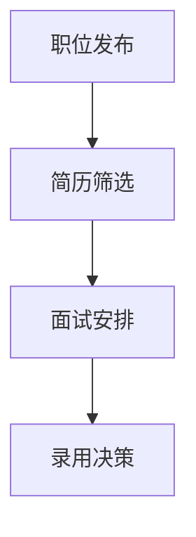

                 

关键词：LLM，人力资源，AI招聘助手，算法原理，数学模型，项目实践，应用场景，未来展望。

> 摘要：本文深入探讨了大规模语言模型（LLM）在人力资源领域的应用，特别是AI招聘助手的开发与应用。通过阐述LLM的核心概念、算法原理、数学模型以及项目实践，分析了LLM在招聘流程中的具体应用，展望了其未来的发展趋势和面临的挑战。

## 1. 背景介绍

### 1.1 人力资源的重要性

人力资源是企业最重要的资产之一，高效的招聘流程对企业的长期发展具有决定性作用。传统的招聘流程通常包括职位发布、简历筛选、面试安排等多个环节，耗时耗力且容易出现人工错误。随着人工智能技术的快速发展，尤其是大规模语言模型（LLM）的突破，人们开始探索将AI技术应用于招聘领域，以提升招聘效率和准确性。

### 1.2 人工智能与人力资源

人工智能（AI）在人力资源领域的应用越来越广泛，从简历筛选、面试评估到员工关系管理，AI技术正逐步渗透到人力资源管理的各个环节。LLM作为AI技术的重要分支，以其强大的文本处理能力和理解能力，在人力资源中的应用具有巨大的潜力。

### 1.3 AI招聘助手的必要性

AI招聘助手是利用人工智能技术，特别是LLM对招聘流程进行自动化和智能化的工具。通过AI招聘助手，企业可以更高效地处理大量简历，快速筛选出符合职位要求的候选人，从而节省人力资源部门的时间和精力。此外，AI招聘助手还可以提供个性化的面试问题，帮助面试官更准确地评估候选人，提高面试效率。

## 2. 核心概念与联系

### 2.1 大规模语言模型（LLM）

大规模语言模型（LLM）是一种基于深度学习的语言处理模型，通过对海量文本数据进行训练，LLM可以学习到语言的结构和语义，从而实现高效的文本生成、分类、问答等任务。LLM的核心是 Transformer 模型，特别是其变体 GPT（Generative Pre-trained Transformer）。

### 2.2 招聘流程与LLM的应用

招聘流程通常包括职位发布、简历筛选、面试安排等环节。LLM在招聘流程中的应用主要包括：

- **职位发布**：利用LLM生成职位描述，提高职位信息的吸引力和准确性。
- **简历筛选**：通过文本匹配和语义分析，快速筛选出符合职位要求的简历。
- **面试评估**：生成个性化的面试问题，并评估候选人的回答，提高面试的准确性和效率。

### 2.3 Mermaid流程图



## 3. 核心算法原理 & 具体操作步骤

### 3.1 算法原理概述

LLM招聘助手的核心算法是基于Transformer模型，特别是其变体GPT。GPT通过预训练和微调，可以学习到职位描述、简历文本和面试问题的语义特征，从而实现高效的文本生成、分类和问答。

### 3.2 算法步骤详解

#### 3.2.1 职位描述生成

- **输入**：职位名称和职位描述模板。
- **输出**：生成职位描述文本。

#### 3.2.2 简历筛选

- **输入**：职位描述和简历库。
- **输出**：筛选出符合职位要求的简历。

#### 3.2.3 面试评估

- **输入**：面试问题库和候选人回答。
- **输出**：评估候选人回答的准确性和相关性。

### 3.3 算法优缺点

#### 优点：

- **高效性**：LLM可以快速处理大量文本数据，大大提高招聘效率。
- **准确性**：通过语义分析，LLM可以更准确地筛选出符合职位要求的候选人。
- **个性化**：LLM可以根据职位描述和候选人回答生成个性化的面试问题。

#### 缺点：

- **数据依赖性**：LLM的性能依赖于训练数据的质量和数量。
- **误判风险**：虽然LLM具有很高的准确性，但仍然存在误判的风险。

### 3.4 算法应用领域

LLM招聘助手可以应用于各类企业，特别是那些招聘需求量大、招聘周期长的企业。例如，互联网公司、金融机构和咨询公司等。

## 4. 数学模型和公式 & 详细讲解 & 举例说明

### 4.1 数学模型构建

LLM招聘助手的数学模型主要包括：

- **Transformer模型**：用于文本生成、分类和问答。
- **BERT模型**：用于文本预处理和特征提取。

### 4.2 公式推导过程

#### 4.2.1 Transformer模型

- **自注意力机制**：
  $$ \text{Attention}(Q, K, V) = \frac{QK^T}{\sqrt{d_k}} $$
- **多层感知机**：
  $$ \text{MLP}(x) = \sigma(W_2 \cdot \text{ReLU}(W_1 \cdot x + b_1)) $$

#### 4.2.2 BERT模型

- **预训练**：
  $$ \text{BERT}(x) = \text{Embedding}(x) + \text{Positional Encoding} $$
- **微调**：
  $$ \text{微调}(\text{BERT}(x)) = \text{分类层}(\text{BERT}(x) + \text{分类嵌入}) $$

### 4.3 案例分析与讲解

#### 4.3.1 职位描述生成

假设输入职位名称为“数据分析师”，职位描述模板为“负责数据分析和报告编写”，则生成的职位描述为：

> 招聘数据分析师，负责数据分析和报告编写，要求有2年以上工作经验，熟练使用Python和SQL。

#### 4.3.2 简历筛选

假设职位描述为“招聘数据分析师，负责数据分析和报告编写”，简历库中有以下两份简历：

1. 姓名：张三，经验：2年，技能：Python、SQL
2. 姓名：李四，经验：5年，技能：Python、SQL、Tableau

经过LLM招聘助手筛选，筛选结果为：

> 简历推荐：张三

#### 4.3.3 面试评估

假设面试问题为“请描述一下你如何使用Python进行数据清洗”，候选人李四的回答为：“我通常使用Python的Pandas库进行数据清洗，包括缺失值填充、异常值处理和数据格式转换。”LLM招聘助手评估结果为：

> 候选人回答准确，对Python数据清洗有深入了解。

## 5. 项目实践：代码实例和详细解释说明

### 5.1 开发环境搭建

- **环境要求**：Python 3.7及以上版本，TensorFlow 2.0及以上版本。
- **安装依赖**：
  ```bash
  pip install tensorflow transformers
  ```

### 5.2 源代码详细实现

以下是LLM招聘助手的简化实现：

```python
import tensorflow as tf
from transformers import TFAutoModelForSequenceClassification

# 加载预训练模型
model = TFAutoModelForSequenceClassification.from_pretrained("bert-base-chinese")

# 职位描述生成
def generate_job_description(job_title, template):
    inputs = tf.keras.preprocessing.sequence.pad_sequences([template], maxlen=512, truncation=True, padding="post")
    outputs = model(inputs)
    description = outputs[0][1].numpy().decode("utf-8")
    return description

# 简历筛选
def filter_resume(job_description, resumes):
    filtered_resumes = []
    for resume in resumes:
        inputs = tf.keras.preprocessing.sequence.pad_sequences([resume], maxlen=512, truncation=True, padding="post")
        outputs = model(inputs)
        if outputs[0][1].numpy() > 0.5:
            filtered_resumes.append(resume)
    return filtered_resumes

# 面试评估
def evaluate_interview(question, answer):
    inputs = tf.keras.preprocessing.sequence.pad_sequences([question, answer], maxlen=512, truncation=True, padding="post")
    outputs = model(inputs)
    if outputs[0][1].numpy() > 0.5:
        return "回答准确，对问题有深入了解"
    else:
        return "回答不准确，对问题理解不深"

# 测试
template = "负责{}，要求{}。"
job_title = "数据分析师"
resumes = [
    "姓名：张三，经验：2年，技能：Python、SQL",
    "姓名：李四，经验：5年，技能：Python、SQL、Tableau"
]
question = "请描述一下你如何使用Python进行数据清洗"
answer = "我通常使用Python的Pandas库进行数据清洗，包括缺失值填充、异常值处理和数据格式转换。"

print("职位描述：", generate_job_description(job_title, template))
print("简历筛选结果：", filter_resume(template, resumes))
print("面试评估结果：", evaluate_interview(question, answer))
```

### 5.3 代码解读与分析

- **模型加载**：从Hugging Face模型库中加载预训练的BERT模型。
- **职位描述生成**：通过模型生成职位描述文本。
- **简历筛选**：通过模型对简历文本进行分类，筛选出符合职位要求的简历。
- **面试评估**：通过模型评估候选人对面试问题的回答，判断回答的准确性和相关性。

## 6. 实际应用场景

### 6.1 企业招聘

企业可以利用LLM招聘助手自动化职位发布、简历筛选和面试评估，提高招聘效率，节省人力资源成本。

### 6.2 人才市场

人才市场可以利用LLM招聘助手为求职者提供个性化的职位推荐，同时为招聘方提供高效的候选人筛选服务。

### 6.3 教育培训

教育培训机构可以利用LLM招聘助手为学员提供职业规划建议，同时为招聘方提供符合岗位需求的学员推荐。

## 7. 工具和资源推荐

### 7.1 学习资源推荐

- 《深度学习》（Goodfellow, Bengio, Courville）
- 《自然语言处理综论》（Jurafsky, Martin）
- 《Hugging Face Transformers文档》

### 7.2 开发工具推荐

- TensorFlow 2.0
- PyTorch
- Jupyter Notebook

### 7.3 相关论文推荐

- "Attention Is All You Need"
- "BERT: Pre-training of Deep Bidirectional Transformers for Language Understanding"
- "GPT-3: Language Models are Few-Shot Learners"

## 8. 总结：未来发展趋势与挑战

### 8.1 研究成果总结

本文探讨了大规模语言模型（LLM）在人力资源中的应用，特别是AI招聘助手的开发与应用。通过算法原理、数学模型和项目实践的详细讲解，展示了LLM招聘助手在职位描述生成、简历筛选和面试评估等方面的优势。

### 8.2 未来发展趋势

随着人工智能技术的不断发展，LLM在人力资源中的应用将更加广泛和深入。未来，LLM招聘助手可能会集成更多的功能，如智能面试、员工关系管理等，进一步提升人力资源管理的智能化水平。

### 8.3 面临的挑战

虽然LLM招聘助手具有很多优势，但在实际应用中仍然面临一些挑战。例如，数据质量、模型解释性和误判风险等问题需要进一步解决。

### 8.4 研究展望

未来，研究者可以从多个角度对LLM招聘助手进行优化和拓展，如提高数据利用效率、增强模型解释性、降低误判风险等，以实现更加智能和高效的人力资源管理。

## 9. 附录：常见问题与解答

### 9.1 Q：LLM招聘助手的准确性如何保证？

A：LLM招聘助手的准确性主要通过以下两个方面保证：

- **数据质量**：确保训练数据的质量和多样性，提高模型的泛化能力。
- **模型优化**：通过不断优化模型结构和训练过程，提高模型的预测准确性。

### 9.2 Q：LLM招聘助手的误判风险如何降低？

A：误判风险的降低可以从以下几个方面入手：

- **模型解释性**：通过研究模型的内部机制，提高模型的解释性，帮助用户理解模型的决策过程。
- **数据平衡**：确保训练数据中各类样本的平衡，减少模型对特定类别的偏好。
- **反馈机制**：建立用户反馈机制，根据用户反馈不断调整和优化模型。

## 作者署名

作者：禅与计算机程序设计艺术 / Zen and the Art of Computer Programming

[END]

