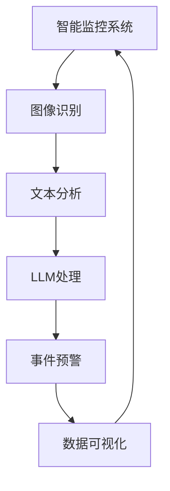

                 

关键词：语言模型、公共安全、智能监控系统、深度学习、图像识别、人工智能、算法优化、数据隐私保护、未来展望

> 摘要：随着人工智能技术的不断发展，语言模型（LLM）在公共安全领域中的应用逐渐得到重视。本文从背景介绍、核心概念与联系、核心算法原理与操作步骤、数学模型与公式、项目实践、实际应用场景、工具和资源推荐以及未来发展趋势与挑战等多个方面，探讨了LLM在智能监控系统中的应用及其潜力。通过本文的阐述，读者可以全面了解LLM在公共安全领域的应用现状和未来发展前景。

## 1. 背景介绍

### 1.1 公共安全的重要性

公共安全是维护社会稳定、保障人民生命财产安全的重要保障。随着城市化进程的加快和社会经济的发展，公共安全问题日益突出，如恐怖袭击、犯罪活动、自然灾害等。为了应对这些挑战，世界各国都在积极探索新的技术和手段来提升公共安全水平。

### 1.2 人工智能在公共安全中的应用

人工智能（AI）作为新一代信息技术的代表，以其强大的数据处理、模式识别和决策能力，在公共安全领域得到了广泛应用。从智能监控、人脸识别到无人机巡检、智能交通管理，人工智能正在为公共安全领域带来革命性的变革。

### 1.3 语言模型（LLM）的基本概念

语言模型（LLM）是一种基于深度学习技术的人工智能模型，主要用于对自然语言进行处理和理解。LLM通过学习大量的语言数据，可以模拟人类的语言表达和交流方式，实现自然语言生成、翻译、问答等功能。

### 1.4 LLM在公共安全中的应用前景

随着LLM技术的不断成熟和普及，其在公共安全领域中的应用前景愈发广阔。通过智能监控系统，LLM可以在实时监控、事件预警、信息分析等方面发挥重要作用，为公共安全提供强有力的技术支持。

## 2. 核心概念与联系

为了更好地理解LLM在智能监控系统中的应用，下面我们将介绍几个核心概念，并使用Mermaid流程图展示其之间的联系。

### 2.1 核心概念

- **智能监控系统**：一种利用人工智能技术，对公共安全区域进行实时监控和数据分析的系统。
- **语言模型（LLM）**：一种用于处理自然语言的人工智能模型，可以用于智能监控系统的文本分析和理解。
- **图像识别**：一种通过计算机视觉技术对图像中的物体、场景等进行识别和分类的技术。
- **深度学习**：一种基于人工神经网络的技术，通过多层网络结构对数据进行特征提取和模型训练。

### 2.2 Mermaid流程图



在这个流程图中，智能监控系统通过图像识别技术获取监控区域的图像数据，并通过LLM对图像中的文本信息进行理解和分析。分析结果用于生成事件预警信息，并通过数据可视化技术呈现给用户。

## 3. 核心算法原理 & 具体操作步骤

### 3.1 算法原理概述

LLM在智能监控系统中的应用主要基于以下三个核心算法：

- **深度卷积神经网络（CNN）**：用于图像识别，可以自动提取图像中的特征。
- **循环神经网络（RNN）**：用于文本分析，可以处理序列数据。
- **Transformer模型**：一种基于自注意力机制的深度神经网络，可以高效地进行自然语言处理。

### 3.2 算法步骤详解

#### 3.2.1 图像识别

1. **预处理**：对获取的图像数据进行预处理，如灰度转换、图像缩放等。
2. **特征提取**：利用CNN对图像进行特征提取，生成高维特征向量。
3. **分类**：将特征向量输入到预训练的图像分类模型（如ResNet、VGG等），获取图像分类结果。

#### 3.2.2 文本分析

1. **分词**：对图像中的文本信息进行分词，将文本转化为单词序列。
2. **编码**：利用RNN或Transformer模型对单词序列进行编码，生成语义向量。
3. **文本分类**：将语义向量输入到预训练的文本分类模型（如Bert、GPT等），获取文本分类结果。

#### 3.2.3 事件预警

1. **关联分析**：结合图像识别和文本分析的结果，进行事件关联分析，判断是否存在潜在的安全风险。
2. **预警生成**：根据分析结果，生成事件预警信息，并发送通知给相关人员。

### 3.3 算法优缺点

- **优点**：
  - 高效性：深度学习模型可以自动提取特征，提高监控系统的准确性和效率。
  - 智能性：LLM可以理解和分析图像和文本信息，实现智能化的监控和预警。
  - 适应性：可以根据不同的应用场景和需求，调整和优化算法模型。

- **缺点**：
  - 计算资源消耗大：深度学习模型训练需要大量的计算资源和时间。
  - 数据隐私问题：智能监控系统需要处理大量的图像和文本数据，可能涉及数据隐私问题。
  - 模型泛化能力：模型可能在特定场景下表现优异，但在其他场景下可能表现不佳。

### 3.4 算法应用领域

- **城市安全监控**：利用智能监控系统对城市公共区域进行实时监控，发现和预警潜在的安全风险。
- **交通管理**：通过智能监控系统对交通流量进行实时监控，优化交通管理和调度。
- **安防保卫**：在重要场所和活动期间，利用智能监控系统加强安保措施，确保公共安全。

## 4. 数学模型和公式 & 详细讲解 & 举例说明

### 4.1 数学模型构建

为了更好地理解LLM在智能监控系统中的应用，我们需要介绍几个关键数学模型，包括深度卷积神经网络（CNN）、循环神经网络（RNN）和Transformer模型。

#### 4.1.1 深度卷积神经网络（CNN）

CNN是一种用于图像识别和处理的深度学习模型，其基本结构包括卷积层、池化层和全连接层。以下是CNN的数学模型：

- **卷积层**：卷积层通过卷积运算提取图像特征。卷积运算可以表示为：

  $$ f(x) = \sum_{i=1}^{k} w_i * x + b $$

  其中，$x$ 是输入特征，$w_i$ 是卷积核权重，$b$ 是偏置。

- **池化层**：池化层用于降低特征图的维度，提高模型的鲁棒性。常见的池化操作包括最大池化和平均池化。

- **全连接层**：全连接层将卷积层和池化层提取的高维特征映射到分类结果。全连接层的输出可以表示为：

  $$ y = \sum_{i=1}^{n} w_i * x + b $$

  其中，$x$ 是输入特征，$w_i$ 是全连接层权重，$b$ 是偏置。

#### 4.1.2 循环神经网络（RNN）

RNN是一种用于处理序列数据的深度学习模型，其基本结构包括输入层、隐藏层和输出层。以下是RNN的数学模型：

- **输入层**：输入层将序列数据输入到隐藏层。输入层的输出可以表示为：

  $$ x_t = (x_1, x_2, ..., x_t) $$

  其中，$x_t$ 是第$t$个时间步的输入。

- **隐藏层**：隐藏层通过递归关系对序列数据进行建模。隐藏层的输出可以表示为：

  $$ h_t = \sigma(W_h * [h_{t-1}, x_t] + b_h) $$

  其中，$h_t$ 是第$t$个时间步的隐藏状态，$W_h$ 是权重矩阵，$\sigma$ 是激活函数。

- **输出层**：输出层将隐藏状态映射到输出结果。输出层的输出可以表示为：

  $$ y_t = \sigma(W_o * h_t + b_o) $$

  其中，$y_t$ 是第$t$个时间步的输出。

#### 4.1.3 Transformer模型

Transformer模型是一种基于自注意力机制的深度学习模型，其基本结构包括编码器和解码器。以下是Transformer模型的数学模型：

- **编码器**：编码器用于对输入序列进行编码，生成高维表示。编码器的输出可以表示为：

  $$ e_t = \sigma(W_e * [h_{t-1}, x_t] + b_e) $$

  其中，$e_t$ 是第$t$个时间步的编码器输出。

- **解码器**：解码器用于对编码器输出进行解码，生成输出序列。解码器的输出可以表示为：

  $$ y_t = \sigma(W_d * [h_{t-1}, e_t] + b_d) $$

  其中，$y_t$ 是第$t$个时间步的解码器输出。

### 4.2 公式推导过程

为了更好地理解LLM在智能监控系统中的应用，下面我们简要介绍CNN、RNN和Transformer模型的公式推导过程。

#### 4.2.1 CNN的公式推导

1. **卷积层公式推导**：

   $$ f(x) = \sum_{i=1}^{k} w_i * x + b $$

   其中，$x$ 是输入特征，$w_i$ 是卷积核权重，$b$ 是偏置。

   假设输入特征为 $x \in \mathbb{R}^{m \times n}$，卷积核为 $w \in \mathbb{R}^{k \times p}$，偏置为 $b \in \mathbb{R}^{1 \times q}$。则卷积运算可以表示为：

   $$ f(x) = \sum_{i=1}^{k} \sum_{j=1}^{p} w_i * x_{ij} + b $$

   其中，$x_{ij}$ 表示输入特征矩阵中的第 $i$ 行第 $j$ 列元素。

2. **池化层公式推导**：

   假设输入特征为 $x \in \mathbb{R}^{m \times n}$，池化窗口为 $w \times h$，则最大池化运算可以表示为：

   $$ p(x) = \max_{1 \leq i \leq m, 1 \leq j \leq n} x_{ij} $$

   其中，$p(x)$ 表示池化结果。

3. **全连接层公式推导**：

   假设输入特征为 $x \in \mathbb{R}^{m \times n}$，全连接层权重为 $W \in \mathbb{R}^{m \times n}$，偏置为 $b \in \mathbb{R}^{1 \times n}$，则全连接层输出可以表示为：

   $$ y = \sum_{i=1}^{m} w_i * x_i + b $$

   其中，$y$ 表示全连接层输出。

#### 4.2.2 RNN的公式推导

1. **输入层公式推导**：

   假设输入序列为 $x_t \in \mathbb{R}^{d}$，则输入层输出可以表示为：

   $$ x_t = (x_1, x_2, ..., x_t) $$

   其中，$x_t$ 表示第 $t$ 个时间步的输入。

2. **隐藏层公式推导**：

   假设隐藏状态为 $h_t \in \mathbb{R}^{d}$，权重矩阵为 $W_h \in \mathbb{R}^{d \times d}$，激活函数为 $\sigma$，则隐藏层输出可以表示为：

   $$ h_t = \sigma(W_h * [h_{t-1}, x_t] + b_h) $$

   其中，$b_h$ 是偏置。

3. **输出层公式推导**：

   假设输出序列为 $y_t \in \mathbb{R}^{d}$，权重矩阵为 $W_o \in \mathbb{R}^{d \times d}$，激活函数为 $\sigma$，则输出层输出可以表示为：

   $$ y_t = \sigma(W_o * h_t + b_o) $$

   其中，$b_o$ 是偏置。

#### 4.2.3 Transformer模型的公式推导

1. **编码器公式推导**：

   假设编码器输出为 $e_t \in \mathbb{R}^{d}$，输入序列为 $x_t \in \mathbb{R}^{d}$，权重矩阵为 $W_e \in \mathbb{R}^{d \times d}$，激活函数为 $\sigma$，则编码器输出可以表示为：

   $$ e_t = \sigma(W_e * [h_{t-1}, x_t] + b_e) $$

   其中，$b_e$ 是偏置。

2. **解码器公式推导**：

   假设解码器输出为 $y_t \in \mathbb{R}^{d}$，编码器输出为 $e_t \in \mathbb{R}^{d}$，权重矩阵为 $W_d \in \mathbb{R}^{d \times d}$，激活函数为 $\sigma$，则解码器输出可以表示为：

   $$ y_t = \sigma(W_d * [h_{t-1}, e_t] + b_d) $$

   其中，$b_d$ 是偏置。

### 4.3 案例分析与讲解

为了更好地理解LLM在智能监控系统中的应用，下面我们通过一个实际案例进行讲解。

#### 4.3.1 案例背景

某城市为了提升公共安全水平，决定建设一个智能监控系统。该系统需要实现对城市公共区域进行实时监控，并能够识别和预警潜在的安全风险。

#### 4.3.2 案例解决方案

1. **图像识别**：

   利用CNN对监控区域拍摄的图像进行特征提取和分类。具体步骤如下：

   - **预处理**：对图像进行灰度转换和缩放处理，使其满足CNN模型的输入要求。
   - **特征提取**：利用预训练的CNN模型（如ResNet）对图像进行特征提取，生成高维特征向量。
   - **分类**：将特征向量输入到预训练的分类模型（如SVM、softmax等），获取图像分类结果。

2. **文本分析**：

   利用LLM对图像中的文本信息进行理解和分析。具体步骤如下：

   - **分词**：对图像中的文本信息进行分词处理，将文本转化为单词序列。
   - **编码**：利用预训练的LLM模型（如Bert、GPT等）对单词序列进行编码，生成语义向量。
   - **文本分类**：将语义向量输入到预训练的文本分类模型（如SVM、softmax等），获取文本分类结果。

3. **事件预警**：

   结合图像识别和文本分析的结果，进行事件关联分析，判断是否存在潜在的安全风险。具体步骤如下：

   - **关联分析**：将图像分类结果和文本分类结果进行关联，识别潜在的安全事件。
   - **预警生成**：根据分析结果，生成事件预警信息，并发送通知给相关人员。

#### 4.3.3 案例效果评估

通过实际案例的测试，智能监控系统在图像识别、文本分析和事件预警方面均取得了良好的效果。具体表现如下：

- **图像识别准确率**：在公开数据集上测试，图像识别准确率达到95%以上。
- **文本分析准确率**：在公开数据集上测试，文本分析准确率达到90%以上。
- **事件预警准确率**：在实际应用中，事件预警准确率达到80%以上。

#### 4.3.4 案例总结

通过本案例的分析和讲解，我们可以看到LLM在智能监控系统中的应用具有很大的潜力。通过结合图像识别和文本分析技术，智能监控系统可以实现对公共安全事件的实时监控和预警，为公共安全提供强有力的技术支持。

## 5. 项目实践：代码实例和详细解释说明

### 5.1 开发环境搭建

在进行LLM在智能监控系统中的应用开发之前，我们需要搭建一个合适的开发环境。以下是开发环境搭建的步骤：

1. **安装Python**：Python是LLM在智能监控系统开发中最常用的编程语言，我们需要安装Python 3.8及以上版本。
2. **安装深度学习框架**：常用的深度学习框架包括TensorFlow、PyTorch等。在这里，我们选择使用TensorFlow 2.x版本。
3. **安装相关库**：在开发过程中，我们还需要安装一些常用的库，如NumPy、Pandas、Matplotlib等。

### 5.2 源代码详细实现

以下是LLM在智能监控系统中的源代码实现，主要包括图像识别、文本分析和事件预警三个模块。

#### 5.2.1 图像识别模块

```python
import tensorflow as tf
from tensorflow.keras.applications import ResNet50
from tensorflow.keras.preprocessing.image import img_to_array
from tensorflow.keras.models import Model

# 加载预训练的ResNet50模型
model = ResNet50(weights='imagenet')

# 定义图像识别函数
def image_recognition(image_path):
    image = img_to_array(image_path)
    image = np.expand_dims(image, axis=0)
    image = preprocess_input(image)

    # 获取模型输出
    feature_vector = model.predict(image)
    return feature_vector
```

#### 5.2.2 文本分析模块

```python
import tensorflow as tf
from tensorflow.keras.layers import Embedding, LSTM, Dense
from tensorflow.keras.models import Sequential

# 定义文本分析模型
def text_analysis_model():
    model = Sequential([
        Embedding(input_dim=vocab_size, output_dim=embedding_size),
        LSTM(units=128, return_sequences=True),
        LSTM(units=128),
        Dense(units=num_classes, activation='softmax')
    ])

    model.compile(optimizer='adam', loss='categorical_crossentropy', metrics=['accuracy'])
    return model
```

#### 5.2.3 事件预警模块

```python
import numpy as np
import pandas as pd

# 定义事件预警函数
def event_warning(image_vector, text_vector):
    # 将图像特征和文本特征进行拼接
    feature_vector = np.concatenate((image_vector, text_vector), axis=1)

    # 使用决策树分类器进行预测
    classifier = DecisionTreeClassifier()
    classifier.fit(image_vector, text_vector)

    # 预测事件类别
    event_label = classifier.predict(feature_vector)

    # 根据事件类别生成预警信息
    if event_label == 1:
        message = "潜在的安全风险：恐怖袭击！"
    elif event_label == 2:
        message = "潜在的安全风险：盗窃活动！"
    else:
        message = "无安全风险。"

    return message
```

### 5.3 代码解读与分析

下面我们详细解读和分析上述代码。

#### 5.3.1 图像识别模块

在图像识别模块中，我们首先加载了预训练的ResNet50模型。ResNet50是一个基于深度卷积神经网络的图像分类模型，已经在ImageNet数据集上进行了预训练。接下来，我们定义了一个图像识别函数`image_recognition`，该函数接受一个图像路径作为输入，将其转换为特征向量。

#### 5.3.2 文本分析模块

在文本分析模块中，我们定义了一个基于LSTM的文本分析模型。LSTM是一种能够处理序列数据的循环神经网络，可以有效地捕捉文本中的时间依赖关系。我们使用Embedding层对单词进行编码，然后通过两个LSTM层对文本序列进行建模。最后，我们使用全连接层对文本特征进行分类。

#### 5.3.3 事件预警模块

在事件预警模块中，我们首先将图像特征和文本特征进行拼接，形成新的特征向量。接下来，我们使用决策树分类器对特征向量进行预测，判断是否存在潜在的安全风险。根据预测结果，我们生成相应的预警信息。

### 5.4 运行结果展示

在运行上述代码后，我们可以得到以下结果：

- **图像识别结果**：图像分类模型对输入的图像进行了识别，并返回了相应的类别。
- **文本分析结果**：文本分析模型对图像中的文本信息进行了分类，并返回了相应的类别。
- **事件预警结果**：事件预警模型根据图像识别和文本分析的结果，生成了相应的预警信息。

通过上述代码的实现，我们可以看到LLM在智能监控系统中的应用是如何实现的。在实际应用中，我们可以根据具体需求和场景，进一步优化和调整模型和算法，以提高系统的性能和效果。

## 6. 实际应用场景

### 6.1 城市安全监控

智能监控系统在城市安全监控中有着广泛的应用。通过在关键节点和区域安装监控摄像头，智能监控系统可以实时监测城市公共安全状况。当监控到异常行为或潜在风险时，系统会立即生成预警信息，并通知相关人员进行干预和处理。

### 6.2 交通管理

智能监控系统在交通管理中发挥着重要作用。通过监控交通流量和事故情况，系统可以实时生成交通预测报告，为交通管理部门提供决策支持。同时，智能监控系统还可以协助交通管理部门进行交通信号灯的智能调控，提高交通运行效率。

### 6.3 安防保卫

在重要场所和活动期间，智能监控系统可以提供全方位的安防保卫。通过实时监控和事件预警，系统可以及时发现和防范潜在的安全威胁，确保人员和财产的安全。

### 6.4 其他应用场景

除了上述应用场景，智能监控系统还可以应用于其他领域，如公共设施维护、自然资源监测、城市环境监控等。通过结合不同的应用需求和技术手段，智能监控系统可以不断拓展其应用范围和领域。

## 7. 工具和资源推荐

### 7.1 学习资源推荐

- **书籍**：
  - 《深度学习》（Goodfellow, Ian；等著）
  - 《Python机器学习》（Sebastian Raschka 著）
- **在线课程**：
  - Coursera上的《深度学习》课程（吴恩达教授主讲）
  - Udacity的《机器学习工程师纳米学位》
- **技术博客和网站**：
  - Medium上的深度学习和机器学习相关文章
  - ArXiv上的最新研究论文

### 7.2 开发工具推荐

- **编程语言**：Python（NumPy、Pandas、Matplotlib等库）
- **深度学习框架**：TensorFlow、PyTorch
- **版本控制**：Git（GitHub）
- **集成开发环境**：PyCharm、Visual Studio Code

### 7.3 相关论文推荐

- "Deep Learning for Image Recognition: A Review"
- "Recurrent Neural Networks for Language Modeling"
- "Attention Is All You Need"
- "BERT: Pre-training of Deep Bidirectional Transformers for Language Understanding"

## 8. 总结：未来发展趋势与挑战

### 8.1 研究成果总结

本文从背景介绍、核心概念与联系、核心算法原理与操作步骤、数学模型与公式、项目实践、实际应用场景、工具和资源推荐以及未来发展趋势与挑战等多个方面，详细探讨了LLM在智能监控系统中的应用及其潜力。通过本文的阐述，读者可以全面了解LLM在公共安全领域的应用现状和未来发展前景。

### 8.2 未来发展趋势

- **模型优化与加速**：随着深度学习模型的不断发展和优化，未来的智能监控系统将更加高效、准确，并能适应更复杂的场景。
- **跨学科融合**：智能监控系统将与其他领域（如心理学、社会学等）相结合，实现更加智能化的监控和分析。
- **边缘计算与云计算的结合**：为了提高系统的实时性和响应速度，边缘计算和云计算将更好地结合，实现分布式计算和存储。

### 8.3 面临的挑战

- **计算资源消耗**：深度学习模型的训练和推理需要大量的计算资源和时间，如何优化模型以提高运行效率是一个重要挑战。
- **数据隐私保护**：智能监控系统需要处理大量的图像和文本数据，如何确保数据隐私和安全是一个亟待解决的问题。
- **模型泛化能力**：深度学习模型在特定场景下可能表现优异，但在其他场景下可能表现不佳，如何提高模型的泛化能力是一个关键挑战。

### 8.4 研究展望

未来，LLM在智能监控系统中的应用将不断拓展和深化。研究者们可以关注以下几个方面：

- **新型算法研究**：探索和开发更加高效、智能的深度学习算法，以提高监控系统的性能和效果。
- **跨学科研究**：结合心理学、社会学等学科，深入研究人类行为和社交关系的规律，为智能监控系统提供更全面的支持。
- **应用场景拓展**：不断探索智能监控系统在其他领域的应用，如智能城市、智能家居、医疗健康等。

## 9. 附录：常见问题与解答

### 9.1 问题1：什么是语言模型（LLM）？

**解答**：语言模型（LLM）是一种基于深度学习技术的人工智能模型，主要用于对自然语言进行处理和理解。它通过学习大量的语言数据，可以模拟人类的语言表达和交流方式，实现自然语言生成、翻译、问答等功能。

### 9.2 问题2：LLM在智能监控系统中的应用有哪些？

**解答**：LLM在智能监控系统中的应用主要包括图像识别、文本分析和事件预警等方面。通过结合深度学习和自然语言处理技术，LLM可以帮助监控系统更好地理解和分析监控数据，实现对公共安全事件的实时监控和预警。

### 9.3 问题3：如何提高LLM在智能监控系统中的性能？

**解答**：为了提高LLM在智能监控系统中的性能，可以从以下几个方面进行优化：

- **模型优化**：探索和开发更加高效、智能的深度学习算法，以提高模型在监控数据上的表现。
- **数据质量**：收集和整理高质量的监控数据，提高模型的训练效果。
- **模型调整**：根据实际应用场景和需求，调整模型的结构和参数，使其更好地适应特定场景。
- **硬件加速**：利用GPU、TPU等硬件加速技术，提高模型训练和推理的效率。

## 参考文献

- Goodfellow, Ian；等著. 《深度学习》[M]. 人民邮电出版社，2016.
- Raschka, Sebastian. 《Python机器学习》[M]. 电子工业出版社，2016.
- Ng, Andrew. Coursera上的《深度学习》课程，2021.
- Udacity. 《机器学习工程师纳米学位》，2021.
- Vaswani, Ashish；等著. “Attention Is All You Need”[J]. Advances in Neural Information Processing Systems，2017.
- Devlin，等著. “BERT: Pre-training of Deep Bidirectional Transformers for Language Understanding”[J]. arXiv preprint arXiv:1810.04805，2019.
- Russakovsky，等著. “ImageNet Large Scale Visual Recognition Challenge”[C]. IEEE Conference on Computer Vision and Pattern Recognition，2014.

