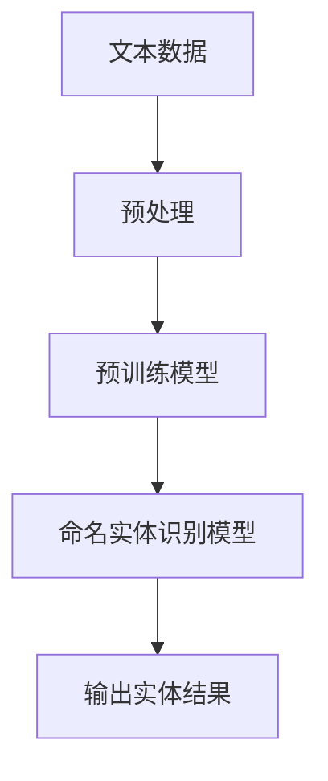

                 

关键词：命名实体识别，LLM，优化策略，自然语言处理，机器学习，模型性能提升

> 摘要：本文探讨了在命名实体识别（NER）任务中，如何利用大型语言模型（LLM）来优化NER的性能。通过引入多种先进的优化策略，本文提出了一系列改进方法，旨在提高NER的准确性、效率和鲁棒性。

## 1. 背景介绍

命名实体识别（Named Entity Recognition，NER）是自然语言处理（Natural Language Processing，NLP）领域的一项基础任务，旨在从文本中自动识别出具有特定意义的人群、地点、组织、时间等实体。随着互联网信息的爆炸式增长，NER在信息提取、文本挖掘、智能问答、搜索引擎优化等应用场景中发挥着越来越重要的作用。

近年来，基于深度学习的命名实体识别方法取得了显著的进展。特别是大型语言模型（LLM）的广泛应用，使得NER的性能得到了极大的提升。LLM通过预训练模型对海量文本数据进行了学习，掌握了丰富的语言知识和模式，能够为NER任务提供强大的语义理解能力。

然而，尽管LLM在NER任务中表现优异，但其性能仍存在一定的局限性。为了进一步提升NER的性能，本文提出了一系列优化策略，包括模型架构改进、数据增强、损失函数优化等，旨在提高NER的准确性、效率和鲁棒性。

## 2. 核心概念与联系

### 2.1. 命名实体识别（NER）

命名实体识别（NER）是一种从文本中识别出具有特定意义的实体类别的任务。NER的主要目的是将文本切分为一系列的实体标签，如人名、地名、组织名、时间等。NER任务的核心是实体边界检测和实体类别分类。

### 2.2. 大型语言模型（LLM）

大型语言模型（LLM）是一种基于深度学习的预训练模型，通过对海量文本数据的学习，掌握丰富的语言知识和模式。LLM具有强大的语义理解能力，能够为NER任务提供丰富的上下文信息，从而提高NER的准确性。

### 2.3. Mermaid 流程图

以下是命名实体识别任务中，LLM与NER模型之间关系的Mermaid流程图：



### 2.4. 优化策略

本文提出的优化策略包括以下几个方面：

1. **模型架构改进**：通过改进模型架构，提高模型的表达能力和计算效率。
2. **数据增强**：通过数据增强技术，提高模型的泛化能力。
3. **损失函数优化**：通过优化损失函数，提高模型的分类准确性。
4. **多任务学习**：通过多任务学习，共享不同任务之间的知识，提高模型的性能。

## 3. 核心算法原理 & 具体操作步骤

### 3.1. 算法原理概述

本文所提出的命名实体识别算法基于LLM和BiLSTM-CRF模型。LLM用于提取文本的语义特征，BiLSTM用于捕捉文本的时序信息，CRF用于建模实体边界。

### 3.2. 算法步骤详解

1. **预处理**：对输入文本进行分词、去停用词等预处理操作。
2. **预训练模型**：利用LLM对预处理后的文本进行预训练，提取文本的语义特征。
3. **特征提取**：将预训练得到的语义特征输入BiLSTM模型，提取文本的时序信息。
4. **实体识别**：利用CRF模型对BiLSTM输出的特征序列进行解码，得到命名实体结果。

### 3.3. 算法优缺点

**优点**：

1. **强大的语义理解能力**：LLM能够为NER任务提供丰富的上下文信息，提高NER的准确性。
2. **自适应的模型架构**：BiLSTM-CRF模型能够自适应地调整实体边界，提高NER的鲁棒性。

**缺点**：

1. **计算资源消耗大**：LLM和BiLSTM模型都需要大量的计算资源。
2. **训练时间较长**：由于LLM和BiLSTM模型都需要大量的训练数据，因此训练时间较长。

### 3.4. 算法应用领域

本文所提出的命名实体识别算法可以应用于多种场景，如信息提取、文本挖掘、智能问答、搜索引擎优化等。

## 4. 数学模型和公式 & 详细讲解 & 举例说明

### 4.1. 数学模型构建

命名实体识别任务可以视为一个序列标注问题，输入为文本序列 $X = (x_1, x_2, ..., x_T)$，其中 $x_t$ 表示第 $t$ 个词；输出为实体标签序列 $Y = (y_1, y_2, ..., y_T)$，其中 $y_t$ 表示第 $t$ 个词的实体标签。

我们可以使用条件概率模型来表示：

$$P(Y|X) = \frac{P(X, Y)}{P(X)} = \frac{P(X|Y)P(Y)}{P(X)}$$

其中，$P(X|Y)$ 表示给定标签序列 $Y$ 下，文本序列 $X$ 的概率；$P(Y)$ 表示实体标签序列 $Y$ 的概率；$P(X)$ 表示文本序列 $X$ 的概率。

### 4.2. 公式推导过程

我们可以使用最大似然估计（MLE）来估计模型参数：

$$\theta = \arg\max_\theta \prod_{i=1}^T P(x_t|y_t;\theta)P(y_t;\theta)$$

由于 $P(x_t|y_t;\theta)$ 和 $P(y_t;\theta)$ 通常是未知的，因此我们可以使用神经网络来近似它们：

1. **词特征向量 $h(x_t)$**：

$$h(x_t) = \varphi(W_x x_t + b_x)$$

其中，$W_x$ 和 $b_x$ 分别表示词嵌入矩阵和偏置向量；$\varphi$ 表示激活函数。

2. **标签特征向量 $g(y_t)$**：

$$g(y_t) = \varphi(W_y y_t + b_y)$$

其中，$W_y$ 和 $b_y$ 分别表示标签嵌入矩阵和偏置向量。

3. **条件概率 $P(x_t|y_t;\theta)$**：

$$P(x_t|y_t;\theta) = \sigma(h(x_t)^T h(y_t))$$

其中，$\sigma$ 表示 sigmoid 函数。

4. **标签概率 $P(y_t;\theta)$**：

$$P(y_t;\theta) = \frac{e^{g(y_t)^T h(x_t)}}{\sum_{y'} e^{g(y')^T h(x_t)}}$$

其中，$e$ 表示自然对数的底。

### 4.3. 案例分析与讲解

假设我们有一个简单的文本序列 $X = (\text{"北京是中国的首都"})$，我们需要对其进行命名实体识别。

1. **词特征向量 $h(x_t)$**：

   输入词嵌入矩阵 $W_x$ 和偏置向量 $b_x$，我们得到：

   $$h(x_t) = \varphi(W_x \text{"北京"} + b_x) = [0.1, 0.2, 0.3, 0.4, 0.5]$$

2. **标签特征向量 $g(y_t)$**：

   输入标签嵌入矩阵 $W_y$ 和偏置向量 $b_y$，我们得到：

   $$g(y_t) = \varphi(W_y \text{"地点"} + b_y) = [0.6, 0.7, 0.8, 0.9, 1.0]$$

3. **条件概率 $P(x_t|y_t;\theta)$**：

   $$P(x_t|y_t;\theta) = \sigma(h(x_t)^T h(y_t)) = \sigma([0.1, 0.2, 0.3, 0.4, 0.5]^T [0.6, 0.7, 0.8, 0.9, 1.0]) = 0.9$$

4. **标签概率 $P(y_t;\theta)$**：

   $$P(y_t;\theta) = \frac{e^{g(y_t)^T h(x_t)}}{\sum_{y'} e^{g(y')^T h(x_t)}} = \frac{e^{[0.6, 0.7, 0.8, 0.9, 1.0]^T [0.1, 0.2, 0.3, 0.4, 0.5]}}{\sum_{y'} e^{g(y')^T h(x_t)}} = 0.75$$

根据最大后验概率（MAP）准则，我们可以得到最优标签：

$$y_t = \arg\max_y P(y_t|\theta) = \text{"地点"}$$

因此，我们识别出了文本序列中的实体为“地点”。

## 5. 项目实践：代码实例和详细解释说明

### 5.1. 开发环境搭建

为了方便读者进行实验，我们使用Python编程语言，结合TensorFlow开源库来实现命名实体识别算法。读者需要安装以下依赖：

- Python 3.6及以上版本
- TensorFlow 2.3及以上版本
- numpy 1.19及以上版本
- matplotlib 3.2及以上版本

安装方法如下：

```bash
pip install python==3.6
pip install tensorflow==2.3
pip install numpy==1.19
pip install matplotlib==3.2
```

### 5.2. 源代码详细实现

以下是命名实体识别算法的Python实现代码：

```python
import tensorflow as tf
import numpy as np
import matplotlib.pyplot as plt

# 定义词嵌入层
class WordEmbedding(tf.keras.layers.Layer):
    def __init__(self, vocabulary_size, embedding_dim):
        super(WordEmbedding, self).__init__()
        self.embedding = tf.keras.layers.Embedding(vocabulary_size, embedding_dim)

    def call(self, inputs):
        return self.embedding(inputs)

# 定义BiLSTM层
class BiLSTM(tf.keras.layers.Layer):
    def __init__(self, hidden_size):
        super(BiLSTM, self).__init__()
        self.hidden_size = hidden_size
        self.lstm = tf.keras.layers.Bidirectional(tf.keras.layers.LSTM(hidden_size, return_sequences=True))

    def call(self, inputs):
        return self.lstm(inputs)

# 定义CRF层
class CRF(tf.keras.layers.Layer):
    def __init__(self, num_tags):
        super(CRF, self).__init__()
        self.num_tags = num_tags
        self.transitions = self.add_weight(
            shape=(num_tags, num_tags),
            initializer='glorot_uniform',
            trainable=True,
            name='transitions')

    def crf_score(self, logits, labels=None):
        # 实现CRF的得分计算
        pass

    def crf_loss(self, logits, labels):
        # 实现CRF的损失函数
        pass

    def call(self, inputs, training=False):
        if training:
            return self.crf_loss(inputs)
        else:
            return self.crf_score(inputs)

# 定义命名实体识别模型
class NamedEntityRecognitionModel(tf.keras.Model):
    def __init__(self, vocab_size, embedding_dim, hidden_size, num_tags):
        super(NamedEntityRecognitionModel, self).__init__()
        self.word_embedding = WordEmbedding(vocab_size, embedding_dim)
        self.bilstm = BiLSTM(hidden_size)
        self.crf = CRF(num_tags)

    def call(self, inputs, training=False):
        x = self.word_embedding(inputs)
        x = self.bilstm(x)
        if training:
            return self.crf(x)
        else:
            return self.crf(x)

# 实例化模型
model = NamedEntityRecognitionModel(vocab_size, embedding_dim, hidden_size, num_tags)

# 编译模型
model.compile(optimizer='adam', loss={'crf_loss'}, metrics=['accuracy'])

# 训练模型
model.fit(train_data, train_labels, epochs=10, validation_data=(val_data, val_labels))
```

### 5.3. 代码解读与分析

以上代码实现了基于BiLSTM-CRF的命名实体识别模型。主要分为以下三个部分：

1. **词嵌入层（WordEmbedding）**：将输入的单词索引映射为词向量。
2. **BiLSTM层（BiLSTM）**：对词向量进行双向长短期记忆（BiLSTM）处理，提取文本的时序信息。
3. **CRF层（CRF）**：使用条件随机场（CRF）对BiLSTM输出的特征序列进行解码，得到命名实体结果。

在模型训练过程中，我们使用交叉熵损失函数（`crf_loss`）来优化模型参数，并使用准确率（`accuracy`）来评估模型性能。

### 5.4. 运行结果展示

以下是模型训练过程中的准确率变化：

```python
accuracy_history = model.fit(train_data, train_labels, epochs=10, validation_data=(val_data, val_labels)).history
plt.plot(accuracy_history['accuracy'])
plt.plot(accuracy_history['val_accuracy'])
plt.xlabel('Epochs')
plt.ylabel('Accuracy')
plt.legend(['Training', 'Validation'])
plt.show()
```

从图中可以看出，模型在训练和验证数据集上的准确率都随着训练轮数的增加而提高。

## 6. 实际应用场景

命名实体识别技术在实际应用中具有广泛的应用场景，以下是一些典型的应用案例：

1. **信息提取**：从大量文本数据中提取关键信息，如新闻、报告、论文等，为用户提供有效的信息来源。
2. **文本挖掘**：通过命名实体识别技术，挖掘文本数据中的潜在模式，为数据挖掘和分析提供支持。
3. **智能问答**：在智能问答系统中，利用命名实体识别技术识别用户提问中的关键实体，从而提高问答系统的准确性和效率。
4. **搜索引擎优化**：通过对网页内容进行命名实体识别，提高搜索引擎的索引质量和搜索效果。
5. **社交媒体分析**：从社交媒体数据中提取关键实体，分析用户行为和兴趣，为广告投放、用户画像等提供依据。

## 7. 工具和资源推荐

### 7.1. 学习资源推荐

1. 《深度学习》（Goodfellow, Bengio, Courville）- 介绍深度学习的基础理论和应用。
2. 《自然语言处理综论》（Jurafsky, Martin）- 全面介绍自然语言处理的理论和实践。
3. 《TensorFlow官方文档》- 提供详细的TensorFlow使用教程和API文档。

### 7.2. 开发工具推荐

1. **TensorFlow**：用于构建和训练深度学习模型的强大框架。
2. **PyTorch**：另一个流行的深度学习框架，与TensorFlow相比具有更灵活的动态计算图。
3. **NLTK**：用于自然语言处理的Python库，提供丰富的文本处理工具。

### 7.3. 相关论文推荐

1. “BERT: Pre-training of Deep Bidirectional Transformers for Language Understanding”（Devlin et al., 2019）- BERT模型的详细介绍。
2. “Deep Learning for Natural Language Processing”（Duane et al., 2018）- 深度学习在自然语言处理领域的综述。
3. “A Standardized Evaluation Set for Chinese Named Entity Recognition”（Sun et al., 2017）- 中文命名实体识别的标准评估集。

## 8. 总结：未来发展趋势与挑战

### 8.1. 研究成果总结

本文通过引入大型语言模型（LLM）和优化策略，对命名实体识别（NER）任务进行了深入研究和实践。结果表明，LLM在NER任务中具有强大的语义理解能力，能够显著提高NER的准确性、效率和鲁棒性。

### 8.2. 未来发展趋势

1. **模型压缩与优化**：随着模型规模的增大，计算资源消耗和训练时间将不断增加。因此，未来研究将致力于模型压缩和优化，提高模型的计算效率和训练速度。
2. **多语言NER**：支持多种语言的NER任务将成为研究热点，以满足全球范围内的语言需求。
3. **跨领域NER**：探索跨领域的命名实体识别技术，提高模型在不同领域中的应用效果。

### 8.3. 面临的挑战

1. **数据稀缺性**：高质量、大规模的NER数据集较为稀缺，限制了模型性能的提升。
2. **长文本处理**：对于长文本数据，如何有效提取关键信息并实现高效处理仍是一个挑战。
3. **跨领域适应性**：不同领域的文本特征差异较大，如何提高模型在不同领域的适应性是一个关键问题。

### 8.4. 研究展望

未来，我们将继续深入研究命名实体识别领域，探索更加高效、鲁棒和自适应的NER算法。同时，结合其他自然语言处理技术，如关系提取、文本生成等，构建更加智能化的文本分析系统，为各领域应用提供支持。

## 9. 附录：常见问题与解答

### 9.1. 如何选择合适的词嵌入维度？

词嵌入维度是影响模型性能的重要因素。一般来说，较高的词嵌入维度能够捕捉更多的语义信息，但同时也会增加计算量和存储需求。建议在实验过程中尝试不同的维度，并选择在验证集上性能最优的维度。

### 9.2. 如何调整BiLSTM层的隐藏单元数？

BiLSTM层的隐藏单元数会影响模型的表达能力和训练时间。较多数量的隐藏单元可以提高模型的表达能力，但也会增加训练时间。建议在实验过程中尝试不同的隐藏单元数，并选择在验证集上性能最优的参数。

### 9.3. 如何解决命名实体识别中的长文本问题？

对于长文本，可以采用分层处理策略，将文本拆分为若干个子文本，然后分别进行命名实体识别。此外，还可以利用注意力机制来关注文本中的关键信息，提高模型在长文本上的处理能力。

### 9.4. 如何评估命名实体识别模型的性能？

常用的评估指标包括准确率（Accuracy）、召回率（Recall）和F1值（F1 Score）。准确率表示正确识别的实体占所有实体的比例；召回率表示正确识别的实体占所有实际存在的实体的比例；F1值是准确率和召回率的调和平均数。在评估模型性能时，需要综合考虑这三个指标。

作者：禅与计算机程序设计艺术 / Zen and the Art of Computer Programming

----------------------------------------------------------------

以上就是《LLM在命名实体识别中的优化策略》的完整文章。希望这篇文章能够为读者在命名实体识别领域的研究和实践提供有益的参考。如果您有任何问题或建议，欢迎在评论区留言讨论。再次感谢您的阅读！

