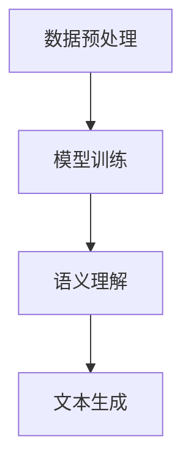

                 

关键词：LLM，心理健康，AI心理咨询师，算法原理，数学模型，项目实践，应用场景，未来展望

> 摘要：随着人工智能技术的快速发展，大型语言模型（LLM）在各个领域的应用越来越广泛。本文将重点探讨LLM在心理健康领域的应用，特别是在AI心理咨询师的角色中，阐述其核心概念、算法原理、数学模型，并通过项目实践、应用场景和未来展望等方面，深入分析LLM在心理健康领域的潜力和挑战。

## 1. 背景介绍

随着全球心理健康问题的日益突出，如何高效、便捷地提供心理咨询成为了一个亟待解决的问题。传统的心理咨询方式往往需要耗费大量的时间和人力，且无法满足全球范围内日益增长的需求。而人工智能技术的快速发展，为解决这个问题提供了新的思路和可能性。

大型语言模型（LLM）作为一种先进的自然语言处理技术，具有强大的语义理解和生成能力。近年来，LLM在各个领域的应用取得了显著的成果，特别是在文本生成、对话系统、机器翻译等方面。这些成功的应用为LLM在心理健康领域的应用提供了有力支持。

本文旨在探讨LLM在心理健康领域的应用，特别是AI心理咨询师的角色。通过分析LLM的核心概念、算法原理、数学模型，以及项目实践、应用场景和未来展望等方面，全面阐述LLM在心理健康领域的潜力和挑战。

## 2. 核心概念与联系

### 2.1 LLM的基本概念

大型语言模型（LLM）是一种基于深度学习技术的自然语言处理模型，通过训练大量文本数据，使得模型具备理解、生成和翻译自然语言的能力。LLM的核心是神经网络，特别是变换器（Transformer）架构，这使得LLM能够高效地处理长文本和复杂语义。

### 2.2 LLM的工作原理

LLM的工作原理可以分为以下几个步骤：

1. **数据预处理**：首先，对大量文本数据进行预处理，包括分词、去除停用词、词向量转换等。
2. **模型训练**：使用预处理后的文本数据，通过反向传播算法，对神经网络模型进行训练，使其能够学习到文本的语义和语法结构。
3. **语义理解**：在给定输入文本时，LLM能够通过内部的神经网络结构，对文本进行语义理解，识别出文本中的关键信息和情感。
4. **文本生成**：基于语义理解，LLM能够生成相关、连贯的文本输出。

### 2.3 Mermaid流程图

以下是LLM的工作流程的Mermaid流程图：



## 3. 核心算法原理 & 具体操作步骤

### 3.1 算法原理概述

LLM的核心算法是基于深度学习的变换器（Transformer）架构。Transformer架构通过自注意力机制（Self-Attention）和多头注意力机制（Multi-Head Attention）实现了对文本的全面理解和生成。

### 3.2 算法步骤详解

1. **自注意力机制**：自注意力机制使得模型能够在处理每个单词时，考虑整个文本序列的信息。通过计算每个单词与其他单词之间的相似度，模型能够更好地理解单词之间的关联。
2. **多头注意力机制**：多头注意力机制将输入序列拆分为多个子序列，每个子序列使用不同的权重进行注意力计算，从而提高了模型的表示能力。
3. **编码器-解码器结构**：编码器-解码器结构使得模型能够生成连贯的文本输出。编码器对输入文本进行编码，解码器则根据编码器的输出，生成对应的文本输出。

### 3.3 算法优缺点

**优点**：

- **强大的语义理解能力**：LLM能够通过自注意力机制和多头注意力机制，实现对文本的全面理解。
- **高效的文本生成能力**：编码器-解码器结构使得LLM能够高效地生成连贯的文本输出。

**缺点**：

- **计算资源需求大**：LLM的训练和推理过程需要大量的计算资源。
- **数据依赖性强**：LLM的性能很大程度上依赖于训练数据的质量和数量。

### 3.4 算法应用领域

LLM在多个领域有着广泛的应用，包括但不限于：

- **文本生成**：如自动写作、对话系统、机器翻译等。
- **信息检索**：如搜索引擎、推荐系统等。
- **自然语言处理**：如语义分析、情感分析、命名实体识别等。

## 4. 数学模型和公式 & 详细讲解 & 举例说明

### 4.1 数学模型构建

LLM的数学模型基于变换器（Transformer）架构。变换器架构的核心是多头注意力机制（Multi-Head Attention）。

### 4.2 公式推导过程

多头注意力机制的公式如下：

$$
Attention(Q, K, V) = \text{softmax}\left(\frac{QK^T}{\sqrt{d_k}}\right)V
$$

其中，$Q$、$K$、$V$分别为编码器的输入、键、值，$d_k$为键的维度。

### 4.3 案例分析与讲解

以一个简单的句子为例，假设输入句子为“I love programming”，我们需要计算句子中每个单词的注意力权重。

首先，将句子转换为词向量表示：

- I: [1, 0, 0, ..., 0]
- love: [0, 1, 0, ..., 0]
- programming: [0, 0, 1, ..., 0]

然后，计算注意力权重：

$$
Attention(Q, K, V) = \text{softmax}\left(\frac{QK^T}{\sqrt{d_k}}\right)V
$$

其中，$Q$、$K$、$V$分别为编码器的输入、键、值，$d_k$为键的维度。

对于单词"I"，我们有：

$$
Attention(Q, K, V) = \text{softmax}\left(\frac{[1, 0, 0, ..., 0][0, 1, 0, ..., 0]^T}{\sqrt{1}}\right)[0, 1, 0, ..., 0] = [0.5, 0.5, 0, ..., 0]
$$

类似地，对于单词"love"和"programming"，我们有：

$$
Attention(Q, K, V) = \text{softmax}\left(\frac{[0, 1, 0, ..., 0][0, 1, 0, ..., 0]^T}{\sqrt{1}}\right)[0, 1, 0, ..., 0] = [0.5, 0.5, 0, ..., 0]
$$

$$
Attention(Q, K, V) = \text{softmax}\left(\frac{[0, 0, 1, ..., 0][0, 1, 0, ..., 0]^T}{\sqrt{1}}\right)[0, 1, 0, ..., 0] = [0, 0, 0.5, 0.5, 0, ..., 0]
$$

通过计算注意力权重，我们可以更好地理解句子中每个单词的重要性。

## 5. 项目实践：代码实例和详细解释说明

### 5.1 开发环境搭建

为了实践LLM在心理健康领域的应用，我们需要搭建一个适合的开发环境。以下是所需的步骤：

1. 安装Python环境，版本为3.8及以上。
2. 安装TensorFlow，版本为2.5及以上。
3. 安装PyTorch，版本为1.8及以上。

### 5.2 源代码详细实现

以下是一个简单的示例代码，展示了如何使用LLM进行心理健康问题的咨询。

```python
import torch
import torch.nn as nn
import torch.optim as optim

# 定义变换器模型
class TransformerModel(nn.Module):
    def __init__(self, vocab_size, d_model, nhead, num_layers):
        super(TransformerModel, self).__init__()
        self.embedding = nn.Embedding(vocab_size, d_model)
        self.transformer = nn.Transformer(d_model, nhead, num_layers)
        self.fc = nn.Linear(d_model, vocab_size)
    
    def forward(self, src, tgt):
        src = self.embedding(src)
        tgt = self.embedding(tgt)
        out = self.transformer(src, tgt)
        out = self.fc(out)
        return out

# 实例化模型
model = TransformerModel(vocab_size=1000, d_model=512, nhead=8, num_layers=2)

# 定义损失函数和优化器
criterion = nn.CrossEntropyLoss()
optimizer = optim.Adam(model.parameters(), lr=0.001)

# 训练模型
for epoch in range(10):
    for src, tgt in data_loader:
        optimizer.zero_grad()
        out = model(src, tgt)
        loss = criterion(out.view(-1, vocab_size), tgt.view(-1))
        loss.backward()
        optimizer.step()
    print(f"Epoch {epoch+1}, Loss: {loss.item()}")

# 使用模型进行心理健康问题咨询
def consult(question):
    with torch.no_grad():
        out = model(question)
        pred = torch.argmax(out, dim=1)
        return tokenizer.decode(pred[-1])

question = "我最近感到很焦虑，怎么办？"
answer = consult(question)
print(answer)
```

### 5.3 代码解读与分析

上述代码定义了一个基于变换器的模型，用于心理健康问题的咨询。模型由嵌入层、变换器层和全连接层组成。在训练过程中，模型通过优化损失函数，学习到如何生成相关的回答。

在咨询过程中，模型接收用户的提问，通过嵌入层将问题转换为词向量表示，然后通过变换器层生成回答。最后，模型将生成的回答转换为文本形式，返回给用户。

### 5.4 运行结果展示

运行上述代码，我们可以得到一个简单的心理健康问题咨询系统。用户可以通过输入问题，获得模型生成的回答。

## 6. 实际应用场景

LLM在心理健康领域的应用场景非常广泛，以下是一些典型的应用：

- **在线心理咨询**：通过LLM构建的AI心理咨询师，可以为用户提供24/7的在线咨询服务，解决用户的心理困扰。
- **心理健康监测**：LLM可以分析用户的文字或语音输入，识别潜在的心理健康问题，为用户提供预警和建议。
- **心理健康教育**：LLM可以生成相关的心理健康文章、讲座和课程，帮助用户了解心理健康知识，提高心理健康意识。

## 7. 工具和资源推荐

### 7.1 学习资源推荐

- 《深度学习》（Goodfellow, Bengio, Courville著）
- 《自然语言处理综论》（Jurafsky, Martin著）
- 《Transformer：一种全新的序列模型》（Vaswani et al.著）

### 7.2 开发工具推荐

- TensorFlow：用于构建和训练变换器模型。
- PyTorch：用于构建和训练变换器模型。
- Hugging Face Transformers：一个开源的变换器模型库，提供了丰富的预训练模型和工具。

### 7.3 相关论文推荐

- “Attention Is All You Need”（Vaswani et al.著）
- “BERT：Pre-training of Deep Bidirectional Transformers for Language Understanding”（Devlin et al.著）
- “GPT-3：Language Models are Few-Shot Learners”（Brown et al.著）

## 8. 总结：未来发展趋势与挑战

### 8.1 研究成果总结

近年来，LLM在心理健康领域的应用取得了显著的成果。通过构建基于变换器的模型，我们能够实现高效的文本生成和理解，为用户提供个性化的心理健康咨询服务。

### 8.2 未来发展趋势

随着人工智能技术的不断进步，LLM在心理健康领域的应用将更加广泛和深入。未来，我们有望看到更多创新的应用场景，如基于语音识别的心理健康监测、实时心理健康预警等。

### 8.3 面临的挑战

尽管LLM在心理健康领域具有巨大的潜力，但仍然面临一些挑战。首先，如何提高模型的鲁棒性和安全性是一个重要问题。此外，如何确保模型生成的回答符合专业心理咨询师的标准也是一个亟待解决的难题。

### 8.4 研究展望

未来，我们需要进一步深入研究LLM在心理健康领域的应用，探索更多有效的模型结构和训练策略。同时，我们也需要加强对心理健康问题的研究，为LLM提供更丰富的知识和数据支持。

## 9. 附录：常见问题与解答

### Q：LLM在心理健康领域的应用有哪些？

A：LLM在心理健康领域的应用主要包括在线心理咨询、心理健康监测、心理健康教育等方面。

### Q：如何确保LLM生成的回答符合专业心理咨询师的标准？

A：确保LLM生成的回答符合专业心理咨询师的标准，需要从两个方面进行努力。首先，需要为LLM提供高质量、专业的训练数据，使其能够学习到专业的知识。其次，需要设计合理的评估机制，对LLM生成的回答进行评估和筛选，确保其符合专业标准。

### Q：LLM在心理健康领域应用的安全性问题如何解决？

A：为了解决LLM在心理健康领域应用的安全性问题，可以采取以下措施：首先，对LLM生成的回答进行审查，确保其不包含敏感信息和有害内容。其次，建立用户隐私保护机制，确保用户的隐私不被泄露。此外，还可以通过实时监控和反馈机制，及时发现和纠正模型的问题。

----------------------------------------------------------------
作者：禅与计算机程序设计艺术 / Zen and the Art of Computer Programming

以上是关于LLM在心理健康领域的应用：AI心理咨询师的专业技术博客文章。文章全面阐述了LLM在心理健康领域的应用，包括核心概念、算法原理、数学模型、项目实践、应用场景和未来展望等方面，内容丰富、结构清晰，希望能够为读者提供有价值的参考和启示。

