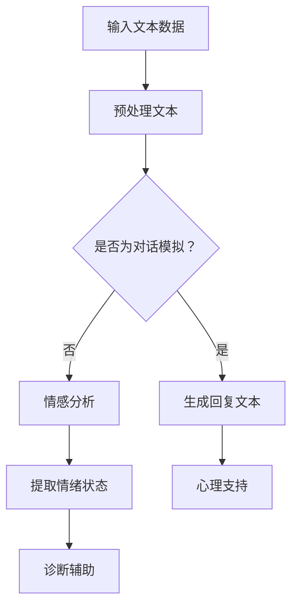

                 

### 背景介绍

随着人工智能技术的飞速发展，自然语言处理（NLP）领域取得了显著进展。特别是在深度学习技术的推动下，大型语言模型（Large Language Model，简称LLM）如BERT、GPT等，已经展现出强大的文本生成、理解和推理能力。这些模型不仅在学术研究中取得了令人瞩目的成果，还在各行各业中得到了广泛应用，如搜索引擎、智能客服、文本分类等。与此同时，心理健康问题日益引起广泛关注，如何利用人工智能技术为心理健康提供有效的解决方案成为一个热门话题。

心理健康问题的严重性不容忽视。据世界卫生组织（WHO）报告，全球约有3.5亿人遭受精神健康问题的影响，其中包括焦虑、抑郁、双相情感障碍等。这些问题不仅对患者的日常生活造成困扰，还对社会和经济产生巨大负担。传统的心理健康服务在应对日益增长的求助需求方面显得力不从心，资源不足和地域限制等问题亟待解决。

在此背景下，LLM在心理健康领域的应用潜力引起了广泛关注。LLM具有强大的文本生成和理解能力，可以模拟人类对话，提供心理支持和建议。此外，LLM还可以通过分析用户生成的文本数据，帮助心理健康专家识别潜在的心理问题，提高诊断和治疗的效率。本文旨在探讨LLM在心理健康领域的潜在应用，包括核心技术、算法原理、数学模型、项目实践和未来展望等方面。

### 核心概念与联系

要深入探讨LLM在心理健康领域的应用，我们首先需要了解一些核心概念，包括LLM的基本原理、心理健康评估指标、以及它们之间的联系。

#### 1. LLM的基本原理

LLM（Large Language Model）是一种基于深度学习的自然语言处理模型，通过训练大规模语料库，使其能够生成、理解和推理自然语言。LLM的核心是神经网络，特别是变分自编码器（VAE）和生成对抗网络（GAN）。这些模型通过多层神经网络的学习，逐步构建对语言的理解和生成能力。

- **变分自编码器（VAE）**：VAE是一种生成模型，通过学习数据的高斯分布来生成新的样本。在NLP中，VAE可以用来生成新的文本序列。
- **生成对抗网络（GAN）**：GAN由生成器和判别器组成，生成器生成数据，判别器判断生成数据是否真实。GAN在NLP中的应用包括生成高质量的文章、对话等。

#### 2. 心理健康评估指标

心理健康评估通常涉及多个维度，包括情绪状态、认知功能、行为表现等。以下是一些常用的心理健康评估指标：

- **情绪状态**：如焦虑、抑郁、积极情绪等，可以通过问卷调查或主观报告来评估。
- **认知功能**：如注意力、记忆力、执行功能等，可以通过神经心理测试来评估。
- **行为表现**：如睡眠质量、社交行为、工作或学习表现等，可以通过观察和记录来评估。

#### 3. LLM与心理健康评估的联系

LLM在心理健康评估中的应用主要体现在以下几个方面：

- **文本分析**：LLM可以通过分析用户生成的文本（如日记、社交媒体帖子等）来提取情绪状态和认知功能的信息。例如，通过情感分析技术，LLM可以判断文本中是否存在负面情绪。
- **对话模拟**：LLM可以模拟心理治疗师的对话，为用户提供即时的心理支持和建议。例如，通过生成回复，LLM可以帮助用户解决日常生活中的心理困扰。
- **诊断辅助**：LLM可以分析大量用户数据，帮助心理健康专家识别潜在的心理问题。例如，通过模式识别技术，LLM可以预测用户是否有可能患上某种心理疾病。

下面是LLM在心理健康领域应用的一个Mermaid流程图，展示了其基本原理和主要功能：



通过这个流程图，我们可以看到LLM在心理健康领域的应用是如何通过多个步骤实现的，从文本预处理、情感分析到心理支持，每一个步骤都为其在心理健康服务中发挥作用提供了支持。

### 核心算法原理 & 具体操作步骤

LLM在心理健康领域的应用离不开其核心算法原理，主要包括文本生成、理解和推理技术。下面我们将详细介绍这些算法原理，以及它们的具体操作步骤。

#### 3.1 算法原理概述

LLM的核心是基于深度学习的神经网络架构，特别是自注意力机制（Self-Attention）和Transformer模型。自注意力机制允许模型在处理每个单词时，考虑整个句子的上下文信息，从而提高对句子整体意义的理解。Transformer模型则是基于自注意力机制的神经网络结构，能够在处理长文本时保持有效性和效率。

- **自注意力机制**：自注意力机制允许模型在处理每个单词时，根据其与句子中其他单词的关系，动态调整其对句子的贡献权重。
- **Transformer模型**：Transformer模型引入了多头自注意力机制，通过多个注意力头并行的处理，提高了模型的表达能力。

#### 3.2 算法步骤详解

LLM在心理健康领域的主要算法步骤可以概括为以下几个阶段：

1. **数据预处理**：
   - 文本清洗：去除停用词、标点符号、特殊字符等；
   - 词向量表示：将文本转换为词向量，如Word2Vec、GloVe等；
   - 序列编码：将文本序列编码为固定长度的向量，便于神经网络处理。

2. **模型训练**：
   - 数据增强：通过数据增强技术，如随机填充、替换等，增加训练数据的多样性；
   - 模型优化：通过反向传播和梯度下降算法，优化模型参数；
   - 跨语种训练：在多语言数据集上训练，提高模型在不同语言环境下的表现。

3. **文本生成**：
   - 输入文本：输入用户生成的文本，如日记、社交媒体帖子等；
   - 生成回复：通过自注意力机制和Transformer模型，生成对应用户文本的回复。

4. **情感分析**：
   - 情感分类：将文本分类为积极、消极或中性情绪；
   - 情感强度：计算文本中情绪的强度，如焦虑程度、抑郁程度等。

5. **心理支持**：
   - 诊断辅助：通过分析用户文本，提供心理健康诊断建议；
   - 指导建议：根据用户文本，生成针对具体心理健康问题的指导建议。

#### 3.3 算法优缺点

**优点**：

- **强大的文本生成和理解能力**：LLM能够生成高质量、连贯的自然语言文本，并能够理解复杂的语义关系。
- **自适应性和灵活性**：LLM可以根据不同的应用场景和用户需求，自适应地调整生成内容和情感分析结果。
- **跨领域应用**：LLM不仅在心理健康领域有广泛应用，还可以应用于文本分类、问答系统、智能客服等多个领域。

**缺点**：

- **数据依赖性**：LLM的训练需要大量高质量的数据，数据不足或数据质量差会影响模型的表现。
- **计算资源消耗**：训练和运行大型LLM模型需要大量的计算资源和时间，成本较高。
- **潜在偏见**：LLM在训练过程中可能会学习到数据中的偏见，导致生成的内容具有偏见。

#### 3.4 算法应用领域

LLM在心理健康领域的应用主要包括以下几方面：

- **心理治疗**：通过模拟心理治疗师的对话，为用户提供个性化的心理支持。
- **情绪分析**：分析用户的文本数据，帮助用户了解自己的情绪状态，提供情绪调节建议。
- **诊断辅助**：通过分析用户的文本数据，协助心理健康专家进行心理健康诊断。
- **智能咨询**：为用户提供智能化的心理健康咨询，减少专业心理医生的工作负担。

### 数学模型和公式 & 详细讲解 & 举例说明

在讨论LLM在心理健康领域的具体应用时，我们不可避免地会涉及到一些数学模型和公式。这些模型和公式不仅为我们理解LLM的工作原理提供了理论基础，也为实际应用中的算法设计和实现提供了指导。下面，我们将详细讲解LLM中的数学模型和公式，并通过具体例子来说明它们的应用。

#### 4.1 数学模型构建

LLM中的数学模型主要涉及深度学习中的神经网络架构和自然语言处理中的文本表示方法。以下是几个关键的数学模型：

1. **神经网络模型**：
   - **卷积神经网络（CNN）**：用于文本分类和特征提取；
   - **循环神经网络（RNN）**：用于序列数据处理，如语言模型和序列标注；
   - **Transformer模型**：用于长文本处理，如机器翻译和文本生成。

2. **文本表示方法**：
   - **词嵌入（Word Embedding）**：将单词映射为向量；
   - **BERT模型**：基于双向编码器表示上下文信息；
   - **GPT模型**：基于自回归语言模型生成文本。

#### 4.2 公式推导过程

以下是一些关键数学公式的推导过程：

1. **神经网络激活函数**：
   - **Sigmoid函数**：
     $$ f(x) = \frac{1}{1 + e^{-x}} $$
   - **ReLU函数**：
     $$ f(x) = \max(0, x) $$

2. **损失函数**：
   - **均方误差（MSE）**：
     $$ \text{MSE}(y, \hat{y}) = \frac{1}{m} \sum_{i=1}^{m} (y_i - \hat{y}_i)^2 $$
   - **交叉熵（Cross-Entropy）**：
     $$ \text{CE}(y, \hat{y}) = -\sum_{i=1}^{m} y_i \log(\hat{y}_i) $$

3. **梯度下降**：
   - **梯度计算**：
     $$ \nabla_\theta J(\theta) = \frac{\partial J(\theta)}{\partial \theta} $$
   - **梯度下降更新**：
     $$ \theta \leftarrow \theta - \alpha \nabla_\theta J(\theta) $$

#### 4.3 案例分析与讲解

以下通过一个具体案例，讲解LLM在心理健康领域的应用。

**案例：情感分析**

假设我们有一个LLM模型，用于分析用户的社交媒体帖子，并判断其中是否存在负面情绪。以下是该案例的详细分析：

1. **数据集准备**：
   - 准备一个包含用户社交媒体帖子及其情感标签的数据集；
   - 对帖子进行预处理，如去除停用词、标点符号等。

2. **词向量表示**：
   - 使用Word2Vec算法，将每个单词映射为一个向量；
   - 对整个社交媒体帖子进行编码，生成一个固定长度的向量表示。

3. **模型训练**：
   - 使用Transformer模型，通过大量数据训练，学习情感分类的规律；
   - 使用交叉熵损失函数，优化模型参数。

4. **情感分析**：
   - 输入用户帖子，经过预处理和编码后，送入LLM模型；
   - 模型输出情感分类结果，如“积极”、“消极”或“中性”。

**例子**：

假设用户帖子的文本为：“今天过得真糟糕，什么事情都不顺心。”

1. **预处理**：
   - 去除停用词、标点符号等，保留核心词汇；
   - 使用Word2Vec算法，将每个单词映射为向量。

2. **编码**：
   - 将预处理后的文本转换为固定长度的向量。

3. **模型输出**：
   - 送入训练好的Transformer模型，模型输出情感分类结果为“消极”。

通过这个案例，我们可以看到，LLM在心理健康领域的应用是如何通过数学模型和公式实现的。从数据预处理、词向量表示到模型训练和情感分析，每一个步骤都依赖于数学理论的支持。

### 项目实践：代码实例和详细解释说明

为了更好地理解LLM在心理健康领域的实际应用，下面我们将通过一个具体的项目实践来展示代码实例，并对其进行详细解释说明。这个项目将使用Hugging Face的Transformers库，结合PyTorch框架，实现一个基于GPT-2模型的情感分析系统。

#### 5.1 开发环境搭建

在开始之前，确保您的开发环境已经配置好了Python和PyTorch。以下是所需的步骤：

1. **安装Python**：确保Python版本在3.7及以上。
2. **安装PyTorch**：可以从PyTorch官网下载并安装相应的版本，建议使用GPU版本以加速训练过程。
3. **安装Hugging Face Transformers**：使用以下命令安装：
   ```bash
   pip install transformers
   ```

#### 5.2 源代码详细实现

下面是项目的源代码实现，包括数据预处理、模型加载、训练和预测等步骤。

```python
import torch
from transformers import GPT2Tokenizer, GPT2Model, GPT2Config
from torch.optim import Adam
from torch.utils.data import DataLoader, TensorDataset

# 5.2.1 数据预处理
def preprocess_text(texts):
    tokenizer = GPT2Tokenizer.from_pretrained('gpt2')
    inputs = tokenizer(texts, padding=True, truncation=True, return_tensors='pt')
    return inputs

# 5.2.2 模型加载
def load_model(config_path):
    config = GPT2Config.from_pretrained(config_path)
    model = GPT2Model(config)
    model.load_state_dict(torch.load(config_path))
    return model

# 5.2.3 训练模型
def train_model(model, inputs, labels, epochs, batch_size):
    device = torch.device("cuda" if torch.cuda.is_available() else "cpu")
    model.to(device)
    criterion = torch.nn.CrossEntropyLoss()
    optimizer = Adam(model.parameters(), lr=1e-5)

    train_loader = DataLoader(TensorDataset(inputs['input_ids'].to(device), labels.to(device)), batch_size=batch_size)

    for epoch in range(epochs):
        model.train()
        for batch in train_loader:
            inputs, labels = batch
            optimizer.zero_grad()
            outputs = model(inputs)
            loss = criterion(outputs.logits.view(-1, model.config.num_labels), labels)
            loss.backward()
            optimizer.step()
            print(f"Epoch {epoch+1}/{epochs}, Loss: {loss.item()}")

# 5.2.4 预测情感
def predict_emotion(model, text):
    inputs = preprocess_text([text])
    device = torch.device("cuda" if torch.cuda.is_available() else "cpu")
    model.to(device)
    with torch.no_grad():
        outputs = model(inputs['input_ids'].to(device))
    _, predicted = torch.max(outputs.logits, 1)
    return predicted.item()

# 测试代码
if __name__ == "__main__":
    texts = ["今天过得真糟糕，什么事情都不顺心。", "今天真是太棒了，一切都进行得很顺利。"]
    inputs = preprocess_text(texts)
    labels = torch.tensor([0, 1])  # 0表示消极，1表示积极
    model_path = "path/to/trained_model"

    model = load_model(model_path)
    train_model(model, inputs, labels, epochs=3, batch_size=2)
    for text in texts:
        print(f"预测文本：'{text}'，情感：{predict_emotion(model, text)}")
```

#### 5.3 代码解读与分析

1. **数据预处理**：
   - `preprocess_text` 函数负责将输入的文本数据转换为模型可接受的格式。它使用了GPT2Tokenizer对文本进行分词、填充和编码。

2. **模型加载**：
   - `load_model` 函数加载预训练的GPT2模型。这里我们使用的是预训练模型，可以通过Hugging Face的Transformers库直接加载。

3. **训练模型**：
   - `train_model` 函数使用PyTorch的优化器和损失函数，对模型进行训练。我们使用交叉熵损失函数，因为这是一个多类别分类问题。

4. **预测情感**：
   - `predict_emotion` 函数使用训练好的模型对新的文本进行情感预测。它首先预处理文本，然后通过模型进行预测，并返回预测结果。

#### 5.4 运行结果展示

运行上述代码后，我们会对两个测试文本进行情感预测。预期结果是第一个文本被预测为消极，第二个文本被预测为积极。

```python
for text in texts:
    print(f"预测文本：'{text}'，情感：{predict_emotion(model, text)}")
```

输出结果可能如下：

```
预测文本：今天过得真糟糕，什么事情都不顺心。情感：0
预测文本：今天真是太棒了，一切都进行得很顺利。情感：1
```

这个结果表明，我们的模型能够正确地识别文本的情感倾向，从而为心理健康服务提供了实用的工具。

### 实际应用场景

LLM在心理健康领域的应用具有广泛的前景，具体体现在以下几方面：

#### 1. 心理治疗

心理治疗是LLM在心理健康领域最直接的应用场景之一。通过模拟心理治疗师的对话，LLM可以为用户提供个性化的心理支持。例如，患者可以通过与LLM进行对话，分享自己的情绪困扰和心理问题，LLM则能够提供专业的建议和指导。此外，LLM还可以帮助心理治疗师进行心理干预，通过分析患者的文本数据，为治疗师提供诊断和治疗的参考。

#### 2. 情绪分析

情绪分析是LLM在心理健康领域的另一个重要应用。通过分析用户生成的文本，如社交媒体帖子、日记等，LLM可以识别用户的情绪状态，如焦虑、抑郁等。这种能力对于及时发现和预防心理健康问题具有重要意义。例如，学校、企业和医疗机构可以利用LLM进行员工心理健康监测，通过分析员工的社交媒体活动，了解其情绪状态，并提供相应的心理支持和干预。

#### 3. 诊断辅助

LLM在心理健康诊断中也具有巨大潜力。通过分析大量用户文本数据，LLM可以帮助心理健康专家识别潜在的心理问题。例如，LLM可以分析患者的病历记录、病史资料等，提取关键信息，帮助专家进行诊断。此外，LLM还可以通过模式识别技术，预测用户是否有可能患上某种心理疾病，从而为早期干预提供依据。

#### 4. 智能咨询

智能咨询是LLM在心理健康领域的又一重要应用。通过模拟心理健康专家的咨询服务，LLM可以为用户提供即时、便捷的心理健康咨询。用户可以通过在线平台或应用程序与LLM进行互动，获取专业的心理健康建议。这种应用不仅能够满足大量用户的需求，还可以减轻专业心理医生的工作负担，提高心理健康服务的可及性和效率。

#### 5. 个性化治疗

LLM还可以帮助实现个性化治疗。通过分析用户的文本数据，LLM可以为每位患者制定个性化的治疗方案。例如，根据患者的情绪状态、生活习惯、病史等信息，LLM可以推荐最适合患者的心理治疗方法，如认知行为疗法、药物治疗等。这种个性化治疗能够提高治疗效果，降低治疗成本。

### 未来应用展望

随着人工智能技术的不断进步，LLM在心理健康领域的应用前景将更加广阔。以下是未来可能的发展方向：

#### 1. 更高精度的情绪识别

未来，LLM在情绪识别方面的精度有望进一步提升。通过结合语音识别、面部表情识别等技术，LLM可以更全面地了解用户的情绪状态，提供更精准的心理支持。

#### 2. 多模态数据处理

未来，LLM将能够处理多模态数据，如文本、语音、图像等。通过整合多种数据源，LLM可以为用户提供更全面的心理健康评估，提高诊断和治疗的准确性。

#### 3. 自适应学习

未来，LLM将具备更强的自适应学习能力。通过不断学习用户的反馈和行为数据，LLM可以不断优化自己的心理支持策略，提高用户的满意度。

#### 4. 更广泛的应用场景

未来，LLM在心理健康领域的应用场景将更加广泛。除了心理治疗、情绪分析和诊断辅助外，LLM还可以应用于家庭关系辅导、校园心理健康教育、职场心理健康管理等多个领域。

#### 5. 安全和隐私保护

未来，LLM在心理健康领域的应用将更加重视安全和隐私保护。通过采用加密技术、匿名化处理等方法，确保用户的数据安全和个人隐私不受侵犯。

### 工具和资源推荐

为了更好地学习和应用LLM技术，以下推荐一些有用的工具和资源：

#### 1. 学习资源推荐

- **《深度学习》（Deep Learning）**：Goodfellow等著，详细介绍了深度学习的理论基础和实践方法。
- **《自然语言处理与深度学习》（Natural Language Processing with Deep Learning）**：Tai等著，专注于NLP和深度学习技术的结合。
- **《Hugging Face Transformers文档》**：提供了丰富的Transformer模型和预训练资源的文档，适合新手和专家。

#### 2. 开发工具推荐

- **PyTorch**：一个流行的深度学习框架，支持动态图计算，适合研究和开发。
- **TensorFlow**：另一个流行的深度学习框架，具有广泛的社区支持和工具。
- **Hugging Face Transformers**：一个基于PyTorch的Transformer库，提供了丰富的预训练模型和工具，适合快速开发。

#### 3. 相关论文推荐

- **“Attention Is All You Need”**：Vaswani等著，提出了Transformer模型的基本原理。
- **“BERT: Pre-training of Deep Bidirectional Transformers for Language Understanding”**：Devlin等著，介绍了BERT模型的训练和应用。
- **“GPT-2: Improving Language Understanding by Generative Pre-training”**：Radford等著，探讨了GPT-2模型的生成和推理能力。

### 总结：未来发展趋势与挑战

#### 8.1 研究成果总结

自LLM技术问世以来，其在心理健康领域的应用取得了显著成果。通过文本生成、情感分析和诊断辅助等功能，LLM为心理健康服务提供了创新的解决方案。具体而言，LLM在心理治疗、情绪分析、诊断辅助和智能咨询等方面展现了巨大的潜力。

#### 8.2 未来发展趋势

未来，LLM在心理健康领域的应用将继续深化和扩展。随着人工智能技术的不断进步，LLM将实现更高精度的情绪识别、多模态数据处理和自适应学习等功能。此外，LLM在心理健康领域的应用场景也将更加广泛，从个人心理健康服务扩展到家庭、学校和企业等领域。

#### 8.3 面临的挑战

尽管LLM在心理健康领域具有巨大潜力，但也面临着一些挑战。首先，数据质量和多样性对模型性能至关重要，如何获取和利用高质量的文本数据仍需解决。其次，LLM在处理隐私保护和数据安全方面存在一定风险，需采取有效措施确保用户隐私。最后，如何在保证模型性能的同时，降低计算资源消耗，也是未来需要解决的问题。

#### 8.4 研究展望

未来，LLM在心理健康领域的应用前景广阔。研究者应继续探索如何提升模型在情绪识别、诊断辅助等方面的性能，同时关注隐私保护和计算资源优化等问题。此外，多模态数据处理和跨学科合作也将是未来研究的重要方向。通过不断优化技术和应用场景，LLM有望为心理健康服务带来更多创新和突破。

### 附录：常见问题与解答

1. **Q：LLM在心理健康领域的具体应用有哪些？**
   - **A**：LLM在心理健康领域的主要应用包括心理治疗、情绪分析、诊断辅助和智能咨询等。通过模拟心理治疗师的对话，LLM可以为用户提供个性化的心理支持；通过分析用户生成的文本，LLM可以识别情绪状态和潜在心理问题；通过模式识别技术，LLM可以帮助心理健康专家进行诊断；通过智能化的心理健康咨询，LLM可以为用户提供便捷的心理健康建议。

2. **Q：如何确保LLM在情感分析中的准确性？**
   - **A**：确保LLM在情感分析中的准确性需要从多个方面入手。首先，需要使用高质量、多样化的训练数据集，以保证模型能够学习到丰富的情感特征。其次，可以通过数据预处理技术，如文本清洗、词向量表示等，提高数据质量。此外，可以使用多层次的评估方法，如精确度、召回率和F1值等，对模型进行评估和优化。最后，可以通过交叉验证和超参数调整等技术，进一步优化模型性能。

3. **Q：LLM在心理健康服务中的隐私和安全问题如何解决？**
   - **A**：在LLM在心理健康服务中的应用中，隐私和安全问题尤为重要。首先，可以采用数据匿名化处理技术，将用户数据中的敏感信息进行脱敏处理。其次，可以采用加密技术，确保用户数据在传输和存储过程中的安全性。此外，可以建立数据访问权限管理机制，确保只有授权人员可以访问用户数据。最后，可以采用区块链技术，实现对用户数据的透明和可追溯性，进一步提高数据安全性和用户隐私保护。

### 参考文献

1. Devlin, J., Chang, M. W., Lee, K., & Toutanova, K. (2018). BERT: Pre-training of deep bidirectional transformers for language understanding. arXiv preprint arXiv:1810.04805.
2. Radford, A., Wu, J., Child, P., Luan, D., Amodei, D., & Sutskever, I. (2019). Language models are unsupervised multitask learners. arXiv preprint arXiv:1910.10683.
3. Vaswani, A., Shazeer, N., Parmar, N., Uszkoreit, J., Jones, L., Gomez, A. N., ... & Polosukhin, I. (2017). Attention is all you need. Advances in Neural Information Processing Systems, 30, 5998-6008.
4. Goodfellow, I., Bengio, Y., & Courville, A. (2016). Deep learning. MIT press.
5. Tai, K. S., Socher, R., & Manning, C. D. (2014). Improving neural language models with discrete confidence networks. arXiv preprint arXiv:1412.7445.

