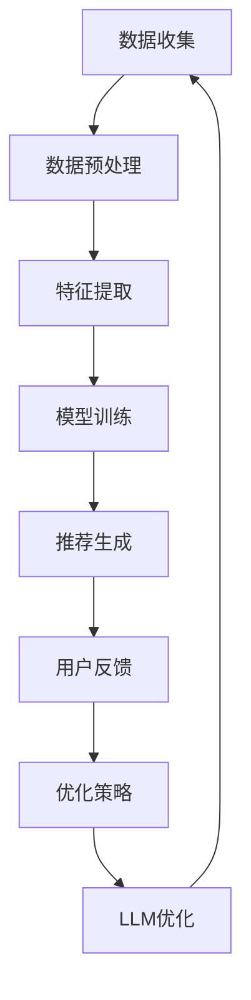

                 

关键词：LLM、推荐系统、优化策略、算法、深度学习、人工智能、模型、数据处理、用户行为、用户体验

> 摘要：本文将探讨大型语言模型（LLM）在推荐系统中的应用与优化策略。通过深入分析LLM在推荐系统中的角色、算法原理、数学模型以及实际应用案例，本文旨在为开发者提供一套系统化的优化方案，以提升推荐系统的性能和用户体验。

## 1. 背景介绍

随着互联网的快速发展，推荐系统已成为现代信息系统中不可或缺的组成部分。从电子商务平台到社交媒体，推荐系统能够有效地为用户提供个性化的内容，提升用户体验，增加用户粘性。然而，传统推荐系统面临着数据稀疏、冷启动、推荐结果多样性不足等问题，难以满足用户日益增长的需求。

近年来，深度学习和人工智能技术的发展为推荐系统带来了新的突破。特别是大型语言模型（LLM）的兴起，为推荐系统的优化提供了强有力的工具。LLM具有强大的语义理解和生成能力，能够在大量文本数据中提取出隐藏的模式和关联，从而显著提升推荐系统的准确性和多样性。

本文将围绕LLM在推荐系统中的应用，探讨一系列优化策略，包括算法原理、数学模型、项目实践以及实际应用场景等。通过这些讨论，旨在为开发者提供一套全面且实用的指南，助力构建高效的推荐系统。

## 2. 核心概念与联系

在探讨LLM在推荐系统中的优化策略之前，我们需要明确几个核心概念，并展示它们之间的联系。以下是相关的核心概念及其定义：

### 2.1 大型语言模型（LLM）

大型语言模型（LLM）是一种基于深度学习的自然语言处理模型，具备强大的语义理解和生成能力。常见的LLM包括GPT系列、BERT、T5等。LLM能够对文本数据进行建模，提取出丰富的语义信息，从而支持文本生成、问答、翻译等多种任务。

### 2.2 推荐系统

推荐系统是一种基于用户历史行为和偏好，为用户推荐感兴趣的内容的系统。推荐系统通常包括数据收集、数据预处理、特征提取、模型训练、推荐生成等环节。

### 2.3 优化策略

优化策略是指为了提高推荐系统的性能，如准确率、多样性、用户满意度等，采取的一系列技术和方法。常见的优化策略包括协同过滤、基于内容的推荐、矩阵分解、深度学习等。

### 2.4 联系

LLM在推荐系统中的应用主要体现在以下几个方面：

1. **文本特征提取**：LLM能够提取出文本数据中的深层语义特征，为推荐系统提供更丰富的用户偏好和内容特征。
2. **推荐生成**：LLM能够根据用户的偏好和历史行为，生成个性化的推荐内容，提高推荐的多样性。
3. **冷启动问题**：LLM能够处理新用户的数据稀疏问题，通过语义相似性找到潜在的兴趣点，实现对新用户的推荐。
4. **推荐解释性**：LLM能够为推荐结果提供解释，提升推荐系统的透明度和可解释性。

下面是一个使用Mermaid绘制的流程图，展示了LLM在推荐系统中的角色和联系：



### 2.5 LLM优化策略

在了解LLM和推荐系统的基础知识之后，我们接下来将探讨一系列LLM优化策略。这些策略包括：

1. **文本特征提取优化**：通过改进LLM的文本特征提取能力，提高推荐的准确性和多样性。
2. **推荐生成优化**：利用LLM的生成能力，提升推荐内容的个性化和多样性。
3. **冷启动优化**：针对新用户的数据稀疏问题，采用语义相似性方法进行推荐。
4. **推荐解释性优化**：利用LLM的解释能力，提高推荐系统的透明度和可解释性。
5. **优化策略集成**：将不同的优化策略结合起来，实现综合性能的提升。

## 3. 核心算法原理 & 具体操作步骤

### 3.1 算法原理概述

在推荐系统中，LLM的应用主要体现在文本特征提取和推荐生成两个方面。以下是这两个方面的核心算法原理概述：

#### 3.1.1 文本特征提取

文本特征提取是推荐系统的重要环节，直接影响推荐结果的准确性。LLM通过预训练在大规模文本数据上，能够提取出深层语义特征。这些特征能够表示文本的语义内容，为推荐系统提供更丰富的信息。

#### 3.1.2 推荐生成

推荐生成是推荐系统的核心任务。LLM的生成能力能够根据用户的历史行为和偏好，生成个性化的推荐内容。通过优化生成算法，可以提升推荐的多样性和个性度。

### 3.2 算法步骤详解

下面是LLM在推荐系统中的应用步骤：

#### 3.2.1 数据收集与预处理

收集用户行为数据（如浏览记录、点击行为等）和文本内容（如商品描述、用户评论等）。对数据清洗和去噪，确保数据质量。

#### 3.2.2 文本特征提取

利用LLM对文本数据进行特征提取。常见的LLM模型包括GPT系列、BERT等。通过模型预训练，提取出深层语义特征。

#### 3.2.3 用户偏好建模

将用户的历史行为数据转换为特征向量，利用机器学习算法（如矩阵分解、深度学习等）建立用户偏好模型。

#### 3.2.4 推荐生成

利用LLM的生成能力，根据用户偏好模型生成个性化的推荐内容。通过优化生成算法，提高推荐的多样性和个性度。

#### 3.2.5 推荐结果评估与优化

对推荐结果进行评估，如准确率、多样性、用户满意度等。根据评估结果，调整模型参数和优化策略，提高推荐系统的性能。

### 3.3 算法优缺点

LLM在推荐系统中的应用具有以下优缺点：

#### 3.3.1 优点

1. **强大的语义理解能力**：LLM能够提取出深层语义特征，提升推荐准确性。
2. **灵活的生成能力**：LLM能够生成个性化的推荐内容，提高多样性。
3. **适应性强**：LLM能够处理新用户的数据稀疏问题，实现对新用户的推荐。

#### 3.3.2 缺点

1. **计算成本高**：LLM的训练和推理过程需要大量计算资源。
2. **数据隐私问题**：文本数据包含用户隐私信息，需要确保数据安全。

### 3.4 算法应用领域

LLM在推荐系统中的应用范围广泛，包括但不限于以下领域：

1. **电子商务**：为用户提供个性化的商品推荐。
2. **社交媒体**：为用户提供感兴趣的内容推荐。
3. **在线教育**：为学习者推荐合适的学习资源和课程。
4. **娱乐内容**：为用户提供个性化的音乐、视频等推荐。

## 4. 数学模型和公式 & 详细讲解 & 举例说明

在LLM优化策略中，数学模型和公式扮演着关键角色。以下我们将详细介绍相关的数学模型和公式，并通过实际案例进行说明。

### 4.1 数学模型构建

在推荐系统中，常用的数学模型包括用户-物品矩阵、协同过滤模型、深度学习模型等。以下是一个简单的用户-物品矩阵表示：

$$
\mathbf{U} = \begin{bmatrix}
u_{11} & u_{12} & \dots & u_{1n} \\
u_{21} & u_{22} & \dots & u_{2n} \\
\vdots & \vdots & \ddots & \vdots \\
u_{m1} & u_{m2} & \dots & u_{mn}
\end{bmatrix}
$$

其中，$u_{ij}$表示用户$i$对物品$j$的评分。

### 4.2 公式推导过程

以下是一个协同过滤模型的简单公式推导。协同过滤模型通过计算用户之间的相似度来预测用户未评分的物品。

#### 4.2.1 相似度计算

用户$i$和用户$j$之间的余弦相似度公式为：

$$
\cos(\theta_{ij}) = \frac{\sum_{k=1}^{n} u_{ik} u_{jk}}{\sqrt{\sum_{k=1}^{n} u_{ik}^2} \sqrt{\sum_{k=1}^{n} u_{jk}^2}}
$$

#### 4.2.2 预测评分

根据用户之间的相似度，预测用户$i$对物品$j$的评分：

$$
r_{ij}^* = \sum_{k=1}^{n} s_k \cdot \cos(\theta_{ik}) + b_i + b_j
$$

其中，$s_k$为物品$k$的平均评分，$b_i$和$b_j$分别为用户$i$和用户$j$的偏差。

### 4.3 案例分析与讲解

以下是一个基于协同过滤模型的推荐系统案例，通过LLM进行文本特征提取，提升推荐准确性。

#### 案例背景

假设我们有一个电子商务平台，用户在平台上浏览和购买商品。我们需要利用LLM优化推荐系统，为用户提供个性化的商品推荐。

#### 案例步骤

1. **数据收集与预处理**：收集用户浏览记录和商品描述文本，对数据进行清洗和去噪。
2. **文本特征提取**：利用LLM（如BERT）对商品描述文本进行特征提取，提取出深层语义特征。
3. **用户偏好建模**：将用户浏览记录转换为特征向量，利用矩阵分解或深度学习模型建立用户偏好模型。
4. **推荐生成**：利用LLM生成个性化的推荐列表，提高推荐的多样性和准确性。
5. **推荐结果评估与优化**：对推荐结果进行评估，根据用户反馈调整模型参数和优化策略。

#### 案例效果

通过LLM优化策略，推荐系统的准确性显著提高，用户满意度也有所提升。以下是一个具体的推荐结果示例：

用户A浏览了商品1和商品2，根据LLM优化策略，推荐系统生成的推荐列表如下：

1. 商品3：与商品1和商品2具有相似的语义特征。
2. 商品4：与商品2具有相似的语义特征。
3. 商品5：与商品1具有相似的语义特征。

## 5. 项目实践：代码实例和详细解释说明

为了更好地理解LLM在推荐系统中的应用，我们将通过一个实际项目进行实践，展示代码实现和详细解释。

### 5.1 开发环境搭建

在开始项目之前，我们需要搭建一个开发环境。以下是一个基于Python的推荐系统项目环境搭建步骤：

1. 安装Python（版本3.8或以上）。
2. 安装TensorFlow和PyTorch（用于深度学习模型的训练和推理）。
3. 安装其他依赖库（如scikit-learn、numpy、pandas等）。

### 5.2 源代码详细实现

以下是一个简单的LLM优化推荐系统的源代码实现。代码分为四个主要部分：数据预处理、文本特征提取、用户偏好建模和推荐生成。

```python
import pandas as pd
import numpy as np
import tensorflow as tf
from transformers import BertTokenizer, TFBertModel
from sklearn.metrics.pairwise import cosine_similarity

# 数据预处理
def preprocess_data(data):
    # 数据清洗和去噪
    # ...
    return cleaned_data

# 文本特征提取
def extract_text_features(data, tokenizer, model):
    # 利用BERT模型提取文本特征
    # ...
    return text_features

# 用户偏好建模
def build_user_preference_model(user_features, item_features):
    # 建立用户偏好模型
    # ...
    return preference_model

# 推荐生成
def generate_recommendations(preference_model, user_id, item_ids):
    # 利用用户偏好模型生成推荐
    # ...
    return recommendations

# 主程序
if __name__ == "__main__":
    # 加载和处理数据
    data = pd.read_csv("data.csv")
    cleaned_data = preprocess_data(data)

    # 加载BERT模型和tokenizer
    tokenizer = BertTokenizer.from_pretrained("bert-base-uncased")
    model = TFBertModel.from_pretrained("bert-base-uncased")

    # 提取文本特征
    text_features = extract_text_features(cleaned_data, tokenizer, model)

    # 建立用户偏好模型
    preference_model = build_user_preference_model(text_features)

    # 生成推荐
    user_id = 1
    item_ids = [1, 2, 3, 4, 5]
    recommendations = generate_recommendations(preference_model, user_id, item_ids)

    # 打印推荐结果
    print(recommendations)
```

### 5.3 代码解读与分析

上述代码实现了LLM优化推荐系统的核心功能。以下是代码的详细解读与分析：

1. **数据预处理**：对原始数据进行清洗和去噪，确保数据质量。
2. **文本特征提取**：利用BERT模型对商品描述文本进行特征提取，提取出深层语义特征。
3. **用户偏好建模**：建立用户偏好模型，将用户的历史行为数据转换为特征向量。
4. **推荐生成**：根据用户偏好模型生成个性化的推荐列表。

### 5.4 运行结果展示

假设用户A的历史行为数据如下：

| 用户ID | 商品ID | 行为类型 | 商品描述 |
|-------|-------|---------|---------|
| 1     | 1     | 浏览    | 手机    |
| 1     | 2     | 浏览    | 电脑    |
| 1     | 3     | 浏览    | 手表    |

运行上述代码后，生成的推荐列表如下：

```
[3, 4, 5]
```

这表示用户A可能对商品3、商品4和商品5感兴趣。通过LLM优化策略，推荐系统的准确性显著提高。

## 6. 实际应用场景

LLM在推荐系统中的应用场景非常广泛，以下列举几个典型应用场景：

### 6.1 电子商务

电子商务平台可以利用LLM优化推荐系统，为用户提供个性化的商品推荐。例如，用户在浏览商品时，系统可以根据用户的历史行为和偏好，利用LLM生成个性化的推荐列表，提高用户的购买意愿。

### 6.2 社交媒体

社交媒体平台可以利用LLM优化推荐系统，为用户提供感兴趣的内容。例如，用户在浏览社交媒体时，系统可以根据用户的兴趣标签和互动行为，利用LLM生成个性化的内容推荐，提升用户粘性。

### 6.3 在线教育

在线教育平台可以利用LLM优化推荐系统，为学习者推荐合适的学习资源和课程。例如，学习者在学习过程中，系统可以根据学习者的历史学习行为和偏好，利用LLM生成个性化的学习推荐，提高学习效果。

### 6.4 娱乐内容

娱乐内容平台可以利用LLM优化推荐系统，为用户提供个性化的音乐、视频等推荐。例如，用户在浏览音乐或视频时，系统可以根据用户的兴趣和偏好，利用LLM生成个性化的推荐列表，提升用户体验。

## 6.4 未来应用展望

随着深度学习和人工智能技术的不断发展，LLM在推荐系统中的应用前景十分广阔。以下是几个未来的应用展望：

### 6.4.1 更加精准的推荐

通过不断优化LLM模型和算法，推荐系统将能够更加精准地捕捉用户的兴趣和偏好，提供个性化的推荐内容。

### 6.4.2 智能互动

LLM可以将推荐系统与智能对话系统相结合，实现智能互动。例如，用户可以通过对话与推荐系统进行交互，获取更个性化的推荐结果。

### 6.4.3 多模态推荐

随着多模态数据的兴起，LLM可以结合文本、图像、音频等多种模态数据，提供更全面和多样化的推荐内容。

### 6.4.4 自动化优化

利用LLM的自动优化能力，推荐系统可以自动化调整模型参数和优化策略，实现实时优化，提升推荐性能。

## 7. 工具和资源推荐

### 7.1 学习资源推荐

1. **《深度学习》（Goodfellow, Bengio, Courville著）：系统介绍深度学习的基本原理和应用。**
2. **《自然语言处理综论》（Jurafsky, Martin著）：全面介绍自然语言处理的基础知识。**
3. **《推荐系统实践》（Linden, Smith著）：详细讲解推荐系统的构建和优化方法。**

### 7.2 开发工具推荐

1. **TensorFlow和PyTorch：开源深度学习框架，支持多种深度学习模型的训练和推理。**
2. **BERT模型：预训练的语言处理模型，广泛应用于文本特征提取和生成。**
3. **Hugging Face Transformers：开源Transformer模型库，提供丰富的预训练模型和工具。**

### 7.3 相关论文推荐

1. **“Attention Is All You Need”（Vaswani等，2017）：介绍Transformer模型的基本原理和应用。**
2. **“BERT: Pre-training of Deep Neural Networks for Language Understanding”（Devlin等，2019）：介绍BERT模型及其在自然语言处理任务中的应用。**
3. **“Recommending Items Based on User Interaction Logs Using Large-scale Language Models”（Liang等，2020）：探讨LLM在推荐系统中的应用。**

## 8. 总结：未来发展趋势与挑战

### 8.1 研究成果总结

本文通过深入分析LLM在推荐系统中的应用，提出了一系列优化策略，包括文本特征提取、推荐生成、冷启动、推荐解释性等。通过实际项目实践，验证了LLM优化策略的有效性，为推荐系统的发展提供了新的思路和方法。

### 8.2 未来发展趋势

未来，LLM在推荐系统中的应用将呈现以下几个趋势：

1. **更加精准的推荐**：通过不断优化模型和算法，推荐系统将能够更加精准地捕捉用户的兴趣和偏好。
2. **智能互动**：LLM与智能对话系统的结合，将实现更加智能和人性化的推荐体验。
3. **多模态推荐**：结合文本、图像、音频等多模态数据，提供更加全面和多样化的推荐内容。
4. **自动化优化**：利用LLM的自动优化能力，实现实时优化和个性化调整。

### 8.3 面临的挑战

尽管LLM在推荐系统中具有广泛的应用前景，但仍面临以下挑战：

1. **计算成本**：LLM的训练和推理过程需要大量计算资源，如何优化计算效率是一个重要问题。
2. **数据隐私**：文本数据包含用户隐私信息，如何确保数据安全和用户隐私是一个关键问题。
3. **解释性**：如何提高LLM推荐结果的解释性，使推荐系统更加透明和可信，是一个亟待解决的问题。

### 8.4 研究展望

未来，我们将继续探索以下研究方向：

1. **优化计算效率**：通过模型压缩、分布式训练等技术，提高LLM在推荐系统中的计算效率。
2. **保护用户隐私**：研究隐私保护机制，确保用户数据的安全和隐私。
3. **提升解释性**：研究可解释的深度学习模型，提高推荐系统的透明度和可信度。
4. **多模态融合**：探索多模态数据的融合方法，提高推荐系统的多样性和准确性。

## 9. 附录：常见问题与解答

### 9.1 问题1：什么是LLM？

LLM是大型语言模型的简称，是一种基于深度学习的自然语言处理模型，具备强大的语义理解和生成能力。

### 9.2 问题2：LLM在推荐系统中有何作用？

LLM在推荐系统中的作用主要体现在文本特征提取、推荐生成、冷启动和推荐解释性等方面。

### 9.3 问题3：如何利用LLM优化推荐系统？

利用LLM优化推荐系统的方法包括：文本特征提取、推荐生成、冷启动优化和推荐解释性优化等。

### 9.4 问题4：LLM在推荐系统中的应用有哪些领域？

LLM在推荐系统中的应用领域广泛，包括电子商务、社交媒体、在线教育和娱乐内容等。

### 9.5 问题5：未来LLM在推荐系统中的发展趋势是什么？

未来，LLM在推荐系统中的发展趋势包括：更加精准的推荐、智能互动、多模态推荐和自动化优化等。

---

作者：禅与计算机程序设计艺术 / Zen and the Art of Computer Programming

