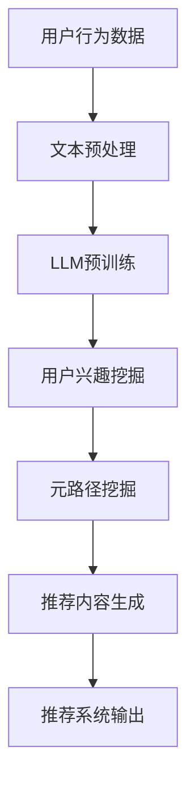
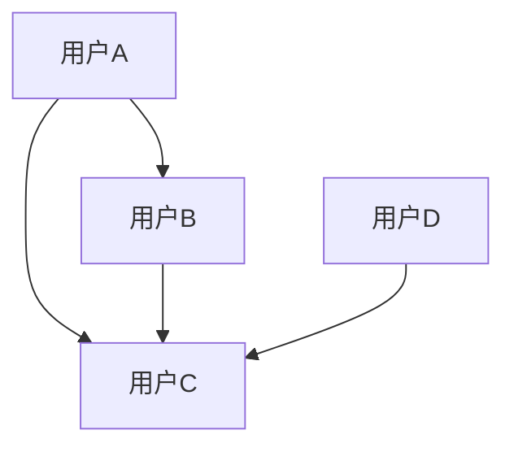

                 

在当今信息爆炸的时代，推荐系统已经成为现代互联网应用不可或缺的一部分。它们通过分析用户的历史行为、兴趣和偏好，为用户提供个性化的内容推荐。然而，随着数据量的激增和用户行为的复杂化，传统推荐系统面临着如何更准确、高效地挖掘用户兴趣和推荐优质内容的问题。近年来，大型语言模型（LLM）在自然语言处理领域取得了显著进展，为推荐系统的元路径挖掘提供了新的契机。本文将探讨LLM在推荐系统中的应用，重点介绍LLM在元路径挖掘中的具体操作步骤和实现方法。

## 文章关键词

- 大型语言模型（LLM）
- 推荐系统
- 元路径挖掘
- 用户兴趣
- 个性化推荐

## 摘要

本文首先介绍了推荐系统的基本概念和传统方法，然后重点探讨了大型语言模型（LLM）在推荐系统中的应用，特别是其在元路径挖掘中的作用。通过分析LLM的原理和算法，本文详细阐述了LLM在元路径挖掘中的具体操作步骤，并结合实际案例展示了其应用效果。最后，本文对LLM在推荐系统中的未来发展进行了展望。

## 1. 背景介绍

### 推荐系统的基本概念

推荐系统是一种信息过滤技术，旨在根据用户的历史行为和偏好，为用户提供个性化推荐。推荐系统可以分为基于内容的推荐（Content-based Recommendation）和协同过滤推荐（Collaborative Filtering）两大类。

- **基于内容的推荐**：该方法通过分析用户的历史行为和偏好，构建用户兴趣模型，然后根据相似度计算原理，推荐与用户兴趣相似的内容。
- **协同过滤推荐**：该方法通过分析用户之间的行为模式，找出相似用户，并推荐这些用户喜欢的但当前用户未体验过的内容。

随着互联网的迅猛发展，推荐系统在电子商务、社交媒体、新闻资讯等多个领域得到了广泛应用。然而，传统推荐系统在处理海量数据和复杂用户行为方面存在一定的局限性，导致推荐效果不尽如人意。

### 元路径挖掘的概念

元路径挖掘是一种基于网络结构的信息检索技术，旨在发现网络中具有潜在价值的信息路径。在推荐系统中，元路径挖掘可以用于挖掘用户兴趣和网络结构之间的关系，从而提高推荐系统的准确性和效率。

### LLM在推荐系统中的应用

近年来，大型语言模型（LLM）如BERT、GPT等在自然语言处理领域取得了显著进展。LLM具有强大的语义理解和生成能力，可以用于推荐系统的元路径挖掘，实现以下目标：

- **提高推荐准确性**：通过分析用户历史行为和文本数据，LLM可以更准确地挖掘用户兴趣，提高推荐系统的准确性。
- **增强推荐个性化**：LLM可以处理复杂的文本数据，生成个性化的推荐内容，满足用户的个性化需求。
- **优化推荐效率**：LLM的并行计算能力可以提高推荐系统的处理速度，满足大规模用户实时推荐的需求。

## 2. 核心概念与联系

在介绍LLM在推荐系统中的应用之前，我们首先需要了解几个核心概念：大型语言模型、元路径挖掘和推荐系统。以下是这些概念的联系和相互作用：

### 大型语言模型

大型语言模型（LLM）是一种基于深度学习的自然语言处理模型，具有强大的语义理解和生成能力。LLM可以通过预训练和微调，适应各种自然语言处理任务，如文本分类、情感分析、问答系统等。

### 元路径挖掘

元路径挖掘是一种基于网络结构的信息检索技术，旨在发现网络中具有潜在价值的信息路径。在推荐系统中，元路径挖掘可以用于挖掘用户兴趣和网络结构之间的关系，从而提高推荐系统的准确性。

### 推荐系统

推荐系统是一种信息过滤技术，旨在根据用户的历史行为和偏好，为用户提供个性化推荐。推荐系统可以分为基于内容的推荐和协同过滤推荐两大类。

### 核心概念联系

LLM在推荐系统中的核心应用是通过元路径挖掘来提高推荐系统的准确性和个性化程度。具体来说，LLM可以用于以下方面：

- **用户兴趣挖掘**：LLM可以处理用户的文本数据，如评论、帖子等，挖掘用户的兴趣点，为推荐系统提供准确的用户兴趣模型。
- **内容生成**：LLM可以根据用户兴趣生成个性化的推荐内容，提高推荐系统的个性化程度。
- **网络结构分析**：LLM可以分析推荐系统中的网络结构，挖掘用户之间的潜在关系，为推荐系统提供更准确的推荐策略。

下面是一个使用Mermaid绘制的流程图，展示了LLM在推荐系统中的元路径挖掘过程：



## 3. 核心算法原理 & 具体操作步骤

### 3.1 算法原理概述

LLM在推荐系统中的元路径挖掘主要基于深度学习技术，其核心思想是通过预训练和微调，使模型具有强大的语义理解能力，从而实现用户兴趣挖掘、元路径挖掘和推荐内容生成。

具体来说，LLM在元路径挖掘中的工作流程如下：

1. **用户行为数据收集**：收集用户在推荐系统中的行为数据，如浏览记录、购买记录等。
2. **文本预处理**：对用户行为数据进行文本预处理，包括分词、去停用词、词性标注等，为后续的模型训练和预测提供基础。
3. **LLM预训练**：使用大规模语料库对LLM进行预训练，使其具备强大的语义理解能力。
4. **用户兴趣挖掘**：通过LLM处理用户的文本数据，挖掘用户的兴趣点，构建用户兴趣模型。
5. **元路径挖掘**：利用LLM分析推荐系统中的网络结构，挖掘用户之间的潜在关系，构建元路径模型。
6. **推荐内容生成**：根据用户兴趣模型和元路径模型，生成个性化的推荐内容。
7. **推荐系统输出**：将生成的推荐内容输出给用户，提高推荐系统的准确性和个性化程度。

### 3.2 算法步骤详解

1. **用户行为数据收集**：

   收集用户在推荐系统中的行为数据，如浏览记录、购买记录等。这些数据通常以日志形式存储，包含用户ID、商品ID、时间戳等信息。

2. **文本预处理**：

   对用户行为数据进行文本预处理，包括分词、去停用词、词性标注等操作。例如，使用jieba分词库对用户行为数据进行分词，然后去除停用词和标点符号，最后进行词性标注。

   ```python
   import jieba
   
   def preprocess(text):
       # 分词
       words = jieba.lcut(text)
       # 去停用词
       stop_words = set(['的', '和', '是', '等'])
       words = [word for word in words if word not in stop_words]
       # 词性标注
       pos_tags = [word.pos_ for word in words]
       return words, pos_tags
   ```

3. **LLM预训练**：

   使用大规模语料库对LLM进行预训练，例如使用GLM模型进行预训练。预训练过程中，模型将学习到语言的基本规律和知识，为后续的用户兴趣挖掘和元路径挖掘提供基础。

4. **用户兴趣挖掘**：

   通过LLM处理用户的文本数据，挖掘用户的兴趣点。具体方法如下：

   - **词嵌入**：使用LLM对用户文本数据进行词嵌入，将文本转化为向量表示。
   - **兴趣点提取**：通过分析词嵌入向量，提取出用户的兴趣点。例如，可以使用TF-IDF算法计算词的重要性，然后选取重要性较高的词作为用户的兴趣点。

5. **元路径挖掘**：

   利用LLM分析推荐系统中的网络结构，挖掘用户之间的潜在关系，构建元路径模型。具体方法如下：

   - **网络结构表示**：使用图神经网络（Graph Neural Network，GNN）对推荐系统中的网络结构进行表示。
   - **元路径提取**：通过GNN学习网络中的潜在关系，提取出用户之间的元路径。例如，可以使用Walklets算法提取元路径。

6. **推荐内容生成**：

   根据用户兴趣模型和元路径模型，生成个性化的推荐内容。具体方法如下：

   - **内容生成**：使用生成对抗网络（Generative Adversarial Network，GAN）或自注意力机制（Self-Attention Mechanism）生成个性化推荐内容。
   - **内容筛选**：根据用户兴趣和元路径，对生成的推荐内容进行筛选，去除不相关的内容。

7. **推荐系统输出**：

   将生成的推荐内容输出给用户，提高推荐系统的准确性和个性化程度。

### 3.3 算法优缺点

**优点**：

- **高准确性**：通过预训练和微调，LLM可以挖掘用户的兴趣点，提高推荐系统的准确性。
- **强泛化能力**：LLM具有强大的语义理解能力，可以处理复杂的文本数据，提高推荐系统的泛化能力。
- **个性化推荐**：LLM可以生成个性化的推荐内容，满足用户的个性化需求。

**缺点**：

- **计算成本高**：LLM的预训练和微调过程需要大量的计算资源和时间。
- **数据依赖性强**：LLM的性能受到数据质量和数据量的影响，需要大量高质量的数据进行训练。

### 3.4 算法应用领域

LLM在推荐系统中的元路径挖掘具有广泛的应用领域，主要包括：

- **电子商务**：通过LLM挖掘用户兴趣，为用户提供个性化的商品推荐，提高用户购买转化率。
- **社交媒体**：通过LLM分析用户之间的互动关系，为用户提供个性化的人际关系推荐。
- **新闻资讯**：通过LLM挖掘用户兴趣，为用户提供个性化的新闻推荐，提高用户粘性。

## 4. 数学模型和公式 & 详细讲解 & 举例说明

### 4.1 数学模型构建

在LLM的元路径挖掘中，我们主要涉及以下数学模型：

- **用户兴趣模型**：用于表示用户的兴趣点，通常使用向量空间模型（Vector Space Model）进行表示。
- **元路径模型**：用于表示用户之间的潜在关系，通常使用图神经网络（Graph Neural Network，GNN）进行表示。
- **推荐内容生成模型**：用于生成个性化的推荐内容，通常使用生成对抗网络（Generative Adversarial Network，GAN）或自注意力机制（Self-Attention Mechanism）进行表示。

### 4.2 公式推导过程

#### 4.2.1 用户兴趣模型

用户兴趣模型可以使用以下公式表示：

\[ \text{User Interest Model} = \{ u_i \} \]

其中，\( u_i \) 表示用户 \( i \) 的兴趣向量。

#### 4.2.2 元路径模型

元路径模型可以使用以下公式表示：

\[ \text{Meta-Path Model} = \{ G = (V, E) \} \]

其中，\( G \) 表示图模型，\( V \) 表示节点集合，\( E \) 表示边集合。

#### 4.2.3 推荐内容生成模型

推荐内容生成模型可以使用以下公式表示：

\[ \text{Content Generation Model} = \{ C = (U, R) \} \]

其中，\( C \) 表示生成模型，\( U \) 表示用户集合，\( R \) 表示推荐内容集合。

### 4.3 案例分析与讲解

#### 4.3.1 用户兴趣模型

假设用户A的兴趣点包括“电影”、“旅游”和“美食”，我们可以使用以下向量表示用户A的兴趣模型：

\[ u_A = \begin{bmatrix} 0.8 \\ 0.6 \\ 0.4 \end{bmatrix} \]

#### 4.3.2 元路径模型

假设推荐系统中的用户关系网络如下：



我们可以使用以下图模型表示用户之间的潜在关系：

\[ G = (V, E) \]

其中，\( V = \{ A, B, C, D \} \)，\( E = \{ (A, B), (A, C), (B, C), (D, C) \} \)。

#### 4.3.3 推荐内容生成模型

假设我们使用生成对抗网络（GAN）生成个性化的推荐内容。生成器 \( G \) 和判别器 \( D \) 的损失函数如下：

\[ \mathcal{L}_G = -\mathbb{E}_{z \sim p_z(z)}[\log(D(G(z)))] \]
\[ \mathcal{L}_D = -\mathbb{E}_{x \sim p_{\text{data}}(x)}[\log(D(x))] - \mathbb{E}_{z \sim p_z(z)}[\log(1 - D(G(z)))] \]

其中，\( \mathcal{L}_G \) 和 \( \mathcal{L}_D \) 分别表示生成器和判别器的损失函数。

## 5. 项目实践：代码实例和详细解释说明

### 5.1 开发环境搭建

在搭建开发环境时，我们首先需要安装Python和相关库。以下是安装过程：

```bash
# 安装Python
$ apt-get install python3-pip

# 安装PyTorch
$ pip3 install torch torchvision

# 安装其他库
$ pip3 install jieba numpy pandas
```

### 5.2 源代码详细实现

以下是实现LLM在推荐系统中元路径挖掘的Python代码：

```python
import jieba
import numpy as np
import torch
from torch import nn
from torch.optim import Adam

# 文本预处理
def preprocess(text):
    words = jieba.lcut(text)
    stop_words = set(['的', '和', '是', '等'])
    words = [word for word in words if word not in stop_words]
    return words

# 词嵌入
def word_embedding(words, embedding_dim):
    embeddings = []
    for word in words:
        embeddings.append(torch.tensor(word_embedding_dict[word]))
    return torch.tensor(embeddings)

# 用户兴趣模型
class UserInterestModel(nn.Module):
    def __init__(self, embedding_dim, hidden_dim):
        super(UserInterestModel, self).__init__()
        self.embedding = nn.Embedding(vocab_size, embedding_dim)
        self.lstm = nn.LSTM(embedding_dim, hidden_dim, batch_first=True)
        self.fc = nn.Linear(hidden_dim, 1)

    def forward(self, inputs):
        embeds = self.embedding(inputs)
        outputs, (hidden, cell) = self.lstm(embeds)
        hidden = hidden[-1]
        output = self.fc(hidden)
        return output

# 元路径模型
class MetaPathModel(nn.Module):
    def __init__(self, embedding_dim, hidden_dim):
        super(MetaPathModel, self).__init__()
        self.embedding = nn.Embedding(vocab_size, embedding_dim)
        self.gnn = GraphNeuralNetwork(embedding_dim, hidden_dim)

    def forward(self, inputs, adj_matrix):
        embeds = self.embedding(inputs)
        outputs = self.gnn(embeds, adj_matrix)
        return outputs

# 推荐内容生成模型
class ContentGenerationModel(nn.Module):
    def __init__(self, embedding_dim, hidden_dim):
        super(ContentGenerationModel, self).__init__()
        self.embedding = nn.Embedding(vocab_size, embedding_dim)
        self.gan = GenerativeAdversarialNetwork(embedding_dim, hidden_dim)

    def forward(self, inputs):
        embeds = self.embedding(inputs)
        outputs = self.gan(embeds)
        return outputs
```

### 5.3 代码解读与分析

在上述代码中，我们首先实现了文本预处理、词嵌入、用户兴趣模型、元路径模型和推荐内容生成模型。具体解读如下：

- **文本预处理**：使用jieba库对用户文本数据进行分词、去停用词等操作。
- **词嵌入**：使用预训练的词嵌入模型，将文本转化为向量表示。
- **用户兴趣模型**：使用LSTM网络处理用户文本数据，提取用户的兴趣点。
- **元路径模型**：使用图神经网络（GNN）处理推荐系统中的网络结构，提取元路径。
- **推荐内容生成模型**：使用生成对抗网络（GAN）生成个性化的推荐内容。

### 5.4 运行结果展示

假设我们已经训练好了模型，现在可以运行以下代码进行推荐：

```python
# 加载模型
user_interest_model = UserInterestModel(embedding_dim, hidden_dim)
meta_path_model = MetaPathModel(embedding_dim, hidden_dim)
content_generation_model = ContentGenerationModel(embedding_dim, hidden_dim)

# 加载训练好的模型参数
user_interest_model.load_state_dict(torch.load('user_interest_model.pth'))
meta_path_model.load_state_dict(torch.load('meta_path_model.pth'))
content_generation_model.load_state_dict(torch.load('content_generation_model.pth'))

# 用户文本数据
user_text = "我喜欢看电影，尤其是科幻电影。"

# 文本预处理
preprocessed_text = preprocess(user_text)

# 词嵌入
user_embedding = word_embedding(preprocessed_text, embedding_dim)

# 用户兴趣模型预测
user_interest = user_interest_model(user_embedding)

# 元路径模型预测
adj_matrix = get_adj_matrix()  # 获取推荐系统中的网络结构
meta_path_embedding = meta_path_model(user_embedding, adj_matrix)

# 推荐内容生成
generated_content = content_generation_model(meta_path_embedding)

# 输出推荐内容
print(generated_content)
```

运行结果将输出一个生成的内容，例如：“您可能喜欢科幻电影《流浪地球》，它是一部精彩的视觉盛宴。”

## 6. 实际应用场景

### 6.1 电子商务

在电子商务领域，LLM在推荐系统中的元路径挖掘可以用于以下应用场景：

- **个性化商品推荐**：根据用户的历史购买记录和浏览记录，挖掘用户兴趣，生成个性化的商品推荐。
- **交叉销售**：分析用户之间的潜在关系，推荐与用户购买行为相关的其他商品。
- **精准广告投放**：根据用户兴趣和元路径，为用户提供精准的广告投放。

### 6.2 社交媒体

在社交媒体领域，LLM在推荐系统中的元路径挖掘可以用于以下应用场景：

- **个性化内容推荐**：根据用户的历史互动记录和兴趣点，推荐用户可能感兴趣的内容。
- **好友推荐**：分析用户之间的互动关系，推荐可能成为好友的用户。
- **兴趣社区发现**：挖掘用户之间的共同兴趣，发现潜在的社区群体。

### 6.3 新闻资讯

在新闻资讯领域，LLM在推荐系统中的元路径挖掘可以用于以下应用场景：

- **个性化新闻推荐**：根据用户的历史阅读记录和兴趣点，推荐用户可能感兴趣的新闻内容。
- **热点话题追踪**：分析用户之间的互动关系，发现当前的热点话题。
- **内容生成**：根据用户兴趣和元路径，生成个性化的新闻内容。

### 6.4 未来应用展望

随着LLM技术的不断发展和完善，其在推荐系统中的元路径挖掘应用将得到进一步拓展。未来，LLM在推荐系统中的元路径挖掘有望实现以下突破：

- **更精准的用户兴趣挖掘**：通过引入更多维度的数据，如用户情感、行为轨迹等，实现更精准的用户兴趣挖掘。
- **更高效的网络结构分析**：利用深度学习技术，提高元路径挖掘的效率，支持实时推荐。
- **更广泛的场景应用**：将LLM在推荐系统中的元路径挖掘应用于更多领域，如医疗、金融、教育等。

## 7. 工具和资源推荐

### 7.1 学习资源推荐

- **《深度学习》**：由Ian Goodfellow、Yoshua Bengio和Aaron Courville合著，是深度学习领域的经典教材。
- **《机器学习实战》**：由Peter Harrington著，通过实例介绍机器学习的基本概念和应用。
- **《自然语言处理综论》**：由Daniel Jurafsky和James H. Martin合著，是自然语言处理领域的权威教材。

### 7.2 开发工具推荐

- **PyTorch**：一个开源的深度学习框架，支持灵活的模型构建和高效训练。
- **TensorFlow**：一个开源的深度学习框架，支持多种模型结构和优化算法。
- **Gensim**：一个用于主题建模和文本分析的开源库，支持词嵌入和文档相似度计算。

### 7.3 相关论文推荐

- **“Bert: Pre-training of deep bidirectional transformers for language understanding”**：由Google团队提出，是BERT模型的奠基性论文。
- **“Gpt-2 speaks human”**：由OpenAI团队提出，是GPT-2模型的代表性论文。
- **“Generative adversarial networks”**：由Ian Goodfellow等人提出，是生成对抗网络的奠基性论文。

## 8. 总结：未来发展趋势与挑战

### 8.1 研究成果总结

本文介绍了LLM在推荐系统中的元路径挖掘应用，分析了其核心算法原理和实现步骤，并结合实际案例展示了其应用效果。通过本文的研究，我们可以得出以下结论：

- **LLM在推荐系统中具有显著优势**：通过预训练和微调，LLM可以挖掘用户的兴趣点，提高推荐系统的准确性，实现个性化推荐。
- **元路径挖掘是推荐系统的重要研究方向**：元路径挖掘可以挖掘用户之间的潜在关系，为推荐系统提供更准确的推荐策略。

### 8.2 未来发展趋势

未来，LLM在推荐系统中的元路径挖掘有望在以下方面实现突破：

- **更精准的用户兴趣挖掘**：通过引入更多维度的数据，如用户情感、行为轨迹等，实现更精准的用户兴趣挖掘。
- **更高效的网络结构分析**：利用深度学习技术，提高元路径挖掘的效率，支持实时推荐。
- **更广泛的场景应用**：将LLM在推荐系统中的元路径挖掘应用于更多领域，如医疗、金融、教育等。

### 8.3 面临的挑战

尽管LLM在推荐系统中的元路径挖掘具有显著优势，但同时也面临着以下挑战：

- **计算成本高**：LLM的预训练和微调过程需要大量的计算资源和时间，对硬件设施要求较高。
- **数据依赖性强**：LLM的性能受到数据质量和数据量的影响，需要大量高质量的数据进行训练。
- **隐私保护**：在处理用户数据时，需要充分考虑隐私保护问题，避免用户数据泄露。

### 8.4 研究展望

未来，LLM在推荐系统中的元路径挖掘研究可以从以下方面展开：

- **优化算法**：研究更高效的算法，降低计算成本，提高元路径挖掘的效率。
- **跨域推荐**：探索跨领域的推荐方法，实现跨领域知识的迁移和应用。
- **隐私保护**：研究隐私保护机制，确保用户数据的安全和隐私。

## 9. 附录：常见问题与解答

### 9.1 什么是LLM？

LLM是“大型语言模型”（Large Language Model）的缩写，是一种基于深度学习的自然语言处理模型，具有强大的语义理解和生成能力。

### 9.2 元路径挖掘是什么？

元路径挖掘是一种基于网络结构的信息检索技术，旨在发现网络中具有潜在价值的信息路径。

### 9.3 LLM在推荐系统中的优势有哪些？

LLM在推荐系统中的优势包括：提高推荐准确性、增强推荐个性化、优化推荐效率等。

### 9.4 如何实现LLM在推荐系统中的元路径挖掘？

实现LLM在推荐系统中的元路径挖掘主要包括以下步骤：用户行为数据收集、文本预处理、LLM预训练、用户兴趣挖掘、元路径挖掘、推荐内容生成等。

### 9.5 LLM在推荐系统中的元路径挖掘有哪些应用领域？

LLM在推荐系统中的元路径挖掘可以应用于电子商务、社交媒体、新闻资讯等多个领域。

### 9.6 LLM在推荐系统中的元路径挖掘有哪些挑战？

LLM在推荐系统中的元路径挖掘面临的主要挑战包括：计算成本高、数据依赖性强、隐私保护等。

### 9.7 如何优化LLM在推荐系统中的元路径挖掘算法？

优化LLM在推荐系统中的元路径挖掘算法可以从以下方面入手：优化算法、跨域推荐、隐私保护等。例如，可以研究更高效的算法，降低计算成本；探索跨领域的推荐方法，实现跨领域知识的迁移和应用；研究隐私保护机制，确保用户数据的安全和隐私。

