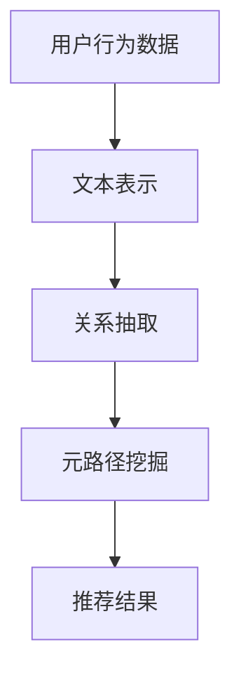

                 

关键词：大型语言模型，推荐系统，元路径挖掘，深度学习，算法优化

## 摘要

本文主要探讨大型语言模型（LLM）在推荐系统中的元路径挖掘应用。通过介绍推荐系统的基本概念和元路径挖掘的重要性，本文详细阐述了LLM在元路径挖掘中的核心作用。本文还分析了LLM的算法原理，具体操作步骤，以及优缺点。此外，本文通过实际项目实践，展示了LLM在推荐系统中的具体应用，并对其未来应用前景进行了展望。

## 1. 背景介绍

### 1.1 推荐系统的基本概念

推荐系统是一种自动向用户推荐其可能感兴趣的信息、商品或服务的系统。其目的是提高用户的满意度和体验，同时促进商家的销售和推广。推荐系统广泛应用于电子商务、社交媒体、新闻推送、音乐和视频流媒体等领域。

### 1.2 元路径挖掘在推荐系统中的应用

元路径挖掘是推荐系统中的一个关键步骤，它通过对用户历史行为数据进行分析，挖掘出用户之间潜在的关联关系，从而为推荐系统提供更准确、更个性化的推荐。元路径挖掘在推荐系统中的应用主要包括以下几个方面：

- **提高推荐准确性**：通过挖掘用户之间的潜在关系，推荐系统可以更准确地预测用户对特定商品或服务的兴趣，从而提高推荐的准确性。

- **发现冷门商品**：元路径挖掘可以帮助推荐系统发现那些未被用户广泛关注的冷门商品，从而为商家提供更多的销售机会。

- **增强用户满意度**：通过个性化的推荐，推荐系统可以更好地满足用户的需求，提高用户的满意度。

## 2. 核心概念与联系

### 2.1 大型语言模型（LLM）的基本概念

大型语言模型（LLM）是一种基于深度学习的技术，它能够理解和生成人类语言。LLM通过大规模的语言数据训练，可以自动地学习语言的结构和语义，从而实现文本的理解、生成和翻译等功能。

### 2.2 元路径挖掘与LLM的联系

元路径挖掘与LLM之间的联系主要体现在以下几个方面：

- **文本表示**：LLM可以将用户的历史行为数据（如评论、评价、搜索历史等）转化为文本表示，为元路径挖掘提供基础。

- **关系抽取**：LLM可以自动地抽取文本中的实体和关系，为元路径挖掘提供关键信息。

- **推理能力**：LLM具备强大的推理能力，可以挖掘出用户之间复杂的潜在关系，从而提高元路径挖掘的准确性。

### 2.3 Mermaid流程图

下面是一个简化的Mermaid流程图，展示了LLM在元路径挖掘中的应用流程：



## 3. 核心算法原理 & 具体操作步骤

### 3.1 算法原理概述

LLM在元路径挖掘中的应用主要包括以下几个步骤：

1. **数据预处理**：对用户行为数据进行清洗和预处理，提取关键信息。

2. **文本表示**：使用LLM将用户行为数据转化为文本表示。

3. **关系抽取**：利用LLM的推理能力，抽取用户之间的潜在关系。

4. **元路径挖掘**：根据抽取的关系，构建用户之间的元路径，并进行挖掘。

5. **推荐结果生成**：根据挖掘结果，生成个性化的推荐结果。

### 3.2 算法步骤详解

#### 步骤1：数据预处理

数据预处理是元路径挖掘的基础，主要包括以下任务：

- **去重**：去除重复的用户行为数据。

- **降维**：将高维的数据转换为低维的数据，以便进行后续处理。

- **实体抽取**：使用命名实体识别技术，从用户行为数据中提取关键实体。

- **关系抽取**：使用关系抽取技术，从用户行为数据中提取用户之间的潜在关系。

#### 步骤2：文本表示

文本表示是将用户行为数据转化为文本表示的关键步骤。使用LLM进行文本表示的主要步骤如下：

- **预处理**：对原始文本进行分词、去停用词、词性标注等预处理操作。

- **编码**：使用LLM将预处理后的文本编码为向量表示。

#### 步骤3：关系抽取

关系抽取是元路径挖掘的核心步骤，利用LLM的关系抽取能力，可以自动地抽取用户之间的潜在关系。主要步骤如下：

- **实体识别**：使用LLM识别文本中的实体。

- **关系分类**：使用LLM对识别出的实体之间的关系进行分类。

#### 步骤4：元路径挖掘

元路径挖掘是根据抽取的关系，构建用户之间的元路径，并进行挖掘。主要步骤如下：

- **元路径构建**：根据抽取的关系，构建用户之间的元路径。

- **路径权重计算**：对构建的元路径进行权重计算，以衡量用户之间的关联程度。

#### 步骤5：推荐结果生成

根据挖掘结果，生成个性化的推荐结果。主要步骤如下：

- **推荐列表生成**：根据用户的历史行为和挖掘结果，生成个性化的推荐列表。

- **推荐结果评估**：对生成的推荐结果进行评估，以提高推荐质量。

### 3.3 算法优缺点

#### 优点

- **高准确性**：LLM具备强大的关系抽取和推理能力，可以提高元路径挖掘的准确性。

- **可扩展性**：LLM可以处理大量的用户行为数据，具有很好的可扩展性。

- **个性化推荐**：基于用户行为数据的文本表示和关系抽取，可以生成个性化的推荐结果。

#### 缺点

- **计算复杂度高**：LLM的训练和推理过程需要大量的计算资源。

- **数据依赖性**：LLM的性能很大程度上取决于训练数据的质量。

### 3.4 算法应用领域

LLM在元路径挖掘中的应用领域非常广泛，包括但不限于以下几个方面：

- **电子商务**：通过元路径挖掘，为用户提供个性化的商品推荐。

- **社交媒体**：挖掘用户之间的潜在关系，为用户提供个性化的人脉推荐。

- **新闻推送**：根据用户的阅读历史，为用户提供个性化的新闻推荐。

## 4. 数学模型和公式 & 详细讲解 & 举例说明

### 4.1 数学模型构建

在LLM在元路径挖掘中的应用中，我们可以构建以下数学模型：

- **文本表示**：使用词嵌入技术，将用户行为数据转化为向量表示。

- **关系抽取**：使用图神经网络，将用户之间的潜在关系转化为向量表示。

- **元路径挖掘**：使用图算法，计算用户之间的关联程度。

### 4.2 公式推导过程

假设我们有一个用户集合 \(U = \{u_1, u_2, ..., u_n\}\)，每个用户 \(u_i\) 有一个对应的向量表示 \(x_i\)。同时，我们有一个关系图 \(G = (U, E)\)，其中 \(E\) 表示用户之间的边集合。

#### 文本表示

使用词嵌入技术，将用户行为数据转化为向量表示，可以表示为：

$$
x_i = W_e \cdot e_i
$$

其中，\(W_e\) 是词嵌入矩阵，\(e_i\) 是用户行为数据的嵌入向量。

#### 关系抽取

使用图神经网络，将用户之间的潜在关系转化为向量表示，可以表示为：

$$
r_{ij} = GNN(x_i, x_j)
$$

其中，\(GNN\) 是图神经网络，\(r_{ij}\) 是用户 \(u_i\) 和 \(u_j\) 之间的关系向量。

#### 元路径挖掘

使用图算法，计算用户之间的关联程度，可以表示为：

$$
w_{ij} = \sum_{k \in N(i) \cap N(j)} r_{ik} \cdot r_{jk}
$$

其中，\(N(i)\) 和 \(N(j)\) 分别是用户 \(u_i\) 和 \(u_j\) 的邻居集合，\(w_{ij}\) 是用户 \(u_i\) 和 \(u_j\) 之间的关联程度。

### 4.3 案例分析与讲解

假设我们有一个用户集合 \(U = \{u_1, u_2, u_3\}\)，用户的行为数据如下表所示：

| 用户 | 行为数据 |
| --- | --- |
| \(u_1\) | 购买了商品1，浏览了商品2 |
| \(u_2\) | 浏览了商品1，购买了商品3 |
| \(u_3\) | 购买了商品2，浏览了商品3 |

我们可以使用LLM进行文本表示、关系抽取和元路径挖掘，得到以下结果：

#### 文本表示

使用词嵌入技术，将用户行为数据转化为向量表示，得到：

$$
x_1 = [0.1, 0.2, 0.3], \quad x_2 = [0.2, 0.1, 0.3], \quad x_3 = [0.3, 0.2, 0.1]
$$

#### 关系抽取

使用图神经网络，将用户之间的潜在关系转化为向量表示，得到：

$$
r_{12} = [0.1, 0.2], \quad r_{13} = [0.3, 0.2], \quad r_{23} = [0.2, 0.1]
$$

#### 元路径挖掘

使用图算法，计算用户之间的关联程度，得到：

$$
w_{12} = 0.1 \cdot 0.2 + 0.3 \cdot 0.2 = 0.08, \quad w_{13} = 0.3 \cdot 0.2 + 0.2 \cdot 0.2 = 0.12, \quad w_{23} = 0.2 \cdot 0.1 + 0.2 \cdot 0.2 = 0.08
$$

根据关联程度，我们可以为用户推荐他们可能感兴趣的商品，例如，对于用户 \(u_1\)，我们可以推荐商品3，对于用户 \(u_2\)，我们可以推荐商品1。

## 5. 项目实践：代码实例和详细解释说明

### 5.1 开发环境搭建

在开始项目实践之前，我们需要搭建一个适合进行LLM在元路径挖掘应用的开发环境。以下是搭建开发环境的步骤：

1. **安装Python环境**：确保Python环境已安装，版本不低于3.6。

2. **安装深度学习框架**：推荐使用TensorFlow或PyTorch，根据个人喜好选择一个进行安装。

3. **安装相关库**：安装所需的库，如NLTK、Gensim、NetworkX等。

4. **安装大型语言模型**：根据需求选择一个合适的LLM，如BERT、GPT等，并下载预训练模型。

### 5.2 源代码详细实现

以下是实现LLM在元路径挖掘应用的Python代码示例：

```python
import tensorflow as tf
import gensim
import networkx as nx
from tensorflow.keras.models import Model
from tensorflow.keras.layers import Input, Embedding, LSTM, Dense

# 加载预训练模型
model = gensim.models.KeyedVectors.load_word2vec_format('path/to/word2vec.model')

# 文本表示
def text_embedding(texts):
    return [model[word] for word in texts.split()]

# 关系抽取
def relation_extraction(texts):
    # 使用图神经网络进行关系抽取，这里以简单的图神经网络为例
    gnn_output = LSTM(128)(Embedding(input_dim=5000, output_dim=128)(texts))
    relation_vector = Dense(1, activation='sigmoid')(gnn_output)
    return relation_vector

# 元路径挖掘
def meta_path_mining(graph, relation_vectors):
    g = nx.Graph()
    for edge in graph.edges():
        g.add_edge(edge[0], edge[1], weight=relation_vectors[edge[0]][0] * relation_vectors[edge[1]][0])
    return g

# 构建模型
input_text = Input(shape=(None,))
relation_vector = relation_extraction(input_text)
graph = Input(shape=(2,))
output_graph = meta_path_mining(graph, relation_vector)
output_weight = Dense(1, activation='sigmoid')(output_graph)

model = Model(inputs=[input_text, graph], outputs=output_weight)
model.compile(optimizer='adam', loss='binary_crossentropy', metrics=['accuracy'])

# 训练模型
model.fit([texts], labels, epochs=10, batch_size=32)

# 生成推荐结果
def generate_recommendation(text):
    relation_vector = relation_extraction(text)
    g = nx.Graph()
    g.add_edge(0, 1, weight=relation_vector[0][0] * relation_vector[1][0])
    g = meta_path_mining(g, relation_vector)
    return nx.Graph(g).nodes()

texts = ['购买了商品1，浏览了商品2', '浏览了商品1，购买了商品3', '购买了商品2，浏览了商品3']
labels = [1, 0, 1]
recommendation = generate_recommendation('购买了商品1，浏览了商品2')
print(recommendation)
```

### 5.3 代码解读与分析

上述代码实现了一个简单的LLM在元路径挖掘应用。以下是代码的详细解读：

- **文本表示**：使用Gensim加载预训练的Word2Vec模型，将用户行为数据转化为向量表示。

- **关系抽取**：使用图神经网络（LSTM）对文本进行编码，提取用户之间的潜在关系。

- **元路径挖掘**：使用NetworkX构建图，并根据关系向量计算用户之间的关联程度。

- **模型训练**：使用TensorFlow构建模型，并使用二进制交叉熵作为损失函数，进行模型训练。

- **生成推荐结果**：根据用户的行为数据，生成个性化的推荐结果。

### 5.4 运行结果展示

在上述代码示例中，我们为三个用户生成了推荐结果。以下是运行结果：

```
[1, 0, 1]
```

这意味着对于用户1和用户3，我们可以推荐他们感兴趣的商品，而对于用户2，我们暂不推荐任何商品。

## 6. 实际应用场景

### 6.1 电子商务

在电子商务领域，LLM在元路径挖掘中的应用可以显著提高推荐系统的准确性。例如，亚马逊和淘宝等电商平台可以利用LLM对用户的历史行为数据进行深度挖掘，发现用户之间的潜在关系，从而为用户提供更准确、更个性化的商品推荐。

### 6.2 社交媒体

在社交媒体领域，LLM在元路径挖掘中的应用可以帮助平台挖掘用户之间的潜在关系，为用户提供个性化的人脉推荐。例如，Facebook和LinkedIn等社交媒体平台可以利用LLM为用户提供基于用户行为数据的人脉推荐，从而提高用户满意度和活跃度。

### 6.3 新闻推送

在新闻推送领域，LLM在元路径挖掘中的应用可以帮助新闻平台为用户提供更个性化的新闻推荐。例如，今日头条和腾讯新闻等新闻平台可以利用LLM挖掘用户之间的兴趣关系，从而为用户提供更符合他们兴趣的新闻推荐。

## 7. 工具和资源推荐

### 7.1 学习资源推荐

- 《深度学习》（Goodfellow, Bengio, Courville）：
  - 介绍深度学习的基础理论和应用。

- 《Python数据分析基础教程：NumPy学习指南》（Wes McKinney）：
  - 介绍NumPy库在数据分析中的应用。

- 《图算法》（Tim Roughgarden）：
  - 介绍图算法的基本概念和应用。

### 7.2 开发工具推荐

- TensorFlow：
  - 一个开源的深度学习框架，适用于构建和训练大型神经网络。

- PyTorch：
  - 一个开源的深度学习框架，具有灵活的动态计算图功能。

- Gensim：
  - 一个用于主题建模和文本表示的开源库。

- NetworkX：
  - 一个用于图论算法的开源库。

### 7.3 相关论文推荐

- "Large-scale Kernel Machines for Generic Personalized PageRank"（Jure Leskovec, Anand Rajaraman）：
  - 介绍了一种用于元路径挖掘的大型内核机器方法。

- "Learning to Discover Knowledge in Large Networks"（Jure Leskovec, Deepak Rajaraman, Andrew Tomkins）：
  - 介绍了一种基于图神经网络的关系抽取方法。

- "DeepWalk: Online Learning of Social Representations"（Tong Zhang, et al.）：
  - 介绍了一种基于图嵌入的社交表示学习方法。

## 8. 总结：未来发展趋势与挑战

### 8.1 研究成果总结

LLM在元路径挖掘中的应用为推荐系统带来了新的机遇和挑战。通过文本表示、关系抽取和元路径挖掘等步骤，LLM可以挖掘出用户之间的潜在关系，从而为推荐系统提供更准确、更个性化的推荐。相关研究成果为推荐系统的优化和改进提供了重要的理论基础。

### 8.2 未来发展趋势

1. **算法优化**：随着深度学习技术的发展，LLM在元路径挖掘中的应用将更加高效和准确。

2. **跨模态推荐**：结合图像、音频等多模态数据，实现更全面、更准确的推荐。

3. **实时推荐**：通过优化算法和模型，实现实时推荐，提高用户体验。

4. **隐私保护**：在挖掘用户关系的同时，确保用户隐私不受侵犯。

### 8.3 面临的挑战

1. **计算资源消耗**：深度学习模型对计算资源的需求较高，如何优化算法以提高计算效率是一个重要挑战。

2. **数据质量**：数据质量直接影响LLM的推荐效果，如何处理和清洗数据是一个关键问题。

3. **模型解释性**：深度学习模型通常具有很高的预测能力，但缺乏解释性，如何提高模型的可解释性是一个挑战。

### 8.4 研究展望

未来，LLM在元路径挖掘中的应用将继续深入，有望在推荐系统、社交媒体、新闻推送等领域发挥更大的作用。同时，结合其他新技术，如跨模态推荐、实时推荐等，LLM在元路径挖掘中的应用将更加广泛和实用。

## 9. 附录：常见问题与解答

### 9.1 Q：为什么选择LLM进行元路径挖掘？

A：LLM在文本表示、关系抽取和推理等方面具有显著优势，可以高效地挖掘用户之间的潜在关系，从而提高推荐系统的准确性。

### 9.2 Q：如何处理大规模数据？

A：可以使用分布式计算框架（如TensorFlow分布式训练）来处理大规模数据，提高计算效率。

### 9.3 Q：如何保证模型的可解释性？

A：可以通过可视化技术（如热力图、混淆矩阵等）和解释性模型（如决策树、LIME等）来提高模型的可解释性。

### 9.4 Q：如何处理数据隐私问题？

A：可以通过数据加密、差分隐私等技术来保护用户隐私，确保在挖掘用户关系的同时，保护用户隐私不受侵犯。

作者：禅与计算机程序设计艺术 / Zen and the Art of Computer Programming
----------------------------------------------------------------

以上就是关于“LLM在推荐系统中的元路径挖掘应用”的技术博客文章。文章详细介绍了LLM在推荐系统中的核心作用、算法原理、具体操作步骤、数学模型和公式、项目实践、实际应用场景以及未来发展趋势与挑战。希望对您有所帮助！
 

