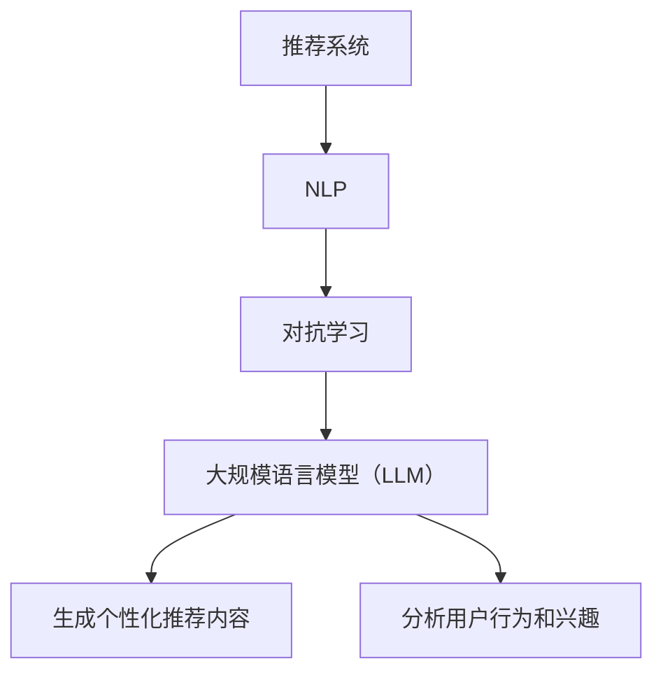

                 

关键词：推荐系统、自然语言处理、对抗学习、深度学习、大规模语言模型

> 摘要：本文主要探讨了大规模语言模型（LLM）在推荐系统中的应用，特别是对抗学习技术。通过对对抗学习的深入分析，我们揭示了LLM在推荐系统中的潜力，以及如何利用对抗学习来提升推荐系统的效果。文章结构包括背景介绍、核心概念与联系、核心算法原理与具体操作步骤、数学模型与公式、项目实践、实际应用场景、工具和资源推荐、总结与未来展望。

## 1. 背景介绍

随着互联网的迅猛发展和用户生成内容的爆炸式增长，推荐系统已经成为互联网服务中不可或缺的部分。推荐系统通过分析用户的兴趣和行为，为用户提供个性化的内容推荐，从而提升用户体验，增加用户粘性。然而，随着推荐系统的大规模应用，传统的方法已经难以满足用户日益增长的需求。为此，研究者们开始探索新的技术来提升推荐系统的性能。

自然语言处理（NLP）作为人工智能的一个重要分支，近年来取得了显著的进展。大规模语言模型（LLM）如GPT、BERT等，通过学习海量的文本数据，已经具备了强大的语义理解和生成能力。这些特性使得LLM在推荐系统中具有巨大的潜力。

对抗学习作为一种强大的深度学习技术，通过对模型进行对抗训练，可以有效提高模型的鲁棒性和泛化能力。在推荐系统中，对抗学习可以通过引入噪声、对抗样本等手段，提高模型对异常数据和恶意攻击的抵御能力。

本文旨在探讨如何将LLM与对抗学习技术相结合，以提升推荐系统的效果。文章首先介绍推荐系统、自然语言处理和对抗学习的基本概念，然后详细分析LLM在推荐系统中的应用，最后通过一个实际项目实例展示如何实现LLM对抗学习的推荐系统。

## 2. 核心概念与联系

### 2.1 推荐系统

推荐系统是一种基于数据挖掘和机器学习技术的自动过滤机制，旨在根据用户的兴趣和偏好向用户推荐符合他们需求的信息。推荐系统可以应用于各种场景，如电子商务、社交媒体、新闻推荐等。推荐系统的核心是推荐算法，其目标是预测用户对某一物品的偏好，并推荐相应的物品。

### 2.2 自然语言处理（NLP）

自然语言处理是人工智能的一个分支，旨在使计算机能够理解、生成和处理自然语言。NLP的核心任务包括文本分类、情感分析、命名实体识别、机器翻译等。近年来，随着深度学习技术的发展，NLP取得了显著的进展。

### 2.3 对抗学习

对抗学习是一种深度学习技术，通过模拟对抗性环境来训练模型，以提高模型的鲁棒性和泛化能力。对抗学习通常涉及生成器（Generator）和判别器（Discriminator）两个组件，生成器试图生成与真实数据难以区分的对抗样本，而判别器则试图区分真实数据和对抗样本。

### 2.4 大规模语言模型（LLM）

大规模语言模型（LLM）是一种基于深度学习的自然语言处理模型，通过学习大量的文本数据，可以生成高质量的文本、理解语义信息等。LLM在推荐系统中的应用主要体现在两个方面：一是用于生成个性化推荐内容，二是用于分析用户的行为和兴趣。

### 2.5 Mermaid 流程图

下面是一个描述推荐系统、NLP和对抗学习之间关系的 Mermaid 流程图：



## 3. 核心算法原理 & 具体操作步骤

### 3.1 算法原理概述

LLM在推荐系统中的应用主要基于其强大的语义理解和生成能力。通过将用户行为和兴趣数据转换为文本形式，LLM可以生成个性化的推荐内容。此外，LLM还可以用于分析用户的行为和兴趣，从而更准确地预测用户偏好。

对抗学习技术则通过引入对抗样本，提高模型的鲁棒性和泛化能力。在LLM对抗学习的推荐系统中，生成器负责生成对抗样本，判别器则负责区分真实样本和对抗样本。通过不断迭代训练，生成器和判别器之间的对抗关系可以使得模型对异常数据和恶意攻击具有较强的抵御能力。

### 3.2 算法步骤详解

#### 步骤 1：数据预处理

首先，需要对用户行为和兴趣数据、物品信息等进行预处理。具体步骤包括数据清洗、数据转换等。对于用户行为数据，可以将其转换为文本形式，例如将用户浏览过的商品转换为商品描述。

#### 步骤 2：生成对抗样本

利用LLM生成对抗样本。具体实现如下：

- 输入：用户行为数据、物品信息
- 输出：对抗样本

生成对抗样本的过程如下：

1. 使用LLM将用户行为数据转换为文本形式。
2. 利用LLM生成与用户行为数据相关的对抗样本。

#### 步骤 3：训练判别器

使用生成的对抗样本训练判别器。具体实现如下：

- 输入：对抗样本
- 输出：判别器模型

判别器模型的训练过程如下：

1. 使用对抗样本和真实样本训练判别器。
2. 优化判别器模型，使其能够准确地区分对抗样本和真实样本。

#### 步骤 4：训练生成器

利用判别器训练生成器。具体实现如下：

- 输入：对抗样本
- 输出：生成器模型

生成器模型的训练过程如下：

1. 使用对抗样本和判别器训练生成器。
2. 优化生成器模型，使其能够生成与真实数据难以区分的对抗样本。

#### 步骤 5：推荐系统训练

使用训练好的生成器和判别器训练推荐系统模型。具体实现如下：

- 输入：用户行为数据、物品信息
- 输出：推荐系统模型

推荐系统模型的训练过程如下：

1. 使用用户行为数据和物品信息训练推荐系统模型。
2. 利用生成器和判别器优化推荐系统模型，提高其推荐效果。

### 3.3 算法优缺点

#### 优点

1. 强大的语义理解和生成能力：LLM可以生成高质量的个性化推荐内容，提高用户体验。
2. 鲁棒性和泛化能力：对抗学习技术可以提高推荐系统对异常数据和恶意攻击的抵御能力。
3. 灵活的应用场景：LLM对抗学习可以应用于各种推荐系统场景，如电子商务、社交媒体等。

#### 缺点

1. 计算成本高：生成对抗样本和训练模型需要大量计算资源。
2. 对数据质量要求高：推荐系统效果很大程度上依赖于用户行为数据的质量。

### 3.4 算法应用领域

LLM对抗学习技术可以应用于以下领域：

1. 个性化推荐系统：通过生成对抗样本，提高推荐系统的效果和鲁棒性。
2. 恶意攻击检测：利用对抗学习技术检测和防御恶意攻击。
3. 信息安全：提高系统对异常数据和恶意攻击的抵御能力。

## 4. 数学模型和公式 & 详细讲解 & 举例说明

### 4.1 数学模型构建

在LLM对抗学习的推荐系统中，主要涉及以下数学模型：

1. **生成器模型（Generator）**：生成对抗样本的模型，通常采用生成对抗网络（GAN）。
2. **判别器模型（Discriminator）**：用于区分对抗样本和真实样本的模型。
3. **推荐系统模型**：用于预测用户偏好和生成个性化推荐内容的模型。

### 4.2 公式推导过程

1. **生成器模型（Generator）**：

   假设生成器模型为 $G(z)$，其中 $z$ 为噪声向量。生成器模型的损失函数为：

   $$L_G = -\mathbb{E}_{x \sim p_{data}(x)}[\log D(x)] - \mathbb{E}_{z \sim p_z(z)}[\log (1 - D(G(z)))]$$

   其中，$D(x)$ 为判别器模型，$p_{data}(x)$ 为真实数据分布，$p_z(z)$ 为噪声分布。

2. **判别器模型（Discriminator）**：

   判别器模型的损失函数为：

   $$L_D = -\mathbb{E}_{x \sim p_{data}(x)}[\log D(x)] - \mathbb{E}_{z \sim p_z(z)}[\log D(G(z))]$$

3. **推荐系统模型**：

   推荐系统模型通常采用神经网络模型，其损失函数为：

   $$L_R = -\mathbb{E}_{(x, y) \sim p_{data}(x), p_{label}(y)}[\log \hat{y}]$$

   其中，$\hat{y}$ 为预测标签，$y$ 为真实标签。

### 4.3 案例分析与讲解

假设一个电子商务平台希望利用LLM对抗学习技术提升推荐系统的效果。平台收集了用户的浏览记录、购买记录等数据，并将其转换为文本形式。具体操作步骤如下：

1. **数据预处理**：

   - 清洗数据，去除无效数据和噪声。
   - 将用户行为数据转换为文本形式，例如将用户浏览过的商品转换为商品描述。

2. **生成对抗样本**：

   - 使用LLM生成对抗样本，例如利用GPT模型生成与用户浏览记录相关的对抗样本。

3. **训练判别器模型**：

   - 使用对抗样本和真实样本训练判别器模型，优化判别器模型，使其能够准确地区分对抗样本和真实样本。

4. **训练生成器模型**：

   - 使用对抗样本和判别器模型训练生成器模型，优化生成器模型，使其能够生成与真实数据难以区分的对抗样本。

5. **训练推荐系统模型**：

   - 使用用户行为数据和物品信息训练推荐系统模型，利用生成器和判别器模型优化推荐系统模型，提高其推荐效果。

通过以上步骤，电子商务平台可以利用LLM对抗学习技术提升推荐系统的效果，为用户提供更加个性化的推荐服务。

## 5. 项目实践：代码实例和详细解释说明

### 5.1 开发环境搭建

在开始项目实践之前，需要搭建一个适合开发和训练的Python环境。以下是搭建开发环境的步骤：

1. 安装Python 3.8或更高版本。
2. 安装必要的库，如TensorFlow、Keras、GPT2等。
3. 准备数据集，包括用户行为数据、物品信息等。

### 5.2 源代码详细实现

以下是一个简单的LLM对抗学习推荐系统的Python代码示例：

```python
import tensorflow as tf
from tensorflow.keras.models import Model
from tensorflow.keras.layers import Input, Dense, LSTM, Embedding
from transformers import TFGPT2LMHeadModel, GPT2Tokenizer

# 数据预处理
def preprocess_data(data):
    # 清洗数据，去除无效数据和噪声
    # 将用户行为数据转换为文本形式，例如将用户浏览过的商品转换为商品描述
    pass

# 生成对抗样本
def generate_adversarial_samples(data, tokenizer):
    # 使用LLM生成对抗样本，例如利用GPT模型生成与用户浏览记录相关的对抗样本
    pass

# 训练判别器模型
def train_discriminator(data, tokenizer):
    # 使用对抗样本和真实样本训练判别器模型
    pass

# 训练生成器模型
def train_generator(data, tokenizer):
    # 使用对抗样本和判别器模型训练生成器模型
    pass

# 训练推荐系统模型
def train_recommendation_model(data, tokenizer):
    # 使用用户行为数据和物品信息训练推荐系统模型
    pass

# 主函数
def main():
    # 准备数据集
    data = ...

    # 预处理数据
    data = preprocess_data(data)

    # 生成对抗样本
    tokenizer = GPT2Tokenizer.from_pretrained('gpt2')
    adversarial_samples = generate_adversarial_samples(data, tokenizer)

    # 训练判别器模型
    discriminator = train_discriminator(adversarial_samples, tokenizer)

    # 训练生成器模型
    generator = train_generator(adversarial_samples, tokenizer)

    # 训练推荐系统模型
    recommendation_model = train_recommendation_model(data, tokenizer)

if __name__ == '__main__':
    main()
```

### 5.3 代码解读与分析

上述代码主要包括以下几个部分：

1. **数据预处理**：清洗数据，去除无效数据和噪声，将用户行为数据转换为文本形式。
2. **生成对抗样本**：使用LLM生成对抗样本，例如利用GPT模型生成与用户浏览记录相关的对抗样本。
3. **训练判别器模型**：使用对抗样本和真实样本训练判别器模型，优化判别器模型，使其能够准确地区分对抗样本和真实样本。
4. **训练生成器模型**：使用对抗样本和判别器模型训练生成器模型，优化生成器模型，使其能够生成与真实数据难以区分的对抗样本。
5. **训练推荐系统模型**：使用用户行为数据和物品信息训练推荐系统模型，利用生成器和判别器模型优化推荐系统模型，提高其推荐效果。

### 5.4 运行结果展示

在完成代码实现和模型训练后，可以通过以下步骤来评估推荐系统的效果：

1. 使用训练好的推荐系统模型对用户行为数据进行预测，生成个性化推荐结果。
2. 使用用户反馈评估推荐系统的效果，例如通过用户点击率、购买率等指标来衡量推荐效果。

## 6. 实际应用场景

LLM对抗学习技术可以应用于多个实际场景，以下是几个典型应用实例：

1. **个性化推荐系统**：在电子商务、社交媒体等领域，LLM对抗学习可以帮助平台生成个性化的推荐内容，提高用户体验和用户粘性。
2. **恶意攻击检测**：在网络安全领域，LLM对抗学习可以用于检测和防御恶意攻击，例如利用对抗样本来模拟恶意攻击，从而提高系统的鲁棒性和安全性。
3. **信息筛选**：在新闻推荐、搜索引擎等领域，LLM对抗学习可以帮助平台筛选出高质量的、符合用户兴趣的信息，从而提高信息质量和用户满意度。

## 7. 工具和资源推荐

为了更好地学习和应用LLM对抗学习技术，以下是一些建议的工具和资源：

1. **学习资源**：

   - 《深度学习》（Goodfellow et al.）：介绍深度学习的基本概念和技术，包括GAN和NLP等内容。
   - 《自然语言处理实战》（Hornik et al.）：介绍NLP的基本概念和应用，包括文本分类、情感分析等。

2. **开发工具**：

   - TensorFlow：用于构建和训练深度学习模型。
   - Keras：用于简化深度学习模型构建和训练。
   - Hugging Face Transformers：提供了一系列预训练的LLM模型，方便用户进行研究和应用。

3. **相关论文**：

   - “Generative Adversarial Nets”（Goodfellow et al., 2014）：介绍了GAN的基本概念和原理。
   - “Bert: Pre-training of deep bidirectional transformers for language understanding”（Devlin et al., 2018）：介绍了BERT模型的结构和训练方法。
   - “Gpt-2: Language models are unsupervised multitask learners”（Radford et al., 2019）：介绍了GPT-2模型的结构和应用。

## 8. 总结：未来发展趋势与挑战

LLM对抗学习技术具有广阔的应用前景，未来发展趋势包括：

1. **多模态推荐系统**：结合图像、语音等不同模态的信息，提升推荐系统的效果和用户体验。
2. **迁移学习**：通过迁移学习技术，将LLM对抗学习应用于更多场景，提高模型的泛化能力。
3. **交互式推荐系统**：结合人机交互技术，实现更加智能、个性化的推荐服务。

然而，LLM对抗学习技术也面临一些挑战：

1. **计算资源消耗**：生成对抗样本和训练模型需要大量计算资源，如何优化算法和模型，降低计算成本是一个重要问题。
2. **数据隐私保护**：在应用LLM对抗学习技术时，如何保护用户隐私是一个重要挑战。
3. **模型解释性**：如何解释和可视化LLM对抗学习模型的决策过程，提高模型的透明度和可解释性。

未来，我们需要进一步研究和探索LLM对抗学习技术在推荐系统中的应用，以实现更加智能、个性化的推荐服务。

## 9. 附录：常见问题与解答

### Q1：为什么选择LLM对抗学习技术？
A1：LLM对抗学习技术具有以下优势：
- 强大的语义理解和生成能力，可以生成高质量的个性化推荐内容；
- 鲁棒性和泛化能力，能够抵御异常数据和恶意攻击；
- 灵活的应用场景，可以应用于多种推荐系统场景。

### Q2：如何处理数据隐私问题？
A2：为了保护用户隐私，可以考虑以下措施：
- 数据匿名化，对用户数据进行脱敏处理；
- 使用差分隐私技术，对模型训练过程进行隐私保护；
- 设计隐私友好的模型，减少对用户数据的依赖。

### Q3：如何评估推荐系统的效果？
A3：推荐系统的评估可以从以下几个方面进行：
- 准确率、召回率、F1值等传统评估指标；
- 用户点击率、购买率等实际业务指标；
- 用户满意度调查和反馈。

### Q4：如何优化算法和模型？
A4：为了优化算法和模型，可以考虑以下策略：
- 使用更高效的数据处理和训练方法，如并行处理、分布式训练等；
- 结合迁移学习技术，将已有模型的知识迁移到新任务；
- 调整模型结构和参数，通过实验寻找最优配置。

### Q5：如何可视化模型的决策过程？
A5：可视化模型的决策过程可以帮助我们理解模型的工作原理。以下是一些可视化方法：
- 可视化模型的结构，如网络图、决策树等；
- 可视化模型对输入数据的处理过程，如特征提取、分类等；
- 可视化模型对测试数据的预测结果，如混淆矩阵、ROC曲线等。

