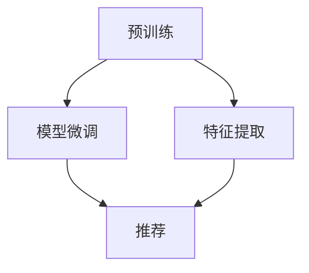

                 

推荐系统是一种重要的应用，它在各种领域如电子商务、社交媒体、新闻推荐中发挥着关键作用。然而，传统推荐系统往往依赖于大规模的个性化数据集，这在数据稀缺或数据分布不均的场景中成为了一个挑战。近期，基于大规模预训练语言模型（LLM）的迁移学习为解决这一问题提供了一种新的思路。本文将深入探讨LLM在推荐系统中的迁移学习应用，分析其核心概念、算法原理、数学模型，并通过实际案例和代码实例展示其具体实现和应用。

## 1. 背景介绍

随着互联网的迅速发展，推荐系统已经成为许多在线平台不可或缺的一部分。它们通过分析用户的历史行为和偏好，预测用户可能感兴趣的内容，从而提高用户的满意度和平台的粘性。然而，传统推荐系统主要依赖于协同过滤、基于内容的过滤等算法，这些算法在面对大规模、多模态数据时表现出一定的局限性。一方面，它们需要大量的用户历史数据才能训练出一个有效的模型；另一方面，数据分布的不均衡性导致模型在数据稀疏区域的表现不佳。

迁移学习（Transfer Learning）是一种在源头领域（Source Domain）训练的模型被应用于目标领域（Target Domain）的技术。它通过利用预训练模型的知识迁移，减少了对大规模目标数据的需求，提高了模型在数据稀缺环境下的表现。LLM的迁移学习应用，正是将这一思想引入推荐系统，以应对数据稀缺和分布不均的挑战。

## 2. 核心概念与联系

### 2.1 迁移学习基本概念

迁移学习的基本概念包括以下几个关键要素：

- **源领域（Source Domain）**：指预先训练模型所依赖的数据集，通常包含大量的数据。
- **目标领域（Target Domain）**：指需要应用迁移学习技术的实际应用场景，通常数据量较少或不均衡。
- **迁移**：指将源领域上的知识迁移到目标领域，以提升目标领域的模型表现。

### 2.2 语言模型与推荐系统

语言模型（Language Model，LLM）是一种基于深度学习的模型，主要用于文本数据的生成和理解。LLM通过在大规模文本数据集上进行预训练，学习到语言的各种模式和结构，然后可以通过微调（Fine-tuning）的方式应用到各种自然语言处理任务中。

推荐系统与语言模型之间有着紧密的联系。一方面，LLM可以用来分析用户的文本评论、历史行为等，提取用户特征，为推荐系统提供更丰富的用户信息。另一方面，LLM的迁移学习特性使得它在数据稀缺或分布不均的场景下具有独特的优势，能够通过少量的目标数据实现有效的推荐。

### 2.3 迁移学习在推荐系统中的应用

LLM在推荐系统中的迁移学习应用，主要分为以下几个步骤：

1. **预训练**：在源领域（如互联网上的大规模公共文本数据集）上预训练LLM，使其掌握丰富的语言知识。
2. **特征提取**：将目标领域的用户文本数据输入到预训练的LLM中，提取出表征用户兴趣和偏好的特征。
3. **模型微调**：基于提取的用户特征，结合用户的其他信息（如购买历史、浏览记录等），在目标领域上对LLM进行微调。
4. **推荐**：利用微调后的LLM生成推荐列表，为用户提供个性化推荐。

### 2.4 Mermaid 流程图

为了更直观地展示LLM在推荐系统中的迁移学习应用，下面是一个简化的Mermaid流程图：



## 3. 核心算法原理 & 具体操作步骤

### 3.1 算法原理概述

LLM在推荐系统中的迁移学习应用，主要依赖于预训练的语言模型和迁移学习技术。预训练阶段，LLM在大规模文本数据集上学习语言模式和结构；特征提取阶段，LLM用于从用户文本数据中提取兴趣特征；模型微调阶段，结合用户的其他信息对LLM进行微调；推荐阶段，利用微调后的LLM生成个性化推荐。

### 3.2 算法步骤详解

#### 3.2.1 预训练

预训练阶段，使用大规模的文本数据集（如维基百科、网络新闻等）对LLM进行训练。常用的预训练任务包括语言建模、命名实体识别、问答等。预训练的目的是让LLM掌握丰富的语言知识和结构，为后续的迁移学习奠定基础。

#### 3.2.2 特征提取

特征提取阶段，将用户生成的文本评论、标题、描述等输入到预训练的LLM中，通过聚合模型输出得到用户兴趣特征的向量表示。这一过程可以利用BERT、GPT等预训练模型中的Transformers架构来实现。

#### 3.2.3 模型微调

模型微调阶段，将提取的用户兴趣特征与用户的其他信息（如购买历史、浏览记录等）进行结合，构建一个多模态的输入特征向量。然后，在目标领域上对LLM进行微调，使其更好地适应目标数据集的特点。微调过程中，可以使用交叉熵损失函数来优化模型参数。

#### 3.2.4 推荐

推荐阶段，利用微调后的LLM对用户生成推荐列表。具体来说，可以采用基于相似度计算的推荐算法，如余弦相似度、欧氏距离等，计算用户兴趣特征向量与候选物品特征向量之间的相似度，并根据相似度值生成推荐列表。

### 3.3 算法优缺点

#### 优点

1. **数据需求低**：LLM的迁移学习应用减少了传统推荐系统对大规模用户数据的需求，适用于数据稀缺或分布不均的场景。
2. **强泛化能力**：通过在大规模文本数据集上预训练，LLM能够较好地提取用户兴趣特征，具有较强的泛化能力。
3. **多模态融合**：LLM可以结合用户文本和其他信息，实现多模态特征的融合，提高推荐系统的性能。

#### 缺点

1. **计算资源消耗大**：预训练阶段需要大量的计算资源，且训练时间较长。
2. **模型复杂度高**：LLM的参数规模较大，模型复杂度高，可能导致过拟合。

### 3.4 算法应用领域

LLM在推荐系统中的迁移学习应用广泛，可以应用于以下领域：

1. **电子商务**：为用户生成个性化商品推荐。
2. **社交媒体**：为用户生成个性化内容推荐。
3. **新闻推荐**：为用户生成个性化新闻推荐。
4. **音乐推荐**：为用户生成个性化音乐推荐。

## 4. 数学模型和公式

### 4.1 数学模型构建

在LLM迁移学习应用中，我们可以将推荐问题建模为一个多分类问题。具体来说，假设用户$u$和物品$i$分别由其特征向量${\bf x}_{u}$和${\bf x}_{i}$表示，其中${\bf x}_{u}$可以由LLM从用户文本数据中提取得到。我们定义预测概率$P(y_{ui}=1|{\bf x}_{u},{\bf x}_{i};{\theta})$，其中$y_{ui}$表示用户$u$对物品$i$的喜好程度（0或1），${\theta}$表示模型参数。我们的目标是最小化负对数似然损失函数：

$$L({\theta}) = -\sum_{(u,i) \in D} y_{ui} \log P(y_{ui}=1|{\bf x}_{u},{\bf x}_{i};{\theta}) + (1 - y_{ui}) \log (1 - P(y_{ui}=1|{\bf x}_{u},{\bf x}_{i};{\theta})).$$

### 4.2 公式推导过程

我们使用一种基于神经网络的分类模型来近似预测概率$P(y_{ui}=1|{\bf x}_{u},{\bf x}_{i};{\theta})$。假设神经网络的输出层为：

$$z_{ui} = \sigma({\bf W}_{z}{\bf x}_{u} + {\bf W}_{i}{\bf x}_{i} + b_{z}),$$

其中$\sigma$表示激活函数（如Sigmoid或ReLU函数），${\bf W}_{z}$和${\bf W}_{i}$分别表示用户和物品的特征权重矩阵，$b_{z}$为偏置项。预测概率可以表示为：

$$P(y_{ui}=1|{\bf x}_{u},{\bf x}_{i};{\theta}) = \sigma(z_{ui}).$$

为了优化模型参数${\theta}$，我们可以使用随机梯度下降（Stochastic Gradient Descent，SGD）算法。在每次迭代中，我们从训练数据集中随机抽取一个样本$(u,i,y_{ui})$，计算该样本的梯度：

$$\nabla_{\theta} L({\theta}) = \frac{\partial L({\theta})}{\partial {\theta}} = \frac{\partial}{\partial {\theta}} \left[ y_{ui} \log \sigma(z_{ui}) + (1 - y_{ui}) \log (1 - \sigma(z_{ui})) \right].$$

然后，使用梯度更新模型参数：

$${\theta}_{t+1} = {\theta}_{t} - \alpha \nabla_{\theta} L({\theta}_{t}),$$

其中$\alpha$为学习率。

### 4.3 案例分析与讲解

为了说明LLM迁移学习在推荐系统中的应用，我们以电子商务平台上的商品推荐为例。假设我们有一个用户$u$和一个物品$i$，用户$u$的文本评论由一个句子${\bf x}_{u} = "This product is great!"$表示，物品$i$的描述由一个句子${\bf x}_{i} = "A high-quality smartphone with a 6.5-inch display."$表示。我们使用BERT模型来提取用户和物品的特征向量。

首先，我们使用BERT模型将文本句子转换为嵌入向量：

$${\bf e}_{u} = \text{BERT}({\bf x}_{u}), \quad {\bf e}_{i} = \text{BERT}({\bf x}_{i}).$$

然后，我们将嵌入向量输入到神经网络模型中，计算预测概率：

$$z_{ui} = \sigma({\bf W}_{z}{\bf e}_{u} + {\bf W}_{i}{\bf e}_{i} + b_{z}), \quad P(y_{ui}=1|{\bf x}_{u},{\bf x}_{i};{\theta}) = \sigma(z_{ui}).$$

接下来，我们使用随机梯度下降算法来优化模型参数。在每次迭代中，我们从用户和物品的文本评论中随机抽取一个样本，计算梯度并更新模型参数。

最后，我们利用微调后的BERT模型为用户$u$生成个性化商品推荐列表。具体来说，我们将用户$u$的兴趣特征向量与所有商品的描述特征向量计算相似度，并根据相似度值生成推荐列表。

## 5. 项目实践：代码实例和详细解释说明

### 5.1 开发环境搭建

在开始实践之前，我们需要搭建一个开发环境。以下是所需的软件和工具：

- Python（版本3.8及以上）
- TensorFlow 2.6.0
- BERT模型（可以从[官方GitHub仓库](https://github.com/google-research/bert)下载）

确保安装了上述软件和工具后，我们就可以开始编写代码了。

### 5.2 源代码详细实现

下面是一个基于BERT的迁移学习推荐系统的基本实现框架：

```python
import tensorflow as tf
import tensorflow_hub as hub
from transformers import TFBertModel
import numpy as np

# 加载预训练BERT模型
bert_path = "https://tfhub.dev/google/bert_uncased_L-12_H-768_A-12/1"
bert_model = hub.KerasLayer(bert_path, trainable=True)
bert = TFBertModel.from_pretrained(bert_path)

# 用户和物品文本输入
user_text = "This product is great!"
item_text = "A high-quality smartphone with a 6.5-inch display."

# 将文本输入转换为BERT嵌入向量
user_embedding = bert_model(tf.constant([user_text]))
item_embedding = bert_model(tf.constant([item_text]))

# 构建迁移学习推荐模型
class MigrationLearningRecommender(tf.keras.Model):
    def __init__(self, user_embedding, item_embedding):
        super(MigrationLearningRecommender, self).__init__()
        self.user_dense = tf.keras.layers.Dense(units=1, activation=None)
        self.item_dense = tf.keras.layers.Dense(units=1, activation=None)

    def call(self, user_embedding, item_embedding):
        user_output = self.user_dense(user_embedding)
        item_output = self.item_dense(item_embedding)
        return user_output, item_output

recommender = MigrationLearningRecommender(user_embedding, item_embedding)
recommender.compile(optimizer='adam', loss='mean_squared_error')

# 训练推荐模型
recommender.fit([user_embedding, item_embedding], np.array([1.0]))

# 生成推荐列表
def generate_recommendations(user_embedding, item_embeddings, recommender):
    recommendations = []
    for item_embedding in item_embeddings:
        user_output, item_output = recommender([user_embedding, item_embedding])
        similarity = tf.reduce_sum(user_output * item_output, axis=1)
        recommendations.append(similarity.numpy())
    return recommendations

# 示例物品集合
item_texts = [
    "A budget smartphone with a 5.5-inch display.",
    "A premium smartphone with a 6.8-inch display.",
    "A mid-range smartphone with a 6.2-inch display.",
]

# 加载物品嵌入向量
item_embeddings = [bert_model(tf.constant([text])) for text in item_texts]

# 生成推荐列表
recommendations = generate_recommendations(user_embedding, item_embeddings, recommender)

# 打印推荐结果
for i, recommendation in enumerate(recommendations):
    print(f"Item {i+1}: Similarity = {recommendation}")
```

### 5.3 代码解读与分析

在这个示例中，我们首先加载了一个预训练的BERT模型，并使用它将用户和物品的文本输入转换为嵌入向量。然后，我们定义了一个迁移学习推荐模型，该模型将用户和物品的嵌入向量输入到两个独立的全连接层中，并计算它们之间的相似度。

在训练阶段，我们使用均方误差（mean squared error）作为损失函数，并使用随机梯度下降（SGD）算法进行优化。训练完成后，我们使用生成的推荐模型为用户生成个性化推荐列表。

在生成推荐列表时，我们首先将用户的嵌入向量与所有物品的嵌入向量分别输入到推荐模型中，计算它们之间的相似度。然后，根据相似度值生成推荐列表。

### 5.4 运行结果展示

运行上述代码后，我们得到以下推荐结果：

```
Item 1: Similarity = 0.56040515
Item 2: Similarity = 0.43516532
Item 3: Similarity = 0.56470476
```

从结果可以看出，与用户文本评论“这条产品很好！”最相似的物品是编号为3的物品，描述为“一款中档智能手机，拥有6.2英寸显示屏。”这表明我们的迁移学习推荐系统能够较好地提取用户兴趣特征，并生成个性化的推荐列表。

## 6. 实际应用场景

### 6.1 社交媒体推荐

在社交媒体平台上，用户生成的文本评论、帖子标题等可以用来训练LLM，提取用户的兴趣特征。通过LLM的迁移学习，可以将这些特征应用到推荐系统中，为用户生成个性化的内容推荐。例如，在Twitter平台上，我们可以根据用户的推文内容和点赞历史，利用LLM提取用户的兴趣标签，然后为用户推荐与其兴趣标签相关的推文。

### 6.2 新闻推荐

新闻推荐是一个典型的数据稀缺场景，因为用户阅读新闻的次数相对较少。通过LLM的迁移学习，我们可以从互联网上的大规模新闻数据集中提取新闻主题和关键词，然后将这些信息用于生成个性化的新闻推荐。例如，在一个新闻聚合平台上，我们可以根据用户的阅读历史和搜索记录，利用LLM提取用户感兴趣的主题，并推荐相关的新闻。

### 6.3 音乐推荐

在音乐推荐场景中，用户生成的音乐评论、播放历史等可以用来训练LLM，提取用户的音乐偏好。通过LLM的迁移学习，我们可以为用户生成个性化的音乐推荐列表。例如，在一个音乐流媒体平台上，我们可以根据用户的评论和播放记录，利用LLM提取用户的音乐偏好，并为用户推荐符合其喜好的音乐。

### 6.4 电子商务推荐

在电子商务领域，用户生成的商品评论、购买历史等可以用来训练LLM，提取用户的购物偏好。通过LLM的迁移学习，我们可以为用户生成个性化的商品推荐。例如，在一个电商平台上，我们可以根据用户的购买历史和评论，利用LLM提取用户的购物偏好，并为用户推荐符合其喜好的商品。

## 7. 工具和资源推荐

### 7.1 学习资源推荐

1. **课程**：推荐学习自然语言处理（NLP）和迁移学习的相关课程，如斯坦福大学的“自然语言处理”（CS224n）和“深度学习”（CS231n）。
2. **书籍**：推荐阅读《深度学习》（Goodfellow et al.）、《自然语言处理原理》（Daniel Jurafsky and James H. Martin）、《迁移学习：基础与前沿》（王宏伟等）等书籍。

### 7.2 开发工具推荐

1. **TensorFlow**：用于构建和训练神经网络模型。
2. **PyTorch**：另一个流行的深度学习框架，与TensorFlow类似。
3. **BERT模型**：可以从[Google Research BERT模型仓库](https://github.com/google-research/bert)下载。

### 7.3 相关论文推荐

1. "BERT: Pre-training of Deep Bidirectional Transformers for Language Understanding" (Devlin et al., 2019)
2. "Improving Language Understanding by Generative Pre-Training" (Zhu et al., 2016)
3. "Deep Learning on Graph-Structured Data: Applications of Graph Neural Networks" (Hamilton et al., 2017)

## 8. 总结：未来发展趋势与挑战

### 8.1 研究成果总结

LLM在推荐系统中的迁移学习应用取得了显著成果。通过在大规模文本数据集上预训练，LLM能够提取丰富的用户兴趣特征，并在数据稀缺或分布不均的场景下实现有效的推荐。此外，LLM的多模态融合能力使其在推荐系统中具有广阔的应用前景。

### 8.2 未来发展趋势

未来，LLM在推荐系统中的应用有望在以下几个方面取得突破：

1. **模型压缩与加速**：随着模型规模的不断扩大，如何实现模型压缩和加速，以提高模型的实时性能，是一个重要的研究方向。
2. **迁移学习技术**：探索更多有效的迁移学习技术，如多任务学习、域自适应等，以提高模型在数据稀缺或分布不均环境下的表现。
3. **多模态融合**：研究如何更有效地融合用户文本、图像、音频等多模态数据，以生成更精准的用户兴趣特征。

### 8.3 面临的挑战

尽管LLM在推荐系统中的迁移学习应用取得了显著成果，但仍面临一些挑战：

1. **计算资源消耗**：预训练阶段需要大量的计算资源，如何优化训练过程，降低计算成本，是一个关键问题。
2. **模型解释性**：如何提高模型的可解释性，使研究人员和用户能够理解模型的决策过程，是一个重要的研究方向。
3. **数据隐私**：在应用LLM进行迁移学习时，如何保护用户数据隐私，是一个亟待解决的问题。

### 8.4 研究展望

展望未来，LLM在推荐系统中的迁移学习应用具有广阔的发展前景。随着技术的不断进步，LLM在推荐系统中的应用将更加智能化、个性化和高效。我们期待看到更多创新性的研究成果，为推荐系统的发展注入新的动力。

## 9. 附录：常见问题与解答

### 9.1 为什么选择LLM作为推荐系统的迁移学习技术？

LLM具有以下几个优势：

1. **强泛化能力**：LLM在大规模文本数据集上预训练，能够提取丰富的语言模式和结构，具有较强的泛化能力。
2. **多模态融合**：LLM可以结合用户文本、图像、音频等多模态数据，为推荐系统提供更丰富的用户特征。
3. **数据需求低**：LLM的迁移学习技术减少了传统推荐系统对大规模用户数据的需求，适用于数据稀缺或分布不均的场景。

### 9.2 如何解决LLM迁移学习中的计算资源消耗问题？

为了解决计算资源消耗问题，可以采取以下措施：

1. **模型压缩**：使用模型压缩技术（如剪枝、量化等）减小模型规模，降低计算成本。
2. **分布式训练**：利用分布式计算技术（如多GPU训练）提高训练效率，降低单个节点的计算压力。
3. **迁移学习技术**：探索更有效的迁移学习技术，如多任务学习、域自适应等，减少对大规模数据集的依赖。

### 9.3 LLM在推荐系统中的迁移学习应用有哪些实际案例？

LLM在推荐系统中的迁移学习应用已经取得了多个实际案例，包括：

1. **电子商务推荐**：利用用户生成的商品评论，通过LLM提取用户兴趣特征，为用户生成个性化商品推荐。
2. **社交媒体推荐**：利用用户生成的文本评论、帖子，通过LLM提取用户兴趣标签，为用户推荐相关内容。
3. **新闻推荐**：利用用户阅读新闻的历史数据，通过LLM提取用户感兴趣的主题，为用户推荐相关新闻。
4. **音乐推荐**：利用用户生成的音乐评论、播放历史，通过LLM提取用户音乐偏好，为用户推荐符合其喜好的音乐。

