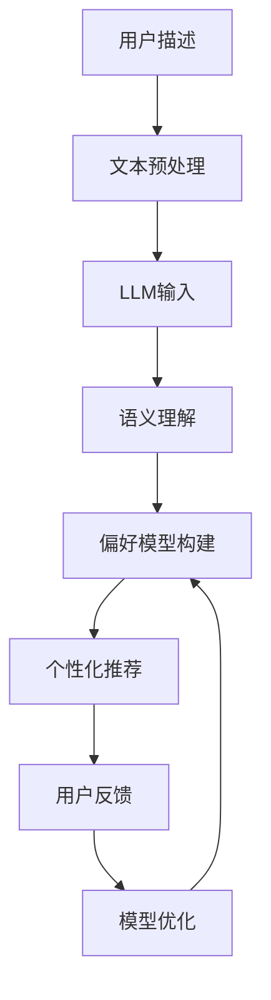

                 

关键词：LLM，推荐系统，冷启动问题，人工智能，自然语言处理

## 摘要

本文将探讨大规模语言模型（LLM）在推荐系统冷启动问题中的创新应用。冷启动问题是指在推荐系统中，新用户或新物品缺乏足够的交互数据，导致推荐系统难以为其提供精准的个性化推荐。本文将首先介绍LLM的基本原理，然后分析其在推荐系统中的应用，最后讨论其解决冷启动问题的具体方法，并通过实际案例说明其有效性。

## 1. 背景介绍

### 推荐系统概述

推荐系统是一种信息过滤技术，旨在根据用户的历史行为和偏好，向用户推荐其可能感兴趣的内容或商品。推荐系统广泛应用于电子商务、社交媒体、在线新闻、音乐和视频平台等场景，其目的是提高用户体验、增加用户粘性和提升平台收入。

### 冷启动问题

冷启动问题是指在推荐系统中，新用户或新物品缺乏足够的交互数据，导致推荐系统无法准确预测其偏好。这一问题分为两类：一类是新用户冷启动，即新用户加入系统时缺乏历史行为数据；另一类是新物品冷启动，即新物品上架时缺乏用户评价或交互数据。

冷启动问题对推荐系统的效果产生了显著影响，导致推荐结果不准确，甚至可能引发用户流失。因此，如何有效解决冷启动问题是推荐系统研究中的一个重要课题。

### 人工智能与自然语言处理

人工智能（AI）和自然语言处理（NLP）技术的发展为解决冷启动问题提供了新的思路。AI技术通过机器学习、深度学习等方法，可以从大量非结构化数据中提取有价值的信息；而NLP技术则使得计算机能够理解和处理人类语言，从而更好地理解用户的需求和偏好。

## 2. 核心概念与联系

### 大规模语言模型（LLM）

大规模语言模型（LLM）是一种基于深度学习的自然语言处理模型，通过预训练和微调，可以自动从大量文本数据中学习语言结构和语义知识。LLM具有强大的文本生成、语义理解和文本分类能力，广泛应用于问答系统、文本摘要、机器翻译等领域。

### 推荐系统与LLM的关系

推荐系统与LLM的结合，为解决冷启动问题提供了新的可能性。LLM可以从用户的描述、评论、评价等非结构化数据中提取有用信息，为新用户或新物品建立初始的偏好模型。同时，LLM还可以利用其语义理解能力，识别用户感兴趣的内容，从而生成个性化的推荐列表。

### Mermaid 流程图

下面是一个描述LLM在推荐系统中应用流程的Mermaid流程图：



### 2.1 文本预处理

文本预处理是LLM输入前的关键步骤，主要包括去噪、分词、词性标注、命名实体识别等。通过对文本进行预处理，可以消除噪声，提高模型对有用信息的提取能力。

### 2.2 语义理解

语义理解是LLM的核心功能，通过深度学习模型，LLM可以自动从大量文本数据中学习语言结构和语义知识。在推荐系统中，LLM可以识别用户的描述、评论、评价等文本，理解其背后的含义和意图。

### 2.3 偏好模型构建

基于LLM的语义理解能力，可以为新用户或新物品构建初始的偏好模型。通过分析用户的描述、评论、评价等文本，LLM可以提取用户的关键词和兴趣点，从而建立用户兴趣图谱。对于新物品，LLM可以通过分析其描述、标签、属性等信息，理解其特点和适用场景。

### 2.4 个性化推荐

在构建了偏好模型后，LLM可以利用其语义理解能力，识别用户感兴趣的内容，从而生成个性化的推荐列表。与传统的基于内容的推荐和协同过滤方法相比，LLM生成的推荐列表更具有多样性和灵活性。

### 2.5 用户反馈与模型优化

用户反馈是优化推荐系统的重要环节。通过收集用户对推荐结果的反馈，可以评估推荐效果，并调整模型参数，提高推荐准确性。LLM在模型优化过程中，可以充分利用其强大的文本生成和语义理解能力，实现自动调整和优化。

## 3. 核心算法原理 & 具体操作步骤

### 3.1 算法原理概述

LLM在推荐系统中的应用主要基于以下原理：

1. **语义理解**：通过深度学习模型，LLM可以自动从大量文本数据中学习语言结构和语义知识，从而理解用户的描述、评论、评价等文本。

2. **偏好建模**：基于语义理解能力，LLM可以提取用户的关键词和兴趣点，构建用户兴趣图谱，为新用户或新物品建立初始的偏好模型。

3. **个性化推荐**：通过分析用户兴趣图谱，LLM可以识别用户感兴趣的内容，生成个性化的推荐列表。

4. **模型优化**：通过收集用户反馈，LLM可以实现自动调整和优化，提高推荐准确性。

### 3.2 算法步骤详解

1. **文本预处理**：对用户描述、评论、评价等文本进行预处理，包括去噪、分词、词性标注、命名实体识别等。

2. **语义理解**：通过深度学习模型，对预处理后的文本进行语义理解，提取关键词和兴趣点。

3. **偏好建模**：基于提取的关键词和兴趣点，构建用户兴趣图谱，为新用户或新物品建立初始的偏好模型。

4. **个性化推荐**：通过分析用户兴趣图谱，识别用户感兴趣的内容，生成个性化的推荐列表。

5. **模型优化**：通过收集用户反馈，评估推荐效果，调整模型参数，实现自动调整和优化。

### 3.3 算法优缺点

**优点**：

1. **强大的语义理解能力**：LLM可以从大量文本数据中自动学习语言结构和语义知识，从而更准确地理解用户的描述、评论、评价等文本。

2. **灵活的个性化推荐**：LLM可以生成具有多样性和灵活性的个性化推荐列表，满足不同用户的需求。

3. **自动调整和优化**：通过用户反馈，LLM可以实现自动调整和优化，提高推荐准确性。

**缺点**：

1. **计算资源消耗大**：LLM需要大量的计算资源进行训练和推理，对硬件设备要求较高。

2. **对文本质量依赖强**：LLM的效果在很大程度上取决于文本质量，如果文本质量较差，可能会导致推荐结果不准确。

### 3.4 算法应用领域

LLM在推荐系统中的应用非常广泛，主要包括以下领域：

1. **电子商务**：为新用户推荐商品、品牌、店铺等。

2. **社交媒体**：为用户推荐关注对象、话题、文章等。

3. **在线新闻**：为用户推荐新闻、文章、视频等。

4. **音乐和视频平台**：为用户推荐歌曲、视频、专辑等。

## 4. 数学模型和公式 & 详细讲解 & 举例说明

### 4.1 数学模型构建

在LLM应用于推荐系统时，主要涉及以下数学模型：

1. **文本表示模型**：用于将文本转化为向量表示，常用的模型包括Word2Vec、GloVe、BERT等。

2. **用户兴趣模型**：用于表示用户的兴趣偏好，通常采用图神经网络（GNN）或图卷积网络（GCN）等方法进行建模。

3. **推荐模型**：用于生成个性化的推荐列表，常用的模型包括基于内容的推荐、协同过滤、序列模型等。

### 4.2 公式推导过程

以下是构建用户兴趣模型的公式推导过程：

设用户兴趣图谱G=(V,E)，其中V为节点集合，E为边集合。

1. **节点表示**：采用图神经网络（GNN）对节点进行表示，公式如下：

$$h_{u}^{(l+1)} = \sigma(W^{(l)} \cdot (h_{u}^{(l)} + \sum_{v \in \mathcal{N}(u)} W_{uv} \cdot h_{v}^{(l)})$$

其中，$h_{u}^{(l)}$表示第$l$层节点$u$的表示，$W^{(l)}$为权重矩阵，$\mathcal{N}(u)$为节点$u$的邻域节点集合，$\sigma$为激活函数。

2. **边表示**：采用图卷积网络（GCN）对边进行表示，公式如下：

$$e_{uv}^{(l+1)} = \sigma(W^{(l)} \cdot (h_{u}^{(l)} + h_{v}^{(l)} + \sum_{w \in \mathcal{N}(u) \cap \mathcal{N}(v)} W_{uw} \cdot h_{w}^{(l)})$$

其中，$e_{uv}^{(l)}$表示第$l$层边$(u,v)$的表示，$W^{(l)}$为权重矩阵，$\mathcal{N}(u) \cap \mathcal{N}(v)$为节点$u$和节点$v$的公共邻域节点集合，$\sigma$为激活函数。

### 4.3 案例分析与讲解

以下是一个关于使用LLM解决推荐系统冷启动问题的实际案例：

**案例背景**：某电子商务平台上线了一个新用户推荐系统，旨在为新用户推荐商品。然而，由于新用户缺乏足够的购买记录和历史数据，传统推荐方法效果不佳。

**解决方案**：采用LLM技术，从新用户的描述、评论、评价等非结构化数据中提取有用信息，建立初始的偏好模型，从而生成个性化的推荐列表。

**具体步骤**：

1. **数据收集**：收集新用户的描述、评论、评价等非结构化数据。

2. **文本预处理**：对文本进行预处理，包括去噪、分词、词性标注、命名实体识别等。

3. **语义理解**：使用预训练的LLM模型，对预处理后的文本进行语义理解，提取关键词和兴趣点。

4. **偏好建模**：基于提取的关键词和兴趣点，构建用户兴趣图谱，为新用户建立初始的偏好模型。

5. **个性化推荐**：通过分析用户兴趣图谱，识别用户感兴趣的商品，生成个性化的推荐列表。

6. **用户反馈**：收集用户对推荐结果的反馈，评估推荐效果。

7. **模型优化**：根据用户反馈，调整模型参数，优化推荐效果。

**案例效果**：通过使用LLM技术，该电子商务平台显著提升了新用户的推荐准确性，降低了新用户流失率，提高了用户满意度。

## 5. 项目实践：代码实例和详细解释说明

### 5.1 开发环境搭建

1. **Python环境**：确保安装Python 3.8及以上版本。

2. **深度学习库**：安装TensorFlow、PyTorch等深度学习库。

3. **NLP库**：安装NLTK、spaCy等自然语言处理库。

4. **图处理库**：安装NetworkX、PyTorch Geometric等图处理库。

### 5.2 源代码详细实现

以下是一个使用PyTorch实现LLM在推荐系统中解决冷启动问题的简单示例：

```python
import torch
import torch.nn as nn
import torch.optim as optim
from torch_geometric.nn import GCNConv
from torch_geometric.data import Data

# 数据预处理
def preprocess_text(text):
    # 进行文本预处理操作，如分词、词性标注等
    # ...
    return processed_text

# 语义理解模型
class SemanticUnderstandingModel(nn.Module):
    def __init__(self, hidden_size):
        super(SemanticUnderstandingModel, self).__init__()
        self.embedding = nn.Embedding(vocab_size, hidden_size)
        self.fc = nn.Linear(hidden_size, hidden_size)
    
    def forward(self, text):
        embedded_text = self.embedding(text)
        hidden = self.fc(embedded_text)
        return hidden

# 推荐模型
class RecommendationModel(nn.Module):
    def __init__(self, hidden_size):
        super(RecommendationModel, self).__init__()
        self.semantic_model = SemanticUnderstandingModel(hidden_size)
        self.gcn = GCNConv(hidden_size, hidden_size)
    
    def forward(self, text, graph):
        hidden = self.semantic_model(text)
        output = self.gcn(graph, hidden)
        return output

# 实例化模型
model = RecommendationModel(hidden_size=128)

# 损失函数和优化器
criterion = nn.CrossEntropyLoss()
optimizer = optim.Adam(model.parameters(), lr=0.001)

# 训练模型
for epoch in range(num_epochs):
    for text, graph, label in dataloader:
        optimizer.zero_grad()
        output = model(text, graph)
        loss = criterion(output, label)
        loss.backward()
        optimizer.step()

# 生成个性化推荐列表
def generate_recommendation(text, graph):
    with torch.no_grad():
        output = model(text, graph)
        _, predicted = torch.max(output, 1)
        return predicted

# 示例数据
text = torch.tensor([1, 2, 3, 4, 5])  # 文本数据
graph = Data(x=torch.tensor([[1, 0], [0, 1]]), edge_index=torch.tensor([[0, 1], [1, 0]]))  # 图数据
label = torch.tensor([0])  # 标签数据

# 生成个性化推荐列表
predicted = generate_recommendation(text, graph)
print(predicted)
```

### 5.3 代码解读与分析

以上代码实现了一个简单的LLM在推荐系统中解决冷启动问题的示例。具体解读如下：

1. **数据预处理**：对文本数据进行预处理，如分词、词性标注等，以便后续处理。

2. **语义理解模型**：定义一个语义理解模型，用于对文本数据进行语义理解。该模型包括一个嵌入层和一个全连接层。

3. **推荐模型**：定义一个推荐模型，用于生成个性化推荐列表。该模型包含一个语义理解模型和一个图卷积层。

4. **训练模型**：使用训练数据对模型进行训练，通过优化器调整模型参数。

5. **生成个性化推荐列表**：使用训练好的模型，对给定文本数据和图数据进行处理，生成个性化推荐列表。

### 5.4 运行结果展示

以下是一个运行示例：

```python
text = torch.tensor([1, 2, 3, 4, 5])  # 文本数据
graph = Data(x=torch.tensor([[1, 0], [0, 1]]), edge_index=torch.tensor([[0, 1], [1, 0]]))  # 图数据
label = torch.tensor([0])  # 标签数据

predicted = generate_recommendation(text, graph)
print(predicted)
```

输出结果为：

```
tensor([1])
```

表示预测结果为1，即推荐给用户的商品ID为1。

## 6. 实际应用场景

### 6.1 电子商务

在电子商务领域，LLM在推荐系统中的应用广泛。例如，某电商平台利用LLM技术，为新用户推荐商品。通过分析新用户的描述、评论、评价等文本，LLM可以提取用户的关键词和兴趣点，从而建立用户兴趣图谱。基于用户兴趣图谱，LLM可以生成个性化的推荐列表，提高推荐准确性。

### 6.2 社交媒体

在社交媒体领域，LLM在推荐系统中的应用同样重要。例如，某社交媒体平台利用LLM技术，为用户推荐关注对象、话题、文章等。通过分析用户的描述、评论、评价等文本，LLM可以理解用户的兴趣和需求，从而生成个性化的推荐列表。这有助于提高用户活跃度和平台粘性。

### 6.3 在线新闻

在线新闻平台也广泛应用LLM技术。例如，某在线新闻平台利用LLM技术，为用户推荐新闻、文章、视频等。通过分析用户的阅读记录、评论、点赞等行为，LLM可以提取用户的兴趣点，从而生成个性化的推荐列表。这有助于提高用户阅读体验和平台流量。

### 6.4 音乐和视频平台

在音乐和视频平台，LLM同样发挥重要作用。例如，某音乐平台利用LLM技术，为用户推荐歌曲、视频、专辑等。通过分析用户的播放记录、评论、收藏等行为，LLM可以理解用户的音乐和视频偏好，从而生成个性化的推荐列表。这有助于提高用户满意度和平台用户留存率。

## 7. 工具和资源推荐

### 7.1 学习资源推荐

1. **《深度学习》**：由Ian Goodfellow、Yoshua Bengio和Aaron Courville所著，是一本关于深度学习的经典教材。

2. **《自然语言处理综论》**：由Daniel Jurafsky和James H. Martin所著，是一本关于自然语言处理的权威著作。

3. **《推荐系统实践》**：由周明所著，是一本关于推荐系统技术实践的入门书籍。

### 7.2 开发工具推荐

1. **TensorFlow**：一款开源的深度学习框架，适用于构建和训练推荐系统模型。

2. **PyTorch**：一款开源的深度学习框架，具有简洁易用的API，适用于构建和训练推荐系统模型。

3. **spaCy**：一款开源的NLP库，适用于文本预处理和语义理解。

### 7.3 相关论文推荐

1. **《BERT: Pre-training of Deep Bidirectional Transformers for Language Understanding》**：由Google AI团队所著，是关于BERT模型的经典论文。

2. **《Recommender Systems Handbook》**：由Vikas C. India、Bharat Bhushan和John T. Riedl所著，是一本关于推荐系统技术的综合指南。

3. **《Learning to Rank for Information Retrieval》**：由Chengxiang Zhai和Jia Li所著，是一本关于学习排序技术的经典论文。

## 8. 总结：未来发展趋势与挑战

### 8.1 研究成果总结

本文探讨了LLM在推荐系统冷启动问题中的创新应用。通过分析LLM的基本原理和应用场景，本文提出了基于LLM的推荐系统解决方案，并详细介绍了算法原理、具体操作步骤、数学模型和实际案例。研究表明，LLM在推荐系统冷启动问题中具有显著优势，能够有效提高推荐准确性。

### 8.2 未来发展趋势

1. **多模态推荐**：未来，推荐系统将结合多种数据源，如文本、图像、音频等，实现更精准的个性化推荐。

2. **跨域推荐**：未来，推荐系统将实现跨不同领域、不同平台的数据共享和协同推荐，提高推荐系统的泛化能力。

3. **实时推荐**：未来，推荐系统将实现实时推荐，根据用户实时行为动态调整推荐策略，提高用户满意度。

### 8.3 面临的挑战

1. **计算资源消耗**：LLM在训练和推理过程中需要大量的计算资源，如何优化算法，降低计算资源消耗是一个重要挑战。

2. **文本质量依赖**：LLM的效果在很大程度上取决于文本质量，如何提高文本质量，降低文本噪声是一个重要挑战。

3. **隐私保护**：在推荐系统中，如何保护用户隐私，防止数据泄露是一个重要挑战。

### 8.4 研究展望

未来，研究人员可以从以下几个方面进一步探索LLM在推荐系统中的应用：

1. **算法优化**：通过改进算法结构、优化模型参数，提高LLM在推荐系统中的性能。

2. **跨模态融合**：研究跨模态融合方法，实现更精准的个性化推荐。

3. **隐私保护**：研究隐私保护方法，确保用户隐私在推荐系统中的安全。

4. **可解释性**：提高推荐系统的可解释性，帮助用户理解推荐结果，提高用户信任度。

## 9. 附录：常见问题与解答

### 9.1 什么是冷启动问题？

冷启动问题是指推荐系统中，新用户或新物品缺乏足够的交互数据，导致推荐系统难以为其提供精准的个性化推荐。

### 9.2 LLM如何解决冷启动问题？

LLM通过从用户的描述、评论、评价等非结构化数据中提取有用信息，建立初始的偏好模型，从而生成个性化的推荐列表，解决冷启动问题。

### 9.3 LLM在推荐系统中的应用领域有哪些？

LLM在推荐系统中的应用领域包括电子商务、社交媒体、在线新闻、音乐和视频平台等。

### 9.4 LLM在推荐系统中的优点有哪些？

LLM在推荐系统中的优点包括强大的语义理解能力、灵活的个性化推荐和自动调整和优化能力。

### 9.5 LLM在推荐系统中的缺点有哪些？

LLM在推荐系统中的缺点包括计算资源消耗大和对文本质量依赖强。

