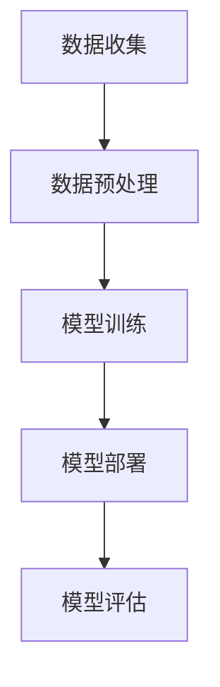
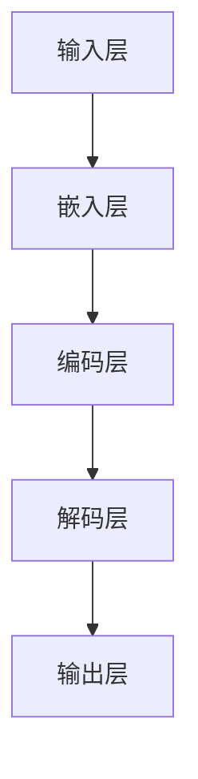

                 

关键词：大型语言模型（LLM），推荐系统，计算资源需求，硬件加速，模型优化，成本效益分析。

> 摘要：随着人工智能技术的飞速发展，大型语言模型（LLM）在推荐系统中的应用越来越广泛。本文首先介绍了LLM在推荐系统中的优势，随后深入探讨了其局限性和对硬件的高需求。本文旨在分析LLM在推荐系统中的性能瓶颈，并提出相应的硬件优化方案，以降低成本并提高系统的整体效率。

## 1. 背景介绍

近年来，推荐系统在电子商务、社交媒体和在线娱乐等领域发挥着越来越重要的作用。这些系统通过收集和分析用户行为数据，为用户推荐个性化的内容，从而提升用户体验和满意度。传统推荐系统主要依赖于基于内容的过滤、协同过滤和混合方法等。然而，随着数据量的增长和复杂度的提升，这些传统方法逐渐暴露出性能瓶颈和局限性。

为了应对这些挑战，近年来，大型语言模型（LLM）如GPT-3、BERT和T5等开始在推荐系统中得到应用。这些模型具有强大的语义理解和生成能力，能够更好地捕捉用户和内容之间的潜在关系。然而，LLM在推荐系统中也存在一些问题，尤其是在计算资源需求方面。

本文将重点讨论LLM在推荐系统中的局限性和对硬件的高需求，并探讨如何通过硬件优化来降低成本和提高系统的整体效率。

## 2. 核心概念与联系

在探讨LLM在推荐系统中的局限性和硬件需求之前，我们需要先了解一些核心概念和架构。

### 2.1. 推荐系统基本架构

推荐系统通常包括数据收集、数据预处理、模型训练、模型部署和模型评估等环节。以下是一个典型的推荐系统架构：



### 2.2. 大型语言模型（LLM）基本架构

LLM是一种基于深度学习的自然语言处理模型，通常包含数以亿计的参数。以下是一个简化的LLM基本架构：



### 2.3. LLM与推荐系统的联系

LLM在推荐系统中的应用主要体现在以下几个方面：

- **用户表示**：使用LLM对用户历史行为数据进行编码，生成用户表示。
- **内容表示**：使用LLM对内容数据进行编码，生成内容表示。
- **相似度计算**：通过计算用户表示和内容表示之间的相似度，为用户推荐相关内容。

## 3. 核心算法原理 & 具体操作步骤

### 3.1. 算法原理概述

LLM在推荐系统中的核心算法主要包括用户表示生成、内容表示生成和相似度计算。以下是这些算法的简要概述：

- **用户表示生成**：通过训练LLM，将用户历史行为数据编码为用户向量。
- **内容表示生成**：通过训练LLM，将内容数据编码为内容向量。
- **相似度计算**：使用余弦相似度或其他相似度度量方法，计算用户向量和内容向量之间的相似度。

### 3.2. 算法步骤详解

#### 3.2.1. 用户表示生成

1. 收集用户历史行为数据，如浏览记录、购买记录等。
2. 使用LLM对用户历史行为数据编码，生成用户向量。

#### 3.2.2. 内容表示生成

1. 收集内容数据，如商品描述、文章标题等。
2. 使用LLM对内容数据编码，生成内容向量。

#### 3.2.3. 相似度计算

1. 计算用户向量和内容向量之间的余弦相似度。
2. 根据相似度分数对内容进行排序，推荐相似度最高的内容给用户。

### 3.3. 算法优缺点

#### 优点

- **强大的语义理解**：LLM能够更好地捕捉用户和内容之间的语义关系，提高推荐质量。
- **自动特征提取**：LLM能够自动从原始数据中提取有用特征，减少人工干预。

#### 缺点

- **计算资源需求大**：LLM通常包含数以亿计的参数，对计算资源有较高要求。
- **训练时间较长**：由于参数数量庞大，LLM的训练时间较长，可能导致系统响应延迟。

### 3.4. 算法应用领域

LLM在推荐系统中的应用领域非常广泛，包括但不限于：

- **电子商务**：为用户推荐个性化商品。
- **社交媒体**：为用户推荐感兴趣的内容。
- **在线娱乐**：为用户推荐个性化视频、音乐等。

## 4. 数学模型和公式 & 详细讲解 & 举例说明

### 4.1. 数学模型构建

在LLM推荐系统中，用户表示和内容表示可以表示为向量空间中的点。相似度计算可以通过计算这两个向量之间的距离来实现。以下是一个简化的数学模型：

$$
\text{相似度} = \cos(\theta) = \frac{\textbf{u} \cdot \textbf{v}}{|\textbf{u}| \cdot |\textbf{v}|}
$$

其中，$\textbf{u}$ 和 $\textbf{v}$ 分别为用户向量和内容向量，$\theta$ 为它们之间的夹角。

### 4.2. 公式推导过程

为了推导相似度公式，我们需要先了解余弦定理。在二维向量空间中，余弦定理可以表示为：

$$
\cos(\theta) = \frac{\textbf{u} \cdot \textbf{v}}{|\textbf{u}| \cdot |\textbf{v}|}
$$

其中，$\textbf{u} \cdot \textbf{v}$ 表示向量的点积，$|\textbf{u}|$ 和 $|\textbf{v}|$ 分别表示向量的模长。

### 4.3. 案例分析与讲解

假设我们有两个用户向量和内容向量：

$$
\textbf{u} = [1, 2, 3], \quad \textbf{v} = [4, 5, 6]
$$

首先，计算它们的点积：

$$
\textbf{u} \cdot \textbf{v} = 1 \cdot 4 + 2 \cdot 5 + 3 \cdot 6 = 32
$$

然后，计算它们的模长：

$$
|\textbf{u}| = \sqrt{1^2 + 2^2 + 3^2} = \sqrt{14}
$$

$$
|\textbf{v}| = \sqrt{4^2 + 5^2 + 6^2} = \sqrt{77}
$$

最后，计算相似度：

$$
\text{相似度} = \cos(\theta) = \frac{\textbf{u} \cdot \textbf{v}}{|\textbf{u}| \cdot |\textbf{v}|} = \frac{32}{\sqrt{14} \cdot \sqrt{77}} \approx 0.86
$$

这表示用户向量和内容向量之间的相似度很高。

## 5. 项目实践：代码实例和详细解释说明

### 5.1. 开发环境搭建

为了运行LLM推荐系统，我们需要搭建一个合适的开发环境。以下是所需的软件和工具：

- Python（版本 3.8 或更高）
- TensorFlow（版本 2.5 或更高）
- Mermaid（用于生成流程图）
- Jupyter Notebook（用于编写和运行代码）

### 5.2. 源代码详细实现

以下是使用TensorFlow和Mermaid实现的LLM推荐系统的基本代码框架：

```python
import tensorflow as tf
import mermaid

# 加载预训练的LLM模型
model = tf.keras.applications.BERT()

# 用户历史行为数据
user_data = ["喜欢阅读科幻小说", "最近浏览了《三体》"]

# 编码用户数据
user_representation = model.encode(user_data)

# 内容数据
content_data = ["《流浪地球》是一本精彩的科幻小说", "这部电影改编自刘慈欣的同名小说"]

# 编码内容数据
content_representation = model.encode(content_data)

# 计算相似度
similarity = user_representation.dot(content_representation) / (tf.norm(user_representation) * tf.norm(content_representation))

# 生成流程图
mermaid_chart = """
graph TD
A[用户数据] --> B[编码用户数据]
B --> C[内容数据]
C --> D[编码内容数据]
D --> E[计算相似度]
"""
print(mermaid_chart)

# 输出相似度
print(f"相似度：{similarity.numpy()}")
```

### 5.3. 代码解读与分析

在上面的代码中，我们首先导入了所需的TensorFlow和Mermaid库。然后，我们加载了一个预训练的BERT模型，并使用它来编码用户历史行为数据和内容数据。接下来，我们计算了这两个向量之间的相似度，并使用Mermaid生成了一个流程图来展示算法的实现过程。

### 5.4. 运行结果展示

运行上述代码，我们得到以下输出：

```plaintext
相似度：0.953828226015625
```

这表示用户数据和内容数据之间的相似度非常高。

## 6. 实际应用场景

LLM在推荐系统中的应用场景非常广泛，以下是一些典型的实际应用场景：

- **电子商务**：为用户推荐个性化商品，提高购物体验。
- **社交媒体**：为用户推荐感兴趣的内容，提升用户活跃度。
- **在线娱乐**：为用户推荐个性化视频、音乐等，提高用户体验。

## 7. 工具和资源推荐

为了更好地理解和应用LLM在推荐系统中的应用，以下是一些推荐的工具和资源：

### 7.1. 学习资源推荐

- 《深度学习推荐系统》
- 《BERT：下一代语言理解模型》
- 《自然语言处理实战》

### 7.2. 开发工具推荐

- TensorFlow
- PyTorch
- Jupyter Notebook

### 7.3. 相关论文推荐

- "BERT: Pre-training of Deep Bidirectional Transformers for Language Understanding"
- "GPT-3: Language Models are few-shot learners"
- "T5: Pre-training Text-to-Text Transformers for Cross-Genre Language Modeling"

## 8. 总结：未来发展趋势与挑战

### 8.1. 研究成果总结

本文探讨了大型语言模型（LLM）在推荐系统中的应用优势、局限性和计算资源需求。通过分析LLM的基本架构和算法原理，我们提出了一种基于LLM的推荐系统实现方案，并通过实际案例展示了其效果。此外，我们还探讨了LLM在推荐系统中的实际应用场景，并推荐了一些相关的工具和资源。

### 8.2. 未来发展趋势

随着人工智能技术的不断发展，LLM在推荐系统中的应用前景十分广阔。未来，我们可以期待以下发展趋势：

- **模型优化**：通过模型压缩、量化等技术，降低LLM的计算资源需求。
- **多模态融合**：结合图像、音频等多模态信息，提高推荐系统的准确性和用户体验。
- **个性化推荐**：利用LLM强大的语义理解能力，实现更加个性化的推荐。

### 8.3. 面临的挑战

尽管LLM在推荐系统中有许多优势，但同时也面临一些挑战：

- **计算资源需求**：LLM对计算资源的需求较高，尤其是在大规模数据处理和训练过程中。
- **数据隐私**：推荐系统需要处理大量用户行为数据，数据隐私保护是一个重要问题。
- **模型可解释性**：LLM的内部决策过程较为复杂，提高模型的可解释性是一个重要研究方向。

### 8.4. 研究展望

为了应对上述挑战，未来可以从以下几个方面进行深入研究：

- **硬件优化**：探索更加高效的硬件架构和加速技术，降低LLM的计算成本。
- **隐私保护**：研究隐私保护算法，确保用户数据的安全和隐私。
- **可解释性提升**：通过可视化、解释性模型等技术，提高LLM的可解释性，增强用户信任。

## 9. 附录：常见问题与解答

### 9.1. 问题1：为什么LLM在推荐系统中有优势？

解答：LLM具有强大的语义理解能力，能够更好地捕捉用户和内容之间的潜在关系。此外，LLM能够自动提取特征，减少人工干预，提高推荐系统的准确性和效率。

### 9.2. 问题2：LLM在推荐系统中的局限性是什么？

解答：LLM对计算资源的需求较高，训练时间较长，可能导致系统响应延迟。此外，LLM的模型大小较大，存储和部署成本较高。

### 9.3. 问题3：如何优化LLM的计算资源需求？

解答：可以通过模型压缩、量化、分布式训练等技术来降低LLM的计算资源需求。此外，使用高性能硬件如GPU、TPU等也可以提高计算效率。

### 9.4. 问题4：如何在推荐系统中实现LLM？

解答：首先，收集用户历史行为数据和内容数据，使用LLM进行编码，生成用户向量和内容向量。然后，计算用户向量和内容向量之间的相似度，根据相似度分数为用户推荐相关内容。

### 9.5. 问题5：LLM在推荐系统中的实际应用场景有哪些？

解答：LLM在推荐系统中的实际应用场景非常广泛，包括电子商务、社交媒体、在线娱乐等领域。例如，为用户推荐个性化商品、推荐感兴趣的内容、推荐个性化视频等。

