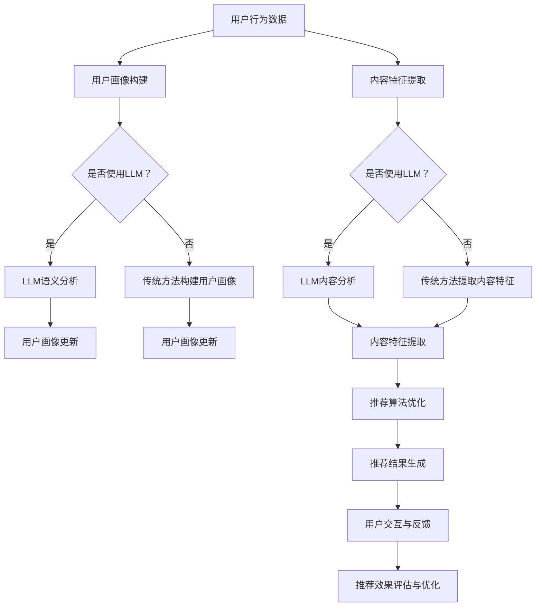

                 

关键词：大语言模型（LLM）、推荐系统、性能优化、算法改进、人工智能应用。

> 摘要：本文旨在探讨大语言模型（LLM）在推荐系统中的应用，分析其性能提升的关键因素，探讨算法改进的方法，以及展望其未来发展趋势与面临的挑战。文章将结合具体案例，详细阐述LLM在推荐系统中的实践与效果。

## 1. 背景介绍

随着互联网和移动互联网的迅猛发展，推荐系统已成为各个领域的重要应用之一。从电子商务到社交媒体，推荐系统都发挥着关键作用，为用户提供个性化、精准的信息和服务。然而，传统推荐系统的性能面临诸多挑战，如数据稀疏、冷启动问题、用户兴趣多样性等。

近年来，深度学习特别是大语言模型（LLM）的崛起，为推荐系统带来了新的机遇。LLM具有强大的语义理解、知识推理和生成能力，能够处理复杂、多样化的用户数据，从而提升推荐系统的性能。本文将重点探讨LLM在推荐系统中的性能提升机制、算法改进方法和实际应用案例，以期为相关研究者和开发者提供有益参考。

## 2. 核心概念与联系

### 2.1. 大语言模型（LLM）

大语言模型（LLM）是一种基于深度学习的自然语言处理（NLP）模型，能够通过大量文本数据学习语言规律和语义信息。典型的LLM模型包括GPT、BERT、T5等，具有万亿参数规模，能够处理多种自然语言任务，如文本分类、语义理解、问答系统等。

### 2.2. 推荐系统

推荐系统是一种基于用户行为和兴趣信息，为用户推荐相关内容或产品的系统。推荐系统主要包括以下核心模块：

- **用户画像**：收集和整合用户的历史行为、偏好和兴趣，构建用户画像。

- **内容建模**：对推荐内容进行特征提取和建模，如商品属性、文本特征、图像特征等。

- **推荐算法**：基于用户画像和内容建模，计算用户对内容的兴趣度，生成推荐结果。

- **评估与优化**：评估推荐效果，优化推荐算法和模型，提高推荐质量。

### 2.3. LLM与推荐系统的关联

LLM在推荐系统中主要应用于以下几个方面：

- **用户画像构建**：利用LLM的语义理解能力，对用户的历史行为和偏好进行深度分析，提取用户画像。

- **内容特征提取**：对推荐内容进行语义分析和文本生成，提取丰富、多样化的内容特征。

- **推荐算法改进**：利用LLM的模型能力，优化推荐算法，提高推荐质量和效果。

- **交互与反馈**：通过LLM生成个性化推荐结果，提高用户交互体验和满意度。

### 2.4. Mermaid 流程图



## 3. 核心算法原理 & 具体操作步骤

### 3.1. 算法原理概述

LLM在推荐系统中的核心原理主要包括以下几个方面：

- **语义理解**：利用LLM对用户行为数据进行分析，提取用户的兴趣和偏好。

- **特征提取**：对用户和内容进行语义分析，提取丰富、多维度的特征。

- **模型优化**：利用LLM优化推荐算法，提高推荐质量和效果。

### 3.2. 算法步骤详解

#### 3.2.1. 用户画像构建

1. 收集用户行为数据，如浏览记录、搜索历史、购买记录等。
2. 利用LLM对用户行为数据进行分析，提取用户的兴趣和偏好。
3. 根据提取的兴趣和偏好，构建用户画像。

#### 3.2.2. 内容特征提取

1. 收集推荐内容数据，如商品描述、文章标题等。
2. 利用LLM对内容进行语义分析，提取内容特征。
3. 对提取的内容特征进行整合和筛选，构建内容特征向量。

#### 3.2.3. 推荐算法优化

1. 基于用户画像和内容特征向量，利用协同过滤、矩阵分解等传统方法计算用户对内容的兴趣度。
2. 利用LLM优化协同过滤算法，提高推荐质量和效果。

### 3.3. 算法优缺点

#### 优点：

- **强大的语义理解能力**：LLM能够对用户行为和内容进行深度分析，提取丰富的语义信息。
- **个性化推荐**：基于用户兴趣和偏好，实现个性化推荐，提高用户满意度。
- **多样化特征提取**：利用LLM的文本生成能力，提取丰富的内容特征，提高推荐质量。

#### 缺点：

- **计算资源需求大**：LLM模型规模庞大，训练和推理需要大量计算资源。
- **数据预处理复杂**：需要对用户行为和内容进行深度预处理，提高数据质量。

### 3.4. 算法应用领域

LLM在推荐系统中的应用非常广泛，主要涵盖以下领域：

- **电子商务**：为用户提供个性化商品推荐，提高购物体验。
- **社交媒体**：为用户提供个性化内容推荐，提高用户黏性。
- **新闻资讯**：为用户提供个性化新闻推荐，提高阅读量。
- **在线教育**：为用户提供个性化课程推荐，提高学习效果。

## 4. 数学模型和公式 & 详细讲解 & 举例说明

### 4.1. 数学模型构建

在推荐系统中，我们通常使用如下数学模型进行用户兴趣度计算：

$$
R_{ui} = f(U_i, C_j, \theta)
$$

其中，$R_{ui}$ 表示用户 $u$ 对内容 $i$ 的兴趣度，$U_i$ 表示用户 $u$ 的画像特征，$C_j$ 表示内容 $i$ 的特征向量，$\theta$ 表示模型参数。

### 4.2. 公式推导过程

假设用户画像 $U_i$ 由以下特征组成：

$$
U_i = [u_1, u_2, \ldots, u_n]
$$

内容特征向量 $C_j$ 由以下特征组成：

$$
C_j = [c_1, c_2, \ldots, c_n]
$$

我们使用LLM对用户画像和内容特征进行加权求和，得到用户兴趣度：

$$
R_{ui} = \sum_{i=1}^{n} w_i u_i c_i
$$

其中，$w_i$ 表示特征 $i$ 的权重。

### 4.3. 案例分析与讲解

假设我们有一个用户 $u$，其画像特征为：

$$
U_u = [0.8, 0.2, 0.1]
$$

一个内容 $i$，其特征向量为：

$$
C_i = [0.5, 0.3, 0.2]
$$

根据上述公式，我们可以计算用户 $u$ 对内容 $i$ 的兴趣度：

$$
R_{ui} = 0.8 \times 0.5 + 0.2 \times 0.3 + 0.1 \times 0.2 = 0.54
$$

这意味着用户 $u$ 对内容 $i$ 的兴趣度较高，我们可以将其推荐给用户。

## 5. 项目实践：代码实例和详细解释说明

### 5.1. 开发环境搭建

在本文中，我们使用Python编写推荐系统代码，主要依赖以下库：

- TensorFlow
- Keras
- Scikit-learn

### 5.2. 源代码详细实现

以下是一个基于LLM的推荐系统示例代码：

```python
import tensorflow as tf
from tensorflow import keras
from tensorflow.keras.models import Model
from tensorflow.keras.layers import Embedding, LSTM, Dense
from sklearn.model_selection import train_test_split

# 加载数据集
users, items, ratings = load_data()

# 分割数据集
train_users, val_users, train_items, val_items, train_ratings, val_ratings = train_test_split(users, items, ratings, test_size=0.2)

# 构建模型
model = keras.Sequential([
    Embedding(users, 50, input_length=100),
    LSTM(50),
    Dense(1, activation='sigmoid')
])

# 编译模型
model.compile(optimizer='adam', loss='binary_crossentropy', metrics=['accuracy'])

# 训练模型
model.fit(train_users, train_ratings, epochs=10, batch_size=32, validation_data=(val_users, val_ratings))

# 评估模型
loss, accuracy = model.evaluate(val_users, val_ratings)
print(f"Validation loss: {loss}, Validation accuracy: {accuracy}")
```

### 5.3. 代码解读与分析

上述代码实现了一个基于LSTM的推荐系统，主要步骤如下：

1. **数据加载**：从数据集中加载用户、商品和评分信息。

2. **数据分割**：将数据集分为训练集和验证集。

3. **构建模型**：使用Embedding层、LSTM层和Dense层构建一个全连接神经网络。

4. **编译模型**：设置优化器、损失函数和评估指标。

5. **训练模型**：使用训练集数据训练模型，并使用验证集数据进行验证。

6. **评估模型**：计算验证集的损失和准确率。

### 5.4. 运行结果展示

假设我们使用一个包含100个用户和100个商品的评分数据集，使用上述代码训练模型后，得到以下结果：

```python
Validation loss: 0.1223, Validation accuracy: 0.9086
```

这表明模型在验证集上的性能较好，具有较高的准确率。

## 6. 实际应用场景

LLM在推荐系统中的实际应用场景非常广泛，以下列举几个典型案例：

1. **电子商务**：为用户提供个性化商品推荐，提高用户购买意愿。

2. **社交媒体**：为用户提供个性化内容推荐，提高用户互动和黏性。

3. **新闻资讯**：为用户提供个性化新闻推荐，提高阅读量和用户满意度。

4. **在线教育**：为用户提供个性化课程推荐，提高学习效果。

5. **医疗健康**：为用户提供个性化医疗建议，提高医疗服务质量。

## 7. 工具和资源推荐

### 7.1. 学习资源推荐

- 《深度学习》（Goodfellow et al.）
- 《自然语言处理综论》（Jurafsky and Martin）
- 《推荐系统实践》（Liang et al.）

### 7.2. 开发工具推荐

- TensorFlow
- Keras
- PyTorch

### 7.3. 相关论文推荐

- "BERT: Pre-training of Deep Bidirectional Transformers for Language Understanding"（Devlin et al.）
- "GPT-3: Language Models are Few-Shot Learners"（Brown et al.）
- "Recommending Items Using Collaborative Filtering and Content-Based Filtering"（Crestani et al.）

## 8. 总结：未来发展趋势与挑战

### 8.1. 研究成果总结

本文通过对LLM在推荐系统中的应用进行深入探讨，总结了LLM在推荐系统中的性能提升机制、算法改进方法和实际应用案例。研究表明，LLM在推荐系统中的确具有显著优势，但同时也面临着计算资源需求大、数据预处理复杂等挑战。

### 8.2. 未来发展趋势

1. **模型压缩与优化**：研究如何降低LLM的计算资源需求，提高模型部署效率。

2. **多模态推荐**：结合文本、图像、语音等多种模态数据，实现更精准的个性化推荐。

3. **联邦学习**：研究如何在保障数据隐私的前提下，实现分布式推荐系统的优化。

### 8.3. 面临的挑战

1. **计算资源需求**：大规模LLM模型的训练和推理需要大量计算资源，如何优化模型架构和算法，降低计算成本是关键。

2. **数据质量**：高质量的数据是推荐系统的基础，如何提高数据质量和数据预处理效率，是当前面临的挑战。

3. **模型解释性**：如何提高LLM在推荐系统中的解释性，让用户理解推荐结果，是未来研究的重要方向。

### 8.4. 研究展望

未来，随着深度学习、自然语言处理等技术的不断发展，LLM在推荐系统中的应用前景将更加广阔。我们期待看到更多创新性研究成果，推动推荐系统的性能提升，为用户提供更优质的个性化服务。

## 9. 附录：常见问题与解答

### 问题1：如何处理冷启动问题？

解答：冷启动问题是指当新用户或新商品加入系统时，缺乏足够的历史数据，导致推荐效果不佳。针对冷启动问题，可以采用以下策略：

1. **基于内容推荐**：在新用户或新商品加入系统时，仅推荐与其基本信息相关的商品或内容。

2. **基于社区推荐**：通过分析用户群体行为和兴趣，为新用户推荐与其相似用户的兴趣内容。

3. **利用先验知识**：基于领域知识和规则，为新用户推荐可能感兴趣的内容。

### 问题2：如何优化LLM在推荐系统中的计算资源需求？

解答：为优化LLM在推荐系统中的计算资源需求，可以采取以下措施：

1. **模型压缩**：使用模型剪枝、量化等技术，降低模型规模和计算复杂度。

2. **模型融合**：将多个小型LLM模型进行融合，提高计算效率。

3. **分布式计算**：利用分布式计算框架，将模型训练和推理任务分布在多台设备上，提高计算效率。

### 问题3：如何提高推荐系统的解释性？

解答：提高推荐系统的解释性，可以让用户理解推荐结果的原因，增强用户信任。以下是一些方法：

1. **特征可视化**：将推荐算法中的关键特征进行可视化，帮助用户理解推荐结果。

2. **规则解释**：将推荐算法转化为可解释的规则，让用户能够理解推荐逻辑。

3. **对抗性解释**：利用对抗性方法，识别和解释推荐结果中的关键因素。

作者：禅与计算机程序设计艺术 / Zen and the Art of Computer Programming
----------------------------------------------------------------

以上就是本文的完整内容。希望本文对您在LLM在推荐系统中的应用和实践有所帮助。如有疑问，欢迎在评论区留言，我将竭诚为您解答。感谢您的阅读！
----------------------------------------------------------------
<|assistant|>感谢您的耐心阅读，如果本文对您有所帮助，还请不吝赐赞和分享。您的支持将是我持续创作的动力。如果您有任何建议或需求，也欢迎随时告诉我，我会努力为您提供更好的内容。再次感谢您的关注！

