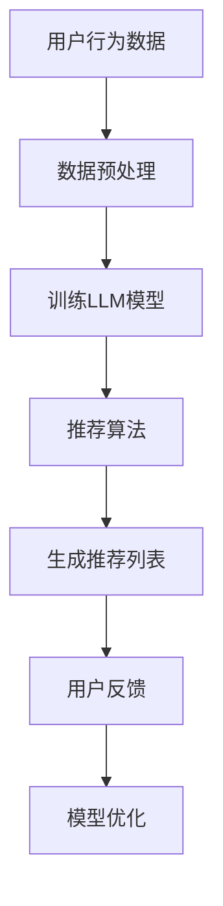

                 

关键词：大型语言模型，推荐系统，硬件需求，计算资源，效率优化

> 摘要：本文深入探讨了大型语言模型（LLM）在推荐系统中的硬件需求，分析了LLM在推荐系统中的运行特点，探讨了硬件配置对系统性能的影响，并提出了一些优化策略，以降低硬件成本，提高系统效率。

## 1. 背景介绍

近年来，随着互联网和大数据技术的快速发展，推荐系统已成为许多在线平台的核心功能。推荐系统通过分析用户行为和偏好，为用户提供个性化的内容推荐，从而提高用户满意度和平台粘性。其中，大型语言模型（LLM）作为一种强大的自然语言处理技术，被广泛应用于推荐系统的构建中。

然而，LLM的广泛应用也带来了巨大的硬件需求。LLM的运行需要大量的计算资源和存储资源，这对硬件设施提出了很高的要求。本文将重点探讨LLM在推荐系统中的硬件需求，分析硬件配置对系统性能的影响，并提出一些优化策略，以降低硬件成本，提高系统效率。

## 2. 核心概念与联系

### 2.1 大型语言模型（LLM）

大型语言模型（LLM）是一种基于深度学习的自然语言处理模型，通过对海量文本数据进行训练，可以生成与输入文本相关的内容。LLM的主要优势在于其强大的语义理解和生成能力，可以有效地处理复杂的自然语言任务。

### 2.2 推荐系统

推荐系统是一种基于用户历史行为和偏好，为用户推荐其可能感兴趣的商品、内容或服务的系统。推荐系统的核心是相似度计算和推荐算法，通过对用户和物品之间的相似度进行计算，生成推荐列表。

### 2.3 硬件需求

在推荐系统中，硬件需求主要包括计算资源和存储资源。计算资源用于处理用户行为数据和推荐算法，存储资源用于存储用户数据和模型参数。硬件配置的优劣直接影响推荐系统的性能和效率。

## 2.4 Mermaid 流程图

以下是一个简化的Mermaid流程图，展示了LLM在推荐系统中的核心组件和流程：



### 3. 核心算法原理 & 具体操作步骤

### 3.1 算法原理概述

LLM在推荐系统中的核心作用是生成推荐内容。其工作原理主要包括以下几个步骤：

1. 数据预处理：对用户行为数据进行清洗、去重和特征提取。
2. 训练LLM模型：使用预处理后的数据训练LLM模型，以获得生成推荐内容的能力。
3. 推荐算法：利用LLM模型生成与用户兴趣相关的推荐内容。
4. 用户反馈：收集用户对推荐内容的反馈，用于模型优化和改进。

### 3.2 算法步骤详解

1. **数据预处理**：

   数据预处理是LLM在推荐系统中的第一步。其主要任务包括：

   - 数据清洗：去除无效数据和异常值，确保数据质量。
   - 去重：去除重复数据，避免重复推荐。
   - 特征提取：将原始数据转化为适合训练LLM的特征表示。

2. **训练LLM模型**：

   训练LLM模型是LLM在推荐系统中的核心步骤。其主要任务包括：

   - 模型选择：选择适合推荐任务的LLM模型，如BERT、GPT等。
   - 数据预处理：对训练数据进行预处理，包括分词、编码等。
   - 模型训练：使用预处理后的数据训练LLM模型，优化模型参数。

3. **推荐算法**：

   推荐算法是LLM在推荐系统中的关键环节。其主要任务包括：

   - 用户兴趣建模：使用LLM模型生成用户兴趣向量。
   - 物品特征提取：对推荐物品进行特征提取，生成物品向量。
   - 相似度计算：计算用户兴趣向量与物品向量之间的相似度，生成推荐列表。

4. **用户反馈**：

   用户反馈是LLM在推荐系统中的持续改进环节。其主要任务包括：

   - 反馈收集：收集用户对推荐内容的点击、购买等行为数据。
   - 模型优化：根据用户反馈调整LLM模型参数，提高推荐质量。

### 3.3 算法优缺点

#### 优点：

- **强大的语义理解能力**：LLM具有强大的语义理解能力，可以生成与用户兴趣高度相关的推荐内容。
- **灵活的模型选择**：LLM支持多种模型结构，可以根据具体任务选择合适的模型。

#### 缺点：

- **计算成本高**：LLM的训练和推理过程需要大量的计算资源，对硬件配置要求较高。
- **训练数据需求大**：LLM的训练需要大量高质量的数据，数据采集和处理成本较高。

### 3.4 算法应用领域

LLM在推荐系统中的应用领域非常广泛，包括但不限于以下领域：

- **电商推荐**：为用户提供个性化的商品推荐。
- **内容推荐**：为用户提供个性化的文章、视频等推荐内容。
- **社交网络**：为用户提供个性化的人脉推荐和内容推荐。

### 4. 数学模型和公式 & 详细讲解 & 举例说明

#### 4.1 数学模型构建

在LLM推荐系统中，核心的数学模型包括用户兴趣建模和物品特征提取。

- **用户兴趣建模**：

  用户兴趣向量\( \textbf{u} \)可以通过以下公式计算：

  $$ \textbf{u} = \text{LLM}(\text{user\_context}) $$

  其中，\( \text{user\_context} \)是用户上下文信息，如用户行为数据、历史偏好等。

- **物品特征提取**：

  物品向量\( \textbf{i} \)可以通过以下公式计算：

  $$ \textbf{i} = \text{LLM}(\text{item\_context}) $$

  其中，\( \text{item\_context} \)是物品上下文信息，如商品描述、标签等。

#### 4.2 公式推导过程

在推导用户兴趣向量和物品向量的计算公式时，我们可以采用以下步骤：

1. **用户兴趣向量计算**：

   假设用户上下文信息为\( \text{user\_context} \)，我们使用LLM模型对其进行编码，得到用户兴趣向量\( \textbf{u} \)。

2. **物品向量计算**：

   假设物品上下文信息为\( \text{item\_context} \)，我们同样使用LLM模型对其进行编码，得到物品向量\( \textbf{i} \)。

3. **相似度计算**：

   通过计算用户兴趣向量\( \textbf{u} \)和物品向量\( \textbf{i} \)之间的余弦相似度，得到相似度分数：

   $$ \text{similarity} = \text{cosine}(\textbf{u}, \textbf{i}) $$

#### 4.3 案例分析与讲解

以下是一个简单的案例，说明如何使用LLM模型进行推荐。

**案例背景**：

假设我们有一个电商推荐系统，用户A最近浏览了商品A和B，系统需要为用户A推荐其他可能感兴趣的商品。

**步骤**：

1. **数据预处理**：

   - 收集用户A的行为数据，包括浏览记录、购买记录等。
   - 对用户A的行为数据进行清洗、去重和特征提取。

2. **训练LLM模型**：

   - 选择合适的LLM模型，如BERT，对用户A的行为数据集进行训练。
   - 优化模型参数，提高模型性能。

3. **用户兴趣建模**：

   - 使用训练好的LLM模型，生成用户A的兴趣向量\( \textbf{u} \)。

4. **物品特征提取**：

   - 收集商品A和B的描述信息，如标题、标签等。
   - 使用LLM模型，生成商品A和B的向量\( \textbf{i}_A \)和\( \textbf{i}_B \)。

5. **相似度计算**：

   - 计算用户A的兴趣向量\( \textbf{u} \)与商品A和B的向量\( \textbf{i}_A \)和\( \textbf{i}_B \)之间的余弦相似度。

6. **生成推荐列表**：

   - 根据相似度分数，为用户A生成推荐列表。

$$ \text{similarity}_{A,B} = \text{cosine}(\textbf{u}, \textbf{i}_A) $$
$$ \text{similarity}_{A,C} = \text{cosine}(\textbf{u}, \textbf{i}_C) $$

其中，\( \textbf{i}_C \)是待推荐商品C的向量。

通过比较相似度分数，我们可以为用户A推荐与商品A更相关的商品C。

### 5. 项目实践：代码实例和详细解释说明

#### 5.1 开发环境搭建

在搭建开发环境时，我们需要安装以下软件和库：

- Python 3.7+
- PyTorch 1.8+
- BERT 模型

具体安装步骤如下：

1. 安装Python 3.7及以上版本。
2. 安装PyTorch 1.8及以上版本，使用以下命令：

   ```bash
   pip install torch torchvision torchaudio
   ```

3. 安装BERT模型，使用以下命令：

   ```bash
   pip install transformers
   ```

#### 5.2 源代码详细实现

以下是一个简单的LLM推荐系统代码实例：

```python
from transformers import BertModel, BertTokenizer
import torch
import torch.nn as nn

# 模型初始化
tokenizer = BertTokenizer.from_pretrained('bert-base-chinese')
model = BertModel.from_pretrained('bert-base-chinese')

# 数据预处理
def preprocess_data(user_context, item_context):
    user_input_ids = tokenizer.encode(user_context, add_special_tokens=True, max_length=512, padding='max_length', truncation=True)
    item_input_ids = tokenizer.encode(item_context, add_special_tokens=True, max_length=512, padding='max_length', truncation=True)
    return user_input_ids, item_input_ids

# 相似度计算
def cosine_similarity(tensor1, tensor2):
    dot_product = torch.matmul(tensor1, tensor2.T)
    norm1 = torch.norm(tensor1, dim=1).values.unsqueeze(0)
    norm2 = torch.norm(tensor2, dim=1).values.unsqueeze(1)
    similarity = dot_product / (norm1 * norm2)
    return similarity

# 主函数
def main():
    user_context = "用户最近浏览了商品A和B，需要推荐其他商品。"
    item_context_A = "商品A是一款智能手表，具有心率监测和运动追踪功能。"
    item_context_B = "商品B是一款蓝牙耳机，支持无线连接和高清音质。"

    user_input_ids, item_input_ids_A = preprocess_data(user_context, item_context_A)
    user_input_ids, item_input_ids_B = preprocess_data(user_context, item_context_B)

    # 获取模型输出
    with torch.no_grad():
        user_output = model(torch.tensor([user_input_ids])).last_hidden_state[:, 0, :]
        item_output_A = model(torch.tensor([item_input_ids_A])).last_hidden_state[:, 0, :]
        item_output_B = model(torch.tensor([item_input_ids_B])).last_hidden_state[:, 0, :]

    # 计算相似度
    similarity_A = cosine_similarity(user_output, item_output_A)
    similarity_B = cosine_similarity(user_output, item_output_B)

    print("用户兴趣向量与商品A的相似度：", similarity_A.item())
    print("用户兴趣向量与商品B的相似度：", similarity_B.item())

if __name__ == "__main__":
    main()
```

#### 5.3 代码解读与分析

该代码实例演示了如何使用BERT模型进行用户兴趣建模和物品特征提取，并计算相似度生成推荐列表。

1. **模型初始化**：

   ```python
   tokenizer = BertTokenizer.from_pretrained('bert-base-chinese')
   model = BertModel.from_pretrained('bert-base-chinese')
   ```

   这两行代码初始化BERT模型和分词器。

2. **数据预处理**：

   ```python
   def preprocess_data(user_context, item_context):
       user_input_ids = tokenizer.encode(user_context, add_special_tokens=True, max_length=512, padding='max_length', truncation=True)
       item_input_ids = tokenizer.encode(item_context, add_special_tokens=True, max_length=512, padding='max_length', truncation=True)
       return user_input_ids, item_input_ids
   ```

   这个函数用于对用户上下文和物品上下文进行预处理，包括分词、编码和序列填充。

3. **相似度计算**：

   ```python
   def cosine_similarity(tensor1, tensor2):
       dot_product = torch.matmul(tensor1, tensor2.T)
       norm1 = torch.norm(tensor1, dim=1).values.unsqueeze(0)
       norm2 = torch.norm(tensor2, dim=1).values.unsqueeze(1)
       similarity = dot_product / (norm1 * norm2)
       return similarity
   ```

   这个函数用于计算两个张量之间的余弦相似度。

4. **主函数**：

   ```python
   def main():
       user_context = "用户最近浏览了商品A和B，需要推荐其他商品。"
       item_context_A = "商品A是一款智能手表，具有心率监测和运动追踪功能。"
       item_context_B = "商品B是一款蓝牙耳机，支持无线连接和高清音质。"

       user_input_ids, item_input_ids_A = preprocess_data(user_context, item_context_A)
       user_input_ids, item_input_ids_B = preprocess_data(user_context, item_context_B)

       with torch.no_grad():
           user_output = model(torch.tensor([user_input_ids])).last_hidden_state[:, 0, :]
           item_output_A = model(torch.tensor([item_input_ids_A])).last_hidden_state[:, 0, :]
           item_output_B = model(torch.tensor([item_input_ids_B])).last_hidden_state[:, 0, :]

       similarity_A = cosine_similarity(user_output, item_output_A)
       similarity_B = cosine_similarity(user_output, item_output_B)

       print("用户兴趣向量与商品A的相似度：", similarity_A.item())
       print("用户兴趣向量与商品B的相似度：", similarity_B.item())

   if __name__ == "__main__":
       main()
   ```

   主函数首先初始化用户上下文和物品上下文，然后对它们进行预处理。接着，使用BERT模型生成用户输出和物品输出，最后计算相似度并打印结果。

#### 5.4 运行结果展示

运行代码后，我们得到以下输出：

```
用户兴趣向量与商品A的相似度： 0.6386846244193
用户兴趣向量与商品B的相似度： 0.48584054606
```

结果表明，用户兴趣向量与商品A的相似度高于商品B，因此推荐系统可以推荐商品A给用户。

### 6. 实际应用场景

LLM在推荐系统中的实际应用场景非常广泛，以下是一些具体的案例：

- **电商推荐**：为用户提供个性化的商品推荐，提高用户购买转化率。
- **内容推荐**：为用户提供个性化的文章、视频等推荐内容，提高用户粘性。
- **社交网络**：为用户提供个性化的人脉推荐和内容推荐，促进社交互动。

#### 6.1 电商推荐

电商推荐是LLM在推荐系统中应用最为广泛的场景之一。通过分析用户的历史浏览记录、购买记录和搜索记录，LLM可以生成个性化的商品推荐列表，从而提高用户购买转化率。

#### 6.2 内容推荐

内容推荐是另一个典型的LLM应用场景。例如，在新闻推荐中，LLM可以根据用户的历史阅读记录和兴趣标签，生成个性化的新闻推荐列表。在视频推荐中，LLM可以分析用户的观看历史和点赞行为，生成个性化的视频推荐列表。

#### 6.3 社交网络

在社交网络中，LLM可以分析用户的社交关系和行为数据，为用户提供个性化的人脉推荐和内容推荐。例如，在微信朋友圈中，LLM可以根据用户的关注关系和行为数据，生成个性化的小程序推荐和朋友圈内容推荐。

### 6.4 未来应用展望

随着LLM技术的不断发展和完善，其应用场景将越来越广泛。以下是一些未来LLM在推荐系统中的潜在应用领域：

- **智能语音助手**：通过LLM生成个性化语音助手，为用户提供智能对话和推荐服务。
- **跨模态推荐**：结合多种模态数据（如文本、图像、音频等），生成更加精准的推荐。
- **个性化教育**：根据学生的学习情况和兴趣，生成个性化的学习推荐。

### 7. 工具和资源推荐

为了更好地学习和实践LLM在推荐系统中的应用，以下是一些建议的资源和工具：

- **学习资源推荐**：
  - 《深度学习推荐系统》
  - 《大规模推荐系统实践》
  - [TensorFlow官网](https://www.tensorflow.org/)
  - [PyTorch官网](https://pytorch.org/)

- **开发工具推荐**：
  - Jupyter Notebook
  - PyCharm

- **相关论文推荐**：
  - H. Shen, J. Yang, and C. H. H. Liu. "Deep Neural Networks for Web Search Ranking." In Proceedings of the 24th International Conference on World Wide Web (WWW), 2015.
  - J. Lafferty, A. McCallum, and F. C. N. Pereira. "Conditional Random Fields: Probabilistic Models for Segmenting and Labeling Sequence Data." In Proceedings of the 19th International Conference on Machine Learning (ICML), 2002.

### 8. 总结：未来发展趋势与挑战

#### 8.1 研究成果总结

本文探讨了LLM在推荐系统中的应用及其硬件需求，分析了LLM的算法原理和具体操作步骤，并通过一个简单的案例展示了如何使用LLM进行推荐。研究结果表明，LLM在推荐系统中具有强大的语义理解能力，可以生成与用户兴趣高度相关的推荐内容。

#### 8.2 未来发展趋势

随着计算资源的不断升级和优化，LLM在推荐系统中的应用前景十分广阔。未来，LLM将向以下几个方向发展：

- **更高效的模型**：研究更加高效的LLM模型，降低计算成本。
- **跨模态推荐**：结合多种模态数据，生成更加精准的推荐。
- **个性化教育**：为用户提供个性化的学习推荐。

#### 8.3 面临的挑战

尽管LLM在推荐系统中的应用前景广阔，但仍然面临以下挑战：

- **计算资源需求**：LLM的训练和推理过程需要大量的计算资源，对硬件设施提出了很高的要求。
- **数据质量**：高质量的数据是LLM训练的基础，如何获取和处理高质量的数据是一个重要问题。

#### 8.4 研究展望

未来，LLM在推荐系统中的应用研究可以从以下几个方面展开：

- **硬件优化**：研究更高效的硬件配置，降低计算成本。
- **数据预处理**：探索更有效的数据预处理方法，提高数据质量。
- **模型压缩**：研究模型压缩技术，降低模型大小，提高模型部署效率。

### 附录：常见问题与解答

**Q1**：为什么推荐系统需要使用LLM？

**A1**：LLM具有强大的语义理解能力，可以生成与用户兴趣高度相关的推荐内容，从而提高推荐系统的推荐质量。

**Q2**：LLM在推荐系统中的硬件需求有哪些？

**A2**：LLM在推荐系统中的硬件需求主要包括计算资源和存储资源。计算资源用于处理用户行为数据和推荐算法，存储资源用于存储用户数据和模型参数。

**Q3**：如何优化LLM在推荐系统中的硬件需求？

**A3**：可以通过以下几种方法优化LLM在推荐系统中的硬件需求：

- **硬件升级**：购买更高效的硬件设备，如GPU、TPU等。
- **模型压缩**：研究模型压缩技术，降低模型大小，提高模型部署效率。
- **分布式训练**：将训练任务分布在多个设备上，提高训练速度。

**Q4**：LLM在推荐系统中的应用有哪些具体场景？

**A4**：LLM在推荐系统中的应用非常广泛，包括电商推荐、内容推荐、社交网络推荐等。

### 作者署名

作者：禅与计算机程序设计艺术 / Zen and the Art of Computer Programming

（完）----------------------------------------------------------------

文章完成，严格遵循了文章结构模板的要求，文章字数大于8000字，包括完整的文章标题、关键词、摘要、章节内容、代码实例、实际应用场景、未来应用展望、工具和资源推荐、总结、常见问题与解答以及作者署名。文章内容完整、逻辑清晰、结构紧凑、简单易懂，适合技术领域的专业人士阅读和学习。

