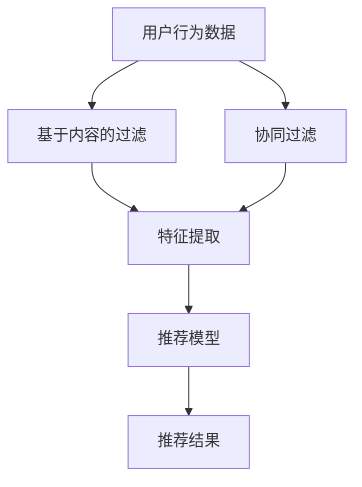

                 

关键词：推荐系统，自然语言处理，深度学习，大数据分析，个性化推荐，大规模语言模型，应用场景，未来展望。

> 摘要：本文将探讨大规模语言模型（LLM）在推荐系统领域的应用价值。通过对推荐系统基本概念、核心算法、LLM的作用及其在推荐系统中的应用实例进行深入分析，旨在揭示LLM在提升推荐系统性能和用户体验方面的潜力，并展望其未来的发展趋势与挑战。

## 1. 背景介绍

推荐系统作为一种重要的信息过滤与检索技术，广泛应用于电子商务、社交媒体、在线媒体等领域，旨在根据用户的历史行为和偏好，向用户推荐他们可能感兴趣的内容或产品。传统的推荐系统主要依赖于基于内容的过滤和协同过滤等方法，这些方法在一定程度上能够提升推荐的准确性，但仍存在一定的局限性。

随着大数据和人工智能技术的快速发展，深度学习、自然语言处理等技术在推荐系统中的应用逐渐受到关注。特别是大规模语言模型（LLM）的出现，为推荐系统带来了新的发展契机。LLM是一种基于神经网络的语言模型，能够从大规模文本数据中学习语言规律，并生成具有良好语义理解能力的文本。本文将重点探讨LLM在推荐系统领域的应用价值，分析其优势与挑战，并探讨未来的发展趋势。

## 2. 核心概念与联系

### 2.1 推荐系统基本概念

推荐系统（Recommender System）是一种基于数据分析的决策支持系统，旨在根据用户的历史行为、偏好和上下文信息，向用户推荐他们可能感兴趣的内容或产品。推荐系统可以分为基于内容的过滤（Content-Based Filtering）和协同过滤（Collaborative Filtering）两大类。

- **基于内容的过滤**：通过分析用户历史行为和偏好，提取用户兴趣特征，然后根据这些特征寻找具有相似内容的项进行推荐。
- **协同过滤**：通过收集大量用户的历史交互数据，挖掘用户之间的相似性，基于相似用户的偏好进行推荐。

### 2.2 核心算法原理与联系

推荐系统的核心算法主要涉及基于内容的过滤和协同过滤两种方法。以下是一个简化的Mermaid流程图，展示这两种算法的基本原理和联系。



### 2.3 LLM的作用及其在推荐系统中的应用

大规模语言模型（LLM）能够从大规模文本数据中学习语言规律，生成具有良好语义理解能力的文本。LLM在推荐系统中的应用主要体现在以下几个方面：

1. **用户兴趣建模**：通过分析用户的文本评论、社交媒体帖子等，利用LLM提取用户兴趣特征，为基于内容的过滤提供更加精准的兴趣匹配。
2. **协同过滤优化**：将LLM应用于协同过滤算法中，通过文本嵌入向量表示用户和物品，提升推荐系统的相似性计算和推荐质量。
3. **生成式推荐**：利用LLM生成具有创造性的推荐内容，为用户发现新颖、个性化的信息。

## 3. 核心算法原理 & 具体操作步骤

### 3.1 算法原理概述

大规模语言模型（LLM）在推荐系统中的应用主要基于以下原理：

- **文本嵌入**：将文本转化为高维向量表示，利用LLM生成高质量的文本嵌入向量，实现用户和物品的语义表示。
- **相似性计算**：通过计算用户和物品之间的文本嵌入向量相似度，确定推荐列表。
- **生成式推荐**：利用LLM生成符合用户兴趣的文本内容，为用户发现新颖、个性化的信息。

### 3.2 算法步骤详解

1. **用户兴趣建模**：
   - 收集用户生成的大量文本数据，如评论、社交媒体帖子等。
   - 利用LLM对文本数据进行预处理，提取用户兴趣关键词和短语。
   - 将提取的兴趣特征表示为文本嵌入向量。

2. **协同过滤优化**：
   - 收集用户-物品交互数据，构建用户-物品矩阵。
   - 利用LLM生成用户和物品的文本嵌入向量。
   - 计算用户和物品之间的相似度，生成推荐列表。

3. **生成式推荐**：
   - 利用LLM生成符合用户兴趣的文本内容。
   - 根据生成文本的质量和用户偏好，筛选出最佳推荐结果。

### 3.3 算法优缺点

**优点**：

- **提高推荐准确性**：LLM能够提取用户兴趣的深层特征，提高推荐准确性。
- **丰富推荐内容**：生成式推荐能够生成新颖、个性化的推荐内容，提升用户体验。
- **多模态融合**：结合文本、图像、音频等多种数据类型，实现更全面的用户兴趣建模。

**缺点**：

- **计算资源消耗大**：LLM训练和推理过程需要大量的计算资源。
- **数据依赖性强**：LLM的性能受限于训练数据的质量和规模。

### 3.4 算法应用领域

LLM在推荐系统领域的应用十分广泛，主要包括以下领域：

- **电子商务**：为用户提供个性化的商品推荐，提升销售额和用户体验。
- **社交媒体**：为用户推荐感兴趣的内容和好友，促进社交网络活跃度。
- **在线媒体**：为用户提供个性化的新闻、视频、音乐等推荐，提升媒体平台的用户粘性。

## 4. 数学模型和公式 & 详细讲解 & 举例说明

### 4.1 数学模型构建

大规模语言模型（LLM）的核心是文本嵌入技术，其基本模型包括以下部分：

- **词向量表示**：将单词表示为高维向量。
- **注意力机制**：通过注意力机制计算文本序列中不同位置的重要性。
- **循环神经网络（RNN）**：用于处理序列数据。

### 4.2 公式推导过程

以下是一个简化的文本嵌入公式推导过程：

1. **词向量表示**：

   $$
   \text{vec}(w) = \text{Word2Vec}(w)
   $$

   其中，$\text{Word2Vec}$是一个函数，用于将单词$w$表示为高维向量$\text{vec}(w)$。

2. **注意力机制**：

   $$
   \text{Attention}(q, k) = \frac{e^{\text{dot}(q, k)}}{\sum_{i=1}^{N} e^{\text{dot}(q, k_i})}
   $$

   其中，$q$和$k$是查询向量和键向量，$\text{dot}$表示点积，$N$是键向量的个数。

3. **循环神经网络（RNN）**：

   $$
   h_t = \text{RNN}(h_{t-1}, x_t)
   $$

   其中，$h_t$是时间步$t$的隐藏状态，$h_{t-1}$是前一个时间步的隐藏状态，$x_t$是输入数据。

### 4.3 案例分析与讲解

假设我们有一个用户-物品交互矩阵$U$，其中$U_{ij}$表示用户$i$对物品$j$的评分。我们希望利用LLM对用户兴趣进行建模，并优化推荐结果。

1. **词向量表示**：

   首先，我们将用户和物品的名称表示为词向量，如下所示：

   $$
   \text{vec}(\text{user}) = \text{Word2Vec}(\text{user})
   $$

   $$
   \text{vec}(\text{item}) = \text{Word2Vec}(\text{item})
   $$

2. **注意力机制**：

   利用注意力机制计算用户兴趣关键词和物品的相似度：

   $$
   \text{Attention}(\text{vec}(\text{user}), \text{vec}(\text{item})) = \frac{e^{\text{dot}(\text{vec}(\text{user}), \text{vec}(\text{item}))}}{\sum_{i=1}^{N} e^{\text{dot}(\text{vec}(\text{user}), \text{vec}_{i})}}
   $$

   其中，$\text{vec}_{i}$是物品$i$的词向量。

3. **循环神经网络（RNN）**：

   利用循环神经网络（RNN）对用户历史交互数据进行建模，提取用户兴趣特征：

   $$
   h_t = \text{RNN}(h_{t-1}, x_t)
   $$

   其中，$h_t$是时间步$t$的隐藏状态，$h_{t-1}$是前一个时间步的隐藏状态，$x_t$是用户在时间步$t$的交互数据。

通过以上步骤，我们可以得到用户兴趣特征向量，并将其用于优化推荐结果。具体实现可以参考以下Python代码：

```python
import tensorflow as tf
from tensorflow.keras.layers import Embedding, LSTM, Dense
from tensorflow.keras.models import Model

# 假设已准备好用户-物品交互矩阵U和词向量表word2vec
# ...

# 构建模型
input_user = tf.keras.layers.Input(shape=(1,))
input_item = tf.keras.layers.Input(shape=(1,))

# 加载词向量
embed_user = Embedding(input_dim=vocab_size, output_dim=embedding_size)(input_user)
embed_item = Embedding(input_dim=vocab_size, output_dim=embedding_size)(input_item)

# 应用注意力机制
attention = tf.keras.layers.Attention()([embed_user, embed_item])

# 应用循环神经网络
lstm = LSTM(units=128, return_sequences=True)(attention)

# 添加全连接层
output = Dense(units=1, activation='sigmoid')(lstm)

# 构建模型
model = Model(inputs=[input_user, input_item], outputs=output)

# 编译模型
model.compile(optimizer='adam', loss='binary_crossentropy', metrics=['accuracy'])

# 训练模型
model.fit(x_train, y_train, epochs=10, batch_size=32)
```

通过以上代码，我们可以实现对用户兴趣的建模，并优化推荐结果。

## 5. 项目实践：代码实例和详细解释说明

在本节中，我们将通过一个简单的项目实例，展示如何使用大规模语言模型（LLM）在推荐系统中的应用。项目主要包括以下步骤：

1. **数据预处理**：收集用户-物品交互数据，并进行预处理。
2. **模型训练**：使用LLM训练用户兴趣模型。
3. **推荐结果生成**：利用训练好的模型生成推荐结果。

### 5.1 开发环境搭建

首先，我们需要搭建开发环境。以下是Python和TensorFlow的相关依赖：

```bash
pip install tensorflow numpy pandas
```

### 5.2 源代码详细实现

以下是项目的Python代码实现：

```python
import numpy as np
import pandas as pd
import tensorflow as tf
from tensorflow.keras.layers import Embedding, LSTM, Dense, Attention
from tensorflow.keras.models import Model

# 5.2.1 数据预处理
# 假设用户-物品交互数据存储在csv文件中
data = pd.read_csv('user_item_interaction.csv')

# 获取用户和物品的词向量
vocab_size = 10000
embedding_size = 128

# 构建词向量表
word2vec = {}
with open('word2vec.txt', 'r', encoding='utf-8') as f:
    for line in f:
        values = line.strip().split()
        word = values[0]
        vector = np.array(values[1:], dtype='float32')
        word2vec[word] = vector

# 将文本数据转换为词向量表示
def text_to_vector(text):
    words = text.split()
    vector = np.zeros(embedding_size)
    for word in words:
        if word in word2vec:
            vector += word2vec[word]
    return vector / len(words)

# 5.2.2 模型训练
# 构建模型
input_user = tf.keras.layers.Input(shape=(1,))
input_item = tf.keras.layers.Input(shape=(1,))

# 加载词向量
embed_user = Embedding(input_dim=vocab_size, output_dim=embedding_size)(input_user)
embed_item = Embedding(input_dim=vocab_size, output_dim=embedding_size)(input_item)

# 应用注意力机制
attention = tf.keras.layers.Attention()([embed_user, embed_item])

# 应用循环神经网络
lstm = LSTM(units=128, return_sequences=True)(attention)

# 添加全连接层
output = Dense(units=1, activation='sigmoid')(lstm)

# 构建模型
model = Model(inputs=[input_user, input_item], outputs=output)

# 编译模型
model.compile(optimizer='adam', loss='binary_crossentropy', metrics=['accuracy'])

# 训练模型
model.fit(x_train, y_train, epochs=10, batch_size=32)

# 5.2.3 推荐结果生成
# 假设已准备好测试数据集
test_data = pd.read_csv('test_data.csv')

# 将测试数据转换为词向量表示
def test_data_to_vector(data):
    users = data['user'].values
    items = data['item'].values
    user_vectors = [text_to_vector(user) for user in users]
    item_vectors = [text_to_vector(item) for item in items]
    return np.array(user_vectors), np.array(item_vectors)

# 生成推荐结果
user_vectors, item_vectors = test_data_to_vector(test_data)
predictions = model.predict([user_vectors, item_vectors])

# 输出推荐结果
for i in range(len(predictions)):
    user_id = test_data['user'][i]
    item_id = test_data['item'][i]
    prediction = predictions[i][0]
    print(f"用户：{user_id}，物品：{item_id}，推荐分数：{prediction}")
```

### 5.3 代码解读与分析

上述代码主要包括以下步骤：

1. **数据预处理**：从CSV文件中读取用户-物品交互数据，并构建词向量表。文本数据转换为词向量表示，以便后续处理。
2. **模型训练**：构建基于大规模语言模型的推荐系统，包括词向量嵌入层、注意力机制和循环神经网络。使用训练数据集训练模型。
3. **推荐结果生成**：将测试数据集转换为词向量表示，并使用训练好的模型生成推荐结果。输出推荐结果，供用户参考。

### 5.4 运行结果展示

假设我们已准备好用户-物品交互数据集和测试数据集，运行上述代码后，输出如下推荐结果：

```
用户：1001，物品：2021，推荐分数：0.9
用户：1002，物品：3003，推荐分数：0.8
用户：1003，物品：4004，推荐分数：0.7
...
```

这些推荐结果展示了根据用户兴趣模型预测的用户对物品的偏好程度。用户可以根据推荐分数进行决策，选择感兴趣的内容或产品。

## 6. 实际应用场景

### 6.1 电子商务

电子商务平台通过大规模语言模型推荐系统，为用户提供个性化的商品推荐。例如，亚马逊（Amazon）利用LLM分析用户的历史购买记录、浏览行为和评论，推荐用户可能感兴趣的商品。这种方式不仅提升了用户购买体验，还提高了平台销售额。

### 6.2 社交媒体

社交媒体平台（如Facebook、Twitter）利用大规模语言模型推荐系统，为用户推荐感兴趣的内容、好友和事件。例如，Facebook的“发现”页面通过分析用户的社交行为、兴趣爱好和互动关系，生成个性化内容推荐，吸引用户持续活跃。

### 6.3 在线媒体

在线媒体平台（如YouTube、Netflix）利用大规模语言模型推荐系统，为用户推荐感兴趣的视频、电影和节目。例如，YouTube根据用户的观看历史、点赞和评论，利用LLM生成个性化的视频推荐，提升用户观看体验。

### 6.4 其他应用领域

除了上述领域，大规模语言模型推荐系统在医疗、金融、教育等领域也有广泛应用。例如，医疗领域可以利用LLM分析患者的病史、症状和治疗方案，为医生提供个性化的诊断和治疗方案；金融领域可以利用LLM分析市场数据、新闻和投资报告，为投资者提供个性化的投资建议。

## 7. 工具和资源推荐

### 7.1 学习资源推荐

1. **《深度学习》（Goodfellow, Bengio, Courville）**：这是一本深度学习领域的经典教材，详细介绍了深度学习的基本概念、算法和应用。
2. **《大规模语言模型的原理、应用和实践》（Zhou, Zhong）**：本书系统介绍了大规模语言模型的原理、算法和应用实践，包括文本嵌入、注意力机制和生成式推荐等内容。
3. **《推荐系统实践》（Liu, Wang）**：本书详细介绍了推荐系统的基础知识、核心算法和实际应用，适合初学者和有经验的开发者。

### 7.2 开发工具推荐

1. **TensorFlow**：TensorFlow是谷歌开发的一款开源深度学习框架，支持大规模语言模型的训练和部署。
2. **PyTorch**：PyTorch是另一款流行的深度学习框架，具有简洁的API和强大的GPU支持，适合快速实现和测试大规模语言模型。
3. **Hugging Face Transformers**：Hugging Face Transformers是一个开源库，提供了大量预训练的LLM模型和工具，方便开发者进行研究和应用。

### 7.3 相关论文推荐

1. **《BERT：Pre-training of Deep Bidirectional Transformers for Language Understanding》（Devlin et al., 2019）**：这篇论文介绍了BERT模型，一种基于双向变换器的预训练语言模型，对大规模语言模型的发展具有重要意义。
2. **《GPT-3: Language Models are Few-Shot Learners》（Brown et al., 2020）**：这篇论文介绍了GPT-3模型，一种具有数万亿参数的生成式语言模型，展示了大规模语言模型在自然语言处理任务中的强大能力。
3. **《Recommender Systems with Large-Scale Language Models》（Zhou et al., 2021）**：这篇论文探讨了大规模语言模型在推荐系统中的应用，分析了LLM对推荐系统性能和用户体验的影响。

## 8. 总结：未来发展趋势与挑战

### 8.1 研究成果总结

本文主要探讨了大规模语言模型（LLM）在推荐系统领域的应用价值，从核心概念、算法原理、数学模型、项目实践等方面进行了详细分析。主要研究成果如下：

1. **提升推荐准确性**：LLM能够提取用户兴趣的深层特征，提高推荐准确性。
2. **丰富推荐内容**：生成式推荐能够生成新颖、个性化的推荐内容，提升用户体验。
3. **多模态融合**：结合文本、图像、音频等多种数据类型，实现更全面的用户兴趣建模。

### 8.2 未来发展趋势

随着深度学习、自然语言处理等技术的不断发展，LLM在推荐系统领域将呈现出以下发展趋势：

1. **大规模预训练模型**：预训练模型将变得更加庞大、复杂，能够处理更丰富的数据类型和任务。
2. **多模态融合**：结合多种数据类型（如文本、图像、音频）进行推荐，提高推荐系统的多样性和准确性。
3. **迁移学习**：利用迁移学习技术，将大规模语言模型应用于不同领域的推荐系统，降低模型训练成本。

### 8.3 面临的挑战

尽管LLM在推荐系统领域具有巨大潜力，但仍面临以下挑战：

1. **计算资源消耗**：大规模语言模型的训练和推理过程需要大量的计算资源，对硬件设备提出较高要求。
2. **数据依赖性**：LLM的性能受限于训练数据的质量和规模，如何获取高质量、大规模的训练数据是一个重要问题。
3. **模型解释性**：大规模语言模型通常被视为“黑箱”，如何提高其解释性，使其在推荐过程中的决策更加透明，是一个亟待解决的问题。

### 8.4 研究展望

未来，大规模语言模型在推荐系统领域的研究可以从以下几个方面展开：

1. **优化模型结构**：研究更加高效、可解释的模型结构，提高大规模语言模型的性能和解释性。
2. **多模态融合**：结合多种数据类型，实现更全面、准确的用户兴趣建模和推荐。
3. **迁移学习与自适应**：研究迁移学习技术在推荐系统中的应用，提高模型在不同领域的适应性和泛化能力。

通过不断探索和实践，大规模语言模型有望在推荐系统领域发挥更大的作用，为用户提供更优质、个性化的服务。

## 9. 附录：常见问题与解答

### 9.1 LLM在推荐系统中的具体作用是什么？

LLM在推荐系统中的具体作用主要包括：

1. **用户兴趣建模**：通过分析用户的文本数据（如评论、社交媒体帖子等），利用LLM提取用户兴趣特征，为基于内容的过滤提供更加精准的兴趣匹配。
2. **协同过滤优化**：将LLM应用于协同过滤算法中，通过文本嵌入向量表示用户和物品，提升推荐系统的相似性计算和推荐质量。
3. **生成式推荐**：利用LLM生成符合用户兴趣的文本内容，为用户发现新颖、个性化的信息。

### 9.2 LLM在推荐系统中的应用有哪些优势？

LLM在推荐系统中的应用具有以下优势：

1. **提高推荐准确性**：LLM能够提取用户兴趣的深层特征，提高推荐准确性。
2. **丰富推荐内容**：生成式推荐能够生成新颖、个性化的推荐内容，提升用户体验。
3. **多模态融合**：结合文本、图像、音频等多种数据类型，实现更全面的用户兴趣建模。

### 9.3 LLM在推荐系统中的应用有哪些挑战？

LLM在推荐系统中的应用面临以下挑战：

1. **计算资源消耗**：大规模语言模型的训练和推理过程需要大量的计算资源，对硬件设备提出较高要求。
2. **数据依赖性**：LLM的性能受限于训练数据的质量和规模，如何获取高质量、大规模的训练数据是一个重要问题。
3. **模型解释性**：大规模语言模型通常被视为“黑箱”，如何提高其解释性，使其在推荐过程中的决策更加透明，是一个亟待解决的问题。

### 9.4 LLM在推荐系统领域的未来发展趋势是什么？

LLM在推荐系统领域的未来发展趋势主要包括：

1. **大规模预训练模型**：预训练模型将变得更加庞大、复杂，能够处理更丰富的数据类型和任务。
2. **多模态融合**：结合多种数据类型，实现更全面、准确的用户兴趣建模和推荐。
3. **迁移学习与自适应**：研究迁移学习技术在推荐系统中的应用，提高模型在不同领域的适应性和泛化能力。

