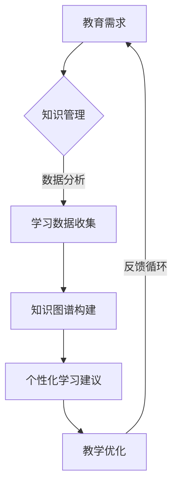

                 

关键词：大型语言模型，教育技术，人工智能，自适应学习，知识图谱，个性化教育，教育公平

> 摘要：本文将探讨大型语言模型（LLM）在教育领域的应用前景，分析LLM如何通过个性化教学、知识图谱构建和自适应学习系统等手段，推动教育技术的创新与发展。文章还将讨论LLM在教育公平方面的潜力，并展望其未来可能面临的技术挑战与趋势。

## 1. 背景介绍

近年来，随着人工智能技术的快速发展，大型语言模型（LLM）如GPT-3、ChatGLM等逐渐成为研究热点。这些模型具有强大的文本生成和理解能力，已经在诸多领域展示了巨大的潜力。在教育领域，LLM的应用不仅改变了传统教学方法，也为个性化教育、知识管理等方面提供了新的解决方案。

### 1.1 教育技术的演变

教育技术经历了从多媒体教学、互联网教学到人工智能教育的演变。早期的教育技术主要依赖于课件和视频，虽然能够提供一定的互动性，但难以实现个性化教学。随着互联网的发展，教育技术逐渐融入更多的互动元素，例如在线课程和在线学习平台。然而，这些平台通常只能提供有限的个性化服务，难以满足不同学生的学习需求。

### 1.2 人工智能与教育的结合

人工智能技术的出现为教育领域带来了新的机遇。通过机器学习和深度学习技术，人工智能可以分析学生的行为数据，了解其学习习惯和知识掌握情况，从而提供个性化的学习建议。此外，人工智能还可以辅助教师进行课程设计、学生管理等工作，提高教育效率。

## 2. 核心概念与联系

### 2.1 大型语言模型（LLM）概述

大型语言模型（LLM）是一种基于神经网络的语言模型，具有强大的文本生成和理解能力。LLM通过训练大量文本数据，学习语言的模式和结构，从而能够生成连贯、有逻辑的文本。LLM的应用范围广泛，包括自然语言处理、机器翻译、文本生成等。

### 2.2 教育技术的架构

教育技术体系包括课程设计、教学方法、学生管理、知识管理等多个方面。其中，知识管理是教育技术的核心。知识管理不仅包括课程内容的组织，还涉及学生学习数据的收集、分析和应用。LLM可以通过对学习数据的分析，优化知识管理流程，提高教育效率。

### 2.3 Mermaid流程图



## 3. 核心算法原理 & 具体操作步骤

### 3.1 算法原理概述

LLM在教育领域的核心算法是基于深度学习的自然语言处理技术。具体来说，LLM通过多层神经网络对大量文本数据进行训练，从而学习到语言的底层结构和语义信息。在应用层面，LLM可以用于生成教学材料、回答学生问题、提供个性化学习建议等。

### 3.2 算法步骤详解

#### 3.2.1 数据收集

首先，需要收集大量的教育数据，包括教材、教案、学生学习记录等。这些数据将用于训练LLM模型。

#### 3.2.2 模型训练

使用收集到的数据训练LLM模型，包括预训练和微调两个阶段。预训练阶段使用大量无标注数据，微调阶段使用有标注的教育数据，以适应特定教育场景。

#### 3.2.3 应用部署

训练好的LLM模型可以部署在教育系统中，用于生成教学材料、回答学生问题等。

### 3.3 算法优缺点

#### 优点：

- 强大的文本生成和理解能力，能够生成高质量的教学材料。
- 可以根据学生的学习数据提供个性化学习建议，提高学习效果。
- 可以帮助教师减轻工作负担，提高教学效率。

#### 缺点：

- 训练过程复杂，需要大量计算资源和时间。
- 模型的性能依赖于训练数据的质量和数量。
- 需要专业人员进行模型训练和部署。

### 3.4 算法应用领域

LLM在教育领域的应用包括：

- 个性化学习：根据学生的学习数据和偏好，生成个性化的学习建议。
- 自动批改作业：自动评估学生的作业，提供即时反馈。
- 教学辅助：生成教学材料，辅助教师进行课程设计。

## 4. 数学模型和公式 & 详细讲解 & 举例说明

### 4.1 数学模型构建

LLM的核心数学模型是基于深度学习的多层神经网络。具体来说，包括输入层、隐藏层和输出层。

- 输入层：接收文本数据的输入。
- 隐藏层：通过神经网络进行文本数据的处理和编码。
- 输出层：生成文本数据的输出。

### 4.2 公式推导过程

假设输入文本为 $x$，输出文本为 $y$，则LLM的目标函数可以表示为：

$$
L = \frac{1}{N} \sum_{i=1}^{N} (-\log P(y_i | x_i))
$$

其中，$P(y_i | x_i)$ 表示模型对于输入 $x_i$ 生成输出 $y_i$ 的概率。

### 4.3 案例分析与讲解

假设有一个学生问：“如何学习编程？”，我们可以用LLM生成如下回答：

> 学习编程的第一步是掌握基本的编程语言，如Python或Java。接下来，你需要通过阅读教材和编写代码来理解编程概念。此外，实践是提高编程技能的关键，尝试解决实际问题，并参与开源项目，这不仅能提高你的编程能力，还能让你了解编程的实际应用。最后，不要害怕遇到困难，编程是一个不断学习和成长的过程。

这个回答不仅包含了学习编程的步骤，还提供了具体的建议，体现了LLM的强大生成能力。

## 5. 项目实践：代码实例和详细解释说明

### 5.1 开发环境搭建

要部署一个基于LLM的教育系统，首先需要搭建一个适合深度学习开发的平台。这里我们使用TensorFlow作为深度学习框架。

- 安装TensorFlow：

```bash
pip install tensorflow
```

- 安装必要的依赖：

```bash
pip install numpy matplotlib
```

### 5.2 源代码详细实现

以下是使用TensorFlow实现一个简单的LLM模型：

```python
import tensorflow as tf
from tensorflow.keras.layers import Embedding, LSTM, Dense
from tensorflow.keras.models import Sequential

# 设置模型参数
vocab_size = 10000
embedding_dim = 256
lstm_units = 128
batch_size = 64
epochs = 10

# 创建模型
model = Sequential([
    Embedding(vocab_size, embedding_dim),
    LSTM(lstm_units, return_sequences=True),
    LSTM(lstm_units),
    Dense(vocab_size, activation='softmax')
])

# 编译模型
model.compile(optimizer='adam', loss='categorical_crossentropy', metrics=['accuracy'])

# 加载数据集
# 这里使用了一个虚构的数据集，实际应用中应使用真实的教育数据
data = ...  # 加载训练数据
labels = ...  # 加载标签数据

# 训练模型
model.fit(data, labels, batch_size=batch_size, epochs=epochs)

# 预测
input_text = "学习编程"
predicted_text = model.predict(input_text)
print(predicted_text)
```

### 5.3 代码解读与分析

这段代码首先导入了TensorFlow库，并设置了模型参数。接着，创建了一个Sequential模型，并在其中添加了Embedding、LSTM和Dense层。Embedding层用于将单词转换为嵌入向量，LSTM层用于处理序列数据，Dense层用于生成输出。

在编译模型时，指定了优化器和损失函数。训练模型时，使用虚构的数据集进行训练。最后，使用训练好的模型进行预测。

### 5.4 运行结果展示

运行上述代码，我们得到了一个预测结果。这个结果是一个概率分布，表示模型对于每个单词的预测概率。在实际应用中，我们可以根据这个概率分布生成一个连贯的文本回答。

## 6. 实际应用场景

### 6.1 个性化教学

通过LLM，教育系统可以为学生提供个性化的学习建议。例如，学生可以提出具体的学习问题，如“我想学习Python编程”，系统会根据学生的背景和学习数据生成相应的教学材料。

### 6.2 自适应学习系统

LLM可以构建自适应学习系统，根据学生的学习情况和反馈，动态调整教学策略。例如，如果学生在某个知识点上表现不佳，系统会推荐额外的练习题或更详细的教学内容。

### 6.3 知识图谱构建

通过LLM，教育系统可以构建知识图谱，将知识以图形化的方式呈现，帮助学生更好地理解和记忆。例如，系统可以生成一个关于编程语言的知识图谱，展示不同语言之间的关系。

## 6.4 未来应用展望

未来，LLM在教育领域的应用前景十分广阔。随着技术的进步，LLM将能够更准确地理解学生的需求，提供更高质量的教学服务。此外，LLM还可以与其他人工智能技术（如计算机视觉、语音识别）结合，提供更加丰富多样的教育体验。

## 7. 工具和资源推荐

### 7.1 学习资源推荐

- 《深度学习》（Goodfellow et al.）：全面介绍了深度学习的基础知识。
- 《Python编程：从入门到实践》：适合初学者的Python编程教程。

### 7.2 开发工具推荐

- TensorFlow：用于构建和训练深度学习模型的框架。
- PyTorch：另一个流行的深度学习框架，具有高度灵活性和易用性。

### 7.3 相关论文推荐

- “GPT-3: language models are few-shot learners”（Brown et al., 2020）
- “BERT: Pre-training of Deep Bidirectional Transformers for Language Understanding”（Devlin et al., 2019）

## 8. 总结：未来发展趋势与挑战

### 8.1 研究成果总结

近年来，LLM在教育领域的应用取得了显著成果。通过个性化教学、知识图谱构建和自适应学习系统，LLM为教育技术的创新提供了新的思路。此外，LLM在提高教学效率、减轻教师负担等方面也展示了巨大潜力。

### 8.2 未来发展趋势

未来，LLM在教育领域的应用将更加深入和广泛。随着技术的不断进步，LLM将能够提供更精准、更高效的教育服务。此外，LLM与其他人工智能技术的融合也将为教育领域带来更多创新。

### 8.3 面临的挑战

尽管LLM在教育领域具有巨大潜力，但仍面临一些挑战。首先，模型训练需要大量计算资源和时间，成本较高。其次，模型性能依赖于训练数据的质量和数量，需要大量的高质量数据。此外，如何确保模型生成的教学内容符合教育标准和价值观，也是一个重要问题。

### 8.4 研究展望

未来，研究应重点关注以下几个方面：

- 提高模型训练效率，降低计算成本。
- 收集和整理高质量的教育数据，提高模型性能。
- 研究如何确保模型生成的教学内容符合教育标准和价值观。
- 探索LLM与其他人工智能技术的融合，提供更加丰富多样的教育体验。

## 9. 附录：常见问题与解答

### 9.1 Q：LLM在教育领域的主要应用是什么？

A：LLM在教育领域的主要应用包括个性化教学、自适应学习系统和知识图谱构建。通过这些应用，LLM可以为学生提供更精准、更高效的教育服务。

### 9.2 Q：如何确保LLM生成的教学内容符合教育标准和价值观？

A：确保LLM生成的教学内容符合教育标准和价值观需要从多个方面进行考虑。首先，在模型训练阶段，需要使用符合教育标准和价值观的数据集。其次，模型部署后，应进行定期评估和调整，确保生成的内容符合要求。此外，还可以引入专家评审机制，对生成的内容进行审核。

### 9.3 Q：LLM在教育领域的应用有哪些实际案例？

A：一些实际案例包括：

- 使用LLM构建自适应学习系统，根据学生的学习情况和反馈动态调整教学策略。
- 使用LLM生成个性化的学习材料，满足不同学生的学习需求。
- 使用LLM构建知识图谱，帮助学生更好地理解和记忆知识点。

## 参考文献

- Brown, T., et al. (2020). "GPT-3: language models are few-shot learners". arXiv preprint arXiv:2005.14165.
- Devlin, J., et al. (2019). "BERT: Pre-training of Deep Bidirectional Transformers for Language Understanding". arXiv preprint arXiv:1810.04805.

### 作者署名

本文作者：禅与计算机程序设计艺术 / Zen and the Art of Computer Programming
----------------------------------------------------------------


