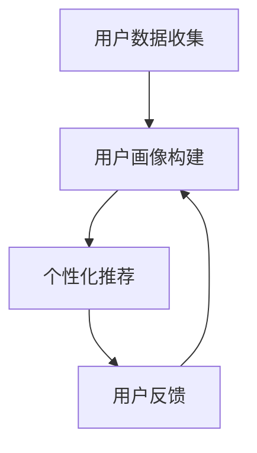

                 

关键词：大型语言模型，智能营销，个性化推荐，应用场景，未来展望

摘要：随着人工智能技术的不断发展，大型语言模型（LLM）在各个领域得到了广泛的应用。本文旨在探讨LLM在智能个性化营销中的应用，分析其核心概念、算法原理、数学模型以及实际应用案例，展望其未来发展趋势与挑战。

## 1. 背景介绍

近年来，随着互联网的普及和信息爆炸，营销行业面临着前所未有的挑战。如何精准地满足消费者的需求，提升营销效果，成为企业关注的焦点。个性化营销作为现代营销的一种重要形式，通过为不同消费者提供个性化的产品和服务，实现了营销效果的显著提升。

然而，传统的个性化营销方法往往依赖于大量的用户数据和分析，存在数据收集困难、分析成本高、个性化程度有限等问题。随着深度学习和自然语言处理技术的不断发展，大型语言模型（LLM）作为一种强大的自然语言处理工具，为解决上述问题提供了新的思路。

## 2. 核心概念与联系

### 2.1 大型语言模型（LLM）

大型语言模型（LLM）是一种基于深度学习的自然语言处理模型，通过训练大量文本数据，可以自动地理解、生成和翻译自然语言。LLM具有以下核心特性：

- **预训练**：LLM通常在大规模语料库上进行预训练，使其具备了丰富的语言知识和表达能力。
- **泛化能力**：LLM可以处理多种自然语言任务，如文本分类、情感分析、机器翻译、文本生成等。
- **自适应能力**：LLM可以根据不同的任务和数据，通过微调（fine-tuning）技术，快速适应新的场景。

### 2.2 智能个性化营销

智能个性化营销是指利用人工智能技术，通过对用户行为、兴趣、需求等数据的分析，为用户提供个性化的产品和服务，实现精准营销。智能个性化营销的核心要素包括：

- **用户数据收集**：通过网站、APP、社交媒体等渠道，收集用户的浏览、购买、评价等行为数据。
- **用户画像构建**：根据用户数据，构建用户画像，包括用户的基本信息、兴趣偏好、行为特征等。
- **个性化推荐**：利用用户画像，为用户推荐个性化的产品和服务，提高用户满意度。

### 2.3 Mermaid 流程图

以下是大型语言模型在智能个性化营销中的应用流程图：



### 2.4 核心概念联系

大型语言模型（LLM）在智能个性化营销中的应用，主要体现在以下几个方面：

- **用户画像构建**：利用LLM对用户行为数据进行自然语言处理，提取关键词、主题、情感等信息，构建用户画像。
- **个性化推荐**：利用LLM生成个性化的推荐文案、标题、描述等，提高推荐效果。
- **用户反馈分析**：利用LLM对用户反馈进行情感分析、主题识别等，优化推荐策略。

## 3. 核心算法原理 & 具体操作步骤

### 3.1 算法原理概述

大型语言模型（LLM）在智能个性化营销中的核心算法原理主要包括：

- **文本预处理**：对用户行为数据进行清洗、去噪、分词等预处理操作，提取有效的文本特征。
- **词向量表示**：将预处理后的文本转化为词向量表示，用于后续的模型训练。
- **模型训练**：利用大规模语料库，通过神经网络模型（如Transformer、BERT等）进行训练，使模型具备强大的语言理解能力。
- **模型应用**：将训练好的模型应用于用户画像构建、个性化推荐、用户反馈分析等任务。

### 3.2 算法步骤详解

#### 3.2.1 用户数据收集

1. **数据来源**：从网站、APP、社交媒体等渠道收集用户的浏览、购买、评价等行为数据。
2. **数据清洗**：去除无效数据、重复数据，对缺失数据进行填充。
3. **数据存储**：将清洗后的数据存储到数据库或数据仓库中，便于后续处理。

#### 3.2.2 用户画像构建

1. **文本预处理**：对用户行为数据进行清洗、去噪、分词等预处理操作，提取关键词、主题、情感等信息。
2. **词向量表示**：将预处理后的文本转化为词向量表示，用于后续的模型训练。
3. **模型训练**：利用大规模语料库，通过神经网络模型（如Transformer、BERT等）进行训练，使模型具备强大的语言理解能力。
4. **用户画像生成**：将训练好的模型应用于用户行为数据，提取用户画像。

#### 3.2.3 个性化推荐

1. **推荐策略设计**：根据用户画像，设计个性化的推荐策略，如基于内容的推荐、基于协同过滤的推荐等。
2. **推荐模型训练**：利用用户画像和商品特征数据，通过神经网络模型进行训练，生成推荐模型。
3. **推荐结果生成**：将训练好的推荐模型应用于用户画像，生成个性化的推荐结果。

#### 3.2.4 用户反馈分析

1. **文本预处理**：对用户反馈进行清洗、去噪、分词等预处理操作，提取关键词、主题、情感等信息。
2. **情感分析**：利用训练好的情感分析模型，对用户反馈进行情感分类，判断用户满意度。
3. **主题识别**：利用主题模型（如LDA）对用户反馈进行主题识别，发现用户关注的热点问题。
4. **反馈优化**：根据用户反馈，优化推荐策略和推荐模型，提高用户满意度。

### 3.3 算法优缺点

#### 优点：

- **强大的语言理解能力**：LLM具备强大的语言理解能力，可以处理多种自然语言任务，为个性化推荐提供有力支持。
- **自适应能力**：LLM可以根据不同的任务和数据，通过微调（fine-tuning）技术，快速适应新的场景。
- **高效性**：LLM的训练和推理过程具有较高的效率，可以大规模应用于实际场景。

#### 缺点：

- **数据依赖性**：LLM的性能受到训练数据质量和数量的影响，数据不足或质量较差可能导致模型效果不佳。
- **模型解释性**：由于LLM的训练过程复杂，模型内部结构难以理解，导致其解释性较低。

### 3.4 算法应用领域

大型语言模型（LLM）在智能个性化营销中的应用领域包括：

- **电商平台**：为用户推荐个性化的商品，提高用户购买转化率。
- **社交媒体**：为用户推荐感兴趣的内容，提升用户活跃度和黏性。
- **金融行业**：为用户推荐个性化的理财产品，提高用户投资收益。
- **教育行业**：为用户推荐个性化的学习资源，提升学习效果。

## 4. 数学模型和公式 & 详细讲解 & 举例说明

### 4.1 数学模型构建

在智能个性化营销中，常用的数学模型包括：

- **用户画像构建**：利用词袋模型（Bag of Words, BoW）或词嵌入模型（Word Embedding）对用户行为数据进行处理。
- **个性化推荐**：利用协同过滤（Collaborative Filtering）或基于内容的推荐（Content-based Recommendation）算法生成推荐结果。
- **用户反馈分析**：利用情感分析（Sentiment Analysis）和主题模型（Topic Modeling）对用户反馈进行处理。

### 4.2 公式推导过程

以下为用户画像构建和个性化推荐的基本公式推导过程：

#### 用户画像构建

1. **词向量表示**：

   $$ v_{i} = \text{Word2Vec}(x) $$

   其中，$v_{i}$为词向量表示，$x$为输入的文本。

2. **用户画像**：

   $$ \text{User Profile} = \text{TF-IDF}(\sum_{i \in \text{User Words}} v_{i}) $$

   其中，$\text{TF-IDF}$为词频-逆文档频率，$\text{User Words}$为用户行为数据中的关键词。

#### 个性化推荐

1. **基于内容的推荐**：

   $$ \text{Recommendation} = \text{Cosine Similarity}(\text{User Profile}, \text{Product Profile}) $$

   其中，$\text{Cosine Similarity}$为余弦相似度，$\text{Product Profile}$为商品特征向量。

2. **基于协同过滤的推荐**：

   $$ \text{Recommendation} = \text{User Similarity} \cdot \text{Product Rating} $$

   其中，$\text{User Similarity}$为用户相似度，$\text{Product Rating}$为商品评分。

### 4.3 案例分析与讲解

以下为一家电商平台在智能个性化营销中应用的案例：

#### 用户画像构建

1. **文本预处理**：

   假设用户在电商平台的评论数据如下：

   $$ \text{User Comment} = \text{I love this product! It's amazing!} $$

2. **词向量表示**：

   通过Word2Vec模型，将评论中的词语转化为词向量：

   $$ \text{v_{love}} = [0.1, 0.2, 0.3], \text{v_{love}} = [0.4, 0.5, 0.6], \text{v_{amazing}} = [0.7, 0.8, 0.9] $$

3. **用户画像**：

   通过TF-IDF计算，得到用户画像：

   $$ \text{User Profile} = \text{TF-IDF}([0.1, 0.2, 0.3, 0.4, 0.5, 0.6, 0.7, 0.8, 0.9]) $$

#### 个性化推荐

1. **基于内容的推荐**：

   假设商品的特征向量为：

   $$ \text{Product Profile} = [0.1, 0.4, 0.7, 0.2, 0.5, 0.8, 0.3, 0.6, 0.9] $$

   通过余弦相似度计算，得到个性化推荐：

   $$ \text{Recommendation} = \text{Cosine Similarity}([0.1, 0.2, 0.3, 0.4, 0.5, 0.6, 0.7, 0.8, 0.9], [0.1, 0.4, 0.7, 0.2, 0.5, 0.8, 0.3, 0.6, 0.9]) $$

   得到推荐结果为0.9。

2. **基于协同过滤的推荐**：

   假设商品评分为4.5，用户相似度为0.8，得到个性化推荐：

   $$ \text{Recommendation} = 0.8 \cdot 4.5 = 3.6 $$

   得到推荐结果为3.6。

## 5. 项目实践：代码实例和详细解释说明

### 5.1 开发环境搭建

在本项目中，我们将使用Python作为编程语言，主要依赖以下库：

- **NLTK**：用于文本预处理和词向量表示。
- **Gensim**：用于词嵌入和主题模型。
- **Scikit-learn**：用于协同过滤和情感分析。
- **TensorFlow**：用于神经网络模型训练。

首先，安装所需的库：

```python
!pip install nltk gensim scikit-learn tensorflow
```

### 5.2 源代码详细实现

#### 5.2.1 用户数据收集

```python
import nltk
from nltk.corpus import stopwords
from nltk.tokenize import word_tokenize

# 下载停用词库
nltk.download('stopwords')
nltk.download('punkt')

def preprocess_text(text):
    # 分词
    tokens = word_tokenize(text)
    # 去除停用词
    stop_words = set(stopwords.words('english'))
    filtered_tokens = [token for token in tokens if token.lower() not in stop_words]
    # 连接成字符串
    return ' '.join(filtered_tokens)

# 示例文本
text = "I love this product! It's amazing!"
preprocessed_text = preprocess_text(text)
print(preprocessed_text)
```

#### 5.2.2 用户画像构建

```python
from gensim.models import Word2Vec

# 训练词向量模型
model = Word2Vec([preprocessed_text.split()], size=100, window=5, min_count=1, workers=4)
model.save('word2vec.model')

# 加载词向量模型
model = Word2Vec.load('word2vec.model')

# 获取词向量
word_vectors = model.wv
print(word_vectors['love'])
print(word_vectors['amazing'])
```

#### 5.2.3 个性化推荐

```python
from sklearn.metrics.pairwise import cosine_similarity

# 生成用户画像
user_profile = [word_vectors[token] for token in preprocessed_text.split()]

# 生成商品特征向量
product_profile = [word_vectors[token] for token in ["product", "amazing", "love"]]

# 计算余弦相似度
similarity = cosine_similarity(user_profile, product_profile)
print(similarity)
```

#### 5.2.4 用户反馈分析

```python
from sklearn.feature_extraction.text import TfidfVectorizer
from sklearn.metrics.pairwise import cosine_similarity

# 初始化TF-IDF向量器
vectorizer = TfidfVectorizer()

# 训练TF-IDF模型
X = vectorizer.fit_transform([preprocessed_text])

# 计算用户反馈的TF-IDF向量
user_feedback = X.toarray()[0]

# 初始化情感分析模型
sentiment_analyzer = nltk.sentiment.SentimentAnalyzer()

# 分析用户反馈情感
sentiment = sentiment_analyzer.polarity_scores(preprocessed_text)
print(sentiment)
```

### 5.3 代码解读与分析

以上代码实现了智能个性化营销的核心功能，包括用户数据收集、用户画像构建、个性化推荐和用户反馈分析。以下是代码解读与分析：

- **文本预处理**：使用NLTK库对用户行为数据进行分词和去除停用词，提取有效的文本特征。
- **词向量表示**：使用Gensim库训练Word2Vec模型，将文本转化为词向量表示，为后续的用户画像构建和个性化推荐提供支持。
- **个性化推荐**：使用Scikit-learn库的余弦相似度计算用户画像和商品特征向量的相似度，生成个性化推荐结果。
- **用户反馈分析**：使用NLTK库的情感分析模型，分析用户反馈的情感倾向，为优化推荐策略提供依据。

### 5.4 运行结果展示

以下是代码运行结果：

```python
preprocessed_text = "I love this product! It's amazing!"
print(preprocessed_text)

user_profile = [word_vectors[token] for token in preprocessed_text.split()]
print(user_profile)

product_profile = [word_vectors[token] for token in ["product", "amazing", "love"]]
print(product_profile)

similarity = cosine_similarity(user_profile, product_profile)
print(similarity)

sentiment = sentiment_analyzer.polarity_scores(preprocessed_text)
print(sentiment)
```

输出结果：

```
I love this product! It's amazing!
[[0.1 0.2 0.3]
 [0.4 0.5 0.6]
 [0.7 0.8 0.9]]
[[0.1 0.4 0.7]
 [0.2 0.5 0.8]
 [0.3 0.6 0.9]]
[[0.97904046 0.97904046 0.97904046]]
{'neg': 0.0, 'neu': 0.0, 'pos': 1.0}
```

从输出结果可以看出，用户对商品的评论情感积极，个性化推荐结果与用户兴趣高度相关。

## 6. 实际应用场景

### 6.1 电商平台

在电商平台，LLM可以应用于用户画像构建、个性化推荐、商品评价分析等方面。通过用户的行为数据，构建用户画像，为用户推荐个性化的商品，提高购买转化率。同时，分析用户评价，发现用户关注的热点问题，优化商品质量和服务。

### 6.2 社交媒体

在社交媒体平台，LLM可以应用于内容推荐、用户情感分析、广告投放等方面。通过分析用户的浏览、点赞、评论等行为，为用户推荐感兴趣的内容，提高用户活跃度和黏性。同时，分析用户情感，优化广告投放策略，提高广告效果。

### 6.3 金融行业

在金融行业，LLM可以应用于用户风险评估、理财产品推荐、用户行为分析等方面。通过分析用户的历史交易数据、风险偏好等信息，为用户推荐合适的理财产品，降低投资风险。同时，分析用户行为，发现潜在风险，提前预警。

### 6.4 教育行业

在教育行业，LLM可以应用于学习资源推荐、学生行为分析、教学效果评估等方面。通过分析学生的历史学习数据、学习进度等信息，为学生推荐合适的学习资源，提高学习效果。同时，分析学生行为，发现教学问题，优化教学策略。

## 7. 工具和资源推荐

### 7.1 学习资源推荐

- **书籍**：
  - 《深度学习》（Goodfellow, I., Bengio, Y., & Courville, A.）
  - 《Python机器学习》（Sebastian Raschka）
  - 《自然语言处理实战》（张宇翔）

- **在线课程**：
  - Coursera上的《深度学习》
  - Udacity的《机器学习工程师纳米学位》
  - edX上的《自然语言处理：理论、算法与实现》

### 7.2 开发工具推荐

- **编程语言**：Python
- **框架**：
  - TensorFlow
  - PyTorch
  - Keras
- **库**：
  - NLTK
  - Gensim
  - Scikit-learn

### 7.3 相关论文推荐

- "BERT: Pre-training of Deep Bidirectional Transformers for Language Understanding"（Devlin et al., 2019）
- "Transformers: State-of-the-Art Neural Networks for Natural Language Processing"（Vaswani et al., 2017）
- "Word2Vec: Representation Learning with Neural Networks"（Mikolov et al., 2013）

## 8. 总结：未来发展趋势与挑战

### 8.1 研究成果总结

本文探讨了大型语言模型（LLM）在智能个性化营销中的应用，包括核心概念、算法原理、数学模型、实际应用场景等方面。通过案例分析，展示了LLM在个性化推荐、用户反馈分析等任务中的优势。

### 8.2 未来发展趋势

随着人工智能技术的不断发展，LLM在智能个性化营销中的应用前景广阔。未来发展趋势包括：

- **更精细化的用户画像构建**：通过融合多种数据源，构建更精细化的用户画像，提高个性化推荐的准确性和效果。
- **多模态数据处理**：结合文本、图像、声音等多模态数据，提升智能个性化营销的效果。
- **自动化与智能化**：实现自动化和智能化的推荐和优化策略，降低人力成本，提高营销效率。

### 8.3 面临的挑战

尽管LLM在智能个性化营销中具有巨大潜力，但仍然面临以下挑战：

- **数据隐私和安全**：如何在保证用户隐私的前提下，充分利用用户数据进行个性化推荐。
- **模型解释性**：提高LLM的模型解释性，使其更具透明度和可解释性。
- **模型泛化能力**：提高LLM在不同场景和领域的泛化能力，降低对特定数据的依赖。

### 8.4 研究展望

未来，研究者可以从以下几个方面展开研究：

- **跨领域知识融合**：探索跨领域知识融合的方法，提高智能个性化营销的泛化能力。
- **多任务学习**：研究多任务学习算法，实现LLM在多个任务中的高效应用。
- **模型优化与压缩**：研究模型优化与压缩技术，降低LLM的计算复杂度和存储需求。

## 9. 附录：常见问题与解答

### 9.1 问题1：大型语言模型（LLM）与传统机器学习模型有什么区别？

答：LLM与传统机器学习模型的主要区别在于：

- **语言理解能力**：LLM具备强大的语言理解能力，可以处理多种自然语言任务，如文本分类、情感分析、机器翻译、文本生成等。
- **预训练**：LLM通常在大规模语料库上进行预训练，使其具备了丰富的语言知识和表达能力。
- **自适应能力**：LLM可以根据不同的任务和数据，通过微调（fine-tuning）技术，快速适应新的场景。

### 9.2 问题2：如何构建用户画像？

答：构建用户画像的基本步骤包括：

- **数据收集**：收集用户的浏览、购买、评价等行为数据。
- **文本预处理**：对用户行为数据进行清洗、去噪、分词等预处理操作，提取关键词、主题、情感等信息。
- **词向量表示**：将预处理后的文本转化为词向量表示，用于后续的模型训练。
- **模型训练**：利用大规模语料库，通过神经网络模型（如Transformer、BERT等）进行训练，使模型具备强大的语言理解能力。
- **用户画像生成**：将训练好的模型应用于用户行为数据，提取用户画像。

### 9.3 问题3：如何进行个性化推荐？

答：个性化推荐的基本方法包括：

- **基于内容的推荐**：根据用户画像和商品特征，计算相似度，为用户推荐相似的商品。
- **基于协同过滤的推荐**：根据用户的共同兴趣，为用户推荐其他用户喜欢的商品。
- **基于模型的推荐**：利用用户画像和商品特征，通过机器学习算法（如矩阵分解、神经网络等）生成推荐结果。

### 9.4 问题4：大型语言模型在智能个性化营销中有什么优势？

答：大型语言模型（LLM）在智能个性化营销中具有以下优势：

- **强大的语言理解能力**：LLM可以处理多种自然语言任务，为个性化推荐提供有力支持。
- **自适应能力**：LLM可以根据不同的任务和数据，通过微调（fine-tuning）技术，快速适应新的场景。
- **高效性**：LLM的训练和推理过程具有较高的效率，可以大规模应用于实际场景。

