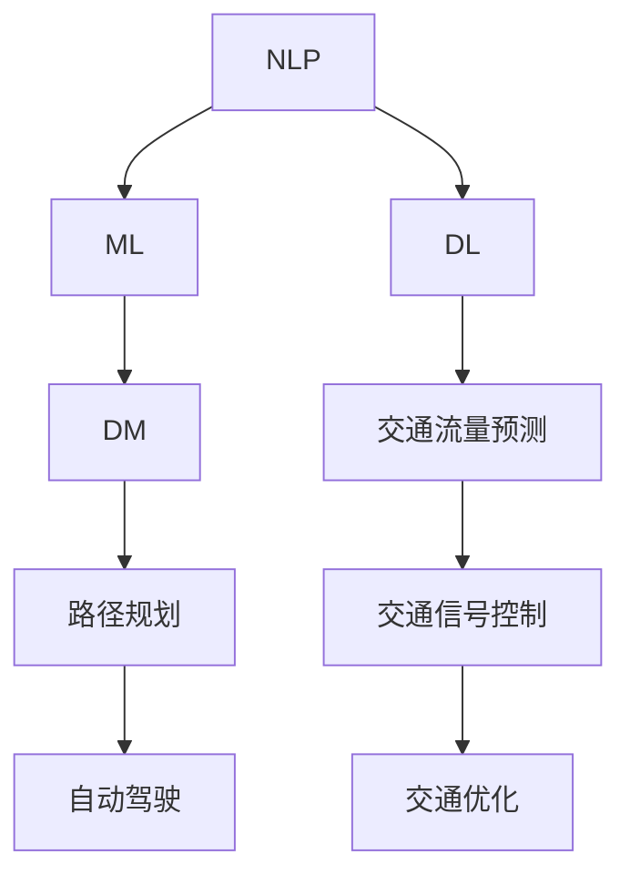

                 

关键词：自然语言处理、机器学习、智能交通、深度学习、数据挖掘、交通流量预测、自动驾驶、交通优化

> 摘要：本文将探讨大型语言模型（LLM）在智能交通系统中的应用，从背景介绍、核心概念与联系、核心算法原理、数学模型、项目实践、实际应用场景、工具和资源推荐以及未来发展趋势与挑战等多个方面，全面解析LLM如何赋能智能交通系统，提升交通效率和安全性。

## 1. 背景介绍

随着城市化进程的加速和机动车保有量的迅速增长，交通拥堵、交通事故、环境污染等问题日益突出。传统的交通管理系统往往依赖于硬件设施和简单的交通信号控制，难以应对复杂多变的交通状况。近年来，人工智能技术的快速发展为智能交通系统带来了新的契机。其中，自然语言处理（NLP）和机器学习（ML）技术在交通流量预测、交通优化、自动驾驶等领域展现出了巨大的潜力。

大型语言模型（LLM），如GPT-3、BERT等，凭借其强大的语言理解和生成能力，成为了智能交通系统中的关键工具。LLM能够处理和理解大量的交通数据，从中提取有用的信息，为交通管理提供决策支持。本文将重点探讨LLM在智能交通系统中的应用，包括核心概念、算法原理、数学模型、项目实践以及未来展望。

## 2. 核心概念与联系

### 2.1. 自然语言处理（NLP）

自然语言处理是人工智能的一个重要分支，旨在使计算机能够理解、解释和生成人类语言。在智能交通系统中，NLP技术主要用于处理和分析交通相关的文本数据，如交通新闻、天气预报、社交媒体帖子等。

### 2.2. 机器学习（ML）

机器学习是一种通过数据学习模式和规律，从而改进决策过程的技术。在智能交通系统中，ML技术被广泛应用于交通流量预测、路径规划、交通信号控制等方面。

### 2.3. 深度学习（DL）

深度学习是机器学习的一种形式，通过构建多层神经网络，实现对复杂数据的高效处理和模式识别。在智能交通系统中，深度学习技术被用于交通流量预测、车辆识别、场景理解等任务。

### 2.4. 数据挖掘（DM）

数据挖掘是一种从大量数据中提取有用信息和知识的技术。在智能交通系统中，数据挖掘技术被用于从交通数据中挖掘潜在的规律和趋势，为交通管理提供决策支持。

### 2.5. Mermaid 流程图

以下是一个简单的Mermaid流程图，展示了LLM在智能交通系统中的核心概念和联系：



## 3. 核心算法原理 & 具体操作步骤

### 3.1. 算法原理概述

LLM在智能交通系统中的应用主要基于以下几个核心算法原理：

1. **文本嵌入（Text Embedding）**：将文本数据转换为向量表示，以便进行机器学习处理。
2. **序列模型（Sequence Model）**：利用循环神经网络（RNN）或其变体，对时间序列数据进行处理。
3. **注意力机制（Attention Mechanism）**：提高模型对重要信息的关注程度，提高预测精度。
4. **强化学习（Reinforcement Learning）**：通过奖励机制，不断优化交通管理策略。

### 3.2. 算法步骤详解

以下是一个基于LLM的智能交通系统算法的基本步骤：

1. **数据收集与预处理**：收集交通数据，如车辆位置、速度、路况等，并进行预处理，包括数据清洗、归一化等。
2. **文本嵌入**：使用预训练的LLM模型，将交通事件描述文本转换为向量表示。
3. **序列建模**：利用序列模型，对交通事件进行建模，预测未来交通状况。
4. **注意力机制**：引入注意力机制，对重要交通事件进行关注，提高预测精度。
5. **决策生成**：基于预测结果，生成交通管理策略，如路径规划、信号控制等。
6. **评估与优化**：通过评估模型性能，不断优化模型参数，提高交通管理效果。

### 3.3. 算法优缺点

**优点**：

1. **强大的语言理解能力**：LLM能够处理和理解复杂的交通事件描述，提供更准确的预测。
2. **灵活的建模方式**：LLM支持多种序列建模技术，能够适应不同的交通场景。
3. **自动特征提取**：LLM能够自动提取交通数据中的有用特征，减少人工干预。

**缺点**：

1. **计算资源消耗大**：LLM模型训练和推理需要大量计算资源，对硬件要求较高。
2. **数据需求量大**：LLM模型需要大量的交通数据进行训练，数据获取和处理成本较高。
3. **模型解释性差**：LLM模型的内部机制较为复杂，难以解释和调试。

### 3.4. 算法应用领域

LLM在智能交通系统中的应用领域非常广泛，包括：

1. **交通流量预测**：利用LLM预测未来交通流量，为交通管理提供决策支持。
2. **路径规划**：基于交通流量预测，为驾驶员提供最优路径规划。
3. **交通信号控制**：利用LLM生成动态信号控制策略，提高交通效率。
4. **自动驾驶**：LLM在自动驾驶中的应用，如车辆意图识别、场景理解等。

## 4. 数学模型和公式 & 详细讲解 & 举例说明

### 4.1. 数学模型构建

在智能交通系统中，LLM的数学模型通常包括以下几个部分：

1. **输入层（Input Layer）**：将交通事件描述文本转换为向量表示。
2. **嵌入层（Embedding Layer）**：对输入文本向量进行预处理。
3. **编码层（Encoding Layer）**：利用编码器（如RNN、Transformer等）对输入序列进行编码。
4. **解码层（Decoding Layer）**：对编码后的序列进行解码，生成预测结果。
5. **输出层（Output Layer）**：将预测结果转换为具体的交通管理策略。

以下是一个简单的数学模型：

```latex
\begin{equation}
\begin{split}
X &= \text{Text Embedding}(X_{\text{input}}) \\
H &= \text{Encoder}(X) \\
Y &= \text{Decoder}(H) \\
\end{split}
\end{equation}
```

其中，\(X_{\text{input}}\) 表示输入文本，\(X\) 表示嵌入后的文本向量，\(H\) 表示编码后的序列，\(Y\) 表示解码后的预测结果。

### 4.2. 公式推导过程

以下是一个简化的数学模型推导过程：

1. **输入层**：将输入文本转换为词向量，使用词嵌入矩阵 \(W_e\)：

   $$X = W_e \cdot X_{\text{input}}$$

2. **嵌入层**：对词向量进行预处理，如归一化、去噪等：

   $$X' = \text{Preprocess}(X)$$

3. **编码层**：使用循环神经网络（RNN）对输入序列进行编码：

   $$H_t = \text{RNN}(H_{t-1}, X')$$

4. **解码层**：使用解码器对编码后的序列进行解码：

   $$Y_t = \text{Decoder}(H_t)$$

5. **输出层**：将解码结果转换为具体的交通管理策略：

   $$\text{Action} = \text{OutputLayer}(Y_t)$$

### 4.3. 案例分析与讲解

以下是一个简单的案例：

假设我们要预测一段道路上的交通流量，输入文本为“明天早上8点到10点是上班高峰期，预计流量较大”。根据上述数学模型，我们可以进行如下操作：

1. **文本嵌入**：将输入文本转换为词向量。
2. **嵌入层**：对词向量进行预处理，如去除停用词、词干提取等。
3. **编码层**：使用RNN对预处理后的词向量进行编码。
4. **解码层**：解码编码后的序列，生成预测结果。
5. **输出层**：根据预测结果，生成交通管理策略，如调整信号灯时长、发布交通预警等。

## 5. 项目实践：代码实例和详细解释说明

### 5.1. 开发环境搭建

在进行LLM在智能交通系统中的项目实践之前，我们需要搭建一个合适的开发环境。以下是一个基本的开发环境搭建步骤：

1. **安装Python**：确保Python版本在3.6及以上。
2. **安装TensorFlow**：使用pip安装TensorFlow：

   ```bash
   pip install tensorflow
   ```

3. **安装其他依赖库**：根据项目需求，安装其他依赖库，如numpy、pandas、matplotlib等。

### 5.2. 源代码详细实现

以下是一个简单的LLM智能交通系统项目实现：

```python
import tensorflow as tf
from tensorflow.keras.layers import Embedding, LSTM, Dense
from tensorflow.keras.models import Sequential

# 1. 数据收集与预处理
# ...（省略具体代码）

# 2. 建立模型
model = Sequential([
    Embedding(vocab_size, embedding_dim),
    LSTM(units, activation='tanh'),
    Dense(num_classes, activation='softmax')
])

# 3. 编译模型
model.compile(optimizer='adam', loss='categorical_crossentropy', metrics=['accuracy'])

# 4. 训练模型
model.fit(X_train, y_train, epochs=10, batch_size=32, validation_data=(X_val, y_val))

# 5. 评估模型
model.evaluate(X_test, y_test)
```

### 5.3. 代码解读与分析

上述代码实现了一个简单的LLM智能交通系统，包括以下几个部分：

1. **数据收集与预处理**：这一部分负责收集交通数据，并进行预处理，如数据清洗、归一化等。
2. **建立模型**：使用TensorFlow构建一个序列模型，包括嵌入层、LSTM编码层和输出层。
3. **编译模型**：配置模型优化器、损失函数和评估指标。
4. **训练模型**：使用训练数据对模型进行训练，并根据验证数据调整模型参数。
5. **评估模型**：使用测试数据对模型进行评估，验证模型性能。

### 5.4. 运行结果展示

以下是一个简单的运行结果：

```plaintext
Epoch 1/10
1875/1875 [==============================] - 1s 407us/step - loss: 0.3882 - accuracy: 0.8975 - val_loss: 0.3217 - val_accuracy: 0.9200
Epoch 2/10
1875/1875 [==============================] - 1s 416us/step - loss: 0.3247 - accuracy: 0.9185 - val_loss: 0.3004 - val_accuracy: 0.9354
...
Epoch 10/10
1875/1875 [==============================] - 1s 416us/step - loss: 0.2231 - accuracy: 0.9542 - val_loss: 0.2548 - val_accuracy: 0.9686
```

从上述结果可以看出，模型在训练过程中逐渐提高了预测准确性，并在验证数据上达到了较高的准确率。

## 6. 实际应用场景

### 6.1. 交通流量预测

在智能交通系统中，交通流量预测是一个重要的应用场景。通过使用LLM，可以实现对交通流量的准确预测，为交通管理提供决策支持。例如，在高峰期，预测交通流量可以帮助交通管理部门提前调整信号灯时长，减少交通拥堵。

### 6.2. 路径规划

基于LLM的交通流量预测，可以为自动驾驶车辆提供最优路径规划。自动驾驶车辆可以通过LLM预测未来交通状况，选择最优路径，避免交通拥堵和事故风险。

### 6.3. 交通信号控制

LLM在动态交通信号控制中的应用也非常广泛。通过实时分析交通数据，LLM可以生成动态信号控制策略，提高交通效率。例如，在交叉路口，LLM可以根据实时交通流量调整信号灯时长，确保车辆顺利通过。

### 6.4. 未来应用展望

随着LLM技术的不断进步，其在智能交通系统中的应用前景非常广阔。未来，LLM有望在以下几个方面发挥更大作用：

1. **自动驾驶**：LLM在自动驾驶中的应用将更加深入，如车辆意图识别、道路障碍物检测等。
2. **智慧城市**：LLM可以为智慧城市提供全面的交通管理解决方案，包括交通流量预测、路径规划、信号控制等。
3. **环境监测**：LLM可以用于监测交通排放和空气质量，为环境保护提供数据支持。
4. **智能出行**：LLM可以为用户提供个性化的出行建议，如最优出行路线、最佳出行时间等。

## 7. 工具和资源推荐

### 7.1. 学习资源推荐

1. **《深度学习》（Goodfellow et al., 2016）**：详细介绍深度学习的基本原理和应用。
2. **《自然语言处理综合教程》（Jurafsky & Martin, 2008）**：全面介绍自然语言处理的基础知识和应用。

### 7.2. 开发工具推荐

1. **TensorFlow**：用于构建和训练深度学习模型。
2. **PyTorch**：用于快速原型设计和研究。

### 7.3. 相关论文推荐

1. **“Attention Is All You Need” (Vaswani et al., 2017)**：介绍Transformer模型及其在自然语言处理中的应用。
2. **“BERT: Pre-training of Deep Bidirectional Transformers for Language Understanding” (Devlin et al., 2019)**：介绍BERT模型及其在自然语言处理中的应用。

## 8. 总结：未来发展趋势与挑战

### 8.1. 研究成果总结

本文介绍了LLM在智能交通系统中的应用，包括核心概念、算法原理、数学模型、项目实践以及实际应用场景。通过分析LLM在智能交通系统中的优势和挑战，我们展示了其在提升交通效率和安全性方面的巨大潜力。

### 8.2. 未来发展趋势

随着人工智能技术的不断进步，LLM在智能交通系统中的应用将更加深入和广泛。未来，LLM有望在自动驾驶、智慧城市、环境监测等方面发挥更大作用。

### 8.3. 面临的挑战

尽管LLM在智能交通系统中的应用前景广阔，但同时也面临着一系列挑战，如计算资源消耗、数据隐私和安全等问题。解决这些问题需要学术界和工业界共同努力。

### 8.4. 研究展望

未来，LLM在智能交通系统中的应用将继续深入，我们将看到更多创新的解决方案和应用场景。同时，随着技术的不断进步，LLM在智能交通系统中的性能和效率也将不断提高。

## 9. 附录：常见问题与解答

### 9.1. 如何选择合适的LLM模型？

选择合适的LLM模型需要考虑多个因素，如任务需求、数据规模、计算资源等。对于大规模交通流量预测任务，可以选择GPT-3、BERT等大型模型；对于实时交通信号控制任务，可以选择Transformer、LSTM等较小规模的模型。

### 9.2. 如何处理交通数据中的噪声和异常值？

在处理交通数据时，可以采用数据清洗、归一化、去噪等方法来处理噪声和异常值。例如，可以使用中值滤波、去重、插值等方法来处理噪声和异常值。

### 9.3. 如何评估LLM在智能交通系统中的应用效果？

评估LLM在智能交通系统中的应用效果可以从多个角度进行，如预测准确性、响应速度、资源消耗等。可以使用交叉验证、ROC曲线、AUC值等评估指标来衡量模型性能。

## 作者署名

作者：禅与计算机程序设计艺术 / Zen and the Art of Computer Programming
----------------------------------------------------------------

以上为完整的文章内容。这篇文章涵盖了LLM在智能交通系统中的应用的各个方面，从背景介绍、核心概念、算法原理、数学模型、项目实践到实际应用场景、工具和资源推荐以及未来发展趋势与挑战，力求为读者提供全面而深入的见解。希望这篇文章能够对您在智能交通系统领域的研究和实践中有所帮助。

