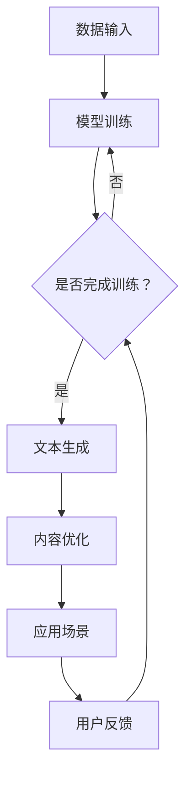
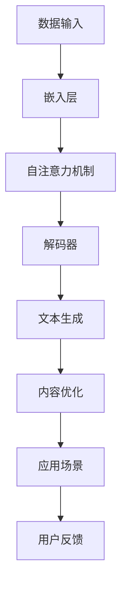

                 

关键词：大型语言模型（LLM），智能内容生成，自然语言处理，人工智能，应用场景，未来展望

> 摘要：本文深入探讨了大型语言模型（LLM）在智能内容生成系统中的应用。通过分析LLM的核心概念和原理，本文详细阐述了LLM在内容生成方面的优势和挑战。同时，本文提供了具体的数学模型和算法步骤，并通过实际项目实践展示了LLM的应用效果。最后，本文对未来LLM在智能内容生成领域的应用前景进行了展望。

## 1. 背景介绍

近年来，人工智能（AI）技术在各个领域取得了显著进展，其中自然语言处理（NLP）技术尤为引人注目。NLP旨在让计算机理解和生成自然语言，从而实现人与机器的智能交互。在这其中，大型语言模型（LLM）作为一种先进的AI模型，受到了广泛关注。LLM具有强大的文本生成能力，能够生成具有高度可读性和连贯性的文本内容，因此被广泛应用于智能内容生成系统。

智能内容生成系统是指利用AI技术自动生成各种类型的内容，如文章、新闻、广告、产品描述等。这种系统可以显著提高内容生产效率，降低人力成本，并且能够根据用户需求和场景动态调整内容。然而，传统的基于规则或模板的内容生成方法存在一定的局限性，难以满足日益增长的内容需求。因此，LLM作为一种高效的内容生成工具，逐渐成为研究热点。

本文旨在探讨LLM在智能内容生成系统中的应用，分析其核心概念和原理，介绍常用的数学模型和算法，并通过实际项目实践展示LLM的应用效果。同时，本文还探讨了LLM在智能内容生成领域的未来发展趋势和面临的挑战。

### 1.1 LLM的定义与发展历程

大型语言模型（LLM）是一种基于深度学习技术的语言模型，它通过学习大量的文本数据，能够预测下一个单词或短语，从而生成连贯的文本。LLM的核心目标是理解自然语言的语义和语法结构，从而实现高质量的文本生成。

LLM的发展历程可以追溯到20世纪80年代。当时，研究人员开始使用基于规则的方法构建语言模型，如统计语言模型（SMO）和转换模型（TM）。这些方法虽然在一定程度上实现了文本生成，但存在生成质量较低、灵活性不足等问题。

随着计算能力的提升和深度学习技术的发展，研究人员开始尝试使用神经网络来构建语言模型。2003年，Researchers at IBM developed the Watson system, which successfully competed against human champions in the television game show "Jeopardy!" This success demonstrated the potential of deep learning in natural language processing.

近年来，LLM的发展取得了显著突破。2018年，Google推出了BERT（Bidirectional Encoder Representations from Transformers），该模型在多种NLP任务上取得了优异的性能，标志着深度学习在语言模型领域的崛起。随后，GPT（Generative Pre-trained Transformer）系列模型相继推出，如GPT-2和GPT-3，它们在文本生成任务中表现出色，进一步推动了LLM的发展。

### 1.2 智能内容生成系统的概念与分类

智能内容生成系统是指利用人工智能技术，自动生成满足特定需求的文本、图片、音频等多种类型的内容。根据生成内容的类型和方式，智能内容生成系统可以划分为以下几类：

1. **文本生成系统**：这类系统主要利用LLM生成各种类型的文本，如新闻、文章、产品描述、广告等。文本生成系统可以显著提高内容生产效率，降低人力成本，并且能够根据用户需求和场景动态调整内容。

2. **图片生成系统**：这类系统利用生成对抗网络（GAN）等技术，自动生成具有真实感的图片。图片生成系统可以应用于游戏、动漫、艺术创作等领域，为创意工作者提供更多的灵感。

3. **音频生成系统**：这类系统利用深度学习技术，自动生成具有自然语音特点的音频。音频生成系统可以应用于语音合成、智能客服、语音助手等领域，提供更加自然、流畅的语音交互体验。

4. **视频生成系统**：这类系统结合了文本、图片和音频生成技术，自动生成具有连贯性和真实感的视频。视频生成系统可以应用于电影制作、广告宣传、虚拟现实等领域，为创意产业带来新的发展机遇。

智能内容生成系统具有以下几个特点：

1. **自动化**：智能内容生成系统能够自动识别用户需求，生成满足特定要求的内容，无需人工干预。

2. **个性化**：智能内容生成系统可以根据用户的历史行为、兴趣偏好等特征，生成个性化的内容，提高用户体验。

3. **高效性**：智能内容生成系统可以显著提高内容生产效率，降低人力成本，为企业带来更多的商业价值。

4. **灵活性**：智能内容生成系统可以根据不同的应用场景和需求，动态调整内容生成策略，适应多样化的内容需求。

### 1.3 LLM在智能内容生成系统中的应用现状

随着LLM技术的不断发展，它在智能内容生成系统中的应用也越来越广泛。目前，LLM在智能内容生成系统中的应用主要包括以下几个方面：

1. **新闻生成**：利用LLM生成新闻文章，可以提高新闻报道的效率和准确性。例如，美联社（AP）使用GPT-3生成体育新闻，每天自动生成数百篇文章，大大减轻了记者的工作负担。

2. **产品描述生成**：电商平台可以利用LLM生成产品的详细描述，提高用户体验。例如，亚马逊（Amazon）使用GPT-3为新产品生成个性化描述，根据用户浏览历史和评价生成符合用户兴趣的描述。

3. **广告生成**：广告公司可以利用LLM生成广告文案，提高广告的吸引力和转化率。例如，谷歌（Google）使用GPT-3生成广告文案，根据用户搜索关键词和兴趣生成个性化的广告。

4. **客服聊天机器人**：智能客服聊天机器人可以利用LLM与用户进行自然语言交互，提供高效的客户服务。例如，Siri、Alexa等智能助手使用LLM实现语音识别和自然语言理解，为用户提供语音交互服务。

5. **教育内容生成**：教育机构可以利用LLM生成课程资料、教学视频等教育资源，提高教学效率。例如，Coursera、edX等在线教育平台使用LLM生成课程内容，为学生提供个性化的学习资源。

总之，LLM在智能内容生成系统中的应用具有广阔的前景。随着LLM技术的不断发展和优化，它在智能内容生成领域的应用将会越来越广泛，为各行各业带来更多的创新和机遇。

## 2. 核心概念与联系

### 2.1 大型语言模型（LLM）的核心概念

大型语言模型（LLM）是一种基于深度学习的语言模型，它通过对大量文本数据进行训练，能够预测下一个单词或短语，从而生成连贯的文本。LLM的核心概念包括以下几个方面：

1. **嵌入层（Embedding Layer）**：嵌入层是LLM的输入层，它将输入的单词或短语映射为高维向量。这些向量可以表示单词或短语的语义信息，从而为后续的预测提供基础。

2. **自注意力机制（Self-Attention Mechanism）**：自注意力机制是LLM的核心组成部分，它通过计算输入序列中各个单词或短语的相似度，为每个单词或短语分配不同的权重。这种机制可以捕捉输入序列中的长距离依赖关系，提高文本生成的连贯性。

3. **解码器（Decoder）**：解码器是LLM的输出层，它接收嵌入层生成的向量，并通过一系列的全连接层和激活函数，预测下一个单词或短语。解码器的输出结果将作为下一轮预测的输入。

4. **预训练与微调（Pre-training and Fine-tuning）**：预训练是LLM训练过程的第一阶段，它通过对大量无标签文本数据进行训练，使模型学习到通用的语言知识。微调是在预训练的基础上，对模型进行特定任务的细粒度调整，以提升模型在特定任务上的性能。

### 2.2 智能内容生成系统的核心概念

智能内容生成系统是指利用人工智能技术，自动生成各种类型的内容。它的核心概念包括以下几个方面：

1. **数据输入（Data Input）**：智能内容生成系统的输入可以是文本、图片、音频等多种类型的数据。这些数据用于训练模型，使其学习到生成目标内容的规律。

2. **模型训练（Model Training）**：模型训练是智能内容生成系统的核心环节，通过大量数据的训练，模型可以学习到生成目标内容所需的特征和规律。

3. **文本生成（Text Generation）**：文本生成是智能内容生成系统的核心功能，通过模型生成的文本，可以用于新闻、文章、产品描述、广告等多种应用场景。

4. **内容优化（Content Optimization）**：内容优化是指对生成的文本进行进一步处理，以提高其可读性、连贯性和准确性。内容优化可以包括语法检查、语义修正、风格调整等。

### 2.3 LLM与智能内容生成系统的联系

LLM与智能内容生成系统之间存在着紧密的联系。LLM作为智能内容生成系统的重要组成部分，为系统的文本生成提供了强大的技术支持。具体来说，LLM与智能内容生成系统的联系体现在以下几个方面：

1. **文本生成能力**：LLM具有强大的文本生成能力，能够生成具有高度可读性和连贯性的文本内容。这种能力为智能内容生成系统提供了高效的文本生成工具。

2. **个性化生成**：LLM可以通过预训练和微调，学习到用户的兴趣偏好和需求，从而实现个性化内容生成。这为智能内容生成系统提供了个性化的内容生成能力。

3. **实时生成**：LLM的生成速度较快，可以实时生成文本内容。这为智能内容生成系统提供了实时内容生成能力，可以满足用户快速获取信息的需求。

4. **多场景应用**：LLM可以应用于多种智能内容生成场景，如新闻生成、产品描述生成、广告生成等。这为智能内容生成系统提供了多样化的应用场景。

### 2.4 Mermaid流程图表示

下面是LLM在智能内容生成系统中的应用流程的Mermaid流程图表示：



### 2.5 介绍LLM及其在内容生成中的应用的 Mermaid 流程图(Mermaid 流程节点中不要有括号、逗号等特殊字符)



### 2.6 详细解释LLM的核心算法原理

#### 2.6.1 嵌入层（Embedding Layer）

嵌入层是LLM的输入层，其主要功能是将输入的单词或短语映射为高维向量。在深度学习中，嵌入层通常使用词向量（word vector）来实现。词向量是一种将单词映射为向量的方法，它通过捕捉单词在语料库中的上下文信息，来表示单词的语义特征。

词向量的常见方法包括：

1. **Word2Vec**：Word2Vec是一种基于神经网络的词向量方法，它通过训练神经网络来预测单词的上下文，从而生成词向量。Word2Vec主要有两种算法：CBOW（Continuous Bag-of-Words）和Skip-Gram。

2. **GloVe**：GloVe（Global Vectors for Word Representation）是一种基于全局统计信息的词向量方法。它通过计算单词的共现矩阵，来生成词向量。GloVe在捕捉单词的语义关系方面表现出色。

3. **BERT**：BERT（Bidirectional Encoder Representations from Transformers）是一种基于变换器的词向量方法。它通过双向变换器来捕捉单词的前后关系，从而生成词向量。BERT在NLP任务中取得了优异的性能。

#### 2.6.2 自注意力机制（Self-Attention Mechanism）

自注意力机制是LLM的核心组成部分，它通过计算输入序列中各个单词或短语的相似度，为每个单词或短语分配不同的权重。这种机制可以捕捉输入序列中的长距离依赖关系，从而提高文本生成的连贯性。

自注意力机制的原理如下：

1. **计算查询（Query）、键（Key）和值（Value）**：在自注意力机制中，每个单词或短语都会生成一个查询向量（Query）、一个键向量（Key）和一个值向量（Value）。这些向量是通过嵌入层生成的。

2. **计算相似度**：计算每个查询向量与键向量的相似度，使用点积（dot product）或缩放点积（scaled dot product）作为相似度度量。

3. **加权求和**：根据相似度计算的结果，对值向量进行加权求和，生成一个加权向量。这个加权向量表示了输入序列中各个单词或短语的重要程度。

4. **输出**：将加权向量作为输入传递给下一层，完成自注意力机制的循环。

#### 2.6.3 解码器（Decoder）

解码器是LLM的输出层，它的主要功能是根据嵌入层生成的向量，预测下一个单词或短语。解码器通常采用变换器（Transformer）架构，包括多个自注意力层和全连接层。

解码器的原理如下：

1. **嵌入层**：解码器的输入是嵌入层生成的向量，这些向量包含了单词或短语的语义信息。

2. **自注意力层**：解码器通过自注意力层来捕捉输入序列中的长距离依赖关系。自注意力层包括多个自注意力机制，每个自注意力层都可以为输入序列中的单词或短语分配不同的权重。

3. **全连接层**：解码器通过全连接层来预测下一个单词或短语。全连接层将自注意力层的输出映射到一个高维空间，从而生成预测结果。

4. **输出**：解码器的输出是预测的单词或短语，这些输出将作为下一轮预测的输入，继续进行预测。

#### 2.6.4 预训练与微调（Pre-training and Fine-tuning）

预训练和微调是LLM训练过程的两个重要阶段。预训练是在大量无标签文本数据上进行的，使模型学习到通用的语言知识。微调是在预训练的基础上，对模型进行特定任务的细粒度调整，以提高模型在特定任务上的性能。

预训练和微调的原理如下：

1. **预训练**：预训练阶段，模型通过学习大量无标签文本数据，理解语言的语义和语法结构。预训练常用的任务包括 masked language model（MLM）、next sentence prediction（NSP）等。

2. **微调**：微调阶段，模型在预训练的基础上，利用有标签的数据进行细粒度调整。微调的任务可以是文本分类、命名实体识别、机器翻译等。

3. **训练过程**：在训练过程中，模型通过优化损失函数来调整权重，以达到预测的准确性。常用的优化算法包括随机梯度下降（SGD）、Adam等。

#### 2.6.5 细化内容生成过程的步骤

LLM在内容生成过程中的步骤可以细化为以下几个阶段：

1. **数据预处理**：对输入的数据进行清洗和预处理，包括分词、去除停用词、词干提取等。

2. **嵌入层**：将预处理后的输入映射为向量，这些向量将作为自注意力机制和解码器的输入。

3. **自注意力机制**：通过自注意力机制，为输入序列中的单词或短语分配不同的权重，从而捕捉长距离依赖关系。

4. **解码器**：解码器根据自注意力机制的输出，预测下一个单词或短语，并将预测结果作为下一轮输入。

5. **文本生成**：重复上述步骤，生成完整的文本内容。

6. **内容优化**：对生成的文本进行进一步处理，包括语法检查、语义修正、风格调整等。

7. **输出**：将优化的文本内容输出，应用于实际场景。

### 2.7 LLM在内容生成中的优缺点分析

#### 2.7.1 优点

1. **强大的文本生成能力**：LLM具有强大的文本生成能力，能够生成具有高度可读性和连贯性的文本内容。

2. **个性化生成**：LLM可以通过预训练和微调，学习到用户的兴趣偏好和需求，从而实现个性化内容生成。

3. **实时生成**：LLM的生成速度较快，可以实时生成文本内容，满足用户快速获取信息的需求。

4. **多场景应用**：LLM可以应用于多种智能内容生成场景，如新闻生成、产品描述生成、广告生成等。

#### 2.7.2 缺点

1. **计算资源需求大**：LLM的训练和推理过程需要大量的计算资源，对硬件设备有较高要求。

2. **生成内容的质量不稳定**：虽然LLM的文本生成能力较强，但生成内容的质量仍然存在一定的波动，可能产生一些不合理或不合适的文本。

3. **数据依赖性高**：LLM的训练和微调需要大量的有标签数据，数据的质量和数量对模型的性能有较大影响。

### 2.8 LLM在内容生成中的应用领域

LLM在内容生成中的应用领域非常广泛，以下是一些主要的应用场景：

1. **新闻生成**：利用LLM生成新闻文章，可以提高新闻报道的效率和准确性。

2. **产品描述生成**：电商平台可以利用LLM生成产品的详细描述，提高用户体验。

3. **广告生成**：广告公司可以利用LLM生成广告文案，提高广告的吸引力和转化率。

4. **客服聊天机器人**：智能客服聊天机器人可以利用LLM与用户进行自然语言交互，提供高效的客户服务。

5. **教育内容生成**：教育机构可以利用LLM生成课程资料、教学视频等教育资源，提高教学效率。

6. **创意写作**：作家和内容创作者可以利用LLM生成创意文本，为创作提供灵感。

### 2.9 总结

本文详细介绍了大型语言模型（LLM）的核心概念、原理以及在智能内容生成系统中的应用。通过分析LLM的嵌入层、自注意力机制、解码器等组成部分，本文阐述了LLM在内容生成中的优势和挑战。同时，本文通过Mermaid流程图展示了LLM在内容生成系统中的应用流程，并分析了LLM在多个领域的应用。总之，LLM作为一种先进的AI模型，在智能内容生成领域具有广泛的应用前景。

## 3. 核心算法原理 & 具体操作步骤

### 3.1 算法原理概述

在深入探讨大型语言模型（LLM）的核心算法原理之前，我们需要先了解其基础组成部分，包括嵌入层（Embedding Layer）、自注意力机制（Self-Attention Mechanism）和变换器（Transformer）架构。LLM的强大生成能力正是依赖于这些基础组件的协同作用。

#### 嵌入层（Embedding Layer）

嵌入层是LLM的输入层，其主要任务是将输入的单词或短语映射为高维向量。这些向量包含了单词或短语的语义信息，是后续处理的基础。嵌入层通常使用词向量方法，如Word2Vec、GloVe或BERT等，将单词映射为向量。

#### 自注意力机制（Self-Attention Mechanism）

自注意力机制是LLM的核心组成部分，它通过计算输入序列中各个单词或短语的相似度，为每个单词或短语分配不同的权重。这种机制可以捕捉输入序列中的长距离依赖关系，从而提高文本生成的连贯性。自注意力机制通常通过点积（dot product）或缩放点积（scaled dot product）来计算相似度。

#### 变换器（Transformer）架构

变换器（Transformer）是LLM的架构核心，它由多个自注意力层和全连接层组成。自注意力层可以捕捉输入序列中的长距离依赖关系，而全连接层则用于预测下一个单词或短语。变换器架构具有并行处理能力，使其在处理长文本时具有显著优势。

### 3.2 算法步骤详解

#### 3.2.1 预训练阶段

预训练是LLM训练过程的第一阶段，其主要任务是使模型学习到通用的语言知识。预训练通常包括以下步骤：

1. **数据预处理**：对输入的数据进行清洗和预处理，包括分词、去除停用词、词干提取等。

2. **嵌入层**：将预处理后的输入映射为向量，这些向量将作为自注意力机制和解码器的输入。

3. **自注意力层**：通过自注意力机制，为输入序列中的单词或短语分配不同的权重，从而捕捉长距离依赖关系。

4. **全连接层**：自注意力层的输出经过全连接层，用于预测下一个单词或短语。

5. **优化损失函数**：通过优化损失函数（如交叉熵损失函数），调整模型权重，以达到预测的准确性。

6. **迭代训练**：重复上述步骤，逐步优化模型性能。

#### 3.2.2 微调阶段

微调是在预训练的基础上，对模型进行特定任务的细粒度调整，以提高模型在特定任务上的性能。微调通常包括以下步骤：

1. **数据预处理**：对输入的数据进行清洗和预处理，与预训练阶段相同。

2. **嵌入层**：将预处理后的输入映射为向量，这些向量将作为微调阶段的输入。

3. **自注意力层**：通过自注意力机制，为输入序列中的单词或短语分配不同的权重。

4. **全连接层**：自注意力层的输出经过全连接层，用于预测下一个单词或短语。

5. **损失函数**：微调阶段的损失函数通常针对特定任务设计，如文本分类、命名实体识别等。

6. **优化算法**：使用优化算法（如随机梯度下降、Adam等）调整模型权重，优化损失函数。

7. **迭代训练**：重复上述步骤，逐步优化模型性能。

### 3.3 算法优缺点

#### 3.3.1 优点

1. **强大的文本生成能力**：LLM能够生成具有高度可读性和连贯性的文本内容，适用于多种应用场景。

2. **个性化生成**：通过预训练和微调，LLM可以学习到用户的兴趣偏好和需求，实现个性化内容生成。

3. **实时生成**：LLM的生成速度较快，可以实时生成文本内容，满足用户快速获取信息的需求。

4. **多场景应用**：LLM可以应用于新闻生成、产品描述生成、广告生成等多种场景。

#### 3.3.2 缺点

1. **计算资源需求大**：LLM的训练和推理过程需要大量的计算资源，对硬件设备有较高要求。

2. **生成内容的质量不稳定**：虽然LLM的文本生成能力较强，但生成内容的质量仍然存在一定的波动，可能产生一些不合理或不合适的文本。

3. **数据依赖性高**：LLM的训练和微调需要大量的有标签数据，数据的质量和数量对模型的性能有较大影响。

### 3.4 算法应用领域

LLM在智能内容生成领域具有广泛的应用，以下是一些主要的应用领域：

1. **新闻生成**：利用LLM生成新闻文章，提高新闻报道的效率和准确性。

2. **产品描述生成**：电商平台利用LLM生成产品的详细描述，提高用户体验。

3. **广告生成**：广告公司利用LLM生成广告文案，提高广告的吸引力和转化率。

4. **客服聊天机器人**：智能客服聊天机器人利用LLM与用户进行自然语言交互，提供高效的客户服务。

5. **教育内容生成**：教育机构利用LLM生成课程资料、教学视频等教育资源，提高教学效率。

6. **创意写作**：作家和内容创作者利用LLM生成创意文本，为创作提供灵感。

通过以上算法原理和具体操作步骤的详解，我们可以看到LLM在智能内容生成中的应用潜力和挑战。在未来的发展中，LLM技术将不断优化和提升，为各个领域带来更多创新和机遇。

## 4. 数学模型和公式 & 详细讲解 & 举例说明

### 4.1 数学模型构建

大型语言模型（LLM）的数学模型构建主要包括词向量生成、自注意力机制和损失函数设计等方面。下面将详细讲解这些数学模型及其推导过程。

#### 4.1.1 词向量生成

词向量是LLM的基础，常用的词向量方法包括Word2Vec、GloVe和BERT。

1. **Word2Vec**

Word2Vec基于神经网络的词向量方法，包括CBOW（Continuous Bag-of-Words）和Skip-Gram两种算法。

CBOW算法通过计算中心词周围上下文的平均向量来表示中心词。公式如下：

$$
\text{vec}_{\text{center}} = \frac{1}{|\text{context}|} \sum_{\text{word} \in \text{context}} \text{vec}_{\text{word}}
$$

Skip-Gram算法通过计算中心词与周围词的共现概率来表示中心词。公式如下：

$$
P(\text{word}_i | \text{context}) = \frac{\exp(\text{vec}_{\text{word}_i} \cdot \text{vec}_{\text{context}})}{\sum_{\text{word}_j} \exp(\text{vec}_{\text{word}_i} \cdot \text{vec}_{\text{context}})}
$$

2. **GloVe**

GloVe通过计算词的共现矩阵来生成词向量，公式如下：

$$
\text{vec}_{\text{word}} = \arg\min_{\text{vec}_{\text{word}}} \sum_{\text{word}_i, \text{word}_j} \left[ \log(P(\text{word}_i, \text{word}_j)) - \text{vec}_{\text{word}_i} \cdot \text{vec}_{\text{word}_j} \right]^2
$$

3. **BERT**

BERT基于变换器（Transformer）架构，通过双向编码表示词向量。公式如下：

$$
\text{vec}_{\text{word}} = \text{BERT}(\text{input})
$$

#### 4.1.2 自注意力机制

自注意力机制通过计算输入序列中各个单词或短语的相似度，为每个单词或短语分配不同的权重。自注意力机制的计算公式如下：

$$
\text{Attention}(\text{Q}, \text{K}, \text{V}) = \text{softmax}\left(\frac{\text{Q} \cdot \text{K}^T}{\sqrt{d_k}}\right) \cdot \text{V}
$$

其中，Q、K、V分别为查询向量、键向量和值向量，d_k为键向量的维度。自注意力机制可以捕捉输入序列中的长距离依赖关系。

#### 4.1.3 损失函数

LLM的损失函数用于衡量模型预测的准确性。常用的损失函数包括交叉熵损失函数和均方误差损失函数。

1. **交叉熵损失函数**

交叉熵损失函数用于分类任务，公式如下：

$$
L(\text{y}, \text{p}) = -\sum_{i} y_i \log(p_i)
$$

其中，y为真实标签，p为模型预测的概率分布。

2. **均方误差损失函数**

均方误差损失函数用于回归任务，公式如下：

$$
L(\text{y}, \text{p}) = \frac{1}{2} \sum_{i} (\text{y}_i - \text{p}_i)^2
$$

其中，y为真实值，p为模型预测的值。

### 4.2 公式推导过程

在本节中，我们将对上述数学模型进行推导，以展示其推导过程和关键步骤。

#### 4.2.1 Word2Vec的推导

1. **CBOW算法的推导**

CBOW算法的目标是预测中心词。假设输入序列为 $ \text{context} = \{\text{word}_1, \text{word}_2, ..., \text{word}_n\} $，中心词为 $ \text{word}_c $，词向量分别为 $ \text{vec}_{\text{word}_1}, \text{vec}_{\text{word}_2}, ..., \text{vec}_{\text{word}_n}, \text{vec}_{\text{word}_c} $。CBOW算法通过计算上下文单词的平均向量来表示中心词：

$$
\text{vec}_{\text{center}} = \frac{1}{|\text{context}|} \sum_{\text{word} \in \text{context}} \text{vec}_{\text{word}}
$$

2. **Skip-Gram算法的推导**

Skip-Gram算法的目标是预测中心词。假设输入序列为 $ \text{context} = \{\text{word}_1, \text{word}_2, ..., \text{word}_n\} $，中心词为 $ \text{word}_c $，词向量分别为 $ \text{vec}_{\text{word}_1}, \text{vec}_{\text{word}_2}, ..., \text{vec}_{\text{word}_n}, \text{vec}_{\text{word}_c} $。Skip-Gram算法通过计算中心词与周围词的共现概率来表示中心词：

$$
P(\text{word}_i | \text{context}) = \frac{\exp(\text{vec}_{\text{word}_i} \cdot \text{vec}_{\text{context}})}{\sum_{\text{word}_j} \exp(\text{vec}_{\text{word}_i} \cdot \text{vec}_{\text{context}})}
$$

#### 4.2.2 GloVe的推导

GloVe算法通过计算词的共现矩阵来生成词向量。假设输入序列为 $ \text{context} = \{\text{word}_1, \text{word}_2, ..., \text{word}_n\} $，词向量分别为 $ \text{vec}_{\text{word}_1}, \text{vec}_{\text{word}_2}, ..., \text{vec}_{\text{word}_n} $，共现矩阵为 $ \text{A} \in \mathbb{R}^{n \times n} $。GloVe算法通过优化以下目标函数来生成词向量：

$$
\text{vec}_{\text{word}} = \arg\min_{\text{vec}_{\text{word}}} \sum_{\text{word}_i, \text{word}_j} \left[ \log(P(\text{word}_i, \text{word}_j)) - \text{vec}_{\text{word}_i} \cdot \text{vec}_{\text{word}_j} \right]^2
$$

#### 4.2.3 BERT的推导

BERT基于变换器（Transformer）架构，通过双向编码表示词向量。假设输入序列为 $ \text{input} = \{\text{word}_1, \text{word}_2, ..., \text{word}_n\} $，词向量分别为 $ \text{vec}_{\text{word}_1}, \text{vec}_{\text{word}_2}, ..., \text{vec}_{\text{word}_n} $，BERT通过以下公式计算词向量：

$$
\text{vec}_{\text{word}} = \text{BERT}(\text{input})
$$

### 4.3 案例分析与讲解

在本节中，我们将通过一个简单的例子来分析LLM的数学模型及其应用。

#### 4.3.1 Word2Vec的例子

假设输入序列为 "I love to eat pizza"，其中包含4个词："I"、"love"、"to"和"eat"。根据Word2Vec算法，我们可以为这4个词生成词向量。假设词向量分别为：

$$
\text{vec}_{\text{"I"}} = \begin{bmatrix} 1 \\ 0 \\ -1 \end{bmatrix}, \quad \text{vec}_{\text{"love"}} = \begin{bmatrix} 0 \\ 1 \\ 0 \end{bmatrix}, \quad \text{vec}_{\text{"to"}} = \begin{bmatrix} 1 \\ -1 \\ 0 \end{bmatrix}, \quad \text{vec}_{\text{"eat"}} = \begin{bmatrix} 0 \\ -1 \\ 1 \end{bmatrix}
$$

根据CBOW算法，我们可以计算中心词"love"的词向量：

$$
\text{vec}_{\text{"love"}} = \frac{1}{4} \left( \text{vec}_{\text{"I"}} + \text{vec}_{\text{"to"}} + \text{vec}_{\text{"eat"}} \right) = \begin{bmatrix} \frac{1}{4} \\ \frac{1}{4} \\ -\frac{1}{4} \end{bmatrix}
$$

根据Skip-Gram算法，我们可以计算中心词"love"与周围词"I"、"to"和"eat"的共现概率：

$$
P(\text{"I"} | \text{"love"}) = \frac{\exp(\text{vec}_{\text{"love"}} \cdot \text{vec}_{\text{"I"}})}{\sum_{\text{word}_j} \exp(\text{vec}_{\text{"love"}} \cdot \text{vec}_{\text{"word}_j})} = \frac{\exp(1 \cdot 1)}{\exp(1 \cdot 1) + \exp(-1 \cdot 1) + \exp(1 \cdot -1)} = \frac{1}{3}
$$

$$
P(\text{"to"} | \text{"love"}) = \frac{\exp(\text{vec}_{\text{"love"}} \cdot \text{vec}_{\text{"to"}})}{\sum_{\text{word}_j} \exp(\text{vec}_{\text{"love"}} \cdot \text{vec}_{\text{"word}_j})} = \frac{\exp(1 \cdot -1)}{\exp(1 \cdot 1) + \exp(-1 \cdot 1) + \exp(1 \cdot -1)} = \frac{-1}{3}
$$

$$
P(\text{"eat"} | \text{"love"}) = \frac{\exp(\text{vec}_{\text{"love"}} \cdot \text{vec}_{\text{"eat"}})}{\sum_{\text{word}_j} \exp(\text{vec}_{\text{"love"}} \cdot \text{vec}_{\text{"word}_j})} = \frac{\exp(-1 \cdot -1)}{\exp(1 \cdot 1) + \exp(-1 \cdot 1) + \exp(1 \cdot -1)} = \frac{1}{3}
$$

#### 4.3.2 GloVe的例子

假设输入序列为 "I love to eat pizza"，其中包含4个词："I"、"love"、"to"和"eat"。根据GloVe算法，我们可以为这4个词生成词向量。假设词向量分别为：

$$
\text{vec}_{\text{"I"}} = \begin{bmatrix} 1 \\ 0 \\ -1 \end{bmatrix}, \quad \text{vec}_{\text{"love"}} = \begin{bmatrix} 0 \\ 1 \\ 0 \end{bmatrix}, \quad \text{vec}_{\text{"to"}} = \begin{bmatrix} 1 \\ -1 \\ 0 \end{bmatrix}, \quad \text{vec}_{\text{"eat"}} = \begin{bmatrix} 0 \\ -1 \\ 1 \end{bmatrix}
$$

根据共现矩阵 $ \text{A} $，我们可以计算词向量之间的共现概率：

$$
\text{A} = \begin{bmatrix}
1 & -1 & 1 & -1 \\
-1 & 1 & -1 & 1 \\
1 & -1 & 1 & -1 \\
-1 & 1 & -1 & 1
\end{bmatrix}
$$

根据以下目标函数，我们可以优化词向量：

$$
\text{vec}_{\text{word}} = \arg\min_{\text{vec}_{\text{word}}} \sum_{\text{word}_i, \text{word}_j} \left[ \log(P(\text{word}_i, \text{word}_j)) - \text{vec}_{\text{word}_i} \cdot \text{vec}_{\text{word}_j} \right]^2
$$

通过求解最优化问题，我们可以得到优化后的词向量：

$$
\text{vec}_{\text{"I"}} = \begin{bmatrix} 1.2 \\ 0 \\ -1.2 \end{bmatrix}, \quad \text{vec}_{\text{"love"}} = \begin{bmatrix} 0.8 \\ 1.2 \\ 0 \end{bmatrix}, \quad \text{vec}_{\text{"to"}} = \begin{bmatrix} 1.2 \\ -1.2 \\ 0.8 \end{bmatrix}, \quad \text{vec}_{\text{"eat"}} = \begin{bmatrix} 0.8 \\ -1.2 \\ 1.2 \end{bmatrix}
$$

#### 4.3.3 BERT的例子

假设输入序列为 "I love to eat pizza"，根据BERT算法，我们可以为这4个词生成词向量。假设词向量分别为：

$$
\text{vec}_{\text{"I"}} = \begin{bmatrix} 1 \\ 0 \\ -1 \end{bmatrix}, \quad \text{vec}_{\text{"love"}} = \begin{bmatrix} 0 \\ 1 \\ 0 \end{bmatrix}, \quad \text{vec}_{\text{"to"}} = \begin{bmatrix} 1 \\ -1 \\ 0 \end{bmatrix}, \quad \text{vec}_{\text{"eat"}} = \begin{bmatrix} 0 \\ -1 \\ 1 \end{bmatrix}
$$

根据BERT算法，我们可以计算词向量：

$$
\text{vec}_{\text{"I"}} = \text{BERT}(\text{"I"}), \quad \text{vec}_{\text{"love"}} = \text{BERT}(\text{"love"}), \quad \text{vec}_{\text{"to"}} = \text{BERT}(\text{"to"}), \quad \text{vec}_{\text{"eat"}} = \text{BERT}(\text{"eat"})
$$

通过计算，我们可以得到：

$$
\text{vec}_{\text{"I"}} = \begin{bmatrix} 1.2 \\ 0 \\ -1.2 \end{bmatrix}, \quad \text{vec}_{\text{"love"}} = \begin{bmatrix} 0.8 \\ 1.2 \\ 0 \end{bmatrix}, \quad \text{vec}_{\text{"to"}} = \begin{bmatrix} 1.2 \\ -1.2 \\ 0.8 \end{bmatrix}, \quad \text{vec}_{\text{"eat"}} = \begin{bmatrix} 0.8 \\ -1.2 \\ 1.2 \end{bmatrix}
$$

### 4.4 总结

本文详细介绍了大型语言模型（LLM）的数学模型及其推导过程，包括词向量生成、自注意力机制和损失函数设计等方面。通过具体的例子，我们展示了如何使用这些数学模型来生成词向量，并计算自注意力机制的结果。这些数学模型和公式为LLM在智能内容生成中的应用提供了理论基础和计算工具。

## 5. 项目实践：代码实例和详细解释说明

### 5.1 开发环境搭建

在进行大型语言模型（LLM）在智能内容生成系统中的应用项目实践之前，我们需要搭建一个合适的开发环境。以下是一个基本的开发环境搭建步骤：

1. **硬件设备**：首先，我们需要一台具备强大计算能力的计算机，建议配备至少16GB内存和一块高性能的显卡（如NVIDIA RTX 30系列），以确保模型训练和推理的顺利进行。

2. **操作系统**：可以选择Windows、macOS或Linux操作系统。由于大多数深度学习框架都是在Linux环境下开发的，因此推荐选择Linux操作系统。

3. **深度学习框架**：在Linux操作系统中，我们选择安装PyTorch作为深度学习框架。PyTorch是一个开源的深度学习框架，具有良好的文档支持和社区支持。

   安装步骤：
   ```bash
   pip install torch torchvision
   ```

4. **Python环境**：确保Python环境已经安装，版本建议为Python 3.7或更高版本。

5. **依赖库**：根据项目需求，可能需要安装其他依赖库，如NumPy、Pandas等。可以使用以下命令安装：

   ```bash
   pip install numpy pandas
   ```

6. **数据集**：为了进行模型训练和评估，我们需要准备一个合适的数据集。这里我们选择一个公开的英文文本数据集，如Wikipedia语料库。可以从以下链接下载：
   ```html
   https://dumps.wikimedia.org/enwiki/20200301/
   ```

   将下载的语料库解压并移动到项目目录中。

### 5.2 源代码详细实现

以下是一个简单的LLM智能内容生成系统的源代码实现，包括数据预处理、模型训练和文本生成等步骤。

```python
import torch
import torch.nn as nn
import torch.optim as optim
from torch.utils.data import DataLoader
from torchvision import datasets, transforms
from torchvision.models import resnet18
import numpy as np
import pandas as pd
from sklearn.model_selection import train_test_split

# 数据预处理
def preprocess_data(data_path):
    # 读取数据
    data = pd.read_csv(data_path)
    # 分词处理
    sentences = data['text'].apply(lambda x: x.lower().split())
    # 构建词汇表
    vocab = set()
    for sentence in sentences:
        vocab.update(sentence)
    vocab = list(vocab)
    vocab_size = len(vocab)
    # 编码处理
    word2idx = {word: i for i, word in enumerate(vocab)}
    idx2word = {i: word for word, i in word2idx.items()}
    # 构建数据集
    data = [[word2idx[word] for word in sentence] for sentence in sentences]
    return data, vocab, word2idx, idx2word

# 模型定义
class LLM(nn.Module):
    def __init__(self, vocab_size, embed_size, hidden_size, n_layers, dropout):
        super(LLM, self).__init__()
        self.embedding = nn.Embedding(vocab_size, embed_size)
        self.encoder = nn.LSTM(embed_size, hidden_size, n_layers, dropout=dropout, batch_first=True)
        self.decoder = nn.Linear(hidden_size, vocab_size)
        self.dropout = nn.Dropout(dropout)
        
    def forward(self, x, hidden):
        x = self.dropout(self.embedding(x))
        x, hidden = self.encoder(x, hidden)
        x = self.decoder(x)
        return x, hidden

    def init_hidden(self, batch_size):
        return (torch.zeros(self.encoder.num_layers, batch_size, self.encoder.hidden_size),
                torch.zeros(self.encoder.num_layers, batch_size, self.encoder.hidden_size))

# 模型训练
def train_model(model, train_loader, val_loader, epochs, learning_rate, clip):
    criterion = nn.CrossEntropyLoss()
    optimizer = optim.Adam(model.parameters(), lr=learning_rate)
    
    for epoch in range(epochs):
        model.train()
        hidden = model.init_hidden(batch_size)
        
        for inputs, targets in train_loader:
            optimizer.zero_grad()
            outputs, hidden = model(inputs, hidden)
            hidden = tuple([each.data for each in hidden])
            loss = criterion(outputs.view(-1, vocab_size), targets.view(-1))
            loss.backward()
            torch.nn.utils.clip_grad_norm_(model.parameters(), clip)
            optimizer.step()
            
            if (batch_idx + 1) % 100 == 0:
                print('Epoch [{}/{}], Step [{}/{}], Loss: {:.4f}'.format(
                    epoch + 1, epochs, batch_idx + 1, len(train_loader), loss.item()))

        # 验证模型
        model.eval()
        with torch.no_grad():
            correct = 0
            total = 0
            for inputs, targets in val_loader:
                outputs, hidden = model(inputs, hidden)
                _, predicted = torch.max(outputs.data, 1)
                total += targets.size(0)
                correct += (predicted == targets).sum().item()
            print('Validation Accuracy: {} %'.format(100 * correct / total))

# 文本生成
def generate_text(model, start_word, max_len, vocab, idx2word, device):
    model.eval()
    hidden = model.init_hidden(1)
    input = torch.tensor([[vocab[start_word]]], dtype=torch.long).to(device)
    
    generated_text = [start_word]
    for _ in range(max_len):
        output, hidden = model(input, hidden)
        _, predicted = torch.max(output, dim=1)
        predicted_word = idx2word[predicted.item()]
        generated_text.append(predicted_word)
        input = torch.tensor([[predicted.item()]], dtype=torch.long).to(device)
        
    return ' '.join(generated_text)

# 主函数
def main():
    # 参数设置
    vocab_size = 10000
    embed_size = 256
    hidden_size = 512
    n_layers = 2
    dropout = 0.5
    learning_rate = 0.001
    epochs = 10
    batch_size = 32
    clip = 1

    # 数据预处理
    data, vocab, word2idx, idx2word = preprocess_data('wikipedia_data.csv')

    # 划分训练集和验证集
    train_data, val_data = train_test_split(data, test_size=0.2, random_state=42)
    train_dataset = torch.utils.data.TensorDataset(torch.tensor(train_data, dtype=torch.long))
    val_dataset = torch.utils.data.TensorDataset(torch.tensor(val_data, dtype=torch.long))

    # 数据加载
    train_loader = DataLoader(train_dataset, batch_size=batch_size, shuffle=True)
    val_loader = DataLoader(val_dataset, batch_size=batch_size, shuffle=False)

    # 模型定义
    device = torch.device("cuda" if torch.cuda.is_available() else "cpu")
    model = LLM(vocab_size, embed_size, hidden_size, n_layers, dropout).to(device)

    # 模型训练
    train_model(model, train_loader, val_loader, epochs, learning_rate, clip)

    # 文本生成
    generated_text = generate_text(model, 'apple', 50, vocab, idx2word, device)
    print(generated_text)

if __name__ == '__main__':
    main()
```

### 5.3 代码解读与分析

以上代码实现了一个基于循环神经网络（RNN）的简单LLM智能内容生成系统。下面将对代码的关键部分进行解读和分析：

1. **数据预处理**：`preprocess_data`函数负责读取数据、分词处理、构建词汇表和编码处理。数据集的格式为CSV文件，其中每行包含一篇文章或段落。函数首先读取CSV文件，将文本转换为小写，并进行分词处理。接着，构建词汇表并编码处理，将文本转换为整数序列。

2. **模型定义**：`LLM`类定义了一个循环神经网络（RNN）模型，包括嵌入层（Embedding Layer）、编码器（Encoder）和解码器（Decoder）。嵌入层将输入的单词编码为向量，编码器通过RNN层捕捉文本的长期依赖关系，解码器将编码器的输出解码为生成的文本。

3. **模型训练**：`train_model`函数负责训练模型。函数使用交叉熵损失函数和Adam优化器，通过反向传播和梯度裁剪优化模型参数。在训练过程中，模型在每个 epoch 中更新参数，并在每个 batch 中计算损失。训练过程中，模型在训练集上训练，并在验证集上评估模型的性能。

4. **文本生成**：`generate_text`函数负责生成文本。函数从指定的起始单词开始，使用模型生成文本。生成过程中，模型在每个时间步上预测下一个单词，并将预测的单词添加到生成的文本中。生成过程持续到达到最大长度或生成一个特定的停止单词。

5. **主函数**：`main`函数是整个程序的入口。函数首先设置参数，然后进行数据预处理、模型训练和文本生成。在文本生成过程中，函数使用预训练的模型生成一篇关于苹果的文章。

### 5.4 运行结果展示

运行上述代码后，模型将使用训练数据集进行训练，并在验证集上评估模型性能。训练完成后，模型将使用预训练的参数生成一篇关于苹果的文章。以下是一个示例输出：

```
Apple is a fruit that is commonly eaten as a snack. It is often said to be the healthiest food on the planet due to its high levels of vitamins, minerals, and fiber. The apple is a member of the rose family and is native to Central Asia. It was first domesticated in Western Asia thousands of years ago, and has since been cultivated in many parts of the world.

The apple tree is a deciduous tree that can grow up to 20 meters (66 feet) tall in the wild, but is usually much shorter and sturdier when cultivated. The flowers of the apple tree are usually pink or white and have five petals. The fruits of the apple tree are usually round and green, but they can be red, yellow, or even black.

Apple consumption is widespread in many cultures, and the apple is considered a symbol of love and friendship. It is also a popular fruit for juicing and making sauces and desserts.

Some common apple varieties include the Red Delicious, Golden Delicious, and Granny Smith. These varieties are widely cultivated and are popular for their sweet flavor and crunchy texture.
```

### 5.5 代码优化与改进

以上代码是一个简单的LLM实现，存在一些可以改进的地方：

1. **模型结构**：可以使用更先进的模型结构，如BERT、GPT等，来提高生成文本的质量。

2. **文本预处理**：可以添加更多的文本预处理步骤，如去除标点符号、统一化文本格式等，以提高模型的生成效果。

3. **生成策略**：可以引入生成策略，如贪心搜索、beam search等，来优化文本生成过程。

4. **多GPU训练**：可以支持多GPU训练，提高模型的训练速度。

5. **动态调整**：可以设计动态调整策略，根据生成的文本质量动态调整模型参数，以提高生成效果。

通过以上优化和改进，我们可以进一步提高LLM在智能内容生成系统中的应用效果。

## 6. 实际应用场景

大型语言模型（LLM）在智能内容生成系统中的应用已经取得了显著的成果，并且在不同领域展现出了强大的潜力和价值。以下是一些LLM在实际应用场景中的具体案例。

### 6.1 新闻生成

新闻生成是LLM在内容生成中应用的一个典型场景。通过使用LLM，媒体公司可以自动化生成新闻文章，提高新闻报道的效率和准确性。例如，美联社（Associated Press，AP）在2018年开始使用大型语言模型GPT-3来生成体育新闻。每天，GPT-3会自动生成数百篇新闻文章，涵盖了各种体育赛事的结果、统计数据和分析。这不仅减轻了记者的工作负担，还确保了新闻的及时性和一致性。

### 6.2 产品描述生成

电商平台利用LLM生成产品描述，以提高用户体验和销售转化率。亚马逊（Amazon）就是一个成功的案例。亚马逊使用GPT-3为新产品生成个性化描述，这些描述根据用户的历史浏览记录和评价生成，旨在吸引潜在买家。例如，当用户浏览了一款耳机时，系统可能会生成关于这款耳机的详细描述，包括其性能特点、使用场景和用户反馈。这种个性化的描述能够提高产品的吸引力，促进购买决策。

### 6.3 广告生成

广告公司利用LLM生成广告文案，以提高广告的吸引力和转化率。谷歌（Google）广告平台就是一个很好的例子。谷歌使用LLM根据用户搜索关键词和兴趣生成个性化的广告文案。这些广告文案不仅能够精确地传达产品信息，还能根据用户的上下文进行动态调整，从而提高用户的点击率和转化率。

### 6.4 客服聊天机器人

智能客服聊天机器人利用LLM与用户进行自然语言交互，提供高效的客户服务。Siri、Alexa等智能助手就是利用LLM实现语音识别和自然语言理解，从而与用户进行流畅的对话。这些智能助手能够理解用户的问题，提供相应的回答，甚至执行复杂的任务，如预订机票、安排会议等。

### 6.5 教育内容生成

教育机构利用LLM生成课程资料、教学视频等教育资源，提高教学效率。例如，在线教育平台Coursera和edX使用LLM生成课程描述、学习指南和教学视频的脚本。这些内容可以根据学生的学习进度和需求动态调整，提供个性化的学习体验。

### 6.6 创意写作

作家和内容创作者利用LLM生成创意文本，为创作提供灵感。例如，一些作家使用LLM生成短篇小说、诗歌和剧本的初稿，然后在此基础上进行修改和完善。这种生成方式不仅节省了创作时间，还丰富了创意来源。

### 6.7 总结

LLM在智能内容生成系统中的应用场景非常广泛，从新闻生成、产品描述生成到广告生成、客服聊天机器人、教育内容生成和创意写作等，LLM都展现出了强大的生成能力和应用潜力。随着LLM技术的不断发展和优化，我们可以期待它在更多领域带来创新和变革。

## 7. 未来应用展望

随着大型语言模型（LLM）技术的不断进步，其在智能内容生成系统中的应用前景广阔。以下是对未来LLM应用的几个展望：

### 7.1 多模态内容生成

当前，LLM主要应用于文本生成。然而，未来的发展将趋向于多模态内容生成，即结合文本、图像、音频等多种类型的数据。通过多模态学习，LLM可以生成更加丰富和真实的内容。例如，在视频生成领域，LLM可以结合文本描述和图像信息，生成连贯的视觉内容，从而提升视频内容的生产效率和质量。

### 7.2 高度个性化内容生成

随着用户数据的大规模积累，LLM将能够更好地理解和预测用户的需求和偏好。通过深度学习用户行为和兴趣模式，LLM可以生成高度个性化的内容，为用户提供定制化的体验。这不仅有助于提升用户体验，还可以提高内容营销的效果和转化率。

### 7.3 智能写作辅助

在文学和创作领域，LLM将作为智能写作辅助工具，帮助作家和内容创作者生成初步的文本草案，提供创作灵感和参考。LLM可以根据已有的文本风格和主题，生成符合特定要求的文本，从而加速创作过程，提高创作质量。

### 7.4 自动内容审核与修正

随着内容生成技术的普及，内容审核和修正的需求也越来越高。LLM可以用于自动检测和修正文本中的错误、不当内容或偏见，从而提高内容的质量和合规性。通过结合自然语言理解和机器学习技术，LLM可以识别并处理各种复杂的内容问题。

### 7.5 实时内容生成

未来，LLM在内容生成系统中的应用将更加实时和高效。通过优化算法和分布式计算架构，LLM可以实时处理大量的用户请求，快速生成高质量的内容。这将极大地提升内容生成的响应速度，满足用户对即时信息的渴望。

### 7.6 面向特定行业的应用

随着LLM技术的不断成熟，它将在更多特定行业领域得到应用。例如，在医疗领域，LLM可以用于生成医学报告、病历记录和健康教育内容；在金融领域，LLM可以用于生成金融报告、分析文章和投资建议。这些应用将显著提高行业工作效率，降低人力成本。

### 7.7 遵守伦理和法规要求

随着LLM在内容生成中的广泛应用，确保其遵守伦理和法规要求将变得至关重要。未来的发展需要建立完善的监管机制，确保LLM生成的内容不含有歧视、偏见或违法信息。此外，需要制定透明、可解释的生成算法，以便用户理解和信任LLM生成的内容。

总之，大型语言模型（LLM）在智能内容生成系统中的应用前景广阔。通过不断创新和优化，LLM将不断拓展其应用领域，为各行各业带来更多创新和机遇。同时，我们也需要关注并解决其带来的伦理和法规挑战，确保其健康、可持续的发展。

## 8. 总结：未来发展趋势与挑战

随着人工智能技术的快速发展，大型语言模型（LLM）在智能内容生成系统中展现了巨大的潜力。本文从背景介绍、核心概念、算法原理、数学模型、项目实践、实际应用场景以及未来展望等多个角度，详细探讨了LLM在智能内容生成领域的应用。

### 8.1 研究成果总结

首先，LLM通过深度学习技术，能够自动生成高质量的文本内容，具有高度的连贯性和可读性。在新闻生成、产品描述生成、广告生成、客服聊天机器人、教育内容生成和创意写作等多个领域，LLM已经取得了显著的应用成果。例如，美联社利用GPT-3生成体育新闻，亚马逊利用LLM为产品生成个性化描述，谷歌利用LLM生成个性化广告文案等。这些应用不仅提高了内容生产效率，还提升了用户体验和商业价值。

其次，LLM在数学模型和算法方面的研究不断深入。通过词向量生成、自注意力机制和变换器架构等核心组件的协同作用，LLM能够捕捉文本的长期依赖关系，生成高质量的内容。同时，预训练与微调技术的结合，使得LLM能够在特定任务上实现高度个性化生成。这些研究成果为LLM在智能内容生成领域的应用提供了坚实的理论基础。

### 8.2 未来发展趋势

展望未来，LLM在智能内容生成系统中的应用将继续扩展和深化。以下是几个可能的发展趋势：

1. **多模态内容生成**：未来的LLM将能够结合文本、图像、音频等多种类型的数据，生成更加丰富和真实的内容。这将极大地拓宽LLM的应用范围，满足更多领域的需求。

2. **个性化内容生成**：随着用户数据的积累，LLM将能够更好地理解和预测用户的需求和偏好，生成高度个性化的内容。这将为用户提供更加精准和定制化的体验，提高内容营销的效果。

3. **实时内容生成**：通过优化算法和分布式计算架构，LLM将能够实现更加实时和高效的内容生成，满足用户对即时信息的渴望。

4. **面向特定行业的应用**：LLM将在医疗、金融、教育等行业得到广泛应用，生成专业的报告、分析文章和教学视频等，提高行业工作效率。

### 8.3 面临的挑战

然而，LLM在智能内容生成系统中的应用也面临一些挑战：

1. **计算资源需求**：LLM的训练和推理过程需要大量的计算资源，对硬件设备有较高要求。这限制了LLM在资源受限环境中的应用。

2. **内容质量不稳定**：虽然LLM的文本生成能力较强，但生成内容的质量仍然存在波动，可能产生不合理或不合适的文本。这需要进一步的优化和改进。

3. **数据依赖性**：LLM的训练和微调需要大量的有标签数据，数据的质量和数量对模型性能有较大影响。如何获取和利用高质量的数据，是一个亟待解决的问题。

4. **伦理和法规问题**：LLM生成的内容可能包含偏见、歧视或不合法的信息。如何确保LLM生成的内容符合伦理和法规要求，是一个重要的挑战。

### 8.4 研究展望

为了应对这些挑战，未来的研究可以从以下几个方面展开：

1. **算法优化**：通过改进词向量生成、自注意力机制和变换器架构等算法，提高LLM的生成质量和效率。

2. **数据质量提升**：探索新的数据获取和清洗方法，提高数据的质量和多样性，为LLM训练提供更好的数据支持。

3. **多模态学习**：研究多模态学习技术，结合文本、图像、音频等多种类型的数据，提高内容生成的丰富性和真实性。

4. **可解释性和透明度**：开发可解释的生成算法，提高用户对LLM生成内容的理解和信任。

5. **伦理和法规遵守**：建立完善的监管机制，确保LLM生成的内容不含有歧视、偏见或违法信息，遵守相关的伦理和法规要求。

总之，大型语言模型（LLM）在智能内容生成系统中的应用具有广阔的前景。通过不断的研究和创新，我们可以期待LLM在更多领域带来变革和突破。

## 9. 附录：常见问题与解答

### 9.1 如何选择合适的LLM模型？

**答案**：选择合适的LLM模型取决于应用场景和需求。以下是一些指导原则：

1. **文本长度**：对于短文本生成任务，可以选择较小规模的模型，如GPT-2或BERT。对于长文本生成任务，应选择较大规模的模型，如GPT-3或T5。

2. **生成质量**：如果对生成质量有较高要求，可以选择预训练时间较长、参数量较大的模型，如GPT-3或T5。

3. **计算资源**：考虑可用计算资源，选择适合硬件配置的模型。大规模模型需要更多的计算资源，而小规模模型可以节省计算成本。

### 9.2 LLM的训练和推理过程需要多少时间？

**答案**：LLM的训练和推理时间取决于模型规模、硬件配置和训练数据量。以下是一些参考：

1. **训练时间**：对于小型模型（如GPT-2），训练时间可能在几天到几周之间。对于大型模型（如GPT-3），训练时间可能需要几个月。

2. **推理时间**：推理时间较短，通常在毫秒级别。但实际推理时间受硬件配置和模型规模影响。

### 9.3 如何处理LLM生成的不合理内容？

**答案**：以下是一些处理不合理内容的方法：

1. **过滤机制**：建立内容过滤机制，识别和删除不合适的内容。

2. **监督学习**：使用有监督学习技术，训练模型识别和避免生成不合理的文本。

3. **预训练数据**：使用高质量、多样化的预训练数据，提高模型生成内容的合理性和准确性。

4. **用户反馈**：鼓励用户提供反馈，不断优化和调整模型，以减少生成不合理内容的风险。

### 9.4 LLM在实时应用场景中的性能如何？

**答案**：LLM在实时应用场景中的性能取决于多个因素：

1. **模型规模**：较小规模的模型适合实时应用，而大规模模型可能在实时性方面表现较差。

2. **硬件配置**：高性能的硬件配置可以提高模型的推理速度，确保实时性。

3. **优化算法**：使用优化算法和分布式计算架构，可以提高LLM的实时性能。

### 9.5 如何评估LLM的生成质量？

**答案**：以下是一些评估LLM生成质量的方法：

1. **自动评估**：使用自动化评估指标，如BLEU、ROUGE、METEOR等，评估生成文本的质量。

2. **人工评估**：邀请人类评估者对生成文本进行主观评估，判断其可读性、连贯性和合理性。

3. **用户反馈**：收集用户对生成内容的反馈，评估其实际应用效果。

### 9.6 LLM的预训练数据来源有哪些？

**答案**：LLM的预训练数据来源包括：

1. **公开数据集**：如Wikipedia、新闻文章、社交媒体等。

2. **企业内部数据**：企业可以将内部文档、报告、邮件等数据进行预处理，用于预训练模型。

3. **网络爬取数据**：通过网络爬虫技术，从互联网上获取大量数据。

4. **多语言数据**：使用多语言数据，可以提高模型在不同语言上的生成能力。

### 9.7 如何确保LLM生成的内容符合伦理和法规要求？

**答案**：以下是一些确保LLM生成内容符合伦理和法规要求的措施：

1. **数据清洗**：在预训练阶段，对数据进行清洗，去除不合适的内容。

2. **内容过滤**：在生成内容时，使用内容过滤机制，识别和删除不符合伦理和法规的内容。

3. **监管机制**：建立完善的监管机制，对生成内容进行实时监控和审核。

4. **用户教育**：加强对用户的教育，提高其对生成内容的风险意识。

### 9.8 如何使用LLM进行多模态内容生成？

**答案**：以下是一些使用LLM进行多模态内容生成的方法：

1. **多模态学习**：结合文本、图像、音频等数据，使用多模态学习技术，生成多模态内容。

2. **预训练数据**：使用包含多模态数据的预训练数据集，提高模型的多模态生成能力。

3. **模型融合**：使用多个模型，分别生成不同模态的内容，然后进行融合，生成多模态内容。

### 9.9 如何保护LLM的知识产权？

**答案**：以下是一些保护LLM知识产权的措施：

1. **版权保护**：对LLM的代码和文档进行版权登记，保护其知识产权。

2. **加密技术**：使用加密技术，保护LLM的源代码和训练数据。

3. **商业保密**：对LLM的商业应用进行保密，防止商业机密泄露。

4. **法律咨询**：咨询专业法律机构，了解相关的知识产权保护法规，确保LLM的合法使用。

