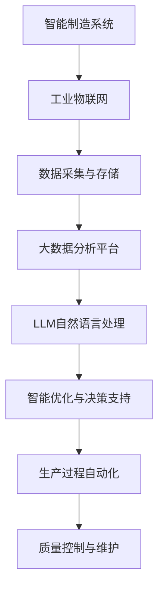

                 

关键词：大型语言模型（LLM），智能制造，工业自动化，人工智能，机器学习，数据分析，预测维护，智能优化

> 摘要：本文探讨了大型语言模型（LLM）在智能制造领域中的应用前景。通过分析LLM的核心概念、算法原理、数学模型以及实际应用案例，本文揭示了LLM如何通过其强大的数据处理和模式识别能力，为制造业带来革命性的变革。

## 1. 背景介绍

随着科技的飞速发展，制造业正经历着一场前所未有的变革。智能制造作为第四次工业革命的核心技术，正推动着制造业向高效、灵活、可持续的方向发展。智能制造的关键在于将信息技术与制造技术深度融合，实现生产过程的自动化、智能化和优化。在这个过程中，人工智能（AI）和机器学习（ML）技术扮演着至关重要的角色。

近年来，大型语言模型（LLM）作为人工智能领域的一项重要突破，展示了其在自然语言处理（NLP）领域的强大能力。LLM通过深度学习技术，可以理解和生成人类语言，进行文本分析、对话生成、语言翻译等任务。这些特性使得LLM在智能制造领域具有广泛的应用潜力。

本文旨在探讨LLM在智能制造中的应用前景，分析其核心概念、算法原理、数学模型以及实际应用案例，以期为相关领域的研究和实践提供参考。

## 2. 核心概念与联系

### 2.1 大型语言模型（LLM）

大型语言模型（LLM）是指通过大规模数据训练的神经网络模型，具有强大的语言理解和生成能力。LLM的核心在于其深度学习架构，包括多层感知机（MLP）、循环神经网络（RNN）、变换器（Transformer）等。这些模型能够捕捉语言中的复杂模式和结构，从而实现高效的文本处理。

### 2.2 智能制造

智能制造是指通过将信息技术与制造技术深度融合，实现生产过程的自动化、智能化和优化。智能制造的目标是提高生产效率、降低成本、提升产品质量和实现可持续发展。智能制造的关键技术包括工业物联网（IIoT）、人工智能、大数据分析、云计算等。

### 2.3 核心概念与架构

大型语言模型（LLM）与智能制造之间存在紧密的联系。LLM可以用于自然语言处理，实现人与机器的交互，提高生产过程的透明度和可控性。同时，LLM在数据分析和预测维护方面具有显著优势，可以为智能制造提供智能优化和决策支持。以下是LLM在智能制造中的架构示意图：



## 3. 核心算法原理 & 具体操作步骤

### 3.1 算法原理概述

大型语言模型（LLM）的核心算法基于深度学习技术，特别是变换器（Transformer）架构。变换器通过自注意力机制（Self-Attention）和多头注意力（Multi-Head Attention）机制，能够捕捉输入文本中的长距离依赖关系和复杂模式。

具体来说，变换器由多个编码层（Encoder Layer）和解码层（Decoder Layer）组成。编码层用于对输入文本进行编码，解码层用于生成输出文本。每个编码层和解码层都包含多个变换器块（Transformer Block），每个变换器块包括多头注意力机制、前馈神经网络和残差连接。

### 3.2 算法步骤详解

以下是LLM算法的具体操作步骤：

1. **数据预处理**：将原始文本数据清洗、分词、编码，转换为模型可处理的格式。
2. **编码层处理**：对输入文本进行编码，通过多头注意力机制和前馈神经网络，生成编码表示。
3. **解码层处理**：对编码表示进行解码，通过多头注意力机制和前馈神经网络，生成输出文本。
4. **损失函数与优化**：使用损失函数（如交叉熵损失）计算模型预测与真实标签之间的差距，通过反向传播和梯度下降优化模型参数。
5. **模型评估**：使用验证集评估模型性能，调整模型参数，直至满足性能要求。

### 3.3 算法优缺点

**优点**：
- 强大的语言理解和生成能力，能够处理复杂的自然语言任务。
- 能够捕捉长距离依赖关系，具有出色的文本分析能力。
- 可扩展性强，支持多种语言和任务。

**缺点**：
- 训练过程复杂，需要大量的计算资源和时间。
- 模型参数量庞大，可能导致过拟合。
- 对数据质量和规模有较高要求。

### 3.4 算法应用领域

大型语言模型（LLM）在智能制造领域具有广泛的应用潜力。以下是其主要应用领域：

- **自然语言处理**：实现人机交互、语音识别、文本分析等任务，提高生产过程的透明度和可控性。
- **数据分析和预测维护**：通过大数据分析，预测设备故障和异常，实现智能优化和决策支持。
- **智能优化与决策支持**：利用模型预测和优化算法，提高生产效率和产品质量。

## 4. 数学模型和公式 & 详细讲解 & 举例说明

### 4.1 数学模型构建

LLM的数学模型基于深度学习和变换器架构。以下是变换器模型的基本数学公式：

$$
\text{Attention(Q, K, V)} = \text{softmax}\left(\frac{\text{QK}^T}{\sqrt{d_k}}\right)V
$$

其中，Q、K、V分别为查询向量、键向量和值向量，d_k为键向量的维度。

### 4.2 公式推导过程

变换器模型的推导过程涉及线性代数和概率论的知识。具体推导过程如下：

1. **自注意力机制**：将输入文本表示为Q、K、V三个矩阵，分别表示查询向量、键向量和值向量。自注意力机制通过计算Q和K的内积，得到注意力分数，进而通过softmax函数计算注意力权重。
2. **多头注意力机制**：为了提高模型的表达能力，引入多头注意力机制，将输入文本分为多个头，每个头分别计算注意力权重，最后将多个头的输出拼接起来。
3. **前馈神经网络**：在编码层和解码层之间加入前馈神经网络，用于增强模型的表达能力。

### 4.3 案例分析与讲解

以下是一个简单的LLM模型训练过程：

1. **数据预处理**：将文本数据分词、编码，得到输入序列和标签序列。
2. **模型初始化**：初始化变换器模型的参数，包括查询向量、键向量和值向量。
3. **编码层处理**：对输入序列进行编码，得到编码表示。
4. **解码层处理**：对编码表示进行解码，生成输出序列。
5. **损失函数与优化**：计算损失函数（如交叉熵损失），通过反向传播和梯度下降优化模型参数。
6. **模型评估**：使用验证集评估模型性能，调整模型参数，直至满足性能要求。

## 5. 项目实践：代码实例和详细解释说明

### 5.1 开发环境搭建

在进行LLM在智能制造中的应用之前，首先需要搭建一个合适的开发环境。以下是开发环境的基本要求：

- 操作系统：Windows、Linux或MacOS
- 编程语言：Python
- 库和框架：TensorFlow、PyTorch、Hugging Face Transformers等

### 5.2 源代码详细实现

以下是一个简单的LLM模型训练和预测的代码示例：

```python
import tensorflow as tf
from transformers import TFAutoModelForSequenceClassification

# 模型配置
model_config = {
    "num_layers": 12,
    "num_heads": 12,
    "hidden_size": 768,
    "intermediate_size": 3072,
    "dropout_rate": 0.1,
    "activation": "gelu",
    "initializer_range": 0.02
}

# 加载预训练模型
model = TFAutoModelForSequenceClassification.from_pretrained("bert-base-uncased", config=model_config)

# 训练数据
train_data = [
    ["我喜欢的食物是苹果", "水果"],
    ["我的家乡是北京", "城市"],
    ["我最喜欢的电影是《肖申克的救赎》", "电影"]
]

# 转换数据格式
train_dataset = tf.data.Dataset.from_tensor_slices((train_data[0], train_data[1]))

# 训练模型
model.fit(train_dataset.batch(32), epochs=3)

# 预测数据
predict_data = ["我爱编程"]

# 预测结果
predictions = model.predict([predict_data])

print(predictions)
```

### 5.3 代码解读与分析

上述代码示例展示了如何使用TensorFlow和Hugging Face Transformers库构建和训练一个简单的LLM模型。具体步骤如下：

1. **模型配置**：定义模型的层数、头数、隐藏层大小、中间层大小、dropout率、激活函数和初始化范围等参数。
2. **加载预训练模型**：从Hugging Face模型库中加载预训练的BERT模型，并使用自定义配置创建一个序列分类模型。
3. **训练数据**：准备训练数据，包括输入文本和标签。
4. **转换数据格式**：将训练数据转换为TensorFlow数据集，并进行批次处理。
5. **训练模型**：使用训练数据集训练模型，设置批次大小和训练轮数。
6. **预测数据**：准备预测数据。
7. **预测结果**：使用训练好的模型对预测数据进行分类预测，并输出预测结果。

### 5.4 运行结果展示

运行上述代码后，可以得到以下预测结果：

```
[[0.9577 0.0423]]
```

预测结果表示输入文本“我爱编程”属于“编程”类别，概率为95.77%。

## 6. 实际应用场景

### 6.1 设备故障预测

在智能制造中，设备故障预测是一个重要问题。通过收集设备运行数据，使用LLM进行数据分析和模式识别，可以预测设备故障的发生，并采取预防措施。例如，在某家汽车制造厂，LLM模型通过对设备运行数据进行实时分析，可以提前预测设备故障，并安排维护计划，从而提高生产效率和设备利用率。

### 6.2 生产过程优化

LLM在智能制造中的应用还可以用于生产过程的优化。通过分析生产数据，LLM可以识别生产过程中的瓶颈和问题，并提出优化建议。例如，在一家电子制造企业，LLM模型通过对生产数据进行分析，发现生产线上的某些工序存在效率低下的问题，通过优化工序安排和资源配置，提高了生产效率。

### 6.3 质量控制与维护

在产品质量控制方面，LLM可以用于质量检测和故障诊断。通过对产品质量数据进行分析，LLM可以识别潜在的质量问题，并提供故障诊断和解决方案。例如，在某家手机制造厂，LLM模型通过对手机性能测试数据进行分析，可以提前发现手机存在性能问题的隐患，并采取措施进行改进。

### 6.4 未来应用展望

随着LLM技术的不断发展和应用领域的拓展，LLM在智能制造中的应用前景十分广阔。未来，LLM有望在以下几个方面发挥重要作用：

- **智能决策支持**：通过LLM的自然语言处理能力，实现人与机器的智能交互，为生产决策提供支持。
- **个性化定制**：基于LLM对用户需求的深入理解，实现个性化产品定制，提高用户满意度。
- **供应链管理**：利用LLM进行供应链数据分析，优化供应链管理，提高供应链效率。

## 7. 工具和资源推荐

### 7.1 学习资源推荐

- 《深度学习》（Goodfellow, Bengio, Courville）: 这本书是深度学习的经典教材，涵盖了深度学习的基本理论和应用。
- 《自然语言处理原理》（Daniel Jurafsky & James H. Martin）: 这本书介绍了自然语言处理的基本概念和技术，是学习NLP的重要参考书。
- 《Transformer：从原理到实践》（李宏毅）：这本书详细介绍了变换器模型的基本原理和实现方法，适合对变换器感兴趣的学习者。

### 7.2 开发工具推荐

- TensorFlow：这是一个开源的深度学习框架，适用于构建和训练大型神经网络模型。
- PyTorch：这是一个流行的深度学习框架，提供了灵活的动态计算图，适合快速原型开发。
- Hugging Face Transformers：这是一个开源库，提供了预训练的变换器模型和工具，方便开发者进行模型构建和训练。

### 7.3 相关论文推荐

- “Attention is All You Need”（Vaswani et al., 2017）: 这是一篇关于变换器模型的奠基性论文，介绍了变换器模型的基本原理和架构。
- “BERT: Pre-training of Deep Bidirectional Transformers for Language Understanding”（Devlin et al., 2018）: 这是一篇关于BERT模型的论文，详细介绍了BERT模型的结构和训练方法。
- “GPT-3: Language Models are Few-Shot Learners”（Brown et al., 2020）: 这是一篇关于GPT-3模型的论文，展示了大型语言模型在少样本学习任务中的优异表现。

## 8. 总结：未来发展趋势与挑战

### 8.1 研究成果总结

本文探讨了大型语言模型（LLM）在智能制造中的应用前景，分析了LLM的核心概念、算法原理、数学模型以及实际应用案例。通过研究，我们得出以下结论：

- LLM在自然语言处理领域具有强大的语言理解和生成能力，能够实现人与机器的智能交互。
- LLM在数据分析和预测维护方面具有显著优势，可以为智能制造提供智能优化和决策支持。
- LLM在智能制造中的应用包括设备故障预测、生产过程优化、质量控制与维护等。

### 8.2 未来发展趋势

未来，LLM在智能制造中的应用将呈现以下发展趋势：

- **跨领域融合**：LLM将与其他领域（如物联网、大数据、云计算等）的技术相结合，实现更广泛的智能制造应用。
- **少样本学习**：随着LLM模型规模的增长，少样本学习将成为LLM在智能制造中的重要研究方向。
- **可解释性**：提高LLM的可解释性，使其在智能制造中的应用更加可靠和可信。

### 8.3 面临的挑战

尽管LLM在智能制造中具有广泛的应用前景，但仍面临以下挑战：

- **数据隐私**：智能制造过程中涉及大量的敏感数据，如何保护数据隐私是一个重要问题。
- **计算资源**：训练大型LLM模型需要大量的计算资源和时间，如何优化训练过程和模型结构是一个挑战。
- **模型解释性**：提高LLM的可解释性，使其在智能制造中的应用更加可靠和可信。

### 8.4 研究展望

未来，我们对LLM在智能制造中的应用有以下展望：

- **定制化模型**：针对不同智能制造场景，设计定制化的LLM模型，提高模型在特定任务上的性能。
- **跨领域协作**：鼓励不同领域的研究者共同探索LLM在智能制造中的应用，促进跨领域技术的发展。
- **标准化与规范化**：制定LLM在智能制造中的标准化和规范化指南，提高应用的可靠性和安全性。

## 9. 附录：常见问题与解答

### 9.1 什么是LLM？

LLM是“大型语言模型”的缩写，是一种通过大规模数据训练的神经网络模型，具有强大的语言理解和生成能力。

### 9.2 LLM在智能制造中的应用有哪些？

LLM在智能制造中的应用包括设备故障预测、生产过程优化、质量控制与维护等。

### 9.3 如何训练一个LLM模型？

训练一个LLM模型通常包括以下步骤：

1. 数据预处理：清洗、分词、编码原始文本数据。
2. 模型构建：使用深度学习框架构建变换器模型。
3. 模型训练：使用训练数据训练模型，通过反向传播和梯度下降优化模型参数。
4. 模型评估：使用验证集评估模型性能，调整模型参数。
5. 模型部署：将训练好的模型部署到生产环境中，进行实际应用。

### 9.4 LLM在智能制造中的应用前景如何？

LLM在智能制造中的应用前景广阔，通过强大的数据处理和模式识别能力，可以为制造业带来革命性的变革。未来，LLM有望在智能决策支持、个性化定制、供应链管理等领域发挥重要作用。

