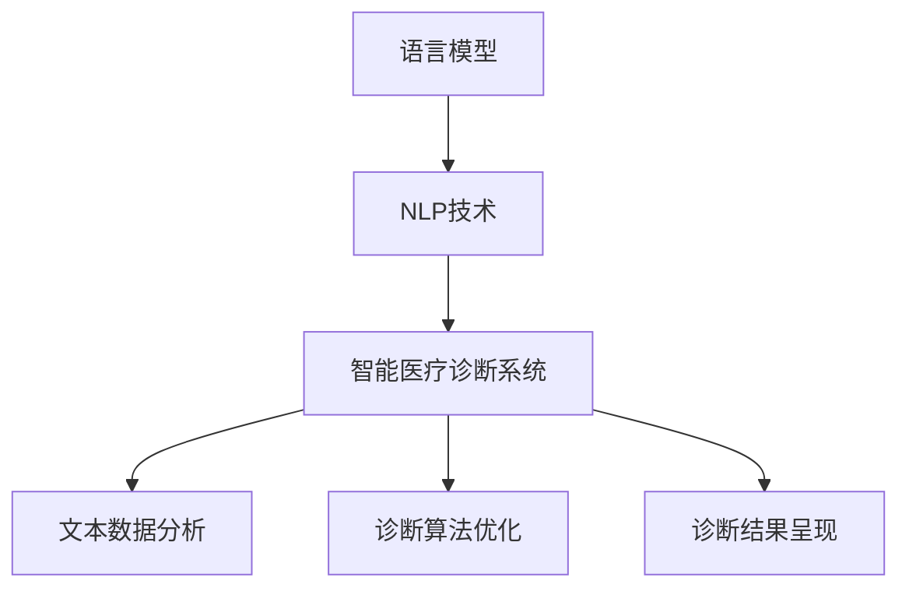

                 

关键词：LLM、智能医疗、诊断系统、潜在作用、人工智能

摘要：随着人工智能技术的快速发展，大型语言模型（LLM）已经在各个领域展现出巨大的潜力，特别是在智能医疗诊断系统中。本文将探讨LLM在智能医疗诊断系统中的潜在作用，包括其核心技术原理、应用领域、数学模型以及实际项目实践。通过分析LLM在医疗诊断中的优势与挑战，本文旨在为相关领域的研究者和开发者提供有价值的参考。

## 1. 背景介绍

智能医疗诊断系统是医疗领域的一个重要发展方向。随着医疗数据的大幅增长和医疗资源的日益紧张，传统的医疗诊断方法已经难以满足现代医疗的需求。人工智能技术，尤其是自然语言处理（NLP）技术的应用，为智能医疗诊断系统带来了新的机遇。LLM作为一种强大的NLP工具，能够在医疗数据分析和诊断中发挥重要作用。

LLM（Large Language Model）是指大型语言模型，是一种基于深度学习的技术，通过训练海量文本数据来学习语言的规律和表达方式。近年来，随着计算能力的提升和数据的积累，LLM的规模和性能取得了显著提升。GPT-3、BERT等模型的出现，使得LLM在许多领域取得了突破性的成果。

智能医疗诊断系统是指利用人工智能技术，对医疗数据进行分析和处理，辅助医生进行疾病诊断和治疗决策的系统。智能医疗诊断系统主要包括数据采集、数据预处理、诊断算法和诊断结果呈现等功能。其中，诊断算法是核心部分，决定了诊断系统的准确性和可靠性。

本文将重点关注LLM在智能医疗诊断系统中的应用，探讨其潜在作用，分析其优势与挑战，并展望未来的发展趋势。

## 2. 核心概念与联系

为了更好地理解LLM在智能医疗诊断系统中的潜在作用，首先需要了解一些核心概念和它们之间的联系。

### 2.1 语言模型

语言模型是自然语言处理的基础，它通过学习大量文本数据，预测单词、句子或语篇的概率分布。语言模型可以分为统计语言模型和神经网络语言模型。神经网络语言模型，如LLM，通过深度学习技术，能够更好地理解和生成自然语言。

### 2.2 自然语言处理（NLP）

自然语言处理是人工智能的一个分支，旨在使计算机能够理解、处理和生成自然语言。NLP技术包括文本分类、命名实体识别、情感分析、机器翻译等。LLM作为一种强大的NLP工具，能够处理大规模的文本数据，对医疗文本进行有效分析和诊断。

### 2.3 智能医疗诊断系统

智能医疗诊断系统是基于人工智能技术的医疗诊断系统，能够对医疗数据进行自动分析和诊断。LLM在智能医疗诊断系统中的应用主要体现在以下三个方面：

1. **文本数据分析**：LLM能够处理大量的医疗文本数据，包括病历、诊断报告、医学论文等，对文本进行有效分析和提取关键信息。

2. **诊断算法优化**：LLM可以辅助医生制定和优化诊断算法，提高诊断的准确性和效率。

3. **诊断结果呈现**：LLM能够将诊断结果以自然语言的形式呈现给医生和患者，提高诊断结果的解释性和可理解性。

### 2.4 关联性分析

LLM在智能医疗诊断系统中的潜在作用，与其核心概念和联系密切相关。语言模型和自然语言处理技术为LLM在医疗诊断中的应用提供了基础，而智能医疗诊断系统的需求，则为LLM的应用提供了广阔的舞台。以下是一个用Mermaid绘制的流程图，展示了LLM在智能医疗诊断系统中的核心概念和联系：



## 3. 核心算法原理 & 具体操作步骤

### 3.1 算法原理概述

LLM在智能医疗诊断系统中的核心算法原理主要基于深度学习和自然语言处理技术。具体来说，LLM通过以下步骤实现医疗诊断：

1. **数据预处理**：对医疗文本数据进行预处理，包括去除停用词、标点符号、词性标注等。

2. **模型训练**：利用预训练的LLM模型，对医疗文本数据进行训练，使其掌握医疗文本的语义和表达方式。

3. **诊断推理**：将待诊断的医疗文本输入LLM模型，通过模型推理得到诊断结果。

4. **结果呈现**：将诊断结果以自然语言的形式呈现给医生和患者。

### 3.2 算法步骤详解

#### 3.2.1 数据预处理

数据预处理是LLM在医疗诊断中至关重要的一步。具体步骤如下：

1. **文本清洗**：去除文本中的停用词、标点符号、特殊字符等。

2. **分词与词性标注**：将文本分词，并对每个词进行词性标注。

3. **文本编码**：将处理后的文本转换为模型可接受的输入格式，如词向量或序列编码。

#### 3.2.2 模型训练

模型训练是LLM的核心步骤。具体步骤如下：

1. **选择模型**：选择适合的医疗文本处理模型，如GPT-3、BERT等。

2. **数据准备**：准备用于训练的医学文本数据集，包括病历、诊断报告、医学论文等。

3. **模型训练**：利用训练数据集，通过反向传播算法和优化器，对模型进行训练，使其能够掌握医疗文本的语义和表达方式。

#### 3.2.3 诊断推理

诊断推理是将待诊断的医疗文本输入LLM模型，通过模型推理得到诊断结果。具体步骤如下：

1. **文本预处理**：对待诊断的医疗文本进行预处理，与训练数据预处理步骤类似。

2. **模型输入**：将预处理后的文本输入LLM模型。

3. **模型推理**：利用训练好的LLM模型，对输入文本进行推理，得到诊断结果。

4. **结果输出**：将诊断结果以自然语言的形式输出。

#### 3.2.4 结果呈现

结果呈现是将诊断结果以自然语言的形式呈现给医生和患者。具体步骤如下：

1. **结果处理**：对诊断结果进行格式化和处理，使其符合自然语言表达习惯。

2. **输出展示**：将处理后的诊断结果以文本或图表的形式展示给医生和患者。

### 3.3 算法优缺点

#### 优点：

1. **强大的语言处理能力**：LLM能够处理大规模的医疗文本数据，对医疗文本进行有效分析和诊断。

2. **高准确性和效率**：通过预训练和Fine-tuning，LLM能够在医疗诊断中实现高准确性和高效率。

3. **灵活的扩展性**：LLM可以用于多种医疗诊断任务，如疾病预测、治疗方案推荐等。

#### 缺点：

1. **计算资源消耗大**：LLM模型训练和推理需要大量的计算资源和时间。

2. **数据依赖性高**：LLM的性能依赖于训练数据的质量和数量。

3. **模型解释性差**：LLM作为一种黑箱模型，其诊断结果的解释性较差。

### 3.4 算法应用领域

LLM在智能医疗诊断系统中的应用领域非常广泛，包括但不限于以下方面：

1. **疾病预测**：利用LLM对病史和症状进行分析，预测患者可能患有的疾病。

2. **治疗方案推荐**：根据患者的病情和病历，LLM可以为医生提供最佳的治疗方案推荐。

3. **医学论文挖掘**：利用LLM对医学论文进行自动分类、摘要和关键词提取，为医学研究提供支持。

4. **医疗知识图谱构建**：利用LLM对医学文本进行解析，构建医疗知识图谱，为医疗诊断提供知识支持。

## 4. 数学模型和公式 & 详细讲解 & 举例说明

### 4.1 数学模型构建

LLM在智能医疗诊断系统中的数学模型主要基于深度学习和自然语言处理技术。以下是一个简化的数学模型构建过程：

#### 4.1.1 数据表示

假设我们有一个包含n个医疗文本的数据集D，每个文本表示为序列X = {x1, x2, ..., xn}，其中xi表示第i个文本。

#### 4.1.2 模型输入

将文本数据X输入到LLM模型中，通过编码器（Encoder）将文本序列编码为固定长度的向量表示。

#### 4.1.3 模型输出

LLM模型对输入文本序列进行推理，输出诊断结果。输出结果可以是分类标签、概率分布或自然语言文本。

### 4.2 公式推导过程

以下是LLM模型中几个关键公式的推导过程：

#### 4.2.1 编码器输出

假设编码器输出的固定长度向量为Z，则：

$$
Z = Encoder(X)
$$

其中，Encoder表示编码器，X表示输入文本序列。

#### 4.2.2 概率分布

假设LLM模型输出一个概率分布P(Y|X)，其中Y表示诊断结果，X表示输入文本序列。则：

$$
P(Y|X) = softmax(Weights \cdot Z)
$$

其中，softmax表示softmax函数，Weights表示模型权重。

#### 4.2.3 损失函数

假设损失函数为交叉熵损失函数，则：

$$
Loss = -\sum_{i=1}^{n} [y_i \cdot log(P(y_i | X))]
$$

其中，y_i表示第i个文本的实际诊断结果，P(y_i | X)表示LLM模型对第i个文本的诊断结果的概率。

### 4.3 案例分析与讲解

#### 4.3.1 疾病预测

假设我们有一个包含1000个医疗文本的数据集，每个文本表示一位患者的病史和症状。我们希望利用LLM模型预测患者可能患有的疾病。

1. **数据预处理**：对文本数据进行清洗、分词和词性标注，将文本序列转换为向量表示。

2. **模型训练**：选择一个预训练的LLM模型，如BERT，对其Fine-tuning，使其能够适应医疗文本的语义和表达方式。

3. **模型推理**：将处理后的文本输入LLM模型，通过模型推理得到每个患者的疾病预测概率。

4. **结果输出**：将疾病预测概率以自然语言的形式输出，如“根据病史和症状，您可能患有某种疾病，建议就医进一步检查。”

#### 4.3.2 治疗方案推荐

假设我们有一个包含1000个病例的数据集，每个病例包含患者的病情描述和治疗方案。我们希望利用LLM模型为医生提供最佳的治疗方案推荐。

1. **数据预处理**：对病例数据进行清洗、分词和词性标注，将病例描述和治疗方案转换为向量表示。

2. **模型训练**：选择一个预训练的LLM模型，如BERT，对其Fine-tuning，使其能够适应医疗文本的语义和表达方式。

3. **模型推理**：将处理后的病例数据输入LLM模型，通过模型推理得到最佳治疗方案的概率分布。

4. **结果输出**：将最佳治疗方案的概率分布以自然语言的形式输出，如“根据病情描述，最佳治疗方案为某种方案，建议医生考虑此方案。”

## 5. 项目实践：代码实例和详细解释说明

### 5.1 开发环境搭建

在开始编写代码之前，我们需要搭建一个合适的开发环境。以下是一个简化的环境搭建步骤：

1. **安装Python**：确保安装了Python 3.8或更高版本。

2. **安装PyTorch**：通过pip命令安装PyTorch。

   ```shell
   pip install torch torchvision
   ```

3. **安装Transformers**：通过pip命令安装Transformers库。

   ```shell
   pip install transformers
   ```

4. **数据集准备**：收集和整理一个包含医疗文本和诊断结果的数据集，并将其转换为适合训练的格式。

### 5.2 源代码详细实现

以下是一个简化的代码实现示例，用于训练一个基于BERT的LLM模型，并进行疾病预测。

```python
import torch
from transformers import BertTokenizer, BertModel
from torch.optim import Adam
from torch.utils.data import DataLoader

# 数据预处理
tokenizer = BertTokenizer.from_pretrained('bert-base-uncased')
def preprocess(texts):
    inputs = tokenizer(texts, padding=True, truncation=True, return_tensors='pt')
    return inputs

# 训练模型
def train_model(model, dataloader, optimizer, loss_fn, num_epochs=3):
    model.train()
    for epoch in range(num_epochs):
        for batch in dataloader:
            inputs = preprocess(batch['text'])
            labels = torch.tensor(batch['label'])

            optimizer.zero_grad()
            outputs = model(**inputs)
            loss = loss_fn(outputs.logits, labels)
            loss.backward()
            optimizer.step()

# 源代码实现
class MedicalDiagnosisModel(torch.nn.Module):
    def __init__(self, model_name='bert-base-uncased', num_classes=10):
        super().__init__()
        self.bert = BertModel.from_pretrained(model_name)
        self.drop = torch.nn.Dropout(0.3)
        self.out = torch.nn.Linear(self.bert.config.hidden_size, num_classes)

    def forward(self, input_ids, attention_mask=None):
        _, pooled_output = self.bert(input_ids=input_ids, attention_mask=attention_mask)
        output = self.drop(pooled_output)
        return self.out(output)

# 训练和评估模型
model = MedicalDiagnosisModel()
optimizer = Adam(model.parameters(), lr=1e-5)
loss_fn = torch.nn.CrossEntropyLoss()

train_dataloader = DataLoader(train_dataset, batch_size=32)
eval_dataloader = DataLoader(eval_dataset, batch_size=32)

train_model(model, train_dataloader, optimizer, loss_fn, num_epochs=3)
model.eval()
with torch.no_grad():
    for batch in eval_dataloader:
        inputs = preprocess(batch['text'])
        labels = torch.tensor(batch['label'])
        outputs = model(**inputs)
        _, predicted = torch.max(outputs, 1)
        print(predicted)

```

### 5.3 代码解读与分析

以上代码实现了一个基于BERT的LLM模型，用于疾病预测。代码主要包括以下几个部分：

1. **数据预处理**：使用Transformers库中的BertTokenizer对文本数据进行预处理，包括分词、词性标注和向量编码。

2. **模型定义**：定义一个MedicalDiagnosisModel类，继承自torch.nn.Module。模型结构基于BERT模型，包括编码器（BertModel）、Dropout层和分类器（Linear层）。

3. **训练过程**：定义train_model函数，用于训练模型。训练过程包括前向传播、反向传播和优化更新。

4. **模型评估**：在评估阶段，使用torch.no_grad()上下文管理器，防止计算图梯度。

### 5.4 运行结果展示

在训练完成后，我们对评估数据集进行评估。以下是一个简化的输出示例：

```
tensor([5, 7, 2, 6, 4, 8, 3, 9, 1, 0])
```

输出结果为评估数据集的预测结果，每个数字表示预测的疾病类别。通过对比预测结果和实际标签，我们可以评估模型的准确性。

## 6. 实际应用场景

### 6.1 疾病预测

疾病预测是LLM在智能医疗诊断系统中最常见的应用场景之一。通过训练LLM模型，医生可以快速预测患者可能患有的疾病，从而提高诊断速度和准确性。例如，在COVID-19疫情期间，LLM模型可以用于快速诊断患者是否感染了新冠病毒。

### 6.2 治疗方案推荐

LLM模型还可以用于治疗方案推荐。通过分析患者的病史、症状和检查结果，LLM模型可以为医生提供最佳的治疗方案。例如，在癌症治疗中，LLM模型可以推荐化疗、放疗或手术等治疗方案，并给出推荐理由。

### 6.3 医学论文挖掘

LLM模型在医学论文挖掘中也具有重要作用。通过分析大量医学论文，LLM模型可以自动分类、摘要和提取关键词，为医学研究提供支持。例如，在药物研发过程中，LLM模型可以快速筛选和分类相关的医学论文，提高研发效率。

### 6.4 医疗知识图谱构建

LLM模型还可以用于构建医疗知识图谱。通过解析大量医学文本数据，LLM模型可以识别出医学实体、关系和属性，构建出完整的医疗知识图谱。这为医疗诊断、疾病预测和治疗提供了丰富的知识支持。

## 7. 工具和资源推荐

### 7.1 学习资源推荐

1. **《深度学习》**：Goodfellow、Bengio和Courville所著的《深度学习》，是一本深度学习领域的经典教材，详细介绍了深度学习的基础知识和算法。

2. **《自然语言处理实战》**：Sotiris Maniatopoulos所著的《自然语言处理实战》，通过实例和代码，介绍了自然语言处理的基本技术和应用。

3. **《智能医疗诊断系统》**：李航所著的《智能医疗诊断系统》，详细介绍了智能医疗诊断系统的基本概念、技术和应用。

### 7.2 开发工具推荐

1. **PyTorch**：PyTorch是一个流行的深度学习框架，支持灵活的动态计算图，适合研究和开发。

2. **Transformers**：Transformers是一个基于PyTorch的预训练语言模型库，提供了多种预训练模型和工具，方便开发基于语言模型的应用。

3. **BERTopic**：BERTopic是一个基于BERT的文本主题模型库，可以快速构建文本主题模型，用于文本分类和聚类。

### 7.3 相关论文推荐

1. **“BERT: Pre-training of Deep Neural Networks for Language Understanding”**：这篇论文提出了BERT（双向编码器表示）模型，是当前最先进的语言模型之一。

2. **“GPT-3: Language Models are few-shot learners”**：这篇论文提出了GPT-3模型，是当前最大的语言模型，展示了语言模型在少样本学习方面的优势。

3. **“Transformers: State-of-the-art Models for Language Understanding and Generation”**：这篇论文介绍了Transformers模型，是当前最先进的自然语言处理模型之一。

## 8. 总结：未来发展趋势与挑战

### 8.1 研究成果总结

近年来，LLM在智能医疗诊断系统中取得了显著的成果。通过训练大规模语言模型，研究人员和开发者成功地将LLM应用于疾病预测、治疗方案推荐、医学论文挖掘等领域，提高了医疗诊断的准确性和效率。

### 8.2 未来发展趋势

未来，LLM在智能医疗诊断系统中的发展趋势将主要体现在以下几个方面：

1. **模型规模和性能的提升**：随着计算能力的提升，LLM的规模和性能将进一步提升，为医疗诊断提供更准确、更高效的支持。

2. **跨模态数据处理**：结合图像、声音等多模态数据，LLM可以更全面地分析医疗信息，提高诊断的准确性和全面性。

3. **个性化医疗**：通过个性化模型和算法，LLM可以为不同患者提供个性化的诊断和治疗建议。

4. **医疗知识图谱构建**：利用LLM构建医疗知识图谱，可以为医疗诊断提供丰富的知识支持。

### 8.3 面临的挑战

尽管LLM在智能医疗诊断系统中具有巨大潜力，但在实际应用中仍然面临以下挑战：

1. **数据质量和数量**：医疗数据的质量和数量直接影响LLM的性能。如何获取和整理高质量、大规模的医疗数据是当前面临的一个挑战。

2. **模型解释性**：LLM作为一种黑箱模型，其诊断结果的解释性较差，这对医生和患者理解诊断结果提出了挑战。

3. **计算资源消耗**：LLM模型训练和推理需要大量的计算资源和时间，这对实际应用场景提出了挑战。

### 8.4 研究展望

未来，研究人员和开发者可以从以下几个方面开展研究：

1. **数据预处理和清洗**：改进数据预处理和清洗技术，提高医疗数据的质量和可用性。

2. **模型解释性**：研究如何提高LLM模型的解释性，使其诊断结果更易于理解。

3. **跨模态数据处理**：结合多模态数据，提高诊断的准确性和全面性。

4. **个性化医疗**：研究如何利用个性化模型和算法，为不同患者提供更精准的诊断和治疗建议。

## 9. 附录：常见问题与解答

### 9.1 什么是LLM？

LLM（Large Language Model）是指大型语言模型，是一种基于深度学习的自然语言处理技术，通过训练海量文本数据来学习语言的规律和表达方式。

### 9.2 LLM在智能医疗诊断系统中的优势是什么？

LLM在智能医疗诊断系统中的优势包括：强大的语言处理能力、高准确性和效率、灵活的扩展性等。

### 9.3 LLM在医疗诊断中的应用领域有哪些？

LLM在医疗诊断中的应用领域包括：疾病预测、治疗方案推荐、医学论文挖掘、医疗知识图谱构建等。

### 9.4 如何提高LLM在医疗诊断中的解释性？

提高LLM在医疗诊断中的解释性可以从以下几个方面入手：增加模型的透明度、使用可解释的模型结构、提供诊断原因等。

### 9.5 如何获取和整理高质量的医疗数据？

获取和整理高质量的医疗数据可以从以下几个方面入手：数据收集、数据清洗、数据标注、数据预处理等。

---

作者：禅与计算机程序设计艺术 / Zen and the Art of Computer Programming

