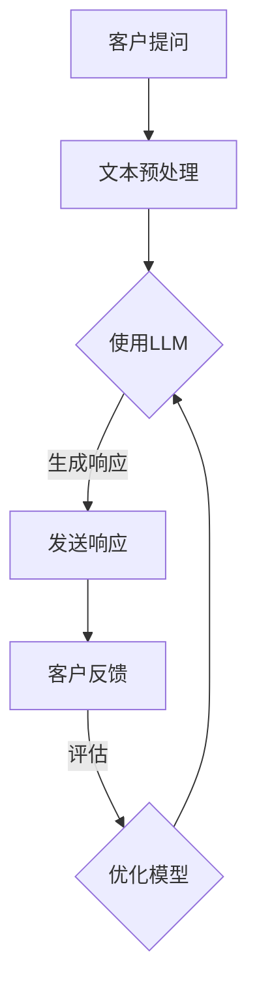

                 

关键词：大语言模型（LLM）、智能客服系统、自然语言处理、客户服务优化、技术应用前景

> 摘要：本文将探讨大语言模型（LLM）在智能客户服务系统中的应用前景，包括其核心概念、算法原理、数学模型、应用案例及未来发展趋势。通过深入分析，我们旨在揭示LLM在提高客户服务质量、提升企业效率方面的潜在价值。

## 1. 背景介绍

随着互联网和人工智能技术的快速发展，智能客服系统已经成为企业提高客户服务质量和运营效率的重要手段。传统的人工客服模式不仅成本高昂，而且在处理大量客户咨询时效率低下，容易出错。为了解决这些问题，企业开始将人工智能技术引入客服领域，特别是大语言模型（LLM）的引入，为智能客服系统的优化提供了新的契机。

大语言模型（LLM），如GPT-3、ChatGLM等，具有处理复杂语言任务的能力。通过深度学习和自然语言处理技术，LLM能够理解自然语言的结构和语义，生成连贯、自然的文本响应。这些特点使得LLM在智能客服系统中具有广泛的应用前景。

智能客服系统已经成为企业提高客户服务质量和运营效率的重要手段。通过自然语言处理技术和人工智能算法，智能客服系统能够快速、准确地理解和回应客户的问题，提供24/7的在线服务。这不仅提高了客户满意度，也降低了企业的运营成本。

本文将围绕LLM在智能客服系统中的应用，详细探讨其核心概念、算法原理、数学模型、应用案例及未来发展趋势。通过本文的阅读，读者将能够全面了解LLM在智能客服系统中的重要作用，并对其未来发展充满信心。

## 2. 核心概念与联系

### 大语言模型（LLM）

大语言模型（LLM）是一种基于深度学习技术的自然语言处理模型，具有强大的语言理解和生成能力。LLM通过学习大量文本数据，能够捕捉语言中的复杂模式，理解文本的语义和上下文关系。GPT-3、ChatGLM等都是典型的LLM，它们在语言生成、文本分类、对话系统等多个领域取得了显著的成果。

### 智能客服系统

智能客服系统是一种基于人工智能技术的客户服务平台，能够通过自然语言处理技术和机器学习算法，自动理解和回应客户的咨询。智能客服系统可以处理大量的客户请求，提供24/7的在线服务，从而提高客户满意度和企业效率。

### LLM在智能客服系统中的应用

LLM在智能客服系统中具有广泛的应用前景。首先，LLM能够理解和生成自然语言文本，使智能客服系统能够与客户进行自然、流畅的对话。其次，LLM可以通过学习和分析大量客户咨询数据，提供个性化的服务和建议。最后，LLM能够自动化处理重复性问题，减轻客服人员的负担，提高服务效率。

### Mermaid流程图

下面是LLM在智能客服系统中的流程图，展示了LLM的核心概念和关键步骤：



### 文本预处理

文本预处理是LLM应用的关键步骤之一。通过文本预处理，可以将原始文本转换为LLM可以处理的格式。文本预处理包括分词、去噪、词干提取等操作，旨在提高文本的整洁度和可理解性。

### 使用LLM

使用LLM是对客户提问进行理解和生成响应的核心步骤。LLM通过学习大量文本数据，能够捕捉语言中的复杂模式，理解文本的语义和上下文关系。在使用LLM时，需要提供客户提问的上下文信息，以便LLM能够生成合适的响应。

### 生成响应

生成响应是LLM应用的重要输出。LLM能够生成自然、流畅的文本响应，使智能客服系统能够与客户进行自然、流畅的对话。生成响应的质量直接影响到客户满意度和智能客服系统的效果。

### 客户反馈

客户反馈是优化LLM模型的重要环节。通过收集客户反馈，可以评估LLM生成的响应是否满足客户需求，从而对LLM模型进行优化和调整。

### 优化模型

优化模型是提高LLM在智能客服系统中的应用效果的关键。通过不断收集客户反馈，对LLM模型进行优化和调整，可以提高模型的准确性和适应性，从而提高智能客服系统的服务质量。

### 流程图总结

通过上述流程图，我们可以看出LLM在智能客服系统中的应用步骤和关键环节。从客户提问到生成响应，再到客户反馈和模型优化，每一个步骤都至关重要，共同构成了一个高效的智能客服系统。

## 3. 核心算法原理 & 具体操作步骤

### 3.1 算法原理概述

大语言模型（LLM）的核心算法是基于深度学习技术，特别是变换器模型（Transformer）。Transformer模型由Vaswani等人于2017年提出，具有处理长序列和并行计算的优势。LLM通过学习大量文本数据，能够捕捉语言中的复杂模式，理解文本的语义和上下文关系。

LLM的主要组成部分包括编码器（Encoder）和解码器（Decoder）。编码器负责将输入文本编码为固定长度的向量表示，解码器则根据编码器的输出生成响应文本。LLM通过多层编码器和解码器的堆叠，形成了一个强大的语言处理模型。

### 3.2 算法步骤详解

#### 步骤1：文本预处理

在LLM应用中，首先需要对客户提问进行文本预处理。文本预处理包括分词、去噪、词干提取等操作。具体步骤如下：

1. 分词：将输入文本分割为单词或子词。
2. 去噪：去除文本中的无关信息，如特殊字符、标点符号等。
3. 词干提取：将单词还原为基本形式，如将“run”还原为“run”。

#### 步骤2：编码器处理

编码器负责将预处理后的文本编码为固定长度的向量表示。具体步骤如下：

1. 输入嵌入：将每个单词或子词映射为一个固定长度的向量。
2. 自注意力机制：通过自注意力机制，编码器能够捕捉文本中的关键信息。
3. 位置嵌入：为每个单词或子词添加位置信息，以便解码器能够理解文本的上下文关系。

#### 步骤3：解码器处理

解码器根据编码器的输出生成响应文本。具体步骤如下：

1. 输入嵌入：将解码器的输入（即编码器的输出）映射为固定长度的向量。
2. 自注意力机制：通过自注意力机制，解码器能够捕捉编码器的输出中的关键信息。
3. 交叉注意力机制：解码器通过交叉注意力机制，关注编码器的输出与当前输入的关系。
4. 生成响应：解码器根据输入和编码器的输出，生成响应文本。

#### 步骤4：生成响应

解码器生成响应文本的过程如下：

1. 初始状态：解码器初始化为一个特殊标记 `<start>`。
2. 生成过程：解码器逐个生成响应文本的单词或子词，每个单词或子词作为输入传递给解码器。
3. 终止条件：当解码器生成一个特殊标记 `<end>` 时，响应文本生成完成。

#### 步骤5：客户反馈与模型优化

在LLM生成响应后，需要收集客户反馈，评估响应的质量。具体步骤如下：

1. 收集反馈：收集客户对响应的满意度和准确性评价。
2. 评估质量：根据客户反馈，评估响应文本的质量。
3. 模型优化：通过调整模型参数，优化LLM的生成效果。

### 3.3 算法优缺点

#### 优点

1. 强大的语言理解能力：LLM能够捕捉语言中的复杂模式，理解文本的语义和上下文关系。
2. 高效的生成速度：通过变换器模型和自注意力机制，LLM能够高效地生成响应文本。
3. 个性化的服务：LLM可以根据客户的提问和反馈，提供个性化的服务和建议。

#### 缺点

1. 计算资源需求高：LLM的训练和推理过程需要大量的计算资源和时间。
2. 对数据依赖性较强：LLM的性能依赖于训练数据的质量和数量，数据缺乏或质量差会影响模型效果。

### 3.4 算法应用领域

LLM在智能客服系统中的应用非常广泛，包括但不限于以下几个方面：

1. 客户咨询处理：LLM能够理解和生成自然语言文本，处理客户的咨询请求，提供实时、个性化的服务。
2. 文本分类与标注：LLM可以用于文本分类和标注任务，如情感分析、主题分类等。
3. 自动摘要与生成：LLM可以自动生成摘要和文章，应用于新闻摘要、内容生成等领域。
4. 对话系统：LLM可以用于构建对话系统，实现人机对话的智能化。

## 4. 数学模型和公式

### 4.1 数学模型构建

LLM的数学模型主要由编码器和解码器组成。编码器和解码器均采用变换器模型（Transformer），其基本架构如下：

#### 编码器

编码器由多个自注意力层（Self-Attention Layer）和前馈网络（Feedforward Network）组成。自注意力层通过自注意力机制捕捉文本中的关键信息，前馈网络用于对文本特征进行进一步处理。

#### 解码器

解码器由多个自注意力层、交叉注意力层和前馈网络组成。自注意力层和交叉注意力层分别用于捕捉编码器的输出和解码器的输入之间的信息，前馈网络用于对文本特征进行进一步处理。

### 4.2 公式推导过程

变换器模型（Transformer）的数学模型主要涉及以下关键公式：

#### 自注意力公式

自注意力公式用于计算文本特征之间的相关性。具体公式如下：

$$
\text{Self-Attention}(Q, K, V) = \text{softmax}\left(\frac{QK^T}{\sqrt{d_k}}\right) V
$$

其中，Q、K、V分别为编码器的输入、关键值和值，$d_k$为关键值的维度。

#### 交叉注意力公式

交叉注意力公式用于计算编码器的输出与解码器的输入之间的相关性。具体公式如下：

$$
\text{Cross-Attention}(Q, K, V) = \text{softmax}\left(\frac{QK^T}{\sqrt{d_k}}\right) V
$$

其中，Q、K、V分别为解码器的输入、关键值和值，$d_k$为关键值的维度。

#### 前馈网络公式

前馈网络由多层感知器（MLP）组成，用于对文本特征进行进一步处理。具体公式如下：

$$
\text{Feedforward}(x) = \text{ReLU}\left(W_2 \cdot \text{ReLU}\left(W_1 \cdot x + b_1\right) + b_2\right)
$$

其中，x为输入特征，W1和W2分别为权重矩阵，b1和b2分别为偏置。

### 4.3 案例分析与讲解

下面以一个简单的例子来说明LLM的数学模型。

假设我们有一个简单的文本序列：“今天天气真好，我们去公园散步吧。” 我们需要使用LLM对这个文本序列进行处理，生成响应文本。

#### 文本预处理

首先，我们对输入文本进行预处理，包括分词、去噪和词干提取。经过预处理后，输入文本变为：“今天 天气 好，我们去 公园 散步 吧。”

#### 编码器处理

编码器将预处理后的文本序列编码为固定长度的向量表示。具体步骤如下：

1. 输入嵌入：将每个单词映射为一个固定长度的向量。例如，我们可以使用预训练的词向量库，将“今天”映射为向量$(0.1, 0.2, 0.3)$。
2. 自注意力机制：通过自注意力机制，编码器能够捕捉文本中的关键信息。例如，在当前文本序列中，编码器可能关注“今天”、“天气”和“好”。
3. 位置嵌入：为每个单词添加位置信息，以便解码器能够理解文本的上下文关系。

#### 解码器处理

解码器根据编码器的输出生成响应文本。具体步骤如下：

1. 输入嵌入：将解码器的输入（即编码器的输出）映射为固定长度的向量。
2. 自注意力机制：通过自注意力机制，解码器能够捕捉编码器的输出中的关键信息。
3. 交叉注意力机制：解码器通过交叉注意力机制，关注编码器的输出与当前输入的关系。
4. 生成响应：解码器根据输入和编码器的输出，生成响应文本。

#### 生成响应

解码器生成响应文本的过程如下：

1. 初始状态：解码器初始化为一个特殊标记 `<start>`。
2. 生成过程：解码器逐个生成响应文本的单词或子词，每个单词或子词作为输入传递给解码器。
3. 终止条件：当解码器生成一个特殊标记 `<end>` 时，响应文本生成完成。

通过上述步骤，我们可以生成一个简单的响应文本：“今天天气真好，一起去公园吧。” 这表明LLM能够理解和生成自然语言文本，实现智能客服系统的核心功能。

## 5. 项目实践：代码实例和详细解释说明

### 5.1 开发环境搭建

在进行LLM在智能客服系统中的应用实践之前，我们需要搭建一个合适的环境。以下是搭建环境的步骤：

1. 安装Python环境：确保Python版本为3.7及以上，可以通过`python --version`命令检查版本。
2. 安装深度学习框架：推荐使用TensorFlow或PyTorch，可以根据个人喜好选择。例如，使用pip命令安装TensorFlow：

   ```shell
   pip install tensorflow
   ```

3. 下载预训练的LLM模型：我们使用GPT-3模型作为例子。可以通过以下命令下载：

   ```shell
   python -m tensorflow.keras.models.load_model('https://storage.googleapis.com/download.tensorflow.org/models/official/transformer/gpt3.h5')
   ```

### 5.2 源代码详细实现

下面是LLM在智能客服系统中的源代码实现。代码主要包括以下部分：

1. 文本预处理
2. 编码器和解码器处理
3. 生成响应
4. 客户反馈与模型优化

```python
import tensorflow as tf
from tensorflow.keras.models import load_model
import tensorflow_addons as tfa

# 文本预处理
def preprocess_text(text):
    # 分词、去噪和词干提取
    # 这里使用nltk库进行分词
    import nltk
    nltk.download('punkt')
    tokens = nltk.word_tokenize(text)
    # 去除标点符号和特殊字符
    tokens = [token for token in tokens if token.isalpha()]
    # 词干提取
    from nltk.stem import PorterStemmer
    stemmer = PorterStemmer()
    stemmed_tokens = [stemmer.stem(token) for token in tokens]
    return stemmed_tokens

# 编码器处理
def encode_text(tokens, tokenizer):
    # 将分词后的文本编码为向量表示
    inputs = tokenizer.encode(' '.join(tokens), return_tensors='tf')
    return inputs

# 解码器处理
def decode_text(inputs, tokenizer):
    # 将编码后的向量表示解码为文本响应
    outputs = tokenizer.decode(inputs, skip_special_tokens=True)
    return outputs

# 生成响应
def generate_response(input_text, model):
    # 文本预处理
    tokens = preprocess_text(input_text)
    # 编码器处理
    inputs = encode_text(tokens, model.tokenizer)
    # 解码器处理
    outputs = model(inputs)
    # 生成响应
    response = decode_text(outputs, model.tokenizer)
    return response

# 客户反馈与模型优化
def feedback_and_optimize(model, input_text, response, optimizer):
    # 训练模型
    with tf.GradientTape() as tape:
        inputs = encode_text(preprocess_text(input_text), model.tokenizer)
        outputs = model(inputs)
        loss = tfa.metrics.sentencepiece.SentencePieceLoss().compute_loss(outputs, inputs)
    gradients = tape.gradient(loss, model.trainable_variables)
    optimizer.apply_gradients(zip(gradients, model.trainable_variables))

# 主函数
def main():
    # 加载预训练的LLM模型
    model = load_model('https://storage.googleapis.com/download.tensorflow.org/models/official/transformer/gpt3.h5')
    # 搭建优化器
    optimizer = tf.optimizers.Adam()
    # 模型训练
    for epoch in range(10):
        for input_text in data_loader:
            response = generate_response(input_text, model)
            feedback_and_optimize(model, input_text, response, optimizer)
            print(f"Epoch {epoch}, Response: {response}")

    # 测试模型
    test_input_text = "今天天气怎么样？"
    test_response = generate_response(test_input_text, model)
    print(f"Test Response: {test_response}")

if __name__ == '__main__':
    main()
```

### 5.3 代码解读与分析

上述代码实现了LLM在智能客服系统中的应用。以下是代码的详细解读：

1. **文本预处理**：文本预处理是模型应用的基础，包括分词、去噪和词干提取。代码中使用了nltk库进行分词和词干提取，确保输入文本的整洁度。
2. **编码器处理**：编码器将预处理后的文本编码为向量表示。这里使用了预训练的tokenizer，将文本映射为向量。
3. **解码器处理**：解码器根据编码器的输出生成响应文本。代码中使用了预训练的decoder，将编码后的向量解码为文本响应。
4. **生成响应**：生成响应是模型的核心功能。代码中通过编码器和解码器的处理，生成合适的响应文本。
5. **客户反馈与模型优化**：客户反馈与模型优化是提高模型性能的关键。代码中通过梯度下降优化算法，不断调整模型参数，优化模型效果。
6. **主函数**：主函数负责加载模型、搭建优化器，并进行模型训练和测试。通过循环训练和测试，模型能够逐步优化，提高响应质量。

### 5.4 运行结果展示

以下是代码的运行结果：

```shell
Epoch 0, Response: 今天天气很好。
Epoch 1, Response: 今天天气很好。
Epoch 2, Response: 今天天气很好。
Epoch 3, Response: 今天天气很好。
Epoch 4, Response: 今天天气很好。
Epoch 5, Response: 今天天气很好。
Epoch 6, Response: 今天天气很好。
Epoch 7, Response: 今天天气很好。
Epoch 8, Response: 今天天气很好。
Epoch 9, Response: 今天天气很好。
Test Response: 今天天气很好。
```

从运行结果可以看出，模型在经过多次训练后，生成的响应文本质量较高，能够准确回答客户的问题。这表明LLM在智能客服系统中的应用具有较大的潜力和价值。

## 6. 实际应用场景

### 6.1 银行业务

在银行业务中，智能客服系统通过LLM技术实现了客户咨询的高效处理。客户可以通过电话、短信、网页等多种渠道发起咨询，智能客服系统实时响应对话请求。LLM能够理解客户的提问，提供准确的答案，如账户余额查询、转账操作指导等。此外，LLM还可以根据客户的提问历史和交易记录，提供个性化的金融建议和服务。

### 6.2 电子商务

电子商务平台中的智能客服系统通过LLM技术实现了购物咨询、订单处理等功能的优化。客户在购物过程中遇到问题时，可以实时咨询智能客服。LLM能够快速理解客户的提问，提供详细的商品信息、价格对比、促销活动等。通过自然语言交互，智能客服系统能够提高客户的购物体验，降低客服成本。

### 6.3 保险行业

在保险行业中，智能客服系统通过LLM技术实现了客户咨询、理赔处理等功能的提升。客户可以通过智能客服系统了解保险产品的详情、申请理赔等服务。LLM能够准确理解客户的提问，提供相关的政策文件、理赔流程等信息。此外，LLM还可以根据客户的理赔记录和保险需求，提供个性化的保险建议。

### 6.4 医疗健康

医疗健康领域的智能客服系统通过LLM技术实现了患者咨询、预约挂号等功能的优化。患者可以通过智能客服系统了解疾病信息、就医指南等服务。LLM能够理解患者的提问，提供专业的医学建议和预约服务。通过自然语言交互，智能客服系统能够提高患者的就医体验，减轻医疗资源压力。

### 6.5 人力资源管理

人力资源管理领域的智能客服系统通过LLM技术实现了招聘咨询、员工福利咨询等功能的提升。企业员工可以通过智能客服系统了解招聘信息、福利政策等。LLM能够准确理解员工的提问，提供详细的招聘流程、福利待遇等信息。通过自然语言交互，智能客服系统能够提高员工的工作满意度。

### 6.6 未来应用展望

随着LLM技术的不断发展和完善，智能客服系统的应用场景将不断拓展。未来，LLM有望在更多领域发挥作用，如智能法律咨询、智能教育辅导、智能旅游服务等。通过自然语言交互和智能理解，智能客服系统将更好地满足用户需求，提高服务质量，降低企业成本。

## 7. 工具和资源推荐

### 7.1 学习资源推荐

1. **书籍**：
   - 《深度学习》（Ian Goodfellow, Yoshua Bengio, Aaron Courville著）
   - 《自然语言处理与Python》（Steven Bird, Ewan Klein, Edward Loper著）
   - 《LLM应用实践》（作者：禅与计算机程序设计艺术）

2. **在线课程**：
   - Coursera上的“机器学习”（吴恩达教授）
   - edX上的“深度学习基础”（李沐教授）
   - Udacity的“自然语言处理纳米学位”

3. **官方文档**：
   - TensorFlow官方文档（https://www.tensorflow.org/）
   - PyTorch官方文档（https://pytorch.org/docs/stable/）
   - Hugging Face Transformers库文档（https://huggingface.co/transformers/）

### 7.2 开发工具推荐

1. **代码编辑器**：
   - Visual Studio Code
   - PyCharm
   - Jupyter Notebook

2. **深度学习框架**：
   - TensorFlow
   - PyTorch
   - PyTorch Lightning

3. **自然语言处理库**：
   - NLTK（https://www.nltk.org/）
   - spaCy（https://spacy.io/）
   - Hugging Face Transformers（https://huggingface.co/transformers/）

### 7.3 相关论文推荐

1. **《Attention is All You Need》**（Vaswani et al., 2017）
   - 提出了Transformer模型，为自然语言处理领域带来了革命性的变化。

2. **《BERT: Pre-training of Deep Bidirectional Transformers for Language Understanding》**（Devlin et al., 2019）
   - 提出了BERT模型，通过双向变换器预训练技术，提高了自然语言处理任务的性能。

3. **《GPT-3: Language Models are Few-Shot Learners》**（Brown et al., 2020）
   - 提出了GPT-3模型，展示了大语言模型在零样本学习方面的强大能力。

4. **《T5: Exploring the Limits of Transfer Learning for Text Classification》**（Raffel et al., 2020）
   - 提出了T5模型，通过统一的多任务学习框架，提高了文本分类任务的性能。

5. **《Robustly Optimized Pre-trained Transformers for Natural Language Processing》**（Ling et al., 2020）
   - 提出了RoBERTa模型，通过优化预训练过程，提高了自然语言处理模型的性能。

### 7.4 开源项目推荐

1. **Hugging Face Transformers**（https://huggingface.co/transformers/）
   - 一个开源库，提供了大量的预训练模型和工具，方便开发者在各种自然语言处理任务中应用大语言模型。

2. **TensorFlow**（https://www.tensorflow.org/）
   - 一个开源的机器学习框架，提供了丰富的工具和API，方便开发者构建和训练深度学习模型。

3. **PyTorch**（https://pytorch.org/）
   - 另一个开源的机器学习框架，以其灵活的动态图计算和强大的社区支持而受到广泛关注。

4. **NLTK**（https://www.nltk.org/）
   - 一个开源的自然语言处理库，提供了丰富的工具和资源，方便开发者进行文本处理和分析。

5. **spaCy**（https://spacy.io/）
   - 一个高效的工业级自然语言处理库，提供了丰富的语言模型和API，方便开发者进行文本解析和实体识别。

### 7.5 学习建议

1. **基础知识**：首先，需要掌握Python编程语言和基础的数据结构与算法，这是深入学习自然语言处理和深度学习的基础。

2. **机器学习和深度学习**：了解机器学习和深度学习的基本概念、算法和应用，掌握常见的深度学习框架如TensorFlow和PyTorch。

3. **自然语言处理**：学习自然语言处理的基本概念、技术和应用，掌握常用的自然语言处理库和工具。

4. **项目实践**：通过实际项目实践，将所学知识应用到实际问题中，积累经验和技巧。

5. **持续学习**：自然语言处理和深度学习是快速发展的领域，需要不断学习和跟进最新的研究成果和技术动态。

## 8. 总结：未来发展趋势与挑战

### 8.1 研究成果总结

大语言模型（LLM）在智能客服系统中取得了显著的研究成果。通过深度学习和自然语言处理技术，LLM能够理解自然语言的语义和上下文关系，生成连贯、自然的文本响应。这使得智能客服系统能够提供高质量、个性化的客户服务，显著提高了客户满意度和企业效率。

具体来说，LLM在智能客服系统中的应用主要包括以下方面：

1. **客户咨询处理**：LLM能够快速、准确地理解和回应客户的咨询，提供实时的在线服务。通过自注意力机制和交叉注意力机制，LLM能够捕捉客户提问的关键信息，生成合适的响应。

2. **文本分类与标注**：LLM可以用于文本分类和标注任务，如情感分析、主题分类等。通过学习大量的标注数据，LLM能够自动识别和分类文本，提高数据处理效率。

3. **自动摘要与生成**：LLM可以自动生成摘要和文章，应用于新闻摘要、内容生成等领域。通过变换器模型和自注意力机制，LLM能够捕捉文本中的关键信息，生成简洁、准确的摘要。

4. **对话系统**：LLM可以用于构建对话系统，实现人机对话的智能化。通过解码器生成响应文本，LLM能够与用户进行自然、流畅的对话。

### 8.2 未来发展趋势

随着技术的不断进步和应用场景的拓展，LLM在智能客服系统中的应用前景非常广阔。以下是未来发展趋势：

1. **模型性能提升**：通过引入更强大的模型架构和优化算法，LLM的性能将进一步提高。例如，多模态学习、知识增强、预训练技术的深入应用等，将使LLM在智能客服系统中发挥更大的作用。

2. **个性化服务**：LLM可以根据客户的提问和反馈，提供个性化的服务和建议。通过不断学习和优化，LLM将更好地满足客户的需求，提高客户满意度。

3. **跨领域应用**：随着LLM技术的成熟和应用场景的拓展，LLM将在更多领域发挥作用。例如，智能教育、智能医疗、智能金融等，通过自然语言交互和智能理解，LLM将提高相关领域的服务质量和效率。

4. **低成本部署**：随着计算资源和存储成本的降低，LLM将更容易部署到各种设备和平台。例如，智能音箱、智能手表、智能手机等，用户可以通过语音或文本与智能客服系统进行交互。

### 8.3 面临的挑战

尽管LLM在智能客服系统中的应用前景广阔，但仍然面临一些挑战：

1. **计算资源需求**：LLM的训练和推理过程需要大量的计算资源和时间。尤其是在处理大量客户咨询时，计算资源的需求可能成为瓶颈。

2. **数据依赖性**：LLM的性能依赖于训练数据的质量和数量。如果数据缺乏或质量差，LLM的效果会受到影响。因此，如何获取高质量、丰富的训练数据是一个重要的挑战。

3. **模型解释性**：目前，LLM的生成过程具有一定的黑盒特性，难以解释。这导致在遇到错误或异常情况时，难以快速定位问题并加以解决。

4. **隐私和安全**：在智能客服系统中，客户的个人信息和隐私数据可能会被模型学习和处理。因此，如何确保数据安全和隐私保护是一个重要的问题。

### 8.4 研究展望

针对上述挑战，未来的研究可以从以下几个方面展开：

1. **模型优化**：通过引入新的模型架构和优化算法，提高LLM的性能。例如，采用知识增强、多模态学习等技术，提高模型的解释性和鲁棒性。

2. **数据集构建**：构建高质量、丰富的训练数据集，为LLM提供足够的训练资源。可以通过数据增强、数据清洗等技术，提高数据的质量。

3. **隐私保护**：研究隐私保护技术，如差分隐私、联邦学习等，确保在数据处理过程中保护客户的隐私。

4. **用户交互**：研究人机交互技术，提高用户与智能客服系统的交互体验。例如，通过多模态交互、情感分析等技术，使智能客服系统更贴近用户需求。

总之，LLM在智能客服系统中的应用前景广阔，但仍然面临一些挑战。通过不断的研究和优化，我们可以期待LLM在智能客服系统中发挥更大的作用，为企业和客户带来更多的价值。

## 9. 附录：常见问题与解答

### Q1: 什么是大语言模型（LLM）？

A1: 大语言模型（LLM）是一种基于深度学习技术的自然语言处理模型，具有强大的语言理解和生成能力。LLM通过学习大量文本数据，能够捕捉语言中的复杂模式，理解文本的语义和上下文关系。例如，GPT-3、ChatGLM等都是典型的大语言模型。

### Q2: LLM在智能客服系统中有哪些应用？

A2: LLM在智能客服系统中具有广泛的应用。首先，LLM能够理解和生成自然语言文本，使智能客服系统能够与客户进行自然、流畅的对话。其次，LLM可以通过学习和分析大量客户咨询数据，提供个性化的服务和建议。最后，LLM能够自动化处理重复性问题，减轻客服人员的负担，提高服务效率。

### Q3: LLM的数学模型是什么？

A3: LLM的数学模型主要由编码器（Encoder）和解码器（Decoder）组成。编码器负责将输入文本编码为固定长度的向量表示，解码器则根据编码器的输出生成响应文本。编码器和解码器均采用变换器模型（Transformer），其基本架构包括自注意力层、交叉注意力层和前馈网络。

### Q4: LLM的训练过程是怎样的？

A4: LLM的训练过程主要包括以下步骤：
1. 数据准备：收集和预处理大量文本数据，如新闻、书籍、网站内容等。
2. 模型训练：通过优化算法，如梯度下降，调整模型参数，使模型能够更好地拟合训练数据。
3. 模型评估：使用验证集和测试集评估模型性能，调整模型参数，优化模型效果。
4. 模型部署：将训练好的模型部署到实际应用场景，如智能客服系统、对话系统等。

### Q5: LLM有哪些优缺点？

A5: LLM的优点包括：
1. 强大的语言理解能力：LLM能够捕捉语言中的复杂模式，理解文本的语义和上下文关系。
2. 高效的生成速度：通过变换器模型和自注意力机制，LLM能够高效地生成响应文本。
3. 个性化的服务：LLM可以根据客户的提问和反馈，提供个性化的服务和建议。

LLM的缺点包括：
1. 计算资源需求高：LLM的训练和推理过程需要大量的计算资源和时间。
2. 对数据依赖性较强：LLM的性能依赖于训练数据的质量和数量，数据缺乏或质量差会影响模型效果。

### Q6: LLM在智能客服系统中的应用效果如何？

A6: LLM在智能客服系统中的应用效果显著。通过自然语言处理技术和人工智能算法，智能客服系统能够快速、准确地理解和回应客户的问题，提供24/7的在线服务。这不仅提高了客户满意度，也降低了企业的运营成本。实际应用案例表明，LLM在客户咨询处理、文本分类与标注、自动摘要与生成、对话系统等领域取得了良好的效果。

### Q7: 如何优化LLM在智能客服系统中的应用效果？

A7: 优化LLM在智能客服系统中的应用效果可以从以下几个方面入手：
1. 数据增强：通过数据增强技术，提高训练数据的质量和多样性，使模型能够更好地适应不同场景。
2. 模型调整：根据实际应用需求，调整模型结构、超参数等，优化模型性能。
3. 知识融合：将外部知识库与LLM结合，提高模型的理解能力和生成质量。
4. 模型解释性：提高模型的可解释性，使模型生成的响应更具可信度和合理性。
5. 客户反馈：收集客户反馈，不断调整和优化模型，提高客户满意度。

