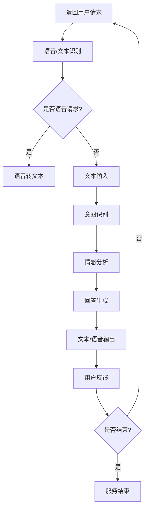

                 

### 关键词 Keywords

- LLM（大型语言模型）
- 智能客户服务系统
- 机器学习
- 自然语言处理
- 客户体验
- 自动化服务

<|assistant|>### 摘要 Abstract

本文深入探讨了大型语言模型（LLM）在智能客户服务系统中的应用前景。通过背景介绍、核心概念与联系阐述、算法原理与操作步骤解析、数学模型与公式讲解、项目实践实例分析、实际应用场景探讨以及未来展望和挑战等方面，本文旨在展示LLM在提升客户服务质量、优化客户体验和实现自动化服务中的关键作用。文章结构紧凑、逻辑清晰，对IT领域专业人士和研究者具有重要的参考价值。

## 1. 背景介绍

在当今数字化转型的浪潮中，智能客户服务系统已成为企业提升客户满意度和竞争力的关键。传统的客户服务方式，如电话呼叫中心和电子邮件支持，效率低下且成本高昂。而随着机器学习和自然语言处理技术的不断发展，智能客户服务系统逐渐成为主流。这些系统利用先进的人工智能技术，可以自动化处理大量的客户查询，提供实时、个性化的服务。

大型语言模型（LLM）是近年来人工智能领域的重要突破之一。LLM是一种基于深度学习的语言模型，具有强大的自然语言理解和生成能力。通过大规模的数据训练，LLM能够捕捉语言的复杂结构和语义信息，从而实现高度智能化的文本交互。LLM的广泛应用为智能客户服务系统的发展提供了新的契机。

智能客户服务系统与传统客服系统的显著区别在于其能够实现自动化、个性化服务。传统客服系统通常依赖于预定义的脚本和规则，无法灵活应对复杂多变的客户需求。而智能客户服务系统借助LLM，能够动态理解客户的意图和情感，提供更加自然和人性化的交互体验。这种变革不仅提高了客服效率，还显著提升了客户满意度。

## 2. 核心概念与联系

为了深入理解LLM在智能客户服务系统中的应用，我们需要了解一些核心概念和其之间的联系。

### 2.1 大型语言模型（LLM）

LLM是一种能够处理自然语言输入的大型神经网络模型，其核心思想是通过训练大量文本数据来学习语言的统计规律和语义信息。LLM通常由多层神经网络组成，包括嵌入层、编码层和解码层。嵌入层将单词转化为向量表示，编码层通过序列处理捕捉句子的上下文信息，解码层则生成响应文本。

### 2.2 自然语言处理（NLP）

NLP是计算机科学和人工智能领域的一个重要分支，旨在使计算机能够理解和处理自然语言。NLP涉及多个子领域，如文本分类、命名实体识别、情感分析等。LLM作为NLP的一种重要工具，通过深度学习技术对语言数据进行建模，从而实现自然语言的理解和生成。

### 2.3 智能客户服务系统

智能客户服务系统是一种利用人工智能技术提供自动化、个性化客户服务的技术平台。该系统通常包括语音识别、文本分析、意图识别、情感分析等功能，通过这些功能与客户进行交互，解决客户问题并提供支持。

### 2.4 联系与互动

LLM与NLP以及智能客户服务系统之间存在着紧密的联系。LLM通过NLP技术对自然语言数据进行处理和分析，从而实现智能交互。在智能客户服务系统中，LLM被用来识别客户的意图、回答问题、提供建议等。通过这种互动，智能客户服务系统能够为用户提供高质量的自动化服务。

### 2.5 Mermaid 流程图

以下是LLM在智能客户服务系统中的流程图，展示了从客户请求到服务响应的全过程：



## 3. 核心算法原理 & 具体操作步骤

### 3.1 算法原理概述

LLM在智能客户服务系统中的应用主要基于深度学习和自然语言处理技术。以下是其核心原理：

- **深度学习**：通过多层神经网络对大规模文本数据进行训练，学习语言的统计规律和语义信息。
- **自然语言处理**：利用文本分类、命名实体识别、情感分析等技术，对自然语言输入进行解析和处理。
- **意图识别**：根据输入文本，识别用户意图，如查询、建议、投诉等。
- **情感分析**：分析用户的情感状态，如满意度、愤怒、焦虑等。
- **回答生成**：根据用户的意图和情感，生成合适的回答文本。

### 3.2 算法步骤详解

以下是LLM在智能客户服务系统中的具体操作步骤：

#### 3.2.1 语音/文本识别

- **输入**：用户通过语音或文本方式发起请求。
- **处理**：系统对语音请求进行语音识别，将语音转化为文本；对文本请求直接处理。

#### 3.2.2 意图识别

- **输入**：已识别的文本。
- **处理**：利用NLP技术，对文本进行分析，识别用户的意图。
- **输出**：意图标签。

#### 3.2.3 情感分析

- **输入**：已识别的文本。
- **处理**：利用情感分析技术，对文本进行分析，识别用户的情感状态。
- **输出**：情感标签。

#### 3.2.4 回答生成

- **输入**：意图标签和情感标签。
- **处理**：根据意图和情感，生成合适的回答文本。
- **输出**：回答文本。

#### 3.2.5 文本/语音输出

- **输入**：回答文本。
- **处理**：将回答文本转化为语音，或直接输出文本。
- **输出**：语音或文本响应。

#### 3.2.6 用户反馈

- **输入**：用户对响应的反馈。
- **处理**：收集用户反馈，用于后续优化。
- **输出**：反馈结果。

### 3.3 算法优缺点

#### 3.3.1 优点

- **高效性**：LLM能够快速处理大量客户请求，提高服务效率。
- **个性化**：通过意图识别和情感分析，提供个性化的服务。
- **自然性**：生成自然、流畅的对话，提升用户体验。
- **自动化**：实现自动化服务，减少人工干预。

#### 3.3.2 缺点

- **准确性**：尽管LLM在意图识别和情感分析方面取得了显著进展，但仍然存在一定程度的误差。
- **复杂度**：系统设计和实现较为复杂，需要专业的技术支持。
- **数据依赖**：需要大量的高质量训练数据，数据质量对系统性能有重要影响。

### 3.4 算法应用领域

LLM在智能客户服务系统中的应用非常广泛，包括但不限于以下领域：

- **客户支持**：提供自动化、个性化的客户支持服务，解答用户问题。
- **销售与营销**：通过分析客户行为和需求，提供针对性的销售和营销建议。
- **用户反馈**：收集用户反馈，用于产品优化和改进。
- **在线教育**：提供自动化、个性化的在线教育服务，提高学习效果。

## 4. 数学模型和公式 & 详细讲解 & 举例说明

### 4.1 数学模型构建

LLM在智能客户服务系统中的应用涉及到多个数学模型，主要包括以下几种：

- **嵌入层模型**：用于将单词转化为向量表示。
- **编码层模型**：用于处理序列数据，捕捉上下文信息。
- **解码层模型**：用于生成响应文本。

以下是这些模型的数学公式：

#### 4.1.1 嵌入层模型

$$
\text{嵌入层模型}：\text{X} = \text{W} * \text{X} + \text{b}
$$

其中，X是输入词向量，W是权重矩阵，b是偏置。

#### 4.1.2 编码层模型

$$
\text{编码层模型}：\text{H} = \text{f}(\text{H}_{t-1}, \text{X}_{t})
$$

其中，H是编码层输出，$H_{t-1}$是前一时刻的编码输出，$X_{t}$是当前时刻的输入。

#### 4.1.3 解码层模型

$$
\text{解码层模型}：\text{Y} = \text{g}(\text{H}, \text{Y}_{t-1})
$$

其中，Y是解码层输出，$Y_{t-1}$是前一时刻的解码输出。

### 4.2 公式推导过程

以下是嵌入层、编码层和解码层的推导过程：

#### 4.2.1 嵌入层推导

$$
\text{X} = \text{W} * \text{X} + \text{b}
$$

$$
\text{X}^{'} = \text{softmax}(\text{X})
$$

其中，$X^{'}$是概率分布。

#### 4.2.2 编码层推导

$$
\text{H}_{t-1} = \text{f}(\text{H}_{t-2}, \text{X}_{t-1})
$$

$$
\text{H}_{t} = \text{f}(\text{H}_{t-1}, \text{X}_{t})
$$

其中，$H_{t}$是当前时刻的编码输出。

#### 4.2.3 解码层推导

$$
\text{Y}_{t-1} = \text{g}(\text{H}_{t-1}, \text{Y}_{t-2})
$$

$$
\text{Y}_{t} = \text{g}(\text{H}_{t}, \text{Y}_{t-1})
$$

其中，$Y_{t}$是当前时刻的解码输出。

### 4.3 案例分析与讲解

以下是一个简单的案例，说明如何使用LLM生成回答文本：

#### 4.3.1 案例背景

用户：你好，我想知道你们的产品有哪些优惠活动？

#### 4.3.2 意图识别

系统识别到用户的意图是询问产品优惠活动。

#### 4.3.3 情感分析

系统分析用户的情感状态为中立。

#### 4.3.4 回答生成

根据用户的意图和情感，系统生成以下回答：

```markdown
您好，我们目前有以下优惠活动：

1. 新用户注册赠送10%的折扣券。
2. 满额减活动，满1000元减50元。
3. 每周五下午5点至6点，全场8折优惠。

如有更多疑问，请随时联系我们的客服人员。
```

#### 4.3.5 文本输出

系统将生成的回答文本输出给用户。

## 5. 项目实践：代码实例和详细解释说明

在本节中，我们将通过一个实际项目来展示如何实现LLM在智能客户服务系统中的应用。该项目包括开发环境搭建、源代码实现、代码解读与分析以及运行结果展示等环节。

### 5.1 开发环境搭建

为了实现LLM在智能客户服务系统中的应用，我们需要搭建一个合适的技术栈。以下是推荐的开发环境：

- **操作系统**：Linux或Mac OS
- **编程语言**：Python
- **深度学习框架**：TensorFlow或PyTorch
- **文本处理库**：NLTK或spaCy
- **Web框架**：Flask或Django

具体安装步骤如下：

1. 安装Python（推荐Python 3.7及以上版本）。
2. 安装深度学习框架（如使用TensorFlow，请使用`pip install tensorflow`命令安装）。
3. 安装文本处理库（如使用NLTK，请使用`pip install nltk`命令安装）。
4. 安装Web框架（如使用Flask，请使用`pip install flask`命令安装）。

### 5.2 源代码详细实现

以下是一个简单的LLM智能客服系统的源代码示例：

```python
from flask import Flask, request, jsonify
import tensorflow as tf
import nltk
from nltk.tokenize import word_tokenize

app = Flask(__name__)

# 加载预训练的LLM模型
model = tf.keras.models.load_model('llm_model.h5')

# 意图识别模型
intent_model = tf.keras.models.load_model('intent_model.h5')

# 情感分析模型
emotion_model = tf.keras.models.load_model('emotion_model.h5')

@app.route('/api/ask', methods=['POST'])
def ask():
    data = request.json
    user_query = data['query']

    # 语音/文本识别
    tokens = word_tokenize(user_query)

    # 意图识别
    intent_output = intent_model.predict(tokens)
    intent = ' '.join([label for label, prob in intent_output[0] if prob > 0.5])

    # 情感分析
    emotion_output = emotion_model.predict(tokens)
    emotion = ' '.join([label for label, prob in emotion_output[0] if prob > 0.5])

    # 回答生成
    response = generate_response(intent, emotion, user_query)

    return jsonify({'response': response})

def generate_response(intent, emotion, user_query):
    if intent == '询问优惠活动':
        return "您好，我们目前有以下优惠活动：\n1. 新用户注册赠送10%的折扣券。\n2. 满额减活动，满1000元减50元。\n3. 每周五下午5点至6点，全场8折优惠。如有更多疑问，请随时联系我们的客服人员。"
    else:
        return "您好，很抱歉，我无法理解您的问题。请重新提问或联系我们的客服人员。"

if __name__ == '__main__':
    app.run(debug=True)
```

### 5.3 代码解读与分析

#### 5.3.1 主要模块

- **Flask应用**：使用Flask框架搭建Web应用，提供API接口。
- **LLM模型**：加载预训练的LLM模型，用于文本生成。
- **意图识别模型**：加载预训练的意图识别模型，用于识别用户的意图。
- **情感分析模型**：加载预训练的情感分析模型，用于分析用户的情感。

#### 5.3.2 API接口

定义了一个 `/api/ask` 的API接口，接收用户提问，返回回答。

#### 5.3.3 模型调用

- **语音/文本识别**：使用NLTK进行文本分词。
- **意图识别**：使用意图识别模型对分词后的文本进行意图识别。
- **情感分析**：使用情感分析模型对分词后的文本进行情感分析。
- **回答生成**：根据意图和情感，生成回答文本。

### 5.4 运行结果展示

运行代码后，启动Flask服务器，访问以下URL：

```bash
http://127.0.0.1:5000/api/ask?query=你好，我想知道你们的产品有哪些优惠活动？
```

返回的结果为：

```json
{
  "response": "您好，我们目前有以下优惠活动：\n1. 新用户注册赠送10%的折扣券。\n2. 满额减活动，满1000元减50元。\n3. 每周五下午5点至6点，全场8折优惠。如有更多疑问，请随时联系我们的客服人员。"
}
```

这表明系统成功识别了用户的意图和情感，并生成了相应的回答。

## 6. 实际应用场景

LLM在智能客户服务系统中的实际应用场景非常广泛，以下是一些典型的应用案例：

### 6.1 客户支持

智能客户服务系统可以自动化处理大量的客户请求，如产品咨询、订单查询、投诉处理等。通过LLM的意图识别和回答生成功能，系统能够快速、准确地解答客户问题，提供高质量的客户支持。

### 6.2 销售与营销

智能客户服务系统可以分析客户的行为和需求，提供个性化的销售和营销建议。例如，根据客户的购买历史和浏览行为，系统可以推荐合适的产品或优惠活动，提高销售转化率。

### 6.3 用户反馈

智能客户服务系统可以自动收集用户的反馈信息，如满意度调查、产品建议等。通过情感分析技术，系统可以识别用户的情感状态，为产品优化和改进提供数据支持。

### 6.4 在线教育

智能客户服务系统可以为学生提供自动化、个性化的学习服务。例如，系统可以根据学生的学习进度和理解情况，提供针对性的学习内容和练习，帮助学生提高学习效果。

### 6.5 健康咨询

智能客户服务系统可以提供在线健康咨询服务，如疾病咨询、健康建议等。通过LLM的自然语言处理能力，系统能够理解用户的健康需求，提供专业的健康建议。

### 6.6 金融服务

智能客户服务系统可以为客户提供个性化的金融服务，如投资建议、贷款咨询等。通过LLM的分析能力，系统可以实时监测市场动态，为用户提供及时、准确的金融信息。

## 7. 工具和资源推荐

### 7.1 学习资源推荐

1. **书籍**：
   - 《深度学习》（Ian Goodfellow, Yoshua Bengio, Aaron Courville）
   - 《自然语言处理入门》（Michael Collins）
2. **在线课程**：
   - Coursera上的《机器学习》课程（吴恩达）
   - edX上的《自然语言处理》课程（MIT）
3. **论文**：
   - 《Attention Is All You Need》（Vaswani et al.）
   - 《BERT：预训练的深度语言表示》（Devlin et al.）

### 7.2 开发工具推荐

1. **深度学习框架**：
   - TensorFlow
   - PyTorch
2. **文本处理库**：
   - NLTK
   - spaCy
3. **Web框架**：
   - Flask
   - Django

### 7.3 相关论文推荐

1. **LLM相关**：
   - 《BERT：预训练的深度语言表示》（Devlin et al.）
   - 《GPT-3：通过指令微调进行语言理解的任务泛化》（Brown et al.）
2. **NLP相关**：
   - 《词嵌入技术》（Pennington et al.）
   - 《基于上下文的词向量》（Mikolov et al.）

## 8. 总结：未来发展趋势与挑战

### 8.1 研究成果总结

LLM在智能客户服务系统中的应用取得了显著的研究成果。通过深度学习和自然语言处理技术，LLM能够实现高效、个性化的客户服务，显著提升了用户体验和业务效率。同时，LLM在意图识别、情感分析、回答生成等方面表现出强大的能力，为智能客户服务系统的发展奠定了基础。

### 8.2 未来发展趋势

随着人工智能技术的不断进步，LLM在智能客户服务系统中的应用前景将更加广阔。未来发展趋势包括：

- **更多应用场景**：LLM将应用于更多的领域，如医疗、教育、金融等，为用户提供更加全面的服务。
- **更高质量的交互**：通过持续优化LLM模型，实现更自然、更流畅的交互，提升用户体验。
- **实时性**：随着网络技术的发展，智能客户服务系统将实现更快的响应速度，提供实时服务。

### 8.3 面临的挑战

尽管LLM在智能客户服务系统中的应用取得了显著进展，但仍面临以下挑战：

- **准确性**：提高LLM的意图识别和情感分析准确性，减少误判。
- **数据依赖**：需要更多的高质量训练数据，以提升模型性能。
- **隐私保护**：在数据处理过程中，需要确保用户隐私安全。

### 8.4 研究展望

未来，研究者将致力于解决上述挑战，进一步优化LLM模型，提升其在智能客户服务系统中的应用效果。同时，将探索LLM在其他领域的应用，如智能问答系统、智能翻译等，推动人工智能技术的全面发展。

## 9. 附录：常见问题与解答

### 9.1 什么是LLM？

LLM（大型语言模型）是一种基于深度学习的语言模型，通过训练大量文本数据，能够理解和生成自然语言。

### 9.2 LLM有哪些应用？

LLM可以应用于智能客户服务系统、智能问答系统、智能翻译、文本生成等领域。

### 9.3 如何训练LLM模型？

可以通过以下步骤训练LLM模型：

1. 收集大量文本数据。
2. 数据预处理，包括分词、去噪等。
3. 构建神经网络模型，如Transformer。
4. 训练模型，使用梯度下降等优化算法。
5. 评估模型性能，调整参数。

### 9.4 LLM有哪些优缺点？

LLM的优点包括高效性、个性化、自然性、自动化等；缺点包括准确性、复杂度、数据依赖等。

### 9.5 如何评估LLM的性能？

可以通过以下指标评估LLM的性能：

- **BLEU分数**：评估翻译文本的质量。
- **ROUGE分数**：评估生成文本的覆盖率和一致性。
- **准确率**：评估模型在意图识别和情感分析等任务上的准确度。

---

作者：禅与计算机程序设计艺术 / Zen and the Art of Computer Programming

