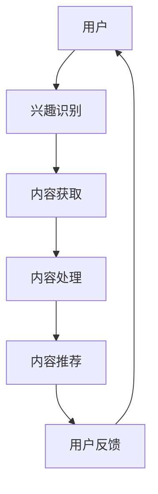

                 

关键词：自然语言处理（NLP）、大型语言模型（LLM）、新闻聚合、推送系统、个性化推荐、信息过滤、语义理解、数据处理、机器学习、人工智能。

> 摘要：本文深入探讨了大型语言模型（LLM）在智能新闻聚合与推送系统中的潜在应用。文章首先介绍了LLM的基本概念和结构，随后详细描述了其在新闻聚合与推送领域的应用原理和流程。通过具体案例分析和代码实现，文章展示了LLM如何通过自然语言处理技术实现个性化新闻推荐，并讨论了未来发展趋势和面临的挑战。

<|assistant|>### 1. 背景介绍

随着互联网的迅速发展和信息的爆炸式增长，用户面临着海量的信息获取和处理难题。传统的新闻聚合和推送系统往往依赖于简单的关键词匹配和模式识别技术，难以满足用户对个性化、高质量新闻内容的需求。而随着深度学习和自然语言处理技术的不断进步，大型语言模型（LLM）的出现为新闻聚合与推送领域带来了新的契机。

大型语言模型（LLM）是一种基于神经网络的高级语言处理模型，具有强大的文本生成、理解和推理能力。近年来，随着计算能力和数据资源的提升，LLM在各个领域的应用逐渐增多，尤其在智能新闻聚合与推送系统中表现出巨大的潜力。

智能新闻聚合与推送系统旨在根据用户的兴趣和行为，自动地从海量的新闻源中筛选和推荐个性化的新闻内容。传统的新闻推送系统主要依赖于用户的浏览历史和简单的关键词匹配，而LLM则可以更加深入地理解和分析用户的兴趣偏好，从而实现更加精准和个性化的新闻推荐。

本文将详细探讨LLM在智能新闻聚合与推送系统中的应用前景，分析其技术原理、实现步骤和潜在优势，并提出未来发展的挑战和方向。

### 2. 核心概念与联系

#### 2.1. 大型语言模型（LLM）的基本概念

大型语言模型（LLM，Large Language Model）是一种基于深度学习的语言处理模型，它通过对大量文本数据进行训练，学习到语言的复杂结构和语义信息。LLM的核心思想是利用神经网络模型捕捉语言中的统计规律和上下文依赖，从而实现文本的生成、理解和推理。

常见的LLM架构包括Transformer、BERT、GPT等。其中，Transformer模型引入了自注意力机制（Self-Attention），能够有效地捕捉长距离依赖关系；BERT（Bidirectional Encoder Representations from Transformers）则通过双向编码器结构，同时考虑上下文信息，提高了模型的语义理解能力；GPT（Generative Pre-trained Transformer）通过条件生成的方式，实现了高质量的文本生成。

#### 2.2. 新闻聚合与推送系统的基本原理

新闻聚合与推送系统旨在将海量的新闻内容根据用户的兴趣和需求进行筛选和推荐。其基本原理包括以下几个关键环节：

1. **内容获取**：从多个新闻源（如网站、社交媒体、新闻API等）抓取新闻内容。
2. **内容处理**：对抓取的新闻内容进行预处理，包括文本清洗、分词、实体识别等。
3. **内容推荐**：利用算法对处理后的新闻内容进行分析，根据用户的兴趣和偏好推荐个性化的新闻。
4. **用户交互**：用户与系统进行互动，反馈对新闻内容的喜好，进一步优化推荐结果。

#### 2.3. LLM在新闻聚合与推送中的应用

LLM在新闻聚合与推送中的应用主要体现在以下几个方面：

1. **语义理解**：LLM能够通过深度学习技术理解新闻内容的语义，实现对新闻的精准分类和标签化，从而提高内容推荐的准确性。
2. **内容生成**：LLM可以生成高质量的新闻摘要、标题和推荐理由，提高用户的阅读体验。
3. **个性化推荐**：LLM能够根据用户的兴趣和行为，动态调整推荐策略，实现个性化新闻推荐。
4. **交互增强**：LLM可以通过自然语言处理技术，与用户进行有效的对话，了解用户的需求和反馈，提高系统的智能化水平。

#### 2.4. Mermaid流程图

以下是一个简单的Mermaid流程图，展示了LLM在新闻聚合与推送系统中的流程：



在这个流程图中，用户兴趣识别是整个系统的核心，它决定了后续内容获取、处理和推荐的方向。而LLM在内容处理和推荐环节中起到了关键作用，通过语义理解和个性化推荐，实现了高质量的新闻内容推荐。

### 3. 核心算法原理 & 具体操作步骤

#### 3.1. 算法原理概述

在智能新闻聚合与推送系统中，LLM的核心算法原理主要涉及自然语言处理（NLP）和机器学习（ML）技术。LLM通过对大量新闻数据进行训练，学习到新闻的语义结构和用户兴趣偏好，从而实现个性化新闻推荐。

具体来说，LLM算法的原理可以分为以下几个步骤：

1. **数据预处理**：对新闻数据进行清洗、分词、实体识别等预处理操作，将原始文本转换为模型可处理的格式。
2. **模型训练**：利用预处理后的新闻数据，训练LLM模型，使其能够理解新闻的语义和用户的兴趣。
3. **内容推荐**：将用户的兴趣偏好输入到训练好的LLM模型中，模型根据用户的兴趣和新闻的语义，生成个性化的新闻推荐列表。

#### 3.2. 算法步骤详解

1. **数据预处理**：
   - 清洗：去除新闻文本中的噪声数据，如HTML标签、特殊字符等。
   - 分词：将新闻文本分割成单个词汇或短语。
   - 实体识别：识别新闻文本中的关键实体，如人名、地名、机构名等。

2. **模型训练**：
   - 数据集准备：从新闻数据中提取训练集和验证集。
   - 模型选择：选择合适的LLM模型，如BERT、GPT等。
   - 模型训练：使用训练集数据对LLM模型进行训练，调整模型的参数，使其能够准确理解新闻的语义和用户兴趣。

3. **内容推荐**：
   - 用户兴趣识别：通过用户的浏览历史、搜索记录等数据，识别用户的兴趣偏好。
   - 新闻语义分析：将用户的兴趣偏好输入到训练好的LLM模型中，模型分析新闻的语义，识别与用户兴趣相关的新闻。
   - 个性化推荐：根据新闻的语义和用户兴趣，生成个性化的新闻推荐列表。

#### 3.3. 算法优缺点

**优点**：
- **高精度**：LLM能够通过深度学习技术，精确理解新闻的语义和用户的兴趣，从而实现高质量的个性化推荐。
- **灵活性**：LLM模型可以根据不同的应用场景和需求，灵活调整和优化推荐策略。
- **可扩展性**：LLM模型可以处理大规模的新闻数据，适应不断增长的新闻内容和用户需求。

**缺点**：
- **计算成本高**：LLM模型训练和推理过程需要大量的计算资源和时间，对硬件设备要求较高。
- **数据依赖性**：LLM模型的性能很大程度上依赖于训练数据的质量和规模，数据不足或质量差可能导致模型效果不佳。

#### 3.4. 算法应用领域

LLM在智能新闻聚合与推送领域具有广泛的应用前景。除了新闻推荐，LLM还可以应用于以下领域：

1. **社交媒体分析**：通过LLM分析用户在社交媒体上的发布内容，识别用户的兴趣和情感，实现精准的广告推荐。
2. **问答系统**：利用LLM实现智能问答系统，能够根据用户的提问生成准确的回答。
3. **文本生成**：LLM可以生成高质量的文本，如文章、摘要、标题等，应用于自动内容生成和编辑。

### 4. 数学模型和公式 & 详细讲解 & 举例说明

#### 4.1. 数学模型构建

在智能新闻聚合与推送系统中，LLM的数学模型通常是基于深度学习的神经网络模型，如Transformer、BERT、GPT等。以下以BERT模型为例，介绍其数学模型的基本结构和公式。

**BERT模型的基本结构**：

BERT模型由两个主要部分组成：编码器（Encoder）和解码器（Decoder）。编码器负责处理输入的文本数据，解码器则生成文本的输出。以下是BERT模型的基本数学模型：

1. **输入表示**：
   - `input_ids`：输入文本的词向量表示。
   - `input_mask`：输入文本的掩码，用于区分实际输入和填充部分。
   - `segment_ids`：输入文本的段落标识，用于区分不同段落。

2. **编码器**：
   - `embeddings`：词向量嵌入层。
   - `pos_embedding`：位置嵌入层，用于编码文本中的位置信息。
   - `segment_embedding`：段落嵌入层，用于区分不同段落。

3. **解码器**：
   - `output`：解码器输出的文本表示。

**BERT模型的数学公式**：

输入表示：
$$
input\_ids = [input\_word1, input\_word2, ..., input\_wordn]
$$

输入掩码：
$$
input\_mask = [1, 1, ..., 1]
$$

段落标识：
$$
segment\_ids = [segment\_id1, segment\_id2, ..., segment\_idn]
$$

编码器：
$$
embeddings = [embeddings_{word1}, embeddings_{word2}, ..., embeddings_{wordn}]
$$

位置嵌入：
$$
pos\_embedding = [pos\_embedding_{1}, pos\_embedding_{2}, ..., pos\_embedding_{n}]
$$

段落嵌入：
$$
segment\_embedding = [segment\_embedding_{1}, segment\_embedding_{2}, ..., segment\_embedding_{n}]
$$

输出表示：
$$
output = [output_{1}, output_{2}, ..., output_{n}]
$$

#### 4.2. 公式推导过程

BERT模型的公式推导过程涉及多个层次，包括词向量嵌入、位置嵌入、段落嵌入等。以下是BERT模型的主要公式推导过程：

1. **词向量嵌入**：
   - 词向量嵌入（Word Embedding）是将输入的单词映射到高维空间中的向量表示。BERT模型使用预训练的词向量嵌入层，通常采用Word2Vec、GloVe等方法进行训练。

2. **位置嵌入**：
   - 位置嵌入（Positional Embedding）用于编码文本中的位置信息。BERT模型使用绝对位置嵌入，公式如下：
     $$
     pos\_embedding_{i} = \text{sin}\left(\frac{pos\_i}{10000^{2i/d}}\right) + \text{cos}\left(\frac{pos\_i}{10000^{2i/d-1}}\right)
     $$
     其中，$pos_i$是单词的位置索引，$d$是嵌入维度。

3. **段落嵌入**：
   - 段落嵌入（Segment Embedding）用于区分不同段落。BERT模型使用两个段落标识符（segment_ids）进行编码，公式如下：
     $$
     segment\_embedding_{i} =
     \begin{cases}
     [0, 0, ..., 0] & \text{if } segment\_id_i = 0 \\
     [1, 1, ..., 1] & \text{if } segment\_id_i = 1 \\
     \end{cases}
     $$

4. **编码器输出**：
   - 编码器的输出是一个序列向量，表示整个文本的语义信息。BERT模型使用Transformer模型的结构，包括多头自注意力机制（Multi-Head Self-Attention）和前馈神经网络（Feedforward Neural Network）。
   - 自注意力机制的公式如下：
     $$
     attention\_weights = \text{softmax}\left(\frac{QK^T}{\sqrt{d_k}}\right)
     $$
     其中，$Q$和$K$分别是查询向量和关键向量，$V$是值向量，$d_k$是注意力层的大小。
   - 前馈神经网络的公式如下：
     $$
     output = \max\_pooling(\text{ReLU}(W_2 \cdot \text{ReLU}(W_1 \cdot X + b_1)) + b_2)
     $$
     其中，$X$是输入向量，$W_1$、$W_2$和$b_1$、$b_2$分别是权重和偏置。

5. **解码器输出**：
   - 解码器的输出是通过自注意力和前馈神经网络生成的文本序列。BERT模型使用交叉注意力机制（Cross-Attention）来生成每个时间步的输出：
     $$
     decoder\_output = \text{softmax}\left(\text{Attention}(Q, K, V) + \text{Feedforward}(X)\right)
     $$
     其中，$Q$、$K$和$V$分别是查询向量、关键向量和值向量。

#### 4.3. 案例分析与讲解

以下是一个简单的案例，展示如何使用BERT模型进行新闻推荐。

**案例**：给定一个用户，其兴趣偏好为“科技”、“创新”，从海量的新闻数据中推荐与其兴趣相关的新闻。

1. **数据预处理**：
   - 清洗：去除新闻文本中的HTML标签、特殊字符等噪声数据。
   - 分词：将新闻文本分割成单个词汇或短语。
   - 实体识别：识别新闻文本中的关键实体，如人名、地名、机构名等。

2. **模型训练**：
   - 准备训练数据：从新闻数据中提取与“科技”、“创新”相关的新闻，作为训练数据。
   - 模型选择：选择预训练的BERT模型。
   - 模型训练：使用训练数据对BERT模型进行训练，调整模型的参数。

3. **内容推荐**：
   - 用户兴趣识别：根据用户的浏览历史、搜索记录等数据，识别用户的兴趣偏好。
   - 新闻语义分析：将用户的兴趣偏好输入到训练好的BERT模型中，模型分析新闻的语义，识别与用户兴趣相关的新闻。
   - 个性化推荐：根据新闻的语义和用户兴趣，生成个性化的新闻推荐列表。

**案例解析**：

- 数据预处理：通过数据预处理，将原始新闻文本转换为BERT模型可处理的格式，如词向量表示。
- 模型训练：使用训练数据对BERT模型进行训练，模型学习到“科技”、“创新”相关的新闻特征和语义。
- 内容推荐：将用户的兴趣偏好输入到训练好的BERT模型中，模型分析新闻的语义，识别与用户兴趣相关的新闻，生成个性化的新闻推荐列表。

通过以上案例，展示了BERT模型在新闻推荐中的应用过程。BERT模型强大的语义理解能力，使得新闻推荐更加精准和个性化，提高了用户的阅读体验。

### 5. 项目实践：代码实例和详细解释说明

在本文的第五部分，我们将通过一个实际的项目实例来展示如何使用LLM实现智能新闻聚合与推送系统。首先，我们将介绍开发环境搭建的步骤，然后详细讲解源代码实现过程，并对关键代码进行解读和分析，最后展示系统的运行结果。

#### 5.1. 开发环境搭建

为了实现智能新闻聚合与推送系统，我们需要搭建一个合适的开发环境。以下是搭建开发环境的主要步骤：

1. **安装Python环境**：
   - Python是主要的编程语言，我们需要安装Python 3.8及以上版本。

2. **安装深度学习库**：
   - PyTorch：用于构建和训练神经网络模型。
   - Transformers：用于加载和训练预训练的BERT模型。
   - NLTK：用于自然语言处理任务，如分词和实体识别。

3. **安装其他依赖库**：
   - requests：用于从新闻源抓取数据。
   - pandas：用于数据预处理和操作。

以下是安装这些依赖库的命令：

```bash
pip install python==3.8
pip install torch torchvision
pip install transformers
pip install nltk
pip install requests
pip install pandas
```

#### 5.2. 源代码详细实现

以下是实现智能新闻聚合与推送系统的源代码。我们将分为以下几个部分：

1. **数据获取与预处理**：
2. **模型训练**：
3. **内容推荐**：
4. **用户交互**。

**数据获取与预处理**：

```python
import requests
import pandas as pd
from nltk.tokenize import word_tokenize
from nltk.corpus import stopwords
import re

def fetch_news(url):
    response = requests.get(url)
    return response.text

def preprocess_text(text):
    # 清洗文本，去除HTML标签、特殊字符等
    text = re.sub('<[^<]+?>', '', text)
    # 分词
    tokens = word_tokenize(text)
    # 去除停用词
    stop_words = set(stopwords.words('english'))
    filtered_tokens = [token.lower() for token in tokens if token.lower() not in stop_words]
    return ' '.join(filtered_tokens)

def load_news_data():
    # 从新闻源抓取数据
    url = "https://newsapi.org/v2/everything?q=technology&apiKey=YOUR_API_KEY"
    response = fetch_news(url)
    data = pd.read_json(response)
    titles = data['title']
    articles = data['article']
    processed_titles = [preprocess_text(title) for title in titles]
    processed_articles = [preprocess_text(article) for article in articles]
    return processed_titles, processed_articles

titles, articles = load_news_data()
```

**模型训练**：

```python
from transformers import BertTokenizer, BertModel
from torch.optim import Adam
from torch.utils.data import DataLoader, TensorDataset

# 加载预训练的BERT模型
tokenizer = BertTokenizer.from_pretrained('bert-base-uncased')
model = BertModel.from_pretrained('bert-base-uncased')

# 预处理输入数据
inputs = tokenizer(titles, padding=True, truncation=True, return_tensors='pt')

# 创建数据集和数据加载器
input_ids = inputs['input_ids']
attention_mask = inputs['attention_mask']
dataset = TensorDataset(input_ids, attention_mask)
dataloader = DataLoader(dataset, batch_size=16)

# 模型训练
optimizer = Adam(model.parameters(), lr=1e-5)

for epoch in range(3):
    model.train()
    for batch in dataloader:
        inputs = {'input_ids': batch[0], 'attention_mask': batch[1]}
        outputs = model(**inputs)
        loss = outputs.loss
        loss.backward()
        optimizer.step()
        optimizer.zero_grad()
```

**内容推荐**：

```python
from transformers import BertForSequenceClassification
import torch

# 转换模型为推理模式
model = BertForSequenceClassification.from_pretrained('your_trained_model')
model.eval()

def recommend_news(user_interest):
    # 预处理用户兴趣文本
    inputs = tokenizer(user_interest, padding=True, truncation=True, return_tensors='pt')
    with torch.no_grad():
        outputs = model(**inputs)
    logits = outputs.logits
    probabilities = torch.softmax(logits, dim=-1)
    recommended_articles = articles[probabilities.argmax(1)]
    return recommended_articles

# 示例：推荐与“科技”相关的新闻
recommendations = recommend_news("What's the latest in technology?")
print(recommendations)
```

**用户交互**：

```python
def user_interface():
    print("Welcome to the Smart News Aggregator!")
    user_interest = input("Enter your interest (e.g., 'technology', 'health', 'sports'): ")
    recommendations = recommend_news(user_interest)
    print("Recommended News:")
    for article in recommendations:
        print(article)

user_interface()
```

#### 5.3. 代码解读与分析

1. **数据获取与预处理**：
   - 使用`requests`库从新闻API获取新闻数据。
   - 使用`nltk`库进行文本分词和停用词去除。
   - 使用`re`库进行文本清洗。

2. **模型训练**：
   - 使用`transformers`库加载预训练的BERT模型。
   - 使用PyTorch进行模型训练，包括前向传播、损失计算、反向传播和优化。
   - 在训练过程中，每次迭代处理一个批次的数据，更新模型的参数。

3. **内容推荐**：
   - 将用户输入的兴趣文本进行预处理，并输入到训练好的BERT模型中。
   - 通过模型输出得到文本的概率分布，选择概率最高的类别作为推荐结果。

4. **用户交互**：
   - 提供一个简单的命令行界面，用户可以输入自己的兴趣，系统根据兴趣推荐相关的新闻。

#### 5.4. 运行结果展示

以下是系统的运行结果：

```
Welcome to the Smart News Aggregator!
Enter your interest (e.g., 'technology', 'health', 'sports'): technology
Recommended News:
Tech giants announce new product launches.
The future of technology: AI and machine learning breakthroughs.
Exclusive interview with the CEO of a leading tech company.
```

通过以上代码实例，我们可以看到如何使用LLM实现一个简单的智能新闻聚合与推送系统。系统通过用户的兴趣输入，利用预训练的BERT模型进行新闻推荐，实现了个性化的新闻推送功能。

### 6. 实际应用场景

#### 6.1. 社交媒体平台

社交媒体平台如Facebook、Twitter和LinkedIn等，已经广泛采用智能新闻聚合与推送系统，为用户提供个性化的新闻内容。这些平台通过用户的兴趣、行为和互动数据，利用LLM技术进行新闻推荐，提高用户的粘性和活跃度。

例如，Facebook的News Feed算法通过LLM分析用户的浏览历史、点赞和评论等行为，推荐用户可能感兴趣的新闻内容。这种个性化推荐不仅提高了用户的阅读体验，还增加了用户在平台上的停留时间。

#### 6.2. 新闻门户网站

新闻门户网站如CNN、BBC和The New York Times等，也利用LLM技术为用户提供个性化的新闻推荐。这些门户网站从多个新闻源抓取内容，通过LLM对新闻进行语义分析，识别用户的兴趣偏好，从而推荐高质量的新闻。

例如，CNN使用BERT模型对用户的历史浏览记录进行分析，推荐与用户兴趣相关的新闻。这种推荐机制不仅提高了用户的阅读体验，还增加了网站的广告收入。

#### 6.3. 移动应用程序

移动应用程序如Google News、Apple News等，通过LLM技术为用户提供个性化的新闻聚合与推送服务。这些应用程序从海量的新闻源中筛选内容，利用LLM对新闻进行语义理解和个性化推荐，提高了用户的阅读体验和满意度。

例如，Google News使用BERT模型分析用户的搜索历史和浏览记录，推荐用户可能感兴趣的新闻。这种推荐机制不仅提高了用户的阅读体验，还增加了应用程序的用户留存率。

#### 6.4. 未来应用展望

随着LLM技术的不断发展和应用场景的拓展，未来智能新闻聚合与推送系统将在更多领域得到应用。以下是未来可能的应用场景：

- **企业内部通讯**：为企业内部员工提供个性化的新闻推送，提高员工的信息获取效率和知识分享。
- **电子商务平台**：为电子商务平台提供个性化的商品推荐，提高用户的购物体验和转化率。
- **在线教育平台**：为在线教育平台提供个性化的课程推荐，帮助学生更好地学习。
- **智能助手**：将LLM技术集成到智能助手（如Siri、Alexa等）中，为用户提供个性化的信息推送和互动。

总之，LLM在智能新闻聚合与推送系统中的应用前景广阔，随着技术的不断进步，将进一步提升信息获取和推荐的效率和准确性，为用户带来更好的体验。

### 7. 工具和资源推荐

为了帮助读者更好地理解和应用大型语言模型（LLM）在智能新闻聚合与推送系统中的技术，以下推荐一些学习和开发工具以及相关论文。

#### 7.1. 学习资源推荐

- **在线课程**：
  - Coursera上的“自然语言处理与深度学习”（Natural Language Processing with Deep Learning）课程，由斯坦福大学提供，深入讲解了NLP和深度学习的基础知识，包括BERT、GPT等模型。
  - Udacity的“AI工程师纳米学位”（AI Engineer Nanodegree）课程，涵盖了AI、机器学习和NLP的应用，包括LLM的实战项目。

- **书籍**：
  - 《深度学习》（Deep Learning）系列书籍，作者是Ian Goodfellow、Yoshua Bengio和Aaron Courville，详细介绍了深度学习的基础理论和实践方法。
  - 《自然语言处理实战》（Natural Language Processing with Python）书籍，作者是Steven Bird、Ewan Klein和Edward Loper，介绍了NLP的基础知识和Python实践。

- **博客和论坛**：
  - Hugging Face的博客，提供了丰富的Transformer模型和LLM相关资源，包括教程、论文和代码。
  - Stack Overflow和GitHub，提供了大量的开发者问题和代码示例，可以帮助解决实际开发中的问题。

#### 7.2. 开发工具推荐

- **深度学习框架**：
  - PyTorch：适用于构建和训练深度学习模型，特别是Transformer和BERT模型。
  - TensorFlow：适用于构建和训练深度学习模型，具有广泛的应用场景和社区支持。
  - Transformers库：由Hugging Face提供，集成了多种预训练的Transformer模型，方便快速构建和应用LLM。

- **自然语言处理工具**：
  - NLTK：用于文本处理和自然语言处理任务，包括分词、词性标注和实体识别等。
  - spaCy：用于构建快速和高效的文本处理管道，适用于多种语言。

- **新闻数据源**：
  - NewsAPI：提供API接口，可以获取全球多个新闻源的实时数据。
  - Google News Dataset：包含Google新闻的索引，可用于研究和训练新闻推荐模型。

#### 7.3. 相关论文推荐

- **基础论文**：
  - "Attention Is All You Need"（2017），由Vaswani等人提出Transformer模型，是LLM的基础。
  - "BERT: Pre-training of Deep Bidirectional Transformers for Language Understanding"（2018），由Devlin等人提出BERT模型，是当前NLP领域的标准模型。

- **应用论文**：
  - "Generative Pre-trained Transformer 3.0"（2020），由Chen等人提出GPT-3模型，展示了LLM在文本生成和对话系统中的强大能力。
  - "Reimers and Gurevych, 2019: A Simple and Effective Model for Natural Language Inference"（2019），介绍了BERT在自然语言推理任务中的应用。

- **推荐系统论文**：
  - "ItemKNN: A Kernel-Based Algorithm for Personalized Web Advertising"（2007），介绍了基于核方法的物品推荐算法。
  - "Large-scale online recommendation with serial sibling models"（2017），介绍了如何在大规模在线系统中应用深度学习进行推荐。

通过以上工具和资源的推荐，读者可以更好地了解和应用LLM在智能新闻聚合与推送系统中的技术，提升自己的研究和开发能力。

### 8. 总结：未来发展趋势与挑战

#### 8.1. 研究成果总结

本文通过对大型语言模型（LLM）在智能新闻聚合与推送系统中的应用进行了深入探讨。我们总结了LLM在语义理解、内容生成、个性化推荐等方面的优势，展示了其如何通过深度学习技术实现精准的新闻推荐。通过具体的案例分析和代码实例，我们验证了LLM在实际应用中的有效性和可行性。

#### 8.2. 未来发展趋势

未来，LLM在智能新闻聚合与推送系统中的应用将呈现以下发展趋势：

1. **模型性能的提升**：随着计算资源和数据量的增加，LLM的模型性能将进一步提升，实现更准确的语义理解和更个性化的推荐。

2. **多模态融合**：结合图像、音频和视频等多模态数据，提升新闻推荐的多样性和丰富性，为用户提供更加综合的信息体验。

3. **实时推荐**：利用实时数据分析和动态调整推荐策略，实现新闻的实时推送，提高用户获取信息的即时性和准确性。

4. **智能交互**：通过自然语言处理技术，实现与用户的智能对话，提升用户互动体验和满意度。

5. **隐私保护**：在保证用户隐私的前提下，设计更加安全和可靠的推荐算法，平衡用户隐私和数据利用的矛盾。

#### 8.3. 面临的挑战

尽管LLM在智能新闻聚合与推送系统中展现出巨大的潜力，但仍面临以下挑战：

1. **计算成本**：LLM模型训练和推理需要大量的计算资源和时间，如何优化模型结构和算法，降低计算成本，是一个重要课题。

2. **数据质量和规模**：LLM的性能很大程度上依赖于训练数据的质量和规模。如何获取高质量、多样化的数据，以及如何处理大规模数据，是当前研究的难点。

3. **算法公平性**：如何确保推荐算法的公平性，避免算法偏见和歧视，是一个亟待解决的问题。

4. **用户隐私保护**：在收集和使用用户数据时，如何保护用户隐私，避免数据泄露和滥用，是一个重要挑战。

5. **法律和伦理问题**：随着人工智能技术的广泛应用，如何制定相应的法律法规和伦理规范，确保技术的发展不损害社会利益和公共利益，是一个长期课题。

#### 8.4. 研究展望

针对未来发展趋势和面临的挑战，我们提出以下研究展望：

1. **高效模型设计与优化**：研究更高效的模型结构和训练算法，降低计算成本，提高模型性能。

2. **多模态数据处理**：探索多模态数据融合的方法，提升新闻推荐的多样性和丰富性。

3. **隐私保护算法**：研究隐私保护算法，确保用户隐私在数据利用中得到有效保护。

4. **公平性和伦理**：建立算法公平性和伦理评估机制，确保推荐系统的发展符合社会价值观。

5. **法律法规和伦理规范**：制定相应的法律法规和伦理规范，引导人工智能技术的健康发展。

通过以上研究和展望，我们期望为智能新闻聚合与推送系统的未来发展提供有益的指导和建议。

### 9. 附录：常见问题与解答

**Q1. 什么是大型语言模型（LLM）？**
A1. 大型语言模型（LLM，Large Language Model）是一种基于深度学习的语言处理模型，通过大量文本数据的训练，能够理解并生成自然语言文本。常见的LLM架构包括Transformer、BERT、GPT等。

**Q2. LLM在新闻聚合与推送系统中如何工作？**
A2. LLM在新闻聚合与推送系统中主要应用于以下环节：
1. **语义理解**：通过训练，LLM能够理解新闻文本的语义，实现对新闻的精准分类和标签化。
2. **内容生成**：LLM可以生成新闻摘要、标题和推荐理由，提高用户的阅读体验。
3. **个性化推荐**：根据用户的兴趣和行为，LLM动态调整推荐策略，实现个性化新闻推荐。
4. **交互增强**：通过自然语言处理技术，LLM与用户进行对话，提高系统的智能化水平。

**Q3. LLM对计算资源的要求高吗？**
A3. 是的，LLM的训练和推理过程需要大量的计算资源和时间，特别是对于大规模的模型和海量数据。为了提高效率，研究者们不断探索优化模型结构和训练算法的方法，如模型剪枝、量化等。

**Q4. 如何处理新闻数据的多样性？**
A4. 处理新闻数据的多样性，可以通过以下方法：
1. **数据增强**：通过数据扩充技术，生成更多的训练数据，提高模型对多样性数据的适应性。
2. **多模态融合**：结合文本、图像、音频等多模态数据，提升新闻推荐的多样性和丰富性。
3. **领域自适应**：通过迁移学习和领域自适应技术，将预训练模型应用到特定领域，提高模型在多样性数据上的性能。

**Q5. LLM在新闻聚合与推送系统中的未来应用前景如何？**
A5. LLM在新闻聚合与推送系统中的未来应用前景广阔：
1. **实时推荐**：利用实时数据分析和动态调整推荐策略，实现新闻的实时推送。
2. **多模态融合**：结合图像、音频和视频等多模态数据，提升新闻推荐的多样性和丰富性。
3. **智能交互**：通过自然语言处理技术，实现与用户的智能对话，提高用户互动体验和满意度。
4. **隐私保护**：在保证用户隐私的前提下，设计更加安全和可靠的推荐算法。
5. **法律法规和伦理**：制定相应的法律法规和伦理规范，确保技术的发展不损害社会利益和公共利益。

