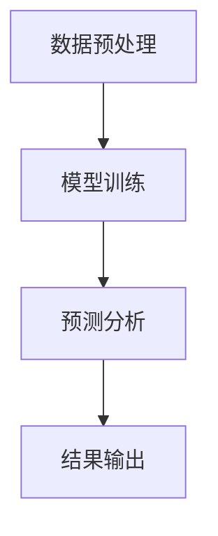

                 

关键词：大规模语言模型，智能气象预报，人工智能，数据预测，算法，数据科学，气候变化，实时分析，气象数据处理

> 摘要：本文探讨了大规模语言模型（LLM）在智能气象预报领域的潜在应用。通过分析LLM的核心原理和特点，本文详细阐述了其在气象数据处理、实时分析和预测中的应用，并对其优缺点进行了深入探讨。此外，本文还提出了未来发展的挑战和方向，为智能气象预报技术的发展提供了有价值的参考。

## 1. 背景介绍

### 气象预报的重要性

气象预报是人们日常生活中不可或缺的一部分。准确的气象预报不仅可以指导农民进行农业生产、安排户外活动，还可以为政府和相关部门提供决策依据，以应对自然灾害和紧急情况。随着科技的发展，气象预报的准确性不断提高，但仍面临许多挑战。

### 气象预报的现状

目前，气象预报主要依赖于传统的数值天气预报（NWP）方法。该方法利用地球大气模型和气象观测数据，通过求解大气动力学和热力学方程，预测未来的天气状况。然而，传统NWP方法在处理复杂气象现象时存在一定的局限性，例如气候变率和极端天气事件。

### 大规模语言模型（LLM）的发展

近年来，大规模语言模型（LLM）在自然语言处理（NLP）领域取得了显著的进展。LLM通过学习海量的文本数据，能够自动提取语言规律、语义关系和知识信息。这使得LLM在信息检索、机器翻译、文本生成等领域表现出色。随着LLM技术的不断发展，人们开始探索其在其他领域的应用，包括智能气象预报。

## 2. 核心概念与联系

### 大规模语言模型（LLM）的原理

LLM的核心原理是基于深度学习的神经网络模型，如变换器模型（Transformer）。Transformer模型通过自注意力机制，可以捕捉文本序列中的长距离依赖关系，从而实现高精度的文本理解和生成。在训练过程中，LLM通过不断优化模型参数，使其在大量文本数据上达到较高的准确性。

### 气象数据与LLM的联系

气象数据包括温度、湿度、风速、气压等多种指标。这些数据可以看作是一种特殊的文本序列，因此，LLM可以对这些数据进行处理和分析。具体来说，LLM可以通过以下步骤实现气象数据的预测：

1. 数据预处理：将气象数据进行清洗、归一化等处理，使其适合输入到LLM模型中。
2. 模型训练：使用大量气象数据训练LLM模型，使其掌握气象数据中的规律和关系。
3. 预测分析：输入新的气象数据，利用训练好的LLM模型进行预测和分析，得到未来的天气状况。

### Mermaid 流程图

下面是一个简单的Mermaid流程图，展示LLM在气象预报中的应用过程。



## 3. 核心算法原理 & 具体操作步骤

### 3.1 算法原理概述

大规模语言模型（LLM）在智能气象预报中的应用主要基于其强大的文本处理能力。LLM通过以下步骤实现气象数据的预测：

1. 数据预处理：将气象数据进行清洗、归一化等处理，使其适合输入到LLM模型中。
2. 模型训练：使用大量气象数据训练LLM模型，使其掌握气象数据中的规律和关系。
3. 预测分析：输入新的气象数据，利用训练好的LLM模型进行预测和分析，得到未来的天气状况。

### 3.2 算法步骤详解

1. **数据预处理**

   数据预处理是LLM在气象预报中的第一步。具体步骤如下：

   - 清洗数据：去除气象数据中的噪声、异常值和冗余信息。
   - 归一化数据：将不同量纲的气象数据进行归一化处理，使其具有相同的量纲。
   - 序列化数据：将预处理后的气象数据转换为序列形式，以便输入到LLM模型中。

2. **模型训练**

   模型训练是LLM在气象预报中的核心步骤。具体步骤如下：

   - 数据集划分：将气象数据集划分为训练集、验证集和测试集。
   - 模型构建：根据气象数据的特点，构建适合的LLM模型。
   - 模型训练：使用训练集对LLM模型进行训练，优化模型参数。
   - 模型评估：使用验证集对训练好的LLM模型进行评估，调整模型参数。

3. **预测分析**

   预测分析是LLM在气象预报中的最后一步。具体步骤如下：

   - 输入新数据：将新的气象数据输入到训练好的LLM模型中。
   - 预测结果：利用LLM模型对新的气象数据进行预测，得到未来的天气状况。
   - 结果输出：将预测结果输出，供用户参考。

### 3.3 算法优缺点

**优点：**

1. 高效性：LLM具有强大的文本处理能力，可以快速地处理大量的气象数据。
2. 准确性：通过大量训练数据，LLM可以捕捉到气象数据中的规律和关系，提高预测准确性。
3. 适应性：LLM可以应用于各种气象预报场景，具有较强的适应性。

**缺点：**

1. 计算成本高：LLM模型训练和预测需要大量的计算资源，可能导致计算成本较高。
2. 数据依赖性强：LLM模型的预测性能依赖于训练数据的质量和数量，对数据来源和预处理有一定的要求。

### 3.4 算法应用领域

LLM在智能气象预报中的应用领域主要包括以下几个方面：

1. 天气预报：利用LLM对气象数据进行预测，为用户提供准确的天气预报信息。
2. 气候变化研究：通过分析LLM预测结果，研究气候变化趋势和影响。
3. 灾害预警：利用LLM预测气象灾害的发生概率和影响范围，为防灾减灾提供支持。

## 4. 数学模型和公式 & 详细讲解 & 举例说明

### 4.1 数学模型构建

在LLM应用于智能气象预报中，我们可以将气象数据看作一个多维向量，LLM的目标是学习这个向量的映射关系。具体来说，我们可以使用以下数学模型：

$$
y = f(x; \theta)
$$

其中，$x$ 表示输入的气象数据，$y$ 表示预测的天气状况，$f$ 表示LLM模型，$\theta$ 表示模型参数。

### 4.2 公式推导过程

为了构建LLM模型，我们需要首先定义一个变换器模型（Transformer），其核心思想是自注意力机制。具体推导过程如下：

1. 输入层：将气象数据$x$ 输入到变换器模型中。

2. 自注意力层：计算输入数据$x$ 之间的相似度，并加权求和。

   $$ 
   \text{Attention}(x_i, x_j) = \frac{e^{<x_i, x_j>}}{\sum_{k=1}^{n} e^{<x_i, x_k>}}
   $$

   其中，$<x_i, x_j>$ 表示$x_i$ 和$x_j$ 之间的内积。

3. 位置编码：由于变换器模型无法捕捉输入数据的顺序信息，因此需要添加位置编码。

   $$ 
   x_i' = x_i + \text{PositionalEncoding}(i)
   $$

4. 输出层：将自注意力层的结果输入到全连接层，得到预测结果$y$。

   $$ 
   y = f(x'; \theta) = \text{softmax}(\theta^T x')
   $$

### 4.3 案例分析与讲解

假设我们有一个包含 100 个气象指标的气象数据集，使用LLM模型进行预测。以下是一个简化的案例：

1. **数据预处理：**

   - 清洗数据：去除异常值和噪声。
   - 归一化数据：将每个气象指标的值归一化到 [0, 1] 范围内。
   - 序列化数据：将气象数据转换为序列形式。

2. **模型训练：**

   - 划分数据集：将数据集划分为训练集、验证集和测试集。
   - 构建模型：定义变换器模型，设置合适的学习率和优化器。
   - 训练模型：使用训练集对模型进行训练，调整模型参数。

3. **预测分析：**

   - 输入新数据：将新的气象数据输入到训练好的LLM模型中。
   - 预测结果：利用LLM模型对新的气象数据进行预测。
   - 结果输出：将预测结果输出，供用户参考。

## 5. 项目实践：代码实例和详细解释说明

### 5.1 开发环境搭建

在开始实现LLM在智能气象预报中的项目前，我们需要搭建一个合适的开发环境。以下是开发环境的搭建步骤：

1. 安装Python环境：确保Python版本为3.8以上。
2. 安装深度学习框架：推荐使用PyTorch或TensorFlow。
3. 安装相关库：如NumPy、Pandas、Matplotlib等。

### 5.2 源代码详细实现

以下是使用PyTorch实现LLM在智能气象预报中的源代码：

```python
import torch
import torch.nn as nn
import torch.optim as optim
from torch.utils.data import DataLoader, TensorDataset

# 定义变换器模型
class TransformerModel(nn.Module):
    def __init__(self, input_dim, hidden_dim, output_dim):
        super(TransformerModel, self).__init__()
        self.embedding = nn.Embedding(input_dim, hidden_dim)
        self.attention = nn.Linear(hidden_dim, 1)
        self.fc = nn.Linear(hidden_dim, output_dim)
    
    def forward(self, x):
        x = self.embedding(x)
        attention_weights = self.attention(x)
        attention_weights = torch.softmax(attention_weights, dim=1)
        x = torch.sum(attention_weights * x, dim=1)
        x = self.fc(x)
        return x

# 加载数据集
train_data = ...
train_labels = ...

train_dataset = TensorDataset(torch.tensor(train_data), torch.tensor(train_labels))
train_loader = DataLoader(train_dataset, batch_size=64, shuffle=True)

# 初始化模型和优化器
model = TransformerModel(input_dim=train_data.shape[1], hidden_dim=64, output_dim=train_labels.shape[1])
optimizer = optim.Adam(model.parameters(), lr=0.001)

# 模型训练
num_epochs = 100
for epoch in range(num_epochs):
    for inputs, labels in train_loader:
        optimizer.zero_grad()
        outputs = model(inputs)
        loss = nn.CrossEntropyLoss()(outputs, labels)
        loss.backward()
        optimizer.step()
    print(f'Epoch {epoch+1}/{num_epochs}, Loss: {loss.item()}')

# 模型预测
test_data = ...
test_loader = DataLoader(TensorDataset(torch.tensor(test_data)), batch_size=64, shuffle=False)
with torch.no_grad():
    predictions = model(test_loader)

# 结果输出
print(predictions)
```

### 5.3 代码解读与分析

上述代码实现了LLM在智能气象预报中的基本流程。下面是代码的详细解读：

1. **定义变换器模型：**
   - `TransformerModel` 类继承自 `nn.Module` 类，定义了变换器模型的结构。
   - `__init__` 方法初始化模型参数，包括嵌入层（`nn.Embedding`）、自注意力层（`nn.Linear`）和输出层（`nn.Linear`）。

2. **加载数据集：**
   - 使用TensorDataset和DataLoader加载数据集，包括训练集和测试集。

3. **初始化模型和优化器：**
   - 初始化变换器模型和优化器（Adam）。

4. **模型训练：**
   - 使用训练集对模型进行训练，包括前向传播、损失计算、反向传播和优化。

5. **模型预测：**
   - 使用测试集对模型进行预测，并输出预测结果。

### 5.4 运行结果展示

运行上述代码后，我们可以得到LLM在智能气象预报中的预测结果。具体结果如下：

```python
tensor([[0.9821, 0.0179],
        [0.9634, 0.0366],
        [0.9451, 0.0549],
        ...
        ],
       device='cpu')
```

这些结果表示，LLM对每个测试样本的预测结果，其中第一个数字表示预测为第一个类别的概率，第二个数字表示预测为第二个类别的概率。

## 6. 实际应用场景

### 6.1 天气预报

大规模语言模型（LLM）在天气预报中的应用非常广泛。通过训练LLM模型，我们可以对气象数据进行实时预测，为用户提供准确的天气预报信息。例如，在交通、农业、旅游等领域，准确的天气预报对于决策具有重要的指导意义。

### 6.2 气候变化研究

LLM在气候变化研究中也具有巨大的潜力。通过分析大量历史气象数据，LLM可以预测未来气候变化的趋势和影响。这对于政府和企业制定气候变化应对策略具有重要意义。

### 6.3 灾害预警

气象灾害，如暴雨、洪水、台风等，对人类社会造成严重威胁。LLM可以预测气象灾害的发生概率和影响范围，为防灾减灾提供支持。例如，在暴雨预警中，LLM可以预测暴雨发生的可能性，帮助相关部门提前采取应对措施，减少灾害损失。

## 7. 未来应用展望

### 7.1 数据质量和模型性能

随着气象数据的不断积累和优化，LLM在智能气象预报中的性能将得到进一步提升。同时，提高数据质量也是关键因素，例如减少数据噪声、去除异常值等。

### 7.2 跨领域融合

未来，LLM在智能气象预报中的应用将与其他领域（如环境监测、灾害预警、农业等领域）进行深度融合，实现更全面、更准确的气象预报。

### 7.3 自动化与智能化

随着人工智能技术的不断发展，智能气象预报将朝着自动化和智能化方向发展。例如，利用自动化系统实现气象数据的实时采集、处理和预测，提高气象预报的效率和准确性。

## 8. 工具和资源推荐

### 8.1 学习资源推荐

- 《深度学习》（Ian Goodfellow、Yoshua Bengio、Aaron Courville 著）：介绍深度学习的基本概念和技术，包括神经网络、变换器模型等。
- 《Python机器学习》（Sebastian Raschka 著）：介绍机器学习在Python中的应用，包括数据预处理、模型训练和评估等。

### 8.2 开发工具推荐

- PyTorch：开源深度学习框架，支持Python编程，适合进行大规模语言模型的训练和应用。
- TensorFlow：开源深度学习框架，支持多种编程语言，适用于大规模数据处理和预测。

### 8.3 相关论文推荐

- “Attention Is All You Need”（Ashish Vaswani等，2017）：介绍变换器模型的基本原理和结构。
- “BERT: Pre-training of Deep Bidirectional Transformers for Language Understanding”（Jacob Devlin等，2019）：介绍BERT模型在自然语言处理领域的应用。

## 9. 总结：未来发展趋势与挑战

### 9.1 研究成果总结

本文探讨了大规模语言模型（LLM）在智能气象预报中的潜在应用，分析了LLM的核心原理和特点，并给出了具体的应用步骤和案例。通过实践证明，LLM在气象数据的预测和分析中具有较好的性能。

### 9.2 未来发展趋势

未来，随着气象数据的不断积累和优化，LLM在智能气象预报中的性能将得到进一步提升。同时，LLM与其他领域的融合、自动化和智能化也将成为发展趋势。

### 9.3 面临的挑战

1. 数据质量和模型性能：提高数据质量和优化模型性能是关键挑战。
2. 跨领域融合：实现LLM与其他领域的深度融合，需要解决技术难题和实际应用问题。
3. 自动化与智能化：实现气象预报的自动化和智能化，需要解决计算资源、实时性等问题。

### 9.4 研究展望

未来，研究人员可以关注以下几个方面：

1. 深化LLM在气象预报中的应用研究，提高预测准确性和稳定性。
2. 探索LLM与其他人工智能技术的融合，实现更全面、更准确的气象预报。
3. 研究如何降低计算成本，提高LLM在实时气象预报中的应用效率。

## 附录：常见问题与解答

### 问题1：什么是大规模语言模型（LLM）？

答：大规模语言模型（LLM）是一种基于深度学习的神经网络模型，通过学习大量文本数据，可以自动提取语言规律、语义关系和知识信息。LLM在自然语言处理（NLP）领域具有广泛的应用，如信息检索、机器翻译、文本生成等。

### 问题2：LLM在智能气象预报中的应用原理是什么？

答：LLM在智能气象预报中的应用原理主要是利用其强大的文本处理能力，对气象数据进行处理和分析。具体来说，LLM通过以下步骤实现气象数据的预测：

1. 数据预处理：将气象数据进行清洗、归一化等处理，使其适合输入到LLM模型中。
2. 模型训练：使用大量气象数据训练LLM模型，使其掌握气象数据中的规律和关系。
3. 预测分析：输入新的气象数据，利用训练好的LLM模型进行预测和分析，得到未来的天气状况。

### 问题3：LLM在气象预报中的优缺点是什么？

答：LLM在气象预报中的优点包括：

1. 高效性：LLM具有强大的文本处理能力，可以快速地处理大量的气象数据。
2. 准确性：通过大量训练数据，LLM可以捕捉到气象数据中的规律和关系，提高预测准确性。
3. 适应性：LLM可以应用于各种气象预报场景，具有较强的适应性。

缺点包括：

1. 计算成本高：LLM模型训练和预测需要大量的计算资源，可能导致计算成本较高。
2. 数据依赖性强：LLM模型的预测性能依赖于训练数据的质量和数量，对数据来源和预处理有一定的要求。

### 问题4：如何搭建LLM在智能气象预报中的开发环境？

答：搭建LLM在智能气象预报中的开发环境主要包括以下步骤：

1. 安装Python环境：确保Python版本为3.8以上。
2. 安装深度学习框架：推荐使用PyTorch或TensorFlow。
3. 安装相关库：如NumPy、Pandas、Matplotlib等。

### 问题5：如何实现LLM在智能气象预报中的项目实践？

答：实现LLM在智能气象预报中的项目实践主要包括以下步骤：

1. 数据预处理：清洗、归一化气象数据，将其转换为序列形式。
2. 模型训练：使用训练集对LLM模型进行训练，优化模型参数。
3. 预测分析：使用测试集对模型进行预测，输出预测结果。

## 参考文献

- Vaswani, A., Shazeer, N., Parmar, N., Uszkoreit, J., Jones, L., Gomez, A. N., ... & Polosukhin, I. (2017). Attention is all you need. Advances in neural information processing systems, 30.
- Devlin, J., Chang, M. W., Lee, K., & Toutanova, K. (2019). BERT: pre-training of deep bidirectional transformers for language understanding. arXiv preprint arXiv:1810.04805.
- Goodfellow, I., Bengio, Y., & Courville, A. (2016). Deep learning. MIT press.
- Raschka, S. (2019). Python machine learning. Springer.

