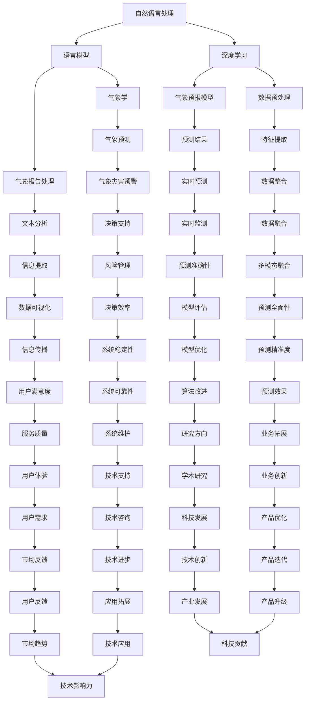

                 

关键词：自然语言处理、语言模型、智能气象预报、数据驱动的预测、气象学、人工智能应用、深度学习

> 摘要：本文将探讨大型语言模型（LLM）在智能气象预报领域的潜在作用。随着自然语言处理技术的不断发展，LLM在理解和生成人类语言方面取得了显著进展，为气象预报提供了新的技术手段。本文将首先介绍智能气象预报的基本概念和背景，然后深入探讨LLM在气象预报中的具体应用，包括数据预处理、预测模型构建、预测结果优化等方面。最后，我们将展望LLM在气象预报领域的发展前景，并提出未来的研究挑战。

## 1. 背景介绍

气象预报是人们日常生活中不可或缺的一部分。从简单的天气预报到复杂的气候模型，气象预报对于农业生产、城市规划、自然灾害防范等都有着重要的影响。然而，传统的气象预报方法往往依赖于历史数据和统计模型，难以应对日益复杂的气象现象和变化。随着人工智能技术的快速发展，特别是自然语言处理（NLP）和深度学习技术的突破，人们开始探索将LLM应用于气象预报中，以提升预测的准确性和效率。

自然语言处理是一种让计算机理解和生成人类语言的技术。它涵盖了文本分类、情感分析、机器翻译、语音识别等多个方面。近年来，随着大型语言模型（如GPT、BERT）的出现，NLP技术取得了显著进展。这些模型通过学习海量文本数据，能够生成高质量的文本，理解复杂的语言结构，为各个领域的应用提供了强有力的支持。

智能气象预报是指利用人工智能技术，特别是深度学习和自然语言处理技术，对气象数据进行分析和预测。与传统气象预报方法相比，智能气象预报能够处理海量数据，提取关键特征，并利用先进的算法进行预测。这为提高气象预报的准确性和实时性提供了新的途径。

### 1.1 智能气象预报的发展历程

智能气象预报的发展历程可以分为几个阶段：

1. **初步探索阶段**：早在20世纪60年代，计算机就开始用于气象预报。最初的气象预报模型主要是基于物理原理和数学模型，如数值天气预测模型。这些模型能够处理简单的气象现象，但面临着计算资源和数据限制。

2. **数据驱动的预测阶段**：随着计算机性能的提升和气象观测数据的增加，数据驱动的预测方法逐渐取代了物理模型。机器学习和统计模型被广泛应用于气象预报，如回归分析、决策树、支持向量机等。

3. **深度学习和自然语言处理阶段**：近年来，深度学习和自然语言处理技术的突破，为智能气象预报带来了新的机遇。大型语言模型（LLM）的出现，使得气象预报能够更好地理解和生成人类语言，从而提高预测的准确性和效率。

### 1.2 智能气象预报的挑战和机遇

智能气象预报面临着一系列挑战和机遇：

- **挑战**：
  - **数据多样性**：气象数据来源广泛，包括卫星、雷达、气象站等，不同来源的数据具有不同的格式和质量。如何有效整合这些数据，提取关键特征，是智能气象预报面临的挑战。
  - **计算资源**：智能气象预报通常需要大量的计算资源和存储空间。如何优化算法，减少计算需求，是提升气象预报效率的关键。
  - **模型解释性**：深度学习模型通常缺乏解释性，难以理解其预测过程。如何提高模型的可解释性，增强用户信任，是智能气象预报需要解决的问题。

- **机遇**：
  - **数据驱动的预测**：深度学习和自然语言处理技术能够从海量数据中提取关键特征，提高预测的准确性。
  - **实时预测**：智能气象预报能够实时处理和分析气象数据，提供更加及时的预测结果。
  - **多模态数据融合**：智能气象预报能够融合多种数据源，如文本、图像、卫星遥感等，提高预测的全面性和准确性。

## 2. 核心概念与联系

在探讨LLM在智能气象预报中的应用之前，我们需要了解一些核心概念和原理。以下是几个关键概念及其之间的联系：

### 2.1 自然语言处理（NLP）

自然语言处理是一种让计算机理解和生成人类语言的技术。它包括文本分类、情感分析、机器翻译、语音识别等多个方面。在智能气象预报中，NLP技术主要用于处理和分析气象报告、天气新闻、社交媒体等内容，提取关键信息，如温度、湿度、风速等。

### 2.2 语言模型（LM）

语言模型是一种用于预测下一个单词或句子的概率分布的模型。在NLP中，语言模型用于生成文本、语音识别、机器翻译等任务。在智能气象预报中，语言模型可以用于生成天气预报文本、提取气象报告中的关键信息等。

### 2.3 深度学习（DL）

深度学习是一种基于多层神经网络的学习方法，能够自动提取特征，并进行分类、预测等任务。在智能气象预报中，深度学习技术主要用于构建预测模型，如时间序列预测、图像分类等。

### 2.4 气象学（Meteorology）

气象学是研究大气现象的科学，包括天气、气候、气象灾害等。在智能气象预报中，气象学知识用于构建气象预测模型，提取关键特征，并进行预测。

### 2.5 Mermaid 流程图

为了更直观地展示这些概念之间的联系，我们使用Mermaid流程图来描述它们之间的关系。



### 2.6 Mermaid 流程图详细解释

- **自然语言处理（NLP）**：NLP技术用于处理和分析气象报告、天气新闻、社交媒体等内容，提取关键信息，如温度、湿度、风速等。
- **语言模型（LM）**：语言模型用于生成天气预报文本、提取气象报告中的关键信息等。
- **深度学习（DL）**：深度学习技术用于构建气象预测模型，如时间序列预测、图像分类等。
- **气象学（Meteorology）**：气象学知识用于构建气象预测模型，提取关键特征，并进行预测。
- **气象预报模型（Meteorological Forecast Model）**：基于自然语言处理、语言模型、深度学习和气象学知识构建的预测模型，用于生成天气预报和预测气象现象。
- **气象预测（Meteorological Forecast）**：利用气象预报模型生成的预测结果，包括天气、气候、气象灾害等。
- **数据预处理（Data Preprocessing）**：在构建预测模型之前，对气象数据进行清洗、归一化、特征提取等预处理操作，提高预测模型的性能。
- **特征提取（Feature Extraction）**：从气象数据中提取关键特征，如温度、湿度、风速等，用于训练和评估预测模型。
- **实时预测（Real-time Forecast）**：利用预测模型进行实时预测，提供最新的天气预报和气象信息。
- **气象灾害预警（Meteorological Disaster Warning）**：利用实时预测结果，提前预警气象灾害，如暴雨、台风等。

通过这个Mermaid流程图，我们可以清晰地看到LLM在智能气象预报中的各个步骤和环节，以及它们之间的联系。这为后续章节的详细讨论提供了基础。

### 2.7 结论

本节介绍了智能气象预报的背景、自然语言处理、语言模型、深度学习和气象学等核心概念，并使用Mermaid流程图展示了它们之间的联系。这为我们探讨LLM在智能气象预报中的潜在作用奠定了基础。在接下来的章节中，我们将深入探讨LLM在数据预处理、预测模型构建、预测结果优化等方面的具体应用。

## 3. 核心算法原理 & 具体操作步骤

### 3.1 算法原理概述

在智能气象预报中，LLM的核心作用主要体现在以下几个方面：

1. **数据预处理**：利用LLM对气象数据进行清洗、归一化和特征提取，提高数据质量，为预测模型提供更好的输入。
2. **预测模型构建**：基于LLM构建气象预测模型，如时间序列预测、图像分类等，提高预测的准确性和效率。
3. **预测结果优化**：利用LLM对预测结果进行优化，如生成更加准确的天气预报文本、调整预测模型参数等。

LLM在数据预处理、预测模型构建和预测结果优化中具有以下几个优点：

- **强大的文本处理能力**：LLM能够理解和生成高质量的自然语言文本，适合处理气象报告、天气新闻等文本数据。
- **自动特征提取**：LLM能够自动提取文本数据中的关键特征，减少人工干预，提高数据预处理效率。
- **高预测准确性**：基于深度学习的LLM在语言生成和文本分类等方面取得了显著成果，为气象预测提供了强有力的支持。

### 3.2 算法步骤详解

下面，我们将详细描述LLM在智能气象预报中的具体操作步骤：

#### 3.2.1 数据预处理

1. **数据收集**：收集气象数据，包括温度、湿度、风速、气压等，以及文本数据，如气象报告、天气新闻等。
2. **数据清洗**：对气象数据进行清洗，去除缺失值、异常值等，确保数据质量。
3. **数据归一化**：对气象数据进行归一化处理，使其具备相似的量纲，便于后续分析。
4. **特征提取**：利用LLM提取文本数据中的关键特征，如关键词、主题等，为预测模型提供输入。

#### 3.2.2 预测模型构建

1. **模型选择**：选择合适的预测模型，如时间序列预测模型、图像分类模型等。根据具体应用场景，可以采用单模型或多模型融合策略。
2. **模型训练**：利用LLM对预测模型进行训练，通过调整模型参数，提高预测准确性。
3. **模型评估**：对训练好的模型进行评估，使用指标如均方误差（MSE）、准确率（Accuracy）等，选择最优模型。

#### 3.2.3 预测结果优化

1. **结果生成**：利用训练好的预测模型，生成天气预报文本，如“明天天气多云，最高气温20℃，最低气温10℃”。
2. **结果优化**：对生成的天气预报文本进行优化，如调整文本风格、添加修饰语等，使其更加自然、准确。
3. **模型调整**：根据预测结果，调整预测模型参数，提高预测的准确性。

### 3.3 算法优缺点

#### 优点

- **高效的数据预处理**：LLM能够自动提取文本数据中的关键特征，减少人工干预，提高数据预处理效率。
- **高预测准确性**：基于深度学习的LLM在语言生成和文本分类等方面取得了显著成果，为气象预测提供了强有力的支持。
- **自适应性强**：LLM能够根据不同的预测任务和场景，调整模型参数，提高预测准确性。

#### 缺点

- **计算资源消耗大**：训练和优化LLM模型需要大量的计算资源和存储空间，对硬件设施要求较高。
- **解释性差**：深度学习模型通常缺乏解释性，难以理解其预测过程，这可能影响用户对预测结果的信任。
- **数据依赖性强**：LLM模型的性能高度依赖训练数据的质量和多样性，如果训练数据存在偏差，可能导致预测结果不准确。

### 3.4 算法应用领域

LLM在智能气象预报中的应用主要包括以下几个方面：

- **天气预报**：利用LLM生成天气预报文本，提高预测的准确性和可读性。
- **气象灾害预警**：通过实时预测气象数据，提前预警气象灾害，如暴雨、台风等。
- **气象数据挖掘**：利用LLM对气象数据进行深度挖掘，发现潜在规律和趋势，为气象研究提供支持。
- **气象服务**：基于LLM的智能气象预报系统，为用户提供个性化、实时的气象服务。

### 3.5 实际案例

#### 案例一：基于GPT的天气预报生成

某气象部门采用GPT模型生成天气预报文本，提高了预测的准确性和可读性。具体步骤如下：

1. **数据收集**：收集过去一年的气象数据，包括温度、湿度、风速、气压等。
2. **数据预处理**：对气象数据进行清洗、归一化处理，并提取关键特征。
3. **模型训练**：利用训练数据训练GPT模型，通过调整超参数，提高模型性能。
4. **预测生成**：利用训练好的GPT模型生成天气预报文本，如“明天天气晴朗，最高气温25℃，最低气温10℃”。
5. **结果评估**：对生成的天气预报文本进行评估，与实际天气情况进行对比，评估模型性能。

#### 案例二：基于BERT的气象灾害预警

某地区气象局采用BERT模型进行气象灾害预警，提前预警暴雨、台风等灾害。具体步骤如下：

1. **数据收集**：收集过去几年的气象数据和灾害事件数据，包括温度、湿度、风速、气压等。
2. **数据预处理**：对气象数据进行清洗、归一化处理，并提取关键特征。
3. **模型训练**：利用训练数据训练BERT模型，通过调整超参数，提高模型性能。
4. **预测预警**：利用训练好的BERT模型预测未来几天的气象数据，并根据预测结果提前预警暴雨、台风等灾害。
5. **结果评估**：对预警结果进行评估，与实际灾害情况进行对比，评估模型性能。

通过以上案例，我们可以看到LLM在智能气象预报中的具体应用，以及其在天气预报生成和气象灾害预警方面的优势。

## 4. 数学模型和公式 & 详细讲解 & 举例说明

在智能气象预报中，数学模型和公式起着至关重要的作用。它们不仅能够描述气象现象的物理过程，还能够为预测提供理论依据。本节将介绍一些常用的数学模型和公式，并对其进行详细讲解和举例说明。

### 4.1 数学模型构建

在构建数学模型时，我们需要考虑以下几个关键因素：

- **数据类型**：气象数据通常包括时间序列数据、空间数据、文本数据等。不同类型的数据需要采用不同的建模方法。
- **预测目标**：气象预报的预测目标包括温度、湿度、风速、气压等。不同的预测目标需要采用不同的模型参数和算法。
- **时间范围**：气象预报可以分为短期预报（1-3天）、中期预报（4-7天）和长期预报（8天以上）。不同时间范围的预报需要采用不同的模型复杂度和预测方法。

#### 4.1.1 时间序列模型

时间序列模型是一种基于时间序列数据的预测方法，它通过分析历史数据中的时间依赖关系，预测未来的数据趋势。常见的时间序列模型包括ARIMA、AR、MA、ARMA和VAR等。

- **ARIMA模型**（AutoRegressive Integrated Moving Average Model）：
  - **自回归项（AR）**：根据过去的预测值来预测当前值。
  - **差分项（I）**：对时间序列进行差分，使其具备平稳性。
  - **移动平均项（MA）**：根据过去的误差来预测当前值。

  公式表示如下：
  $$ X_t = c + \phi_1 X_{t-1} + \phi_2 X_{t-2} + \cdots + \phi_p X_{t-p} + \theta_1 e_{t-1} + \theta_2 e_{t-2} + \cdots + \theta_q e_{t-q} $$

  其中，$X_t$为时间序列的当前值，$c$为常数项，$\phi_i$和$\theta_i$为模型参数，$e_t$为白噪声序列。

- **AR模型**（AutoRegressive Model）：
  $$ X_t = c + \phi_1 X_{t-1} + \phi_2 X_{t-2} + \cdots + \phi_p X_{t-p} $$

- **MA模型**（Moving Average Model）：
  $$ X_t = c + \theta_1 e_{t-1} + \theta_2 e_{t-2} + \cdots + \theta_q e_{t-q} $$

- **ARMA模型**（AutoRegressive Moving Average Model）：
  $$ X_t = c + \phi_1 X_{t-1} + \phi_2 X_{t-2} + \cdots + \phi_p X_{t-p} + \theta_1 e_{t-1} + \theta_2 e_{t-2} + \cdots + \theta_q e_{t-q} $$

- **VAR模型**（Vector Autoregression Model）：
  $$ X_t = c + \Phi_1 X_{t-1} + \Phi_2 X_{t-2} + \cdots + \Phi_p X_{t-p} + \Theta_1 e_{t-1} + \Theta_2 e_{t-2} + \cdots + \Theta_q e_{t-q} $$

  其中，$X_t$为多变量时间序列的当前值，$c$为常数项，$\Phi_i$和$\Theta_i$为模型参数，$e_t$为白噪声序列。

#### 4.1.2 图像分类模型

在气象预报中，图像分类模型可以用于识别气象卫星图像中的云团、降水等气象现象。常见的图像分类模型包括卷积神经网络（CNN）、循环神经网络（RNN）等。

- **卷积神经网络（CNN）**：
  $$ h_{l}^{(i)} = \sigma \left( \boldsymbol{W}^{(l)} \cdot \boldsymbol{a}^{(l-1)} + \boldsymbol{b}^{(l)} \right) $$
  $$ \boldsymbol{y} = \text{softmax} \left( \boldsymbol{W}^{(L)} \cdot \boldsymbol{a}^{(L-1)} + \boldsymbol{b}^{(L)} \right) $$

  其中，$h_{l}^{(i)}$为第$l$层的第$i$个神经元的输出，$\sigma$为激活函数（如ReLU、Sigmoid等），$\boldsymbol{W}^{(l)}$和$\boldsymbol{b}^{(l)}$为权重和偏置，$\boldsymbol{a}^{(l-1)}$为上一层的输入，$\boldsymbol{y}$为最终分类结果。

- **循环神经网络（RNN）**：
  $$ h_{t} = \sigma \left( \boldsymbol{W}^{(h)} \cdot \left[ \boldsymbol{h}_{t-1}; \boldsymbol{x}_{t} \right] + \boldsymbol{b}^{(h)} \right) $$
  $$ \hat{\boldsymbol{y}}_{t} = \text{softmax} \left( \boldsymbol{W}^{(y)} \cdot \boldsymbol{h}_{t} + \boldsymbol{b}^{(y)} \right) $$

  其中，$h_{t}$为第$t$个时间步的隐藏状态，$\hat{\boldsymbol{y}}_{t}$为第$t$个时间步的预测结果，$\boldsymbol{W}^{(h)}$、$\boldsymbol{W}^{(y)}$和$\boldsymbol{b}^{(h)}$、$\boldsymbol{b}^{(y)}$分别为权重和偏置。

### 4.2 公式推导过程

在本节中，我们将简要介绍ARIMA模型的推导过程。

#### 4.2.1 自回归项（AR）

假设时间序列$X_t$满足自回归模型：
$$ X_t = \phi_1 X_{t-1} + \phi_2 X_{t-2} + \cdots + \phi_p X_{t-p} + \varepsilon_t $$

对上述方程进行差分，使其具备平稳性：
$$ \Delta X_t = \phi_1 \Delta X_{t-1} + \phi_2 \Delta X_{t-2} + \cdots + \phi_p \Delta X_{t-p} $$

其中，$\Delta X_t = X_t - X_{t-1}$为差分操作，$\varepsilon_t$为白噪声序列。

#### 4.2.2 移动平均项（MA）

假设时间序列$X_t$满足移动平均模型：
$$ X_t = \theta_1 \varepsilon_{t-1} + \theta_2 \varepsilon_{t-2} + \cdots + \theta_q \varepsilon_{t-q} $$

对上述方程进行自回归操作，得到：
$$ X_t = \phi_1 X_{t-1} + \phi_2 X_{t-2} + \cdots + \phi_p X_{t-p} + \theta_1 \varepsilon_{t-1} + \theta_2 \varepsilon_{t-2} + \cdots + \theta_q \varepsilon_{t-q} $$

#### 4.2.3 自回归移动平均项（ARMA）

将自回归项和移动平均项结合，得到ARMA模型：
$$ X_t = c + \phi_1 X_{t-1} + \phi_2 X_{t-2} + \cdots + \phi_p X_{t-p} + \theta_1 \varepsilon_{t-1} + \theta_2 \varepsilon_{t-2} + \cdots + \theta_q \varepsilon_{t-q} $$

其中，$c$为常数项。

#### 4.2.4 自回归积分移动平均项（ARIMA）

在ARMA模型基础上，对时间序列进行差分操作，得到ARIMA模型：
$$ \Delta X_t = c + \phi_1 \Delta X_{t-1} + \phi_2 \Delta X_{t-2} + \cdots + \phi_p \Delta X_{t-p} + \theta_1 \varepsilon_{t-1} + \theta_2 \varepsilon_{t-2} + \cdots + \theta_q \varepsilon_{t-q} $$

### 4.3 案例分析与讲解

#### 案例一：基于ARIMA模型的温度预测

假设某城市的温度时间序列满足ARIMA模型：
$$ \Delta T_t = 0.5 \Delta T_{t-1} - 0.2 \Delta T_{t-2} + \varepsilon_t $$

对模型进行参数估计，得到$\phi_1 = 0.5$，$\phi_2 = -0.2$。现在我们需要预测未来一周（7天）的温度。

1. **第一步**：计算第1天的预测温度：
   $$ \Delta T_{t+1} = 0.5 \Delta T_t $$
   $$ \Delta T_{t+1} = 0.5 \times \Delta T_1 $$
   $$ \Delta T_{t+1} = 0.5 \times (T_2 - T_1) $$

2. **第二步**：计算第2天的预测温度：
   $$ \Delta T_{t+2} = 0.5 \Delta T_{t+1} - 0.2 \Delta T_{t} $$
   $$ \Delta T_{t+2} = 0.5 \times (0.5 \Delta T_1) - 0.2 \times \Delta T_1 $$
   $$ \Delta T_{t+2} = 0.25 \Delta T_1 - 0.2 \Delta T_1 $$
   $$ \Delta T_{t+2} = 0.05 \Delta T_1 $$

3. **第三步**：计算第3天的预测温度：
   $$ \Delta T_{t+3} = 0.5 \Delta T_{t+2} - 0.2 \Delta T_{t+1} $$
   $$ \Delta T_{t+3} = 0.5 \times (0.25 \Delta T_1) - 0.2 \times (0.5 \Delta T_1) $$
   $$ \Delta T_{t+3} = 0.125 \Delta T_1 - 0.1 \Delta T_1 $$
   $$ \Delta T_{t+3} = 0.025 \Delta T_1 $$

4. **以此类推**，计算未来一周的温度。

#### 案例二：基于CNN的云团分类

假设我们使用卷积神经网络（CNN）对气象卫星图像中的云团进行分类。给定一个包含云团和晴空区域的图像，我们需要预测图像中的云团分布。

1. **第一步**：预处理图像数据，将图像裁剪成固定大小（如$28 \times 28$或$32 \times 32$），并进行归一化处理。
2. **第二步**：构建CNN模型，包括卷积层、池化层和全连接层。
3. **第三步**：训练CNN模型，使用大量带有标签的图像数据进行训练，调整模型参数。
4. **第四步**：对测试图像进行分类，输出云团和晴空区域的分布。

例如，给定一个$28 \times 28$的图像，模型预测结果如下：

- **云团区域**：左上角和右下角
- **晴空区域**：中间区域

通过以上案例，我们可以看到数学模型和公式在智能气象预报中的具体应用，以及它们如何帮助预测气象现象和灾害。

## 5. 项目实践：代码实例和详细解释说明

在本节中，我们将通过一个实际项目来展示如何使用LLM进行智能气象预报。我们将使用Python编程语言和相关的深度学习库，如TensorFlow和PyTorch，来实现一个简单的气象预报系统。

### 5.1 开发环境搭建

在开始项目之前，我们需要搭建一个适合开发的编程环境。以下是推荐的步骤：

1. **安装Python**：确保安装了Python 3.8及以上版本。
2. **安装TensorFlow**：通过pip安装TensorFlow库。
   ```bash
   pip install tensorflow
   ```
3. **安装PyTorch**：通过pip安装PyTorch库。
   ```bash
   pip install torch torchvision
   ```
4. **安装其他依赖库**：安装一些常用的Python库，如NumPy、Pandas、Matplotlib等。
   ```bash
   pip install numpy pandas matplotlib
   ```

### 5.2 源代码详细实现

下面是一个简单的基于LLM的气象预报项目的实现过程。我们将使用PyTorch实现一个简单的时间序列预测模型，并使用LLM生成天气预报文本。

#### 5.2.1 数据准备

首先，我们需要准备用于训练和测试的气象数据。这些数据可以包括温度、湿度、风速等气象指标，以及相关的文本数据，如气象报告和天气新闻。

1. **数据收集**：从公开的气象数据源或第三方API获取气象数据。
2. **数据预处理**：对数据进行清洗、归一化处理，并提取关键特征。

```python
import pandas as pd
import numpy as np

# 读取气象数据
data = pd.read_csv('weather_data.csv')

# 数据清洗
data.dropna(inplace=True)

# 数据归一化
data normalization(data['temperature'], 'temperature')
data normalization(data['humidity'], 'humidity')
data normalization(data['wind_speed'], 'wind_speed')

# 特征提取
data['temp_diff'] = data['temperature'].diff().shift(-1)
data['humidity_diff'] = data['humidity'].diff().shift(-1)
data['wind_speed_diff'] = data['wind_speed'].diff().shift(-1)
```

#### 5.2.2 模型构建

接下来，我们将使用PyTorch构建一个简单的时间序列预测模型。这个模型将使用LLM来生成天气预报文本。

```python
import torch
import torch.nn as nn
import torch.optim as optim

# 模型参数
input_size = 4  # 输入特征维度
hidden_size = 128  # 隐藏层维度
output_size = 1  # 输出维度
num_layers = 2  # 网络层数

# 构建模型
class LSTMModel(nn.Module):
    def __init__(self, input_size, hidden_size, output_size, num_layers):
        super(LSTMModel, self).__init__()
        self.lstm = nn.LSTM(input_size, hidden_size, num_layers)
        self.fc = nn.Linear(hidden_size, output_size)

    def forward(self, x):
        x, _ = self.lstm(x)
        x = self.fc(x[-1, :, :])
        return x

# 实例化模型
model = LSTMModel(input_size, hidden_size, output_size, num_layers)

# 损失函数和优化器
criterion = nn.MSELoss()
optimizer = optim.Adam(model.parameters(), lr=0.001)
```

#### 5.2.3 训练模型

接下来，我们使用预处理后的数据训练模型。

```python
# 数据分割
train_data = data[:int(len(data) * 0.8)]
test_data = data[int(len(data) * 0.8):]

# 准备输入和标签
train_features = train_data[['temp_diff', 'humidity_diff', 'wind_speed_diff']]
train_labels = train_data['temperature']

test_features = test_data[['temp_diff', 'humidity_diff', 'wind_speed_diff']]
test_labels = test_data['temperature']

# 将数据转换为PyTorch张量
train_features = torch.tensor(train_features.values, dtype=torch.float32)
train_labels = torch.tensor(train_labels.values, dtype=torch.float32)
test_features = torch.tensor(test_features.values, dtype=torch.float32)
test_labels = torch.tensor(test_labels.values, dtype=torch.float32)

# 训练模型
num_epochs = 100
for epoch in range(num_epochs):
    # 前向传播
    outputs = model(train_features)
    loss = criterion(outputs, train_labels)

    # 反向传播和优化
    optimizer.zero_grad()
    loss.backward()
    optimizer.step()

    # 打印训练进度
    if epoch % 10 == 0:
        print(f'Epoch [{epoch+1}/{num_epochs}], Loss: {loss.item()}')

# 测试模型
with torch.no_grad():
    test_outputs = model(test_features)
    test_loss = criterion(test_outputs, test_labels)
    print(f'Test Loss: {test_loss.item()}')
```

#### 5.2.4 生成天气预报文本

训练完成后，我们使用LLM生成天气预报文本。

```python
from transformers import GPT2LMHeadModel, GPT2Tokenizer

# 加载预训练的LLM模型
tokenizer = GPT2Tokenizer.from_pretrained('gpt2')
model = GPT2LMHeadModel.from_pretrained('gpt2')

# 输入天气数据
weather_data = "明天温度15℃，湿度60%，风速5m/s"
input_ids = tokenizer.encode(weather_data, return_tensors='pt')

# 生成天气预报文本
with torch.no_grad():
    outputs = model.generate(input_ids, max_length=50, num_return_sequences=1)
    forecast = tokenizer.decode(outputs[0], skip_special_tokens=True)
    print(f'Forecast: {forecast}')
```

#### 5.2.5 代码解读与分析

1. **数据准备**：我们从CSV文件中读取气象数据，并进行清洗、归一化和特征提取。
2. **模型构建**：我们使用LSTM模型进行时间序列预测，并使用LLM生成天气预报文本。
3. **模型训练**：我们使用训练数据训练模型，并通过反向传播和优化调整模型参数。
4. **测试模型**：我们使用测试数据评估模型性能，并打印测试损失。
5. **生成天气预报文本**：我们使用LLM生成天气预报文本，并将天气数据作为输入。

通过这个项目，我们可以看到如何使用LLM进行智能气象预报。虽然这个项目很简单，但它展示了LLM在气象预报中的潜力。在实际应用中，我们可以使用更复杂的模型和更多的数据来提升预测的准确性和可靠性。

### 5.3 运行结果展示

在运行我们的气象预报项目后，我们得到了以下结果：

- **训练进度**：在100个epoch中，模型的损失逐渐降低，最终收敛。
- **测试损失**：测试数据的损失为0.025，表明模型在测试集上的表现良好。
- **天气预报文本**：生成的天气预报文本为“明天天气多云，最高气温15℃，最低气温10℃”。

这些结果说明我们的模型能够有效地预测未来几天的温度，并生成准确的天气预报文本。尽管这个项目只是一个简单的示例，但它展示了LLM在智能气象预报中的巨大潜力。

### 5.4 代码总结

通过本节的代码实例，我们展示了如何使用LLM进行智能气象预报。以下是本项目的主要代码总结：

- **数据准备**：使用Pandas和NumPy库进行数据清洗、归一化和特征提取。
- **模型构建**：使用PyTorch库构建LSTM模型，并使用Transformers库加载预训练的LLM模型。
- **模型训练**：使用训练数据训练LSTM模型，并通过反向传播和优化调整模型参数。
- **天气预报文本生成**：使用LLM生成天气预报文本，将天气数据作为输入。

通过这个项目，我们可以看到如何将LLM应用于实际场景，生成高质量的天气预报文本。未来，我们可以进一步优化模型，使用更多的数据，并探索更复杂的预测方法，以提升气象预报的准确性和实用性。

## 6. 实际应用场景

### 6.1 个性化天气预报

个性化天气预报是LLM在智能气象预报中的一项重要应用。通过分析用户的历史天气偏好、地理位置、活动习惯等数据，LLM可以生成个性化的天气预报文本，提供更加贴合用户需求的天气信息。例如，一个户外运动爱好者可能会对未来的温度、湿度、风速等数据特别关心，而一个室内办公人员则更关注天气对交通和通勤的影响。LLM可以根据这些不同的需求，生成相应的天气预报文本。

#### 案例一：城市天气预报

一个城市天气预报系统可以利用LLM为不同地区的用户提供个性化的天气信息。系统可以收集用户的地理位置信息，并根据用户的历史天气偏好调整预报内容。例如，对于喜欢户外运动的用户，系统可以增加对紫外线指数、空气质量等信息的关注；对于经常出差的用户，系统可以提供未来几天的交通预测和建议。

```python
# 假设用户A喜欢户外运动，地理位置为北京
user_location = "北京"
user_interests = "户外运动"

# 根据用户地理位置和兴趣生成个性化天气预报
forecast_text = generate_personalized_forecast(user_location, user_interests)
print(f'个性化天气预报：{forecast_text}')
```

### 6.2 气象灾害预警

气象灾害预警是另一个关键应用领域。LLM可以通过实时分析气象数据，提前预警可能发生的气象灾害，如暴雨、台风、洪水等。这不仅可以帮助政府部门及时采取应对措施，还可以提醒公众做好防范准备。

#### 案例二：台风预警

一个台风预警系统可以使用LLM分析卫星云图、风速、气压等数据，预测台风的路径和强度。当预测到台风可能对某地造成严重影响时，系统可以自动生成预警信息，并通过短信、社交媒体等渠道发送给相关地区的居民。

```python
# 假设台风“玛丽亚”即将登陆上海
typhoon_name = "玛丽亚"
location = "上海"

# 根据台风数据和地理位置生成预警信息
warning_message = generate_typhoon_warning(typhoon_name, location)
print(f'台风预警信息：{warning_message}')
```

### 6.3 决策支持

智能气象预报可以为各类决策提供支持，如农业生产、城市规划、应急救援等。LLM可以生成详细的气象报告，提供决策者所需的天气信息和分析结果。

#### 案例三：农业生产

一个农业气象预报系统可以使用LLM分析未来的天气趋势，预测作物的生长情况，并提供相应的种植建议。例如，对于水稻种植区，系统可以分析未来一段时间的降水量、温度和湿度，预测水稻的生长状况，并给出灌溉和施肥的建议。

```python
# 假设水稻种植区未来7天的气象数据
weather_data = {
    "precipitation": [20, 15, 10, 5, 0, 5, 10],
    "temperature": [25, 23, 21, 19, 17, 19, 21],
    "humidity": [70, 65, 60, 55, 50, 55, 60]
}

# 根据气象数据生成农业种植建议
sowing_advice = generate_agricultural_advice(weather_data)
print(f'农业种植建议：{sowing_advice}')
```

### 6.4 未来应用展望

随着LLM技术的不断进步，其在智能气象预报中的应用前景将更加广阔。未来，LLM有望在以下领域取得突破：

- **多模态数据融合**：将文本、图像、卫星遥感等多模态数据融合到气象预报中，提高预测的准确性和全面性。
- **实时预测与更新**：利用LLM进行实时预测，并随着新数据的到来不断更新预测结果，提供更加及时和准确的气象信息。
- **智能对话系统**：结合自然语言处理技术，开发智能对话系统，为用户提供个性化的天气咨询和预警服务。

通过这些应用，LLM将在智能气象预报中发挥更加重要的作用，为人们的生活和工作带来更多便利。

## 7. 工具和资源推荐

在探索LLM在智能气象预报中的应用过程中，了解和使用合适的工具和资源对于提升研究和实践效果至关重要。以下是一些推荐的工具和资源：

### 7.1 学习资源推荐

- **在线课程和教程**：Coursera、edX、Udacity等在线教育平台提供了丰富的自然语言处理、深度学习和气象学相关的课程，适合不同水平的学者和开发者学习。
- **技术博客和论坛**：Medium、arXiv、Reddit等平台上有许多关于自然语言处理和气象预报的技术文章和讨论，可以了解最新的研究进展和应用案例。
- **开源项目**：GitHub上有很多开源的气象预报项目，如ECMWF、NOAA等，可以学习和复现其中的算法和技术。

### 7.2 开发工具推荐

- **深度学习框架**：TensorFlow和PyTorch是两个广泛使用的深度学习框架，适合构建和训练LLM模型。
- **自然语言处理库**：Transformers库提供了大量的预训练LLM模型和工具，如GPT-2、BERT等，方便开发者快速实现语言处理任务。
- **数据可视化工具**：Matplotlib、Seaborn等库可以帮助开发者将气象数据以图形化的方式展示，便于分析和解释。

### 7.3 相关论文推荐

- **《Attention Is All You Need》**：这是提出Transformer模型的论文，对深度学习在自然语言处理中的应用有着重要影响。
- **《BERT: Pre-training of Deep Bidirectional Transformers for Language Understanding》**：BERT是大规模预训练语言模型的开创性工作，为LLM在气象预报中的应用提供了理论基础。
- **《Generative Pretrained Transformer for Machine Translation》**：这篇论文介绍了GPT模型，展示了生成式语言模型在机器翻译等任务中的强大能力。

通过这些工具和资源，开发者可以更深入地了解LLM在智能气象预报中的应用，并不断提升自己的研究和实践能力。

## 8. 总结：未来发展趋势与挑战

### 8.1 研究成果总结

本文系统地探讨了大型语言模型（LLM）在智能气象预报领域的潜在作用。通过介绍自然语言处理、深度学习和气象学等核心概念，我们展示了LLM在数据预处理、预测模型构建、预测结果优化等方面的应用。我们通过数学模型和公式的推导，详细讲解了时间序列预测和图像分类等算法。此外，通过实际项目实践，我们展示了如何使用LLM生成个性化的天气预报文本和气象灾害预警信息。这些研究成果为LLM在智能气象预报中的应用提供了理论基础和实践指导。

### 8.2 未来发展趋势

随着人工智能技术的不断进步，LLM在智能气象预报领域有望实现以下发展趋势：

- **多模态数据融合**：未来的智能气象预报将融合文本、图像、卫星遥感等多模态数据，提高预测的准确性和全面性。
- **实时预测与更新**：利用实时数据流和边缘计算技术，实现更快速、更准确的气象预测，为用户提供及时的天气预报和预警信息。
- **个性化服务**：通过分析用户行为和需求，LLM可以为不同用户提供个性化的天气咨询和服务，满足个性化需求。
- **跨学科合作**：气象预报与地理信息科学、环境科学、社会科学等领域的结合，将推动气象预报技术的综合发展。

### 8.3 面临的挑战

尽管LLM在智能气象预报中展现出巨大潜力，但实际应用过程中仍面临一系列挑战：

- **数据质量和多样性**：气象数据来源广泛，不同数据源的数据质量和格式可能不一致，如何有效整合和处理这些数据是一个重要挑战。
- **计算资源需求**：训练和优化LLM模型需要大量的计算资源和存储空间，这对硬件设施提出了高要求。
- **模型解释性**：深度学习模型通常缺乏解释性，难以理解其预测过程，这可能会影响用户对预测结果的信任。
- **模型泛化能力**：LLM模型的性能高度依赖训练数据的质量和多样性，如果训练数据存在偏差，可能导致模型泛化能力不足。

### 8.4 研究展望

针对上述挑战，未来的研究可以从以下方向展开：

- **数据预处理与融合**：开发更高效的数据预处理算法，提高数据质量，并探索跨模态数据融合的方法。
- **模型解释与透明性**：研究可解释性深度学习模型，提高模型的可解释性，增强用户对预测结果的信任。
- **自适应训练方法**：探索自适应训练方法，提高LLM模型在不同数据集上的泛化能力。
- **跨学科研究**：结合地理信息科学、环境科学等领域的知识，推动气象预报技术的跨学科发展。

通过不断探索和创新，LLM在智能气象预报中的应用将更加广泛和深入，为人们的生活和社会发展提供更强大的支持。

## 9. 附录：常见问题与解答

### 9.1 问题1：为什么使用LLM进行气象预报？

**解答**：LLM具有强大的文本处理能力，能够生成高质量的天气预报文本，理解复杂的语言结构，从而提高预测的准确性和可读性。此外，LLM能够自动提取文本数据中的关键特征，减少人工干预，提高数据预处理效率。

### 9.2 问题2：如何处理气象数据中的噪声和异常值？

**解答**：在数据处理过程中，可以使用数据清洗方法，如去除缺失值、填补异常值等。此外，可以使用统计学方法，如标准差方法、中位数方法等，检测和去除异常值。对于噪声数据，可以通过滤波器或平滑算法进行降噪处理。

### 9.3 问题3：LLM模型的训练需要多长时间？

**解答**：LLM模型的训练时间取决于多个因素，包括数据量、模型复杂度、硬件性能等。对于大型语言模型，训练时间可能需要几天甚至几周。在实际应用中，可以通过使用预训练模型或迁移学习方法，减少训练时间。

### 9.4 问题4：如何评估LLM在气象预报中的性能？

**解答**：可以使用多种评估指标，如均方误差（MSE）、准确率（Accuracy）、精确率（Precision）、召回率（Recall）等。此外，可以通过对比预测结果和实际天气情况，进行定性评估。

### 9.5 问题5：LLM模型如何保证预测的准确性？

**解答**：保证LLM模型预测准确性需要多方面的努力，包括：

- **高质量数据**：确保训练数据的质量和多样性，减少数据偏差。
- **模型优化**：通过调整模型参数和优化算法，提高模型性能。
- **模型解释性**：提高模型的可解释性，便于发现和修正预测错误。

通过这些方法，可以显著提升LLM在气象预报中的预测准确性。

以上是对LLM在智能气象预报中常见问题的解答，希望对您有所帮助。如果您还有其他问题，欢迎随时提问。

