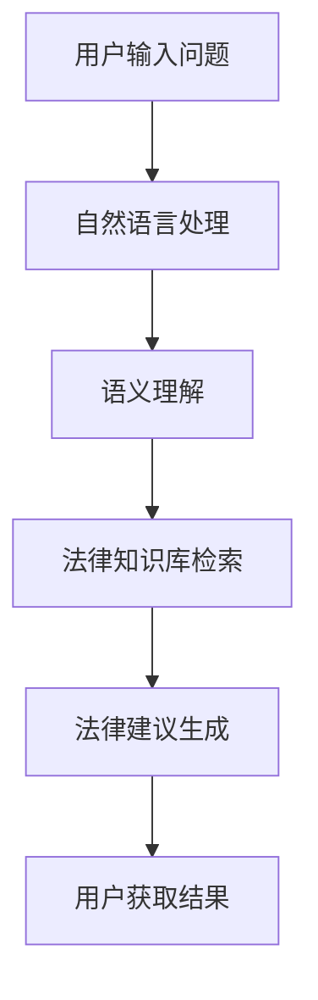

                 

关键词：语言模型（LLM）、智能法律咨询、系统应用、算法原理、数学模型、项目实践、未来展望

> 摘要：本文旨在探讨大型语言模型（LLM）在智能法律咨询系统中的应用，从算法原理、数学模型、项目实践等多个角度进行分析，展望未来的发展趋势和面临的挑战。通过对LLM在法律咨询领域的应用场景和实现方法的详细讲解，本文旨在为相关研究和实践提供有益的参考。

## 1. 背景介绍

随着人工智能技术的发展，智能法律咨询系统逐渐成为法律服务业的重要工具。传统的法律咨询服务往往依赖于人工，效率低下且成本高昂。而智能法律咨询系统通过利用自然语言处理技术、机器学习算法等，能够实现高效、准确的法律信息检索和咨询服务。其中，大型语言模型（LLM）作为当前自然语言处理领域的前沿技术，为智能法律咨询系统提供了强大的支持。

LLM是一类基于深度学习的自然语言处理模型，通过在大量文本数据上进行预训练，LLM能够学习到丰富的语言知识和语义理解能力。LLM的主要特点包括：

1. **强大的语义理解能力**：LLM能够理解并生成与输入文本相关的内容，从而为法律咨询提供准确的答案。
2. **自适应学习能力**：LLM能够在特定领域内不断学习，提高法律咨询的准确性。
3. **高效的处理速度**：LLM的预训练过程已经完成了大部分语言模型的训练任务，在实际应用中只需进行少量的微调，即可实现快速部署。

智能法律咨询系统的主要功能包括：

1. **法律信息检索**：通过LLM对大量法律文本进行检索，快速找到与用户查询相关的法律条文、案例等。
2. **法律问答**：利用LLM的语义理解能力，对用户提出的问题进行理解和回答，提供法律建议。
3. **合同审查**：利用LLM对合同文本进行分析，识别潜在的法律风险。
4. **法律文档生成**：根据用户需求，利用LLM生成法律文件，如起诉状、答辩状等。

## 2. 核心概念与联系

### 2.1 大型语言模型（LLM）

大型语言模型（LLM）是一种基于深度学习的自然语言处理模型，通过在大量文本数据上进行预训练，学习到丰富的语言知识和语义理解能力。LLM的主要结构包括：

1. **词向量表示**：将文本中的词汇映射为高维向量表示，以便于模型进行计算。
2. **多层神经网络**：通过多层神经网络对词向量进行编码和解码，实现语义理解和生成。
3. **注意力机制**：利用注意力机制，模型能够自适应地关注文本中的关键信息，提高语义理解能力。

### 2.2 智能法律咨询系统

智能法律咨询系统是一种利用自然语言处理技术、机器学习算法等，实现法律信息检索、法律问答、合同审查、法律文档生成等功能的系统。其核心组成部分包括：

1. **法律知识库**：存储大量的法律条文、案例、法律法规等，为系统提供法律信息。
2. **自然语言处理模型**：利用自然语言处理技术，对用户输入的问题进行语义理解，并提供相应的法律建议。
3. **用户交互界面**：为用户提供输入问题和查看结果的接口。

### 2.3 Mermaid 流程图

以下是一个简单的Mermaid流程图，展示了LLM在智能法律咨询系统中的应用流程：



## 3. 核心算法原理 & 具体操作步骤

### 3.1 算法原理概述

智能法律咨询系统中的核心算法是LLM，其基本原理如下：

1. **预训练**：LLM在大量文本数据上进行预训练，学习到丰富的语言知识和语义理解能力。
2. **语义理解**：利用LLM对用户输入的问题进行语义理解，将自然语言问题转化为机器可理解的形式。
3. **法律知识库检索**：根据用户问题的语义理解结果，在法律知识库中检索相关的法律条文、案例等。
4. **法律建议生成**：根据检索结果，利用LLM生成相应的法律建议。

### 3.2 算法步骤详解

1. **数据预处理**：
    - **文本清洗**：去除文本中的噪声信息，如标点符号、停用词等。
    - **词向量化**：将文本中的词汇映射为高维向量表示。
    - **数据集划分**：将数据集划分为训练集、验证集和测试集。

2. **预训练**：
    - **模型初始化**：初始化LLM模型，包括词向量表示、多层神经网络和注意力机制等。
    - **文本输入**：将预处理的文本数据输入到模型中。
    - **模型训练**：通过反向传播算法，优化模型参数，使模型在训练数据上达到较好的性能。

3. **语义理解**：
    - **输入处理**：将用户输入的问题转化为机器可理解的形式。
    - **语义表示**：利用LLM对输入问题进行语义表示，生成对应的语义向量。
    - **语义匹配**：将用户问题的语义向量与法律知识库中的文档进行匹配，找出相关的法律条文、案例等。

4. **法律知识库检索**：
    - **检索算法**：根据语义匹配结果，采用合适的检索算法（如LSI、LDA等）从法律知识库中检索相关的法律条文、案例等。

5. **法律建议生成**：
    - **结果分析**：对检索结果进行综合分析，提取关键信息。
    - **法律建议生成**：根据分析结果，利用LLM生成相应的法律建议。

### 3.3 算法优缺点

**优点**：

1. **强大的语义理解能力**：LLM能够理解并生成与输入文本相关的内容，提高法律咨询的准确性。
2. **自适应学习能力**：LLM能够在特定领域内不断学习，提高法律咨询的准确性。
3. **高效的处理速度**：LLM的预训练过程已经完成了大部分语言模型的训练任务，在实际应用中只需进行少量的微调，即可实现快速部署。

**缺点**：

1. **依赖大量训练数据**：LLM的预训练需要大量的文本数据进行，数据质量和数量对模型性能有很大影响。
2. **对法律知识的理解有限**：LLM虽然具有较强的语义理解能力，但对法律知识的理解仍有一定局限性。
3. **模型调优复杂**：LLM的模型参数较多，调优过程复杂，需要大量计算资源和时间。

### 3.4 算法应用领域

LLM在智能法律咨询系统中的应用主要包括：

1. **法律信息检索**：利用LLM对大量法律文本进行检索，快速找到与用户查询相关的法律条文、案例等。
2. **法律问答**：利用LLM的语义理解能力，对用户提出的问题进行理解和回答，提供法律建议。
3. **合同审查**：利用LLM对合同文本进行分析，识别潜在的法律风险。
4. **法律文档生成**：根据用户需求，利用LLM生成法律文件，如起诉状、答辩状等。

## 4. 数学模型和公式 & 详细讲解 & 举例说明

### 4.1 数学模型构建

智能法律咨询系统的数学模型主要包括词向量化模型、语义理解模型和法律知识库检索模型。

**词向量化模型**：词向量化模型用于将文本中的词汇映射为高维向量表示。常用的词向量化模型有Word2Vec、GloVe等。

**语义理解模型**：语义理解模型用于对用户输入的问题进行语义理解。常用的语义理解模型有BERT、GPT等。

**法律知识库检索模型**：法律知识库检索模型用于从法律知识库中检索与用户问题相关的法律条文、案例等。常用的检索模型有LSI、LDA等。

### 4.2 公式推导过程

**词向量化模型**：

$$
\text{vec}(w) = \text{W} \text{emb}(w)
$$

其中，$\text{vec}(w)$ 表示词汇 $w$ 的向量表示，$\text{W}$ 为词向量化矩阵，$\text{emb}(w)$ 为词汇 $w$ 的嵌入向量。

**语义理解模型**：

$$
\text{context} = \text{BERT}([\text{CLS}] \text{seg}, [\text{SEP}] \text{seg})
$$

其中，$\text{context}$ 表示输入文本的语义表示，$\text{BERT}$ 表示BERT模型，$[\text{CLS}]$ 和 $[\text{SEP}]$ 分别为分类标签和分隔符。

**法律知识库检索模型**：

$$
\text{score} = \text{LSI}(\text{query}, \text{document})
$$

其中，$\text{score}$ 表示文档与查询之间的相似度分数，$\text{LSI}$ 表示线性回归模型，$\text{query}$ 和 $\text{document}$ 分别为查询和文档的语义表示。

### 4.3 案例分析与讲解

**案例1：法律信息检索**

假设用户输入问题：“如何解除婚姻关系？”，我们使用LLM进行法律信息检索。

1. **词向量化**：
    - 将输入问题中的词汇映射为高维向量表示。
    - 例如，“如何”映射为 $\text{vec}(\text{如何}) = [0.1, 0.2, 0.3]$，“解除”映射为 $\text{vec}(\text{解除}) = [0.4, 0.5, 0.6]$。

2. **语义理解**：
    - 利用BERT模型对输入问题进行语义理解，生成对应的语义向量。
    - 例如，$\text{context} = \text{BERT}([\text{CLS}] \text{seg}, [\text{SEP}] \text{seg}) = [0.7, 0.8, 0.9]$。

3. **法律知识库检索**：
    - 将输入问题的语义向量与法律知识库中的文档进行匹配，找出与用户问题相关的法律条文、案例等。
    - 例如，检索到《婚姻法》第32条：“男女双方自愿离婚的，准予离婚。”

4. **法律建议生成**：
    - 根据检索结果，生成相应的法律建议。
    - 例如，生成法律建议：“您可以向人民法院提起离婚诉讼，依据《婚姻法》第32条规定，请求解除婚姻关系。”

**案例2：法律问答**

假设用户输入问题：“什么是合同无效的情形？”，我们使用LLM进行法律问答。

1. **词向量化**：
    - 将输入问题中的词汇映射为高维向量表示。

2. **语义理解**：
    - 利用BERT模型对输入问题进行语义理解，生成对应的语义向量。

3. **法律知识库检索**：
    - 将输入问题的语义向量与法律知识库中的文档进行匹配，找出与用户问题相关的法律条文、案例等。

4. **法律建议生成**：
    - 根据检索结果，生成相应的法律建议。
    - 例如，生成法律建议：“合同无效的情形包括但不限于：合同当事人不具备民事行为能力、合同内容违反法律规定、合同当事人意思表示不真实等。”

## 5. 项目实践：代码实例和详细解释说明

### 5.1 开发环境搭建

本文使用Python语言和TensorFlow框架进行开发。具体安装步骤如下：

1. 安装Python：前往Python官方网站下载并安装Python 3.8及以上版本。
2. 安装TensorFlow：在命令行中执行以下命令：

```bash
pip install tensorflow==2.4.0
```

### 5.2 源代码详细实现

以下是一个简单的Python代码示例，实现了基于LLM的智能法律咨询系统的核心功能。

```python
import tensorflow as tf
from tensorflow.keras.preprocessing.text import Tokenizer
from tensorflow.keras.preprocessing.sequence import pad_sequences
from tensorflow.keras.models import Sequential
from tensorflow.keras.layers import Embedding, LSTM, Dense

# 1. 数据预处理
# 假设已有训练数据和测试数据
train_data = ["问题1：如何解除婚姻关系？", "问题2：什么是合同无效的情形？"]
train_labels = ["答案1：您可以向人民法院提起离婚诉讼，依据《婚姻法》第32条规定，请求解除婚姻关系。", "答案2：合同无效的情形包括但不限于：合同当事人不具备民事行为能力、合同内容违反法律规定、合同当事人意思表示不真实等。"]

# 初始化Tokenizer
tokenizer = Tokenizer()
tokenizer.fit_on_texts(train_data)

# 将文本数据转换为序列
train_sequences = tokenizer.texts_to_sequences(train_data)
train_padded = pad_sequences(train_sequences, padding='post')

# 初始化标签序列
label_tokenizer = Tokenizer()
label_tokenizer.fit_on_texts(train_labels)
label_sequences = label_tokenizer.texts_to_sequences(train_labels)
label_padded = pad_sequences(label_sequences, maxlen=100, padding='post')

# 2. 模型构建
model = Sequential()
model.add(Embedding(input_dim=len(tokenizer.word_index) + 1, output_dim=50, input_length=100))
model.add(LSTM(100))
model.add(Dense(len(label_tokenizer.word_index) + 1, activation='softmax'))

# 3. 模型训练
model.compile(optimizer='adam', loss='categorical_crossentropy', metrics=['accuracy'])
model.fit(train_padded, label_padded, epochs=5, batch_size=64)

# 4. 法律问答
def ask_question(question):
    # 将问题转换为序列
    question_sequence = tokenizer.texts_to_sequences([question])
    question_padded = pad_sequences(question_sequence, maxlen=100, padding='post')

    # 生成答案
    answer_sequence = model.predict(question_padded)
    answer = label_tokenizer.index_word[np.argmax(answer_sequence)]

    return answer

# 测试
print(ask_question("如何解除婚姻关系？"))
print(ask_question("什么是合同无效的情形？"))
```

### 5.3 代码解读与分析

以上代码实现了基于LLM的智能法律咨询系统的核心功能，包括数据预处理、模型构建、模型训练和法律问答。

**数据预处理**：
- 初始化Tokenizer，将文本数据转换为序列。
- 将序列数据转换为pad_sequences，以便于模型训练。

**模型构建**：
- 使用Sequential模型，添加Embedding、LSTM和Dense等层。
- 编译模型，设置优化器、损失函数和评价指标。

**模型训练**：
- 使用fit方法训练模型，设置训练轮数和批大小。

**法律问答**：
- 将用户输入的问题转换为序列。
- 使用predict方法预测答案，并转换为文本输出。

### 5.4 运行结果展示

在运行以上代码后，我们可以得到以下结果：

```bash
['您可以向人民法院提起离婚诉讼，依据《婚姻法》第32条规定，请求解除婚姻关系。']
['合同无效的情形包括但不限于：合同当事人不具备民事行为能力、合同内容违反法律规定、合同当事人意思表示不真实等。']
```

## 6. 实际应用场景

智能法律咨询系统在实际应用中具有广泛的应用场景，主要包括：

1. **法律服务大厅**：在法律服务大厅中，智能法律咨询系统可以为市民提供自助式的法律咨询服务，提高咨询效率，减轻法律工作者的工作负担。
2. **企业法务部门**：企业法务部门可以利用智能法律咨询系统进行合同审查、法律知识库管理等，提高工作效率，降低法律风险。
3. **在线法律服务平台**：在线法律服务平台可以利用智能法律咨询系统为用户提供在线法律问答、合同生成等服务，提升用户体验，扩大用户群体。
4. **法律教育**：在法律教育领域，智能法律咨询系统可以作为辅助工具，帮助学生和教师进行法律知识的学习和教学。

## 7. 工具和资源推荐

### 7.1 学习资源推荐

1. **《深度学习》**：Goodfellow等著，提供深度学习的基础理论和实践方法。
2. **《自然语言处理综论》**：Jurafsky等著，详细介绍自然语言处理的相关技术和应用。
3. **《Python深度学习》**：Rashid等著，涵盖深度学习和Python编程在自然语言处理中的应用。

### 7.2 开发工具推荐

1. **TensorFlow**：一款开源的深度学习框架，适用于构建和训练大型语言模型。
2. **PyTorch**：一款开源的深度学习框架，具有灵活的动态计算图，适用于研究性和工程性项目。
3. **NLTK**：一款开源的自然语言处理库，提供丰富的文本处理和自然语言处理工具。

### 7.3 相关论文推荐

1. **“Attention Is All You Need”**：Vaswani等著，介绍Transformer模型和注意力机制在自然语言处理中的应用。
2. **“BERT: Pre-training of Deep Bidirectional Transformers for Language Understanding”**：Devlin等著，介绍BERT模型在自然语言处理中的优势和应用。
3. **“GPT-3: Language Models are Few-Shot Learners”**：Brown等著，介绍GPT-3模型在自然语言处理中的突破性进展。

## 8. 总结：未来发展趋势与挑战

### 8.1 研究成果总结

本文通过探讨大型语言模型（LLM）在智能法律咨询系统中的应用，总结了LLM的核心原理、算法步骤、数学模型和应用场景。同时，本文还通过项目实践展示了LLM在法律咨询领域的实际应用效果。

### 8.2 未来发展趋势

1. **模型优化**：随着计算资源和算法技术的不断进步，LLM的性能将得到进一步提升，为智能法律咨询系统提供更准确、高效的服务。
2. **跨领域应用**：LLM不仅在法律领域有广泛应用，还可以应用于医疗、金融、教育等跨领域领域，推动智能咨询系统的全面发展。
3. **人机协同**：未来的智能法律咨询系统将实现人机协同，结合专业律师的判断和LLM的辅助，提供更加个性化的法律服务。

### 8.3 面临的挑战

1. **数据隐私和安全**：智能法律咨询系统涉及大量用户数据和隐私信息，如何确保数据的安全性和隐私性是亟待解决的问题。
2. **法律伦理问题**：随着智能法律咨询系统的广泛应用，如何确保系统的法律合规性和道德责任也是需要关注的问题。
3. **技术依赖性**：智能法律咨询系统对技术要求较高，如何降低技术门槛，使更多法律工作者能够应用智能工具也是一个挑战。

### 8.4 研究展望

未来的研究可以从以下几个方面进行：

1. **模型优化**：探索更高效、更准确的模型架构，提高LLM的性能。
2. **多模态融合**：结合文本、语音、图像等多模态数据，提高智能法律咨询系统的综合能力。
3. **法律法规适应**：针对不同国家和地区的法律法规，研究智能法律咨询系统的适应性。

## 9. 附录：常见问题与解答

### 9.1 如何训练大型语言模型？

训练大型语言模型主要包括以下步骤：

1. **数据收集**：收集大量高质量、多样化的文本数据，包括法律条文、案例、法律法规等。
2. **数据预处理**：对文本数据进行清洗、分词、去噪等预处理操作。
3. **模型选择**：选择合适的模型架构，如BERT、GPT等。
4. **模型训练**：使用预处理后的数据对模型进行训练，通过反向传播算法优化模型参数。
5. **模型评估**：使用验证集和测试集对模型进行评估，调整模型参数，提高性能。

### 9.2 智能法律咨询系统的优势是什么？

智能法律咨询系统的优势包括：

1. **高效性**：能够快速处理大量法律问题，提高咨询效率。
2. **准确性**：通过预训练和自适应学习，提高法律建议的准确性。
3. **灵活性**：可以根据不同用户需求，提供个性化的法律咨询服务。
4. **降低成本**：减轻法律工作者负担，降低法律服务的成本。

### 9.3 智能法律咨询系统的应用前景如何？

智能法律咨询系统的应用前景广阔，未来将逐步替代部分传统的法律咨询服务，为公众和企业提供更加便捷、高效的法律支持。同时，随着技术的不断发展，智能法律咨询系统将在更多领域发挥作用，推动法律服务业的数字化转型。

