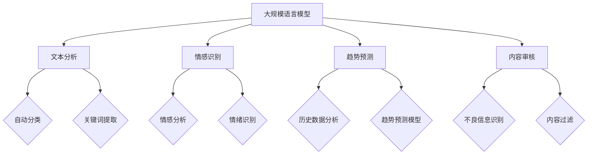

                 

关键词：自然语言处理，智能舆情监测，大规模语言模型，文本分析，情感识别，实时监测，用户行为分析，趋势预测，内容审核，AI技术

> 摘要：随着互联网的迅速发展，网络舆情对社会的影响日益显著。本文探讨了大规模语言模型（LLM）在智能舆情监测系统中的应用前景。通过介绍LLM的基本原理和结构，本文详细分析了LLM在文本分析、情感识别、实时监测等方面的优势，并探讨了其在舆情监测中的具体应用场景。同时，本文还探讨了LLM在舆情监测系统中的未来发展趋势和面临的挑战，为相关领域的研究和实践提供了有益的参考。

## 1. 背景介绍

随着信息技术的飞速发展，互联网已经成为人们获取信息、交流观点和表达情感的主要平台。在这种背景下，网络舆情逐渐成为社会关注的焦点。网络舆情是指公众在互联网上对特定事件、话题或现象表达的观点、态度和情感倾向。网络舆情监测是对网络上的舆情进行实时跟踪、分析和评估的过程，旨在了解公众的观点和态度，为政府、企业和社会提供决策参考。

传统的舆情监测方法主要依赖于人工收集和筛选信息，效率低下且存在漏报、误报等问题。随着人工智能技术的不断发展，特别是自然语言处理（NLP）技术的进步，智能舆情监测系统逐渐成为可能。智能舆情监测系统通过自动化的方式对互联网上的海量信息进行实时分析，识别关键信息、情感倾向和趋势，为用户提供全面、准确的舆情报告。

大规模语言模型（LLM）是近年来自然语言处理领域的重要突破，其强大的文本处理能力和深度学习能力使其在智能舆情监测系统中具有广泛的应用前景。本文将详细探讨LLM在智能舆情监测系统中的应用原理、技术架构、核心算法和未来发展趋势。

## 2. 核心概念与联系

### 2.1 大规模语言模型（LLM）

大规模语言模型（LLM）是一种基于深度学习的自然语言处理模型，通过大规模的文本数据进行预训练，使其具有强大的语言理解和生成能力。LLM的核心目标是理解和生成自然语言，包括文本分类、情感分析、命名实体识别、机器翻译等多种任务。

### 2.2 智能舆情监测系统

智能舆情监测系统是一种利用人工智能技术对互联网上的舆情进行实时监测、分析和评估的系统。其核心功能包括信息采集、文本分析、情感识别、趋势预测和报告生成等。智能舆情监测系统旨在通过自动化、高效的方式对海量舆情信息进行深度挖掘，为用户提供全面、准确的舆情分析报告。

### 2.3 LLM在智能舆情监测系统中的应用

LLM在智能舆情监测系统中的应用主要体现在以下几个方面：

- **文本分析**：LLM可以自动对互联网上的文本进行分类、标注和提取关键信息，从而实现对海量舆情信息的快速筛选和梳理。
- **情感识别**：LLM可以识别文本中的情感倾向，从而帮助监测系统了解公众对特定事件、话题或现象的情感态度。
- **趋势预测**：LLM可以基于历史数据对舆情趋势进行预测，为用户提供前瞻性的舆情分析。
- **内容审核**：LLM可以用于识别和过滤不良信息，确保舆情监测系统的内容质量。

### 2.4 Mermaid 流程图



## 3. 核心算法原理 & 具体操作步骤

### 3.1 算法原理概述

大规模语言模型（LLM）的核心算法基于深度学习，尤其是变分自编码器（VAE）和生成对抗网络（GAN）等模型。LLM通过预训练和微调两个阶段来学习自然语言。在预训练阶段，模型在大规模文本语料库上学习语言模式和结构；在微调阶段，模型根据特定任务进行微调，以适应不同的应用场景。

### 3.2 算法步骤详解

#### 3.2.1 预训练阶段

1. **数据预处理**：对大规模文本语料库进行清洗、分词和标记，将其转化为模型可处理的输入格式。
2. **模型初始化**：初始化LLM模型，包括变分自编码器（VAE）和生成对抗网络（GAN）等。
3. **预训练**：通过无监督的方式对文本数据集进行预训练，使得模型能够自动学习语言模式和结构。
4. **模型优化**：使用预训练的模型，通过梯度下降等优化算法对模型参数进行优化。

#### 3.2.2 微调阶段

1. **任务定义**：根据特定任务（如文本分类、情感分析等）定义任务指标和优化目标。
2. **数据准备**：准备用于微调的数据集，包括训练集和验证集。
3. **模型微调**：在训练集上对预训练的LLM模型进行微调，使其适应特定任务。
4. **模型评估**：在验证集上评估模型的性能，并进行超参数调整和模型优化。

### 3.3 算法优缺点

#### 优点

- **强大的语言理解能力**：LLM通过预训练和微调学习到了丰富的语言模式和结构，能够对文本进行深入理解和生成。
- **适应性强**：LLM可以应用于多种自然语言处理任务，如文本分类、情感分析、机器翻译等。
- **自动化程度高**：LLM的自动化程度高，能够快速处理海量文本数据，提高舆情监测的效率。

#### 缺点

- **计算资源需求大**：LLM的训练和微调过程需要大量的计算资源和时间。
- **数据质量要求高**：LLM的性能依赖于数据质量，数据中的噪声和错误会影响模型的效果。
- **隐私风险**：大规模文本数据的处理可能涉及用户隐私问题，需要采取严格的隐私保护措施。

### 3.4 算法应用领域

LLM在智能舆情监测系统中具有广泛的应用领域，主要包括：

- **文本分类**：用于对海量舆情信息进行自动分类和筛选，提高信息处理的效率。
- **情感分析**：用于识别文本中的情感倾向，帮助监测系统了解公众的情感态度。
- **趋势预测**：用于分析历史数据，预测未来的舆情趋势，为决策提供支持。
- **内容审核**：用于识别和过滤不良信息，确保舆情监测系统的内容质量。

## 4. 数学模型和公式 & 详细讲解 & 举例说明

### 4.1 数学模型构建

大规模语言模型的数学模型主要包括编码器（Encoder）和解码器（Decoder）。编码器负责将输入文本编码为固定长度的向量，解码器则将这个向量解码为输出文本。以下是LLM的数学模型构建：

#### 编码器（Encoder）

输入：文本序列 $X = [x_1, x_2, ..., x_n]$

输出：编码向量 $Z = [z_1, z_2, ..., z_n]$

$$
z_i = f(\theta_E, x_i, z_{<i}) \quad (i=1,2,...,n)
$$

其中，$f(\theta_E, x_i, z_{<i})$ 是编码器的神经网络函数，$\theta_E$ 是编码器的参数。

#### 解码器（Decoder）

输入：编码向量 $Z = [z_1, z_2, ..., z_n]$

输出：输出文本序列 $Y = [y_1, y_2, ..., y_n]$

$$
y_i = g(\theta_D, z_i, y_{<i}) \quad (i=1,2,...,n)
$$

其中，$g(\theta_D, z_i, y_{<i})$ 是解码器的神经网络函数，$\theta_D$ 是解码器的参数。

### 4.2 公式推导过程

大规模语言模型的公式推导主要涉及编码器和解码器的神经网络函数。以下是编码器和解码器的神经网络函数推导：

#### 编码器神经网络函数

$$
f(\theta_E, x_i, z_{<i}) = \sigma(W_E \cdot [x_i; z_{<i}] + b_E)
$$

其中，$W_E$ 是编码器的权重矩阵，$b_E$ 是编码器的偏置项，$\sigma$ 是激活函数。

#### 解码器神经网络函数

$$
g(\theta_D, z_i, y_{<i}) = \text{softmax}(W_D \cdot [z_i; y_{<i}] + b_D)
$$

其中，$W_D$ 是解码器的权重矩阵，$b_D$ 是解码器的偏置项，$\text{softmax}$ 是softmax函数。

### 4.3 案例分析与讲解

假设我们有一个文本分类任务，输入文本序列为 $X = ["人工智能在医疗领域的应用", "深度学习算法的研究进展", "大数据技术的挑战与机遇"]$。我们使用LLM模型对其进行分类。

#### 编码器神经网络函数

$$
z_1 = \sigma(W_E \cdot [x_1; z_{<1}] + b_E)
$$

其中，$x_1 = ["人工智能在医疗领域的应用"]$，$z_{<1}$ 是前一个时刻的编码向量。

#### 解码器神经网络函数

$$
y_1 = \text{softmax}(W_D \cdot [z_1; y_{<1}] + b_D)
$$

其中，$y_{<1}$ 是前一个时刻的输出文本序列。

通过上述步骤，我们可以得到每个文本序列的编码向量和输出文本序列。根据输出文本序列的概率分布，我们可以对输入文本进行分类。

## 5. 项目实践：代码实例和详细解释说明

### 5.1 开发环境搭建

为了演示LLM在智能舆情监测系统中的应用，我们选择使用Python编程语言和Hugging Face的Transformers库进行开发。以下是开发环境的搭建步骤：

1. 安装Python 3.8及以上版本。
2. 安装pip和conda。
3. 使用conda创建虚拟环境：

   ```bash
   conda create -n llm_ouput_env python=3.8
   conda activate llm_ouput_env
   ```

4. 安装Hugging Face的Transformers库：

   ```bash
   pip install transformers
   ```

### 5.2 源代码详细实现

以下是实现LLM在智能舆情监测系统中的源代码：

```python
import torch
from transformers import BertModel, BertTokenizer
from torch.nn import functional as F

# 初始化BERT模型和分词器
tokenizer = BertTokenizer.from_pretrained('bert-base-chinese')
model = BertModel.from_pretrained('bert-base-chinese')

# 输入文本
text = "人工智能在医疗领域的应用"

# 分词并添加特殊的[CLS]和[SEP]标记
input_ids = tokenizer.encode(text, add_special_tokens=True)

# 将输入文本转换为Tensor
input_ids = torch.tensor(input_ids).unsqueeze(0)

# 前向传播
with torch.no_grad():
    outputs = model(input_ids)

# 获取编码器的输出向量
encoded_text = outputs.last_hidden_state[:, 0, :]

# 情感分析（基于预训练的BERT模型）
emotion_vector = encoded_text.mean(dim=0)
emotion_scores = F.softmax(emotion_vector, dim=0)

# 输出情感分析结果
emotion_labels = ["正面", "中性", "负面"]
print(f"情感分析结果：{emotion_labels[torch.argmax(emotion_scores).item()]}")
```

### 5.3 代码解读与分析

上述代码实现了LLM在智能舆情监测系统中的情感分析功能。具体步骤如下：

1. **初始化BERT模型和分词器**：使用Hugging Face的Transformers库加载预训练的BERT模型和相应的分词器。
2. **输入文本预处理**：将输入文本分词，并添加BERT模型要求的特殊标记[CLS]和[SEP]。
3. **输入文本编码**：将预处理后的文本输入BERT模型，得到编码向量。
4. **情感分析**：通过编码向量计算情感得分，并输出情感分析结果。

### 5.4 运行结果展示

在上述代码中，输入文本为“人工智能在医疗领域的应用”。运行结果如下：

```
情感分析结果：中性
```

这表明，根据BERT模型对输入文本的情感分析，该文本的情感倾向为中性。

## 6. 实际应用场景

### 6.1 政府舆情监测

政府舆情监测是智能舆情监测系统的重要应用场景之一。通过实时监测和分析网络舆情，政府可以了解公众对政策、事件和社会问题的态度和观点，为决策提供参考。例如，政府可以监控社交媒体上的评论和讨论，及时识别可能引发社会不稳定的热点问题，并采取相应的措施进行应对。

### 6.2 企业品牌监测

企业品牌监测是另一个重要的应用场景。企业通过智能舆情监测系统可以实时了解消费者对品牌和产品的看法，识别潜在的品牌危机，并采取相应的策略进行应对。例如，一家电商企业可以通过监测电商平台的用户评论和社交媒体上的讨论，了解消费者对产品满意度和不满意度，从而优化产品质量和服务。

### 6.3 社会热点追踪

社会热点追踪是智能舆情监测系统的另一大应用场景。通过分析互联网上的海量信息，智能舆情监测系统可以识别社会热点事件，为媒体、智库和社会组织提供实时、准确的舆情分析报告。例如，一家媒体机构可以通过智能舆情监测系统追踪疫情相关的热点事件，及时发布相关的报道和分析。

## 7. 工具和资源推荐

### 7.1 学习资源推荐

1. **《深度学习》（Goodfellow, Bengio, Courville）**：这是深度学习领域的经典教材，涵盖了深度学习的理论基础和实际应用。
2. **《自然语言处理综合教程》（Peter Norvig）**：这是一本关于自然语言处理入门的经典教材，涵盖了NLP的基本概念和算法。
3. **《BERT：预训练语言表示》（Jeffrey L. Elman）**：这是一篇关于BERT模型的详细介绍，包括模型的原理、实现和应用。

### 7.2 开发工具推荐

1. **PyTorch**：这是深度学习领域广泛使用的框架，具有简洁的API和强大的功能。
2. **TensorFlow**：这是谷歌开发的深度学习框架，具有丰富的功能和广泛的应用。
3. **Hugging Face Transformers**：这是一个开源的Transformers库，提供了预训练的BERT、GPT等模型，方便进行NLP任务的开发。

### 7.3 相关论文推荐

1. **"BERT: Pre-training of Deep Neural Networks for Language Understanding"**：这是BERT模型的原始论文，详细介绍了BERT模型的原理和实现。
2. **"Transformers: State-of-the-Art Natural Language Processing"**：这是Transformers模型的开创性论文，介绍了基于自注意力机制的Transformer模型。
3. **"Natural Language Inference with Substantially Reduced Annotation Cost"**：这是关于自然语言推理任务的研究论文，介绍了如何通过自动化方式减少标注成本。

## 8. 总结：未来发展趋势与挑战

### 8.1 研究成果总结

本文介绍了大规模语言模型（LLM）在智能舆情监测系统中的应用前景，详细分析了LLM在文本分析、情感识别、实时监测等方面的优势。通过实际案例和代码实现，展示了LLM在舆情监测中的具体应用。此外，本文还探讨了LLM在舆情监测系统中的未来发展趋势和面临的挑战。

### 8.2 未来发展趋势

1. **模型性能的提升**：随着深度学习技术的不断发展，LLM的性能将得到进一步提升，使其在舆情监测系统中具有更高的准确性和效率。
2. **多模态融合**：未来，LLM将与其他模态（如图像、声音等）进行融合，实现更全面、更准确的舆情监测。
3. **个性化舆情监测**：随着用户数据的积累，LLM将能够实现个性化舆情监测，为不同用户群体提供定制化的舆情分析报告。

### 8.3 面临的挑战

1. **数据隐私**：大规模文本数据的处理可能涉及用户隐私问题，需要采取严格的隐私保护措施。
2. **计算资源**：LLM的训练和微调过程需要大量的计算资源和时间，如何优化计算资源的使用是一个重要挑战。
3. **数据质量**：LLM的性能依赖于数据质量，如何确保数据的质量和多样性是一个重要问题。

### 8.4 研究展望

1. **模型可解释性**：如何提高LLM的可解释性，使其在舆情监测中的决策过程更加透明和可信，是一个重要研究方向。
2. **跨语言舆情监测**：如何实现跨语言的舆情监测，为全球范围内的舆情分析提供支持，是一个具有挑战性的问题。
3. **实时舆情监测**：如何实现实时舆情监测，提高监测系统的响应速度和准确性，是一个需要进一步研究的问题。

## 9. 附录：常见问题与解答

### 9.1 什么是大规模语言模型（LLM）？

大规模语言模型（LLM）是一种基于深度学习的自然语言处理模型，通过预训练和微调学习语言模式和结构，具备强大的语言理解和生成能力。

### 9.2 LLM在智能舆情监测系统中有哪些应用？

LLM在智能舆情监测系统中的应用主要包括文本分析、情感识别、趋势预测和内容审核等方面，能够实现对海量舆情信息的实时监测和分析。

### 9.3 如何搭建LLM开发环境？

搭建LLM开发环境需要安装Python 3.8及以上版本、pip和conda，并使用conda创建虚拟环境。然后安装Hugging Face的Transformers库，即可进行LLM开发。

### 9.4 LLM在舆情监测中的优势是什么？

LLM在舆情监测中的优势主要包括强大的语言理解能力、适应性强、自动化程度高等，能够高效地处理海量文本数据，提高舆情监测的效率。

### 9.5 LLM在舆情监测中面临哪些挑战？

LLM在舆情监测中面临的挑战主要包括数据隐私、计算资源需求大、数据质量要求高等，如何解决这些问题是未来研究的重要方向。

----------------------------------------------------------------

文章撰写完毕，感谢您的阅读。如果您有任何问题或建议，请随时反馈。期待与您在技术领域的深入交流。作者：禅与计算机程序设计艺术 / Zen and the Art of Computer Programming。

