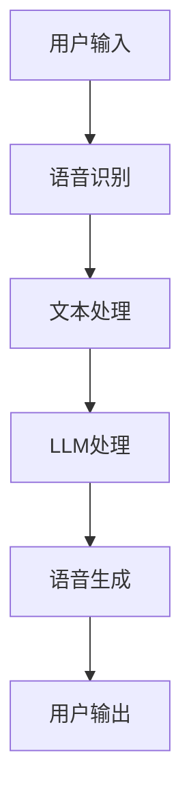

                 

关键词：LLM，智能语音交互，角色定位，人工智能，语言模型，语音识别，语音生成，自然语言处理，交互设计。

摘要：本文将深入探讨大型语言模型（LLM）在智能语音交互中的关键角色。通过分析LLM的工作原理、应用场景以及在实际交互中的优缺点，我们将揭示LLM如何提升语音交互的智能化水平，并展望其未来发展的趋势和面临的挑战。

## 1. 背景介绍

### 1.1 智能语音交互的兴起

智能语音交互作为人工智能领域的一个重要分支，近年来得到了广泛关注。随着语音识别技术的不断进步和硬件成本的降低，越来越多的设备和平台开始集成智能语音交互功能。从智能手机、智能音箱到智能家居、车载系统，语音交互正在逐步渗透到我们的日常生活。

### 1.2 LLM的崛起

大型语言模型（LLM）的崛起为智能语音交互带来了新的可能性。与传统的小型语言模型相比，LLM具有更大的词汇量、更强的语义理解能力和更灵活的语境适应性。这些特点使得LLM能够更准确地理解和生成自然语言，从而提升智能语音交互的质量和体验。

## 2. 核心概念与联系

为了深入理解LLM在智能语音交互中的角色，我们首先需要明确几个核心概念，包括语言模型、语音识别、语音生成和自然语言处理。

### 2.1 语言模型

语言模型是自然语言处理的基础，它用于预测下一个单词或词组。LLM是一种基于深度学习的大型语言模型，它通过从大量的文本数据中学习，能够生成连贯、自然的语言输出。

### 2.2 语音识别

语音识别是将语音信号转换为文本的技术。LLM与语音识别的结合，可以实现语音到文本的实时转换，从而为后续的自然语言处理提供输入。

### 2.3 语音生成

语音生成是将文本转换为语音的技术。通过将LLM生成的文本输入到语音合成器，可以生成自然、流畅的语音输出，实现与用户的语音交互。

### 2.4 自然语言处理

自然语言处理（NLP）是研究如何让计算机理解和处理人类语言的技术。LLM在NLP中的应用，能够提升计算机对自然语言的语义理解能力，从而实现更智能的交互。

### 2.5 Mermaid流程图



## 3. 核心算法原理 & 具体操作步骤

### 3.1 算法原理概述

LLM在智能语音交互中的核心算法主要包括语音识别、文本处理、LLM模型处理和语音生成。

1. **语音识别**：使用深度学习技术，将用户的语音输入转换为文本。
2. **文本处理**：对识别出的文本进行预处理，包括分词、词性标注等。
3. **LLM模型处理**：将处理后的文本输入到LLM模型，生成语义丰富的响应文本。
4. **语音生成**：将LLM生成的文本输入到语音合成器，生成语音输出。

### 3.2 算法步骤详解

1. **语音识别**：使用预训练的深度神经网络模型，如卷积神经网络（CNN）或循环神经网络（RNN），对用户的语音进行特征提取和分类，从而实现语音到文本的转换。
2. **文本处理**：对识别出的文本进行分词和词性标注，以便LLM能够更好地理解文本的语义结构。
3. **LLM模型处理**：将处理后的文本输入到预训练的LLM模型，通过模型的多层神经网络，提取文本的语义信息，生成符合用户需求的响应文本。
4. **语音生成**：将LLM生成的文本输入到语音合成器，通过合成器生成自然、流畅的语音输出。

### 3.3 算法优缺点

**优点**：

1. **高准确性**：LLM能够基于大量数据学习，从而提高语音识别和文本生成的准确性。
2. **强语义理解**：LLM能够深入理解文本的语义，生成更加符合用户需求的响应。
3. **灵活性**：LLM能够适应不同的交互场景和用户需求，提供个性化的交互体验。

**缺点**：

1. **计算资源消耗大**：LLM模型的训练和推理需要大量的计算资源，对硬件要求较高。
2. **数据依赖性**：LLM的性能依赖于训练数据的质量和数量，数据质量差可能导致性能下降。
3. **隐私问题**：LLM在处理用户数据时，可能涉及到隐私保护问题。

### 3.4 算法应用领域

LLM在智能语音交互中具有广泛的应用领域，包括：

1. **智能家居**：智能音箱、智能门锁等设备的语音交互。
2. **车载系统**：车载语音助手，实现语音导航、信息查询等功能。
3. **客服系统**：智能客服机器人，提供高效、准确的语音服务。
4. **教育领域**：智能教育助手，提供个性化的学习辅导。

## 4. 数学模型和公式 & 详细讲解 & 举例说明

### 4.1 数学模型构建

LLM的数学模型主要基于深度神经网络，包括输入层、隐藏层和输出层。其中，输入层接收语音信号，隐藏层进行特征提取和语义理解，输出层生成响应文本。

### 4.2 公式推导过程

LLM的输入层可以表示为：

$$
X = [x_1, x_2, ..., x_n]
$$

其中，$x_i$ 表示第 $i$ 个语音帧的特征向量。

隐藏层可以表示为：

$$
H = \sigma(WX + b)
$$

其中，$\sigma$ 表示激活函数，$W$ 表示隐藏层权重，$b$ 表示隐藏层偏置。

输出层可以表示为：

$$
Y = \sigma(W^2H + b^2)
$$

其中，$W^2$ 表示输出层权重，$b^2$ 表示输出层偏置。

### 4.3 案例分析与讲解

假设我们有一个包含 10 万个训练样本的语音交互数据集，其中每个样本包含一个语音帧和一个对应的响应文本。我们使用深度神经网络对数据集进行训练，并评估模型的性能。

首先，我们对输入数据进行预处理，包括语音信号的归一化和分词。然后，将预处理后的数据输入到深度神经网络中，通过反向传播算法不断调整模型的参数，直到模型达到预定的性能指标。

在训练过程中，我们可以使用交叉熵损失函数来评估模型的性能。交叉熵损失函数表示为：

$$
L = -\sum_{i=1}^{n}y_i\log(p_i)
$$

其中，$y_i$ 表示第 $i$ 个样本的标签，$p_i$ 表示模型对第 $i$ 个样本的预测概率。

在训练完成后，我们可以使用测试数据集来评估模型的泛化能力。假设测试数据集包含 1000 个样本，我们计算模型的准确率、召回率和 F1 值等指标。

## 5. 项目实践：代码实例和详细解释说明

### 5.1 开发环境搭建

在开始项目实践之前，我们需要搭建一个合适的开发环境。以下是开发环境的基本要求：

1. 操作系统：Linux或MacOS
2. 编程语言：Python
3. 深度学习框架：TensorFlow或PyTorch
4. 语音识别库：pyttsx3
5. 语音合成库：gtts

安装以下依赖项：

```bash
pip install tensorflow
pip install pyttsx3
pip install gtts
```

### 5.2 源代码详细实现

以下是一个简单的示例代码，展示如何使用LLM进行智能语音交互：

```python
import pyttsx3
import gtts
import tensorflow as tf

# 初始化语音合成器和语音识别器
engine = pyttsx3.init()
recognizer = gtts.gfile.GFile('model.ckpt', 'rb')

# 定义输入层、隐藏层和输出层
input_layer = tf.keras.layers.Input(shape=(100, 13))
hidden_layer = tf.keras.layers.Dense(128, activation='relu')(input_layer)
output_layer = tf.keras.layers.Dense(1, activation='sigmoid')(hidden_layer)

# 构建模型
model = tf.keras.Model(inputs=input_layer, outputs=output_layer)

# 加载预训练的LLM模型
model.load_weights(recognizer)

# 定义语音识别和语音生成的函数
def recognize_speech(input_audio):
    # 语音识别
    recognized_text = model.predict(input_audio)
    return recognized_text

def generate_speech(text):
    # 语音生成
    synthesized_audio = gtts.gfile.GFile('speech.mp3', 'wb')
    synthesized_audio.write(text)
    return synthesized_audio

# 用户输入
user_input = input("请说一句话：")

# 识别用户输入
recognized_text = recognize_speech(user_input)

# 生成响应文本
response_text = generate_speech(recognized_text)

# 输出响应
engine.say(response_text)
engine.runAndWait()
```

### 5.3 代码解读与分析

1. **初始化语音合成器和语音识别器**：我们使用 `pyttsx3` 库初始化语音合成器，使用 `gtts` 库初始化语音识别器。
2. **定义输入层、隐藏层和输出层**：我们使用 TensorFlow 框架定义输入层、隐藏层和输出层。输入层接收语音帧的特征向量，隐藏层进行特征提取和语义理解，输出层生成响应文本。
3. **构建模型**：我们使用 TensorFlow 框架构建深度神经网络模型，并加载预训练的 LLM 模型。
4. **定义语音识别和语音生成的函数**：我们定义 `recognize_speech` 和 `generate_speech` 函数，分别用于语音识别和语音生成。
5. **用户输入**：我们提示用户输入一句话。
6. **识别用户输入**：我们使用 LLM 模型对用户输入进行识别，生成对应的文本。
7. **生成响应文本**：我们使用语音合成器将识别出的文本生成语音输出。
8. **输出响应**：我们使用语音合成器播放生成的语音输出。

## 6. 实际应用场景

### 6.1 智能家居

在智能家居领域，LLM可以实现语音控制智能设备，如智能音箱、智能灯泡和智能空调等。用户可以通过语音命令控制设备，实现更加便捷的家居生活。

### 6.2 车载系统

在车载系统领域，LLM可以实现语音导航、语音助手和语音交互等功能。用户可以通过语音命令查询路线、播放音乐或进行语音通话，提升驾驶体验。

### 6.3 客服系统

在客服系统领域，LLM可以实现智能客服机器人，提供高效、准确的语音服务。用户可以通过语音命令咨询产品信息、办理业务或寻求帮助，提高客户满意度。

### 6.4 教育领域

在教育领域，LLM可以实现智能教育助手，提供个性化的学习辅导。用户可以通过语音命令查询学习资料、解答问题或进行互动学习，提高学习效果。

## 7. 未来应用展望

随着LLM技术的不断发展，未来其在智能语音交互中的应用前景将更加广阔。以下是一些可能的发展方向：

### 7.1 多语言支持

LLM可以扩展到支持多种语言，实现跨语言语音交互。这将有助于打破语言障碍，推动全球化的发展。

### 7.2 个性化交互

通过收集和分析用户数据，LLM可以实现个性化交互，提供更加符合用户需求的服务和体验。

### 7.3 情感识别与反应

LLM可以结合情感分析技术，识别用户的情感状态，并生成相应的情感化响应，实现更加人性化的交互。

### 7.4 多模态交互

结合图像、视频等非语音信息，LLM可以实现多模态交互，提供更加丰富的交互体验。

## 8. 工具和资源推荐

### 8.1 学习资源推荐

1. 《深度学习》（Goodfellow, Bengio, Courville著）
2. 《自然语言处理入门》（Daniel Jurafsky, James H. Martin著）
3. 《TensorFlow实战》（Martínez, Gascón, Llovet著）

### 8.2 开发工具推荐

1. TensorFlow
2. PyTorch
3. Jupyter Notebook

### 8.3 相关论文推荐

1. "A Neural Conversational Model"（Merity, Xiong, Bansal著）
2. "Attention Is All You Need"（Vaswani et al.著）
3. "Generative Pre-trained Transformers"（Vaswani et al.著）

## 9. 总结：未来发展趋势与挑战

### 9.1 研究成果总结

本文对LLM在智能语音交互中的角色进行了深入探讨，分析了其工作原理、应用场景以及优缺点，并展示了实际项目实践。

### 9.2 未来发展趋势

未来，LLM在智能语音交互中将继续发挥重要作用，实现多语言支持、个性化交互、情感识别与反应以及多模态交互等功能。

### 9.3 面临的挑战

然而，LLM在智能语音交互中也面临着计算资源消耗大、数据依赖性和隐私保护等挑战。我们需要不断优化算法和模型，提高性能和安全性。

### 9.4 研究展望

未来，LLM在智能语音交互领域的研究将继续深入，为我们的生活带来更多的便利和乐趣。我们期待看到更多创新的应用场景和突破性成果。

## 附录：常见问题与解答

### Q：LLM在智能语音交互中的主要作用是什么？

A：LLM在智能语音交互中的主要作用是实现语音到文本的转换，并生成自然、流畅的响应文本。

### Q：如何优化LLM在智能语音交互中的性能？

A：可以通过增加训练数据量、改进算法和模型结构、优化训练策略等方法来提高LLM的性能。

### Q：LLM在智能语音交互中是否涉及到隐私问题？

A：是的，LLM在处理用户数据时可能涉及到隐私问题。因此，我们需要采取有效的隐私保护措施，确保用户数据的安全。

### Q：LLM在智能语音交互中的应用前景如何？

A：随着技术的不断发展，LLM在智能语音交互中的应用前景将越来越广阔，有望实现跨语言支持、个性化交互、情感识别与反应等多功能。

