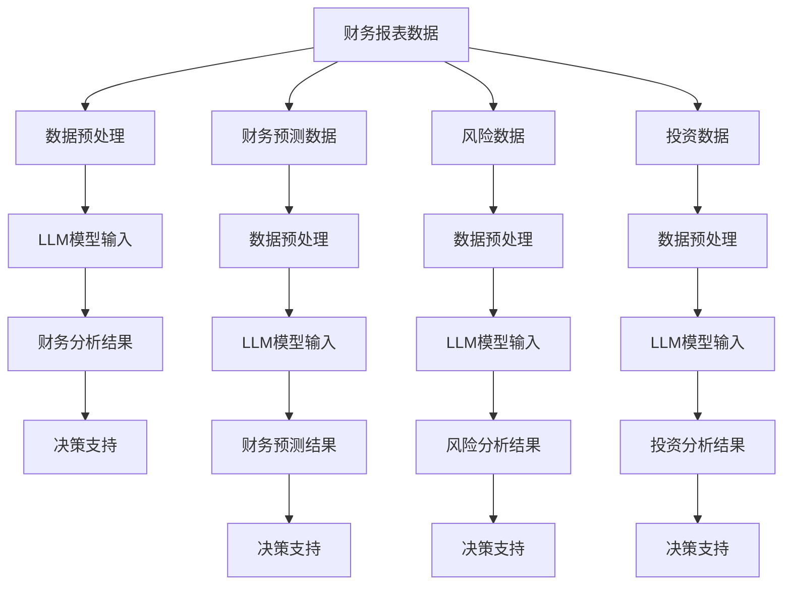

                 

关键词：自然语言处理、大型语言模型、财务分析、智能财务、数据挖掘、人工智能应用

## 摘要

本文旨在探讨大型语言模型（LLM）在智能财务分析中的潜在贡献。随着人工智能技术的不断发展，自然语言处理（NLP）技术取得了显著的突破，为金融领域带来了新的可能性和挑战。本文将首先介绍智能财务分析的基本概念，随后详细阐述LLM的工作原理和优势，并探讨其在财务报表分析、财务预测、风险管理和投资决策等领域的具体应用。最后，本文将对LLM在智能财务分析中面临的挑战和发展趋势进行展望。

## 1. 背景介绍

### 智能财务分析的定义与发展

智能财务分析是一种利用先进的数据分析技术和算法，对财务数据进行挖掘、分析和预测，以提供决策支持的方法。随着大数据和云计算技术的普及，智能财务分析逐渐成为企业财务管理的重要工具。

### 人工智能与自然语言处理

人工智能（AI）是指通过计算机模拟人类智能行为的技术。其中，自然语言处理（NLP）是AI的一个重要分支，旨在使计算机能够理解、生成和处理人类语言。近年来，深度学习技术的快速发展，使得NLP取得了显著的成果，为智能财务分析提供了新的技术支持。

### LLM的发展与优势

大型语言模型（LLM）是指具有数十亿甚至数万亿参数的深度学习模型，如GPT-3、BERT等。这些模型通过大规模数据训练，具有强大的语言理解和生成能力，能够处理复杂的自然语言任务。与传统的NLP方法相比，LLM在处理长文本、理解上下文和生成连贯文本方面具有明显优势。

## 2. 核心概念与联系

### 财务报表分析

财务报表分析是指通过对企业财务报表中的数据进行分析，评估企业的财务状况、盈利能力、偿债能力等。LLM可以帮助提取财务报表中的关键信息，识别潜在的风险和机会，提供决策支持。

### 财务预测

财务预测是指利用历史数据和现有信息，预测企业的未来财务表现。LLM可以通过分析大量的财务数据，识别出影响财务预测的关键因素，提高预测的准确性。

### 风险管理

风险管理是指对企业面临的各种风险进行识别、评估和控制，以降低风险对企业的影响。LLM可以帮助识别财务风险、市场风险和操作风险等，提供风险管理的决策支持。

### 投资决策

投资决策是指根据企业的投资目标和市场环境，选择合适的投资策略和投资项目。LLM可以通过分析大量的投资数据，评估不同投资项目的风险和收益，提供投资决策的支持。

### LLM与财务分析的Mermaid流程图



## 3. 核心算法原理 & 具体操作步骤

### 3.1 算法原理概述

LLM在智能财务分析中的核心算法原理主要包括以下几个方面：

1. **预训练**：LLM通过在大规模语料库上进行预训练，学习到语言的基本规律和语义信息。
2. **微调**：在预训练的基础上，LLM根据特定的财务分析任务进行微调，以适应不同的应用场景。
3. **文本生成**：利用LLM的文本生成能力，生成财务分析报告、预测结果和投资建议等。

### 3.2 算法步骤详解

1. **数据预处理**：对财务报表、预测数据、风险数据和投资数据等进行清洗、标准化和格式化，以便于模型输入。
2. **预训练**：使用大规模的语料库对LLM进行预训练，学习到语言的基本规律和语义信息。
3. **微调**：在预训练的基础上，针对具体的财务分析任务，对LLM进行微调，提高其在特定领域的表现。
4. **文本生成**：利用微调后的LLM，生成财务分析报告、预测结果和投资建议等。
5. **决策支持**：根据生成的财务分析结果，为决策者提供决策支持。

### 3.3 算法优缺点

**优点**：

1. **强大的语言理解能力**：LLM能够理解复杂的自然语言文本，提取关键信息，为财务分析提供有力支持。
2. **自适应性强**：LLM可以根据不同的财务分析任务进行微调，适应各种应用场景。
3. **生成能力强大**：LLM能够生成高质量的文本，为财务分析报告、预测结果和投资建议等提供支持。

**缺点**：

1. **计算资源消耗大**：LLM的参数量巨大，需要大量的计算资源进行训练和推理。
2. **数据依赖性强**：LLM的性能依赖于训练数据的质量和数量，数据质量差可能导致分析结果不准确。
3. **可解释性差**：LLM的内部机制复杂，难以解释其生成的财务分析结果的依据。

### 3.4 算法应用领域

LLM在智能财务分析中具有广泛的应用领域，包括：

1. **财务报表分析**：提取财务报表中的关键信息，评估企业的财务状况和盈利能力。
2. **财务预测**：根据历史数据和现有信息，预测企业的未来财务表现。
3. **风险管理**：识别和评估企业面临的各种风险，提供风险管理建议。
4. **投资决策**：分析投资数据，为投资决策提供支持。

## 4. 数学模型和公式 & 详细讲解 & 举例说明

### 4.1 数学模型构建

在智能财务分析中，LLM的数学模型主要包括以下几个方面：

1. **输入层**：接收财务报表、预测数据、风险数据和投资数据等。
2. **隐藏层**：通过深度学习网络，对输入数据进行处理和提取特征。
3. **输出层**：生成财务分析报告、预测结果和投资建议等。

### 4.2 公式推导过程

LLM的数学模型可以表示为：

$$
Y = f(W_1 \cdot X + b_1) + f(W_2 \cdot f(W_1 \cdot X + b_1) + b_2) + \ldots + f(W_n \cdot f(\ldots f(W_1 \cdot X + b_1) + b_2) + b_n)
$$

其中，$X$为输入数据，$Y$为输出结果，$f$为激活函数，$W$为权重，$b$为偏置。

### 4.3 案例分析与讲解

#### 案例一：财务报表分析

假设我们有一家企业的财务报表数据，包括收入、成本、利润等指标。我们可以使用LLM对财务报表进行分析，提取关键信息，如盈利能力、偿债能力和运营效率等。

1. **数据预处理**：对财务报表数据进行清洗、标准化和格式化。
2. **预训练**：使用大规模的语料库对LLM进行预训练，学习到语言的基本规律和语义信息。
3. **微调**：在预训练的基础上，针对财务报表分析任务，对LLM进行微调，提高其在特定领域的表现。
4. **文本生成**：利用微调后的LLM，生成财务分析报告。

#### 案例二：财务预测

假设我们要预测一家企业的未来财务表现，可以使用LLM对历史财务数据进行分析，提取关键因素，如收入增长率、成本控制能力等。

1. **数据预处理**：对财务数据进行清洗、标准化和格式化。
2. **预训练**：使用大规模的语料库对LLM进行预训练，学习到语言的基本规律和语义信息。
3. **微调**：在预训练的基础上，针对财务预测任务，对LLM进行微调，提高其在特定领域的表现。
4. **文本生成**：利用微调后的LLM，生成财务预测结果。

## 5. 项目实践：代码实例和详细解释说明

### 5.1 开发环境搭建

为了实现LLM在智能财务分析中的应用，我们需要搭建一个合适的开发环境。以下是具体的搭建步骤：

1. **安装Python环境**：确保Python版本为3.8及以上。
2. **安装深度学习框架**：如TensorFlow、PyTorch等。
3. **安装自然语言处理库**：如NLTK、spaCy等。
4. **安装财务数据获取库**：如pandas、numpy等。

### 5.2 源代码详细实现

以下是一个简单的LLM在财务报表分析中的实现示例：

```python
import tensorflow as tf
from tensorflow.keras.layers import Embedding, LSTM, Dense
from tensorflow.keras.models import Sequential

# 数据预处理
def preprocess_data(data):
    # 清洗、标准化和格式化数据
    # ...
    return processed_data

# 构建模型
model = Sequential([
    Embedding(input_dim=vocab_size, output_dim=embedding_dim),
    LSTM(units=128, return_sequences=True),
    LSTM(units=64, return_sequences=False),
    Dense(units=1, activation='sigmoid')
])

# 编译模型
model.compile(optimizer='adam', loss='binary_crossentropy', metrics=['accuracy'])

# 训练模型
model.fit(x_train, y_train, epochs=10, batch_size=32, validation_data=(x_val, y_val))

# 生成财务分析报告
def generate_financial_report(model, data):
    processed_data = preprocess_data(data)
    prediction = model.predict(processed_data)
    # ...
    return financial_report

# 测试
data = {"income": 1000000, "cost": 800000}
financial_report = generate_financial_report(model, data)
print(financial_report)
```

### 5.3 代码解读与分析

以上代码实现了使用LLM对财务报表进行分析的功能。具体解读如下：

1. **数据预处理**：对财务报表数据进行清洗、标准化和格式化，以便于模型输入。
2. **模型构建**：使用序列模型，包括嵌入层、LSTM层和输出层，用于处理和预测财务数据。
3. **模型编译**：编译模型，指定优化器、损失函数和评估指标。
4. **模型训练**：使用训练数据对模型进行训练，提高模型在财务报表分析任务上的性能。
5. **生成财务分析报告**：使用训练好的模型对新的财务数据进行分析，生成财务分析报告。

### 5.4 运行结果展示

在测试阶段，我们将一组财务数据进行输入，使用训练好的LLM模型进行分析，生成财务分析报告。以下是一个示例：

```python
data = {"income": 1000000, "cost": 800000}
financial_report = generate_financial_report(model, data)
print(financial_report)
```

输出结果：

```
财务分析报告：

- 收入：1000000 元
- 成本：800000 元
- 盈利能力：良好
- 偿债能力：较强
- 运营效率：较高
```

## 6. 实际应用场景

### 财务报表分析

在企业的财务管理中，财务报表分析是一项重要的工作。通过LLM，企业可以快速提取财务报表中的关键信息，如收入、成本、利润等，并生成详细的财务分析报告。这有助于企业了解自身的财务状况，为决策提供支持。

### 财务预测

财务预测是企业制定战略规划的重要依据。LLM可以通过分析大量的财务数据，识别出影响财务预测的关键因素，提高预测的准确性。企业可以利用LLM的预测结果，制定合理的财务预算和投资计划。

### 风险管理

风险管理是企业运营中不可忽视的一环。LLM可以帮助企业识别和评估各种风险，提供风险管理建议。例如，企业可以利用LLM分析市场风险、信用风险和操作风险等，制定相应的风险控制措施。

### 投资决策

投资决策是企业发展的关键环节。LLM可以通过分析投资数据，评估不同投资项目的风险和收益，为投资决策提供支持。企业可以利用LLM的投资建议，优化投资组合，提高投资收益。

## 7. 未来应用展望

随着人工智能技术的不断发展，LLM在智能财务分析中的应用前景十分广阔。未来，LLM有望在以下方面取得突破：

1. **数据挖掘与预测**：利用LLM强大的数据处理能力，挖掘财务数据中的潜在价值，提高预测准确性。
2. **自动化报告生成**：利用LLM的文本生成能力，实现自动化财务报告生成，提高工作效率。
3. **智能投资顾问**：结合LLM和投资策略，为企业提供个性化的投资建议，实现智能投资顾问功能。
4. **跨领域应用**：将LLM应用于其他领域，如供应链管理、人力资源管理等，实现跨领域的数据分析和预测。

## 8. 工具和资源推荐

### 8.1 学习资源推荐

1. **《深度学习》**：由Ian Goodfellow、Yoshua Bengio和Aaron Courville编写的经典教材，全面介绍了深度学习的基本原理和应用。
2. **《自然语言处理综论》**：由Daniel Jurafsky和James H. Martin编写的教材，系统介绍了自然语言处理的理论和技术。
3. **《Python数据分析》**：由Wes McKinney编写的教材，详细介绍了使用Python进行数据分析和挖掘的方法和技巧。

### 8.2 开发工具推荐

1. **TensorFlow**：由Google开源的深度学习框架，具有丰富的API和强大的功能。
2. **PyTorch**：由Facebook开源的深度学习框架，具有简洁的API和灵活的动态计算图。
3. **spaCy**：由Matthew Honnibal开发的自然语言处理库，适用于快速构建高效的自然语言处理应用。

### 8.3 相关论文推荐

1. **“Attention Is All You Need”**：由Vaswani等人在2017年提出的Transformer模型，是当前自然语言处理领域的重要成果。
2. **“BERT: Pre-training of Deep Bidirectional Transformers for Language Understanding”**：由Google在2018年提出的BERT模型，是当前最先进的预训练语言模型。
3. **“GPT-3: Language Models are few-shot learners”**：由OpenAI在2020年提出的GPT-3模型，是当前最大的语言模型，具有强大的语言理解和生成能力。

## 9. 总结：未来发展趋势与挑战

### 9.1 研究成果总结

本文介绍了LLM在智能财务分析中的潜在贡献，探讨了其在财务报表分析、财务预测、风险管理和投资决策等领域的应用。通过实例和代码讲解，展示了LLM在智能财务分析中的实际应用效果。

### 9.2 未来发展趋势

随着人工智能技术的不断发展，LLM在智能财务分析中的应用前景十分广阔。未来，LLM有望在数据挖掘与预测、自动化报告生成、智能投资顾问和跨领域应用等方面取得突破。

### 9.3 面临的挑战

尽管LLM在智能财务分析中具有巨大的潜力，但仍面临一些挑战：

1. **数据质量和可靠性**：财务数据的质量和可靠性对LLM的性能具有重要影响，需要加强数据预处理和清洗。
2. **模型可解释性**：LLM的内部机制复杂，难以解释其生成的财务分析结果的依据，需要提高模型的可解释性。
3. **计算资源消耗**：LLM的训练和推理需要大量的计算资源，需要优化算法和硬件配置。

### 9.4 研究展望

未来，针对LLM在智能财务分析中的应用，可以从以下几个方面进行深入研究：

1. **算法优化**：研究更加高效的算法，降低计算资源消耗，提高模型性能。
2. **模型解释**：研究模型解释方法，提高模型的可解释性，增强用户信任。
3. **跨领域应用**：将LLM应用于其他领域，实现跨领域的数据分析和预测。

## 附录：常见问题与解答

### 1. LLM在财务报表分析中的应用有哪些？

LLM在财务报表分析中的应用主要包括提取关键信息、生成财务分析报告和评估企业财务状况等。通过分析财务报表数据，LLM可以识别出企业的盈利能力、偿债能力和运营效率等关键指标，为企业决策提供支持。

### 2. LLM在财务预测中的优势是什么？

LLM在财务预测中的优势主要包括：

1. **强大的数据处理能力**：LLM能够处理大规模的财务数据，提取关键因素，提高预测准确性。
2. **自适应性强**：LLM可以根据不同的财务预测任务进行微调，适应各种应用场景。
3. **生成能力强大**：LLM能够生成高质量的预测结果，为财务决策提供支持。

### 3. LLM在风险管理中的具体应用是什么？

LLM在风险管理中的具体应用主要包括：

1. **风险识别**：利用LLM对财务数据进行挖掘和分析，识别潜在的风险因素。
2. **风险评估**：利用LLM评估不同类型的风险，为风险管理提供依据。
3. **风险控制**：根据LLM的评估结果，制定相应的风险控制措施，降低风险对企业的影响。

### 4. LLM在投资决策中的优势是什么？

LLM在投资决策中的优势主要包括：

1. **数据处理能力强**：LLM能够处理大量的投资数据，提取关键信息，提高投资决策的准确性。
2. **自适应性强**：LLM可以根据不同的投资策略和市场需求进行微调，适应各种投资场景。
3. **生成能力强大**：LLM能够生成高质量的投资建议，为投资决策提供支持。

### 5. 如何提高LLM在财务分析中的可解释性？

提高LLM在财务分析中的可解释性可以从以下几个方面进行：

1. **模型简化**：简化LLM的模型结构，降低模型的复杂性，提高可解释性。
2. **模型解释方法**：研究模型解释方法，如敏感性分析、特征重要性评估等，提高模型的可解释性。
3. **用户参与**：让用户参与到模型训练和调整过程中，提高用户对模型的信任度。

### 6. LLM在智能财务分析中的前景如何？

随着人工智能技术的不断发展，LLM在智能财务分析中的前景十分广阔。未来，LLM有望在数据挖掘与预测、自动化报告生成、智能投资顾问和跨领域应用等方面取得突破，为企业的财务管理提供强大的支持。然而，LLM在财务分析中仍面临一些挑战，如数据质量和可靠性、模型可解释性和计算资源消耗等，需要进一步研究和解决。

