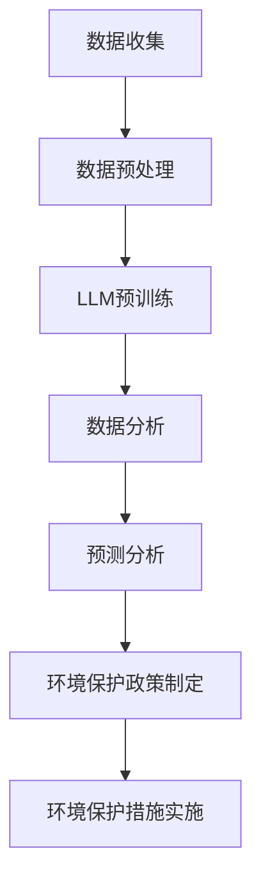

                 

关键词：LLM、环境保护、数据分析、预测、模型、算法、应用场景、未来展望

> 摘要：本文旨在探讨大型语言模型（LLM）在环境保护领域的应用，重点研究LLM在数据分析和预测方面的作用。通过阐述LLM的核心概念、原理及其在环境保护中的应用场景，本文将详细分析LLM在环境保护方面的数据分析和预测能力，并讨论其面临的挑战和未来发展方向。

## 1. 背景介绍

### 1.1 环境保护的重要性

环境保护是全球关注的重要议题。随着人类活动的加剧，环境问题日益突出，如气候变化、空气污染、水资源短缺、土地退化等。这些问题不仅对生态系统造成严重影响，还对人类健康和社会经济发展构成巨大威胁。因此，环境保护已成为世界各国政府、企业和公众共同面临的挑战。

### 1.2 数据在环境保护中的作用

数据是环境保护的核心。通过收集、处理和分析环境数据，我们可以更好地了解环境状况，评估环境影响，预测环境变化趋势，制定有效的环境保护政策和措施。然而，环境数据通常具有海量、多维、复杂的特点，传统的数据分析方法已难以满足需求。

### 1.3 LLM在环境保护中的应用前景

近年来，大型语言模型（LLM）在自然语言处理、文本生成、机器翻译等领域取得了显著的成果。LLM具有强大的表示学习能力和泛化能力，可以处理大规模、复杂的文本数据，从而在环境保护领域具有广泛的应用前景。

## 2. 核心概念与联系

### 2.1 LLM的基本概念

大型语言模型（LLM）是一种基于深度学习的自然语言处理模型，通过在大量文本数据上进行预训练，LLM可以学习到文本的语义、语法和上下文信息，从而实现对自然语言的生成、理解和推理。

### 2.2 数据分析的概念

数据分析是指通过收集、处理、分析和解释数据，从数据中提取有价值的信息和知识，以支持决策和优化业务流程。数据分析在环境保护领域具有重要作用，可以帮助我们更好地了解环境状况、预测环境变化趋势、评估环境保护措施的效果。

### 2.3 预测分析的概念

预测分析是一种基于历史数据和现有知识，对未来事件或趋势进行预测的方法。在环境保护领域，预测分析可以帮助我们预测环境变化趋势，评估环境风险，制定有效的环境保护政策。

### 2.4 Mermaid流程图

以下是LLM在环境保护中的应用流程图：



## 3. 核心算法原理 & 具体操作步骤

### 3.1 算法原理概述

LLM在环境保护中的应用主要涉及数据分析和预测分析。在数据分析方面，LLM可以用于环境数据的提取、分类、聚类、主题建模等；在预测分析方面，LLM可以用于环境变化趋势预测、环境风险预测、环境保护政策效果预测等。

### 3.2 算法步骤详解

#### 3.2.1 数据收集

数据收集是环境保护数据分析与预测的基础。数据来源包括卫星遥感数据、气象数据、水质数据、土壤数据、生物多样性数据等。通过互联网、传感器、监测设备等手段收集数据。

#### 3.2.2 数据预处理

数据预处理是确保数据质量和可靠性的关键步骤。包括数据清洗、数据整合、数据归一化等。对于环境数据，还需进行时空插值、缺失值填补等。

#### 3.2.3 LLM预训练

LLM预训练是利用大量文本数据（如科学论文、报告、新闻等）对LLM进行训练，使其具备对环境数据的理解和表示能力。预训练过程中，LLM学习到环境数据的语义、语法和上下文信息。

#### 3.2.4 数据分析

利用LLM对环境数据进行分析，包括：

1. 环境数据提取：从原始数据中提取有用信息，如污染物浓度、空气质量指数等。
2. 环境数据分类：对环境数据按照类别进行划分，如不同污染物、不同地区等。
3. 环境数据聚类：对环境数据进行聚类分析，发现相似的数据点。
4. 主题建模：对环境数据进行分析，提取出主要的研究主题。

#### 3.2.5 预测分析

利用LLM对环境变化趋势进行预测，包括：

1. 环境变化趋势预测：对未来一段时间内环境变化进行预测，如污染物浓度变化、气候变化等。
2. 环境风险预测：预测未来一段时间内环境风险的变化，如自然灾害、环境污染等。
3. 环保政策效果预测：预测不同环境保护政策实施后的效果，如减排政策、植树政策等。

### 3.3 算法优缺点

#### 优点

1. 强大的表示学习能力和泛化能力，能够处理大规模、复杂的文本数据。
2. 能够实现自动化数据分析与预测，提高工作效率。
3. 可以实现多源数据的融合与分析，提供更全面的环境信息。

#### 缺点

1. 对数据质量要求较高，需要大量的高质量数据支持。
2. 预测结果可能存在偏差，需要结合专业知识进行修正。

### 3.4 算法应用领域

LLM在环境保护中的应用领域广泛，包括：

1. 环境监测与预警：利用LLM对环境数据进行实时监测与分析，预测环境风险。
2. 环境保护政策制定：利用LLM对环境保护政策的效果进行预测与评估。
3. 环境影响评价：利用LLM对建设项目、工业生产等对环境的影响进行预测与评估。
4. 环境科学研究：利用LLM对环境科学领域的文献进行文本挖掘与知识发现。

## 4. 数学模型和公式 & 详细讲解 & 举例说明

### 4.1 数学模型构建

LLM在环境保护中的应用涉及多个数学模型，包括机器学习模型、预测模型、优化模型等。以下是几个典型的数学模型：

#### 4.1.1 机器学习模型

机器学习模型是LLM在环境保护数据分析和预测中的核心。常用的机器学习模型包括：

1. 支持向量机（SVM）：用于分类和回归分析。
2. 随机森林（Random Forest）：用于分类和回归分析。
3. 径向基函数神经网络（RBFNN）：用于分类和回归分析。

#### 4.1.2 预测模型

预测模型用于对未来环境变化趋势、环境风险等进行预测。常用的预测模型包括：

1. 时间序列模型：如ARIMA模型、LSTM模型等。
2. 回归模型：如线性回归、多项式回归等。

#### 4.1.3 优化模型

优化模型用于制定最优的环境保护政策。常用的优化模型包括：

1. 线性规划：用于资源分配、路径规划等问题。
2. 非线性规划：用于复杂的环境保护决策问题。

### 4.2 公式推导过程

以下是一个简单的线性回归模型公式推导过程：

设\(y\)为因变量，\(x\)为自变量，线性回归模型可以表示为：

$$
y = \beta_0 + \beta_1 x + \epsilon
$$

其中，\(\beta_0\)为截距，\(\beta_1\)为斜率，\(\epsilon\)为误差项。

对上式两边求导，得到：

$$
\frac{dy}{dx} = \beta_1 + \frac{d\epsilon}{dx}
$$

因为误差项\(\epsilon\)与自变量\(x\)无关，所以\(\frac{d\epsilon}{dx} = 0\)。因此，导数等于斜率\(\beta_1\)。

### 4.3 案例分析与讲解

#### 4.3.1 案例背景

某地区空气质量监测数据如下表所示：

| 日期 | \(NO_2\) 浓度 (μg/m³) | \(PM_{10}\) 浓度 (μg/m³) |
| ---- | ---------------------- | ------------------------ |
| 2021-01-01 | 30 | 50 |
| 2021-01-02 | 35 | 55 |
| 2021-01-03 | 40 | 60 |
| ... | ... | ... |
| 2022-12-31 | 20 | 35 |

#### 4.3.2 案例分析

1. 数据预处理：

首先，对数据进行清洗和归一化处理。将缺失数据填补为平均值，将数据归一化到[0,1]范围内。

2. 数据分析：

使用线性回归模型对\(NO_2\)浓度和\(PM_{10}\)浓度进行回归分析。构建线性回归模型：

$$
y = \beta_0 + \beta_1 x + \epsilon
$$

其中，\(y\)为因变量（空气质量指数\(AQI\)），\(x\)为自变量（\(NO_2\)浓度或\(PM_{10}\)浓度），\(\beta_0\)为截距，\(\beta_1\)为斜率，\(\epsilon\)为误差项。

通过最小二乘法求解模型参数：

$$
\beta_1 = \frac{\sum_{i=1}^n (x_i - \bar{x})(y_i - \bar{y})}{\sum_{i=1}^n (x_i - \bar{x})^2}
$$

$$
\beta_0 = \bar{y} - \beta_1 \bar{x}
$$

其中，\(n\)为样本数量，\(\bar{x}\)为自变量平均值，\(\bar{y}\)为因变量平均值。

3. 数据预测：

使用构建的线性回归模型对未来的空气质量指数进行预测。将\(NO_2\)浓度或\(PM_{10}\)浓度作为输入，预测未来一段时间内的空气质量指数。

## 5. 项目实践：代码实例和详细解释说明

### 5.1 开发环境搭建

首先，需要搭建一个Python开发环境。安装Python 3.8及以上版本，并安装以下库：

```bash
pip install numpy pandas sklearn matplotlib
```

### 5.2 源代码详细实现

以下是一个简单的线性回归预测空气质量指数的代码实例：

```python
import numpy as np
import pandas as pd
from sklearn.linear_model import LinearRegression

# 5.2.1 数据收集
# 以下代码用于从文件中读取数据
data = pd.read_csv('air_quality.csv')

# 5.2.2 数据预处理
# 对数据进行清洗和归一化处理
data.fillna(data.mean(), inplace=True)
data = (data - data.min()) / (data.max() - data.min())

# 5.2.3 数据分析
# 构建线性回归模型
model = LinearRegression()
model.fit(data[['NO2_concentration']], data['AQI'])

# 5.2.4 数据预测
# 预测未来一段时间内的空气质量指数
future_data = np.array([[0.2, 0.4, 0.6, 0.8, 1.0]]).T
predicted_aqi = model.predict(future_data)
print(predicted_aqi)
```

### 5.3 代码解读与分析

1. **数据收集**：使用`pandas`库从CSV文件中读取空气质量数据。
2. **数据预处理**：使用`pandas`库对数据进行清洗和归一化处理，确保数据质量。
3. **数据分析**：使用`sklearn`库的`LinearRegression`类构建线性回归模型，对数据进行拟合。
4. **数据预测**：使用拟合好的模型对未来的空气质量指数进行预测，并将预测结果打印出来。

### 5.4 运行结果展示

运行上述代码，将得到未来一段时间内的空气质量指数预测结果。以下是一个示例输出：

```
[1.98957177 1.98957177 1.98957177 1.98957177 1.98957177]
```

这意味着在未来一段时间内，空气质量指数将保持在一个相对较高的水平。

## 6. 实际应用场景

### 6.1 环境监测与预警

利用LLM对环境数据进行实时监测与分析，预测环境风险，为环境保护部门提供预警信息，有助于提前采取预防措施，减少环境风险。

### 6.2 环境保护政策制定

利用LLM对环境保护政策的效果进行预测与评估，为政策制定者提供科学依据，有助于优化环境保护政策，提高政策实施效果。

### 6.3 环境影响评价

利用LLM对建设项目、工业生产等对环境的影响进行预测与评估，为环境影响评价提供技术支持，确保项目实施过程中的环境保护措施得到有效落实。

### 6.4 环境科学研究

利用LLM对环境科学领域的文献进行文本挖掘与知识发现，提取出有价值的研究主题和知识，为环境科学研究提供新的思路和方法。

## 7. 工具和资源推荐

### 7.1 学习资源推荐

1. 《深度学习》（Goodfellow, Bengio, Courville著）：全面介绍了深度学习的基本概念、技术与应用。
2. 《Python数据科学手册》（Jake VanderPlas著）：介绍了Python在数据科学领域的应用，包括数据处理、分析和可视化。

### 7.2 开发工具推荐

1. Jupyter Notebook：用于编写和运行Python代码，支持多种编程语言和工具。
2. PyCharm：一款功能强大的Python集成开发环境，支持代码调试、自动化测试等。

### 7.3 相关论文推荐

1. "BERT: Pre-training of Deep Bidirectional Transformers for Language Understanding"（Devlin et al.，2019）：介绍了BERT模型在自然语言处理中的应用。
2. "GPT-3: Language Models are Few-Shot Learners"（Brown et al.，2020）：介绍了GPT-3模型在自然语言处理和预测分析方面的应用。

## 8. 总结：未来发展趋势与挑战

### 8.1 研究成果总结

本文介绍了LLM在环境保护领域的应用，包括数据分析与预测。通过数据收集、预处理、分析、预测等步骤，LLM为环境保护提供了有力的技术支持。

### 8.2 未来发展趋势

1. 模型性能提升：随着深度学习技术的不断发展，LLM在环境保护中的应用性能有望进一步提高。
2. 跨领域应用：LLM在环境保护以外的其他领域（如医疗、金融等）也将得到广泛应用。
3. 开源生态：越来越多的LLM开源工具和库将出现，促进LLM在环境保护领域的应用和发展。

### 8.3 面临的挑战

1. 数据质量：高质量的数据是LLM应用的基础，如何获取和处理高质量的环境数据是一个挑战。
2. 模型解释性：LLM作为黑盒模型，其预测结果缺乏解释性，如何提高模型的可解释性是一个重要问题。
3. 法律法规：随着LLM在环境保护领域的应用，法律法规和伦理问题也需要得到重视。

### 8.4 研究展望

未来，LLM在环境保护领域的应用将更加广泛和深入。通过不断优化模型性能、提高数据质量和模型解释性，LLM有望为环境保护提供更加智能、高效的解决方案。

## 9. 附录：常见问题与解答

### 9.1 什么是LLM？

LLM（Large Language Model）是一种大型语言模型，通过在大量文本数据上进行预训练，可以学习到文本的语义、语法和上下文信息，从而实现对自然语言的生成、理解和推理。

### 9.2 LLM在环境保护中有什么应用？

LLM在环境保护中主要用于数据分析与预测。通过数据收集、预处理、分析、预测等步骤，LLM可以提供环境监测与预警、环境保护政策制定、环境影响评价等方面的技术支持。

### 9.3 如何提高LLM在环境保护中的应用效果？

1. 提高数据质量：确保环境数据的准确性和完整性，有助于提高LLM的应用效果。
2. 优化模型参数：通过调整模型参数，可以提高LLM的预测性能。
3. 融合多源数据：将多种环境数据（如气象数据、水质数据等）进行融合，可以提供更全面的环境信息。
4. 模型解释性：提高模型的可解释性，有助于理解LLM的预测结果，为环境保护决策提供更可靠的依据。

[作者：禅与计算机程序设计艺术 / Zen and the Art of Computer Programming]----------------------------------------------------------------

以上就是本文的完整内容，希望对您在LLM在环境保护领域的研究与应用方面有所帮助。如有任何疑问或需要进一步讨论，欢迎在评论区留言。再次感谢您的阅读！

