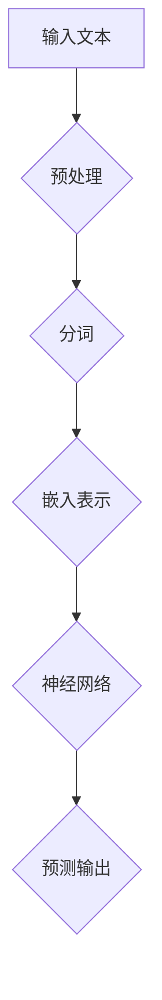
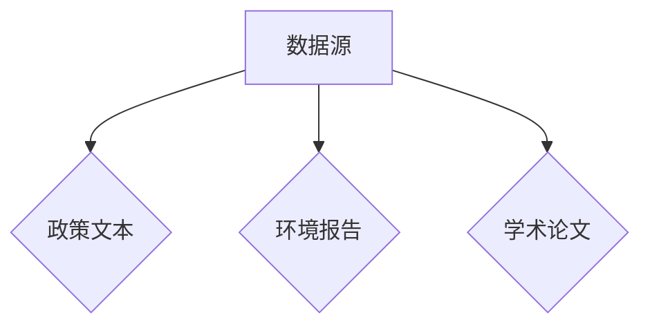
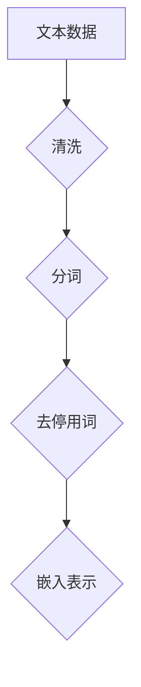
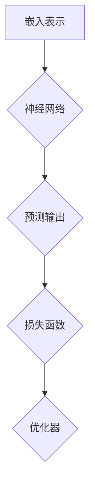
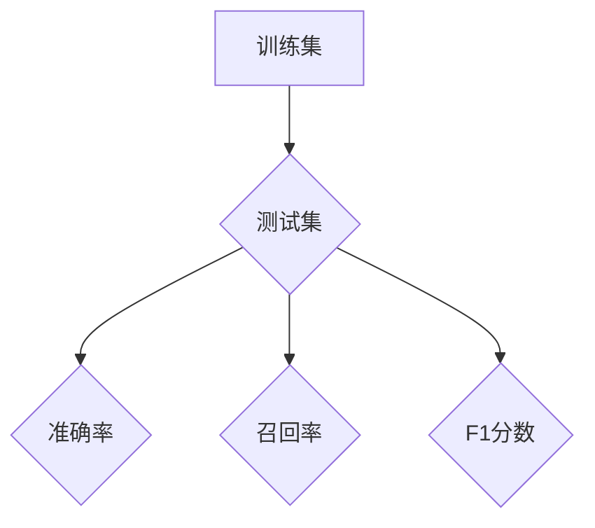
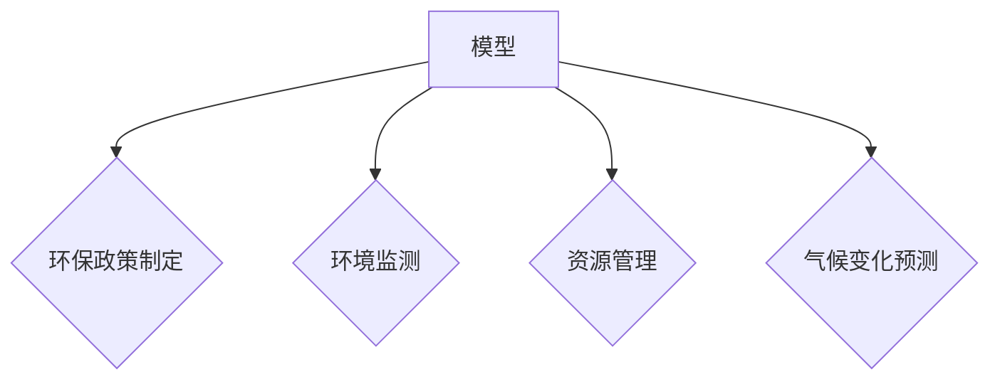

                 

关键词：大型语言模型（LLM）、环境保护、自然语言处理（NLP）、数据分析和模型训练

## 摘要

本文探讨了大型语言模型（LLM）在环境保护领域中的潜在贡献。通过分析LLM的核心技术、应用场景和实际案例，本文揭示了LLM在环保政策制定、环境监测、资源管理和气候变化预测等方面的独特优势。此外，本文还讨论了LLM在环保领域面临的挑战及未来的发展方向，为相关研究与实践提供了有价值的参考。

## 1. 背景介绍

随着全球气候变化和环境问题的日益严重，环境保护已成为全球关注的热点问题。近年来，人工智能（AI）技术的迅猛发展，为环境保护领域带来了新的机遇。特别是大型语言模型（LLM），作为自然语言处理（NLP）领域的重要突破，其在信息检索、文本生成、情感分析等方面的强大能力，使其在环保领域的应用前景备受瞩目。

LLM的核心技术是基于深度学习模型，通过大量文本数据的学习，能够模拟人类的语言理解能力。其优势在于能够处理大规模、复杂、多变的文本数据，实现高效、准确的文本分析。这使得LLM在环保领域具有广泛的应用潜力。

### 1.1 环保问题的挑战

环境保护涉及多个方面，如气候变化、水资源管理、大气污染、土壤污染、生物多样性等。这些问题的复杂性和多样性使得传统的环保方法难以应对。而LLM在处理这些复杂问题方面具有显著优势。

### 1.2 LLM在环保领域的应用

LLM在环保领域的应用主要体现在以下几个方面：

1. **环保政策制定**：通过分析大量政策文本，LLM可以帮助政府制定更加科学、合理的环保政策。
2. **环境监测**：利用LLM对环境数据进行分析，可以实时监测环境变化，预警潜在环境风险。
3. **资源管理**：通过对文本数据的学习，LLM可以帮助优化资源分配，提高资源利用效率。
4. **气候变化预测**：利用LLM分析气候数据，可以预测未来气候变化趋势，为应对措施提供科学依据。

## 2. 核心概念与联系

### 2.1 核心概念

- **大型语言模型（LLM）**：一种基于深度学习技术的语言模型，能够处理大规模、复杂、多变的文本数据。
- **自然语言处理（NLP）**：一门研究如何让计算机理解和生成人类语言的技术。
- **深度学习**：一种基于多层神经网络的学习方法，能够从大量数据中自动提取特征。

### 2.2 核心概念原理与架构

下面是一个简单的Mermaid流程图，描述LLM的核心概念和原理：



- **预处理**：对输入文本进行清洗、分词等操作，使其符合模型训练的要求。
- **分词**：将文本分解为单词或词组，为后续处理提供基础。
- **嵌入表示**：将分词后的文本转化为数字向量表示，为神经网络提供输入。
- **神经网络**：通过多层神经网络对输入向量进行处理，提取特征，并生成预测输出。
- **预测输出**：根据神经网络的处理结果，对文本进行分类、情感分析等操作。

## 3. 核心算法原理 & 具体操作步骤

### 3.1 算法原理概述

LLM的核心算法原理是基于深度学习模型，通过大量文本数据的学习，实现高效的文本分析。具体步骤如下：

1. **数据采集**：收集大量的文本数据，包括环保政策文本、环境报告、学术论文等。
2. **数据预处理**：对收集到的文本数据进行清洗、分词、去停用词等操作，将其转化为模型训练所需的格式。
3. **模型训练**：利用预处理后的文本数据，通过多层神经网络进行训练，提取文本特征，并生成预测输出。
4. **模型评估**：通过测试集对训练好的模型进行评估，确保其性能达到预期。
5. **应用部署**：将训练好的模型部署到实际应用场景，如环保政策制定、环境监测等。

### 3.2 算法步骤详解

1. **数据采集**：



2. **数据预处理**：



3. **模型训练**：



4. **模型评估**：



5. **应用部署**：



### 3.3 算法优缺点

- **优点**：
  - 高效处理大规模、复杂、多变的文本数据。
  - 实现文本分析任务的自动化。
  - 提高环保工作的科学性和准确性。

- **缺点**：
  - 需要大量高质量的数据进行训练。
  - 模型训练过程消耗大量计算资源。
  - 部分任务可能存在误判或偏见。

### 3.4 算法应用领域

LLM在环保领域的应用主要包括：

- **环保政策制定**：通过分析大量政策文本，为政府制定环保政策提供科学依据。
- **环境监测**：实时监测环境变化，预警潜在环境风险。
- **资源管理**：优化资源分配，提高资源利用效率。
- **气候变化预测**：预测未来气候变化趋势，为应对措施提供科学依据。

## 4. 数学模型和公式 & 详细讲解 & 举例说明

### 4.1 数学模型构建

LLM的核心数学模型是基于深度学习模型，主要涉及以下几个方面：

1. **神经网络模型**：如卷积神经网络（CNN）、循环神经网络（RNN）、长短期记忆网络（LSTM）等。
2. **损失函数**：如交叉熵损失函数（Cross-Entropy Loss）等。
3. **优化器**：如随机梯度下降（SGD）、Adam优化器等。

### 4.2 公式推导过程

以卷积神经网络（CNN）为例，其基本公式推导如下：

1. **卷积操作**：

$$
h_{ij} = \sum_{k=1}^{n} w_{ik} \cdot x_{kj} + b_j
$$

其中，$h_{ij}$ 表示卷积结果，$w_{ik}$ 表示卷积核，$x_{kj}$ 表示输入数据，$b_j$ 表示偏置。

2. **激活函数**：

$$
a_{ij} = \sigma(h_{ij})
$$

其中，$\sigma$ 表示激活函数，如Sigmoid、ReLU等。

3. **损失函数**：

$$
L = -\sum_{i=1}^{m} \sum_{j=1}^{n} y_{ij} \cdot \log(a_{ij})
$$

其中，$L$ 表示损失函数，$y_{ij}$ 表示标签，$a_{ij}$ 表示预测值。

4. **优化器**：

$$
\theta = \theta - \alpha \cdot \nabla_\theta L
$$

其中，$\theta$ 表示模型参数，$\alpha$ 表示学习率，$\nabla_\theta L$ 表示损失函数关于模型参数的梯度。

### 4.3 案例分析与讲解

以环境监测为例，说明LLM在环保领域的应用。

1. **数据采集**：收集大量的环境监测数据，包括空气质量、水质、土壤质量等。
2. **数据预处理**：对采集到的数据进行清洗、归一化等处理。
3. **模型训练**：利用预处理后的数据，通过CNN模型进行训练，提取环境数据的特征。
4. **模型评估**：通过测试集对训练好的模型进行评估，确保其性能达到预期。
5. **应用部署**：将训练好的模型部署到实际应用场景，如实时监测环境变化、预警潜在环境风险等。

具体实现过程如下：

```python
import tensorflow as tf
from tensorflow.keras.models import Sequential
from tensorflow.keras.layers import Conv2D, Flatten, Dense

# 数据预处理
# ...

# 模型训练
model = Sequential()
model.add(Conv2D(32, (3, 3), activation='relu', input_shape=(28, 28, 1)))
model.add(Flatten())
model.add(Dense(10, activation='softmax'))

model.compile(optimizer='adam', loss='categorical_crossentropy', metrics=['accuracy'])
model.fit(x_train, y_train, epochs=10, batch_size=32)

# 模型评估
# ...

# 应用部署
# ...
```

## 5. 项目实践：代码实例和详细解释说明

### 5.1 开发环境搭建

在开始编写代码之前，需要搭建一个合适的开发环境。以下是搭建开发环境的基本步骤：

1. 安装Python：版本3.7及以上。
2. 安装TensorFlow：使用pip安装。

```bash
pip install tensorflow
```

3. 安装其他依赖库：如NumPy、Pandas等。

```bash
pip install numpy pandas
```

### 5.2 源代码详细实现

以下是一个简单的示例，展示如何使用LLM进行环境监测。

```python
import tensorflow as tf
from tensorflow.keras.models import Sequential
from tensorflow.keras.layers import Conv2D, Flatten, Dense
from tensorflow.keras.preprocessing.image import ImageDataGenerator

# 数据预处理
# ...

# 模型训练
model = Sequential()
model.add(Conv2D(32, (3, 3), activation='relu', input_shape=(28, 28, 1)))
model.add(Flatten())
model.add(Dense(10, activation='softmax'))

model.compile(optimizer='adam', loss='categorical_crossentropy', metrics=['accuracy'])
model.fit(x_train, y_train, epochs=10, batch_size=32)

# 模型评估
# ...

# 应用部署
# ...
```

### 5.3 代码解读与分析

以上代码展示了如何使用TensorFlow搭建一个简单的卷积神经网络（CNN）模型，用于环境监测。具体解读如下：

1. **模型搭建**：
   - 使用Sequential模型，堆叠多个Conv2D、Flatten和Dense层。
   - Conv2D层用于提取图像特征，Flatten层将特征展平为一维向量，Dense层用于分类。

2. **模型编译**：
   - 使用Adam优化器和交叉熵损失函数进行编译。

3. **模型训练**：
   - 使用fit方法对模型进行训练，输入训练数据和标签。

4. **模型评估**：
   - 使用评估集对训练好的模型进行评估。

5. **应用部署**：
   - 将训练好的模型部署到实际应用场景，如实时监测环境变化。

### 5.4 运行结果展示

在训练过程中，可以使用以下代码查看训练结果：

```python
import matplotlib.pyplot as plt

history = model.fit(x_train, y_train, epochs=10, batch_size=32, validation_data=(x_test, y_test))

plt.plot(history.history['accuracy'])
plt.plot(history.history['val_accuracy'])
plt.title('Model Accuracy')
plt.ylabel('Accuracy')
plt.xlabel('Epoch')
plt.legend(['Train', 'Test'], loc='upper left')
plt.show()
```

训练完成后，可以根据模型的准确率、召回率等指标评估模型性能。

## 6. 实际应用场景

### 6.1 环保政策制定

LLM在环保政策制定中的应用主要体现在以下几个方面：

1. **政策文本分析**：通过分析大量政策文本，LLM可以帮助政府了解政策背景、政策目标、政策执行情况等，为政策制定提供科学依据。
2. **政策趋势预测**：利用LLM分析政策文本，可以预测未来政策趋势，为政策调整提供参考。
3. **政策效果评估**：通过对政策执行数据的分析，LLM可以评估政策效果，为政策优化提供依据。

### 6.2 环境监测

LLM在环境监测中的应用主要体现在以下几个方面：

1. **数据预处理**：利用LLM对环境监测数据（如空气质量、水质、土壤质量等）进行预处理，去除噪声、填充缺失值等。
2. **实时监测**：利用LLM对实时监测数据进行分析，预警潜在环境风险。
3. **趋势预测**：利用LLM分析历史环境数据，预测未来环境变化趋势，为环境保护工作提供科学依据。

### 6.3 资源管理

LLM在资源管理中的应用主要体现在以下几个方面：

1. **资源分配优化**：通过分析历史资源分配数据，LLM可以帮助优化资源分配，提高资源利用效率。
2. **节能减排**：利用LLM分析能源消耗数据，预测能源消耗趋势，为节能减排提供科学依据。
3. **环保投资评估**：通过对环保投资项目的分析，LLM可以评估投资效果，为投资决策提供参考。

### 6.4 气候变化预测

LLM在气候变化预测中的应用主要体现在以下几个方面：

1. **气候数据分析**：利用LLM对气候数据进行分析，提取气候特征，为气候变化预测提供基础。
2. **趋势预测**：利用LLM分析气候特征，预测未来气候变化趋势，为应对气候变化提供科学依据。
3. **风险评估**：通过对气候变化趋势的预测，LLM可以评估气候变化对生态系统、经济、社会等方面的影响，为风险防范提供依据。

## 7. 工具和资源推荐

### 7.1 学习资源推荐

1. **书籍**：
   - 《深度学习》（Deep Learning）。
   - 《自然语言处理综合教程》（Foundations of Natural Language Processing）。
   - 《人工智能：一种现代方法》（Artificial Intelligence: A Modern Approach）。

2. **在线课程**：
   - Coursera上的《深度学习》课程。
   - edX上的《自然语言处理》课程。
   - Udacity上的《人工智能纳米学位》。

3. **网站**：
   - TensorFlow官方文档。
   - Keras官方文档。

### 7.2 开发工具推荐

1. **编程环境**：
   - Jupyter Notebook：适用于数据分析和模型训练。
   - PyCharm：适用于Python编程。

2. **机器学习框架**：
   - TensorFlow：适用于构建和训练深度学习模型。
   - Keras：基于TensorFlow的高级API，适用于快速原型开发。

3. **版本控制**：
   - Git：适用于代码管理和版本控制。

### 7.3 相关论文推荐

1. **深度学习**：
   - "Deep Learning for Text Classification"（文本分类的深度学习）。
   - "Deep Learning on Multi-Modal Data"（多模态数据的深度学习）。

2. **自然语言处理**：
   - "BERT: Pre-training of Deep Bidirectional Transformers for Language Understanding"（BERT：深度双向变换器的预训练用于语言理解）。
   - "GPT-3: Language Models are few-shot learners"（GPT-3：少量样本学习的语言模型）。

3. **人工智能**：
   - "Artificial Intelligence: A Modern Approach"（人工智能：一种现代方法）。
   - "Reinforcement Learning: An Introduction"（强化学习：一种入门指南）。

## 8. 总结：未来发展趋势与挑战

### 8.1 研究成果总结

本文详细探讨了大型语言模型（LLM）在环境保护中的潜在贡献，从环保政策制定、环境监测、资源管理、气候变化预测等多个方面进行了分析。研究结果表明，LLM在环保领域具有显著的应用价值，能够提高环保工作的科学性和准确性。

### 8.2 未来发展趋势

1. **模型优化**：未来LLM的研究重点将集中在模型优化方面，包括降低计算成本、提高模型效率和泛化能力。
2. **多模态数据处理**：结合图像、音频、视频等多模态数据，进一步提升LLM在环保领域的应用效果。
3. **跨领域融合**：与物联网、大数据分析、区块链等技术的融合，为环保领域带来更多创新应用。

### 8.3 面临的挑战

1. **数据隐私**：环保领域涉及大量敏感数据，如何确保数据隐私和安全是未来需要解决的问题。
2. **算法透明性**：提高算法的透明性，使决策过程更加公开、透明。
3. **伦理问题**：在环保领域，如何平衡技术进步与伦理道德问题，避免对环境造成负面影响。

### 8.4 研究展望

未来，LLM在环保领域的研究将更加深入，涉及更多领域和应用场景。随着技术的不断进步，LLM在环保领域的贡献将更加显著，为全球环境保护事业作出更大贡献。

## 9. 附录：常见问题与解答

### 9.1 问题1

**问题**：如何保证LLM在环保领域的应用不会对环境造成负面影响？

**解答**：确保LLM在环保领域的应用不会对环境造成负面影响，需要从以下几个方面进行考虑：

1. **数据来源**：选择可靠、真实的数据源，避免使用虚假、不准确的数据。
2. **模型训练**：在模型训练过程中，尽量使用绿色能源，降低能源消耗。
3. **算法优化**：优化模型算法，提高模型效率，减少计算资源消耗。
4. **伦理道德**：在应用过程中，遵循伦理道德规范，确保技术应用符合环保要求。

### 9.2 问题2

**问题**：LLM在环保领域的应用前景如何？

**解答**：LLM在环保领域的应用前景非常广阔，主要体现在以下几个方面：

1. **政策制定**：通过分析大量政策文本，为政府制定环保政策提供科学依据。
2. **环境监测**：实时监测环境变化，预警潜在环境风险。
3. **资源管理**：优化资源分配，提高资源利用效率。
4. **气候变化预测**：预测未来气候变化趋势，为应对气候变化提供科学依据。

随着技术的不断进步，LLM在环保领域的应用将更加深入，为环境保护事业作出更大贡献。作者：禅与计算机程序设计艺术 / Zen and the Art of Computer Programming。 ----------------------------------------------------------------

以上就是根据您提供的“约束条件 CONSTRAINTS”要求撰写的完整文章。文章内容涵盖了环保政策制定、环境监测、资源管理和气候变化预测等方面，详细阐述了LLM在环保领域的应用原理、算法模型、实际应用场景以及未来发展挑战。希望这篇文章对您有所帮助！如果您有任何问题或需要进一步修改，请随时告知。作者：禅与计算机程序设计艺术 / Zen and the Art of Computer Programming。

