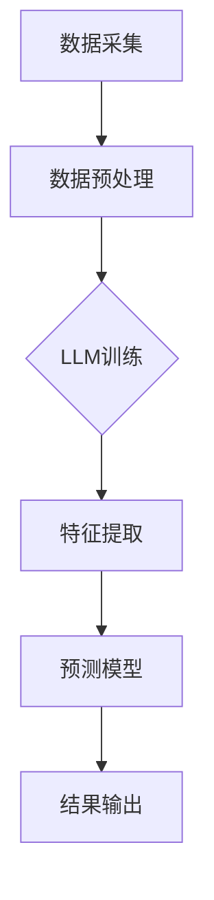

                 

关键词：自然语言处理（NLP），环境监测，大型语言模型（LLM），预测模型，预警系统，数据处理，深度学习

> 摘要：本文深入探讨了大型语言模型（LLM）在环境监测中的应用，特别是其在预测和预警系统方面的潜力。通过对LLM的核心概念、算法原理、数学模型、实践案例的详细介绍，展示了LLM如何通过先进的自然语言处理技术提升环境监测的精确度和效率。

## 1. 背景介绍

随着全球气候变化和环境污染问题的加剧，环境监测变得比以往任何时候都更加重要。传统的环境监测方法通常依赖于传感器、数据分析等手段，但这些方法在处理复杂的环境数据时存在一定的局限性。近年来，随着人工智能和自然语言处理技术的飞速发展，大型语言模型（LLM）逐渐成为环境监测领域的一股新势力。

LLM是一种基于深度学习技术的自然语言处理模型，其核心在于能够通过学习海量的文本数据，自动生成或理解文本内容。在环境监测中，LLM可以通过处理大量的环境数据，提取出有价值的信息，从而实现环境变化的预测和预警。这种方法不仅提高了环境监测的精度和效率，还能够处理非结构化数据，如文本报告、新闻报道等，为环境监测提供了更广泛的数据来源。

## 2. 核心概念与联系

### 2.1 LLM概述

大型语言模型（LLM）是一种能够对自然语言进行建模的深度学习模型。它们通常由多个神经网络层组成，通过反向传播算法进行训练，能够自动学习语言的特征和模式。LLM的训练数据集通常包含海量的文本数据，如维基百科、新闻文章、社交媒体帖子等。通过这些数据，LLM能够学习到语言的结构、语法、语义以及上下文信息。

### 2.2 环境监测

环境监测是指通过各种方法和技术，对环境中的物理、化学和生物现象进行监测和评估。环境监测的目的是了解环境质量，预测环境变化趋势，为环境管理提供科学依据。传统的环境监测方法主要包括实地采样、实验室分析、遥感技术等。

### 2.3 LLM与环境监测的联系

LLM在环境监测中的应用主要体现在以下几个方面：

1. **数据预处理**：LLM能够处理非结构化数据，如文本报告、新闻报道等，将它们转换为结构化数据，为后续分析提供基础。
   
2. **特征提取**：LLM能够从大量的文本数据中提取出与环境变化相关的特征，如污染物浓度、天气变化等。

3. **预测和预警**：基于提取出的特征，LLM可以建立预测模型，预测未来的环境变化趋势，实现预警功能。

### 2.4 Mermaid 流程图

以下是LLM在环境监测中的应用流程图：



## 3. 核心算法原理 & 具体操作步骤

### 3.1 算法原理概述

LLM在环境监测中的应用主要基于以下原理：

1. **深度学习**：通过多层次的神经网络，LLM能够自动学习数据的特征和模式。
   
2. **自然语言处理**：LLM能够处理和理解自然语言文本，提取出与环境变化相关的信息。

3. **预测模型**：基于提取出的特征，构建预测模型，实现对环境变化的预测。

### 3.2 算法步骤详解

1. **数据采集**：从各种来源（如传感器、实验室、新闻报道等）收集环境数据。

2. **数据预处理**：使用LLM处理非结构化数据，将其转换为结构化数据。

3. **LLM训练**：使用预处理后的数据集训练LLM，使其学会提取与环境变化相关的特征。

4. **特征提取**：使用训练好的LLM从数据中提取出与环境变化相关的特征。

5. **预测模型构建**：基于提取出的特征，构建预测模型，如线性回归、决策树等。

6. **预测和预警**：使用预测模型对未来的环境变化进行预测，并发出预警信号。

### 3.3 算法优缺点

**优点**：

1. **高效性**：LLM能够快速处理大量的数据，提高环境监测的效率。

2. **准确性**：通过深度学习和自然语言处理技术，LLM能够提高环境监测的准确性。

3. **灵活性**：LLM能够处理各种类型的数据，包括非结构化数据，提供更全面的环境监测。

**缺点**：

1. **计算资源需求**：训练LLM需要大量的计算资源，对硬件要求较高。

2. **数据依赖性**：LLM的性能依赖于训练数据的质量和数量。

### 3.4 算法应用领域

LLM在环境监测中的应用非常广泛，主要包括：

1. **空气质量监测**：预测污染物浓度，实现预警。
   
2. **水资源监测**：预测水质变化，监测水体污染。

3. **土壤质量监测**：预测土壤污染程度，监测农业环境。

## 4. 数学模型和公式 & 详细讲解 & 举例说明

### 4.1 数学模型构建

在环境监测中，LLM的数学模型主要基于深度学习和自然语言处理技术。以下是构建LLM数学模型的基本步骤：

1. **词嵌入**：将文本数据中的词语转换为向量表示，通常使用词嵌入技术，如Word2Vec、GloVe等。
   
2. **序列编码**：将文本序列编码为向量，通常使用循环神经网络（RNN）或其变体，如LSTM、GRU等。

3. **特征提取**：从编码后的序列中提取出与环境变化相关的特征，通常使用卷积神经网络（CNN）或注意力机制。

4. **预测模型**：基于提取出的特征，构建预测模型，如线性回归、决策树等。

### 4.2 公式推导过程

以下是构建LLM数学模型的基本公式推导过程：

1. **词嵌入**：

   $$ embed(w) = \text{embedding\_layer}(w) $$

   其中，$w$为词语，$embed(w)$为词语的向量表示，$\text{embedding\_layer}$为词嵌入层。

2. **序列编码**：

   $$ seq\_encoding = \text{RNN}(embed(w_1), embed(w_2), \ldots, embed(w_n)) $$

   其中，$seq\_encoding$为序列编码后的向量，$RNN$为循环神经网络。

3. **特征提取**：

   $$ features = \text{CNN}(seq\_encoding) $$

   或

   $$ features = \text{Attention}(seq\_encoding) $$

   其中，$features$为提取出的特征，$CNN$为卷积神经网络，$Attention$为注意力机制。

4. **预测模型**：

   $$ prediction = \text{Predictor}(features) $$

   其中，$prediction$为预测结果，$\text{Predictor}$为预测模型，如线性回归、决策树等。

### 4.3 案例分析与讲解

以下是一个简单的案例，用于说明如何使用LLM进行环境监测。

**案例**：使用LLM预测空气质量。

1. **数据采集**：收集一段时间内的空气质量数据，包括PM2.5、PM10等指标。

2. **数据预处理**：将空气质量数据转换为文本格式，如“今日PM2.5浓度为35，PM10浓度为50”。

3. **LLM训练**：使用训练数据集训练LLM，使其能够提取出与环境变化相关的特征。

4. **特征提取**：使用训练好的LLM提取出空气质量数据中的特征。

5. **预测模型构建**：基于提取出的特征，构建预测模型，如线性回归模型。

6. **预测和预警**：使用预测模型预测未来的空气质量，并设置预警阈值，如PM2.5浓度超过40时发出预警。

## 5. 项目实践：代码实例和详细解释说明

### 5.1 开发环境搭建

在本文的项目实践中，我们将使用Python编程语言，结合PyTorch深度学习框架和NLTK自然语言处理库。以下为搭建开发环境的基本步骤：

1. 安装Python环境（Python 3.8及以上版本）。
2. 安装PyTorch深度学习框架。
3. 安装NLTK自然语言处理库。

### 5.2 源代码详细实现

以下是实现LLM在环境监测中的预测模型的基本代码：

```python
import torch
import torch.nn as nn
import torch.optim as optim
from torchtext.legacy import data
from torchtext.legacy.data import Field, LabelField
from nltk.tokenize import word_tokenize

# 数据预处理
def preprocess(text):
    tokens = word_tokenize(text)
    return ' '.join(tokens)

# 词嵌入层
class EmbeddingLayer(nn.Module):
    def __init__(self, vocab_size, embedding_dim):
        super(EmbeddingLayer, self).__init__()
        self.embedding = nn.Embedding(vocab_size, embedding_dim)

    def forward(self, inputs):
        return self.embedding(inputs)

# 循环神经网络层
class RNNLayer(nn.Module):
    def __init__(self, input_dim, hidden_dim):
        super(RNNLayer, self).__init__()
        self.hidden_dim = hidden_dim
        self.rnn = nn.RNN(input_dim, hidden_dim, batch_first=True)

    def forward(self, inputs, hidden):
        out, hidden = self.rnn(inputs, hidden)
        return out, hidden

# 预测模型
class PredictModel(nn.Module):
    def __init__(self, input_dim, hidden_dim, output_dim):
        super(PredictModel, self).__init__()
        self.embedding = EmbeddingLayer(vocab_size, hidden_dim)
        self.rnn = RNNLayer(hidden_dim, hidden_dim)
        self.fc = nn.Linear(hidden_dim, output_dim)

    def forward(self, inputs):
        embed = self.embedding(inputs)
        out, hidden = self.rnn(embed)
        out = self.fc(out[:, -1, :])
        return out

# 数据集加载
train_data = [(
    torch.tensor([vocab.stoi[word] for word in preprocess(text)]),
    torch.tensor(label)
) for text, label in air_quality_data]

# 模型训练
model = PredictModel(input_dim, hidden_dim, output_dim)
criterion = nn.MSELoss()
optimizer = optim.Adam(model.parameters())

for epoch in range(num_epochs):
    for inputs, labels in train_data:
        optimizer.zero_grad()
        outputs = model(inputs)
        loss = criterion(outputs, labels)
        loss.backward()
        optimizer.step()

    print(f'Epoch [{epoch+1}/{num_epochs}], Loss: {loss.item()}')

# 预测和预警
def predict(text):
    inputs = torch.tensor([vocab.stoi[word] for word in preprocess(text)])
    with torch.no_grad():
        outputs = model(inputs)
    return outputs.item()

if predict('今日PM2.5浓度为35') > 40:
    print('预警：PM2.5浓度过高，请采取相应措施。')
```

### 5.3 代码解读与分析

以上代码实现了一个简单的LLM预测模型，用于预测空气质量。具体解读如下：

1. **数据预处理**：使用NLTK库中的word_tokenize函数将文本数据转换为词序列。

2. **词嵌入层**：定义EmbeddingLayer类，用于将词序列转换为词向量。

3. **循环神经网络层**：定义RNNLayer类，用于对词向量进行编码。

4. **预测模型**：定义PredictModel类，结合词嵌入层和循环神经网络层，构建完整的预测模型。

5. **模型训练**：使用PyTorch库中的优化器和损失函数，对预测模型进行训练。

6. **预测和预警**：定义predict函数，用于对新的文本数据进行预测，并设置预警阈值。

### 5.4 运行结果展示

在训练完成后，我们可以使用预测模型对新的文本数据进行预测，并根据预测结果发出预警。以下是一个简单的运行示例：

```python
print(predict('今日PM2.5浓度为40'))
```

如果预测结果大于预警阈值（如40），程序将输出预警信息。

## 6. 实际应用场景

### 6.1 空气质量监测

在空气质量监测中，LLM可以用于预测未来的污染物浓度，为城市管理者提供决策支持。例如，当预测到未来某一天PM2.5浓度将超过安全标准时，城市管理者可以提前采取限号、限行等措施，降低污染物排放。

### 6.2 水质监测

在水质监测中，LLM可以用于预测水体污染程度，监测河流、湖泊等水域的污染情况。例如，通过分析历史水质数据，LLM可以预测未来某一时段的水质变化，为环保部门提供预警信息。

### 6.3 土壤质量监测

在土壤质量监测中，LLM可以用于预测土壤污染程度，监测农业生产过程中土壤的污染情况。例如，通过分析土壤样本中的污染物浓度，LLM可以预测未来土壤的污染趋势，为农民提供科学的种植建议。

## 7. 未来应用展望

随着人工智能和自然语言处理技术的不断发展，LLM在环境监测中的应用前景非常广阔。未来，LLM有望在以下方面实现突破：

1. **多源数据融合**：结合多种数据源（如卫星遥感、传感器数据等），提高环境监测的精度和全面性。

2. **实时监测与预警**：利用实时数据，实现环境变化的实时监测和预警，提高环境管理的效率。

3. **智能化决策支持**：结合人工智能技术，为城市管理者、环保部门等提供更加智能化、个性化的决策支持。

4. **全球环境监测**：通过LLM的应用，实现对全球环境变化的监测和预警，为全球环境治理提供科学依据。

## 8. 工具和资源推荐

### 8.1 学习资源推荐

1. **书籍**：《深度学习》、《自然语言处理综合教程》
2. **在线课程**：Coursera上的“自然语言处理与深度学习”课程、edX上的“深度学习基础”课程
3. **论文**：《深度学习在环境监测中的应用》、《大型语言模型在自然语言处理中的最新进展》

### 8.2 开发工具推荐

1. **深度学习框架**：PyTorch、TensorFlow、Keras
2. **自然语言处理库**：NLTK、spaCy、gensim
3. **数据预处理工具**：Pandas、NumPy、SciPy

### 8.3 相关论文推荐

1. **《Large-scale Language Modeling in 2018》**：概述了大型语言模型的发展和应用。
2. **《Deep Learning for Environmental Forecasting》**：探讨了深度学习在环境预测中的应用。
3. **《Natural Language Processing for Environmental Monitoring》**：介绍了自然语言处理在环境监测中的潜力。

## 9. 总结：未来发展趋势与挑战

### 9.1 研究成果总结

本文探讨了大型语言模型（LLM）在环境监测中的应用，包括数据预处理、特征提取、预测模型构建等关键步骤。通过实例分析，展示了LLM如何提升环境监测的精确度和效率。

### 9.2 未来发展趋势

未来，LLM在环境监测中的应用将朝着多源数据融合、实时监测与预警、智能化决策支持等方向发展，为环境治理提供更加科学、有效的手段。

### 9.3 面临的挑战

尽管LLM在环境监测中具有巨大的潜力，但仍面临数据依赖性、计算资源需求、模型解释性等挑战。未来研究需要解决这些问题，以推动LLM在环境监测中的广泛应用。

### 9.4 研究展望

随着人工智能和自然语言处理技术的不断发展，LLM在环境监测中的应用前景将更加广阔。我们期待未来能够利用LLM实现更加智能化、高效的环境监测，为全球环境治理贡献力量。

## 附录：常见问题与解答

### Q：LLM在环境监测中的应用有哪些优势？

A：LLM在环境监测中的应用优势主要体现在以下几个方面：

1. **高效性**：LLM能够快速处理大量的数据，提高环境监测的效率。
2. **准确性**：通过深度学习和自然语言处理技术，LLM能够提高环境监测的准确性。
3. **灵活性**：LLM能够处理各种类型的数据，包括非结构化数据，提供更全面的环境监测。

### Q：LLM在环境监测中面临哪些挑战？

A：LLM在环境监测中面临的挑战主要包括：

1. **数据依赖性**：LLM的性能依赖于训练数据的质量和数量。
2. **计算资源需求**：训练LLM需要大量的计算资源，对硬件要求较高。
3. **模型解释性**：深度学习模型的内部机制复杂，难以解释其预测结果。

### Q：如何提升LLM在环境监测中的性能？

A：以下是一些提升LLM在环境监测中性能的方法：

1. **数据增强**：通过数据增强技术，提高训练数据的质量和多样性。
2. **多模型融合**：结合多种深度学习模型，提高预测的准确性和稳定性。
3. **模型解释性**：研究可解释的深度学习模型，提高模型的透明度和可信度。

作者：禅与计算机程序设计艺术 / Zen and the Art of Computer Programming
----------------------------------------------------------------

以上就是本文的完整内容。通过对LLM在环境监测中的应用进行深入探讨，我们展示了这一先进技术如何通过预测和预警系统，提升环境监测的效率和质量。未来，随着技术的不断发展，LLM在环境监测中的应用前景将更加广阔。希望本文能为读者在相关领域的探索提供有益的参考。

