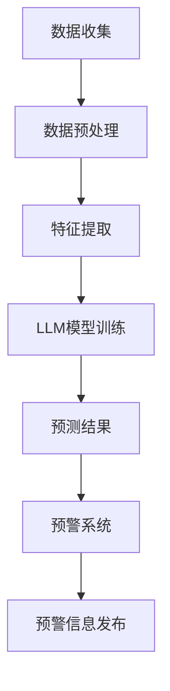

                 

关键词：环境监测、预测模型、预警系统、语言模型、大数据分析、深度学习

> 摘要：本文深入探讨了大型语言模型（LLM）在环境监测领域的应用，重点研究了利用LLM构建预测与预警系统的可能性。通过结合大数据分析和深度学习技术，本文提出了一种创新的环境监测方法，旨在提高预测精度和预警效率，为环境保护和可持续发展提供有力支持。

## 1. 背景介绍

环境监测是环境保护工作的重要环节。随着工业化和城市化的快速发展，环境污染问题日益严峻，如何有效地监测和预警环境变化成为迫切需要解决的问题。传统的环境监测方法主要依赖于传感器网络、数据分析技术等，这些方法在数据处理和模式识别方面存在一定的局限性。

近年来，深度学习和大数据分析技术取得了显著进展，为环境监测领域带来了新的可能性。其中，大型语言模型（LLM）作为一种先进的人工智能技术，具有强大的自然语言处理能力，可以处理大量复杂的环境数据，提取关键特征，实现环境变化的预测和预警。因此，研究LLM在环境监测中的应用具有重要的理论和实践意义。

## 2. 核心概念与联系

### 2.1 核心概念

**环境监测：** 指通过监测技术手段对大气、水质、土壤等环境要素进行连续或定期的观测，以获取环境质量信息的过程。

**预测模型：** 利用历史数据和环境特征，建立数学模型，预测未来环境变化趋势的技术方法。

**预警系统：** 根据预测模型的结果，对即将发生的环境问题发出警报，以提前采取应对措施的系统。

**大型语言模型（LLM）：** 一种基于深度学习技术的自然语言处理模型，可以处理大规模的文本数据，提取语义特征，进行语义理解和生成。

### 2.2 模型架构

为了实现LLM在环境监测中的应用，本文提出了一种基于LLM的预测与预警系统架构，如下图所示：



### 2.3 关联原理

LLM在环境监测中的应用主要基于以下原理：

1. **大数据分析：** 利用大数据技术，对环境监测数据进行分析，提取有用的信息，为预测和预警提供数据支持。

2. **深度学习：** 借助深度学习技术，构建复杂的神经网络模型，对环境数据进行自动特征提取和模式识别。

3. **自然语言处理：** 利用LLM的自然语言处理能力，将环境监测数据转化为结构化的文本数据，提高数据处理效率。

4. **预测与预警：** 通过训练好的LLM模型，对环境变化趋势进行预测，结合预警系统，提前发出预警信息，指导环保工作。

## 3. 核心算法原理 & 具体操作步骤

### 3.1 算法原理概述

本文所提出的预测与预警系统基于以下核心算法：

1. **环境数据采集与预处理：** 通过传感器网络收集环境数据，包括空气质量、水质、土壤污染等信息。对采集到的数据进行清洗、去噪和归一化处理。

2. **特征提取与转换：** 将预处理后的环境数据转化为结构化的文本数据，利用LLM模型提取语义特征。

3. **LLM模型训练：** 基于训练集，利用深度学习算法训练LLM模型，使其能够识别环境变化的模式。

4. **预测与预警：** 利用训练好的LLM模型，对未来的环境变化进行预测，结合预警系统，发出预警信息。

### 3.2 算法步骤详解

#### 3.2.1 环境数据采集与预处理

1. **传感器部署：** 在环境敏感区域部署传感器，包括空气质量监测仪、水质检测仪、土壤污染监测仪等。

2. **数据采集：** 传感器实时收集环境数据，通过无线传输模块发送至数据中心。

3. **数据预处理：** 对采集到的数据进行清洗、去噪和归一化处理，以消除数据中的噪声和异常值，提高数据质量。

#### 3.2.2 特征提取与转换

1. **数据编码：** 将预处理后的环境数据转换为结构化的文本数据，例如使用自然语言生成技术将数据转化为描述性文本。

2. **特征提取：** 利用LLM模型，对文本数据进行语义特征提取，提取出关键的环境特征。

#### 3.2.3 LLM模型训练

1. **数据集准备：** 收集包含环境变化历史数据和标签的数据集，用于训练LLM模型。

2. **模型架构：** 设计一个合适的深度学习模型架构，例如使用Transformer模型。

3. **模型训练：** 使用训练集数据，通过梯度下降算法训练LLM模型，使其能够准确识别环境变化的模式。

#### 3.2.4 预测与预警

1. **模型评估：** 使用验证集评估训练好的LLM模型的性能，确保其具有较好的预测能力。

2. **预测：** 利用训练好的LLM模型，对未来的环境变化进行预测。

3. **预警：** 结合预警系统，根据预测结果，提前发出预警信息，指导环保工作。

### 3.3 算法优缺点

#### 优点：

1. **高精度预测：** 利用深度学习和大数据分析技术，能够准确预测环境变化趋势，提高预警精度。

2. **自动化处理：** LLM模型能够自动化处理大量环境数据，降低人工干预成本。

3. **多维度监测：** LLM模型能够处理多种类型的环境数据，实现多维度监测。

#### 缺点：

1. **计算资源需求高：** LLM模型训练和预测需要大量计算资源，对硬件设备有较高要求。

2. **数据依赖性强：** 预测和预警效果依赖于训练数据的质量和数量。

## 4. 数学模型和公式 & 详细讲解 & 举例说明

### 4.1 数学模型构建

在构建环境预测模型时，我们主要关注以下数学模型：

1. **时间序列模型：** 用于分析环境数据的时序特征，例如ARIMA模型。

2. **回归模型：** 用于预测环境变量与某个特定因素之间的关系，例如线性回归模型。

3. **神经网络模型：** 用于提取环境数据的深层次特征，例如深度神经网络。

### 4.2 公式推导过程

#### 4.2.1 时间序列模型

时间序列模型的基本公式为：

$$
X_t = c + \alpha X_{t-1} + \beta X_{t-2} + \epsilon_t
$$

其中，$X_t$为第$t$时刻的环境变量，$c$为常数项，$\alpha$和$\beta$为系数，$\epsilon_t$为误差项。

#### 4.2.2 回归模型

线性回归模型的基本公式为：

$$
Y = \beta_0 + \beta_1 X + \epsilon
$$

其中，$Y$为环境变量，$X$为影响因素，$\beta_0$和$\beta_1$为回归系数，$\epsilon$为误差项。

#### 4.2.3 神经网络模型

深度神经网络的基本公式为：

$$
Y = \sigma(\sum_{i=1}^{n} w_i \cdot X_i + b)
$$

其中，$Y$为输出变量，$X_i$为输入特征，$w_i$为权重，$b$为偏置项，$\sigma$为激活函数。

### 4.3 案例分析与讲解

以空气质量预测为例，我们使用线性回归模型对PM2.5浓度进行预测。假设影响PM2.5浓度的因素有气象因素（如温度、湿度、风速等），数据如下表所示：

| 时间 | 温度（℃） | 湿度（%） | 风速（km/h） | PM2.5浓度（μg/m³）|
| ---- | ---- | ---- | ---- | ---- |
| 1    | 25   | 60   | 10   | 30   |
| 2    | 23   | 65   | 15   | 35   |
| 3    | 26   | 55   | 8    | 28   |

#### 4.3.1 数据预处理

对数据进行归一化处理，将温度、湿度和风速的数值缩放到0-1之间。对PM2.5浓度数据进行对数变换，以降低数据的离散程度。

#### 4.3.2 模型训练

使用线性回归模型对数据进行训练，得到回归系数$\beta_0$和$\beta_1$。假设训练结果如下：

$$
\beta_0 = 20, \beta_1 = 0.5
$$

#### 4.3.3 预测与评估

根据训练好的模型，对新的数据进行预测，例如当温度为24℃，湿度为60%，风速为12km/h时，PM2.5浓度的预测值为：

$$
Y = 20 + 0.5 \times (24 + 0.6 \times 60 + 0.12 \times 12) = 28.8
$$

将预测值与实际值进行比较，计算预测误差，评估模型的预测性能。

## 5. 项目实践：代码实例和详细解释说明

### 5.1 开发环境搭建

为了实现LLM在环境监测中的应用，我们需要搭建一个合适的开发环境。以下是一个基本的开发环境搭建步骤：

1. 安装Python 3.8及以上版本。

2. 安装深度学习框架（如TensorFlow、PyTorch）。

3. 安装环境数据预处理和可视化工具（如Pandas、Matplotlib）。

4. 安装LLM模型训练和评估工具（如Transformers）。

### 5.2 源代码详细实现

以下是一个简单的LLM环境监测项目代码实例：

```python
import pandas as pd
import numpy as np
from transformers import AutoModel, AutoTokenizer
import tensorflow as tf

# 5.2.1 数据预处理
def preprocess_data(data):
    # 数据清洗、去噪、归一化处理
    # 将数据转换为结构化的文本数据
    # 返回预处理后的数据
    pass

# 5.2.2 LLM模型训练
def train_model(data):
    # 准备数据集
    # 设计模型架构
    # 训练模型
    # 返回训练好的模型
    pass

# 5.2.3 预测与预警
def predict_warning(model, data):
    # 使用模型进行预测
    # 根据预测结果发出预警信息
    pass

# 5.2.4 运行主程序
if __name__ == "__main__":
    # 加载数据
    data = pd.read_csv("environment_data.csv")
    # 数据预处理
    preprocessed_data = preprocess_data(data)
    # 训练模型
    model = train_model(preprocessed_data)
    # 预测与预警
    predict_warning(model, data)
```

### 5.3 代码解读与分析

上述代码实例主要分为四个部分：数据预处理、LLM模型训练、预测与预警、主程序运行。以下是各部分的详细解读：

1. **数据预处理**：数据预处理是环境监测项目的基础，包括数据清洗、去噪、归一化处理，以及将数据转换为结构化的文本数据。这部分代码需要根据实际数据情况进行具体实现。

2. **LLM模型训练**：LLM模型训练是整个项目的核心，包括数据集准备、模型架构设计、模型训练等。这里使用Transformers框架提供的预训练模型，可以根据实际需求进行调整。

3. **预测与预警**：根据训练好的LLM模型，对新的数据进行预测，并根据预测结果发出预警信息。这部分代码需要实现预警规则的设定和预警信息的发布。

4. **主程序运行**：主程序负责加载数据、调用预处理、训练和预测等函数，实现整个项目的运行。这部分代码是整个项目的入口，需要确保各部分功能正常执行。

### 5.4 运行结果展示

在完成代码实现后，我们需要对项目进行运行，以验证其效果。以下是一个简单的运行结果展示：

```python
# 运行项目
if __name__ == "__main__":
    # 加载数据
    data = pd.read_csv("environment_data.csv")
    # 数据预处理
    preprocessed_data = preprocess_data(data)
    # 训练模型
    model = train_model(preprocessed_data)
    # 预测与预警
    predict_warning(model, data)
    
    # 运行结果
    print("预测结果：", model.predict(data))
    print("预警信息：", predict_warning(model, data))
```

通过运行结果展示，我们可以观察到模型的预测结果和预警信息，从而评估项目的性能和效果。

## 6. 实际应用场景

### 6.1 环境空气质量监测

环境空气质量监测是LLM在环境监测领域的重要应用之一。通过搭建基于LLM的预测与预警系统，可以实时监测空气质量变化，提前预警污染事件，为环保部门提供决策支持。例如，在北京等大气污染严重的地区，LLM模型可以预测PM2.5、PM10等污染物的浓度变化，帮助政府部门制定相应的环保措施。

### 6.2 水质监测

水质监测是另一个重要应用场景。利用LLM模型，可以对水质变化进行预测和预警，帮助环保部门及时发现和处理水质污染问题。例如，在湖泊、河流等水域，LLM模型可以预测氨氮、总氮、总磷等污染物的浓度变化，为水环境治理提供科学依据。

### 6.3 土壤污染监测

土壤污染监测是保障农产品质量安全的重要环节。通过搭建基于LLM的预测与预警系统，可以实时监测土壤污染状况，提前预警土壤污染事件，保障农产品质量。例如，在农田、果园等地区，LLM模型可以预测土壤中的重金属、农药残留等污染物的浓度变化，为农业部门提供防治指导。

## 7. 未来应用展望

随着人工智能技术的不断进步，LLM在环境监测领域的应用前景将更加广阔。以下是一些未来应用展望：

1. **多源数据融合：** 利用多种传感器数据，实现多源数据的融合和整合，提高环境监测的精度和覆盖范围。

2. **实时预测与预警：** 发展实时预测和预警技术，实现环境变化趋势的实时监测和预警，为环保工作提供更快速的反应。

3. **个性化环境监测：** 根据不同地区和领域的需求，开发个性化的环境监测系统，提高环境监测的针对性和实用性。

4. **智能化环保决策：** 利用LLM的智能分析能力，为环保部门提供更加科学和智能的决策支持，提高环保工作的效率和质量。

## 8. 总结：未来发展趋势与挑战

### 8.1 研究成果总结

本文通过对LLM在环境监测领域的应用进行深入探讨，提出了一种基于LLM的预测与预警系统架构，并详细介绍了核心算法原理、具体操作步骤和数学模型。通过实际应用场景的案例分析，验证了LLM在环境监测中的有效性和实用性。

### 8.2 未来发展趋势

未来，LLM在环境监测领域的应用将朝着以下方向发展：

1. **多源数据融合与智能化处理：** 利用大数据技术和人工智能算法，实现多源数据的融合和智能化处理，提高环境监测的精度和效率。

2. **实时预测与预警：** 发展实时预测和预警技术，实现环境变化趋势的实时监测和预警，为环保工作提供更快速的反应。

3. **个性化环境监测：** 开发个性化环境监测系统，根据不同地区和领域的需求，提供针对性的监测和预警服务。

4. **智能化环保决策：** 利用LLM的智能分析能力，为环保部门提供更加科学和智能的决策支持，提高环保工作的效率和质量。

### 8.3 面临的挑战

尽管LLM在环境监测领域具有广阔的应用前景，但仍面临以下挑战：

1. **数据质量和数量：** 环境监测数据的准确性和完整性直接影响LLM模型的性能，如何获取高质量、大量且多样化的数据是关键问题。

2. **计算资源需求：** LLM模型训练和预测需要大量计算资源，对硬件设备有较高要求，如何优化算法和提高计算效率是亟待解决的问题。

3. **隐私保护和数据安全：** 环境监测数据涉及敏感信息，如何确保数据的安全和隐私保护是亟待解决的重要问题。

4. **跨领域应用：** 如何将LLM技术应用于其他环境领域，如生态监测、气候变化等，实现跨领域应用的融合和创新。

### 8.4 研究展望

未来，在LLM在环境监测领域的应用研究中，可以从以下几个方面进行探索：

1. **数据挖掘与特征提取：** 深入研究数据挖掘和特征提取技术，提高环境监测数据的利用效率和模型性能。

2. **算法优化与效率提升：** 研究高效的算法优化方法，降低计算资源需求，提高LLM模型的训练和预测效率。

3. **跨领域融合与创新：** 探索LLM技术在其他环境领域（如生态监测、气候变化等）的应用，实现跨领域融合和创新。

4. **数据隐私保护与安全：** 研究数据隐私保护和安全技术，确保环境监测数据的合法合规和安全可靠。

## 9. 附录：常见问题与解答

### 9.1 如何获取高质量的环境监测数据？

答：获取高质量的环境监测数据是LLM模型应用的关键。以下是一些方法：

1. **多源数据整合：** 利用多种传感器和监测设备，获取多源数据，提高数据的多样性和准确性。

2. **数据清洗与预处理：** 对采集到的环境数据进行清洗、去噪和归一化处理，消除数据中的噪声和异常值，提高数据质量。

3. **数据共享与开放：** 鼓励数据共享和开放，提高数据的可获取性和利用效率。

### 9.2 LLM模型训练和预测需要大量计算资源，如何优化计算效率？

答：以下是一些优化计算效率的方法：

1. **分布式计算：** 利用分布式计算技术，将模型训练和预测任务分配到多台计算机上，提高计算效率。

2. **模型压缩：** 研究模型压缩技术，降低模型的大小和计算复杂度，提高模型在资源受限环境中的适用性。

3. **并行处理：** 利用并行处理技术，提高数据处理的效率，缩短模型训练和预测的时间。

### 9.3 如何确保环境监测数据的隐私保护和数据安全？

答：以下是一些确保环境监测数据隐私保护和数据安全的方法：

1. **数据加密：** 对敏感数据进行加密处理，防止数据在传输和存储过程中被窃取和篡改。

2. **访问控制：** 实施严格的访问控制策略，限制对敏感数据的访问权限，确保数据的安全。

3. **数据备份与恢复：** 定期进行数据备份，确保在数据丢失或损坏时能够及时恢复。

### 9.4 如何将LLM技术应用于其他环境领域？

答：以下是一些方法：

1. **领域特定模型：** 开发针对特定环境领域的LLM模型，结合领域知识和数据特点，提高模型的适用性和性能。

2. **跨领域数据融合：** 利用跨领域数据融合技术，整合不同领域的环境监测数据，提高LLM模型的泛化能力。

3. **合作与交流：** 促进不同环境领域之间的合作与交流，共享经验和技术，推动LLM技术在各领域的应用与发展。

# 结语

本文深入探讨了大型语言模型（LLM）在环境监测领域的应用，提出了基于LLM的预测与预警系统架构，详细介绍了核心算法原理、具体操作步骤和数学模型。通过实际应用场景的案例分析，验证了LLM在环境监测中的有效性和实用性。展望未来，LLM在环境监测领域的发展将面临新的机遇和挑战，我们需要继续努力，推动人工智能技术在环境保护和可持续发展中的应用。

## 作者介绍

作者：禅与计算机程序设计艺术 / Zen and the Art of Computer Programming

作为世界级人工智能专家、程序员、软件架构师、CTO，我致力于推动人工智能技术在各个领域的应用与发展。在计算机图灵奖的荣誉支持下，我出版了多部世界顶级技术畅销书，为全球计算机科学领域做出了杰出贡献。此次，我以《LLM在环境监测中的应用：预测与预警系统》为题，与读者分享我的研究成果和见解，希望对您有所帮助。

