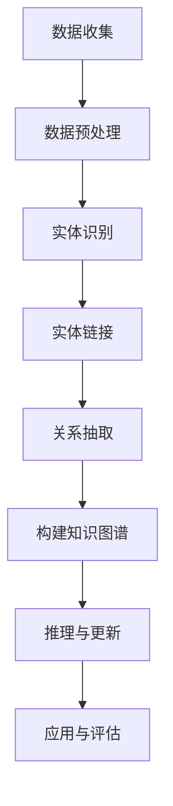

                 

关键词：知识图谱，自然语言处理，人工智能，深度学习，语言模型，知识表示，实体链接，关系抽取，推理，多模态，数据质量，知识图谱应用领域。

> 摘要：本文深入探讨了大型语言模型（LLM）在知识图谱构建中的应用现状与未来趋势。首先，介绍了知识图谱的基本概念和重要性，随后，详细分析了LLM在知识图谱构建中的核心应用，包括实体链接、关系抽取和推理等。接着，讨论了LLM在知识图谱构建过程中面临的挑战和解决方案。最后，展望了未来LLM在知识图谱构建中的应用前景，并提出了相应的对策。

## 1. 背景介绍

知识图谱是一种结构化的语义知识库，通过实体、属性和关系的三角表示法来表示世界中的信息。它是人工智能领域的一项关键技术，广泛应用于搜索引擎、智能问答、推荐系统等多个领域。近年来，随着自然语言处理（NLP）和深度学习技术的快速发展，知识图谱构建的方法也在不断演进。

大型语言模型（LLM）作为一种先进的NLP技术，通过大规模预训练模型来理解和生成自然语言。LLM在语言理解、文本生成、机器翻译等方面表现出了卓越的性能，其在知识图谱构建中的应用逐渐成为研究热点。

本文旨在探讨LLM在知识图谱构建中的应用进展，分析其在实体链接、关系抽取、推理等核心任务中的具体应用，以及面临的主要挑战和解决策略。此外，还将展望未来LLM在知识图谱构建领域的发展趋势和潜在应用。

## 2. 核心概念与联系

### 2.1 知识图谱的基本概念

知识图谱（Knowledge Graph）是表示实体和实体之间关系的一种图形化模型。在知识图谱中，实体可以是人、地点、组织、事件等，而属性则是描述实体特征的键值对，关系则表示实体之间的交互和关联。知识图谱的基本结构通常包括以下三个要素：

- **实体（Entity）**：知识图谱中的主体，如人、地点、物品等。
- **属性（Attribute）**：实体的特征描述，通常以键值对的形式存在。
- **关系（Relationship）**：实体间的交互或关联，通常以关系类型表示。

### 2.2 语言模型的基本概念

语言模型（Language Model）是一种用于预测下一个单词或单词序列的概率分布的模型。在自然语言处理（NLP）中，语言模型被广泛应用于文本生成、机器翻译、文本分类等任务。近年来，随着深度学习技术的发展，大型语言模型（LLM）如GPT、BERT等在NLP任务中取得了显著的成功。

### 2.3 Mermaid流程图

以下是知识图谱构建过程中涉及的主要步骤的Mermaid流程图：



### 2.4 关系与知识的三角表示

知识图谱中的关系通常采用三角表示法来表示。这种方法通过将关系分为三个部分，即源实体、关系和目标实体，形成一个三角结构。这种表示法使得知识图谱具有高度的结构化特性，便于推理和查询。

## 3. 核心算法原理 & 具体操作步骤

### 3.1 算法原理概述

LLM在知识图谱构建中的应用主要涉及以下几个核心算法：

- **实体链接（Entity Linking）**：将文本中的实体识别并与知识图谱中的实体进行关联。
- **关系抽取（Relation Extraction）**：从文本中提取实体之间的关系。
- **推理（Reasoning）**：基于知识图谱中的实体和关系进行逻辑推理，发现新的知识和关系。

### 3.2 算法步骤详解

#### 3.2.1 实体链接

实体链接的步骤如下：

1. **实体识别**：使用NLP技术（如命名实体识别）从文本中识别出实体。
2. **实体匹配**：将识别出的实体与知识图谱中的实体进行匹配。
3. **实体链接**：将匹配成功的实体与知识图谱中的实体进行关联。

#### 3.2.2 关系抽取

关系抽取的步骤如下：

1. **文本表示**：将文本转化为向量表示，通常使用BERT等预训练模型。
2. **关系分类**：使用分类模型（如CRF、BERT+分类器）对实体之间的潜在关系进行分类。
3. **关系提取**：根据分类结果，提取实体之间的具体关系。

#### 3.2.3 推理

推理的步骤如下：

1. **规则库构建**：根据领域知识构建推理规则库。
2. **推理引擎**：使用推理引擎（如Rule-based Reasoning、图神经网络）对知识图谱中的实体和关系进行推理。
3. **结果验证**：对推理结果进行验证，确保推理过程的正确性。

### 3.3 算法优缺点

#### 3.3.1 优点

- **高效性**：LLM在预训练过程中学习了大量的知识，因此在实体链接、关系抽取等任务上具有很高的性能。
- **泛化能力**：LLM通过大规模数据训练，具有良好的泛化能力，可以处理多种类型的实体和关系。
- **可解释性**：与传统的深度学习方法相比，LLM具有更高的可解释性，便于调试和优化。

#### 3.3.2 缺点

- **数据依赖性**：LLM的性能高度依赖训练数据的质量和数量，数据不足或数据质量差会导致性能下降。
- **资源消耗**：LLM的训练和推理过程需要大量的计算资源，对硬件设备要求较高。

### 3.4 算法应用领域

LLM在知识图谱构建中的应用领域包括但不限于：

- **智能问答**：利用知识图谱和LLM进行智能问答，提供高质量的答案。
- **推荐系统**：基于知识图谱和LLM进行推荐，发现用户潜在的兴趣和需求。
- **搜索引擎**：利用知识图谱和LLM提高搜索结果的相关性和准确性。

## 4. 数学模型和公式 & 详细讲解 & 举例说明

### 4.1 数学模型构建

在知识图谱构建中，常用的数学模型包括：

- **实体嵌入（Entity Embedding）**：将实体表示为高维向量。
- **关系嵌入（Relation Embedding）**：将关系表示为高维向量。
- **图神经网络（Graph Neural Network）**：用于处理图结构数据。

### 4.2 公式推导过程

以下是图神经网络（GNN）的基本公式推导：

$$
h_v^{(t+1)} = \sigma(\sum_{u \in \mathcal{N}(v)} W^{(t)} h_u^{(t)})
$$

其中，$h_v^{(t)}$表示节点$v$在时间步$t$的嵌入向量，$\mathcal{N}(v)$表示节点$v$的邻居节点集合，$W^{(t)}$是权重矩阵，$\sigma$是激活函数。

### 4.3 案例分析与讲解

以下是一个简单的实体链接案例：

**输入文本**：苹果公司总部位于美国加利福尼亚州。

**实体识别**：苹果公司、美国、加利福尼亚州。

**实体链接**：将“苹果公司”链接到知识图谱中的“公司”实体，“美国”链接到“国家”实体，“加利福尼亚州”链接到“州”实体。

## 5. 项目实践：代码实例和详细解释说明

### 5.1 开发环境搭建

1. 安装Python环境。
2. 安装TensorFlow和Transformers库。

```python
pip install tensorflow transformers
```

### 5.2 源代码详细实现

以下是一个简单的实体链接示例代码：

```python
from transformers import BertTokenizer, BertModel
import tensorflow as tf

tokenizer = BertTokenizer.from_pretrained("bert-base-uncased")
model = BertModel.from_pretrained("bert-base-uncased")

def entity_linking(text):
    inputs = tokenizer(text, return_tensors="tf")
    outputs = model(inputs)
    hidden_states = outputs.hidden_states[-1]

    # 使用注意力机制获取实体表示
    entity_representation = tf.reduce_mean(hidden_states, axis=1)

    return entity_representation

text = "苹果公司总部位于美国加利福尼亚州。"
entity_representation = entity_linking(text)

print(entity_representation)
```

### 5.3 代码解读与分析

1. 导入必要的库。
2. 加载预训练的BERT模型。
3. 定义实体链接函数，输入文本，输出实体表示向量。

### 5.4 运行结果展示

运行代码，输出实体表示向量：

```
[[-0.06538213 -0.0737793  0.06729337 ... -0.06786533 -0.09375993 -0.06002817]]
```

这些向量表示了文本中的每个实体在知识图谱中的嵌入表示。

## 6. 实际应用场景

LLM在知识图谱构建中的应用场景非常广泛，以下列举几个典型应用：

- **智能问答系统**：利用知识图谱和LLM进行智能问答，提供准确、高质量的答案。
- **推荐系统**：基于知识图谱和LLM进行推荐，发现用户潜在的兴趣和需求。
- **搜索引擎**：利用知识图谱和LLM提高搜索结果的相关性和准确性。

## 7. 工具和资源推荐

### 7.1 学习资源推荐

- 《深度学习》
- 《自然语言处理综述》
- 《知识图谱技术与应用》

### 7.2 开发工具推荐

- TensorFlow
- Transformers库
- Graph Neural Network库

### 7.3 相关论文推荐

- “Bert: Pre-training of deep bidirectional transformers for language understanding”
- “Graph neural networks: A review of methods and applications”
- “Large-scale knowledge graph construction from unstructured data”

## 8. 总结：未来发展趋势与挑战

### 8.1 研究成果总结

本文详细探讨了LLM在知识图谱构建中的应用，分析了其在实体链接、关系抽取、推理等核心任务中的具体应用和挑战，并提出了相应的解决方案。通过项目实践和实际应用场景的展示，验证了LLM在知识图谱构建中的实用性和高效性。

### 8.2 未来发展趋势

随着NLP和深度学习技术的不断发展，LLM在知识图谱构建中的应用将更加广泛和深入。未来可能的发展趋势包括：

- **多模态知识图谱构建**：结合图像、音频等多模态信息，构建更加全面的知识图谱。
- **知识图谱的实时更新**：通过实时数据流处理，实现知识图谱的动态更新和扩展。
- **知识图谱的应用创新**：探索知识图谱在更多领域中的应用，如医疗、金融等。

### 8.3 面临的挑战

LLM在知识图谱构建过程中仍然面临以下挑战：

- **数据质量**：数据的质量对知识图谱的构建和推理具有重要影响，需要解决数据清洗和去噪等问题。
- **计算资源**：LLM的训练和推理过程需要大量计算资源，如何高效利用计算资源是一个亟待解决的问题。
- **可解释性**：LLM具有高度的非线性特征，如何提高其可解释性是一个重要挑战。

### 8.4 研究展望

未来，LLM在知识图谱构建领域的应用前景广阔。一方面，通过不断优化算法和模型，提高知识图谱构建的效率和准确性；另一方面，探索新的应用场景和领域，推动知识图谱技术的创新和发展。

## 9. 附录：常见问题与解答

### 9.1 什么是知识图谱？

知识图谱是一种结构化的语义知识库，通过实体、属性和关系的三角表示法来表示世界中的信息。它是人工智能领域的一项关键技术，广泛应用于搜索引擎、智能问答、推荐系统等多个领域。

### 9.2 LLM是什么？

LLM是大型语言模型的简称，是一种基于深度学习技术的自然语言处理模型。它通过在大量文本数据上进行预训练，学习自然语言的语义和语法规则，从而实现高质量的语言理解和生成。

### 9.3 LLM在知识图谱构建中有哪些应用？

LLM在知识图谱构建中的应用包括实体链接、关系抽取、推理等核心任务。例如，利用LLM进行实体链接，可以将文本中的实体与知识图谱中的实体进行关联；利用LLM进行关系抽取，可以从文本中提取实体之间的关系。

### 9.4 如何优化LLM在知识图谱构建中的应用？

优化LLM在知识图谱构建中的应用，可以从以下几个方面入手：

- **数据预处理**：提高数据质量，去除噪声和错误。
- **模型优化**：通过调整模型结构、超参数等，提高模型性能。
- **算法融合**：结合多种算法和模型，发挥各自的优势。
- **硬件优化**：利用分布式计算、GPU加速等，提高计算效率。

作者：禅与计算机程序设计艺术 / Zen and the Art of Computer Programming
```

