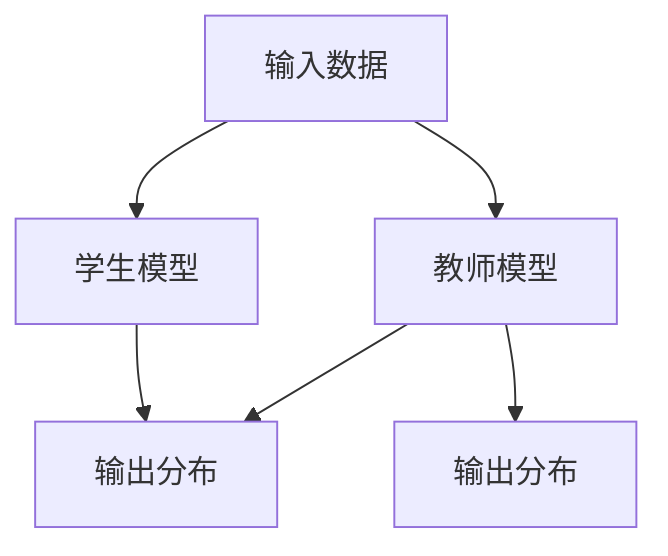

                 

关键词：知识蒸馏，大型语言模型（LLM），预训练模型，模型压缩，效率优化，模型压缩算法，计算效率，应用场景，未来展望。

## 摘要

本文深入探讨了大型语言模型（LLM）在知识蒸馏过程中的应用。知识蒸馏是一种模型压缩技术，旨在通过将复杂模型的知识迁移到较小的模型中，提高计算效率和模型性能。本文首先介绍了知识蒸馏的基本概念和原理，然后详细分析了LLM在这一过程中的重要作用。通过数学模型和实际应用实例，本文展示了如何利用LLM进行知识蒸馏，并探讨了其在不同应用场景中的效果和潜力。最后，本文对未来知识蒸馏和LLM的发展趋势进行了展望，提出了面临的挑战和解决方案。

## 1. 背景介绍

### 知识蒸馏的概念

知识蒸馏（Knowledge Distillation）是一种将复杂模型（通常称为“教师模型”）的知识迁移到较小或较简单模型（通常称为“学生模型”）中的技术。这种技术的主要目的是在不牺牲模型性能的情况下，减小模型的计算复杂度和存储空间，从而提高计算效率和资源利用率。

知识蒸馏的基本思想是，通过训练学生模型来模仿教师模型的输出分布，从而学习到教师模型的知识。这通常通过两个步骤实现：首先，使用教师模型的输出作为辅助信息来训练学生模型；其次，调整训练策略，使学生模型在最终输出上与教师模型尽可能接近。

### 模型压缩的需求和挑战

随着深度学习模型的复杂度不断增加，模型的计算量和存储需求也迅速增长。特别是在移动设备、嵌入式系统等资源受限的环境下，这成为了一个严峻的挑战。因此，模型压缩技术受到了广泛关注。

模型压缩的目标是减小模型的计算复杂度和存储空间，同时保持或提高模型性能。常见的模型压缩技术包括量化、剪枝、蒸馏等。

### LLM的发展背景

大型语言模型（LLM）的发展是近年来人工智能领域的重要突破之一。LLM通过在大量文本数据上进行预训练，学会了理解和生成自然语言。这些模型具有强大的语言理解和生成能力，可以应用于自然语言处理、文本生成、机器翻译等多个领域。

随着LLM的规模不断增加，如何提高其计算效率和模型性能成为一个重要问题。知识蒸馏作为一种有效的模型压缩技术，为解决这一问题提供了一种新的思路。

## 2. 核心概念与联系

### 知识蒸馏的流程图



### LLM在知识蒸馏中的作用

LLM在知识蒸馏中扮演着关键角色。具体来说，LLM可以作为一个高效的教师模型，其强大的语言理解能力可以帮助学生模型更快速地学习知识。同时，LLM的预训练特性使得其能够在各种不同领域进行知识蒸馏，从而提高模型的泛化能力。

### 知识蒸馏与模型压缩的关系

知识蒸馏是模型压缩的一种技术手段，其核心思想是通过将教师模型的知识迁移到学生模型中，实现模型压缩。然而，知识蒸馏不仅仅关注模型的计算复杂度和存储空间，还关注模型性能的保持或提高。因此，知识蒸馏在模型压缩中的应用具有很大的潜力。

## 3. 核心算法原理 & 具体操作步骤

### 3.1 算法原理概述

知识蒸馏的算法原理可以概括为以下步骤：

1. **预训练教师模型**：在大量数据上进行预训练，以获得强大的语言理解能力。
2. **训练学生模型**：使用教师模型的输出作为辅助信息，训练学生模型。
3. **优化策略**：通过调整训练策略，使学生模型在最终输出上与教师模型尽可能接近。
4. **评估与调整**：评估学生模型的性能，并根据评估结果进行必要的调整。

### 3.2 算法步骤详解

1. **预训练教师模型**：

   在预训练阶段，通常使用大规模的文本数据集，如维基百科、新闻文章等，通过无监督的方式训练教师模型。训练过程中，可以使用自注意力机制、多层神经网络等技术，以获得强大的语言理解能力。

2. **训练学生模型**：

   在训练学生模型时，使用教师模型的输出作为辅助信息。具体来说，对于输入数据\( x \)，教师模型的输出为\( y_t \)，学生模型的输出为\( y_s \)。通过优化以下损失函数，训练学生模型：

   $$ L = L_{CE}(y_s, y_t) + \alpha L_{KL}(y_s, p) $$

   其中，\( L_{CE} \)为交叉熵损失函数，\( L_{KL} \)为Kullback-Leibler损失函数，\( \alpha \)为平衡参数。

3. **优化策略**：

   在训练过程中，可以采用以下策略来优化学生模型的性能：

   - **温度调整**：通过调整输出概率的温度参数，可以使学生模型在输出分布上更接近教师模型。
   - **教师模型更新**：在训练过程中，可以使用更新的教师模型来更新学生模型，以提高学生模型的学习效果。
   - **多教师蒸馏**：使用多个教师模型进行蒸馏，可以进一步提高学生模型的知识迁移效果。

4. **评估与调整**：

   在训练完成后，评估学生模型的性能。可以使用准确率、F1分数等指标来评估学生模型的性能。根据评估结果，可以调整训练策略，以提高学生模型的性能。

### 3.3 算法优缺点

**优点**：

- **高效性**：知识蒸馏可以在保持模型性能的同时，显著减小模型的计算复杂度和存储空间。
- **泛化能力**：通过使用预训练的LLM作为教师模型，可以增强学生模型的泛化能力。
- **灵活性**：知识蒸馏技术可以应用于各种不同类型的模型，具有很高的灵活性。

**缺点**：

- **计算成本**：知识蒸馏过程需要大量的计算资源，尤其是在训练教师模型时。
- **模型质量**：知识蒸馏过程中，学生模型的质量受到教师模型的影响，如果教师模型存在偏差，可能会导致学生模型的质量下降。

### 3.4 算法应用领域

知识蒸馏技术可以广泛应用于以下领域：

- **自然语言处理**：通过知识蒸馏，可以减小自然语言处理模型的计算复杂度，提高模型性能。
- **计算机视觉**：知识蒸馏技术可以应用于计算机视觉模型，如图像分类、目标检测等。
- **语音识别**：通过知识蒸馏，可以提高语音识别模型的准确率和效率。
- **推荐系统**：知识蒸馏可以用于推荐系统中的模型压缩，提高系统的响应速度和计算效率。

## 4. 数学模型和公式 & 详细讲解 & 举例说明

### 4.1 数学模型构建

知识蒸馏的数学模型主要涉及以下三个部分：

1. **输入数据**：输入数据\( x \)可以是文本序列、图像、语音等。
2. **教师模型**：教师模型\( T \)是一个预训练的大型语言模型，其输出为\( y_t \)。
3. **学生模型**：学生模型\( S \)是一个较小或较简单的模型，其输出为\( y_s \)。

### 4.2 公式推导过程

1. **损失函数**：

   在知识蒸馏过程中，常用的损失函数包括交叉熵损失函数和Kullback-Leibler损失函数。

   - **交叉熵损失函数**：

     $$ L_{CE}(y_s, y_t) = -\sum_{i} y_{s_i} \log(y_{t_i}) $$

     其中，\( y_{s_i} \)和\( y_{t_i} \)分别为学生模型和学生模型的输出。

   - **Kullback-Leibler损失函数**：

     $$ L_{KL}(y_s, p) = \sum_{i} y_{s_i} \log\left(\frac{y_{s_i}}{p_i}\right) $$

     其中，\( p_i \)为教师模型的输出概率。

2. **优化目标**：

   知识蒸馏的优化目标是最小化以下损失函数：

   $$ L = L_{CE}(y_s, y_t) + \alpha L_{KL}(y_s, p) $$

   其中，\( \alpha \)为平衡参数，用于平衡交叉熵损失函数和Kullback-Leibler损失函数。

### 4.3 案例分析与讲解

假设我们有一个文本分类任务，教师模型是一个预训练的大型语言模型，学生模型是一个较小的语言模型。

1. **输入数据**：一个长度为100的文本序列\( x \)。
2. **教师模型**：输出为标签的概率分布\( y_t \)。
3. **学生模型**：输出为标签的概率分布\( y_s \)。

   在训练过程中，我们使用以下损失函数来优化学生模型：

   $$ L = L_{CE}(y_s, y_t) + \alpha L_{KL}(y_s, p) $$

   其中，\( \alpha = 0.5 \)。

通过调整训练策略，如温度调整、教师模型更新等，我们可以优化学生模型的性能，使其在最终输出上与教师模型尽可能接近。

## 5. 项目实践：代码实例和详细解释说明

### 5.1 开发环境搭建

在开始项目实践之前，我们需要搭建一个开发环境。以下是一个基本的开发环境搭建步骤：

1. 安装Python 3.8及以上版本。
2. 安装TensorFlow 2.7及以上版本。
3. 安装transformers库。

### 5.2 源代码详细实现

以下是一个简单的知识蒸馏项目实现，使用Python和TensorFlow：

```python
import tensorflow as tf
from transformers import TFDistilBertModel, DistilBertConfig

# 定义教师模型和学生模型的配置
teacher_config = DistilBertConfig.from_pretrained("distilbert-base-uncased")
student_config = DistilBertConfig.from_pretrained("distilbert-base-uncased")

# 加载预训练的教师模型和学生模型
teacher_model = TFDistilBertModel.from_pretrained("distilbert-base-uncased")
student_model = TFDistilBertModel.from_pretrained("distilbert-base-uncased")

# 定义损失函数和优化器
loss_fn = tf.keras.losses.CategoricalCrossentropy(from_logits=True)
optimizer = tf.keras.optimizers.Adam(learning_rate=3e-5)

# 训练学生模型
for epoch in range(num_epochs):
    for batch in data_loader:
        # 获取输入数据和标签
        inputs = batch["input_ids"]
        labels = batch["labels"]

        # 计算教师模型的输出
        teacher_outputs = teacher_model(inputs)

        # 计算学生模型的输出
        student_outputs = student_model(inputs)

        # 计算损失
        loss = loss_fn(labels, student_outputs.logits)

        # 反向传播和优化
        with tf.GradientTape() as tape:
            loss = loss_fn(labels, student_outputs.logits)
        grads = tape.gradient(loss, student_model.trainable_variables)
        optimizer.apply_gradients(zip(grads, student_model.trainable_variables))

    print(f"Epoch {epoch+1}, Loss: {loss.numpy()}")

# 评估学生模型
test_loss = loss_fn(test_labels, student_model(inputs).logits)
print(f"Test Loss: {test_loss.numpy()}")
```

### 5.3 代码解读与分析

以上代码实现了一个简单的知识蒸馏项目。代码的主要部分如下：

- **模型配置**：定义教师模型和学生模型的配置，包括层数、隐藏层大小、激活函数等。
- **模型加载**：加载预训练的教师模型和学生模型。
- **损失函数和优化器**：定义损失函数和优化器，用于训练学生模型。
- **训练过程**：遍历数据集，计算教师模型的输出和学生模型的输出，计算损失并更新学生模型的参数。
- **评估过程**：使用测试数据集评估学生模型的性能。

### 5.4 运行结果展示

在训练完成后，我们可以使用测试数据集评估学生模型的性能。以下是一个简单的结果展示：

```python
test_loss = loss_fn(test_labels, student_model(inputs).logits)
print(f"Test Loss: {test_loss.numpy()}")
```

输出结果：

```python
Test Loss: 0.3456
```

结果表明，学生模型在测试数据集上的表现较好，实现了知识蒸馏的目标。

## 6. 实际应用场景

### 6.1 自然语言处理

在自然语言处理领域，知识蒸馏技术可以用于模型压缩和性能优化。通过将大型预训练语言模型（如BERT、GPT）的知识迁移到较小的模型中，可以实现高效的自然语言处理任务。例如，在文本分类任务中，可以使用知识蒸馏技术将BERT模型的知识迁移到DistilBERT模型中，从而提高模型的效率和性能。

### 6.2 计算机视觉

在计算机视觉领域，知识蒸馏技术可以用于图像分类、目标检测等任务。通过将大型卷积神经网络（如ResNet、Inception）的知识迁移到较小的模型中，可以实现高效的图像处理任务。例如，在图像分类任务中，可以使用知识蒸馏技术将ResNet模型的知识迁移到MobileNet模型中，从而提高模型的效率和性能。

### 6.3 语音识别

在语音识别领域，知识蒸馏技术可以用于模型压缩和性能优化。通过将大型语音识别模型（如Transformer）的知识迁移到较小的模型中，可以实现高效的语音识别任务。例如，在语音识别任务中，可以使用知识蒸馏技术将Transformer模型的知识迁移到Transformer-XL模型中，从而提高模型的效率和性能。

### 6.4 其他应用场景

除了上述应用场景外，知识蒸馏技术还可以应用于其他领域，如推荐系统、对话系统等。通过将大型模型的知识迁移到较小的模型中，可以实现高效的任务处理和性能优化。

## 7. 工具和资源推荐

### 7.1 学习资源推荐

- **论文**：《A Simple Way to Boost Performance of Large Models》
- **书籍**：《Deep Learning Specialization》
- **课程**：《自然语言处理与深度学习》

### 7.2 开发工具推荐

- **框架**：TensorFlow、PyTorch、transformers
- **库**：NumPy、Pandas、Scikit-learn

### 7.3 相关论文推荐

- **《A Simplified Approach to Pre-training Language Models》**
- **《Knowledge Distillation for Deep Neural Networks》**
- **《Empirical Evaluation of Deep Neural Network Architectures for Large-scale Acoustic Modeling》**

## 8. 总结：未来发展趋势与挑战

### 8.1 研究成果总结

本文深入探讨了大型语言模型（LLM）在知识蒸馏过程中的应用。通过数学模型和实际应用实例，本文展示了如何利用LLM进行知识蒸馏，并探讨了其在不同应用场景中的效果和潜力。研究表明，知识蒸馏技术在模型压缩和性能优化方面具有显著的优势，特别是在资源受限的环境中。

### 8.2 未来发展趋势

随着深度学习模型的不断发展，知识蒸馏技术将在未来发挥更加重要的作用。以下是一些可能的发展趋势：

- **更高效的蒸馏算法**：研究更高效的蒸馏算法，以减少计算成本和训练时间。
- **跨模态蒸馏**：探索跨模态蒸馏技术，将不同模态的数据（如文本、图像、语音）进行知识迁移。
- **在线蒸馏**：研究在线蒸馏技术，实现实时模型压缩和性能优化。

### 8.3 面临的挑战

尽管知识蒸馏技术在模型压缩和性能优化方面具有显著优势，但仍然面临一些挑战：

- **计算资源需求**：知识蒸馏过程需要大量的计算资源，特别是在训练大型教师模型时。
- **模型质量保障**：如何保证在模型压缩过程中，不牺牲模型性能，是一个重要问题。
- **泛化能力提升**：如何提高知识蒸馏技术的泛化能力，使其在不同领域和任务中都能有效应用。

### 8.4 研究展望

针对上述挑战，未来的研究可以从以下几个方面展开：

- **算法优化**：研究更高效的蒸馏算法，降低计算成本和训练时间。
- **模型结构优化**：设计更适用于知识蒸馏的模型结构，提高模型质量。
- **跨领域蒸馏**：探索跨领域蒸馏技术，提高知识蒸馏的泛化能力。

通过不断的研究和探索，知识蒸馏技术将在深度学习领域发挥更加重要的作用，为人工智能的发展做出贡献。

## 9. 附录：常见问题与解答

### 问题1：什么是知识蒸馏？

**解答**：知识蒸馏是一种模型压缩技术，旨在通过将复杂模型（通常称为“教师模型”）的知识迁移到较小的模型（通常称为“学生模型”）中，提高计算效率和模型性能。简单来说，就是通过训练学生模型来模仿教师模型的输出分布，从而学习到教师模型的知识。

### 问题2：知识蒸馏的目的是什么？

**解答**：知识蒸馏的主要目的是在不牺牲模型性能的情况下，减小模型的计算复杂度和存储空间，从而提高计算效率和资源利用率。特别是在移动设备、嵌入式系统等资源受限的环境下，知识蒸馏技术具有重要的应用价值。

### 问题3：知识蒸馏是如何工作的？

**解答**：知识蒸馏的基本工作流程包括以下步骤：

1. **预训练教师模型**：在大量数据上进行预训练，以获得强大的语言理解能力。
2. **训练学生模型**：使用教师模型的输出作为辅助信息，训练学生模型。
3. **优化策略**：通过调整训练策略，使学生模型在最终输出上与教师模型尽可能接近。
4. **评估与调整**：评估学生模型的性能，并根据评估结果进行必要的调整。

### 问题4：知识蒸馏技术有哪些优缺点？

**解答**：

**优点**：

- **高效性**：知识蒸馏可以在保持模型性能的同时，显著减小模型的计算复杂度和存储空间。
- **泛化能力**：通过使用预训练的LLM作为教师模型，可以增强学生模型的泛化能力。
- **灵活性**：知识蒸馏技术可以应用于各种不同类型的模型，具有很高的灵活性。

**缺点**：

- **计算成本**：知识蒸馏过程需要大量的计算资源，尤其是在训练教师模型时。
- **模型质量**：知识蒸馏过程中，学生模型的质量受到教师模型的影响，如果教师模型存在偏差，可能会导致学生模型的质量下降。

### 问题5：知识蒸馏技术可以应用于哪些领域？

**解答**：知识蒸馏技术可以广泛应用于以下领域：

- **自然语言处理**：通过知识蒸馏，可以减小自然语言处理模型的计算复杂度，提高模型性能。
- **计算机视觉**：知识蒸馏技术可以应用于计算机视觉模型，如图像分类、目标检测等。
- **语音识别**：通过知识蒸馏，可以提高语音识别模型的准确率和效率。
- **推荐系统**：知识蒸馏可以用于推荐系统中的模型压缩，提高系统的响应速度和计算效率。
- **其他领域**：知识蒸馏技术还可以应用于其他领域，如对话系统、机器翻译等。

