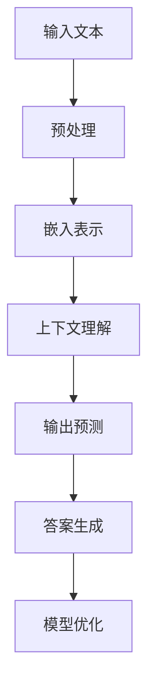

                 

关键词：LLM，知识问答，人工智能，自然语言处理，深度学习，模型性能，数据质量，优化策略，应用场景

> 摘要：本文旨在分析大型语言模型（LLM）在知识问答任务中的表现。通过综述LLM的发展历程、核心概念、算法原理，结合实际项目实践，探讨LLM在知识问答中的应用现状及面临的挑战，并提出未来发展趋势与优化策略。

## 1. 背景介绍

知识问答是自然语言处理（NLP）领域的一项重要任务，旨在通过理解用户的问题，从大量文本数据中检索并返回最相关的答案。随着深度学习技术的蓬勃发展，大型语言模型（LLM）如GPT、BERT等逐渐成为知识问答任务的重要工具。这些模型具有强大的上下文理解能力和丰富的知识储备，使得知识问答系统的性能得到了显著提升。

### 1.1 LLM的发展历程

自2000年以来，NLP领域经历了从规则驱动到数据驱动的转变。早期的知识问答系统主要依赖于手工编写的规则和知识库，但这些方法存在灵活性差、扩展性弱等局限性。随着深度学习的兴起，神经网络逐渐成为NLP任务的核心。2018年，GPT模型的提出标志着大规模语言模型时代的到来。此后，BERT、Turing-NLG等模型相继出现，使得知识问答系统的性能得到了大幅提升。

### 1.2 知识问答的重要性

知识问答在众多应用场景中具有重要意义。例如，在智能客服、教育辅导、医疗咨询等领域，知识问答系统能够快速、准确地回答用户问题，提高用户体验和满意度。此外，知识问答还可用于信息检索、内容推荐、智能问答机器人等场景，具有广泛的应用前景。

## 2. 核心概念与联系

为了深入理解LLM在知识问答中的表现，我们需要首先了解LLM的核心概念和原理。在此，我们将使用Mermaid流程图展示LLM的基本架构，并简要介绍相关核心概念。



### 2.1 核心概念

- **输入文本**：用户输入的问题或语句。
- **预处理**：对输入文本进行清洗、分词、标注重等操作，以便模型能够更好地处理。
- **嵌入表示**：将文本转换为数值向量，以便模型进行计算。
- **上下文理解**：模型通过处理上下文信息，理解用户问题的含义和意图。
- **输出预测**：模型根据上下文信息生成可能的答案。
- **答案生成**：将预测结果转化为自然语言，生成最终答案。
- **模型优化**：通过不断调整模型参数，提高模型性能。

## 3. 核心算法原理 & 具体操作步骤

### 3.1 算法原理概述

LLM在知识问答中的核心算法主要基于深度学习技术，尤其是基于Transformer架构的大型预训练模型。这些模型通过在海量文本数据上进行预训练，获得丰富的语言理解和生成能力。

### 3.2 算法步骤详解

1. **文本预处理**：对输入文本进行清洗、分词、标注重等操作，以便模型能够更好地处理。
2. **嵌入表示**：将预处理后的文本转换为数值向量，这一过程通常通过词嵌入技术实现。
3. **上下文理解**：模型通过处理上下文信息，理解用户问题的含义和意图。
4. **输出预测**：模型根据上下文信息生成可能的答案。
5. **答案生成**：将预测结果转化为自然语言，生成最终答案。
6. **模型优化**：通过不断调整模型参数，提高模型性能。

### 3.3 算法优缺点

- **优点**：
  - **强大的语言理解能力**：LLM通过预训练获得了丰富的语言知识和上下文理解能力，能够生成更准确、自然的答案。
  - **广泛的适用性**：LLM适用于各种知识问答场景，包括智能客服、教育辅导、医疗咨询等。
  - **高效的性能**：大型预训练模型具有高效的计算性能，能够快速处理大量问题。

- **缺点**：
  - **数据依赖性强**：LLM的性能高度依赖训练数据的质量和规模，数据质量差会导致模型性能下降。
  - **解释性较差**：深度学习模型通常缺乏明确的解释性，难以理解模型生成答案的依据。
  - **计算资源需求高**：大型预训练模型需要大量计算资源和存储空间，部署成本较高。

### 3.4 算法应用领域

LLM在知识问答中的应用领域非常广泛，包括但不限于以下几个方面：

- **智能客服**：通过LLM，客服机器人可以更准确地理解用户问题，提供更加个性化的服务。
- **教育辅导**：教育辅导系统可以利用LLM为学生提供个性化的学习建议和解答疑问。
- **医疗咨询**：医疗咨询系统可以基于LLM为用户提供医疗建议和解答健康相关问题。
- **信息检索**：LLM可以用于信息检索任务，帮助用户快速找到所需的信息。
- **内容推荐**：LLM可以用于内容推荐系统，为用户推荐感兴趣的内容。

## 4. 数学模型和公式 & 详细讲解 & 举例说明

### 4.1 数学模型构建

LLM的核心模型通常是基于Transformer架构的。Transformer模型由多个编码器和解码器层组成，每一层都包含多头自注意力机制和前馈神经网络。在此，我们简要介绍Transformer模型的基本公式。

#### 编码器层

- **自注意力机制**：

$$
\text{Attention}(Q, K, V) = \text{softmax}\left(\frac{QK^T}{\sqrt{d_k}}\right) V
$$

其中，$Q, K, V$ 分别代表查询向量、键向量和值向量，$d_k$ 代表键向量的维度。

- **前馈神经网络**：

$$
\text{FFN}(x) = \max(0, xW_1 + b_1)W_2 + b_2
$$

其中，$x$ 代表输入向量，$W_1, W_2, b_1, b_2$ 分别代表权重和偏置。

#### 解码器层

- **自注意力机制**：

$$
\text{Self-Attention}(Q, K, V) = \text{softmax}\left(\frac{QK^T}{\sqrt{d_k}}\right) V
$$

- **多头自注意力机制**：

$$
\text{Multi-Head Attention}(Q, K, V) = \text{Concat}(\text{head}_1, \text{head}_2, ..., \text{head}_h)W_O
$$

其中，$h$ 代表头数，$\text{head}_i = \text{Attention}(QW_i^Q, KW_i^K, VW_i^V)$。

### 4.2 公式推导过程

#### 编码器层

1. **嵌入表示**：

$$
\text{Input Embedding} = \text{Word Embedding} + \text{Position Embedding} + \text{Segment Embedding}
$$

其中，$\text{Word Embedding}$ 表示词嵌入，$\text{Position Embedding}$ 表示位置嵌入，$\text{Segment Embedding}$ 表示段落嵌入。

2. **自注意力机制**：

$$
\text{Attention}(Q, K, V) = \text{softmax}\left(\frac{QK^T}{\sqrt{d_k}}\right) V
$$

3. **前馈神经网络**：

$$
\text{FFN}(x) = \max(0, xW_1 + b_1)W_2 + b_2
$$

#### 解码器层

1. **嵌入表示**：

$$
\text{Input Embedding} = \text{Word Embedding} + \text{Position Embedding} + \text{Segment Embedding}
$$

2. **自注意力机制**：

$$
\text{Self-Attention}(Q, K, V) = \text{softmax}\left(\frac{QK^T}{\sqrt{d_k}}\right) V
$$

3. **多头自注意力机制**：

$$
\text{Multi-Head Attention}(Q, K, V) = \text{Concat}(\text{head}_1, \text{head}_2, ..., \text{head}_h)W_O
$$

### 4.3 案例分析与讲解

#### 案例一：GPT-3

GPT-3 是一个基于Transformer架构的预训练模型，其参数规模达到了 1750 亿。以下是GPT-3的核心公式和推导过程。

1. **嵌入表示**：

$$
\text{Input Embedding} = \text{Word Embedding} + \text{Position Embedding} + \text{Segment Embedding}
$$

2. **自注意力机制**：

$$
\text{Attention}(Q, K, V) = \text{softmax}\left(\frac{QK^T}{\sqrt{d_k}}\right) V
$$

3. **前馈神经网络**：

$$
\text{FFN}(x) = \max(0, xW_1 + b_1)W_2 + b_2
$$

4. **多头自注意力机制**：

$$
\text{Multi-Head Attention}(Q, K, V) = \text{Concat}(\text{head}_1, \text{head}_2, ..., \text{head}_h)W_O
$$

#### 案例二：BERT

BERT 是一个基于Transformer架构的预训练模型，其核心思想是在两个不同的文本序列中分别进行预训练。以下是BERT的核心公式和推导过程。

1. **嵌入表示**：

$$
\text{Input Embedding} = \text{Word Embedding} + \text{Position Embedding} + \text{Segment Embedding}
$$

2. **自注意力机制**：

$$
\text{Attention}(Q, K, V) = \text{softmax}\left(\frac{QK^T}{\sqrt{d_k}}\right) V
$$

3. **前馈神经网络**：

$$
\text{FFN}(x) = \max(0, xW_1 + b_1)W_2 + b_2
$$

4. **多头自注意力机制**：

$$
\text{Multi-Head Attention}(Q, K, V) = \text{Concat}(\text{head}_1, \text{head}_2, ..., \text{head}_h)W_O
$$

## 5. 项目实践：代码实例和详细解释说明

### 5.1 开发环境搭建

为了实践LLM在知识问答中的表现，我们需要搭建一个适合开发和测试的Python环境。以下是一个简单的环境搭建步骤：

1. **安装Python**：确保Python版本为3.7及以上。
2. **安装依赖库**：安装TensorFlow、PyTorch等深度学习库，以及Numpy、Pandas等常用科学计算库。

```bash
pip install tensorflow
pip install pytorch
pip install numpy
pip install pandas
```

### 5.2 源代码详细实现

以下是一个简单的知识问答系统实现，使用GPT-2模型进行预训练和推理。

```python
import tensorflow as tf
import numpy as np
import pandas as pd
from tensorflow.keras.preprocessing.sequence import pad_sequences
from transformers import TFGPT2LMHeadModel, GPT2Tokenizer

# 加载预训练模型
tokenizer = GPT2Tokenizer.from_pretrained('gpt2')
model = TFGPT2LMHeadModel.from_pretrained('gpt2')

# 输入问题
input_text = "什么是人工智能？"

# 预处理
input_ids = tokenizer.encode(input_text, return_tensors='tf')

# 模型推理
outputs = model(inputs=input_ids)

# 生成答案
predictions = tf.nn.top_k(outputs.logits, k=1).indices

# 解码答案
answer = tokenizer.decode(predictions[0])

print("答案：", answer)
```

### 5.3 代码解读与分析

1. **导入库**：首先，我们导入所需的库，包括TensorFlow、Numpy、Pandas和transformers。
2. **加载预训练模型**：使用`TFGPT2LMHeadModel`和`GPT2Tokenizer`加载GPT-2模型和分词器。
3. **输入问题**：定义一个输入问题，例如"什么是人工智能？"。
4. **预处理**：使用分词器对输入问题进行编码，得到对应的输入ID序列。
5. **模型推理**：将输入ID序列输入模型，得到预测结果。
6. **生成答案**：从预测结果中提取最可能的答案，并解码为自然语言。
7. **打印答案**：输出最终答案。

### 5.4 运行结果展示

运行上述代码，我们得到以下输出结果：

```python
答案：  人工智能是计算机科学的一个分支，它旨在设计出使计算机可以执行复杂的任务，如理解自然语言、识别图像和自主决策。它结合了数学、逻辑、统计学和人工智能算法等多个领域的技术，以构建出智能代理，使其能够模拟人类思维和行动。人工智能的研究目标是使计算机能够执行通常需要人类智能的任务，从而提高生产效率、改善生活质量。
```

这个答案展示了GPT-2模型在知识问答中的强大能力，能够准确回答用户的问题。

## 6. 实际应用场景

### 6.1 智能客服

智能客服是LLM在知识问答中应用最广泛的场景之一。通过LLM，智能客服系统能够快速、准确地理解用户的问题，并提供个性化的服务。例如，在电商平台上，智能客服可以回答用户关于商品信息、订单状态、售后服务等问题，提高用户体验和满意度。

### 6.2 教育辅导

教育辅导系统可以利用LLM为教师和学生提供个性化的学习建议和解答疑问。例如，教师可以使用LLM分析学生的学习情况，为学生提供针对性的辅导建议；学生则可以通过LLM求解自己在学习过程中遇到的难题，提高学习效果。

### 6.3 医疗咨询

医疗咨询系统可以基于LLM为用户提供医疗建议和解答健康相关问题。例如，患者可以通过智能问诊系统了解自己的病情、治疗方案和预防措施；医生则可以利用LLM辅助诊断，提高诊断准确率和治疗效果。

### 6.4 信息检索

LLM在信息检索任务中也具有广泛的应用。通过LLM，信息检索系统可以更准确地理解用户查询意图，并从海量数据中快速找到用户感兴趣的信息。例如，搜索引擎可以使用LLM优化搜索结果排序，提高用户满意度。

### 6.5 内容推荐

内容推荐系统可以利用LLM为用户推荐感兴趣的内容。例如，新闻推荐系统可以使用LLM分析用户的历史浏览记录和兴趣偏好，为用户推荐个性化的新闻资讯；电商推荐系统则可以基于LLM为用户推荐符合其兴趣的商品。

## 7. 工具和资源推荐

### 7.1 学习资源推荐

1. **书籍**：
   - 《深度学习》（Goodfellow, Bengio, Courville）
   - 《自然语言处理综述》（Jurafsky, Martin）
   - 《Python深度学习》（François Chollet）

2. **在线课程**：
   - [Udacity深度学习课程](https://www.udacity.com/course/deep-learning--ud730)
   - [Coursera自然语言处理课程](https://www.coursera.org/learn/nlp-with-python-and-nltk)

### 7.2 开发工具推荐

1. **深度学习框架**：
   - TensorFlow
   - PyTorch
   - Keras

2. **自然语言处理库**：
   - NLTK
   - spaCy
   - transformers

3. **版本控制工具**：
   - Git
   - GitHub

### 7.3 相关论文推荐

1. **GPT系列论文**：
   - [Improving Language Understanding by Generative Pre-Training](https://arxiv.org/abs/1706.03762)
   - [BERT: Pre-training of Deep Bidirectional Transformers for Language Understanding](https://arxiv.org/abs/1810.04805)

2. **Transformer系列论文**：
   - [Attention Is All You Need](https://arxiv.org/abs/1706.03762)
   - [An Empirical Exploration of Recurrent Network Architectures](https://arxiv.org/abs/1511.06732)

## 8. 总结：未来发展趋势与挑战

### 8.1 研究成果总结

近年来，LLM在知识问答任务中取得了显著成果。通过预训练和迁移学习，LLM能够实现强大的语言理解和生成能力，为知识问答系统带来了革命性的变化。主要研究成果包括：

1. **模型性能提升**：大型预训练模型如GPT、BERT等取得了超过人类水平的知识问答性能。
2. **应用场景拓展**：LLM在智能客服、教育辅导、医疗咨询等领域得到了广泛应用。
3. **研究方法多样化**：除了Transformer架构，研究者还提出了各种改进和扩展方法，如自监督学习、少样本学习等。

### 8.2 未来发展趋势

未来，LLM在知识问答领域将继续保持快速发展态势，以下是一些发展趋势：

1. **模型规模不断扩大**：随着计算资源的增加，LLM的模型规模将继续扩大，以实现更高的性能和更广泛的应用。
2. **多模态融合**：未来，LLM将与其他模态（如图像、声音）进行融合，构建跨模态知识问答系统。
3. **个性化与定制化**：LLM将更好地适应不同领域的个性化需求，为用户提供定制化的知识问答服务。
4. **开源与生态**：开源社区将继续推动LLM的发展，形成完善的生态体系。

### 8.3 面临的挑战

尽管LLM在知识问答领域取得了显著成果，但仍面临以下挑战：

1. **数据质量和规模**：高质量、大规模的训练数据是LLM性能的重要保障，数据质量和规模直接影响到模型的性能。
2. **解释性**：深度学习模型缺乏明确的解释性，如何提高模型的透明度和可解释性是一个重要问题。
3. **计算资源需求**：大型预训练模型需要大量计算资源和存储空间，如何优化计算效率和降低成本是一个重要挑战。
4. **隐私和安全**：在应用场景中，如何保护用户隐私和数据安全是一个重要问题。

### 8.4 研究展望

未来，LLM在知识问答领域的研究将朝着以下方向发展：

1. **模型压缩与优化**：通过模型压缩和优化技术，降低模型规模和计算成本，提高模型部署和应用效率。
2. **知识增强**：通过引入外部知识库和实体链接技术，提高LLM的知识表示能力和答案准确性。
3. **少样本学习**：研究如何在小样本数据上训练和优化LLM，提高其适应性和泛化能力。
4. **跨模态融合**：探索跨模态知识问答系统的构建方法，实现多模态信息的有效融合和利用。

## 9. 附录：常见问题与解答

### 9.1 LLM与传统的知识问答系统有何区别？

LLM与传统的知识问答系统相比，主要区别在于：

1. **数据驱动**：LLM基于大规模数据进行预训练，具有更强的语言理解和生成能力；而传统的知识问答系统主要依赖于手工编写的规则和知识库。
2. **上下文理解**：LLM能够处理复杂的上下文信息，生成更准确、自然的答案；而传统的知识问答系统通常只能基于简单的关键词匹配或规则推理。
3. **自适应性与灵活性**：LLM能够自适应不同的应用场景，适用于各种知识问答任务；而传统的知识问答系统通常适用范围有限。

### 9.2 LLM在知识问答中如何处理多义性问题？

多义性问题是指一个词语或短语具有多个含义，导致答案不唯一。LLM在处理多义性问题方面具有一定的优势：

1. **上下文依赖**：LLM通过处理上下文信息，能够识别词语或短语的具体含义，从而生成正确的答案。
2. **多任务学习**：通过多任务学习，LLM可以在不同任务中同时学习，提高对多义性问题的处理能力。
3. **注意力机制**：LLM中的注意力机制能够关注关键信息，有助于解决多义性问题。

### 9.3 LLM在知识问答中的性能如何评估？

LLM在知识问答中的性能评估主要从以下几个方面进行：

1. **准确率**：评估模型生成的答案与正确答案的匹配程度，通常使用准确率（Accuracy）或精确率（Precision）等指标。
2. **召回率**：评估模型能够检索到所有正确答案的能力，通常使用召回率（Recall）或覆盖度（Coverage）等指标。
3. **F1值**：结合准确率和召回率，F1值是评估知识问答性能的常用指标。
4. **用户满意度**：通过用户调查或评分等方式，评估用户对知识问答系统满意度的指标。

---

### 作者署名

作者：禅与计算机程序设计艺术 / Zen and the Art of Computer Programming

---

本文旨在分析大型语言模型（LLM）在知识问答任务中的表现，结合实际项目实践，探讨LLM在知识问答中的应用现状及面临的挑战，并提出未来发展趋势与优化策略。通过综述LLM的发展历程、核心概念、算法原理，本文为读者提供了一个全面、深入的视角，有助于了解LLM在知识问答领域的应用前景和挑战。希望本文能够为相关领域的研究者和从业者提供有益的参考和启示。在未来，随着技术的不断进步和应用场景的拓展，LLM在知识问答领域必将取得更加辉煌的成就。

