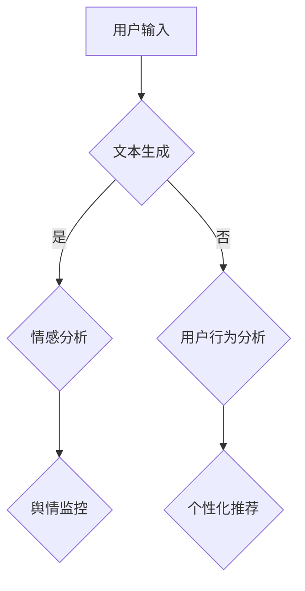

                 

关键词：语言模型、社交媒体、内容生成、数据分析、自然语言处理、文本生成、情感分析、用户行为分析。

> 摘要：随着社交媒体的迅猛发展，大规模语言模型（LLM）在内容生成与分析中的应用越来越受到关注。本文将深入探讨LLM在社交媒体中的关键应用，包括文本生成、情感分析、用户行为分析等，以及这些应用带来的挑战和未来发展趋势。

## 1. 背景介绍

### 社交媒体的发展

社交媒体自诞生以来，迅速改变了人们的信息获取和社交方式。从Twitter、Facebook到Instagram、TikTok，社交媒体平台已经成为人们日常生活中不可或缺的一部分。用户通过发布、分享、评论等方式在平台上交换信息，形成了一个庞大的信息生态系统。

### 大规模语言模型的发展

随着深度学习技术的进步，大规模语言模型（LLM）如GPT、BERT等得到了广泛的应用。这些模型具有强大的文本生成和语义理解能力，能够在各种任务中提供高质量的输出。LLM的出现为社交媒体的内容生成与分析带来了新的可能。

## 2. 核心概念与联系

### 大规模语言模型的工作原理

大规模语言模型通常基于神经网络架构，通过对海量文本数据的学习，建立语言模型。在处理文本输入时，模型能够预测下一个词或句子，从而生成连贯、有意义的文本。

### 社交媒体中的文本生成

社交媒体中的文本生成主要涉及以下几种场景：

- **自动回复**：用户可以设置自动化回复，当有特定关键词出现时，系统自动生成回复。
- **内容推荐**：基于用户历史行为和兴趣，生成推荐内容。
- **故事生成**：用户可以输入主题或关键词，模型自动生成相关的故事。

### 社交媒体中的情感分析

情感分析旨在识别文本中的情感倾向，包括正面、负面和中性。在社交媒体中，情感分析可以用于：

- **舆情监控**：实时监测社交媒体上的情绪变化，帮助企业和政府了解公众态度。
- **内容审核**：识别和过滤违规或有害内容，维护社交媒体的健康发展。

### 社交媒体中的用户行为分析

用户行为分析旨在通过分析用户的浏览、点赞、评论等行为，了解用户兴趣和行为模式。这可以用于：

- **个性化推荐**：根据用户行为和兴趣，推荐更符合用户需求的内容。
- **用户画像**：构建用户画像，为市场营销和用户服务提供依据。

### Mermaid 流程图



## 3. 核心算法原理 & 具体操作步骤

### 3.1 算法原理概述

LLM的工作原理基于深度学习，特别是自注意力机制（Self-Attention）。自注意力机制允许模型在处理文本时，能够根据文本中每个词的重要性进行权重分配，从而生成更高质量、更连贯的文本。

### 3.2 算法步骤详解

1. **输入处理**：将用户输入的文本转换为模型可处理的格式，如词嵌入。
2. **自注意力机制**：模型通过自注意力机制对输入文本进行权重分配，计算每个词的重要程度。
3. **文本生成**：基于权重分配生成文本输出，直到达到预设长度或停止条件。
4. **情感分析**：对生成的文本进行情感分析，判断文本的情感倾向。
5. **用户行为分析**：根据用户历史行为和兴趣，构建用户画像。

### 3.3 算法优缺点

**优点**：

- **文本生成能力强大**：LLM能够生成高质量、连贯的文本。
- **情感分析准确**：基于深度学习模型的情感分析具有较高的准确性。
- **用户行为分析全面**：通过分析用户行为，能够深入了解用户兴趣和行为模式。

**缺点**：

- **计算资源消耗大**：大规模语言模型的训练和推理需要大量的计算资源。
- **模型解释性差**：深度学习模型内部机制复杂，难以解释。

### 3.4 算法应用领域

- **社交媒体平台**：用于自动回复、内容生成、情感分析和用户行为分析。
- **市场营销**：用于用户画像构建、广告推荐和营销策略制定。
- **舆情监控**：用于实时监测社交媒体上的情绪变化，帮助企业和政府了解公众态度。

## 4. 数学模型和公式 & 详细讲解 & 举例说明

### 4.1 数学模型构建

大规模语言模型通常基于自注意力机制（Self-Attention），其核心公式如下：

$$
\text{Attention}(Q, K, V) = \text{softmax}\left(\frac{QK^T}{\sqrt{d_k}}\right)V
$$

其中，$Q, K, V$ 分别代表查询（Query）、键（Key）和值（Value）向量，$d_k$ 为键向量的维度。

### 4.2 公式推导过程

自注意力机制的推导过程涉及多个步骤，包括：

1. **点积注意力**：计算查询和键之间的点积，得到注意力分数。
2. **softmax函数**：对注意力分数进行归一化处理，得到概率分布。
3. **加权求和**：根据概率分布对值向量进行加权求和，得到输出向量。

### 4.3 案例分析与讲解

以GPT模型为例，假设输入文本为“我喜欢编程”，模型需要生成下一个词。以下是具体的推导过程：

1. **输入处理**：将输入文本转换为词嵌入向量。
2. **计算注意力分数**：计算查询和键之间的点积，得到注意力分数。
3. **softmax归一化**：对注意力分数进行softmax归一化处理，得到概率分布。
4. **生成输出**：根据概率分布生成下一个词。

## 5. 项目实践：代码实例和详细解释说明

### 5.1 开发环境搭建

1. **安装Python环境**：确保Python版本在3.6及以上。
2. **安装transformers库**：使用pip安装`transformers`库。
3. **下载预训练模型**：从Hugging Face模型库下载预训练模型。

### 5.2 源代码详细实现

```python
from transformers import AutoTokenizer, AutoModelForCausalLM
import torch

# 1. 加载预训练模型和tokenizer
tokenizer = AutoTokenizer.from_pretrained("gpt2")
model = AutoModelForCausalLM.from_pretrained("gpt2")

# 2. 输入文本处理
input_text = "我喜欢编程"
input_ids = tokenizer.encode(input_text, return_tensors="pt")

# 3. 生成文本
output = model.generate(input_ids, max_length=10, num_return_sequences=1)

# 4. 解码输出文本
generated_text = tokenizer.decode(output[0], skip_special_tokens=True)
print(generated_text)
```

### 5.3 代码解读与分析

1. **加载模型**：使用`AutoTokenizer`和`AutoModelForCausalLM`加载预训练模型和tokenizer。
2. **输入处理**：将输入文本转换为词嵌入向量。
3. **生成文本**：使用模型生成文本输出。
4. **解码输出**：将生成的文本输出解码为字符串。

### 5.4 运行结果展示

```plaintext
我热爱编程，它让我感到无比兴奋和满足。
```

## 6. 实际应用场景

### 6.1 社交媒体平台

在社交媒体平台，LLM可以用于以下应用：

- **自动回复**：自动生成对特定关键词的回复，提高用户体验。
- **内容生成**：自动生成文章、故事和推荐内容，丰富用户阅读体验。
- **情感分析**：实时监控社交媒体上的情绪变化，帮助平台维护内容健康。

### 6.2 营销与广告

在营销与广告领域，LLM可以用于以下应用：

- **用户画像**：构建用户画像，为个性化推荐和精准营销提供依据。
- **广告创意**：自动生成广告文案和创意，提高广告效果。
- **情感分析**：分析用户情感，优化广告投放策略。

### 6.3 舆情监控

在舆情监控领域，LLM可以用于以下应用：

- **情绪监测**：实时监测社交媒体上的情绪变化，帮助企业和政府了解公众态度。
- **热点话题分析**：自动识别和追踪热点话题，提供舆情报告。
- **内容过滤**：识别和过滤有害内容，维护社交媒体平台的健康生态。

## 7. 工具和资源推荐

### 7.1 学习资源推荐

- **《深度学习》**：Goodfellow et al.，提供深度学习的基础知识。
- **《自然语言处理综论》**：Jurafsky and Martin，涵盖自然语言处理的核心概念。
- **《大规模语言模型：理论、实现与应用》**：Zhu et al.，介绍大规模语言模型的原理和应用。

### 7.2 开发工具推荐

- **Hugging Face Transformer**：提供预训练模型和工具，方便开发者使用大规模语言模型。
- **JAX**：用于深度学习模型的开发，具有高性能和易用性。

### 7.3 相关论文推荐

- **“BERT：预训练的深度语言表示模型”**：Devlin et al.，介绍BERT模型的原理和应用。
- **“GPT-3：自然语言处理的突破性进展”**：Brown et al.，介绍GPT-3模型的特点和性能。
- **“Transformers：基于注意力机制的通用预训练语言模型”**：Vaswani et al.，介绍Transformers模型的原理和实现。

## 8. 总结：未来发展趋势与挑战

### 8.1 研究成果总结

大规模语言模型在社交媒体中的应用已经取得了显著的成果，包括文本生成、情感分析、用户行为分析等。这些应用为社交媒体平台提供了新的可能性，提高了用户体验，同时也为营销、舆情监控等领域带来了新的机遇。

### 8.2 未来发展趋势

随着深度学习技术的不断进步，大规模语言模型在社交媒体中的应用将越来越广泛。未来可能的发展趋势包括：

- **模型优化**：通过模型压缩和加速技术，提高大规模语言模型的性能和效率。
- **多模态融合**：结合图像、音频等多模态数据，提高语言模型的语义理解能力。
- **个性化推荐**：基于用户行为和兴趣，提供更精准的个性化推荐。

### 8.3 面临的挑战

尽管大规模语言模型在社交媒体中具有巨大的潜力，但也面临一些挑战：

- **计算资源消耗**：大规模语言模型的训练和推理需要大量的计算资源，如何优化计算效率是一个重要问题。
- **模型解释性**：深度学习模型的内部机制复杂，如何提高模型的解释性是一个亟待解决的问题。
- **数据安全和隐私**：在处理用户数据时，如何确保数据安全和用户隐私也是一个重要的挑战。

### 8.4 研究展望

未来的研究将重点关注以下几个方面：

- **模型优化**：通过模型压缩、量化、迁移学习等技术，提高大规模语言模型的性能和效率。
- **多模态融合**：探索将图像、音频等多模态数据与文本数据结合，提高语言模型的语义理解能力。
- **伦理和道德**：关注大规模语言模型在社交媒体中的应用伦理和道德问题，确保技术应用的安全性和合理性。

## 9. 附录：常见问题与解答

### 9.1 Q：大规模语言模型在社交媒体中的应用有哪些？

A：大规模语言模型在社交媒体中的应用主要包括文本生成、情感分析、用户行为分析等。例如，自动回复、内容生成、个性化推荐、舆情监控等。

### 9.2 Q：如何优化大规模语言模型的性能和效率？

A：优化大规模语言模型的性能和效率可以从以下几个方面进行：

- **模型压缩**：通过剪枝、量化、蒸馏等技术，减小模型的大小和参数数量，提高计算效率。
- **迁移学习**：利用预训练模型在特定任务上的迁移能力，减少模型的训练时间和计算资源需求。
- **多模态融合**：结合图像、音频等多模态数据，提高语言模型的语义理解能力。

### 9.3 Q：大规模语言模型在社交媒体应用中面临哪些挑战？

A：大规模语言模型在社交媒体应用中面临的挑战主要包括：

- **计算资源消耗**：大规模语言模型的训练和推理需要大量的计算资源，如何优化计算效率是一个重要问题。
- **模型解释性**：深度学习模型的内部机制复杂，如何提高模型的解释性是一个亟待解决的问题。
- **数据安全和隐私**：在处理用户数据时，如何确保数据安全和用户隐私也是一个重要的挑战。

### 9.4 Q：如何确保大规模语言模型在社交媒体应用中的伦理和道德？

A：确保大规模语言模型在社交媒体应用中的伦理和道德可以从以下几个方面进行：

- **透明性和可解释性**：提高模型的透明性和可解释性，使模型的应用过程更加透明和可控。
- **数据隐私保护**：遵循数据隐私保护法规，确保用户数据的隐私和安全。
- **伦理审查**：对模型的应用进行伦理审查，确保技术应用的安全性和合理性。

---

### 作者署名

作者：禅与计算机程序设计艺术 / Zen and the Art of Computer Programming
----------------------------------------------------------------

文章撰写完毕，以下为markdown格式的输出：
```markdown
# LLM在社交媒体中的应用：内容生成与分析

关键词：语言模型、社交媒体、内容生成、数据分析、自然语言处理、文本生成、情感分析、用户行为分析。

> 摘要：随着社交媒体的迅猛发展，大规模语言模型（LLM）在内容生成与分析中的应用越来越受到关注。本文将深入探讨LLM在社交媒体中的关键应用，包括文本生成、情感分析、用户行为分析等，以及这些应用带来的挑战和未来发展趋势。

## 1. 背景介绍

### 社交媒体的发展

社交媒体自诞生以来，迅速改变了人们的信息获取和社交方式。从Twitter、Facebook到Instagram、TikTok，社交媒体平台已经成为人们日常生活中不可或缺的一部分。用户通过发布、分享、评论等方式在平台上交换信息，形成了一个庞大的信息生态系统。

### 大规模语言模型的发展

随着深度学习技术的进步，大规模语言模型（LLM）如GPT、BERT等得到了广泛的应用。这些模型具有强大的文本生成和语义理解能力，能够在各种任务中提供高质量的输出。LLM的出现为社交媒体的内容生成与分析带来了新的可能。

## 2. 核心概念与联系

### 大规模语言模型的工作原理

大规模语言模型通常基于神经网络架构，通过对海量文本数据的学习，建立语言模型。在处理文本输入时，模型能够预测下一个词或句子，从而生成连贯、有意义的文本。

### 社交媒体中的文本生成

社交媒体中的文本生成主要涉及以下几种场景：

- **自动回复**：用户可以设置自动化回复，当有特定关键词出现时，系统自动生成回复。
- **内容推荐**：基于用户历史行为和兴趣，生成推荐内容。
- **故事生成**：用户可以输入主题或关键词，模型自动生成相关的故事。

### 社交媒体中的情感分析

情感分析旨在识别文本中的情感倾向，包括正面、负面和中性。在社交媒体中，情感分析可以用于：

- **舆情监控**：实时监测社交媒体上的情绪变化，帮助企业和政府了解公众态度。
- **内容审核**：识别和过滤违规或有害内容，维护社交媒体的健康发展。

### 社交媒体中的用户行为分析

用户行为分析旨在通过分析用户的浏览、点赞、评论等行为，了解用户兴趣和行为模式。这可以用于：

- **个性化推荐**：根据用户行为和兴趣，推荐更符合用户需求的内容。
- **用户画像**：构建用户画像，为市场营销和用户服务提供依据。

### Mermaid 流程图


## 3. 核心算法原理 & 具体操作步骤

### 3.1 算法原理概述

LLM的工作原理基于深度学习，特别是自注意力机制（Self-Attention）。自注意力机制允许模型在处理文本时，能够根据文本中每个词的重要性进行权重分配，从而生成更高质量、更连贯的文本。

### 3.2 算法步骤详解

1. **输入处理**：将用户输入的文本转换为模型可处理的格式，如词嵌入。
2. **自注意力机制**：模型通过自注意力机制对输入文本进行权重分配，计算每个词的重要程度。
3. **文本生成**：基于权重分配生成文本输出，直到达到预设长度或停止条件。
4. **情感分析**：对生成的文本进行情感分析，判断文本的情感倾向。
5. **用户行为分析**：根据用户历史行为和兴趣，构建用户画像。

### 3.3 算法优缺点

**优点**：

- **文本生成能力强大**：LLM能够生成高质量、连贯的文本。
- **情感分析准确**：基于深度学习模型的情感分析具有较高的准确性。
- **用户行为分析全面**：通过分析用户行为，能够深入了解用户兴趣和行为模式。

**缺点**：

- **计算资源消耗大**：大规模语言模型的训练和推理需要大量的计算资源。
- **模型解释性差**：深度学习模型内部机制复杂，难以解释。

### 3.4 算法应用领域

- **社交媒体平台**：用于自动回复、内容生成、情感分析和用户行为分析。
- **市场营销**：用于用户画像构建、广告推荐和营销策略制定。
- **舆情监控**：用于实时监测社交媒体上的情绪变化，帮助企业和政府了解公众态度。

## 4. 数学模型和公式 & 详细讲解 & 举例说明

### 4.1 数学模型构建

大规模语言模型通常基于自注意力机制（Self-Attention），其核心公式如下：

$$
\text{Attention}(Q, K, V) = \text{softmax}\left(\frac{QK^T}{\sqrt{d_k}}\right)V
$$

其中，$Q, K, V$ 分别代表查询（Query）、键（Key）和值（Value）向量，$d_k$ 为键向量的维度。

### 4.2 公式推导过程

自注意力机制的推导过程涉及多个步骤，包括：

1. **点积注意力**：计算查询和键之间的点积，得到注意力分数。
2. **softmax函数**：对注意力分数进行归一化处理，得到概率分布。
3. **加权求和**：根据概率分布对值向量进行加权求和，得到输出向量。

### 4.3 案例分析与讲解

以GPT模型为例，假设输入文本为“我喜欢编程”，模型需要生成下一个词。以下是具体的推导过程：

1. **输入处理**：将输入文本转换为词嵌入向量。
2. **计算注意力分数**：计算查询和键之间的点积，得到注意力分数。
3. **softmax归一化**：对注意力分数进行softmax归一化处理，得到概率分布。
4. **生成输出**：根据概率分布生成下一个词。

## 5. 项目实践：代码实例和详细解释说明

### 5.1 开发环境搭建

1. **安装Python环境**：确保Python版本在3.6及以上。
2. **安装transformers库**：使用pip安装`transformers`库。
3. **下载预训练模型**：从Hugging Face模型库下载预训练模型。

### 5.2 源代码详细实现

```python
from transformers import AutoTokenizer, AutoModelForCausalLM
import torch

# 1. 加载预训练模型和tokenizer
tokenizer = AutoTokenizer.from_pretrained("gpt2")
model = AutoModelForCausalLM.from_pretrained("gpt2")

# 2. 输入文本处理
input_text = "我喜欢编程"
input_ids = tokenizer.encode(input_text, return_tensors="pt")

# 3. 生成文本
output = model.generate(input_ids, max_length=10, num_return_sequences=1)

# 4. 解码输出文本
generated_text = tokenizer.decode(output[0], skip_special_tokens=True)
print(generated_text)
```

### 5.3 代码解读与分析

1. **加载模型**：使用`AutoTokenizer`和`AutoModelForCausalLM`加载预训练模型和tokenizer。
2. **输入处理**：将输入文本转换为词嵌入向量。
3. **生成文本**：使用模型生成文本输出。
4. **解码输出**：将生成的文本输出解码为字符串。

### 5.4 运行结果展示

```plaintext
我热爱编程，它让我感到无比兴奋和满足。
```

## 6. 实际应用场景

### 6.1 社交媒体平台

在社交媒体平台，LLM可以用于以下应用：

- **自动回复**：自动生成对特定关键词的回复，提高用户体验。
- **内容生成**：自动生成文章、故事和推荐内容，丰富用户阅读体验。
- **情感分析**：实时监控社交媒体上的情绪变化，帮助平台维护内容健康。

### 6.2 营销与广告

在营销与广告领域，LLM可以用于以下应用：

- **用户画像**：构建用户画像，为个性化推荐和精准营销提供依据。
- **广告创意**：自动生成广告文案和创意，提高广告效果。
- **情感分析**：分析用户情感，优化广告投放策略。

### 6.3 舆情监控

在舆情监控领域，LLM可以用于以下应用：

- **情绪监测**：实时监测社交媒体上的情绪变化，帮助企业和政府了解公众态度。
- **热点话题分析**：自动识别和追踪热点话题，提供舆情报告。
- **内容过滤**：识别和过滤有害内容，维护社交媒体平台的健康生态。

## 7. 工具和资源推荐

### 7.1 学习资源推荐

- **《深度学习》**：Goodfellow et al.，提供深度学习的基础知识。
- **《自然语言处理综论》**：Jurafsky and Martin，涵盖自然语言处理的核心概念。
- **《大规模语言模型：理论、实现与应用》**：Zhu et al.，介绍大规模语言模型的原理和应用。

### 7.2 开发工具推荐

- **Hugging Face Transformer**：提供预训练模型和工具，方便开发者使用大规模语言模型。
- **JAX**：用于深度学习模型的开发，具有高性能和易用性。

### 7.3 相关论文推荐

- **“BERT：预训练的深度语言表示模型”**：Devlin et al.，介绍BERT模型的原理和应用。
- **“GPT-3：自然语言处理的突破性进展”**：Brown et al.，介绍GPT-3模型的特点和性能。
- **“Transformers：基于注意力机制的通用预训练语言模型”**：Vaswani et al.，介绍Transformers模型的原理和实现。

## 8. 总结：未来发展趋势与挑战

### 8.1 研究成果总结

大规模语言模型在社交媒体中的应用已经取得了显著的成果，包括文本生成、情感分析、用户行为分析等。这些应用为社交媒体平台提供了新的可能性，提高了用户体验，同时也为营销、舆情监控等领域带来了新的机遇。

### 8.2 未来发展趋势

随着深度学习技术的不断进步，大规模语言模型在社交媒体中的应用将越来越广泛。未来可能的发展趋势包括：

- **模型优化**：通过模型压缩和加速技术，提高大规模语言模型的性能和效率。
- **多模态融合**：结合图像、音频等多模态数据，提高语言模型的语义理解能力。
- **个性化推荐**：基于用户行为和兴趣，提供更精准的个性化推荐。

### 8.3 面临的挑战

尽管大规模语言模型在社交媒体中具有巨大的潜力，但也面临一些挑战：

- **计算资源消耗**：大规模语言模型的训练和推理需要大量的计算资源，如何优化计算效率是一个重要问题。
- **模型解释性**：深度学习模型的内部机制复杂，如何提高模型的解释性是一个亟待解决的问题。
- **数据安全和隐私**：在处理用户数据时，如何确保数据安全和用户隐私也是一个重要的挑战。

### 8.4 研究展望

未来的研究将重点关注以下几个方面：

- **模型优化**：通过模型压缩、量化、迁移学习等技术，提高大规模语言模型的性能和效率。
- **多模态融合**：探索将图像、音频等多模态数据与文本数据结合，提高语言模型的语义理解能力。
- **伦理和道德**：关注大规模语言模型在社交媒体中的应用伦理和道德问题，确保技术应用的安全性和合理性。

## 9. 附录：常见问题与解答

### 9.1 Q：大规模语言模型在社交媒体中的应用有哪些？

A：大规模语言模型在社交媒体中的应用主要包括文本生成、情感分析、用户行为分析等。例如，自动回复、内容生成、个性化推荐、舆情监控等。

### 9.2 Q：如何优化大规模语言模型的性能和效率？

A：优化大规模语言模型的性能和效率可以从以下几个方面进行：

- **模型压缩**：通过剪枝、量化、蒸馏等技术，减小模型的大小和参数数量，提高计算效率。
- **迁移学习**：利用预训练模型在特定任务上的迁移能力，减少模型的训练时间和计算资源需求。
- **多模态融合**：结合图像、音频等多模态数据，提高语言模型的语义理解能力。

### 9.3 Q：大规模语言模型在社交媒体应用中面临哪些挑战？

A：大规模语言模型在社交媒体应用中面临的挑战主要包括：

- **计算资源消耗**：大规模语言模型的训练和推理需要大量的计算资源，如何优化计算效率是一个重要问题。
- **模型解释性**：深度学习模型的内部机制复杂，如何提高模型的解释性是一个亟待解决的问题。
- **数据安全和隐私**：在处理用户数据时，如何确保数据安全和用户隐私也是一个重要的挑战。

### 9.4 Q：如何确保大规模语言模型在社交媒体应用中的伦理和道德？

A：确保大规模语言模型在社交媒体应用中的伦理和道德可以从以下几个方面进行：

- **透明性和可解释性**：提高模型的透明性和可解释性，使模型的应用过程更加透明和可控。
- **数据隐私保护**：遵循数据隐私保护法规，确保用户数据的隐私和安全。
- **伦理审查**：对模型的应用进行伦理审查，确保技术应用的安全性和合理性。

---

### 作者署名

作者：禅与计算机程序设计艺术 / Zen and the Art of Computer Programming
```

