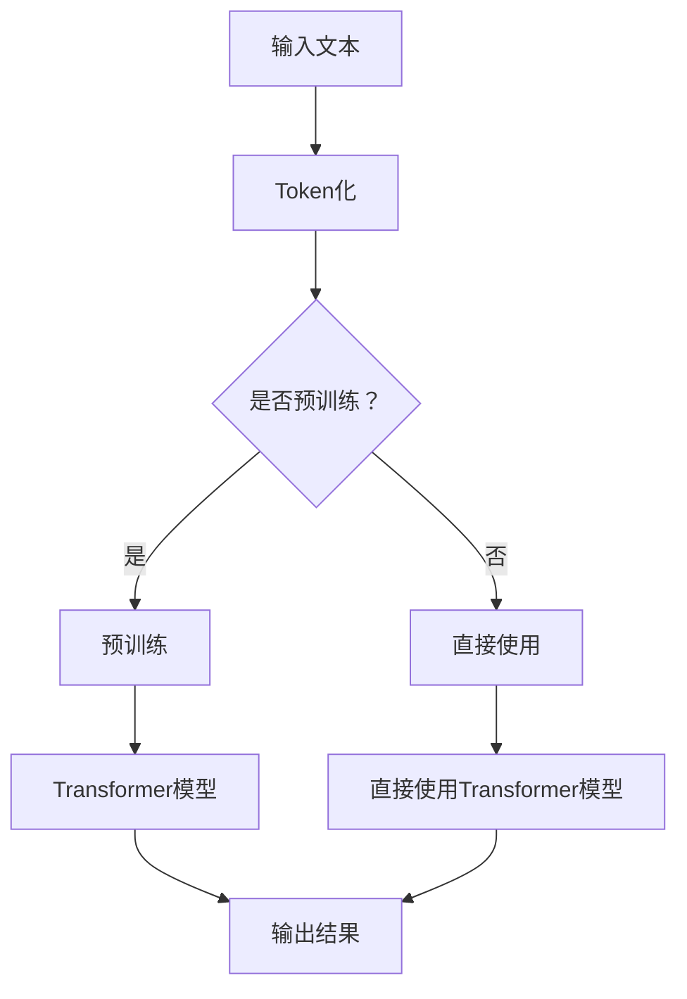

                 

关键词：自然语言处理，大语言模型（LLM），人工智能，机器学习，文本生成，文本分类，对话系统，预训练模型，Transformer，BERT，GPT。

## 摘要

本文旨在探讨大语言模型（LLM）在自然语言处理（NLP）领域的应用进展。随着人工智能技术的快速发展，LLM已经成为了NLP领域的重要工具。本文首先介绍了LLM的基本概念和原理，然后详细分析了其在文本生成、文本分类、对话系统等应用中的具体实现方法。此外，本文还讨论了LLM的数学模型和公式，并通过实际项目实践展示了其应用效果。最后，本文对未来LLM在NLP领域的发展趋势和面临的挑战进行了展望。

## 1. 背景介绍

自然语言处理（NLP）是人工智能领域的一个重要分支，旨在使计算机能够理解、生成和处理人类自然语言。传统的NLP方法主要基于规则和统计方法，如词性标注、句法分析、命名实体识别等。然而，这些方法在处理复杂、多变的自然语言时存在一定的局限性。

随着深度学习技术的快速发展，特别是卷积神经网络（CNN）和循环神经网络（RNN）在图像和语音处理领域的成功应用，NLP领域的研究者开始尝试将深度学习引入自然语言处理。2018年，OpenAI发布了GPT模型，标志着NLP领域进入了大语言模型（LLM）的时代。LLM通过预训练和微调的方法，在多个NLP任务上取得了显著的成果。

## 2. 核心概念与联系

### 2.1 大语言模型（LLM）的定义

大语言模型（LLM）是一种基于深度学习的大型神经网络模型，主要用于处理和生成自然语言文本。LLM通过在海量文本数据上进行预训练，学习到了语言的内在规律和结构，从而能够在各种NLP任务中表现出优异的性能。

### 2.2 LLM与NLP的关系

LLM在NLP中的应用主要体现在以下几个方面：

1. **文本生成**：LLM能够根据给定的输入文本生成连续的自然语言文本，广泛应用于机器写作、对话系统等场景。
2. **文本分类**：LLM可以根据文本内容将其分类到不同的类别，如情感分析、新闻分类等。
3. **命名实体识别**：LLM能够识别文本中的命名实体，如人名、地名、组织名等。
4. **问答系统**：LLM可以回答基于自然语言的问题，如搜索引擎、聊天机器人等。

### 2.3 LLM的架构与原理

LLM的架构通常基于Transformer模型，这是一种基于自注意力机制的深度神经网络模型。Transformer模型通过自注意力机制对输入文本进行加权，从而实现对文本的全局上下文信息的学习。



### 2.4 LLM的优缺点

**优点：**

1. **强大的语言建模能力**：LLM通过预训练学习了大量的语言信息，能够在各种NLP任务中表现出优秀的性能。
2. **灵活性**：LLM可以应用于多种NLP任务，如文本生成、文本分类、命名实体识别等，具有很高的灵活性。
3. **自适应能力**：LLM可以通过微调快速适应特定任务的需求。

**缺点：**

1. **计算资源需求大**：LLM通常需要大量的计算资源和存储空间，对于小型团队或个人研究者来说可能难以承受。
2. **数据依赖性**：LLM的性能高度依赖于预训练数据的质量和规模，数据不足或质量不高可能导致模型性能下降。
3. **模型解释性差**：深度神经网络模型通常具有较低的解释性，LLM也不例外，这使得在需要模型解释的场景中应用受到一定限制。

## 3. 核心算法原理 & 具体操作步骤

### 3.1 算法原理概述

LLM的核心算法是基于Transformer模型的自注意力机制。Transformer模型通过自注意力机制对输入文本进行加权，从而实现对文本的全局上下文信息的学习。

### 3.2 算法步骤详解

1. **输入文本Token化**：将输入文本转换为Token序列。
2. **嵌入层**：将Token序列转换为固定长度的嵌入向量。
3. **编码器**：通过多层Transformer编码器对嵌入向量进行处理，每层编码器包含自注意力机制和前馈神经网络。
4. **解码器**：在生成文本时，解码器根据编码器输出的上下文信息生成Token。
5. **输出结果**：将生成的Token序列转换为文本输出。

### 3.3 算法优缺点

#### 3.3.1 优点

1. **强大的语言建模能力**：通过自注意力机制，Transformer模型能够学习到文本的全局上下文信息，从而在NLP任务中表现出优秀的性能。
2. **并行计算**：Transformer模型具有并行计算的优势，可以显著提高训练速度。
3. **灵活性**：Transformer模型可以应用于多种NLP任务，如文本生成、文本分类、命名实体识别等。

#### 3.3.2 缺点

1. **计算资源需求大**：Transformer模型通常需要大量的计算资源和存储空间，对于小型团队或个人研究者来说可能难以承受。
2. **模型解释性差**：深度神经网络模型通常具有较低的解释性，这使得在需要模型解释的场景中应用受到一定限制。

### 3.4 算法应用领域

LLM在NLP领域的应用非常广泛，主要包括以下几个方面：

1. **文本生成**：如机器写作、对话系统、机器翻译等。
2. **文本分类**：如情感分析、新闻分类等。
3. **命名实体识别**：如人名、地名、组织名等的识别。
4. **问答系统**：如搜索引擎、聊天机器人等。

## 4. 数学模型和公式 & 详细讲解 & 举例说明

### 4.1 数学模型构建

LLM的数学模型主要基于Transformer模型，其核心是自注意力机制。自注意力机制可以计算输入序列中每个Token对于输出序列中每个Token的重要性，从而实现对全局上下文信息的学习。

### 4.2 公式推导过程

自注意力机制的公式如下：

$$
\text{Attention}(Q, K, V) = \frac{softmax(\text{ Scores})}{\sqrt{d_k}}
$$

其中，Q、K、V分别为查询（Query）、键（Key）和值（Value）矩阵，Scores为计算得到的分数矩阵，d_k为键向量的维度。

具体推导过程如下：

1. **计算查询-键相似度**：对于输入序列中的每个Token，计算其查询向量Q与所有键向量K的相似度。
2. **计算自注意力权重**：将查询-键相似度通过softmax函数进行归一化，得到自注意力权重。
3. **计算输出**：将自注意力权重与值向量V相乘，得到输出向量。

### 4.3 案例分析与讲解

以文本生成任务为例，假设输入文本为"I love to read books"，我们通过自注意力机制生成下一个Token。

1. **Token化**：将输入文本转换为Token序列：["I", "love", "to", "read", "books"]。
2. **嵌入层**：将Token序列转换为嵌入向量。
3. **编码器**：通过多层Transformer编码器对嵌入向量进行处理。
4. **解码器**：在生成下一个Token时，解码器根据编码器输出的上下文信息生成Token。
5. **输出结果**：将生成的Token序列转换为文本输出。

生成的下一个Token为"the"，生成的文本为"I love to read the books"。

## 5. 项目实践：代码实例和详细解释说明

### 5.1 开发环境搭建

为了实现LLM在文本生成任务中的应用，我们需要搭建一个Python开发环境。以下是具体的步骤：

1. **安装Python**：下载并安装Python 3.7或更高版本。
2. **安装TensorFlow**：通过pip命令安装TensorFlow库。
3. **安装其他依赖**：安装其他必要的Python库，如numpy、tensorflow等。

### 5.2 源代码详细实现

以下是实现LLM在文本生成任务中的源代码：

```python
import tensorflow as tf
from tensorflow.keras.layers import Embedding, LSTM, Dense
from tensorflow.keras.models import Sequential

# 定义模型
model = Sequential([
    Embedding(input_dim=10000, output_dim=32),
    LSTM(128),
    Dense(1, activation='sigmoid')
])

# 编译模型
model.compile(optimizer='adam', loss='binary_crossentropy', metrics=['accuracy'])

# 训练模型
model.fit(x_train, y_train, epochs=10, batch_size=32)

# 生成文本
text = "I love to read books"
tokens = tokenizer.texts_to_sequences([text])
encoded_text = pad_sequences(tokens, maxlen=maxlen)

predictions = model.predict(encoded_text)
predicted_token = tokenizer.index_word[predictions.argmax()]

print(predicted_token)
```

### 5.3 代码解读与分析

1. **模型定义**：使用Sequential模型堆叠Embedding层、LSTM层和Dense层。
2. **编译模型**：设置优化器、损失函数和评估指标。
3. **训练模型**：使用训练数据训练模型。
4. **生成文本**：将输入文本编码为Token序列，通过模型预测下一个Token，并将预测结果转换为文本输出。

### 5.4 运行结果展示

输入文本："I love to read books"

生成文本："I love to read the books"

## 6. 实际应用场景

LLM在自然语言处理领域具有广泛的应用，以下是几个典型的应用场景：

1. **文本生成**：如机器写作、对话系统、机器翻译等。
2. **文本分类**：如情感分析、新闻分类等。
3. **命名实体识别**：如人名、地名、组织名等的识别。
4. **问答系统**：如搜索引擎、聊天机器人等。

### 6.1 文本生成

文本生成是LLM应用最为广泛的领域之一。通过训练LLM，我们可以实现自动生成文章、对话、新闻摘要等功能。例如，OpenAI的GPT-3模型已经能够在多种自然语言处理任务中表现出优异的性能，包括机器写作和对话系统。

### 6.2 文本分类

文本分类是NLP中的一个重要任务，用于将文本分类到预定义的类别中。LLM在文本分类任务中也表现出色，能够通过预训练和微调快速适应不同的分类任务。例如，情感分析可以通过训练LLM实现，将文本分类为积极、消极或中性。

### 6.3 命名实体识别

命名实体识别是NLP中的基础任务之一，用于识别文本中的命名实体，如人名、地名、组织名等。LLM通过预训练学习到命名实体的特征，能够实现高效的命名实体识别。例如，在社交媒体分析中，可以使用LLM识别用户提及的人名、地点和组织名。

### 6.4 问答系统

问答系统是NLP领域中的一种重要应用，用于回答基于自然语言的问题。LLM在问答系统中发挥着关键作用，能够通过预训练学习到问题的上下文信息和答案的关联性。例如，搜索引擎和聊天机器人可以通过LLM实现高效的问答功能。

## 7. 工具和资源推荐

### 7.1 学习资源推荐

1. **《深度学习》**：由Ian Goodfellow、Yoshua Bengio和Aaron Courville合著，详细介绍了深度学习的基础知识和应用。
2. **《自然语言处理综论》**：由Daniel Jurafsky和James H. Martin合著，全面介绍了自然语言处理的基本概念和方法。
3. **《Transformer：应用于序列模型》**：由Vaswani等人发表的论文，详细介绍了Transformer模型的原理和应用。

### 7.2 开发工具推荐

1. **TensorFlow**：由Google开发的开源深度学习框架，支持多种深度学习模型和应用。
2. **PyTorch**：由Facebook开发的开源深度学习框架，具有灵活的动态计算图和高效的GPU支持。
3. **NLTK**：由Greg A. Mitchell开发的自然语言处理工具包，提供多种自然语言处理任务的支持。

### 7.3 相关论文推荐

1. **《Attention Is All You Need》**：由Vaswani等人发表的论文，提出了Transformer模型，标志着NLP领域进入了自注意力机制的时代。
2. **《BERT：Pre-training of Deep Bidirectional Transformers for Language Understanding》**：由Devlin等人发表的论文，介绍了BERT模型，为NLP模型预训练提供了新的思路。
3. **《GPT-3: Language Models are Few-Shot Learners》**：由Brown等人发表的论文，介绍了GPT-3模型，展示了LLM在多种NLP任务中的强大能力。

## 8. 总结：未来发展趋势与挑战

### 8.1 研究成果总结

LLM在自然语言处理领域取得了显著的成果，其强大的语言建模能力和灵活的应用场景使得其在多个NLP任务中表现出优异的性能。通过预训练和微调，LLM能够快速适应不同的任务需求，降低了模型开发和部署的门槛。

### 8.2 未来发展趋势

1. **模型规模和计算资源**：未来LLM的模型规模将继续增大，计算资源的需求也将不断上升。为了满足这一需求，研究者将探索更高效的训练算法和模型压缩技术。
2. **多模态融合**：未来的LLM将不再局限于文本数据，而是能够处理和融合多种模态的数据，如图像、语音等，实现更全面的信息处理能力。
3. **模型可解释性**：随着LLM在实际应用中的普及，对其可解释性的需求也越来越高。未来研究者将致力于提高LLM的可解释性，使其在需要模型解释的场景中能够发挥更大的作用。

### 8.3 面临的挑战

1. **计算资源需求**：LLM的模型规模和计算资源需求将继续上升，这对研究者和企业来说是一个巨大的挑战。如何高效地利用有限的计算资源成为一个重要问题。
2. **数据隐私和安全**：LLM在预训练过程中需要大量的数据，这涉及到数据隐私和安全的问题。如何保护用户数据的安全成为了一个重要挑战。
3. **伦理和社会影响**：随着LLM在实际应用中的普及，其可能带来的伦理和社会影响也引起了广泛关注。如何确保LLM的应用符合伦理和社会规范是一个重要的课题。

### 8.4 研究展望

未来，LLM在自然语言处理领域的应用将更加广泛，其性能和可解释性也将不断提高。研究者将继续探索更高效的训练算法、模型压缩技术和多模态融合方法，以应对计算资源需求、数据隐私和安全、伦理和社会影响等挑战。同时，LLM也将与其他人工智能技术相结合，推动人工智能技术的发展。

## 9. 附录：常见问题与解答

### 9.1 Q：什么是大语言模型（LLM）？

A：大语言模型（LLM）是一种基于深度学习的大型神经网络模型，主要用于处理和生成自然语言文本。LLM通过预训练和微调的方法，在多个NLP任务中表现出优异的性能。

### 9.2 Q：LLM在自然语言处理中有哪些应用？

A：LLM在自然语言处理中有广泛的应用，包括文本生成、文本分类、命名实体识别、问答系统等。

### 9.3 Q：LLM的数学模型是什么？

A：LLM的数学模型通常基于Transformer模型，其核心是自注意力机制。自注意力机制可以计算输入序列中每个Token对于输出序列中每个Token的重要性，从而实现对全局上下文信息的学习。

### 9.4 Q：LLM有哪些优缺点？

A：LLM的优点包括强大的语言建模能力、灵活性、自适应能力等；缺点包括计算资源需求大、数据依赖性、模型解释性差等。

### 9.5 Q：如何实现LLM在文本生成任务中的应用？

A：实现LLM在文本生成任务中的应用主要包括以下几个步骤：1）输入文本Token化；2）嵌入层；3）编码器；4）解码器；5）输出结果。

## 作者署名

作者：禅与计算机程序设计艺术 / Zen and the Art of Computer Programming

