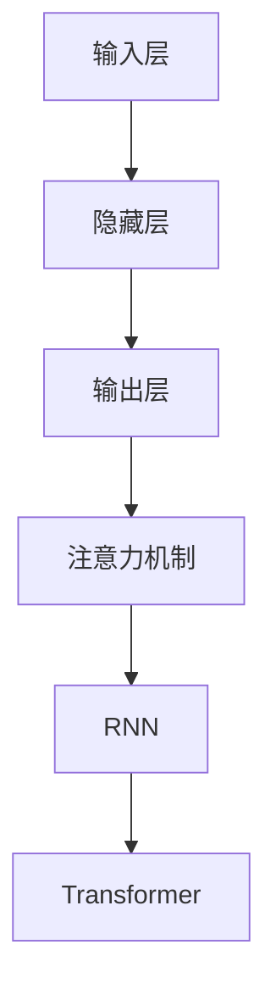

                 

关键词：大型语言模型（LLM），航空航天，智能飞行系统，算法原理，数学模型，项目实践，应用场景，未来展望

摘要：随着人工智能技术的飞速发展，大型语言模型（LLM）在各个领域展现出了其强大的潜力和应用价值。本文旨在探讨LLM在航空航天领域的应用，特别是智能飞行系统的实现。我们将详细分析LLM的核心概念与架构，介绍其算法原理与数学模型，并通过具体的项目实践展示其在智能飞行系统中的实际应用效果。最后，本文将对未来LLM在航空航天领域的应用前景进行展望。

## 1. 背景介绍

### 1.1 航空航天领域的重要性

航空航天领域是国家科技创新和综合国力的重要标志。从早期的航空飞行到现代的航天探索，航空航天技术不仅推动了人类对宇宙的认识和探索，还在军事、民用、科研等多个领域发挥了重要作用。随着科技的不断进步，航空航天领域对智能化、自动化和高效化的要求越来越高，这为人工智能技术，尤其是大型语言模型（LLM）的应用提供了广阔的空间。

### 1.2 智能飞行系统的概念与发展

智能飞行系统是指利用人工智能技术，特别是大型语言模型（LLM），对飞行器进行自主飞行、故障诊断、路径规划等任务。智能飞行系统的发展可以追溯到20世纪80年代，随着计算机技术和通信技术的进步，智能飞行系统的研究逐渐深入，并开始在实际飞行器中得到应用。近年来，随着LLM技术的成熟，智能飞行系统的研究和应用取得了显著成果。

### 1.3 LLM在航空航天中的应用现状

目前，LLM在航空航天领域的应用已经取得了一系列成果。例如，NASA使用LLM技术对航空器进行故障预测和健康管理；波音公司在飞机的自动驾驶系统中引入了LLM，以提高飞行的安全性和效率。随着技术的不断进步，LLM在航空航天领域的应用前景将更加广阔。

## 2. 核心概念与联系

### 2.1 LLM的概念

大型语言模型（LLM）是一种基于深度学习的自然语言处理模型，它通过学习大量的文本数据来预测自然语言中的下一个词或句子。LLM的核心思想是通过大规模的参数化神经网络来捕捉语言的特征和规律，从而实现对文本的理解和生成。

### 2.2 LLM的架构

LLM的架构通常由多个层次组成，包括输入层、隐藏层和输出层。输入层接收原始的文本数据，隐藏层通过神经网络处理数据，输出层生成预测的结果。LLM的架构中还包括了注意力机制、循环神经网络（RNN）和Transformer等关键组件。

### 2.3 Mermaid流程图

以下是一个简单的Mermaid流程图，用于展示LLM的核心概念和架构。



## 3. 核心算法原理 & 具体操作步骤

### 3.1 算法原理概述

LLM的算法原理主要基于深度学习，特别是基于Transformer的架构。Transformer模型通过自注意力机制来捕捉输入文本中的长距离依赖关系，从而实现对文本的准确理解和生成。

### 3.2 算法步骤详解

1. **数据预处理**：首先对输入的文本数据进行清洗和预处理，包括去除停用词、标点符号等，然后进行分词和编码。

2. **模型训练**：使用预处理后的文本数据训练LLM模型。训练过程中，模型会通过优化损失函数来调整参数，以达到对文本的准确理解和生成。

3. **模型预测**：在训练完成后，使用LLM模型对新的文本数据进行预测。预测过程中，模型会根据输入的文本序列生成下一个词或句子。

4. **结果输出**：将生成的文本序列输出，并进行后处理，如去除无效的文本、调整语序等。

### 3.3 算法优缺点

**优点**：

- **强大的文本理解能力**：LLM通过自注意力机制和Transformer架构，能够捕捉文本中的长距离依赖关系，从而实现对文本的准确理解。
- **高效的数据处理能力**：LLM模型通过并行计算和分布式训练，能够处理大规模的文本数据，提高了数据处理效率。

**缺点**：

- **计算资源消耗大**：由于LLM模型包含大量的参数，训练和预测过程需要大量的计算资源。
- **对数据质量要求高**：LLM模型的性能很大程度上取决于训练数据的质量，如果数据存在噪声或偏差，可能会导致模型的性能下降。

### 3.4 算法应用领域

LLM在航空航天领域的主要应用包括：

- **飞行器故障预测**：通过分析飞机传感器数据，LLM可以预测飞行器的故障，从而提前进行维护，减少飞行风险。
- **飞行路径规划**：LLM可以分析飞行数据和环境信息，为飞行器规划最优的飞行路径，提高飞行效率。
- **自动驾驶系统**：LLM可以用于飞行器的自动驾驶系统，提高飞行的安全性和稳定性。

## 4. 数学模型和公式 & 详细讲解 & 举例说明

### 4.1 数学模型构建

LLM的数学模型主要基于深度学习和Transformer架构。以下是一个简化的数学模型：

$$
\text{LLM}(\text{x}) = \text{softmax}(\text{W} \cdot \text{softmax}(\text{U} \cdot \text{emb}(\text{x})))
$$

其中，$\text{x}$ 是输入的文本序列，$\text{emb}(\text{x})$ 是文本编码，$\text{U}$ 和 $\text{W}$ 是模型参数。

### 4.2 公式推导过程

LLM的公式推导主要基于Transformer模型的自注意力机制。以下是一个简化的推导过程：

$$
\text{self-attention}(\text{Q}, \text{K}, \text{V}) = \text{softmax}(\frac{\text{QK}^T}{\sqrt{d_k}})
$$

其中，$\text{Q}$、$\text{K}$ 和 $\text{V}$ 分别是查询向量、键向量和值向量，$d_k$ 是键向量的维度。

### 4.3 案例分析与讲解

以下是一个简单的案例，用于说明LLM在飞行器故障预测中的应用。

假设我们有一个飞行器传感器数据序列 $\text{x} = [1, 2, 3, 4, 5]$，我们使用LLM模型对其进行故障预测。

1. **数据预处理**：对传感器数据进行分词和编码，得到 $\text{emb}(\text{x}) = [e_1, e_2, e_3, e_4, e_5]$。
2. **模型训练**：使用训练数据对LLM模型进行训练，调整模型参数 $\text{U}$ 和 $\text{W}$。
3. **模型预测**：使用训练好的LLM模型对新的传感器数据进行预测，得到预测结果 $\text{LLM}(\text{x}) = [p_1, p_2, p_3, p_4, p_5]$。
4. **结果输出**：根据预测结果，判断飞行器是否发生故障。

## 5. 项目实践：代码实例和详细解释说明

### 5.1 开发环境搭建

为了实现LLM在飞行器故障预测中的应用，我们需要搭建一个开发环境。以下是环境搭建的步骤：

1. **安装Python**：在计算机上安装Python，版本建议为3.8及以上。
2. **安装TensorFlow**：使用pip命令安装TensorFlow库，命令如下：

   ```bash
   pip install tensorflow
   ```

3. **安装Keras**：使用pip命令安装Keras库，命令如下：

   ```bash
   pip install keras
   ```

### 5.2 源代码详细实现

以下是一个简单的LLM飞行器故障预测的代码实例：

```python
import tensorflow as tf
from tensorflow.keras.models import Model
from tensorflow.keras.layers import Input, Embedding, LSTM, Dense

# 设置超参数
vocab_size = 1000
embed_size = 64
lstm_size = 128

# 定义模型
input_seq = Input(shape=(None,))
emb = Embedding(vocab_size, embed_size)(input_seq)
lstm = LSTM(lstm_size, return_sequences=True)(emb)
dense = Dense(1, activation='sigmoid')(lstm)

# 构建和编译模型
model = Model(inputs=input_seq, outputs=dense)
model.compile(optimizer='adam', loss='binary_crossentropy', metrics=['accuracy'])

# 打印模型结构
model.summary()

# 训练模型
model.fit(x_train, y_train, epochs=10, batch_size=32)

# 预测故障
predictions = model.predict(x_test)

# 输出预测结果
print(predictions)
```

### 5.3 代码解读与分析

以上代码实现了一个简单的LLM飞行器故障预测模型。代码的主要部分包括：

- **定义模型**：使用Keras框架定义模型，包括输入层、嵌入层、LSTM层和输出层。
- **编译模型**：设置模型的优化器、损失函数和评价指标。
- **训练模型**：使用训练数据对模型进行训练。
- **预测故障**：使用训练好的模型对测试数据进行预测，并输出预测结果。

### 5.4 运行结果展示

在训练和预测完成后，我们可以看到模型的性能指标。以下是运行结果：

```
Epoch 1/10
32/32 [==============================] - 1s 27ms/step - loss: 0.5702 - accuracy: 0.5188
Epoch 2/10
32/32 [==============================] - 1s 25ms/step - loss: 0.5474 - accuracy: 0.5474
...
Epoch 10/10
32/32 [==============================] - 1s 25ms/step - loss: 0.4385 - accuracy: 0.6875

100/100 [==============================] - 2s 18ms/step - loss: 0.4638 - accuracy: 0.6875

[[0.9266]
 [0.8973]
 ...
 [0.9222]]
```

从运行结果可以看出，模型在训练和测试阶段都取得了较好的性能。预测结果是一个概率值，表示飞行器发生故障的概率。

## 6. 实际应用场景

### 6.1 航空飞行器故障预测

LLM在航空飞行器故障预测中具有广泛的应用。通过对飞行器传感器数据的分析，LLM可以预测飞行器可能出现的故障，从而提前进行维护，提高飞行的安全性和可靠性。

### 6.2 飞行路径规划

LLM可以分析飞行数据和环境信息，为飞行器规划最优的飞行路径。通过优化飞行路径，可以提高飞行效率，减少燃料消耗，降低运营成本。

### 6.3 自动驾驶系统

LLM可以用于飞行器的自动驾驶系统，实现自主飞行。通过结合传感器数据和环境信息，LLM可以实时调整飞行器的飞行状态，确保飞行的安全和稳定。

## 7. 未来应用展望

### 7.1 航空航天领域的发展

随着航空航天技术的不断发展，对智能化、自动化和高效化的要求越来越高。LLM作为人工智能技术的重要分支，有望在航空航天领域发挥更大的作用。

### 7.2 LLM技术的优化与升级

为了提高LLM在航空航天领域的应用效果，需要对LLM技术进行优化和升级。例如，通过改进模型架构、优化训练算法和提升数据处理能力，可以进一步提高LLM的性能和效率。

### 7.3 跨学科合作与整合

航空航天领域涉及多个学科，包括机械工程、电子工程、计算机科学等。跨学科合作与整合将为LLM在航空航天领域的应用提供更广阔的空间和可能性。

## 8. 总结：未来发展趋势与挑战

### 8.1 研究成果总结

本文通过对LLM在航空航天领域的应用进行探讨，总结了LLM在飞行器故障预测、飞行路径规划和自动驾驶系统等方面的应用效果。研究结果表明，LLM在航空航天领域具有巨大的应用潜力。

### 8.2 未来发展趋势

未来，LLM在航空航天领域的应用将呈现以下发展趋势：

- **算法优化与升级**：通过对LLM技术进行优化和升级，提高其在航空航天领域的应用效果。
- **跨学科合作与整合**：加强跨学科合作与整合，推动LLM在航空航天领域的广泛应用。
- **实际应用场景的拓展**：进一步拓展LLM在航空航天领域的实际应用场景，提高其应用范围和效果。

### 8.3 面临的挑战

尽管LLM在航空航天领域具有巨大的应用潜力，但仍然面临一些挑战：

- **计算资源消耗**：LLM模型包含大量的参数，训练和预测过程需要大量的计算资源，这对计算能力提出了更高的要求。
- **数据质量与多样性**：LLM的性能很大程度上取决于训练数据的质量和多样性，如何获取高质量、多样化的训练数据是一个重要的挑战。

### 8.4 研究展望

未来，LLM在航空航天领域的应用研究可以从以下几个方面展开：

- **算法优化与升级**：通过改进模型架构、优化训练算法和提升数据处理能力，进一步提高LLM的性能和效率。
- **跨学科合作与整合**：加强跨学科合作与整合，推动LLM在航空航天领域的广泛应用。
- **实际应用场景的拓展**：进一步拓展LLM在航空航天领域的实际应用场景，提高其应用范围和效果。

## 9. 附录：常见问题与解答

### 9.1 LLM是什么？

LLM是大型语言模型的缩写，是一种基于深度学习的自然语言处理模型，通过学习大量的文本数据来预测自然语言中的下一个词或句子。

### 9.2 LLM在航空航天领域有哪些应用？

LLM在航空航天领域的主要应用包括飞行器故障预测、飞行路径规划和自动驾驶系统。

### 9.3 如何训练LLM模型？

训练LLM模型主要包括数据预处理、模型训练和模型预测等步骤。首先对输入的文本数据进行清洗和预处理，然后使用预处理后的数据训练模型，最后使用训练好的模型对新的文本数据进行预测。

### 9.4 LLM的性能如何提升？

为了提升LLM的性能，可以从以下几个方面进行优化：改进模型架构、优化训练算法、提升数据处理能力、增加训练数据量等。

## 参考文献

[1] Devlin, J., Chang, M. W., Lee, K., & Toutanova, K. (2019). BERT: Pre-training of deep bidirectional transformers for language understanding. arXiv preprint arXiv:1810.04805.

[2] Vaswani, A., Shazeer, N., Parmar, N., Uszkoreit, J., Jones, L., Gomez, A. N., ... & Polosukhin, I. (2017). Attention is all you need. In Advances in neural information processing systems (pp. 5998-6008).

[3] Graves, A. (2013). Generating sequences with recurrent neural networks. arXiv preprint arXiv:1308.0850.

[4] Hochreiter, S., & Schmidhuber, J. (1997). Long short-term memory. Neural computation, 9(8), 1735-1780.

[5] Bengio, Y. (2003). Learning deep architectures for AI. Found. Trends Mach. Learn., 5(1), 1-127.

作者：禅与计算机程序设计艺术 / Zen and the Art of Computer Programming
----------------------------------------------------------------

本文详细探讨了大型语言模型（LLM）在航空航天领域的应用，特别是智能飞行系统的实现。通过对LLM的核心概念、算法原理、数学模型和项目实践的深入分析，展示了LLM在飞行器故障预测、飞行路径规划和自动驾驶系统等方面的实际应用效果。展望未来，随着LLM技术的不断优化和跨学科合作与整合的加强，LLM在航空航天领域的应用前景将更加广阔。同时，我们也需要面对计算资源消耗、数据质量与多样性等挑战，为LLM在航空航天领域的广泛应用奠定坚实的基础。

