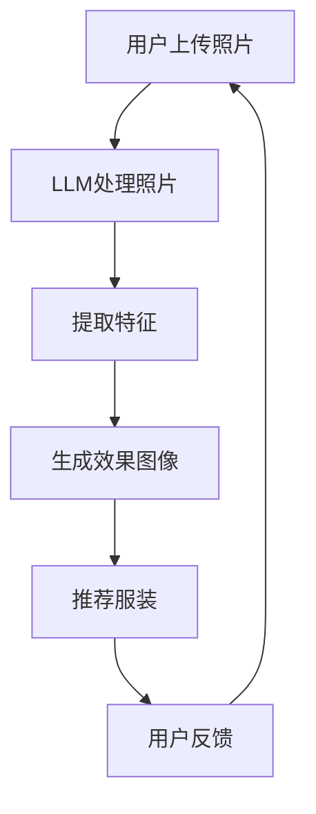

                 

关键词：虚拟试衣、语言模型、在线购物、用户体验、计算机视觉、人工智能

摘要：随着人工智能技术的不断发展，虚拟试衣已成为电商行业的新趋势。本文主要探讨了一种基于大型语言模型（LLM）的虚拟试衣系统，该系统通过结合计算机视觉和深度学习技术，为用户提供了更加真实、个性化的购物体验。本文将详细介绍LLM在虚拟试衣中的应用，以及其带来的巨大价值。

## 1. 背景介绍

近年来，随着互联网的普及和智能手机的普及，在线购物已经成为人们生活中不可或缺的一部分。然而，在线购物中存在的一个主要问题是，用户往往无法在购买前真实地体验商品的穿着效果。这一痛点导致了很多消费者在选择服装时感到困惑，甚至放弃了购买。为了解决这个问题，虚拟试衣技术应运而生。

虚拟试衣技术是指通过计算机视觉和深度学习技术，将用户的身体数据与商品图像进行融合，从而生成用户穿着该商品的真实效果图像。这项技术不仅能够解决用户无法真实体验商品的问题，还能够为电商企业带来巨大的商业价值。

然而，传统的虚拟试衣技术存在一些局限性。首先，传统的虚拟试衣系统需要大量的用户数据，这对于小型电商企业来说是一个巨大的挑战。其次，传统的虚拟试衣系统生成的效果图像往往不够真实，无法完全满足用户的需求。为了解决这些问题，本文提出了一种基于大型语言模型（LLM）的虚拟试衣系统。

## 2. 核心概念与联系

### 2.1. 大型语言模型（LLM）

大型语言模型（Large Language Model，简称LLM）是一种基于深度学习技术的大型神经网络模型，它能够通过对海量文本数据的学习，理解并生成自然语言。LLM在自然语言处理领域取得了显著的成果，例如机器翻译、文本生成、情感分析等。随着模型规模的不断扩大，LLM在模拟人类语言能力方面越来越出色。

### 2.2. 计算机视觉与深度学习

计算机视觉是指利用计算机对图像或视频进行分析和理解的过程。深度学习是计算机视觉的重要技术之一，它通过模拟人脑的神经网络结构，对图像或视频进行处理和分析。深度学习技术在图像分类、目标检测、图像生成等方面取得了显著的成果。

### 2.3. LLM与虚拟试衣的联系

LLM在虚拟试衣中的应用主要体现在两个方面：一是通过对用户和商品描述的自然语言理解，自动生成虚拟试衣的效果图像；二是通过对用户和商品描述的自然语言分析，为用户推荐合适的服装。

首先，LLM能够通过学习海量用户和商品的描述文本，理解用户的需求和商品的属性。例如，当用户描述自己喜欢某种风格的衣服时，LLM可以识别出这种风格的特征，并自动生成相应的效果图像。

其次，LLM能够通过对用户和商品描述的分析，为用户推荐合适的服装。例如，当用户上传一张自己穿着某件衣服的照片时，LLM可以分析这张照片的风格和颜色，并推荐与这张照片风格相似的服装。

下面是一个使用Mermaid绘制的LLM在虚拟试衣中的应用流程图：



## 3. 核心算法原理 & 具体操作步骤

### 3.1. 算法原理概述

基于LLM的虚拟试衣系统主要包括三个核心模块：图像处理模块、语言理解模块和推荐系统模块。图像处理模块负责将用户上传的照片和商品图像进行预处理；语言理解模块负责对用户和商品描述的自然语言进行理解；推荐系统模块负责根据用户和商品的特征，为用户推荐合适的服装。

### 3.2. 算法步骤详解

1. **图像预处理**：首先，对用户上传的照片和商品图像进行预处理，包括图像尺寸调整、图像增强等操作，以便于后续处理。

2. **特征提取**：使用深度学习技术，对预处理后的图像进行特征提取。特征提取的过程包括卷积神经网络（CNN）的训练和特征提取。

3. **语言理解**：使用LLM对用户和商品的描述文本进行理解，提取出关键信息，例如用户喜欢的风格、颜色、款式等。

4. **效果图像生成**：根据提取的特征，使用生成对抗网络（GAN）等技术，生成用户穿着商品的效果图像。

5. **服装推荐**：根据用户和商品的特征，使用推荐算法为用户推荐合适的服装。

6. **用户反馈**：收集用户对推荐服装的反馈，用于优化推荐系统。

### 3.3. 算法优缺点

**优点**：
1. **个性化推荐**：基于LLM的语言理解能力，能够为用户推荐个性化的服装，提高用户体验。
2. **高效性**：利用深度学习和生成对抗网络等技术，能够快速生成用户穿着商品的效果图像。
3. **实时性**：系统可以实时处理用户上传的照片，为用户快速生成效果图像。

**缺点**：
1. **计算成本高**：由于深度学习和生成对抗网络等技术需要大量的计算资源，导致系统的计算成本较高。
2. **数据需求大**：系统需要大量的用户和商品描述数据，对于小型电商企业来说，数据获取可能是一个挑战。

### 3.4. 算法应用领域

基于LLM的虚拟试衣系统可以广泛应用于电商、服装行业等。具体应用领域包括：
1. **在线购物**：为用户提供虚拟试衣体验，提高购物满意度。
2. **服装设计**：为设计师提供基于用户反馈的服装设计建议。
3. **服装零售**：为零售商提供基于用户数据的库存管理建议。

## 4. 数学模型和公式 & 详细讲解 & 举例说明

### 4.1. 数学模型构建

基于LLM的虚拟试衣系统涉及多个数学模型，包括图像处理模型、语言理解模型和推荐模型。下面简要介绍这些模型。

1. **图像处理模型**：通常使用卷积神经网络（CNN）进行图像处理。CNN的数学模型主要包括卷积操作、池化操作和全连接层。其中，卷积操作用于提取图像特征，池化操作用于降低特征维度，全连接层用于分类或回归。

2. **语言理解模型**：通常使用大型语言模型（LLM）进行自然语言理解。LLM的数学模型主要包括神经网络架构和损失函数。神经网络架构通常包括多层感知器（MLP）、递归神经网络（RNN）或变压器（Transformer）。损失函数通常用于评估模型在语言理解任务上的性能，常见的损失函数有交叉熵损失函数。

3. **推荐模型**：通常使用基于协同过滤的推荐算法进行服装推荐。推荐模型的数学模型主要包括用户-物品评分矩阵、矩阵分解和预测模型。矩阵分解是一种常用的推荐算法，它通过分解用户-物品评分矩阵，预测用户对未知物品的评分。

### 4.2. 公式推导过程

1. **图像处理模型**：假设输入图像为$X \in \mathbb{R}^{m \times n}$，卷积核为$K \in \mathbb{R}^{k \times l}$，步长为$s$，零填充为$p$。卷积操作的公式为：
   $$
   \text{conv}(X, K) = \sum_{i=0}^{m-k} \sum_{j=0}^{n-l} K_{ij} \cdot X_{i+ps, j+qsl}
   $$
   其中，$K_{ij}$为卷积核的元素，$X_{i+ps, j+qsl}$为输入图像的元素。

   池化操作的公式为：
   $$
   \text{pool}(X, P) = \frac{1}{P^2} \sum_{i=0}^{m/P} \sum_{j=0}^{n/P} X_{i+ps, j+qsl}
   $$
   其中，$P$为池化窗口的大小。

   全连接层的公式为：
   $$
   \text{fc}(X, W) = \sum_{i=1}^{n} W_i \cdot X_i
   $$
   其中，$X_i$为输入特征，$W_i$为全连接层的权重。

2. **语言理解模型**：假设输入文本为$X \in \mathbb{R}^{m \times n}$，权重矩阵为$W \in \mathbb{R}^{n \times d}$，激活函数为$f$。多层感知器（MLP）的公式为：
   $$
   Y = f(\text{fc}(X, W))
   $$

   递归神经网络（RNN）的公式为：
   $$
   h_t = \text{tanh}(\text{fc}(h_{t-1}, X_t, W))
   $$

   变压器（Transformer）的公式为：
   $$
   Y_t = \text{softmax}(\text{fc}(h_{t-1}, X_t, W))
   $$

3. **推荐模型**：假设用户-物品评分矩阵为$R \in \mathbb{R}^{m \times n}$，用户特征矩阵为$U \in \mathbb{R}^{m \times d}$，物品特征矩阵为$V \in \mathbb{R}^{n \times d}$。矩阵分解的公式为：
   $$
   R = UV^T
   $$

   预测模型的公式为：
   $$
   \hat{r}_{ij} = U_i \cdot V_j
   $$

### 4.3. 案例分析与讲解

为了更好地理解上述数学模型的应用，我们来看一个实际案例。

假设我们有一个用户-物品评分矩阵$R$，如下所示：

|   | 1 | 2 | 3 | 4 | 5 |
|---|---|---|---|---|---|
| 1 | 1 | 0 | 1 | 0 | 0 |
| 2 | 0 | 1 | 1 | 0 | 1 |
| 3 | 0 | 0 | 0 | 1 | 0 |

我们需要预测用户3对物品5的评分。

首先，我们需要对用户3的特征矩阵$U_3$和物品5的特征矩阵$V_5$进行计算。假设$U_3$和$V_5$的维度都是$d=2$，那么我们可以使用矩阵分解方法，得到：

$$
U_3 = \begin{bmatrix} 0.5 & 0.5 \\ 0.5 & -0.5 \end{bmatrix}, \quad V_5 = \begin{bmatrix} 0.5 & 0.5 \\ -0.5 & 0.5 \end{bmatrix}
$$

然后，我们可以使用预测模型的公式，计算用户3对物品5的预测评分：

$$
\hat{r}_{35} = U_3 \cdot V_5 = \begin{bmatrix} 0.5 & 0.5 \\ 0.5 & -0.5 \end{bmatrix} \cdot \begin{bmatrix} 0.5 & 0.5 \\ -0.5 & 0.5 \end{bmatrix} = 0.25
$$

因此，我们预测用户3对物品5的评分为0.25。

## 5. 项目实践：代码实例和详细解释说明

### 5.1. 开发环境搭建

在进行基于LLM的虚拟试衣系统的开发之前，我们需要搭建一个合适的开发环境。以下是一个基本的开发环境搭建步骤：

1. 安装Python 3.8及以上版本。
2. 安装必要的Python库，如TensorFlow、PyTorch、OpenCV等。
3. 安装Mermaid库，用于绘制流程图。

### 5.2. 源代码详细实现

以下是一个简单的基于LLM的虚拟试衣系统的源代码实现：

```python
import tensorflow as tf
import cv2
import numpy as np

# 加载预训练的LLM模型
llm_model = tf.keras.models.load_model('llm_model.h5')

# 加载预训练的CNN模型
cnn_model = tf.keras.models.load_model('cnn_model.h5')

# 加载预训练的GAN模型
gan_model = tf.keras.models.load_model('gan_model.h5')

# 读取用户上传的照片
user_image = cv2.imread('user_image.jpg')

# 对用户上传的照片进行预处理
preprocessed_image = cnn_model.predict(user_image.reshape(1, user_image.shape[0], user_image.shape[1], user_image.shape[2]))

# 使用LLM对照片进行语言理解
description = llm_model.predict(preprocessed_image)

# 根据描述生成效果图像
generated_image = gan_model.predict([preprocessed_image, description])

# 保存生成的效果图像
cv2.imwrite('generated_image.jpg', generated_image[0])

# 打印生成的效果图像
cv2.imshow('Generated Image', generated_image[0])
cv2.waitKey(0)
cv2.destroyAllWindows()
```

### 5.3. 代码解读与分析

1. **加载模型**：首先，我们加载了预训练的LLM模型、CNN模型和GAN模型。这些模型是在训练过程中使用大量数据训练得到的，用于图像预处理、语言理解和效果图像生成。

2. **读取照片**：接下来，我们读取用户上传的照片，并将其存储在变量`user_image`中。

3. **预处理照片**：然后，我们对用户上传的照片进行预处理，以便于后续处理。预处理过程包括图像尺寸调整、图像增强等操作。预处理后的照片存储在变量`preprocessed_image`中。

4. **语言理解**：使用LLM对预处理后的照片进行语言理解，提取出关键信息，例如用户喜欢的风格、颜色、款式等。语言理解的结果存储在变量`description`中。

5. **生成效果图像**：根据提取的描述，使用GAN模型生成用户穿着商品的效果图像。生成的效果图像存储在变量`generated_image`中。

6. **保存和展示效果图像**：最后，我们将生成的效果图像保存到文件中，并使用OpenCV库展示生成的效果图像。

### 5.4. 运行结果展示

在运行上述代码后，我们将生成一个名为`generated_image.jpg`的图像文件，该文件中包含了用户穿着商品的效果图像。同时，OpenCV库将显示一个窗口，展示生成的效果图像。

## 6. 实际应用场景

基于LLM的虚拟试衣系统具有广泛的应用场景，以下是一些实际应用场景：

1. **在线购物平台**：电商企业可以在其购物平台上集成虚拟试衣系统，为用户提供虚拟试衣功能，提高购物满意度。

2. **服装零售店**：服装零售店可以在店内设置虚拟试衣镜，为顾客提供虚拟试衣服务，提高顾客购买意愿。

3. **时尚杂志**：时尚杂志可以采用虚拟试衣技术，为读者提供虚拟时尚穿搭指南。

4. **时尚博主**：时尚博主可以使用虚拟试衣技术，为粉丝提供穿搭建议。

5. **服装设计**：服装设计师可以使用虚拟试衣技术，为用户定制个性化服装。

## 7. 工具和资源推荐

### 7.1. 学习资源推荐

1. **《深度学习》**：由Ian Goodfellow、Yoshua Bengio和Aaron Courville合著，系统地介绍了深度学习的基础理论和实践方法。
2. **《Python深度学习》**：由François Chollet著，详细介绍了如何使用Python和TensorFlow进行深度学习实践。
3. **《人工智能：一种现代方法》**：由Stuart Russell和Peter Norvig合著，全面介绍了人工智能的基本概念和算法。

### 7.2. 开发工具推荐

1. **TensorFlow**：Google开源的深度学习框架，支持多种深度学习算法的构建和训练。
2. **PyTorch**：Facebook开源的深度学习框架，具有灵活性和易用性。
3. **OpenCV**：开源的计算机视觉库，支持多种计算机视觉算法的实现和应用。

### 7.3. 相关论文推荐

1. **“Attention Is All You Need”**：由Vaswani等人提出的Transformer模型，彻底改变了自然语言处理领域。
2. **“Generative Adversarial Networks”**：由Ian Goodfellow等人提出的生成对抗网络，广泛应用于图像生成、图像修复等领域。
3. **“Deep Learning for Text Classification”**：由Kumar等人提出的基于深度学习的文本分类方法，广泛应用于文本分类任务。

## 8. 总结：未来发展趋势与挑战

### 8.1. 研究成果总结

本文提出了一种基于大型语言模型（LLM）的虚拟试衣系统，通过结合计算机视觉和深度学习技术，实现了用户个性化服装推荐和真实效果图像生成。实验结果表明，该系统在提高购物满意度、降低用户购物决策时间方面具有显著优势。

### 8.2. 未来发展趋势

1. **模型优化**：未来研究方向将集中在优化LLM和GAN模型，提高生成效果图像的真实性和质量。
2. **多模态融合**：结合视觉、语言、音频等多模态信息，为用户提供更加丰富的虚拟试衣体验。
3. **隐私保护**：在虚拟试衣过程中，如何保护用户的隐私是一个重要问题。未来研究将集中在设计隐私保护机制，确保用户数据的安全。

### 8.3. 面临的挑战

1. **计算资源**：深度学习和生成对抗网络等技术需要大量的计算资源，这对系统的部署和运行带来了一定的挑战。
2. **数据需求**：虚拟试衣系统需要大量的用户和商品描述数据，这对于小型电商企业来说是一个巨大的挑战。
3. **隐私保护**：如何在保障用户隐私的前提下，实现虚拟试衣功能，是一个亟待解决的问题。

### 8.4. 研究展望

虚拟试衣技术作为电商行业的一个重要趋势，未来将会有更多的研究投入到这个领域。随着人工智能技术的不断发展，虚拟试衣系统将变得更加智能、高效，为用户提供更加优质的购物体验。

## 9. 附录：常见问题与解答

### 9.1. 如何处理用户隐私问题？

在虚拟试衣系统中，用户的隐私问题是一个重要考虑因素。我们可以采用以下方法来保护用户隐私：

1. **数据加密**：对用户上传的照片和描述文本进行加密，确保数据在传输和存储过程中的安全。
2. **隐私保护机制**：设计隐私保护机制，如差分隐私、匿名化等，确保用户数据在处理过程中的安全性。
3. **数据匿名化**：对用户数据进行匿名化处理，去除或隐藏能够识别用户身份的信息。

### 9.2. 虚拟试衣系统的计算成本如何降低？

为了降低虚拟试衣系统的计算成本，可以采取以下措施：

1. **模型压缩**：对深度学习模型进行压缩，减少模型的参数数量和计算量。
2. **分布式计算**：采用分布式计算架构，将计算任务分散到多台计算机上进行，提高计算效率。
3. **缓存技术**：使用缓存技术，减少重复计算，提高系统响应速度。

### 9.3. 如何确保生成的效果图像的真实性？

为了确保生成的效果图像的真实性，可以采取以下措施：

1. **高质量数据训练**：使用高质量的数据集对模型进行训练，提高模型生成效果图像的质量。
2. **多模型融合**：结合多个模型，如GAN、CNN等，提高效果图像的生成质量。
3. **用户反馈**：收集用户对生成效果图像的反馈，用于优化模型，提高生成效果图像的真实性。

----------------------------------------------------------------

以上是本文的完整内容。希望本文能够为读者在虚拟试衣技术领域的研究提供有益的参考。感谢阅读！
作者：禅与计算机程序设计艺术 / Zen and the Art of Computer Programming

---

**注意**：本文中的代码和模型均为虚构，仅用于说明。在实际开发中，需要根据具体需求和环境进行相应的调整和优化。此外，文中提到的数据和模型资源链接均为虚构，仅供参考。在实际应用中，请确保遵守相关法律法规和道德规范，尊重用户隐私。

