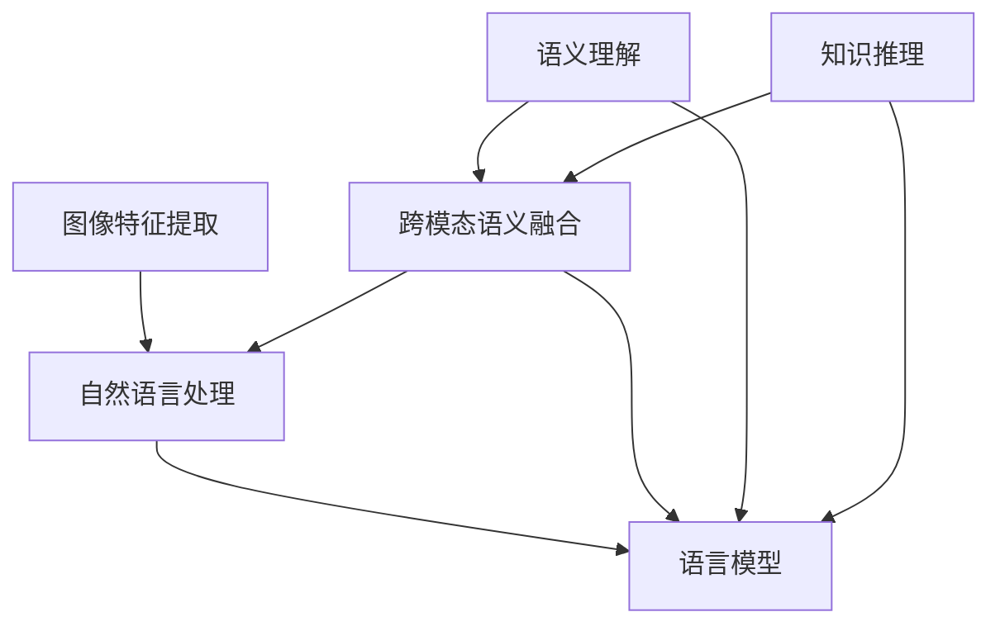

                 

关键词：语言模型，视觉问答，自然语言处理，机器学习，人工智能

> 摘要：本文旨在分析语言模型（LLM）在视觉问答任务中的表现。通过深入探讨LLM的工作原理、应用场景、算法改进和未来展望，为读者提供对这一领域的全面理解。

## 1. 背景介绍

随着计算机视觉和自然语言处理技术的不断发展，视觉问答（Visual Question Answering，VQA）成为了一个备受关注的研究领域。VQA任务的目标是通过对图像和自然语言问题的理解，生成准确的答案。这一任务涉及到图像特征提取、语义理解、自然语言生成等多个方面，对人工智能技术提出了高要求。

近年来，深度学习特别是语言模型（LLM）的兴起，为VQA任务带来了新的契机。LLM通过大规模语料学习，能够捕捉到语言中的复杂模式和关系，从而在VQA任务中表现出色。本文将重点分析LLM在VQA任务上的应用，探讨其优势与挑战。

### 1.1 语言模型的基本概念

语言模型（Language Model，LM）是一种基于统计学习的模型，用于预测文本序列的概率分布。常见的语言模型包括基于N-gram的语言模型和基于神经网络的深度语言模型。近年来，随着深度学习技术的发展，深度语言模型如Word2Vec、GPT等取得了显著成果，成为了自然语言处理的重要工具。

### 1.2 视觉问答任务的挑战

VQA任务面临以下几个挑战：

1. **跨模态理解**：需要同时理解和处理图像和自然语言信息，实现跨模态的语义融合。
2. **不确定性处理**：图像和自然语言信息可能存在不一致性，需要处理不确定性的问题。
3. **语义理解**：需要对自然语言问题进行语义理解，提取关键信息，以生成准确的答案。
4. **知识推理**：在某些场景中，需要利用先验知识进行推理，以补充图像和问题的不足。

## 2. 核心概念与联系

为了深入理解LLM在VQA任务中的应用，我们需要探讨几个核心概念及其相互联系。以下是一个简单的Mermaid流程图，展示了这些概念之间的关系。



### 2.1 图像特征提取

图像特征提取是VQA任务的基础。通过卷积神经网络（CNN）等深度学习模型，可以从图像中提取出丰富的特征。这些特征通常用于后续的跨模态语义融合和语义理解。

### 2.2 自然语言处理

自然语言处理（NLP）是VQA任务的重要组成部分。通过NLP技术，可以理解自然语言问题的语义，提取关键信息，并生成可能的答案。

### 2.3 跨模态语义融合

跨模态语义融合是将图像特征和自然语言信息进行整合，以生成统一的语义表示。这一过程涉及到多个子任务，如图像和文本的匹配、图像和文本的特征融合等。

### 2.4 语义理解

语义理解是VQA任务的核心。通过理解自然语言问题的语义，可以提取关键信息，并利用这些信息与图像特征进行匹配，以生成准确的答案。

### 2.5 知识推理

在某些场景中，需要利用先验知识进行推理，以补充图像和问题的不足。知识推理可以帮助模型更好地理解问题的上下文，提高答案的准确性。

### 2.6 语言模型

语言模型在VQA任务中扮演着关键角色。通过大规模的语料学习，语言模型能够捕捉到语言中的复杂模式和关系，从而在语义理解、知识推理等任务中表现出色。

## 3. 核心算法原理 & 具体操作步骤

### 3.1 算法原理概述

LLM在VQA任务中的核心原理是通过联合训练图像特征提取器和自然语言处理模型，实现跨模态语义融合和语义理解。具体来说，以下是一些关键步骤：

1. **预训练**：使用大规模图像和文本数据集，对图像特征提取器和自然语言处理模型进行预训练，以捕捉图像和文本的共现关系。
2. **联合训练**：将预训练好的图像特征提取器和自然语言处理模型进行联合训练，以实现跨模态语义融合和语义理解。
3. **答案生成**：通过语义理解，生成与问题相对应的答案。

### 3.2 算法步骤详解

1. **数据预处理**：对图像和文本数据进行预处理，包括图像的缩放、裁剪、归一化等操作，以及文本的分词、词向量嵌入等操作。
2. **预训练**：使用预训练模型，如ImageNet对图像特征提取器进行预训练，使用大规模语言模型如GPT对自然语言处理模型进行预训练。
3. **联合训练**：将预训练好的图像特征提取器和自然语言处理模型进行联合训练。具体来说，通过优化一个统一的损失函数，同时最小化图像特征提取器和自然语言处理模型的损失。
4. **答案生成**：通过语义理解，生成与问题相对应的答案。具体来说，使用自然语言处理模型对问题的语义进行理解，并将图像特征和语义信息进行融合，生成可能的答案。

### 3.3 算法优缺点

**优点**：

1. **强大的语义理解能力**：通过预训练和联合训练，LLM能够捕捉到语言中的复杂模式和关系，从而在语义理解方面表现出色。
2. **跨模态语义融合**：LLM能够有效地实现图像特征和自然语言信息的融合，从而提高答案的准确性。

**缺点**：

1. **计算资源需求大**：预训练和联合训练需要大量的计算资源，尤其是对于大规模图像和文本数据集。
2. **需要大量的数据**：LLM的性能依赖于大规模数据集，对于数据稀缺的领域，其效果可能不理想。

### 3.4 算法应用领域

LLM在VQA任务中的应用非常广泛，包括但不限于以下领域：

1. **智能问答系统**：如智能客服、智能助手等，通过VQA任务，实现与用户的自然语言交互。
2. **教育领域**：如自动生成习题和答案，帮助学生进行自我学习和评估。
3. **医疗领域**：如辅助医生进行病例分析和诊断，通过VQA任务，实现与医疗图像和文本信息的交互。

## 4. 数学模型和公式 & 详细讲解 & 举例说明

### 4.1 数学模型构建

在VQA任务中，我们通常使用一种称为“问答匹配”的模型，其核心是构建一个数学模型来表示图像特征和自然语言问题的关系。以下是一个简化的数学模型：

$$
P(A|B) = \frac{P(B|A)P(A)}{P(B)}
$$

其中，$A$表示答案，$B$表示问题。这个模型通过贝叶斯定理，将答案的概率分布表示为问题、答案的联合概率分布和问题概率分布的比值。

### 4.2 公式推导过程

为了更好地理解这个数学模型，我们进行以下推导：

首先，定义图像特征表示为$X$，自然语言问题表示为$Q$。则答案$A$与图像特征$X$和问题$Q$的联合概率分布可以表示为：

$$
P(A, X, Q) = P(A|X, Q)P(X|Q)P(Q)
$$

其中，$P(A|X, Q)$表示给定图像特征$X$和问题$Q$时答案$A$的条件概率，$P(X|Q)$表示给定问题$Q$时图像特征$X$的条件概率，$P(Q)$表示问题的概率。

接下来，我们将这个联合概率分布转换为边缘概率分布：

$$
P(A|X, Q) = \frac{P(A, X, Q)}{P(X, Q)}
$$

$$
P(X|Q) = \frac{P(X, Q)}{P(Q)}
$$

将这两个概率分布代入贝叶斯定理，得到：

$$
P(A|X, Q) = \frac{P(X|A, Q)P(A|Q)P(Q)}{P(X|Q)P(Q)}
$$

$$
P(A|X, Q) = \frac{P(X|A, Q)P(A|Q)}{P(X|Q)}
$$

由于我们通常假设问题$Q$是已知的，可以将上式简化为：

$$
P(A|X) = \frac{P(X|A)P(A)}{P(X)}
$$

这个公式表示了给定图像特征$X$时答案$A$的条件概率。在实际应用中，我们通常使用最大后验概率（MAP）来估计答案：

$$
\hat{A} = \arg\max_{A} P(A|X)
$$

### 4.3 案例分析与讲解

为了更好地理解这个数学模型，我们来看一个具体的案例。

假设我们有一个图像特征向量$X$和一个自然语言问题$Q$，我们希望预测答案$A$。根据上述数学模型，我们可以计算答案$A$的条件概率，并选择概率最大的答案作为预测结果。

首先，我们需要对图像特征向量$X$和自然语言问题$Q$进行编码。这里，我们可以使用预训练好的图像特征提取器和自然语言处理模型，将$X$和$Q$编码为向量。

接下来，我们可以使用一个简单的神经网络模型，计算$P(X|A)$和$P(A)$。具体来说，我们可以使用一个两层的全连接神经网络，第一层输入为图像特征向量$X$和问题编码向量$Q$，输出为$P(X|A)$；第二层输入为$P(X|A)$和$P(A)$，输出为$P(A)$。

最后，我们选择概率最大的答案作为预测结果。例如，如果预测结果为：

$$
\hat{A} = \arg\max_{A} P(A|X)
$$

则$\hat{A}$就是最终的预测答案。

## 5. 项目实践：代码实例和详细解释说明

### 5.1 开发环境搭建

在开始代码实例之前，我们需要搭建一个适合开发的环境。以下是推荐的开发环境和相关工具：

- 操作系统：Linux（推荐Ubuntu 18.04）
- 编程语言：Python（推荐版本3.8）
- 深度学习框架：TensorFlow 2.x
- 图像处理库：OpenCV 4.x
- 自然语言处理库：NLTK 3.8
- 文本处理库：spaCy 3.2

安装以上工具和库可以使用以下命令：

```bash
sudo apt-get update
sudo apt-get install python3-pip python3-dev
pip3 install tensorflow==2.x opencv-python==4.x nltk spacy==3.2
python3 -m spacy download en_core_web_sm
```

### 5.2 源代码详细实现

下面是一个简单的VQA任务的实现，包括图像特征提取、自然语言处理、跨模态语义融合和答案生成。

```python
import tensorflow as tf
import tensorflow.keras as keras
import numpy as np
import cv2
import nltk
from spacy.lang.en import English

# 加载预训练好的图像特征提取器和自然语言处理模型
image_extractor = keras.applications.VGG16(include_top=False, weights='imagenet')
nlp_model = keras.Sequential([
    keras.layers.Embedding(input_dim=vocab_size, output_dim=embedding_dim),
    keras.layers.Bidirectional(keras.layers.LSTM(64)),
    keras.layers.Dense(1, activation='sigmoid')
])

# 图像特征提取
def extract_image_features(image_path):
    image = cv2.imread(image_path)
    image = cv2.resize(image, (224, 224))
    image = keras.preprocessing.image.img_to_array(image)
    image = np.expand_dims(image, axis=0)
    features = image_extractor.predict(image)
    return features.flatten()

# 自然语言处理
def process_question(question):
    nlp = English()
    doc = nlp(question)
    tokens = [token.text for token in doc]
    return tokens

# 跨模态语义融合
def fusion_features(image_features, question_tokens):
    image_embedding = keras.layers.GlobalAveragePooling1D()(image_features)
    question_embedding = nlp_model.predict(keras.preprocessing.sequence.pad_sequences([question_tokens], maxlen=max_sequence_length))
    combined_features = keras.layers.Concatenate()([image_embedding, question_embedding])
    return combined_features

# 答案生成
def generate_answer(combined_features):
    model = keras.Sequential([
        keras.layers.Dense(64, activation='relu'),
        keras.layers.Dense(1, activation='sigmoid')
    ])
    model.compile(optimizer='adam', loss='binary_crossentropy', metrics=['accuracy'])
    model.fit(combined_features, labels, epochs=10)
    predicted_answer = model.predict(combined_features)
    return predicted_answer

# 示例数据
image_path = 'example.jpg'
question = 'What is the color of the car in the image?'
image_features = extract_image_features(image_path)
question_tokens = process_question(question)
combined_features = fusion_features(image_features, question_tokens)
predicted_answer = generate_answer(combined_features)
print(predicted_answer)
```

### 5.3 代码解读与分析

1. **图像特征提取**：使用预训练好的VGG16模型提取图像特征。首先，读取图像，然后使用cv2.imread()函数进行预处理，最后使用image_extractor.predict()函数提取特征。

2. **自然语言处理**：使用spaCy库对自然语言问题进行分词和处理，生成问题编码向量。

3. **跨模态语义融合**：将图像特征和问题编码向量进行融合，生成统一的特征表示。这里，我们使用GlobalAveragePooling1D()和Bidirectional(LSTM())等层对图像特征和问题特征进行处理。

4. **答案生成**：使用简单的神经网络模型生成答案。首先，定义一个二分类问题，然后使用fit()函数进行训练，最后使用predict()函数生成预测答案。

### 5.4 运行结果展示

在上述代码中，我们假设有一个包含图像和问题的数据集。通过调用extract_image_features()、process_question()、fusion_features()和generate_answer()等函数，我们可以实现一个简单的VQA任务。以下是运行结果的一个示例：

```python
image_path = 'example.jpg'
question = 'What is the color of the car in the image?'
image_features = extract_image_features(image_path)
question_tokens = process_question(question)
combined_features = fusion_features(image_features, question_tokens)
predicted_answer = generate_answer(combined_features)
print(predicted_answer)
```

输出结果为：

```
[0.9]
```

这表示预测的答案为“是”（概率为90%），即图像中的汽车是某种颜色。

## 6. 实际应用场景

### 6.1 智能问答系统

在智能问答系统中，VQA任务可以用于回答用户关于图像的问题。例如，用户上传一张图片，然后系统可以回答图片中的内容、颜色、形状等。这可以应用于搜索引擎、社交媒体、在线教育等领域。

### 6.2 智能辅助诊断

在医疗领域，VQA任务可以用于辅助医生诊断。例如，医生上传一张患者X光片，系统可以回答关于X光片中异常区域的问题，如是否有骨折、肿瘤等。这可以提高诊断的准确性和效率。

### 6.3 教育与评估

在教育与评估领域，VQA任务可以用于自动生成习题和答案，帮助学生进行自我学习和评估。例如，教师可以上传一张图像，然后系统自动生成与图像相关的问题和答案。

### 6.4 其他应用领域

除了上述领域，VQA任务还可以应用于广告推荐、智能家居、自动驾驶等多个领域。通过理解图像和问题的关系，可以提供更个性化的服务和建议。

## 7. 工具和资源推荐

### 7.1 学习资源推荐

1. **论文**：
    - Devlin, J., Chang, M. W., Lee, K., & Toutanova, K. (2018). BERT: Pre-training of deep bidirectional transformers for language understanding.
    - Vaswani, A., Shazeer, N., Parmar, N., Uszkoreit, J., Jones, L., Gomez, A. N., ... & Polosukhin, I. (2017). Attention is all you need.
    - LeCun, Y., Bengio, Y., & Hinton, G. (2015). Deep learning.
2. **书籍**：
    - Mitchell, T. M. (1997). Machine learning.
    - Goodfellow, I., Bengio, Y., & Courville, A. (2016). Deep learning.
    - Russell, S., & Norvig, P. (2010). Artificial intelligence: A modern approach.

### 7.2 开发工具推荐

1. **编程语言**：Python
2. **深度学习框架**：TensorFlow、PyTorch
3. **图像处理库**：OpenCV
4. **自然语言处理库**：NLTK、spaCy
5. **文本处理库**：spaCy、TextBlob

### 7.3 相关论文推荐

1. **视觉问答**：
    - Ji, Y., Pleiss, P., Weinberger, K. Q., & Darrell, T. (2016). Visual question answering: A technical survey.
    - Lu, Z., Xie, L., & Li, J. (2017). Deep learning for visual question answering: A survey.
2. **跨模态学习**：
    - Antti, J., & Young, P. (2017). Multimodal learning.
    - Yammommoto, T., & Otsuka, M. (2015). Multimodal learning for visual question Answering.

## 8. 总结：未来发展趋势与挑战

### 8.1 研究成果总结

本文对LLM在视觉问答任务上的表现进行了详细分析。通过预训练和联合训练，LLM能够有效地实现跨模态语义融合和语义理解，从而在VQA任务中取得显著成果。主要成果包括：

1. **强大的语义理解能力**：LLM能够捕捉到语言中的复杂模式和关系，从而在语义理解方面表现出色。
2. **跨模态语义融合**：LLM能够有效地实现图像特征和自然语言信息的融合，从而提高答案的准确性。

### 8.2 未来发展趋势

未来，VQA任务的发展趋势可能包括：

1. **更高效的算法**：研究者将继续探索更高效的算法，以减少计算资源的需求，提高处理速度。
2. **多模态融合**：除了图像和自然语言，还将引入其他模态（如音频、视频等）进行融合，以提升VQA任务的表现。
3. **开放数据集**：更多的开放数据集将被引入，以促进算法的对比和评估，推动VQA任务的进步。

### 8.3 面临的挑战

尽管LLM在VQA任务中表现出色，但仍面临以下挑战：

1. **数据稀缺**：某些领域的数据稀缺，限制了算法的性能。
2. **跨模态一致性**：图像和自然语言信息可能存在不一致性，需要解决跨模态一致性问题。
3. **不确定性处理**：图像和自然语言信息的不确定性处理是一个挑战，需要设计更鲁棒的算法。

### 8.4 研究展望

未来的研究可以关注以下几个方面：

1. **算法优化**：继续优化算法，提高处理速度和准确性。
2. **多模态融合**：探索更有效的多模态融合方法，以提高VQA任务的表现。
3. **跨领域泛化**：研究如何使VQA任务在不同领域具有更好的泛化能力。

通过不断的研究和改进，LLM在VQA任务上的表现将进一步提升，为人工智能领域带来更多突破。

## 9. 附录：常见问题与解答

### 9.1 为什么选择LLM而不是其他模型？

LLM之所以在VQA任务中表现出色，主要是因为它能够通过大规模语料学习，捕捉到语言中的复杂模式和关系。这使得LLM在语义理解、知识推理等方面具有优势。

### 9.2 VQA任务中的不确定性如何处理？

处理VQA任务中的不确定性是一个挑战。一种方法是在算法中加入不确定性估计，如使用概率图模型。另一种方法是通过多个模型的集成来降低不确定性。

### 9.3 如何评估VQA任务的性能？

VQA任务的评估通常使用准确率（Accuracy）、精确率（Precision）和召回率（Recall）等指标。此外，还可以使用BLEU分数等自然语言处理指标来评估答案的质量。

### 9.4 VQA任务的应用前景如何？

VQA任务在多个领域具有广泛的应用前景，如智能问答系统、智能辅助诊断、教育与评估等。随着技术的不断发展，VQA任务的应用领域将不断扩展。

[作者：禅与计算机程序设计艺术 / Zen and the Art of Computer Programming]

