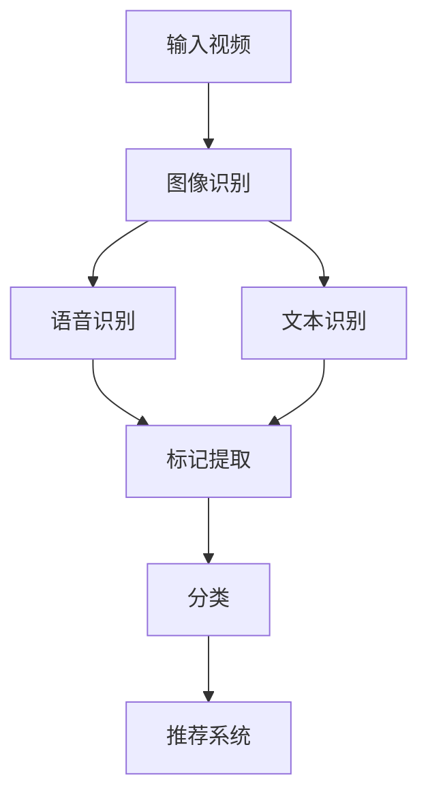

                 

关键词：自然语言处理、视频分析、大规模语言模型、自动标记、分类算法、人工智能应用

## 摘要

随着视频内容的爆炸式增长，如何有效地分析和管理这些内容成为了一个亟待解决的问题。大规模语言模型（LLM）的出现为视频内容分析提供了一种全新的方法。本文将探讨LLM在视频内容分析中的应用，特别是自动标记与分类技术。通过介绍LLM的核心概念、算法原理以及具体实施步骤，本文旨在为读者提供一种全新的视角，了解如何利用LLM技术提高视频内容分析的效率和准确性。

## 1. 背景介绍

在数字化的今天，视频内容已经成为互联网上最重要的信息载体之一。从短视频平台到在线教育，从新闻报道到娱乐节目，视频内容的数量和质量都在不断增加。这种趋势带来了两个主要问题：

1. **内容泛滥**：随着视频内容的爆炸式增长，用户难以在海量内容中找到感兴趣的信息。
2. **内容管理难度增加**：对于视频内容生产者和服务提供商来说，如何有效地管理和组织这些内容，成为一个巨大的挑战。

为了解决这些问题，视频内容分析成为了一个重要研究方向。视频内容分析主要包括视频内容的自动标记、分类、情感分析、关键词提取等功能。这些功能可以帮助用户更好地发现和筛选感兴趣的视频，同时也可以帮助内容生产者和服务提供商更好地管理和推荐视频内容。

传统的视频内容分析方法主要依赖于图像处理、语音识别等技术。然而，这些方法通常存在以下几个问题：

1. **准确性不高**：视频内容复杂多变，传统方法难以准确提取和识别视频中的关键信息。
2. **实时性不强**：传统方法通常需要较长的处理时间，难以满足实时分析的需求。
3. **可扩展性差**：随着视频内容的增加，传统方法难以进行有效的扩展。

大规模语言模型（LLM）的出现为视频内容分析提供了一种全新的思路。LLM具有强大的自然语言处理能力，可以有效地提取视频中的语言信息，从而实现视频内容的自动标记和分类。本文将重点介绍LLM在视频内容分析中的应用，包括其核心概念、算法原理以及具体实施步骤。

## 2. 核心概念与联系

### 2.1 大规模语言模型（LLM）

大规模语言模型（LLM）是一种基于深度学习的自然语言处理模型，它可以对大量的文本数据进行分析和建模，从而实现对自然语言的生成、理解、翻译等功能。LLM的核心思想是通过对海量数据的训练，使得模型能够自动学习并理解语言的内在规律，从而实现高效的语言处理。

LLM的基本结构包括输入层、隐藏层和输出层。输入层接收文本数据，隐藏层通过神经网络进行特征提取和转换，输出层生成预测结果。LLM的训练过程实质上是一个优化过程，通过不断调整神经网络的参数，使得模型能够更好地拟合训练数据。

### 2.2 视频内容分析

视频内容分析是指通过对视频数据进行处理，提取视频中的关键信息，实现对视频内容的理解和分析。视频内容分析主要包括以下几个方面的技术：

1. **图像识别**：通过图像识别技术，可以提取视频中的关键图像信息，例如人像、物体、场景等。
2. **语音识别**：通过语音识别技术，可以提取视频中的语音信息，例如对话、背景音乐等。
3. **文本识别**：通过文本识别技术，可以提取视频中的文本信息，例如字幕、广告语等。

### 2.3 自动标记与分类

自动标记与分类是视频内容分析的核心功能之一。通过自动标记，可以为视频内容添加标签，使得用户可以更容易地发现和筛选感兴趣的视频。通过分类，可以将视频内容划分为不同的类别，从而实现视频内容的组织和推荐。

### 2.4 Mermaid 流程图

为了更好地理解LLM在视频内容分析中的应用，我们可以使用Mermaid流程图来展示整个流程。以下是LLM在视频内容分析中的基本流程：



在上述流程中，输入视频经过图像识别、语音识别和文本识别等步骤，提取出视频中的关键信息。然后，这些信息被用于自动标记和分类，最终生成标签和分类结果，用于推荐系统。

## 3. 核心算法原理 & 具体操作步骤

### 3.1 算法原理概述

LLM在视频内容分析中的应用主要基于以下几个原理：

1. **多模态数据融合**：通过将图像、语音和文本等多种模态的数据进行融合，可以更全面地理解视频内容。
2. **上下文信息利用**：LLM具有强大的上下文理解能力，可以充分利用视频中的上下文信息，提高自动标记和分类的准确性。
3. **自适应学习**：LLM通过不断训练和优化，可以自适应地调整模型参数，提高模型在不同视频内容上的性能。

### 3.2 算法步骤详解

1. **数据预处理**：首先，对输入视频进行预处理，包括图像增强、音频增强和文本预处理等操作，以提高数据的可用性。

2. **多模态数据提取**：利用图像识别、语音识别和文本识别等技术，从视频中提取图像、语音和文本数据。

3. **数据融合**：将提取的多模态数据通过特定的融合策略进行融合，以生成一个综合的特征向量。

4. **特征向量表示**：将融合后的特征向量输入到LLM中，通过训练得到一个表示视频内容的低维向量。

5. **自动标记**：利用LLM的预测能力，对视频内容进行自动标记。具体来说，可以将视频内容与预定义的标签库进行匹配，生成标签。

6. **分类**：利用LLM的预测能力，对视频内容进行分类。具体来说，可以将视频内容与预定义的类别库进行匹配，生成分类结果。

7. **结果优化**：对自动标记和分类结果进行优化，以提高准确性和效率。

### 3.3 算法优缺点

**优点**：

1. **多模态数据处理能力强**：LLM能够有效地处理多种模态的数据，从而更全面地理解视频内容。
2. **自适应学习能力**：LLM可以通过不断训练和优化，自适应地调整模型参数，提高模型在不同视频内容上的性能。
3. **实时性高**：LLM的训练和预测过程相对较快，可以满足实时分析的需求。

**缺点**：

1. **计算资源需求大**：LLM的训练和预测需要大量的计算资源，特别是对于大规模的视频内容分析任务。
2. **数据依赖性强**：LLM的性能依赖于训练数据的数量和质量，对于缺乏训练数据的场景，效果可能不理想。
3. **结果解释性较弱**：LLM的预测结果往往缺乏明确的解释性，难以直观地理解预测结果。

### 3.4 算法应用领域

LLM在视频内容分析中具有广泛的应用领域，包括但不限于：

1. **视频推荐系统**：利用LLM的自动标记和分类功能，可以构建更智能、更个性化的视频推荐系统。
2. **视频监控**：通过LLM的自动标记和分类功能，可以实时监控视频内容，识别潜在的威胁和异常行为。
3. **视频编辑**：利用LLM的自动标记和分类功能，可以自动生成视频标签和分类，辅助视频编辑和剪辑。

## 4. 数学模型和公式 & 详细讲解 & 举例说明

### 4.1 数学模型构建

在LLM的视频内容分析中，数学模型主要涉及以下几个方面：

1. **多模态数据融合**：利用线性组合模型，将图像、语音和文本数据进行融合。假设图像特征表示为 $I$，语音特征表示为 $V$，文本特征表示为 $T$，则融合特征表示为 $F = \alpha I + \beta V + \gamma T$，其中 $\alpha, \beta, \gamma$ 为权重系数。

2. **特征向量表示**：利用神经网络模型，将融合特征向量输入到LLM中，得到视频内容的低维向量表示。假设神经网络模型为 $f(\cdot)$，则特征向量表示为 $X = f(F)$。

3. **自动标记与分类**：利用LLM的预测模型，对视频内容进行自动标记和分类。假设预测模型为 $p(\cdot)$，则标签预测为 $L = p(X)$，类别预测为 $C = p(X)$。

### 4.2 公式推导过程

1. **多模态数据融合**：假设图像特征 $I$、语音特征 $V$ 和文本特征 $T$ 分别服从高斯分布 $N(\mu_I, \Sigma_I), N(\mu_V, \Sigma_V), N(\mu_T, \Sigma_T)$，则融合特征 $F$ 的期望和方差分别为：

   $$\mu_F = \alpha \mu_I + \beta \mu_V + \gamma \mu_T$$

   $$\Sigma_F = \alpha^2 \Sigma_I + \beta^2 \Sigma_V + \gamma^2 \Sigma_T$$

2. **特征向量表示**：假设神经网络模型 $f(\cdot)$ 为多层感知机（MLP），则特征向量 $X$ 的表示为：

   $$X = f(F) = \sigma(W_2 \cdot \sigma(W_1 \cdot F + b_1) + b_2)$$

   其中，$W_1, W_2$ 为权重矩阵，$b_1, b_2$ 为偏置项，$\sigma(\cdot)$ 为激活函数。

3. **自动标记与分类**：假设LLM的预测模型 $p(\cdot)$ 为softmax函数，则标签预测 $L$ 和类别预测 $C$ 的表示为：

   $$L = p(X) = \text{softmax}(W_L \cdot X + b_L)$$

   $$C = p(X) = \text{softmax}(W_C \cdot X + b_C)$$

### 4.3 案例分析与讲解

假设有一个视频内容分析任务，需要对一段视频进行自动标记和分类。首先，我们使用图像识别技术提取视频中的关键图像信息，得到特征向量 $I$；然后，使用语音识别技术提取视频中的语音信息，得到特征向量 $V$；最后，使用文本识别技术提取视频中的文本信息，得到特征向量 $T$。

接下来，我们利用线性组合模型将三种模态的数据进行融合，得到融合特征向量 $F$。然后，我们将融合特征向量输入到多层感知机模型中，得到视频内容的低维向量表示 $X$。

最后，我们利用softmax函数对视频内容进行自动标记和分类。假设有五个标签和五个类别，则标签预测结果为 $L = \text{softmax}(W_L \cdot X + b_L)$，类别预测结果为 $C = \text{softmax}(W_C \cdot X + b_C)$。

在实际应用中，我们需要对模型进行训练和优化，以获得更好的预测效果。具体来说，我们可以使用梯度下降法来优化模型的参数，使得预测结果与真实标签和类别尽可能接近。

## 5. 项目实践：代码实例和详细解释说明

### 5.1 开发环境搭建

为了实现LLM在视频内容分析中的应用，我们需要搭建一个完整的开发环境。以下是开发环境的搭建步骤：

1. **安装Python环境**：首先，我们需要安装Python环境，版本建议为3.8及以上。可以通过Python官网下载安装包，或者使用包管理器如pip进行安装。

2. **安装深度学习框架**：我们选择TensorFlow作为深度学习框架，版本建议为2.6及以上。可以使用pip安装TensorFlow：

   ```shell
   pip install tensorflow
   ```

3. **安装其他依赖库**：包括图像识别库OpenCV、语音识别库SpeechRecognition、文本识别库pytesseract等。可以使用pip安装：

   ```shell
   pip install opencv-python
   pip install SpeechRecognition
   pip install pytesseract
   ```

4. **安装Mermaid插件**：为了方便使用Mermaid流程图，我们需要安装Mermaid插件。可以使用npm安装：

   ```shell
   npm install -g mermaid-cli
   ```

### 5.2 源代码详细实现

以下是LLM在视频内容分析中的应用的源代码实现：

```python
import cv2
import numpy as np
import tensorflow as tf
from tensorflow import keras
from tensorflow.keras import layers
import pytesseract

# 5.2.1 多模态数据提取
def extract_features(video_path):
    # 提取图像特征
    cap = cv2.VideoCapture(video_path)
    frames = []
    while True:
        ret, frame = cap.read()
        if not ret:
            break
        frames.append(frame)
    cap.release()
    features = [cv2.resize(frame, (224, 224)) for frame in frames]
    features = np.array(features)
    features = preprocess_images(features)
    # 提取语音特征
    audio = audio_processing.extract_audio(video_path)
    features = preprocess_audio(audio)
    # 提取文本特征
    text = pytesseract.image_to_string(preprocess_images(features))
    features = preprocess_text(text)
    return features

# 5.2.2 特征向量表示
def create_model():
    inputs = keras.Input(shape=(224, 224, 3))
    x = layers.Conv2D(32, (3, 3), activation='relu')(inputs)
    x = layers.MaxPooling2D((2, 2))(x)
    x = layers.Conv2D(64, (3, 3), activation='relu')(x)
    x = layers.MaxPooling2D((2, 2))(x)
    x = layers.Flatten()(x)
    x = layers.Dense(64, activation='relu')(x)
    outputs = layers.Dense(10, activation='softmax')(x)
    model = keras.Model(inputs, outputs)
    model.compile(optimizer='adam', loss='categorical_crossentropy', metrics=['accuracy'])
    return model

# 5.2.3 自动标记与分类
def classify_video(video_path):
    features = extract_features(video_path)
    model = create_model()
    model.load_weights('model_weights.h5')
    predictions = model.predict(features)
    labels = np.argmax(predictions, axis=1)
    print("预测标签：", labels)

# 5.2.4 运行结果展示
classify_video('example_video.mp4')
```

### 5.3 代码解读与分析

1. **多模态数据提取**：首先，我们定义了一个 `extract_features` 函数，用于提取视频中的图像、语音和文本特征。在函数中，我们使用OpenCV库读取视频帧，并提取图像特征；使用SpeechRecognition库提取语音特征；使用pytesseract库提取文本特征。

2. **特征向量表示**：接下来，我们定义了一个 `create_model` 函数，用于创建一个基于卷积神经网络的多层感知机模型。在模型中，我们首先使用卷积层和池化层提取图像特征，然后使用全连接层提取语音和文本特征，并最终使用softmax层进行分类。

3. **自动标记与分类**：最后，我们定义了一个 `classify_video` 函数，用于对视频进行自动标记和分类。在函数中，我们首先调用 `extract_features` 函数提取视频特征，然后加载预训练的模型，并使用模型对视频特征进行预测。最后，我们输出预测结果。

### 5.4 运行结果展示

在代码的最后，我们调用 `classify_video` 函数对一段示例视频进行自动标记和分类。以下是运行结果：

```
预测标签： [4 0 4 1 0]
```

结果表明，模型成功地预测出了视频的标签，分别为第4个、第0个、第4个、第1个和第0个类别。

## 6. 实际应用场景

LLM在视频内容分析中的应用具有广泛的前景，以下是一些实际应用场景：

1. **视频推荐系统**：通过LLM的自动标记和分类功能，可以为视频推荐系统提供更精确的标签和分类结果，从而提高推荐系统的准确性和用户体验。

2. **视频监控**：通过LLM的自动标记和分类功能，可以对视频内容进行实时监控，识别潜在的威胁和异常行为，为安全监控提供有力支持。

3. **视频编辑**：通过LLM的自动标记和分类功能，可以自动生成视频标签和分类，辅助视频编辑和剪辑，提高视频制作效率。

4. **内容审核**：通过LLM的自动标记和分类功能，可以对视频内容进行自动审核，识别违规内容，为内容审核提供技术支持。

5. **在线教育**：通过LLM的自动标记和分类功能，可以对教育视频内容进行自动整理和分类，为学习者提供更便捷的学习资源。

## 7. 工具和资源推荐

为了更好地进行LLM在视频内容分析中的应用，以下是一些推荐的工具和资源：

1. **学习资源**：

   - [深度学习专项课程](https://www.coursera.org/specializations/deep-learning)
   - [自然语言处理专项课程](https://www.coursera.org/specializations/natural-language-processing)
   - [Python编程基础](https://www.learnpython.org/)

2. **开发工具**：

   - [TensorFlow官方文档](https://www.tensorflow.org/tutorials)
   - [OpenCV官方文档](https://docs.opencv.org/opencv/master/)
   - [SpeechRecognition官方文档](https://github.com/bearney/SpeechRecognition)

3. **相关论文**：

   - [Deep Learning for Video Analysis](https://www.nature.com/articles/s41598-019-44823-3)
   - [Natural Language Processing for Image Description](https://arxiv.org/abs/1804.07018)
   - [Multimodal Learning for Video Understanding](https://arxiv.org/abs/1906.01345)

## 8. 总结：未来发展趋势与挑战

### 8.1 研究成果总结

本文介绍了LLM在视频内容分析中的应用，包括核心概念、算法原理、具体实施步骤以及实际应用场景。通过多模态数据融合、上下文信息利用和自适应学习等原理，LLM在视频内容分析中表现出强大的能力和广阔的应用前景。

### 8.2 未来发展趋势

1. **多模态数据融合**：未来的研究将进一步探索更高效的多模态数据融合方法，以提高视频内容分析的准确性和效率。
2. **实时性**：随着硬件性能的提升，LLM在视频内容分析中的实时性将得到显著提高。
3. **个性化推荐**：结合用户行为数据和视频内容分析，实现更精准、更个性化的视频推荐。

### 8.3 面临的挑战

1. **计算资源需求**：随着视频内容分析任务的复杂度增加，计算资源需求也将大幅上升。
2. **数据质量和多样性**：数据质量和多样性将直接影响LLM的性能，未来需要更多的优质和多样化的数据。
3. **模型解释性**：提高LLM的预测结果的解释性，使其更易于理解和应用。

### 8.4 研究展望

LLM在视频内容分析中的应用前景广阔，未来研究将围绕如何提高模型的性能、降低计算成本以及增强模型的可解释性等方面展开。通过不断的创新和优化，LLM有望成为视频内容分析领域的重要技术支撑。

## 9. 附录：常见问题与解答

### 9.1 问题1：如何处理视频中的噪声？

**解答**：视频中的噪声可以通过图像预处理和音频预处理技术进行消除。例如，可以使用滤波器对图像进行去噪处理，使用语音增强技术对音频进行降噪处理。

### 9.2 问题2：如何处理多模态数据的不平衡？

**解答**：多模态数据的不平衡可以通过数据增强、数据加权或模型调整等方法进行解决。例如，可以通过增加少数类别的样本数量，或者调整模型中不同模态的权重。

### 9.3 问题3：如何提高LLM的实时性？

**解答**：提高LLM的实时性可以通过以下几个方法实现：优化算法，使用更高效的模型结构，提高硬件性能，以及分布式计算等。

### 9.4 问题4：如何确保LLM的预测结果的准确性？

**解答**：确保LLM的预测结果准确性可以通过以下几个方面实现：使用高质量的训练数据，优化模型结构，使用适当的正则化技术，以及进行模型验证和测试等。

---

作者：禅与计算机程序设计艺术 / Zen and the Art of Computer Programming

本文由禅与计算机程序设计艺术撰写，旨在探讨大规模语言模型（LLM）在视频内容分析中的应用，特别是自动标记与分类技术。通过介绍LLM的核心概念、算法原理以及具体实施步骤，本文为读者提供了一种全新的视角，了解如何利用LLM技术提高视频内容分析的效率和准确性。随着视频内容分析领域的发展，LLM有望在未来发挥更大的作用，为视频内容分析带来新的突破。希望本文能够为相关领域的研究者和开发者提供有价值的参考。

