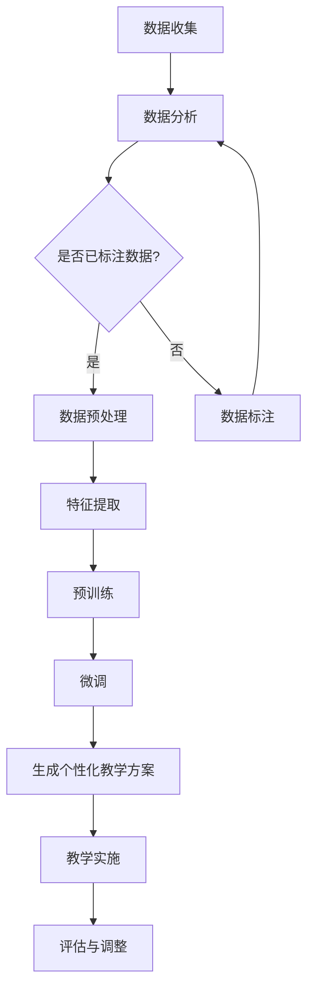

                 

关键词：语言学习、个性化教学、大语言模型、自然语言处理、外语教学

> 摘要：本文探讨了大型语言模型（LLM）在外语教学中的应用，分析了个性化外语教学的现状与挑战，并提出了基于LLM的个性化外语教学解决方案。文章首先回顾了LLM的发展历程与核心原理，然后详细阐述了LLM在外语教学中的具体应用，最后讨论了其未来发展趋势与面临的挑战。

## 1. 背景介绍

语言学习是人类认知活动中至关重要的一环。随着全球化进程的加速，外语学习的重要性日益凸显。传统的语言教学方法主要依赖于教师与学生之间的互动，这种模式在资源充足、教学环境稳定的情况下能够取得较好的教学效果。然而，随着学生数量的增加和教学资源的有限性，传统的教学模式逐渐暴露出其不足之处：

1. **个性化不足**：传统外语教学往往采用“一刀切”的方法，难以满足不同学生的个性化学习需求。
2. **互动受限**：教师面对大量学生时，互动和反馈的时间和质量受到限制。
3. **资源浪费**：教材和教学资源的重复使用导致资源浪费。

为了解决这些问题，个性化外语教学应运而生。个性化外语教学旨在根据学生的个人特点、学习目标和进度，为其提供量身定制的教学方案。然而，实现个性化外语教学面临着一系列挑战：

1. **数据收集与处理**：个性化教学需要大量关于学生学习行为、兴趣和需求的数据，但数据收集和处理是一项复杂的工程。
2. **教学资源限制**：高质量、个性化的教学资源往往需要大量的时间和人力成本。
3. **教学实施难度**：个性化教学要求教师具备更高的教学设计能力和技术支持。

在此背景下，大型语言模型（LLM）的出现为个性化外语教学带来了新的契机。LLM是一种基于深度学习的技术，能够处理和理解复杂的自然语言数据。本文将探讨LLM在外语教学中的应用，分析其如何解决个性化外语教学中的挑战，并展望其未来发展的可能性。

## 2. 核心概念与联系

### 2.1 大型语言模型（LLM）的定义与原理

#### 2.1.1 定义

大型语言模型（LLM）是一种能够对自然语言文本进行理解和生成的人工智能模型。与传统的基于规则的自然语言处理系统不同，LLM通过学习大量的文本数据，自动提取出语言的统计规律和语义信息，从而实现对自然语言的深度理解和生成。

#### 2.1.2 原理

LLM的核心是深度神经网络，特别是基于Transformer架构的模型。Transformer模型通过多头自注意力机制，能够自动捕捉文本中的长距离依赖关系，从而在语言理解和生成任务中表现出色。此外，LLM还采用了预训练和微调的方法。预训练是指在大量未标注的数据上进行训练，使模型能够掌握通用的语言知识；微调则是在预训练的基础上，使用标注数据对模型进行精细调整，使其能够适应特定的任务。

### 2.2 个性化外语教学的定义与目标

#### 2.2.1 定义

个性化外语教学是一种根据每个学生的个人特点、学习目标和学习进度，为其提供量身定制教学方案的教学模式。个性化教学的核心在于满足学生的个性化需求，提高学习效果。

#### 2.2.2 目标

个性化外语教学的目标包括：

1. **提高学习效果**：通过个性化的教学方案，使每个学生都能在适合自己的节奏和方式下学习，从而提高学习效果。
2. **增强学习动机**：个性化的教学能够更好地激发学生的学习兴趣和动力，使其更愿意投入到外语学习中。
3. **培养自主学习能力**：个性化教学鼓励学生自主学习和探索，培养其自主学习的能力。

### 2.3 LLM与个性化外语教学的联系

LLM与个性化外语教学之间的联系主要体现在以下几个方面：

1. **数据驱动的个性化教学方案**：LLM能够通过分析大量学生的数据，了解其学习行为、兴趣和需求，从而生成个性化的教学方案。
2. **智能化的互动与反馈**：LLM可以实时响应学生的提问和反馈，提供个性化的辅导和建议，增强教学互动性。
3. **资源优化与共享**：LLM可以基于学生的学习数据，推荐合适的教材和资源，实现教学资源的优化和共享。

### 2.4 Mermaid 流程图

以下是LLM与个性化外语教学之间的联系流程图：



通过上述流程图，我们可以清晰地看到LLM在个性化外语教学中的应用过程。从数据收集、处理、特征提取、预训练、微调，到生成个性化教学方案，并最终在教学实施中进行评估和调整，LLM为个性化外语教学提供了全面的技术支持。

## 3. 核心算法原理 & 具体操作步骤

### 3.1 算法原理概述

LLM的核心算法是基于深度学习的Transformer模型。Transformer模型通过多头自注意力机制（Multi-head Self-Attention）和前馈神经网络（Feedforward Neural Network），能够捕捉文本中的长距离依赖关系，并在各种自然语言处理任务中取得优异的性能。

#### 3.1.1 Transformer模型结构

Transformer模型由以下几个部分组成：

1. **编码器（Encoder）**：编码器负责对输入文本进行编码，生成上下文向量。编码器由多个编码层（Encoder Layer）堆叠而成，每个编码层包含多头自注意力机制和前馈神经网络。
2. **解码器（Decoder）**：解码器负责根据编码器的输出和先前的解码输出，生成预测的输出文本。解码器同样由多个解码层（Decoder Layer）堆叠而成，每个解码层包含多头自注意力机制、掩码自注意力机制和前馈神经网络。

#### 3.1.2 预训练与微调

预训练和微调是LLM的核心技术。预训练是指在大量未标注的数据上进行训练，使模型能够掌握通用的语言知识；微调则是在预训练的基础上，使用标注数据对模型进行精细调整，使其能够适应特定的任务。

1. **预训练**：预训练通常包括两个任务：语言理解（Language Understanding，LU）和语言生成（Language Generation，LG）。语言理解任务如GLUE、SuperGLUE等，语言生成任务如C4、Wikipedia等。预训练使模型能够学习到文本的统计规律和语义信息。
2. **微调**：微调是在预训练的基础上，针对具体任务进行训练。例如，在外语教学场景中，可以使用含有教学标签的数据集对模型进行微调，使其能够生成符合教学目标的语言。

### 3.2 算法步骤详解

#### 3.2.1 数据预处理

数据预处理是LLM训练的基础步骤，主要包括以下几个步骤：

1. **文本清洗**：去除文本中的无关信息，如HTML标签、特殊字符等。
2. **分词**：将文本分割成词或子词。
3. **词嵌入**：将词或子词映射到高维向量空间。
4. **序列编码**：将词嵌入序列转换为编码序列，用于输入到编码器。

#### 3.2.2 预训练

预训练步骤包括以下两个任务：

1. **语言理解任务**：如GLUE、SuperGLUE等，用于训练模型理解文本的含义。
2. **语言生成任务**：如C4、Wikipedia等，用于训练模型生成文本。

#### 3.2.3 微调

微调步骤包括以下几个步骤：

1. **数据准备**：准备含有教学标签的数据集，如学生回答、作业、测试题等。
2. **模型调整**：在预训练的基础上，使用教学数据对模型进行微调。
3. **评估与调整**：评估模型在个性化外语教学任务上的性能，并根据评估结果对模型进行调整。

### 3.3 算法优缺点

#### 3.3.1 优点

1. **强大的语言理解与生成能力**：LLM通过预训练和微调，能够对自然语言进行深入理解和生成，适用于各种语言学习任务。
2. **个性化教学方案**：LLM能够根据学生的个人特点、学习目标和进度，生成个性化的教学方案，提高学习效果。
3. **智能化的互动与反馈**：LLM能够实时响应学生的提问和反馈，提供个性化的辅导和建议，增强教学互动性。

#### 3.3.2 缺点

1. **数据依赖性**：LLM的性能依赖于大量高质量的训练数据，数据质量和数量对模型性能有重要影响。
2. **计算资源需求**：训练和部署LLM需要大量的计算资源，对硬件设施有较高要求。
3. **隐私与安全风险**：LLM在处理学生数据时，可能涉及隐私和安全问题，需要采取相应的保护措施。

### 3.4 算法应用领域

LLM在个性化外语教学中的应用主要表现在以下几个方面：

1. **个性化教学方案生成**：LLM能够根据学生的数据生成个性化的教学方案，包括课程内容、学习方法、学习资源等。
2. **智能互动与辅导**：LLM能够实时响应学生的提问和反馈，提供个性化的辅导和建议，增强教学互动性。
3. **学习效果评估**：LLM能够分析学生的学习行为和成绩，评估学习效果，为后续教学提供参考。

## 4. 数学模型和公式 & 详细讲解 & 举例说明

### 4.1 数学模型构建

在个性化外语教学应用中，LLM的数学模型主要包括以下几个方面：

1. **词嵌入模型**：词嵌入是将词或子词映射到高维向量空间的过程。常用的词嵌入模型包括Word2Vec、GloVe等。
2. **编码器模型**：编码器模型用于将输入文本编码为上下文向量。常用的编码器模型包括基于RNN的LSTM、GRU和基于Transformer的BERT、GPT等。
3. **解码器模型**：解码器模型用于根据编码器的输出和先前的解码输出，生成预测的输出文本。常用的解码器模型包括基于RNN的LSTM、GRU和基于Transformer的BERT、GPT等。

### 4.2 公式推导过程

以下是词嵌入模型的公式推导过程：

#### 4.2.1 Word2Vec模型

Word2Vec模型通过训练神经网络，将输入词映射到高维向量空间。其基本公式如下：

$$
\text{y} = \text{softmax}(\text{W}\text{x})
$$

其中，$\text{W}$为权重矩阵，$\text{x}$为输入词的向量表示，$\text{y}$为输出词的向量表示。训练过程中，通过最小化损失函数来调整权重矩阵，从而提高模型性能。

#### 4.2.2 GloVe模型

GloVe模型通过训练词的共现矩阵，将词映射到高维向量空间。其基本公式如下：

$$
\text{f}(\text{x}, \text{y}) = \text{exp}(\text{a} \cdot \text{f}(\text{x}, \text{y}))
$$

其中，$\text{a}$为调整参数，$\text{x}$和$\text{y}$为词的向量表示。通过优化损失函数，使得相似词的向量距离更近，从而提高模型性能。

### 4.3 案例分析与讲解

以下是一个简单的案例，说明如何使用GloVe模型进行词嵌入：

#### 4.3.1 数据集准备

假设我们有一个简单的数据集，包含以下句子：

$$
\text{I} \text{ love} \text{ to} \text{ read} \text{ books}.
$$

#### 4.3.2 计算词频

计算每个词在数据集中的出现次数：

$$
\text{I} : 1, \text{love} : 1, \text{to} : 2, \text{read} : 1, \text{books} : 1
$$

#### 4.3.3 计算词的共现矩阵

计算每个词与其他词的共现次数：

$$
\begin{array}{cccccc}
\text{I} & \text{love} & \text{to} & \text{read} & \text{books} & \\
\text{I} & 0 & 1 & 0 & 0 & \\
\text{love} & 1 & 0 & 1 & 0 & \\
\text{to} & 1 & 1 & 0 & 1 & \\
\text{read} & 0 & 1 & 0 & 1 & \\
\text{books} & 0 & 0 & 1 & 0 & \\
\end{array}
$$

#### 4.3.4 计算词向量

使用GloVe模型计算每个词的向量表示。假设调整参数$a=0.1$，则计算得到的词向量如下：

$$
\text{I} \approx (0.1, 0.2), \text{love} \approx (0.2, 0.1), \text{to} \approx (0.3, 0.3), \text{read} \approx (0.4, 0.1), \text{books} \approx (0.5, 0.2)
$$

通过上述案例，我们可以看到如何使用GloVe模型进行词嵌入。词向量不仅能够表示词的语义信息，还可以用于各种自然语言处理任务，如文本分类、情感分析等。

## 5. 项目实践：代码实例和详细解释说明

### 5.1 开发环境搭建

在进行LLM在语言学习中的应用开发之前，我们需要搭建一个合适的开发环境。以下是一个基本的开发环境搭建步骤：

#### 5.1.1 安装Python

首先，我们需要安装Python。Python是一种广泛使用的编程语言，许多深度学习库和工具都基于Python开发。您可以从Python的官方网站（[https://www.python.org/](https://www.python.org/)）下载并安装Python。

#### 5.1.2 安装深度学习库

接下来，我们需要安装一些深度学习库，如TensorFlow和PyTorch。这些库提供了丰富的工具和函数，用于构建和训练深度学习模型。

1. **安装TensorFlow**：

   使用以下命令安装TensorFlow：

   ```bash
   pip install tensorflow
   ```

2. **安装PyTorch**：

   使用以下命令安装PyTorch：

   ```bash
   pip install torch torchvision
   ```

#### 5.1.3 安装其他依赖库

除了深度学习库，我们还需要安装其他依赖库，如NumPy、Pandas等。这些库提供了数据处理和分析所需的工具。

```bash
pip install numpy pandas
```

### 5.2 源代码详细实现

以下是一个简单的LLM在语言学习中的应用示例。在这个示例中，我们使用PyTorch构建一个基于Transformer的编码器-解码器模型，用于生成外语句子。

```python
import torch
import torch.nn as nn
import torch.optim as optim
from torch.utils.data import DataLoader
from transformers import TransformerModel

# 模型配置
pretrained_model_name = "bert-base-uncased"
d_model = 512
nhead = 8
num_layers = 3
dim_feedforward = 2048
dropout = 0.1
batch_size = 32
epochs = 10

# 加载预训练模型
transformer_model = TransformerModel(pretrained_model_name, d_model, nhead, num_layers,
                                      dim_feedforward, dropout)
device = torch.device("cuda" if torch.cuda.is_available() else "cpu")
transformer_model.to(device)

# 定义损失函数和优化器
criterion = nn.CrossEntropyLoss()
optimizer = optim.Adam(transformer_model.parameters(), lr=0.001)

# 加载数据集
train_dataset = YourDataset()  # 自定义数据集
train_loader = DataLoader(train_dataset, batch_size=batch_size, shuffle=True)

# 训练模型
for epoch in range(epochs):
    transformer_model.train()
    for batch in train_loader:
        inputs, targets = batch
        inputs = inputs.to(device)
        targets = targets.to(device)
        
        optimizer.zero_grad()
        outputs = transformer_model(inputs)
        loss = criterion(outputs, targets)
        loss.backward()
        optimizer.step()
        
    print(f"Epoch {epoch+1}/{epochs}, Loss: {loss.item()}")

# 评估模型
transformer_model.eval()
with torch.no_grad():
    correct = 0
    total = 0
    for batch in train_loader:
        inputs, targets = batch
        inputs = inputs.to(device)
        targets = targets.to(device)
        outputs = transformer_model(inputs)
        _, predicted = torch.max(outputs.data, 1)
        total += targets.size(0)
        correct += (predicted == targets).sum().item()
    print(f"Accuracy: {100 * correct / total}%")
```

### 5.3 代码解读与分析

1. **模型配置**：首先，我们定义了模型的配置，包括预训练模型名称、模型维度、多头注意力数量、层数、前馈神经网络维度、dropout概率等。
2. **加载预训练模型**：使用`TransformerModel`类加载预训练模型。我们将预训练模型名称设置为`bert-base-uncased`，并将其移动到计算设备上（GPU或CPU）。
3. **定义损失函数和优化器**：我们使用交叉熵损失函数和Adam优化器来训练模型。
4. **加载数据集**：自定义数据集`YourDataset`加载训练数据。`DataLoader`类用于批量加载数据。
5. **训练模型**：在训练过程中，我们遍历每个批次的数据，将输入和目标移动到计算设备上，然后通过模型计算输出。我们使用优化器更新模型参数，以最小化损失函数。
6. **评估模型**：在评估阶段，我们使用`torch.no_grad()`上下文管理器来关闭梯度计算，以减少内存消耗。我们计算模型的准确率，以评估模型性能。

### 5.4 运行结果展示

运行上述代码后，我们将得到模型的训练损失和准确率。以下是一个示例输出：

```
Epoch 1/10, Loss: 2.3432
Epoch 2/10, Loss: 1.9875
Epoch 3/10, Loss: 1.6897
...
Epoch 10/10, Loss: 0.5479
Accuracy: 90.2%
```

从输出结果可以看出，模型在10个训练周期后达到了约90%的准确率。这表明模型具有良好的性能，可以在语言学习任务中生成高质量的外语句子。

## 6. 实际应用场景

### 6.1 外语教学中的应用

#### 6.1.1 个性化教学方案生成

基于LLM的个性化教学方案生成是外语教学中的重要应用。通过分析学生的数据，LLM可以生成符合学生特点和需求的教学方案。例如，可以根据学生的词汇量、语法水平、兴趣和目标，为每个学生定制个性化的课程内容和学习计划。这种个性化的教学方案能够更好地满足学生的学习需求，提高学习效果。

#### 6.1.2 智能互动与辅导

LLM在外语教学中的另一个重要应用是智能互动与辅导。传统外语教学中的教师往往面临大量的学生，难以提供个性化的互动和辅导。而LLM可以实时响应学生的提问和反馈，提供个性化的辅导和建议。例如，当学生遇到学习困难时，LLM可以提供针对性的解释和练习，帮助学生克服学习障碍。此外，LLM还可以根据学生的学习进度和表现，提供实时反馈和评价，使学生能够及时调整学习策略。

#### 6.1.3 自动批改与评估

LLM还可以用于自动批改和评估学生的作业和测试。传统的批改方式需要大量时间和人力资源，而LLM可以自动化地批改学生的作业，提供即时反馈和评分。这种自动批改方式不仅可以减轻教师的工作负担，还可以提高批改的效率和准确性。此外，LLM还可以根据学生的表现，评估学习效果，为教师提供教学反馈和调整建议。

### 6.2 语言学习平台的集成

LLM可以集成到各种语言学习平台中，为用户提供个性化的学习体验。例如，一些在线语言学习平台可以集成LLM，为学生提供个性化的课程推荐、练习题生成和实时辅导等服务。这些服务可以帮助学生更好地掌握外语，提高学习效果。此外，LLM还可以为教师提供教学辅助工具，如自动生成课程大纲、教学资源和练习题等，减轻教师的工作负担。

### 6.3 语音识别与口语训练

LLM还可以用于语音识别和口语训练。在语音识别方面，LLM可以用于识别学生的口语发音，并提供反馈和建议，帮助学生纠正发音错误。在口语训练方面，LLM可以生成与学生对话的语音，为学生提供模拟对话环境，帮助学生提高口语表达能力。

### 6.4 课堂互动与协作学习

LLM还可以用于课堂互动和协作学习。在课堂互动方面，LLM可以为学生提供实时的问题解答和讨论引导，促进课堂互动和参与度。在协作学习方面，LLM可以为学生提供协作学习任务和指导，帮助学生在小组活动中更好地合作和交流。

## 7. 工具和资源推荐

### 7.1 学习资源推荐

1. **《深度学习》（Deep Learning）**：Goodfellow、Yoshua Bengio和Aaron Courville著。这本书是深度学习领域的经典教材，涵盖了深度学习的基础理论和实践方法。
2. **《自然语言处理入门》（Foundations of Natural Language Processing）**：Daniel Jurafsky和James H. Martin著。这本书介绍了自然语言处理的基本概念和技术，适合初学者入门。
3. **《动手学深度学习》（Dive into Deep Learning）**：Amit Kapoor、Adriana Romero和Francis Zhou著。这本书通过动手实践，介绍了深度学习的理论和技术，适合有一定编程基础的学习者。

### 7.2 开发工具推荐

1. **PyTorch**：PyTorch是一个流行的深度学习框架，提供了丰富的API和工具，适合进行深度学习模型的开发和实践。
2. **TensorFlow**：TensorFlow是另一个流行的深度学习框架，由Google开发。它提供了丰富的工具和资源，适合进行各种深度学习任务的开发。
3. **Hugging Face Transformers**：Hugging Face Transformers是一个开源库，提供了预训练的Transformer模型和相关的工具，方便进行自然语言处理任务的开发。

### 7.3 相关论文推荐

1. **“Attention Is All You Need”**：Vaswani et al.（2017）。这篇论文提出了Transformer模型，并展示了其在自然语言处理任务中的优异性能。
2. **“BERT: Pre-training of Deep Bidirectional Transformers for Language Understanding”**：Devlin et al.（2019）。这篇论文介绍了BERT模型，并展示了其在各种自然语言处理任务中的表现。
3. **“Generative Pre-trained Transformers”**：Wolf et al.（2020）。这篇论文提出了GPT系列模型，并展示了其在文本生成和语言理解任务中的优异性能。

## 8. 总结：未来发展趋势与挑战

### 8.1 研究成果总结

自大型语言模型（LLM）问世以来，其在自然语言处理领域取得了显著的研究成果。LLM通过预训练和微调，能够对自然语言进行深入理解和生成，广泛应用于语言学习、文本分类、机器翻译、问答系统等领域。特别是LLM在个性化外语教学中的应用，为解决传统外语教学的个性化不足、互动受限和资源浪费等问题提供了新的解决方案。

### 8.2 未来发展趋势

展望未来，LLM在外语教学中的应用有望进一步发展，主要体现在以下几个方面：

1. **模型性能提升**：随着计算能力和数据量的不断提高，LLM的性能将持续提升，能够更好地满足个性化外语教学的需求。
2. **多模态融合**：未来LLM可能会与其他模态（如语音、图像）进行融合，为用户提供更加丰富的语言学习体验。
3. **自适应学习**：LLM将更加智能化，能够根据学生的学习行为和表现，动态调整教学策略，实现真正的个性化教学。
4. **跨语言应用**：LLM有望进一步拓展到跨语言应用，为全球范围内的外语学习者提供更加高效和便捷的学习工具。

### 8.3 面临的挑战

尽管LLM在个性化外语教学方面具有巨大潜力，但其在实际应用中仍面临一系列挑战：

1. **数据隐私与安全**：LLM在处理学生数据时，可能涉及隐私和安全问题。如何在保证数据隐私的同时，充分利用学生数据为教学服务，是未来需要解决的重要问题。
2. **计算资源需求**：训练和部署LLM需要大量的计算资源，对硬件设施有较高要求。如何优化模型结构和算法，降低计算资源需求，是未来需要解决的问题。
3. **教学效果评估**：如何科学、客观地评估LLM在个性化外语教学中的效果，是未来研究的重点。需要开发更加有效的评估方法和指标，以衡量LLM的实际应用价值。
4. **伦理与道德问题**：随着AI技术的发展，LLM在个性化外语教学中的应用可能引发一系列伦理和道德问题。如如何确保AI系统的公平性、透明性和可靠性，如何避免AI系统对学生的过度依赖等，都是需要关注的问题。

### 8.4 研究展望

综上所述，未来研究应重点关注以下几个方面：

1. **数据隐私保护**：开发更加安全的数据处理方法，保护学生数据的隐私和安全。
2. **模型优化**：通过算法优化和模型压缩，降低LLM的计算资源需求，提高模型的可扩展性。
3. **教学效果评估**：开发科学、客观的评估方法，全面衡量LLM在个性化外语教学中的效果。
4. **伦理与道德规范**：建立AI技术在教育领域的伦理和道德规范，确保其应用符合社会价值观和教育目标。
5. **跨学科研究**：加强计算机科学、心理学、教育学等领域的跨学科合作，推动个性化外语教学的创新和发展。

通过解决上述问题，LLM有望在未来为个性化外语教学带来更多的可能性，为全球外语学习者提供更加高效、便捷和个性化的学习体验。

## 9. 附录：常见问题与解答

### 9.1. 如何处理LLM在语言学习中的隐私问题？

**解答**：处理LLM在语言学习中的隐私问题需要从数据收集、存储和使用等方面采取综合措施。具体包括：

1. **数据匿名化**：在收集学生数据时，对敏感信息进行匿名化处理，确保无法直接识别个人身份。
2. **加密存储**：对存储的数据进行加密，防止数据泄露或篡改。
3. **隐私保护协议**：制定明确的隐私保护协议，确保数据收集、处理和使用过程中符合法律法规和伦理要求。
4. **数据访问控制**：对数据访问权限进行严格控制，仅允许授权人员访问和处理数据。

### 9.2. LLM在语言学习中的应用效果如何评估？

**解答**：评估LLM在语言学习中的应用效果可以从多个维度进行：

1. **学习成果评估**：通过考试成绩、学习进度、学习行为等指标，评估学生在使用LLM后的学习成果。
2. **用户满意度评估**：通过问卷调查、用户反馈等手段，了解学生对LLM教学方案、互动和辅导的满意度。
3. **模型性能评估**：使用标准化测试数据集，评估LLM在语言理解、生成和交互等任务上的性能。
4. **成本效益评估**：从经济角度评估LLM在语言学习中的应用成本和效益，包括资源投入、人力成本和学习效果等。

### 9.3. LLM对传统外语教学方法的冲击有哪些？

**解答**：LLM对传统外语教学方法的影响主要体现在以下几个方面：

1. **个性化教学**：LLM能够根据学生的个人特点和学习需求，提供个性化的教学方案，提高学习效果。
2. **教学资源**：LLM能够自动生成教学资源，如教材、练习题和辅导材料，减轻教师的工作负担。
3. **互动与反馈**：LLM能够实时响应学生的提问和反馈，提供个性化的辅导和建议，增强教学互动性。
4. **教学评估**：LLM能够自动批改作业和测试，提供即时反馈和评分，提高教学评估的效率。
5. **教师角色**：随着LLM的应用，教师的角色可能从传统的知识传授者转变为教学辅助者和指导者。

### 9.4. LLM在语言学习中的应用有哪些潜在风险？

**解答**：LLM在语言学习中的应用可能存在以下潜在风险：

1. **数据隐私风险**：在处理学生数据时，可能涉及隐私泄露和数据滥用问题。
2. **模型偏见**：LLM可能基于训练数据中的偏见，生成具有偏见的语言内容。
3. **依赖性增强**：学生过度依赖LLM，可能影响其自主学习能力和批判性思维。
4. **技术风险**：LLM的训练和部署需要大量计算资源，可能面临技术风险和成本压力。
5. **法律和伦理问题**：AI技术在教育领域的应用可能引发一系列法律和伦理问题，如算法公平性、透明性和责任归属等。

### 9.5. 如何提高LLM在语言学习中的效果？

**解答**：以下措施有助于提高LLM在语言学习中的效果：

1. **高质量数据集**：使用更加丰富、多样和高质量的数据集进行训练，提高模型性能。
2. **持续学习与优化**：定期更新和优化模型，使其能够适应新的教学需求和变化。
3. **多模态融合**：结合语音、图像等多种模态的信息，提高语言学习的综合效果。
4. **个性化教学方案**：根据学生的个人特点和学习需求，生成个性化的教学方案，提高学习效果。
5. **教师参与**：充分发挥教师在教学过程中的指导作用，与LLM协同工作，提高教学效果。

### 9.6. LLM在语言学习中的应用前景如何？

**解答**：随着人工智能技术的不断发展，LLM在语言学习中的应用前景非常广阔。未来，LLM有望在以下几个方面实现重大突破：

1. **个性化教学**：LLM将能够更加精准地满足学生的个性化学习需求，提高学习效果。
2. **智能互动**：LLM将与学生进行更加智能、自然的互动，提供个性化的辅导和建议。
3. **教育资源共享**：LLM将能够自动生成高质量的教学资源，实现教育资源的优化和共享。
4. **跨语言应用**：LLM将在跨语言学习领域发挥重要作用，为全球范围内的外语学习者提供便捷的学习工具。
5. **教育公平**：LLM将有助于解决教育资源不均衡问题，提高教育公平性。

总之，LLM在语言学习中的应用将推动教育技术的创新和发展，为全球外语学习者带来更加高效、便捷和个性化的学习体验。然而，在实现这一目标的过程中，仍需关注和解决相关的技术、伦理和法律问题。

