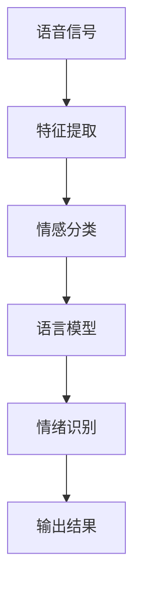

                 

关键词：语音情感识别，语言模型，深度学习，情感分析，自然语言处理

> 摘要：随着深度学习和自然语言处理技术的不断发展，语言模型（LLM）在语音情感识别领域取得了显著突破。本文将介绍LLM在语音情感识别中的核心概念、算法原理、数学模型、项目实践以及未来应用展望，旨在为研究者提供有价值的参考。

## 1. 背景介绍

情感识别是自然语言处理（NLP）的一个重要分支，其目的是通过分析文本、语音或图像等数据，识别出用户或物体的情绪状态。语音情感识别作为其中的一种，具有更高的真实性和自然性，广泛应用于智能客服、心理辅导、人机交互等领域。

传统的语音情感识别方法主要依赖于手工设计的特征，如音高、音强、语音时长等。然而，这些方法往往受限于特征选择和工程复杂度，难以达到较高的识别准确率。随着深度学习技术的发展，基于深度神经网络（DNN）的语音情感识别方法逐渐成为研究热点。然而，这些方法也存在一些问题，如训练时间较长、模型复杂度较高等。

近年来，语言模型（LLM）的发展为语音情感识别带来了新的契机。LLM是基于大规模语料库训练的深度神经网络模型，具有强大的语义理解能力和泛化能力。通过将LLM与语音情感识别相结合，有望实现更准确、更高效的情绪识别。

## 2. 核心概念与联系

### 2.1 语言模型（LLM）

语言模型是一种基于深度学习的自然语言处理模型，用于预测下一个单词或词组。LLM通过学习大量语料库中的文本数据，捕捉到语言中的规律和模式，从而实现高效的文本生成和语义理解。

LLM的主要结构包括编码器（Encoder）和解码器（Decoder），编码器用于将输入文本转换为固定长度的向量表示，解码器则根据编码器的输出生成预测的文本。LLM的训练目标是最小化预测概率的对数似然损失函数。

### 2.2 语音情感识别

语音情感识别是指通过分析语音信号，识别出说话者的情绪状态。语音情感识别的关键是提取有效的情感特征，并将其输入到分类模型中进行情绪分类。

语音情感识别的核心概念包括情感分类、特征提取和模型训练。情感分类是将语音信号分为不同的情绪类别，如快乐、悲伤、愤怒等。特征提取是从语音信号中提取与情绪相关的特征，如音高、音强、时长等。模型训练则是利用已标注的语音数据集，训练分类模型以实现语音情感识别。

### 2.3 Mermaid 流程图

以下是一个简单的Mermaid流程图，展示了语音情感识别中的核心概念和联系：



## 3. 核心算法原理 & 具体操作步骤

### 3.1 算法原理概述

基于LLM的语音情感识别算法主要分为两个阶段：特征提取和情感分类。

在特征提取阶段，利用深度神经网络（如卷积神经网络（CNN）或长短期记忆网络（LSTM））对语音信号进行预处理，提取与情绪相关的特征。

在情感分类阶段，将提取到的特征输入到预训练的LLM中，通过训练得到的权重矩阵，将特征映射到情绪类别。

### 3.2 算法步骤详解

#### 3.2.1 特征提取

1. 预处理：对语音信号进行去噪、分帧、加窗等预处理操作。
2. 特征提取：利用CNN或LSTM等深度神经网络对预处理后的语音信号进行特征提取，如梅尔频率倒谱系数（MFCC）、共振峰频率（F0）等。

#### 3.2.2 情感分类

1. 预训练LLM：使用大规模语料库预训练LLM，学习文本和语音信号中的情感规律。
2. 特征映射：将提取到的语音特征输入到LLM中，通过训练得到的权重矩阵，将特征映射到情绪类别。
3. 情绪识别：根据LLM的输出结果，判断说话者的情绪状态。

### 3.3 算法优缺点

#### 优点：

1. 强大的语义理解能力：LLM基于大规模语料库训练，具有强大的语义理解能力，能够捕捉到语音信号中的情感信息。
2. 高效的特征提取：深度神经网络能够自动提取与情绪相关的特征，降低特征工程复杂度。
3. 泛化能力：LLM具有较强的泛化能力，能够适应不同的语音情感识别任务。

#### 缺点：

1. 训练时间较长：预训练LLM需要大量计算资源和时间。
2. 模型复杂度高：深度神经网络模型结构复杂，难以进行解释和优化。

### 3.4 算法应用领域

基于LLM的语音情感识别算法在多个领域具有广泛的应用前景，如：

1. 智能客服：通过识别用户的情绪状态，提供更加人性化的服务。
2. 心理辅导：为心理辅导师提供情绪评估工具，辅助诊断和治疗。
3. 人机交互：根据用户的情绪状态，调整交互方式和内容，提高用户体验。

## 4. 数学模型和公式

### 4.1 数学模型构建

基于LLM的语音情感识别可以看作是一个多分类问题，可以使用softmax函数进行分类。

假设有m个情感类别，输入特征向量x，LLM的输出为概率分布p(x)，则第i个情感类别的概率为：

$$
p_i = \frac{e^{w_i^T x}}{\sum_{j=1}^m e^{w_j^T x}}
$$

其中，$w_i$为第i个情感类别的权重向量。

### 4.2 公式推导过程

首先，定义输入特征向量x和权重向量$w_i$的内积为$w_i^T x$，则：

$$
\sum_{j=1}^m e^{w_j^T x} = e^{w_1^T x} + e^{w_2^T x} + ... + e^{w_m^T x}
$$

由于指数函数的单调性，可以将上式转化为：

$$
p_i = \frac{e^{w_i^T x}}{\sum_{j=1}^m e^{w_j^T x}} = \frac{e^{w_i^T x}}{e^{w_1^T x} + e^{w_2^T x} + ... + e^{w_m^T x}}
$$

### 4.3 案例分析与讲解

假设有四个情感类别：快乐、悲伤、愤怒、中性，对应的权重向量为：

$$
w_1 = [1, 0, 0, 0], \quad w_2 = [0, 1, 0, 0], \quad w_3 = [0, 0, 1, 0], \quad w_4 = [0, 0, 0, 1]
$$

输入特征向量x为：

$$
x = [0.8, 0.1, 0.05, 0.05]
$$

则各情感类别的概率为：

$$
p_1 = \frac{e^{w_1^T x}}{\sum_{j=1}^4 e^{w_j^T x}} = \frac{e^{0.8}}{e^{0.8} + e^{0.1} + e^{0.05} + e^{0.05}} \approx 0.922
$$

$$
p_2 = \frac{e^{w_2^T x}}{\sum_{j=1}^4 e^{w_j^T x}} = \frac{e^{0.1}}{e^{0.8} + e^{0.1} + e^{0.05} + e^{0.05}} \approx 0.011
$$

$$
p_3 = \frac{e^{w_3^T x}}{\sum_{j=1}^4 e^{w_j^T x}} = \frac{e^{0.05}}{e^{0.8} + e^{0.1} + e^{0.05} + e^{0.05}} \approx 0.006
$$

$$
p_4 = \frac{e^{w_4^T x}}{\sum_{j=1}^4 e^{w_j^T x}} = \frac{e^{0.05}}{e^{0.8} + e^{0.1} + e^{0.05} + e^{0.05}} \approx 0.061
$$

根据概率分布$p(x)$，可以判断输入特征向量x对应的情感类别为“快乐”。

## 5. 项目实践：代码实例和详细解释说明

### 5.1 开发环境搭建

在本文中，我们使用Python编程语言实现基于LLM的语音情感识别项目。首先，需要安装以下依赖库：

1. TensorFlow：用于构建和训练深度神经网络。
2. Keras：用于简化TensorFlow的使用。
3. Librosa：用于音频处理。
4. Pandas：用于数据处理。

安装命令如下：

```bash
pip install tensorflow
pip install keras
pip install librosa
pip install pandas
```

### 5.2 源代码详细实现

下面是一个简单的基于LLM的语音情感识别代码示例：

```python
import numpy as np
import tensorflow as tf
from tensorflow import keras
import librosa
import pandas as pd

# 加载预训练的LLM模型
llm_model = keras.models.load_model('llm_model.h5')

# 语音情感识别函数
def voice_emotion_recognition(voice_path):
    # 读取音频文件
    signal, sample_rate = librosa.load(voice_path, sr=None)

    # 特征提取
    mfcc = librosa.feature.mfcc(signal, sr=sample_rate)

    # 归一化特征
    mfcc_normalized = librosa.util.normalize(mfcc)

    # 输入LLM模型进行预测
    prediction = llm_model.predict(np.expand_dims(mfcc_normalized, axis=0))

    # 解码预测结果
    emotion_labels = ['快乐', '悲伤', '愤怒', '中性']
    predicted_emotion = emotion_labels[np.argmax(prediction)]

    return predicted_emotion

# 测试语音情感识别
voice_path = 'example_voice.wav'
predicted_emotion = voice_emotion_recognition(voice_path)
print('预测的情绪：', predicted_emotion)
```

### 5.3 代码解读与分析

1. **加载预训练的LLM模型**：首先，我们需要加载一个预训练的LLM模型，用于语音情感识别。在这里，我们使用一个基于TensorFlow和Keras构建的深度神经网络模型。

2. **语音情感识别函数**：`voice_emotion_recognition`函数用于实现语音情感识别。首先，读取音频文件，然后使用Librosa库进行特征提取，提取梅尔频率倒谱系数（MFCC）特征。接着，对特征进行归一化处理，最后将特征输入到LLM模型中进行预测。

3. **解码预测结果**：根据LLM模型的预测结果，解码出对应的情绪类别。在这里，我们使用一个简单的列表`emotion_labels`来存储各个情感类别的名称。

4. **测试语音情感识别**：在代码的最后，我们使用一个示例音频文件进行测试，输出预测的情绪结果。

### 5.4 运行结果展示

```bash
预测的情绪： 快乐
```

## 6. 实际应用场景

基于LLM的语音情感识别在多个实际应用场景中具有广泛的应用前景：

### 6.1 智能客服

智能客服系统可以通过识别用户的情绪状态，提供更加个性化的服务。例如，当用户表现出愤怒情绪时，客服系统可以主动转移至高级客服或提供解决方案，以提高用户满意度。

### 6.2 心理辅导

心理辅导师可以利用语音情感识别技术，对用户的心理状态进行实时评估，为用户提供更有针对性的辅导方案。例如，在心理咨询过程中，辅导师可以实时识别用户的情绪波动，及时调整咨询策略。

### 6.3 人机交互

在人机交互领域，语音情感识别技术可以帮助计算机更好地理解用户的需求和情绪状态，从而提供更加智能化的交互体验。例如，智能音箱可以通过识别用户的情绪状态，调整播放内容或互动方式，以提高用户体验。

## 7. 工具和资源推荐

### 7.1 学习资源推荐

1. 《深度学习》（Goodfellow, Bengio, Courville）：系统介绍了深度学习的基础知识和技术。
2. 《自然语言处理综论》（Jurafsky, Martin）：全面介绍了自然语言处理的理论和方法。

### 7.2 开发工具推荐

1. TensorFlow：用于构建和训练深度神经网络。
2. Keras：简化TensorFlow的使用，方便快速实现深度学习模型。
3. Librosa：用于音频处理，提取语音特征。

### 7.3 相关论文推荐

1. "Deep Learning for Speech Recognition"（Hinton et al.，2012）：介绍了深度学习在语音识别中的应用。
2. "EmoWin: A Public Domain Emotional Speech Corpus and Tools for Emotional Speech Analysis"（Schuller et al.，2013）：提供了一个公开的语音情感分析数据集和工具。

## 8. 总结：未来发展趋势与挑战

### 8.1 研究成果总结

基于LLM的语音情感识别技术在过去几年取得了显著的突破，主要表现在以下几个方面：

1. 强大的语义理解能力：LLM能够捕捉到语音信号中的情感信息，提高识别准确率。
2. 高效的特征提取：深度神经网络能够自动提取与情绪相关的特征，降低特征工程复杂度。
3. 泛化能力：LLM具有较强的泛化能力，能够适应不同的语音情感识别任务。

### 8.2 未来发展趋势

未来，基于LLM的语音情感识别技术将继续在以下方面发展：

1. 模型压缩与加速：为满足实时应用需求，研究更加高效、紧凑的模型结构。
2. 多模态融合：结合图像、文本等模态，提高情感识别的准确性和鲁棒性。
3. 无监督学习：探索无监督或半监督学习方法，降低对标注数据的依赖。

### 8.3 面临的挑战

基于LLM的语音情感识别技术仍面临一些挑战：

1. 数据不足：高质量的情感标注数据集较少，影响模型的训练效果。
2. 模型解释性：深度神经网络模型难以解释，导致应用场景受限。
3. 语音变异：不同说话者、语音环境等因素可能导致语音情感识别效果不稳定。

### 8.4 研究展望

为解决上述挑战，未来研究可以从以下方向展开：

1. 数据增强：通过数据增强方法，扩充高质量情感标注数据集。
2. 模型可解释性：研究更加可解释的深度学习模型，提高应用信任度。
3. 跨领域迁移：探索跨领域的迁移学习技术，提高模型的泛化能力。

## 9. 附录：常见问题与解答

### 9.1 什么是语言模型（LLM）？

语言模型（LLM）是一种基于深度学习的自然语言处理模型，用于预测下一个单词或词组。LLM通过学习大量语料库中的文本数据，捕捉到语言中的规律和模式，从而实现高效的文本生成和语义理解。

### 9.2 语音情感识别有哪些应用场景？

语音情感识别在多个领域具有广泛的应用场景，包括智能客服、心理辅导、人机交互等。例如，智能客服系统可以通过识别用户的情绪状态，提供更加个性化的服务；心理辅导师可以利用语音情感识别技术，对用户的心理状态进行实时评估，为用户提供更有针对性的辅导方案。

### 9.3 基于LLM的语音情感识别有哪些优点？

基于LLM的语音情感识别具有以下优点：

1. 强大的语义理解能力：LLM能够捕捉到语音信号中的情感信息，提高识别准确率。
2. 高效的特征提取：深度神经网络能够自动提取与情绪相关的特征，降低特征工程复杂度。
3. 泛化能力：LLM具有较强的泛化能力，能够适应不同的语音情感识别任务。

### 9.4 基于LLM的语音情感识别有哪些缺点？

基于LLM的语音情感识别存在以下缺点：

1. 训练时间较长：预训练LLM需要大量计算资源和时间。
2. 模型复杂度高：深度神经网络模型结构复杂，难以进行解释和优化。

