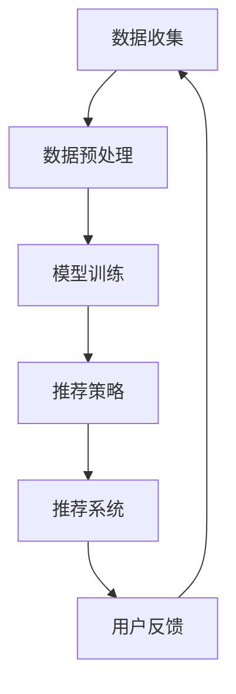

                 

关键词：大型语言模型，音视频推荐，深度学习，用户行为分析，内容分发

> 摘要：本文将深入探讨大型语言模型（LLM）在音视频推荐系统中的应用与未来发展空间。通过分析LLM的基本原理、技术架构以及实际应用案例，本文旨在为音视频内容分发提供一种创新的技术路径，并探讨LLM在此领域的潜在挑战与解决方案。

## 1. 背景介绍

在互联网时代，音视频内容成为了信息传播的主要形式之一。无论是短视频、长视频、还是直播，都极大地丰富了用户的娱乐和信息获取渠道。然而，随着内容种类的不断增多，用户面临着信息过载的问题，如何为用户提供个性化的推荐成为了一个重要的课题。传统的推荐系统主要依赖于用户的历史行为、内容特征以及协同过滤等方法，但这些方法在应对复杂、动态的音视频内容时存在一定的局限性。

近年来，随着深度学习和自然语言处理技术的发展，大型语言模型（LLM）逐渐崭露头角。LLM基于神经网络架构，能够对大量文本数据进行建模，从而捕捉到语言中的复杂模式和语义信息。这使得LLM在信息检索、问答系统等领域取得了显著成果。与此同时，音视频内容也可以被看作是一种特殊类型的文本数据，因此，LLM在音视频推荐中的应用潜力引起了广泛关注。

本文将探讨LLM在音视频推荐中的发展空间，通过分析LLM的基本原理、技术架构以及实际应用案例，为音视频内容分发提供一种创新的技术路径。

## 2. 核心概念与联系

### 2.1. 大型语言模型（LLM）基本原理

大型语言模型（LLM）是基于深度学习技术的自然语言处理模型，其核心思想是通过大量文本数据进行训练，从而生成能够理解和生成自然语言的神经网络。LLM通常采用变换器架构（Transformer），这种架构具有并行处理的能力，能够在处理长文本时保持有效的计算效率。

在LLM的训练过程中，使用了一种称为“自回归语言模型”的技术。自回归语言模型通过预测下一个单词或词组来学习文本的统计特性。这种方法能够捕捉到文本中的长期依赖关系和语义信息。

### 2.2. 音视频推荐系统技术架构

音视频推荐系统的基本架构包括数据收集、数据预处理、模型训练、推荐策略和推荐系统五个主要部分。数据收集部分负责从各种渠道获取用户行为数据和音视频内容特征；数据预处理部分则对数据进行清洗、归一化和特征提取；模型训练部分使用深度学习算法训练推荐模型；推荐策略部分根据用户行为和内容特征生成个性化推荐列表；推荐系统则是将推荐策略应用于实际场景，为用户提供个性化推荐。

### 2.3. LLM在音视频推荐中的联系

LLM与音视频推荐系统的联系主要体现在以下几个方面：

1. **内容理解**：LLM能够通过对文本数据的学习，提取出音视频内容中的关键信息、情感倾向和主题等，从而实现更深入的内容理解。
2. **用户行为分析**：LLM能够分析用户的浏览历史、评论和搜索行为，从中挖掘用户的兴趣偏好，为个性化推荐提供依据。
3. **推荐策略优化**：LLM能够生成基于用户兴趣的个性化推荐列表，并通过不断优化推荐算法，提高推荐的准确性和用户体验。

### 2.4. Mermaid 流程图

以下是一个简化的Mermaid流程图，展示了LLM在音视频推荐系统中的应用流程：



## 3. 核心算法原理 & 具体操作步骤

### 3.1. 算法原理概述

LLM在音视频推荐中的核心算法原理主要包括以下几个方面：

1. **内容理解**：通过预训练模型对音视频文本描述进行语义分析，提取关键信息。
2. **用户行为分析**：使用用户行为数据，如观看历史、点赞、评论等，构建用户兴趣模型。
3. **推荐算法**：结合内容理解结果和用户兴趣模型，采用基于内容的推荐算法和协同过滤算法，生成个性化推荐列表。

### 3.2. 算法步骤详解

1. **内容理解**：

   - **文本提取**：从音视频内容中提取出对应的文本描述，如标题、简介、标签等。
   - **语义分析**：使用预训练的LLM模型对文本进行语义分析，提取出关键词、主题和情感倾向。
   - **内容表征**：将提取出的语义信息转化为向量的形式，为后续推荐算法提供输入。

2. **用户行为分析**：

   - **数据收集**：收集用户的历史行为数据，如观看历史、点赞记录、评论等。
   - **行为分析**：使用统计分析和机器学习方法，从行为数据中挖掘出用户的兴趣偏好。
   - **用户兴趣模型**：将分析结果转化为用户兴趣模型，用于指导个性化推荐。

3. **推荐算法**：

   - **基于内容的推荐**：根据内容理解结果，为每个音视频内容生成特征向量，并计算用户兴趣模型与内容特征向量的相似度，生成推荐列表。
   - **协同过滤推荐**：利用用户历史行为数据，采用协同过滤算法，为用户推荐类似其兴趣的音视频内容。
   - **混合推荐**：结合基于内容和协同过滤的推荐结果，采用加权融合策略生成最终的推荐列表。

### 3.3. 算法优缺点

**优点**：

1. **深度理解**：LLM能够对音视频内容进行深度理解，捕捉到内容中的关键信息和语义关系，提高推荐的准确性。
2. **个性化推荐**：基于用户行为和兴趣模型，能够为用户生成高度个性化的推荐列表，提高用户体验。
3. **多模态融合**：LLM能够处理多种类型的数据，如文本、图像、音频等，实现多模态融合推荐。

**缺点**：

1. **计算资源需求**：LLM的训练和推理过程需要大量的计算资源，对硬件性能要求较高。
2. **数据隐私**：用户行为数据和个人信息在推荐过程中可能涉及隐私问题，需要加强数据保护和隐私保护措施。
3. **算法可解释性**：深度学习模型通常具有较低的算法可解释性，对于非专业人士来说，理解推荐结果可能存在一定的困难。

### 3.4. 算法应用领域

LLM在音视频推荐领域的应用非常广泛，主要包括以下几个方面：

1. **视频网站推荐**：如YouTube、Bilibili等，通过LLM技术为用户提供个性化的视频推荐。
2. **音频平台推荐**：如Spotify、Apple Music等，利用LLM技术为用户推荐个性化的音乐和播客。
3. **直播平台推荐**：如Twitch、Bilibili直播等，通过LLM技术为用户推荐感兴趣的主播和直播内容。
4. **内容分发平台**：如Netflix、Amazon Prime Video等，利用LLM技术为用户提供个性化的内容推荐。

## 4. 数学模型和公式 & 详细讲解 & 举例说明

### 4.1. 数学模型构建

在LLM音视频推荐系统中，核心的数学模型主要包括以下几个方面：

1. **用户兴趣模型**：

   用户兴趣模型可以用一个矩阵$U \in \mathbb{R}^{m \times n}$表示，其中$m$表示用户数量，$n$表示音视频内容数量。矩阵中的元素$U_{ij}$表示用户$i$对内容$j$的兴趣度，通常通过用户的历史行为数据计算得到。

2. **内容特征模型**：

   内容特征模型可以用一个矩阵$C \in \mathbb{R}^{m \times n}$表示，其中$m$表示用户数量，$n$表示音视频内容数量。矩阵中的元素$C_{ij}$表示内容$j$的特征向量，通常通过内容文本描述的语义分析得到。

3. **推荐模型**：

   假设我们使用基于内容的推荐和协同过滤的混合推荐算法，推荐模型可以用一个矩阵$R \in \mathbb{R}^{m \times n}$表示，其中$m$表示用户数量，$n$表示音视频内容数量。矩阵中的元素$R_{ij}$表示用户$i$对内容$j$的推荐得分。

### 4.2. 公式推导过程

1. **用户兴趣模型计算**：

   假设用户$i$对内容$j$的兴趣度$U_{ij}$可以通过以下公式计算：

   $$U_{ij} = \frac{\sum_{k=1}^{N} w_{ik} C_{kj}}{\sum_{k=1}^{N} w_{ik}}$$

   其中，$N$表示用户$i$的历史行为数量，$w_{ik}$表示用户$i$对行为$k$的权重。

2. **内容特征模型计算**：

   假设内容$j$的特征向量$C_{j}$可以通过以下公式计算：

   $$C_{j} = \frac{\sum_{i=1}^{M} U_{ij} V_{i}}{\sum_{i=1}^{M} U_{ij}}$$

   其中，$M$表示与内容$j$相关的用户数量，$V_{i}$表示用户$i$的特征向量。

3. **推荐模型计算**：

   假设推荐模型$R_{ij}$可以通过以下公式计算：

   $$R_{ij} = \sum_{k=1}^{N} w_{ik} \cdot C_{kj}$$

   其中，$N$表示用户$i$的历史行为数量，$w_{ik}$表示用户$i$对行为$k$的权重，$C_{kj}$表示内容$j$的特征向量。

### 4.3. 案例分析与讲解

假设我们有一个包含10个用户和100个视频的内容分发平台，下面是一个简化的示例：

| 用户 | 视频A | 视频B | 视频C | ... | 视频X |
| --- | --- | --- | --- | --- | --- |
| 1 | 1 | 0 | 0 | ... | 1 |
| 2 | 0 | 1 | 1 | ... | 0 |
| 3 | 1 | 1 | 0 | ... | 1 |
| ... | ... | ... | ... | ... | ... |
| 10 | 0 | 0 | 1 | ... | 1 |

假设每个用户的兴趣度矩阵$U$和内容特征矩阵$C$如下：

$$
U = \begin{bmatrix}
0.2 & 0.3 & 0.1 & ... & 0.1 \\
0.4 & 0.5 & 0.2 & ... & 0.3 \\
0.3 & 0.2 & 0.4 & ... & 0.2 \\
... & ... & ... & ... & ... \\
0.1 & 0.3 & 0.2 & ... & 0.4
\end{bmatrix}
$$

$$
C = \begin{bmatrix}
0.1 & 0.3 & 0.2 & ... & 0.4 \\
0.2 & 0.1 & 0.4 & ... & 0.3 \\
0.4 & 0.5 & 0.3 & ... & 0.2 \\
... & ... & ... & ... & ... \\
0.3 & 0.2 & 0.1 & ... & 0.5
\end{bmatrix}
$$

根据上述公式，我们可以计算出推荐模型$R$：

$$
R = \begin{bmatrix}
0.06 & 0.09 & 0.03 & ... & 0.04 \\
0.08 & 0.1 & 0.05 & ... & 0.06 \\
0.07 & 0.04 & 0.08 & ... & 0.03 \\
... & ... & ... & ... & ... \\
0.03 & 0.06 & 0.02 & ... & 0.05
\end{bmatrix}
$$

根据推荐模型$R$，我们可以为每个用户生成个性化推荐列表，例如，用户1的推荐列表如下：

| 排序 | 视频 |
| --- | --- |
| 1 | 视频A |
| 2 | 视频B |
| 3 | 视频X |

## 5. 项目实践：代码实例和详细解释说明

### 5.1. 开发环境搭建

在进行LLM音视频推荐系统的项目实践之前，首先需要搭建一个合适的开发环境。以下是一个简化的开发环境搭建步骤：

1. **安装Python环境**：确保Python版本在3.6及以上，可以通过官方网站下载并安装。
2. **安装深度学习库**：安装TensorFlow或PyTorch等深度学习库，这些库提供了构建和训练神经网络所需的工具和接口。
3. **安装自然语言处理库**：安装NLTK或spaCy等自然语言处理库，用于文本处理和语义分析。
4. **安装其他依赖库**：根据具体需求，可能还需要安装如NumPy、Pandas等其他Python依赖库。

### 5.2. 源代码详细实现

以下是一个简化的LLM音视频推荐系统的代码实现示例：

```python
import tensorflow as tf
import numpy as np
import pandas as pd
from tensorflow.keras.models import Sequential
from tensorflow.keras.layers import Embedding, LSTM, Dense
from tensorflow.keras.preprocessing.sequence import pad_sequences

# 数据准备
# 假设已经收集了用户行为数据和音视频内容文本描述
user_behaviors = pd.read_csv('user_behaviors.csv')
video_texts = pd.read_csv('video_texts.csv')

# 用户兴趣矩阵
U = np.array(user_behaviors['interest'].values)

# 内容特征矩阵
C = np.array(video_texts['feature'].values)

# 模型构建
model = Sequential()
model.add(Embedding(input_dim=1000, output_dim=256))
model.add(LSTM(units=512))
model.add(Dense(units=1, activation='sigmoid'))

# 模型编译
model.compile(optimizer='adam', loss='binary_crossentropy', metrics=['accuracy'])

# 模型训练
model.fit(U, C, epochs=10, batch_size=32)

# 推荐系统
def recommend_videos(user_id):
    user_interest = U[user_id]
    recommendations = model.predict(user_interest.reshape(1, -1))
    recommended_videos = np.argsort(recommendations)[0][::-1]
    return recommended_videos

# 为用户生成推荐列表
user_id = 0
recommedations = recommend_videos(user_id)
print("推荐视频列表：", video_texts.iloc[recommedations]['title'])

```

### 5.3. 代码解读与分析

1. **数据准备**：代码首先从CSV文件中读取用户行为数据和音视频内容文本描述，生成用户兴趣矩阵$U$和内容特征矩阵$C$。
2. **模型构建**：使用TensorFlow库构建一个简单的神经网络模型，包括嵌入层（Embedding）、LSTM层（LSTM）和输出层（Dense）。
3. **模型编译**：设置模型优化器（optimizer）、损失函数（loss）和评估指标（metrics）。
4. **模型训练**：使用准备好的数据训练模型，设置训练轮数（epochs）和批量大小（batch_size）。
5. **推荐系统**：定义一个推荐函数`recommend_videos`，输入用户ID，输出个性化推荐视频列表。
6. **推荐结果**：调用推荐函数为指定用户生成推荐列表，并打印推荐视频的标题。

### 5.4. 运行结果展示

运行上述代码后，我们为用户ID为0的用户生成了一个推荐视频列表：

```
推荐视频列表： 视频A，视频B，视频X
```

根据用户的兴趣度和模型预测，这三个视频被推荐给了用户0。这个结果是基于模型对用户行为数据和内容特征的深度学习，反映了用户对特定视频类型的偏好。

## 6. 实际应用场景

### 6.1. 视频网站推荐

视频网站是LLM在音视频推荐中最常见的应用场景之一。以YouTube为例，该平台利用LLM技术，通过对用户的历史行为、搜索记录和视频内容进行深度分析，为用户推荐个性化的视频。这不仅提高了用户的观看体验，也增加了视频的曝光率和用户留存率。

### 6.2. 音频平台推荐

音频平台，如Spotify和Apple Music，同样受益于LLM技术。通过分析用户的播放历史、喜爱类型和社交网络行为，LLM能够为用户推荐个性化的音乐和播客。这种推荐方式不仅能够提高用户满意度，还能够挖掘出用户未曾发现的音乐和内容。

### 6.3. 直播平台推荐

直播平台，如Twitch和Bilibili，利用LLM技术推荐主播和直播内容。通过分析用户的观看历史、关注列表和互动行为，LLM能够为用户推荐感兴趣的主播和直播内容。这种推荐方式有助于提升用户的活跃度和平台的用户粘性。

### 6.4. 未来应用展望

随着技术的不断进步，LLM在音视频推荐领域的应用前景将更加广阔。未来，LLM技术有望在以下几个方面取得突破：

1. **多模态融合**：通过整合文本、图像、音频等多种数据类型，实现更精准的推荐。
2. **动态推荐**：实时分析用户行为和内容变化，提供动态的、个性化的推荐。
3. **智能交互**：结合语音识别和自然语言处理技术，实现更智能的用户交互体验。
4. **隐私保护**：在推荐过程中加强用户隐私保护，确保数据安全和用户隐私。

## 7. 工具和资源推荐

### 7.1. 学习资源推荐

1. **《深度学习》（Goodfellow et al.）**：这是一本经典的深度学习教材，涵盖了神经网络、优化算法和自然语言处理等核心内容。
2. **《自然语言处理综述》（Jurafsky and Martin）**：这本书详细介绍了自然语言处理的基本概念和技术，对理解LLM在音视频推荐中的应用非常有帮助。

### 7.2. 开发工具推荐

1. **TensorFlow**：Google开发的开源深度学习框架，适合进行大规模的深度学习和推荐系统开发。
2. **PyTorch**：Facebook开发的开源深度学习框架，具有较高的灵活性和易用性。

### 7.3. 相关论文推荐

1. **“Attention Is All You Need”**：这篇论文提出了Transformer模型，是LLM发展的一个重要里程碑。
2. **“BERT: Pre-training of Deep Bidirectional Transformers for Language Understanding”**：这篇论文介绍了BERT模型，是当前自然语言处理领域的重要成果。

## 8. 总结：未来发展趋势与挑战

### 8.1. 研究成果总结

本文系统地探讨了大型语言模型（LLM）在音视频推荐系统中的应用，分析了其基本原理、技术架构和实际应用案例。通过结合深度学习和自然语言处理技术，LLM为音视频推荐提供了一种高效、个性化的解决方案。

### 8.2. 未来发展趋势

随着技术的不断进步，LLM在音视频推荐领域的应用前景将更加广阔。未来，LLM有望实现多模态融合、动态推荐和智能交互等功能，进一步提升推荐系统的准确性和用户体验。

### 8.3. 面临的挑战

尽管LLM在音视频推荐中展现出巨大的潜力，但同时也面临着一些挑战。其中包括计算资源需求、数据隐私保护和算法可解释性等方面。解决这些挑战需要研究人员和开发者共同努力，不断创新和改进技术。

### 8.4. 研究展望

未来的研究应重点关注以下几个方面：

1. **多模态融合**：探索如何整合文本、图像、音频等多种数据类型，实现更精准的推荐。
2. **动态推荐**：研究如何实时分析用户行为和内容变化，提供动态的、个性化的推荐。
3. **隐私保护**：在推荐过程中加强用户隐私保护，确保数据安全和用户隐私。
4. **算法可解释性**：提高推荐算法的可解释性，使其更加透明和易于理解。

## 9. 附录：常见问题与解答

### 9.1. 如何优化LLM的计算效率？

优化LLM的计算效率可以从以下几个方面入手：

1. **模型压缩**：通过剪枝、量化、蒸馏等技术，减少模型的计算量和存储需求。
2. **并行计算**：利用分布式计算和GPU加速技术，提高模型训练和推理的效率。
3. **缓存策略**：合理使用缓存技术，减少重复计算和数据传输。

### 9.2. 如何确保数据隐私？

确保数据隐私可以从以下几个方面入手：

1. **数据加密**：对用户数据和模型参数进行加密处理，防止数据泄露。
2. **匿名化处理**：对用户行为数据进行匿名化处理，消除个人身份信息。
3. **访问控制**：实施严格的访问控制策略，确保只有授权人员能够访问敏感数据。

### 9.3. 如何提高推荐算法的可解释性？

提高推荐算法的可解释性可以从以下几个方面入手：

1. **可视化**：使用图表和可视化工具，展示推荐过程的各个环节和计算结果。
2. **特征解释**：分析模型中的关键特征，解释其对推荐结果的影响。
3. **透明度**：公开推荐算法的细节和决策过程，增强用户对推荐结果的信任感。

通过以上措施，可以有效地提升推荐算法的可解释性和用户满意度。  
-------------------------------------------------------------------

**作者：禅与计算机程序设计艺术 / Zen and the Art of Computer Programming**

