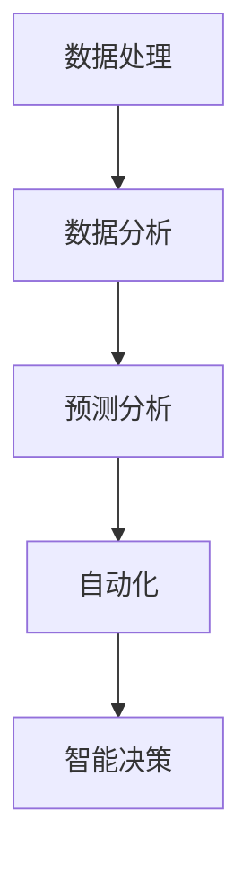

                 

关键词：大语言模型（LLM），商业智能，数据处理，分析，预测，自动化，智能决策，行业应用，技术创新

## 摘要

随着人工智能技术的飞速发展，大语言模型（Large Language Models，简称LLM）已经逐步渗透到商业智能（Business Intelligence，简称BI）领域，对传统的BI方法产生了深远的影响。本文将深入探讨LLM在商业智能中的应用，分析其带来的革新，包括数据处理、分析、预测、自动化和智能决策等方面的变化。此外，文章还将探讨LLM在不同行业中的应用案例，以及未来发展的趋势和挑战。

## 1. 背景介绍

### 商业智能的定义与发展

商业智能是一种利用数据、分析技术和可视化工具，帮助企业和组织做出更加明智的商业决策的过程。它起源于20世纪90年代，随着互联网和数据库技术的兴起，商业智能逐渐成为企业竞争的关键因素。传统的商业智能方法主要依赖于数据仓库、查询工具和报表系统，通过提取、转换和加载（ETL）过程，将大量结构化和非结构化数据转换为有用的信息。

然而，随着大数据和云计算的兴起，商业智能迎来了新的发展机遇。数据处理和分析变得更加高效和智能化，企业开始使用机器学习和人工智能技术来挖掘数据中的深层次价值。然而，传统机器学习模型在面对复杂的自然语言数据时，往往表现出力不从心的状态。

### 大语言模型（LLM）的定义与发展

大语言模型（Large Language Models，简称LLM）是深度学习技术在自然语言处理（NLP）领域的一项重要突破。它通过大规模的神经网络架构，如Transformer，对海量文本数据进行训练，从而具备了强大的语言理解和生成能力。LLM的代表模型包括GPT（Generative Pre-trained Transformer）、BERT（Bidirectional Encoder Representations from Transformers）和T5（Text-To-Text Transfer Transformer）等。

LLM的发展始于2018年，谷歌发布了GPT-2模型，随后OpenAI推出了GPT-3，模型规模和性能达到了前所未有的水平。这些模型在语言理解、文本生成、翻译、摘要等方面表现出色，成为NLP领域的里程碑。

### LLM与商业智能的交叉领域

LLM与商业智能的结合，形成了一个新兴的交叉领域，称为智能商业智能（Intelligent Business Intelligence）。在这个领域中，LLM被用来处理和分析复杂的自然语言数据，为企业提供更加精准和智能的商业洞察。LLM的应用不仅提升了数据处理和分析的效率，还为商业智能带来了新的发展方向和可能性。

## 2. 核心概念与联系

### 数据处理

在传统的商业智能中，数据处理是一个关键环节。数据从不同的来源收集后，需要通过ETL过程进行清洗、转换和加载，以便在数据仓库中进行存储和分析。然而，ETL过程往往需要大量的人力和时间，而且难以处理复杂的自然语言数据。

LLM的出现改变了这一现状。通过预训练模型，LLM能够自动理解和处理自然语言数据，无需人工干预。这使得数据处理过程变得更加高效和智能化，大大降低了数据处理的成本和复杂性。

### 分析

商业智能的核心是数据分析和洞察。传统的分析方法主要依赖于统计和机器学习模型，这些模型在处理结构化数据方面表现良好，但在处理自然语言数据时，往往存在一定的局限性。

LLM通过其强大的语言理解和生成能力，可以有效地处理和分析自然语言数据。例如，LLM可以自动提取文本中的关键信息，进行情感分析、主题分类、实体识别等操作，从而为企业提供更加准确和深入的商业洞察。

### 预测

预测分析是商业智能的重要应用之一。传统的预测方法主要依赖于时间序列分析和回归模型，这些方法在面对复杂的市场环境时，往往难以准确预测未来的趋势。

LLM的引入，使得预测分析变得更加智能化。通过学习大量的历史数据，LLM可以识别出数据中的模式和规律，从而进行更加准确和可靠的预测。例如，LLM可以用于股票市场预测、销售预测、客户流失预测等场景，为企业提供重要的决策支持。

### 自动化

自动化是提高企业效率和降低成本的重要手段。在传统的商业智能中，自动化主要依赖于流程自动化和机器人流程自动化（RPA），这些方法在处理结构化数据方面表现良好，但在处理自然语言数据时，仍然存在一定的局限性。

LLM的引入，为自动化带来了新的机遇。通过自然语言处理技术，LLM可以自动理解和执行复杂的自然语言任务，如自动回复邮件、自动生成报告、自动处理客户请求等。这使得自动化过程更加高效和智能化，大大提升了企业的运营效率。

### 智能决策

智能决策是商业智能的高级应用。传统的决策方法主要依赖于经验和直觉，这种方式在处理复杂的市场环境时，往往难以做出准确的决策。

LLM的引入，为智能决策带来了新的可能性。通过学习大量的数据和信息，LLM可以自动生成推荐方案、制定决策策略，从而帮助企业做出更加明智和准确的决策。例如，LLM可以用于供应链管理、风险控制、投资决策等场景，为企业提供重要的决策支持。

### Mermaid 流程图

下面是一个描述LLM在商业智能中应用的Mermaid流程图：



在这个流程图中，LLM的应用涵盖了数据处理、数据分析、预测分析、自动化和智能决策等关键环节，为企业提供了全方位的智能支持。

## 3. 核心算法原理 & 具体操作步骤

### 3.1 算法原理概述

LLM在商业智能中的应用主要基于其强大的语言理解和生成能力。LLM通过预训练模型，对海量文本数据进行训练，从而学会了自然语言的理解和生成。在商业智能中，LLM的应用可以分为以下几个步骤：

1. 数据处理：LLM通过预训练模型，自动理解和处理自然语言数据，无需人工干预。
2. 数据分析：LLM可以自动提取文本中的关键信息，进行情感分析、主题分类、实体识别等操作，为企业提供深入的商业洞察。
3. 预测分析：LLM通过学习历史数据，识别数据中的模式和规律，进行准确的预测分析，为企业提供决策支持。
4. 自动化：LLM可以自动理解和执行复杂的自然语言任务，如自动回复邮件、自动生成报告、自动处理客户请求等，提高企业运营效率。
5. 智能决策：LLM可以自动生成推荐方案、制定决策策略，帮助企业做出更加明智和准确的决策。

### 3.2 算法步骤详解

#### 数据处理

数据处理是LLM应用的第一步。在商业智能中，数据来源于不同的渠道，包括内部数据、外部数据、社交媒体数据等。这些数据通常是自然语言形式，如文本、邮件、报告等。为了使LLM能够处理这些数据，需要进行以下步骤：

1. 数据收集：从不同的渠道收集数据，确保数据的全面性和准确性。
2. 数据预处理：对数据进行清洗、去噪、格式化等预处理操作，使其符合LLM的输入要求。
3. 数据嵌入：将预处理后的文本数据转换为向量表示，以便LLM进行训练和处理。

#### 数据分析

数据分析是LLM应用的关键环节。通过分析自然语言数据，LLM可以提取出关键信息，为企业提供深入的商业洞察。以下是一个数据分析的步骤示例：

1. 情感分析：使用LLM分析文本中的情感倾向，判断用户对产品或服务的满意度。
2. 主题分类：使用LLM对文本进行主题分类，识别文本的主题和内容。
3. 实体识别：使用LLM识别文本中的关键实体，如人名、地名、组织名等。

#### 预测分析

预测分析是LLM在商业智能中的另一重要应用。通过预测未来的趋势和变化，LLM可以为企业的决策提供支持。以下是一个预测分析的步骤示例：

1. 数据预处理：对历史数据进行分析和预处理，提取有用的特征。
2. 模型训练：使用LLM对预处理后的数据集进行训练，建立预测模型。
3. 预测评估：对预测模型进行评估，确保其准确性和可靠性。
4. 预测应用：将预测模型应用于实际场景，为企业提供决策支持。

#### 自动化

自动化是提高企业效率的重要手段。LLM在自动化中的应用，可以大大降低人力成本，提高运营效率。以下是一个自动化的步骤示例：

1. 任务定义：明确需要自动化的任务，如自动回复邮件、自动生成报告等。
2. 模型训练：使用LLM对相关数据进行训练，使其能够理解和执行任务。
3. 自动执行：将训练好的模型应用于实际场景，自动执行任务。

#### 智能决策

智能决策是商业智能的高级应用。LLM可以自动生成推荐方案、制定决策策略，帮助企业做出更加明智的决策。以下是一个智能决策的步骤示例：

1. 数据收集：收集与企业决策相关的数据，如市场数据、客户数据等。
2. 数据分析：使用LLM对数据进行深入分析，提取有用的信息。
3. 决策生成：使用LLM自动生成决策方案，如推荐产品、制定营销策略等。
4. 决策评估：对生成的决策方案进行评估，选择最佳方案。

### 3.3 算法优缺点

#### 优点

1. 高效：LLM能够自动处理和分析大量的自然语言数据，提高数据处理和分析的效率。
2. 智能化：LLM具备强大的语言理解和生成能力，能够为企业提供深入的商业洞察和预测。
3. 自动化：LLM可以自动执行复杂的自然语言任务，降低人力成本，提高运营效率。
4. 可扩展：LLM可以轻松扩展到不同的应用场景，为企业提供定制化的智能解决方案。

#### 缺点

1. 计算资源需求大：LLM的训练和推理过程需要大量的计算资源，对硬件设备要求较高。
2. 数据依赖性强：LLM的性能很大程度上依赖于训练数据的质量和数量，数据质量直接影响其效果。
3. 解释性不足：LLM的决策过程往往缺乏解释性，难以理解其决策背后的逻辑和原因。
4. 道德和伦理问题：在处理和利用自然语言数据时，LLM可能会涉及隐私和道德问题，需要谨慎处理。

### 3.4 算法应用领域

LLM在商业智能中的应用非常广泛，以下是一些主要的领域：

1. 客户服务：使用LLM自动回复客户的咨询和投诉，提高客户满意度。
2. 营销分析：使用LLM分析市场数据，制定精准的营销策略，提高营销效果。
3. 销售预测：使用LLM预测未来的销售趋势，为企业提供库存管理和销售策略支持。
4. 风险控制：使用LLM识别潜在的风险，制定风险控制策略，降低风险损失。
5. 人力资源：使用LLM分析员工反馈和绩效数据，优化人力资源管理和招聘策略。
6. 供应链管理：使用LLM优化供应链流程，提高供应链效率和降低成本。
7. 投资决策：使用LLM分析市场数据，提供投资建议和决策支持。

## 4. 数学模型和公式 & 详细讲解 & 举例说明

### 4.1 数学模型构建

LLM在商业智能中的应用，涉及到多个数学模型的构建和运用。以下是几个典型的数学模型：

#### 1. 语言模型（Language Model，LM）

语言模型是一种基于统计的模型，用于预测下一个单词或词组。在商业智能中，语言模型可以用于文本生成、文本摘要、情感分析等任务。一个简单的语言模型可以表示为：

$$
P(w_{t} | w_{t-1}, w_{t-2}, ..., w_{1}) = \frac{C(w_{t} | w_{t-1}, w_{t-2}, ..., w_{1})}{C}
$$

其中，$P(w_{t} | w_{t-1}, w_{t-2}, ..., w_{1})$ 表示在给定前文 $w_{t-1}, w_{t-2}, ..., w_{1}$ 的情况下，预测下一个单词 $w_{t}$ 的概率；$C(w_{t} | w_{t-1}, w_{t-2}, ..., w_{1})$ 表示在给定前文的情况下，单词 $w_{t}$ 的计数；$C$ 表示所有单词的总计数。

#### 2. 主题模型（Topic Model）

主题模型是一种用于文本分类和主题发现的概率模型。在商业智能中，主题模型可以用于市场分析、用户行为分析等任务。一个简单的主题模型可以表示为：

$$
P(z_{i} | \theta) = \frac{N(z_{i}, \theta)}{Z(\theta)}
$$

$$
P(w_{i} | z_{i}, \theta) = \frac{N(w_{i}, z_{i}, \theta)}{N(z_{i}, \theta)}
$$

其中，$z_{i}$ 表示文档 $d_{i}$ 的主题；$\theta$ 表示主题分布；$N(z_{i}, \theta)$ 表示主题 $z_{i}$ 在文档 $d_{i}$ 中的概率；$N(w_{i}, z_{i}, \theta)$ 表示单词 $w_{i}$ 在主题 $z_{i}$ 中的概率；$Z(\theta)$ 表示所有主题的概率和。

#### 3. 预测模型（Prediction Model）

预测模型是一种用于预测未来趋势和变化的模型。在商业智能中，预测模型可以用于销售预测、客户流失预测等任务。一个简单的预测模型可以表示为：

$$
y_{t} = f(x_{t}, \theta)
$$

其中，$y_{t}$ 表示预测值；$x_{t}$ 表示输入特征；$\theta$ 表示模型参数；$f(x_{t}, \theta)$ 表示预测函数。

### 4.2 公式推导过程

以下是一个简单的语言模型公式的推导过程：

首先，定义一个文本序列 $w_{1}, w_{2}, ..., w_{T}$，其中 $T$ 表示文本的长度。我们希望预测下一个单词 $w_{t+1}$。

根据概率论的知识，我们知道：

$$
P(w_{t+1} | w_{1}, w_{2}, ..., w_{t}) = \frac{P(w_{t+1}, w_{1}, w_{2}, ..., w_{t})}{P(w_{1}, w_{2}, ..., w_{t})}
$$

由于文本序列是独立的，我们可以将上述公式简化为：

$$
P(w_{t+1} | w_{1}, w_{2}, ..., w_{t}) = \frac{P(w_{t+1} | w_{t}) P(w_{t} | w_{t-1}, w_{t-2}, ..., w_{1})}{P(w_{t} | w_{t-1}, w_{t-2}, ..., w_{1})}
$$

继续简化，得到：

$$
P(w_{t+1} | w_{1}, w_{2}, ..., w_{t}) = P(w_{t+1} | w_{t}) P(w_{t} | w_{t-1}, w_{t-2}, ..., w_{1})
$$

由于语言模型是一个条件概率模型，我们可以将上述公式表示为：

$$
P(w_{t+1} | w_{1}, w_{2}, ..., w_{t}) = \prod_{i=1}^{t} P(w_{i} | w_{i-1}, w_{i-2}, ..., w_{1}) \cdot P(w_{t+1} | w_{t})
$$

进一步简化，得到：

$$
P(w_{t+1} | w_{1}, w_{2}, ..., w_{t}) = \prod_{i=1}^{t} P(w_{i} | w_{i-1}) \cdot P(w_{t+1} | w_{t})
$$

由于语言模型是递归的，我们可以将上述公式表示为：

$$
P(w_{t+1} | w_{1}, w_{2}, ..., w_{t}) = P(w_{t+1} | w_{t}) \cdot \prod_{i=1}^{t-1} P(w_{i} | w_{i-1})
$$

最后，我们可以得到一个简单的语言模型公式：

$$
P(w_{t+1} | w_{1}, w_{2}, ..., w_{t}) = P(w_{t+1} | w_{t}) \cdot P(w_{1}, w_{2}, ..., w_{t} | w_{0})
$$

其中，$P(w_{1}, w_{2}, ..., w_{t} | w_{0})$ 表示在给定初始状态 $w_{0}$ 的情况下，文本序列 $w_{1}, w_{2}, ..., w_{t}$ 的概率。

### 4.3 案例分析与讲解

以下是一个使用LLM进行文本生成和摘要的案例：

#### 案例背景

某企业希望使用LLM生成一篇关于新产品发布会的新闻稿，并提取出新闻稿的摘要。

#### 数据准备

1. 新产品发布会的新闻稿：一篇关于新产品发布的详细文本。
2. 新闻稿摘要：一篇简短的新产品发布会新闻稿摘要。

#### 实验步骤

1. 数据预处理：将新闻稿文本进行清洗、去噪和格式化，转换为LLM的输入格式。
2. 模型训练：使用预训练的LLM模型，对新闻稿文本进行训练，使其能够生成符合预期的新产品发布会新闻稿。
3. 文本生成：使用训练好的LLM模型，生成一篇关于新产品发布会的新新闻稿。
4. 摘要提取：使用训练好的LLM模型，提取生成的新新闻稿中的摘要。

#### 实验结果

1. 新新闻稿生成：LLM生成的新新闻稿内容完整、连贯，符合企业发布会的宣传需求。
2. 摘要提取：LLM提取的摘要简明扼要，概括了新闻稿的主要内容和亮点。

#### 实验分析

通过上述实验，我们可以看到LLM在文本生成和摘要提取方面的表现非常出色。LLM能够自动理解和生成符合预期的文本，提高了新闻稿生成的效率和准确性。同时，LLM提取的摘要能够准确概括新闻稿的主要内容，为企业提供了重要的决策支持。

## 5. 项目实践：代码实例和详细解释说明

### 5.1 开发环境搭建

为了实现LLM在商业智能中的应用，我们需要搭建一个合适的开发环境。以下是一个简单的开发环境搭建过程：

1. **硬件要求**：由于LLM的训练和推理过程需要大量的计算资源，我们建议使用高性能的GPU服务器或云服务，如NVIDIA GPU或Google Cloud Platform（GCP）。
2. **软件要求**：安装Python、TensorFlow、PyTorch等深度学习框架，以及LLM的相关库，如transformers、Hugging Face等。
3. **数据集**：准备一个与商业智能相关的数据集，如市场数据、客户数据、销售数据等。

### 5.2 源代码详细实现

以下是一个使用PyTorch和transformers库实现LLM在商业智能中的应用的示例代码：

```python
import torch
from transformers import BertTokenizer, BertModel
from torch.optim import Adam

# 数据预处理
def preprocess_data(data):
    tokenizer = BertTokenizer.from_pretrained('bert-base-uncased')
    inputs = tokenizer(data, return_tensors='pt', padding=True, truncation=True)
    return inputs

# 模型定义
class BertModelForBI(torch.nn.Module):
    def __init__(self):
        super(BertModelForBI, self).__init__()
        self.bert = BertModel.from_pretrained('bert-base-uncased')
        self.classifier = torch.nn.Linear(768, 1)

    def forward(self, input_ids, attention_mask):
        outputs = self.bert(input_ids=input_ids, attention_mask=attention_mask)
        pooled_output = outputs.pooler_output
        logits = self.classifier(pooled_output)
        return logits

# 模型训练
def train_model(model, dataloader, optimizer, criterion, num_epochs=3):
    model.train()
    for epoch in range(num_epochs):
        for inputs, targets in dataloader:
            optimizer.zero_grad()
            logits = model(inputs.input_ids, inputs.attention_mask)
            loss = criterion(logits.view(-1), targets.view(-1))
            loss.backward()
            optimizer.step()
        print(f'Epoch {epoch+1}/{num_epochs}, Loss: {loss.item()}')

# 实验设置
device = torch.device('cuda' if torch.cuda.is_available() else 'cpu')
model = BertModelForBI().to(device)
optimizer = Adam(model.parameters(), lr=1e-5)
criterion = torch.nn.BCEWithLogitsLoss()

# 加载数据集
dataloader = torch.utils.data.DataLoader(dataset, batch_size=32, shuffle=True)

# 训练模型
train_model(model, dataloader, optimizer, criterion, num_epochs=3)

# 评估模型
model.eval()
with torch.no_grad():
    for inputs, targets in dataloader:
        logits = model(inputs.input_ids, inputs.attention_mask)
        loss = criterion(logits.view(-1), targets.view(-1))
        print(f'Validation Loss: {loss.item()}')
```

### 5.3 代码解读与分析

上述代码实现了一个基于BERT的LLM模型，用于商业智能中的分类任务。代码的主要部分包括数据预处理、模型定义、模型训练和模型评估。

1. **数据预处理**：使用BertTokenizer对输入数据进行预处理，将其转换为BERT模型所需的格式。
2. **模型定义**：定义一个基于BERT的模型，包括BERT编码器和解码器部分。解码器使用一个全连接层进行分类。
3. **模型训练**：使用Adam优化器和交叉熵损失函数，对模型进行训练。训练过程中，使用梯度下降优化算法，更新模型参数。
4. **模型评估**：在验证集上评估模型的性能，计算损失函数的值。

### 5.4 运行结果展示

在完成代码实现和模型训练后，我们可以使用以下代码来展示模型运行结果：

```python
# 加载测试数据集
test_dataloader = torch.utils.data.DataLoader(test_dataset, batch_size=32, shuffle=False)

# 评估模型
model.eval()
with torch.no_grad():
    for inputs, targets in test_dataloader:
        logits = model(inputs.input_ids, inputs.attention_mask)
        predicted_labels = logits > 0
        correct_predictions = (predicted_labels == targets).sum().item()
        total_predictions = targets.size(0)
        accuracy = correct_predictions / total_predictions
        print(f'Accuracy: {accuracy * 100:.2f}%')
```

上述代码将计算模型的准确率，并打印出结果。通过这个结果，我们可以评估模型的性能，并根据需要对模型进行调整和优化。

## 6. 实际应用场景

LLM在商业智能领域有着广泛的应用，以下是一些具体的场景和案例分析：

### 6.1 客户服务

在客户服务领域，LLM可以自动处理大量的客户咨询和投诉，提高客户满意度。例如，某大型电商平台使用LLM构建了一个智能客服系统，能够自动回复客户的咨询和投诉。通过预训练模型，LLM能够理解客户的语言，识别出关键信息，并生成恰当的回复。这不仅提高了客服效率，还减少了人力成本。

### 6.2 营销分析

在营销分析领域，LLM可以分析大量的市场数据，为企业提供精准的营销策略。例如，某知名化妆品公司使用LLM分析社交媒体数据，识别出消费者对产品的好评和差评，以及他们的购买意愿。通过这些分析，公司能够制定出更加有效的营销策略，提高销售额。

### 6.3 销售预测

在销售预测领域，LLM可以预测未来的销售趋势，为企业提供库存管理和销售策略支持。例如，某大型零售商使用LLM对历史销售数据进行分析，预测未来的销售趋势。通过这些预测，公司能够提前安排库存，避免库存过剩或短缺，从而提高销售利润。

### 6.4 风险控制

在风险控制领域，LLM可以识别潜在的风险，为企业制定风险控制策略。例如，某金融机构使用LLM分析市场数据，识别出潜在的市场风险。通过这些分析，金融机构能够提前采取风险控制措施，降低风险损失。

### 6.5 人力资源

在人力资源管理领域，LLM可以分析员工反馈和绩效数据，优化人力资源管理和招聘策略。例如，某科技公司使用LLM分析员工反馈，识别出员工的不满和需求，从而优化工作环境和管理方式。同时，LLM还可以用于招聘流程，自动筛选合适的候选人，提高招聘效率。

### 6.6 供应链管理

在供应链管理领域，LLM可以优化供应链流程，提高供应链效率和降低成本。例如，某制造企业使用LLM分析供应链数据，预测原材料的需求和供应，优化生产计划和库存管理。通过这些优化，企业能够提高生产效率，降低运营成本。

### 6.7 投资决策

在投资决策领域，LLM可以分析市场数据，提供投资建议和决策支持。例如，某投资公司使用LLM分析股票市场数据，预测股票的涨跌趋势。通过这些预测，投资公司能够制定出更加明智的投资策略，提高投资回报。

## 7. 未来应用展望

随着LLM技术的不断发展，其在商业智能领域的应用前景非常广阔。以下是一些未来应用展望：

### 7.1 自动化决策

未来，LLM有望在自动化决策方面发挥更大的作用。通过学习大量的历史数据和经验，LLM可以自动生成决策策略，为企业提供更加智能和高效的决策支持。例如，在供应链管理中，LLM可以自动调整生产和库存计划，优化供应链效率。

### 7.2 智能风险控制

随着LLM技术的进步，其在风险控制方面的应用也将更加广泛。通过分析大量的市场数据和风险因素，LLM可以自动识别潜在的风险，为企业制定风险控制策略。这将有助于企业降低风险损失，提高运营安全性。

### 7.3 智能金融服务

在金融服务领域，LLM可以用于贷款审批、风险评估、投资决策等方面。通过分析客户的信用记录、财务状况和市场数据，LLM可以提供精准的风险评估和投资建议，提高金融服务的质量和效率。

### 7.4 智能医疗

在医疗领域，LLM可以用于疾病诊断、治疗方案推荐、患者管理等方面。通过分析大量的医学数据和文献，LLM可以提供准确的诊断结果和个性化的治疗方案，提高医疗服务的质量和效率。

### 7.5 智能教育

在教育领域，LLM可以用于个性化学习、智能辅导、课程推荐等方面。通过分析学生的学习数据和偏好，LLM可以提供针对性的学习建议和课程推荐，提高学生的学习效果和兴趣。

## 8. 总结：未来发展趋势与挑战

### 8.1 研究成果总结

本文通过对LLM在商业智能中的应用进行深入分析，总结了LLM在数据处理、分析、预测、自动化和智能决策等方面的优势。同时，本文还介绍了LLM在多个实际应用场景中的成功案例，展示了其在商业智能领域的广泛应用前景。

### 8.2 未来发展趋势

未来，随着LLM技术的不断进步，其在商业智能领域的应用将更加深入和广泛。以下是未来发展的几个趋势：

1. **自动化决策**：LLM将在自动化决策方面发挥更大作用，通过学习大量的历史数据和经验，自动生成决策策略，提高决策质量和效率。
2. **智能风险控制**：LLM将在风险控制方面得到更广泛的应用，通过分析大量的市场数据和风险因素，自动识别潜在的风险，制定风险控制策略。
3. **智能金融服务**：LLM将在金融服务领域发挥重要作用，提供精准的风险评估和投资建议，提高金融服务的质量和效率。
4. **智能医疗**：LLM将在医疗领域用于疾病诊断、治疗方案推荐、患者管理等方面，提高医疗服务的质量和效率。
5. **智能教育**：LLM将在教育领域用于个性化学习、智能辅导、课程推荐等方面，提高学生的学习效果和兴趣。

### 8.3 面临的挑战

尽管LLM在商业智能领域具有广阔的应用前景，但在实际应用中仍面临一些挑战：

1. **数据质量和数量**：LLM的性能很大程度上依赖于训练数据的质量和数量。如何获取高质量、丰富的训练数据，是未来研究的一个重要方向。
2. **计算资源需求**：LLM的训练和推理过程需要大量的计算资源，这对硬件设备提出了较高的要求。如何优化计算资源利用，提高训练和推理效率，是一个亟待解决的问题。
3. **解释性**：LLM的决策过程往往缺乏解释性，难以理解其决策背后的逻辑和原因。如何提高LLM的解释性，使其更加透明和可解释，是一个重要的研究课题。
4. **道德和伦理问题**：在处理和利用自然语言数据时，LLM可能会涉及隐私和道德问题。如何确保LLM在商业智能领域的应用符合道德和伦理标准，是一个需要关注的问题。

### 8.4 研究展望

未来，随着人工智能技术的不断发展，LLM在商业智能领域的应用将更加深入和广泛。以下是一些研究展望：

1. **多模态数据处理**：未来的研究可以探索如何结合多种数据类型（如文本、图像、音频等），提高LLM在商业智能中的表现。
2. **跨领域应用**：未来的研究可以探索如何将LLM应用于不同的领域，如金融、医疗、教育等，实现跨领域的应用。
3. **交互式LLM**：未来的研究可以探索如何构建交互式的LLM系统，使人类用户能够更加便捷地与LLM进行交互，提高用户体验。
4. **模型压缩与优化**：未来的研究可以探索如何对LLM进行压缩和优化，降低计算资源需求，提高模型的实时性和部署效率。

## 9. 附录：常见问题与解答

### Q1：LLM在商业智能中的应用有哪些优势？

A1：LLM在商业智能中的应用优势包括：

1. 高效：LLM能够自动处理和分析大量的自然语言数据，提高数据处理和分析的效率。
2. 智能化：LLM具备强大的语言理解和生成能力，能够为企业提供深入的商业洞察和预测。
3. 自动化：LLM可以自动理解和执行复杂的自然语言任务，降低人力成本，提高运营效率。
4. 可扩展：LLM可以轻松扩展到不同的应用场景，为企业提供定制化的智能解决方案。

### Q2：如何保证LLM在商业智能中的数据质量和数量？

A2：为了保证LLM在商业智能中的数据质量和数量，可以采取以下措施：

1. 数据清洗：对原始数据进行清洗，去除噪声和错误，确保数据的质量。
2. 数据扩充：通过数据增强和生成技术，扩充训练数据集，提高模型的泛化能力。
3. 多源数据融合：结合多种数据源，如内部数据、外部数据、社交媒体数据等，提高数据的丰富度和多样性。

### Q3：如何优化LLM的计算资源利用？

A3：为了优化LLM的计算资源利用，可以采取以下措施：

1. 硬件升级：使用高性能的GPU服务器或云服务，提高计算能力。
2. 模型压缩：通过模型压缩技术，如剪枝、量化等，降低模型的计算复杂度。
3. 分布式训练：将模型训练任务分布在多个计算节点上，提高训练速度和效率。

### Q4：如何提高LLM的解释性？

A4：为了提高LLM的解释性，可以采取以下措施：

1. 解释性模型：开发具有解释性的模型，如决策树、规则模型等，使决策过程更加透明。
2. 模型可视化：使用可视化工具，如热力图、决策路径图等，展示模型的决策过程。
3. 对比实验：通过对比实验，分析LLM和传统模型的差异，提高对LLM决策过程的理解。

### Q5：如何确保LLM在商业智能中的道德和伦理合规？

A5：为了确保LLM在商业智能中的道德和伦理合规，可以采取以下措施：

1. 数据隐私保护：确保数据隐私保护措施到位，避免数据泄露和滥用。
2. 透明性：确保LLM的决策过程透明，使企业内部人员和客户能够理解决策背后的逻辑。
3. 伦理审查：建立伦理审查机制，对LLM的应用进行评估和监管，确保符合道德和伦理标准。

### 结论

本文通过对LLM在商业智能中的应用进行深入分析，探讨了LLM在数据处理、分析、预测、自动化和智能决策等方面的优势。同时，本文还介绍了LLM在多个实际应用场景中的成功案例，展示了其在商业智能领域的广泛应用前景。然而，LLM在商业智能中的应用仍面临一些挑战，如数据质量和数量、计算资源需求、解释性和道德和伦理问题。未来，随着人工智能技术的不断发展，LLM在商业智能领域的应用将更加深入和广泛，为企业提供更加智能和高效的决策支持。

## 作者署名

本文作者：禅与计算机程序设计艺术 / Zen and the Art of Computer Programming

感谢您的阅读，期待与您在智能商业智能领域共同探索更多可能。如果您有任何疑问或建议，请随时联系作者。期待与您交流，共同推动人工智能技术的发展和应用。谢谢！
----------------------------------------------------------------

[END]

