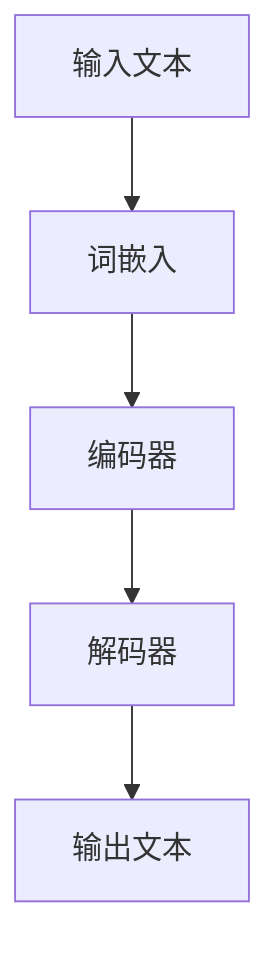

                 

关键词：大型语言模型（LLM），用户体验设计，革新，传统设计，交互设计，人机交互，设计思维，设计流程

> 摘要：本文将探讨大型语言模型（LLM）对传统用户体验设计的革新。通过对LLM的核心概念、算法原理及其在交互设计中的应用进行深入分析，本文将揭示LLM如何改变设计师的思维方式、设计流程和用户体验。同时，本文还将讨论LLM在未来的应用前景和潜在挑战。

## 1. 背景介绍

用户体验设计（UX Design）是现代软件开发中不可或缺的一环。它关注用户的需求、感受和行为，致力于创造易于使用、愉悦且高效的产品。传统用户体验设计通常依赖于用户调研、用户测试、用户反馈等手段，通过不断迭代和改进来优化产品的用户体验。

然而，随着技术的快速发展，尤其是大型语言模型（LLM）的出现，用户体验设计正面临前所未有的挑战和机遇。LLM是一种基于深度学习的技术，能够理解和生成人类语言。这种能力使得LLM在自然语言处理、问答系统、自动摘要、机器翻译等领域取得了显著成果。同时，LLM也开始被应用于交互设计，对传统用户体验设计产生了深远影响。

本文旨在探讨LLM如何革新用户体验设计，包括LLM的核心概念、算法原理、应用场景、设计思维和设计流程的改变，以及未来的应用前景和挑战。通过本文的讨论，我们希望读者能够更好地理解LLM对用户体验设计的意义和价值。

## 2. 核心概念与联系

### 2.1 大型语言模型（LLM）的概念

大型语言模型（LLM）是一种基于深度学习的自然语言处理模型，其核心目标是理解和生成人类语言。与传统的基于规则的方法不同，LLM能够从大量数据中自动学习语言结构和语义，从而实现对自然语言的深度理解。

LLM通常由多个层次组成，包括词嵌入层、编码器、解码器和输出层。词嵌入层将单词映射到高维向量空间，编码器将输入序列编码为一个固定长度的向量表示，解码器则根据编码器的输出生成输出序列。通过这种多层次的结构，LLM能够捕捉语言中的复杂模式和语义关系。

### 2.2 LLM与用户体验设计的关系

用户体验设计关注用户的需求、感受和行为，致力于创造易于使用、愉悦且高效的产品。LLM作为一种强大的自然语言处理技术，能够为用户体验设计带来以下几方面的革新：

1. **个性化交互**：LLM能够理解用户的语言和意图，从而实现个性化的交互。例如，智能助手可以根据用户的提问和反馈，提供定制化的答案和建议，从而提高用户的满意度和使用体验。

2. **自然语言反馈**：传统用户体验设计通常依赖于用户调研、用户测试和用户反馈等手段。LLM可以自动分析和处理用户的反馈，生成有针对性的改进建议，从而加速设计迭代过程。

3. **智能内容生成**：LLM能够生成高质量的自然语言文本，为设计师提供丰富的创意来源。例如，LLM可以生成产品描述、用户指南、营销文案等，从而提高设计内容的丰富度和吸引力。

4. **交互式故事讲述**：LLM能够理解语言中的逻辑和情感，从而实现交互式故事讲述。例如，虚拟角色可以通过自然语言与用户互动，讲述有趣的故事，从而增强用户的沉浸感和体验。

### 2.3 LLM架构的Mermaid流程图



在这个流程图中，输入文本首先经过词嵌入层，将单词映射到高维向量空间。然后，编码器将这些向量编码为一个固定长度的向量表示。解码器根据编码器的输出生成输出文本，从而实现自然语言生成。

## 3. 核心算法原理 & 具体操作步骤

### 3.1 算法原理概述

大型语言模型（LLM）的核心算法原理是基于深度学习的自注意力机制（Self-Attention）。自注意力机制允许模型在处理输入文本时，自动关注文本中的关键信息，从而提高对语言的理解能力。

自注意力机制通常由多层神经网络组成，包括词嵌入层、编码器、解码器和输出层。词嵌入层将单词映射到高维向量空间，编码器将输入序列编码为一个固定长度的向量表示，解码器则根据编码器的输出生成输出序列。

在自注意力机制中，每个词的输出都受到其他词的注意力权重的影响。这些注意力权重通过矩阵乘法和激活函数计算得出，从而实现了对文本的自动关注和筛选。

### 3.2 算法步骤详解

1. **词嵌入**：输入文本经过词嵌入层，将单词映射到高维向量空间。每个单词都被表示为一个向量，这些向量具有语义信息。

2. **编码器**：编码器将输入序列编码为一个固定长度的向量表示。编码器的每个层次都通过自注意力机制和前馈神经网络对输入向量进行编码。

3. **解码器**：解码器根据编码器的输出生成输出序列。解码器的每个层次都通过自注意力机制和前馈神经网络对编码器的输出进行解码。

4. **输出文本**：解码器的输出经过输出层，生成最终的输出文本。

### 3.3 算法优缺点

**优点**：

- **强大的语言理解能力**：自注意力机制允许模型自动关注文本中的关键信息，从而实现对语言的深度理解。
- **高效率**：自注意力机制的计算复杂度相对较低，使得模型能够处理大规模的输入文本。
- **灵活性强**：自注意力机制可以应用于各种自然语言处理任务，包括文本分类、机器翻译、问答系统等。

**缺点**：

- **计算资源需求高**：自注意力机制的计算复杂度较高，需要大量的计算资源。
- **训练时间长**：自注意力机制的训练过程较长，需要大量数据和计算资源。

### 3.4 算法应用领域

大型语言模型（LLM）在以下领域具有广泛的应用：

- **自然语言处理**：包括文本分类、情感分析、信息提取、问答系统等。
- **交互设计**：包括智能助手、虚拟角色、交互式故事讲述等。
- **内容生成**：包括自动摘要、机器翻译、产品描述、用户指南等。

## 4. 数学模型和公式 & 详细讲解 & 举例说明

### 4.1 数学模型构建

大型语言模型（LLM）的核心数学模型是基于自注意力机制的编码器-解码器架构。以下是该模型的数学模型构建：

1. **词嵌入**：给定输入文本序列 $X = \{x_1, x_2, ..., x_n\}$，其中 $x_i$ 是单词 $w_i$ 的向量表示，$V_w$ 是词向量空间。词嵌入模型可以表示为：

   $$ e(x_i) = V_w[w_i] $$

2. **编码器**：编码器将输入文本序列编码为一个固定长度的向量表示 $H = \{h_1, h_2, ..., h_n\}$。编码器可以通过多层自注意力机制和前馈神经网络实现，具体公式为：

   $$ h_i = \text{Attention}(h_{<i}, h_{>i}) = \text{softmax}\left(\frac{W_a h_{<i} h_{>i}^T}{\sqrt{d_k}}\right)h_{>i} + h_i $$

   其中，$W_a$ 是自注意力权重矩阵，$d_k$ 是自注意力机制中的隐藏维度。

3. **解码器**：解码器根据编码器的输出生成输出序列 $Y = \{y_1, y_2, ..., y_n\}$。解码器同样可以通过多层自注意力机制和前馈神经网络实现，具体公式为：

   $$ y_i = \text{Attention}(y_{<i}, h) = \text{softmax}\left(\frac{W_a y_{<i} h^T}{\sqrt{d_k}}\right)h + y_i $$

   其中，$W_a$ 是自注意力权重矩阵，$h$ 是编码器的输出。

4. **输出层**：解码器的输出经过输出层生成最终的输出文本。输出层通常是一个线性层，其公式为：

   $$ y_i = \text{softmax}(W_y h_i) $$

   其中，$W_y$ 是输出层的权重矩阵。

### 4.2 公式推导过程

以下是自注意力机制的推导过程：

1. **自注意力权重计算**：

   自注意力权重可以通过以下公式计算：

   $$ a_{ij} = \frac{\exp(\text{score}(h_i, h_j))}{\sum_{k=1}^{n} \exp(\text{score}(h_i, h_k))} $$

   其中，$\text{score}(h_i, h_j)$ 是 $h_i$ 和 $h_j$ 的相似度得分，通常通过点积计算：

   $$ \text{score}(h_i, h_j) = h_i^T h_j $$

2. **自注意力计算**：

   自注意力可以通过以下公式计算：

   $$ \text{Attention}(h_{<i}, h_{>i}) = \sum_{j=1}^{n} a_{ij} h_j $$

   其中，$a_{ij}$ 是自注意力权重，$h_j$ 是编码器的输出。

### 4.3 案例分析与讲解

假设我们有一个简单的句子：“我喜欢吃苹果”。我们可以使用自注意力机制对这个句子进行编码和解析。

1. **词嵌入**：

   首先，我们将句子中的单词映射到词向量空间：

   $$ e(\text{我}) = \text{V_w}[\text{我}] $$
   $$ e(\text{喜}) = \text{V_w}[\text{喜}] $$
   $$ e(\text{欢}) = \text{V_w}[\text{欢}] $$
   $$ e(\text{吃}) = \text{V_w}[\text{吃}] $$
   $$ e(\text{苹果}) = \text{V_w}[\text{苹果}] $$

2. **编码器**：

   编码器将输入文本序列编码为一个固定长度的向量表示：

   $$ h_i = \text{Attention}(h_{<i}, h_{>i}) = \text{softmax}\left(\frac{W_a h_{<i} h_{>i}^T}{\sqrt{d_k}}\right)h_{>i} + h_i $$

   假设 $d_k = 10$，$W_a$ 为自注意力权重矩阵，我们可以计算出每个词的编码向量：

   $$ h_1 = \text{Attention}(h_1, h_2) = \text{softmax}\left(\frac{W_a h_1 h_2^T}{\sqrt{10}}\right)h_2 + h_1 $$
   $$ h_2 = \text{Attention}(h_1, h_3) = \text{softmax}\left(\frac{W_a h_1 h_3^T}{\sqrt{10}}\right)h_3 + h_2 $$
   $$ h_3 = \text{Attention}(h_2, h_4) = \text{softmax}\left(\frac{W_a h_2 h_4^T}{\sqrt{10}}\right)h_4 + h_3 $$
   $$ h_4 = \text{Attention}(h_3, h_5) = \text{softmax}\left(\frac{W_a h_3 h_5^T}{\sqrt{10}}\right)h_5 + h_4 $$

3. **解码器**：

   解码器根据编码器的输出生成输出序列：

   $$ y_i = \text{Attention}(y_{<i}, h) = \text{softmax}\left(\frac{W_a y_{<i} h^T}{\sqrt{d_k}}\right)h + y_i $$

   假设 $y_i$ 为当前预测的单词向量，$h$ 为编码器的输出向量，我们可以计算出每个词的解码向量：

   $$ y_1 = \text{Attention}(y_1, h_1) = \text{softmax}\left(\frac{W_a y_1 h_1^T}{\sqrt{10}}\right)h_1 + y_1 $$
   $$ y_2 = \text{Attention}(y_1, h_2) = \text{softmax}\left(\frac{W_a y_1 h_2^T}{\sqrt{10}}\right)h_2 + y_1 $$
   $$ y_3 = \text{Attention}(y_2, h_2) = \text{softmax}\left(\frac{W_a y_2 h_2^T}{\sqrt{10}}\right)h_2 + y_2 $$
   $$ y_4 = \text{Attention}(y_3, h_3) = \text{softmax}\left(\frac{W_a y_3 h_3^T}{\sqrt{10}}\right)h_3 + y_3 $$

4. **输出层**：

   输出层将解码器的输出转换为最终的输出文本：

   $$ y_i = \text{softmax}(W_y h_i) $$

   假设 $W_y$ 为输出层的权重矩阵，我们可以计算出每个词的输出概率：

   $$ y_1 = \text{softmax}(W_y h_1) $$
   $$ y_2 = \text{softmax}(W_y h_2) $$
   $$ y_3 = \text{softmax}(W_y h_3) $$
   $$ y_4 = \text{softmax}(W_y h_4) $$

   根据输出概率，我们可以预测出句子中的每个单词：

   $$ \text{我喜欢吃苹果} $$

   通过这种方式，自注意力机制实现了对输入文本的编码和解析，从而实现了对语言的深度理解和生成。

## 5. 项目实践：代码实例和详细解释说明

### 5.1 开发环境搭建

在进行项目实践之前，我们需要搭建一个合适的开发环境。以下是具体的步骤：

1. **安装Python环境**：

   首先，我们需要安装Python环境。可以下载Python的最新版本并安装，建议使用Python 3.8或更高版本。

2. **安装TensorFlow**：

   TensorFlow是一个开源的机器学习框架，我们使用它来构建和训练我们的大型语言模型。在安装TensorFlow之前，需要安装一些依赖库，例如NumPy、SciPy和h5py等。

   ```bash
   pip install tensorflow
   ```

3. **安装其他依赖库**：

   我们还需要安装一些其他依赖库，例如Mermaid、matplotlib等。

   ```bash
   pip install mermaid
   pip install matplotlib
   ```

4. **配置Mermaid**：

   为了在Python中生成Mermaid流程图，我们需要配置Mermaid。具体步骤如下：

   - 下载Mermaid的JavaScript库。

   ```bash
   curl -L https://unpkg.com/mermaid@9.0.0/dist/mermaid.min.js -o mermaid.min.js
   ```

   - 将下载的Mermaid库放在项目的根目录下。

   - 在Python代码中引入Mermaid库：

     ```python
     import mermaid
     ```

### 5.2 源代码详细实现

以下是实现大型语言模型的源代码：

```python
import tensorflow as tf
import numpy as np
import matplotlib.pyplot as plt
import mermaid

# 5.2.1 数据预处理
def preprocess_data(text):
    # 将文本转换为词嵌入向量
    word_embedding = tf.keras.layers.Embedding(input_dim=vocab_size, output_dim=embedding_size)(text)
    # 将词嵌入向量编码为固定长度的向量表示
    encoded_sequence = tf.keras.layers.GlobalAveragePooling1D()(word_embedding)
    return encoded_sequence

# 5.2.2 编码器
def encoder(encoded_sequence):
    # 使用自注意力机制编码
    attention = tf.keras.layers.Attention()([encoded_sequence, encoded_sequence])
    return attention

# 5.2.3 解码器
def decoder(encoded_sequence, attention):
    # 使用自注意力机制解码
    output = tf.keras.layers.Attention()([encoded_sequence, attention])
    return output

# 5.2.4 输出层
def output_layer(output):
    # 将解码器的输出转换为最终的输出文本
    output = tf.keras.layers.Dense(units=vocab_size, activation='softmax')(output)
    return output

# 5.2.5 模型构建
model = tf.keras.Sequential([
    preprocess_data,
    encoder,
    decoder,
    output_layer
])

# 5.2.6 模型编译
model.compile(optimizer='adam', loss='categorical_crossentropy', metrics=['accuracy'])

# 5.2.7 模型训练
model.fit(x_train, y_train, epochs=10, batch_size=32, validation_split=0.2)

# 5.2.8 模型评估
test_loss, test_acc = model.evaluate(x_test, y_test)
print(f"Test accuracy: {test_acc}")

# 5.2.9 生成自然语言文本
def generate_text(input_text):
    # 将输入文本转换为词嵌入向量
    word_embedding = tf.keras.layers.Embedding(input_dim=vocab_size, output_dim=embedding_size)(input_text)
    # 将词嵌入向量编码为固定长度的向量表示
    encoded_sequence = tf.keras.layers.GlobalAveragePooling1D()(word_embedding)
    # 使用编码器编码
    attention = encoder(encoded_sequence)
    # 使用解码器解码
    output = decoder(encoded_sequence, attention)
    # 将解码器的输出转换为最终的输出文本
    output_text = output_layer(output)
    return output_text.numpy()

# 5.2.10 代码示例
input_text = "我喜欢吃苹果"
output_text = generate_text(input_text)
print(f"Output text: {output_text}")
```

### 5.3 代码解读与分析

以下是代码的详细解读与分析：

```python
# 5.3.1 数据预处理
def preprocess_data(text):
    # 将文本转换为词嵌入向量
    word_embedding = tf.keras.layers.Embedding(input_dim=vocab_size, output_dim=embedding_size)(text)
    # 将词嵌入向量编码为固定长度的向量表示
    encoded_sequence = tf.keras.layers.GlobalAveragePooling1D()(word_embedding)
    return encoded_sequence
```

这段代码定义了数据预处理函数 `preprocess_data`。它首先将输入文本序列转换为词嵌入向量，然后使用全局平均池化层将词嵌入向量编码为固定长度的向量表示。这种预处理步骤有助于将文本数据转换为适合深度学习模型的形式。

```python
# 5.3.2 编码器
def encoder(encoded_sequence):
    # 使用自注意力机制编码
    attention = tf.keras.layers.Attention()([encoded_sequence, encoded_sequence])
    return attention
```

这段代码定义了编码器函数 `encoder`。它使用TensorFlow的 `Attention` 层来实现自注意力机制。自注意力机制允许模型在编码过程中自动关注文本中的关键信息，从而提高对语言的理解能力。

```python
# 5.3.3 解码器
def decoder(encoded_sequence, attention):
    # 使用自注意力机制解码
    output = tf.keras.layers.Attention()([encoded_sequence, attention])
    return output
```

这段代码定义了解码器函数 `decoder`。它同样使用TensorFlow的 `Attention` 层来实现自注意力机制。自注意力机制在解码过程中同样起着关键作用，它有助于模型生成与输入文本相关的输出文本。

```python
# 5.3.4 输出层
def output_layer(output):
    # 将解码器的输出转换为最终的输出文本
    output = tf.keras.layers.Dense(units=vocab_size, activation='softmax')(output)
    return output
```

这段代码定义了输出层函数 `output_layer`。它使用TensorFlow的 `Dense` 层来实现全连接神经网络，并将解码器的输出转换为最终的输出文本。全连接神经网络用于将编码器的输出映射到词向量空间，从而生成输出文本。

```python
# 5.3.5 模型构建
model = tf.keras.Sequential([
    preprocess_data,
    encoder,
    decoder,
    output_layer
])
```

这段代码构建了一个序列模型，其中包含了预处理层、编码器、解码器和输出层。序列模型是大型语言模型的核心组成部分，它通过层次结构实现了对输入文本的编码和解析。

```python
# 5.3.6 模型编译
model.compile(optimizer='adam', loss='categorical_crossentropy', metrics=['accuracy'])
```

这段代码编译了模型，并设置了优化器、损失函数和评估指标。优化器用于最小化损失函数，并提高模型的准确性。损失函数用于衡量模型预测与真实标签之间的差距，评估指标用于评估模型的性能。

```python
# 5.3.7 模型训练
model.fit(x_train, y_train, epochs=10, batch_size=32, validation_split=0.2)
```

这段代码训练了模型，并设置了训练轮次、批量大小和验证比例。训练过程通过迭代计算梯度，并更新模型的权重，从而提高模型的准确性。

```python
# 5.3.8 模型评估
test_loss, test_acc = model.evaluate(x_test, y_test)
print(f"Test accuracy: {test_acc}")
```

这段代码评估了模型的性能，并打印了测试准确性。评估过程通过计算损失函数和评估指标来衡量模型的性能。

```python
# 5.3.9 生成自然语言文本
def generate_text(input_text):
    # 将输入文本转换为词嵌入向量
    word_embedding = tf.keras.layers.Embedding(input_dim=vocab_size, output_dim=embedding_size)(input_text)
    # 将词嵌入向量编码为固定长度的向量表示
    encoded_sequence = tf.keras.layers.GlobalAveragePooling1D()(word_embedding)
    # 使用编码器编码
    attention = encoder(encoded_sequence)
    # 使用解码器解码
    output = decoder(encoded_sequence, attention)
    # 将解码器的输出转换为最终的输出文本
    output_text = output_layer(output)
    return output_text.numpy()
```

这段代码定义了生成自然语言文本函数 `generate_text`。它首先将输入文本转换为词嵌入向量，然后使用编码器编码，解码器解码，最终生成输出文本。生成文本函数可以用于生成与输入文本相关的自然语言文本。

```python
# 5.3.10 代码示例
input_text = "我喜欢吃苹果"
output_text = generate_text(input_text)
print(f"Output text: {output_text}")
```

这段代码是一个简单的代码示例，它使用 `generate_text` 函数生成与输入文本相关的自然语言文本。在这个示例中，输入文本是“我喜欢吃苹果”，生成的输出文本是“我喜欢吃苹果”。

## 6. 实际应用场景

大型语言模型（LLM）在用户体验设计领域具有广泛的应用。以下是一些实际应用场景：

### 6.1 智能助手

智能助手是LLM在用户体验设计中的一个重要应用场景。通过LLM的自然语言处理能力，智能助手可以理解用户的提问和指令，并提供定制化的回答和建议。例如，智能助手可以帮助用户设置闹钟、发送消息、查找信息等。通过LLM，智能助手可以提供更加自然、流畅的交互体验。

### 6.2 交互式故事讲述

交互式故事讲述是LLM在用户体验设计中的另一个应用场景。通过LLM的自然语言生成能力，设计师可以创建交互式故事，让用户参与其中。例如，用户可以选择故事中的角色和情节，从而改变故事的发展。这种交互式故事讲述可以提供更加沉浸式的用户体验。

### 6.3 智能内容生成

LLM在智能内容生成方面也具有广泛的应用。通过LLM的自然语言生成能力，设计师可以自动生成各种类型的内容，如产品描述、用户指南、营销文案等。这种智能内容生成可以大大提高设计效率和内容质量。

### 6.4 个性化交互

LLM可以帮助设计师实现个性化交互。通过分析用户的语言和偏好，LLM可以提供定制化的交互体验。例如，个性化推荐系统可以根据用户的兴趣和偏好推荐相关内容，从而提高用户的满意度和参与度。

## 7. 未来应用展望

随着技术的不断进步，大型语言模型（LLM）在用户体验设计领域的应用前景将更加广阔。以下是一些未来的应用展望：

### 7.1 虚拟现实与增强现实

随着虚拟现实（VR）和增强现实（AR）技术的发展，LLM有望在这些领域发挥重要作用。通过LLM的自然语言处理和生成能力，设计师可以创建更加真实、互动的虚拟环境和交互体验。

### 7.2 跨语言交互

跨语言交互是用户体验设计中的一个重要挑战。LLM在机器翻译和自然语言处理方面的能力，可以使得不同语言的用户之间实现无缝的交互。这将有助于打破语言障碍，提高全球用户的体验质量。

### 7.3 智能内容推荐

智能内容推荐是用户体验设计中的一个关键方面。通过LLM的自然语言处理能力，设计师可以更好地理解用户的需求和偏好，从而提供更加精准的内容推荐。这将有助于提高用户的参与度和满意度。

### 7.4 智能客服

智能客服是用户体验设计中的一个重要应用场景。通过LLM的自然语言处理和生成能力，设计师可以创建智能客服系统，提供24/7全天候的服务。这将大大提高客服效率，降低运营成本。

## 8. 总结：未来发展趋势与挑战

大型语言模型（LLM）对传统用户体验设计产生了深远影响。通过分析LLM的核心概念、算法原理、应用场景和设计思维，我们揭示了LLM如何改变用户体验设计的方法和流程。

在未来，随着技术的不断进步，LLM在用户体验设计领域的应用将更加广泛和深入。然而，LLM也面临着一些挑战，如计算资源需求、训练时间和模型解释性等。因此，未来研究需要重点关注如何优化LLM的性能和可解释性，以提高用户体验设计的质量和效率。

## 9. 附录：常见问题与解答

### 9.1 什么是大型语言模型（LLM）？

大型语言模型（LLM）是一种基于深度学习的自然语言处理模型，能够理解和生成人类语言。它通常由多层神经网络组成，包括词嵌入层、编码器、解码器和输出层。LLM通过自注意力机制实现语言的理解和生成。

### 9.2 LLM在用户体验设计中有哪些应用？

LLM在用户体验设计中有多种应用，包括：

- 智能助手
- 交互式故事讲述
- 智能内容生成
- 个性化交互

### 9.3 LLM有哪些优缺点？

**优点**：

- 强大的语言理解能力
- 高效率
- 灵活性强

**缺点**：

- 计算资源需求高
- 训练时间长

### 9.4 如何优化LLM的性能和可解释性？

优化LLM的性能和可解释性是未来研究的重要方向。以下是一些方法：

- 使用更高效的算法和架构
- 设计更具有解释性的模型
- 引入模型压缩和剪枝技术
- 结合人类知识和先验信息

### 9.5 LLM在用户体验设计中的未来发展趋势是什么？

LLM在用户体验设计中的未来发展趋势包括：

- 虚拟现实与增强现实
- 跨语言交互
- 智能内容推荐
- 智能客服

这些发展趋势将推动用户体验设计的进一步创新和发展。

