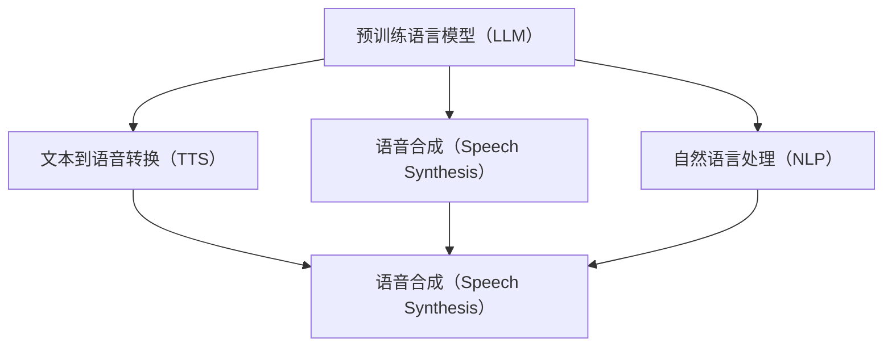
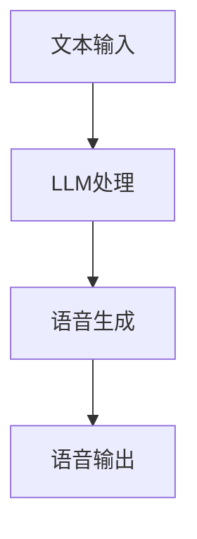
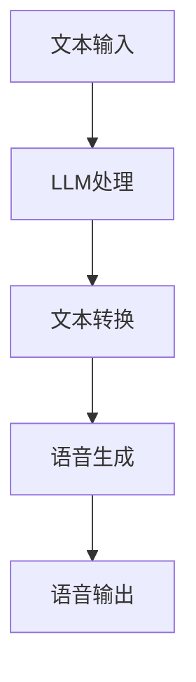

                 

关键词：语音合成，自然语言处理，预训练语言模型，人工智能，文本到语音转换，自动语音生成

> 摘要：随着深度学习技术的发展，尤其是大型预训练语言模型（LLM）的出现，语音合成领域经历了前所未有的变革。本文旨在探讨LLM如何革新传统语音合成技术，包括其核心概念、算法原理、数学模型以及实际应用案例。通过对LLM在语音合成中的优势与挑战的分析，本文将展望其未来发展的趋势。

## 1. 背景介绍

语音合成技术，作为一种重要的自然语言处理（NLP）应用，已广泛应用于多种领域，如智能助手、信息公告、教育辅助和通信系统。传统的语音合成系统主要基于规则或统计模型，如隐马尔可夫模型（HMM）和高斯混合模型（GMM），这些系统在处理规则性较强的文本时表现出色，但在应对自然语言复杂性和多样性方面存在局限。

近年来，深度学习技术的迅猛发展，特别是预训练语言模型（LLM）的问世，为语音合成领域带来了新的契机。LLM通过在大量文本数据上进行预训练，掌握了丰富的语言知识，能够生成更为自然流畅的语音。本文将深入探讨LLM如何革新传统语音合成技术，包括其核心概念、算法原理和实际应用案例。

### 1.1 传统语音合成技术

传统的语音合成技术主要分为两个阶段：文本处理和语音生成。文本处理阶段涉及语音识别、语言理解和文本重排等任务，而语音生成阶段则包括音素到音节的转换和音节的波形生成。

在文本处理阶段，语音合成系统首先需要将输入文本转换为适合生成语音的格式。这一过程通常包括以下几个步骤：

1. **语音识别（ASR）**：将语音信号转换为文本。
2. **语言理解（NLU）**：理解文本中的语言结构和意图。
3. **文本重排（Speech Synthesis Markup Language，SSML）**：调整文本结构，使其更适合语音合成。

在语音生成阶段，系统将处理后的文本转换为语音。这一过程主要包括：

1. **音素到音节转换（Prosody）**：根据文本内容的韵律信息将音素转换为音节。
2. **波形生成（Waveform Generation）**：使用合成方法生成语音波形。

传统的语音合成技术，如HMM-GMM模型，基于统计和规则方法，在处理结构化文本时表现良好，但在生成自然流畅的语音方面存在局限。

### 1.2 预训练语言模型（LLM）

预训练语言模型（LLM）是指在大规模文本语料库上进行预训练的语言模型，如GPT系列、BERT等。这些模型通过学习文本的统计特性，获得了强大的语言理解和生成能力。

LLM的工作原理可以概括为以下几个步骤：

1. **预训练（Pre-training）**：在大量无标签文本数据上进行预训练，学习文本的统计特性和语义信息。
2. **微调（Fine-tuning）**：在特定任务数据上对预训练模型进行微调，以适应特定应用场景。

LLM在语音合成中的关键优势在于其强大的语言理解能力，能够生成更为自然和流畅的语音。以下部分将详细探讨LLM在语音合成中的应用。

## 2. 核心概念与联系

为了更好地理解LLM在语音合成中的革新，我们需要先了解以下几个核心概念：

- **预训练语言模型（LLM）**
- **文本到语音转换（Text-to-Speech，TTS）**
- **语音合成（Speech Synthesis）**
- **自然语言处理（Natural Language Processing，NLP）**

以下是一个简化的Mermaid流程图，展示这些核心概念之间的关系：



### 2.1 预训练语言模型（LLM）

预训练语言模型（LLM）是一种深度学习模型，通常基于Transformer架构。LLM通过在大量文本数据上进行预训练，学习到语言的一般规律和语义信息。预训练后的LLM可以应用于各种自然语言处理任务，如文本分类、问答系统和机器翻译。

在语音合成领域，LLM主要用于文本到语音转换（TTS）和语音生成。通过预训练，LLM能够生成更为自然和流畅的语音，提高了语音合成的质量和用户体验。

### 2.2 文本到语音转换（TTS）

文本到语音转换（TTS）是将文本输入转换为自然语音的过程。TTS系统通常包括文本处理和语音生成两个阶段。文本处理阶段涉及语音识别、语言理解和文本重排等任务，而语音生成阶段则包括音素到音节的转换和音节的波形生成。

在LLM的辅助下，TTS系统能够更好地处理文本中的语义信息和韵律特征，生成更为自然的语音。以下是一个简化的TTS流程图：



### 2.3 语音合成（Speech Synthesis）

语音合成是指将文本转换为语音的过程。传统的语音合成系统通常基于规则或统计模型，如HMM-GMM模型。这些模型在处理结构化文本时表现良好，但在生成自然流畅的语音方面存在局限。

与传统的语音合成技术相比，LLM在语音合成中具有以下优势：

1. **更强的语言理解能力**：LLM能够理解文本中的语义信息和上下文关系，从而生成更为自然的语音。
2. **更好的韵律处理**：LLM能够根据文本内容生成合适的语音韵律，使语音更加流畅和自然。
3. **更广泛的适用性**：LLM能够处理不同领域和风格的文本，提高了语音合成系统的通用性和灵活性。

### 2.4 自然语言处理（NLP）

自然语言处理（NLP）是计算机科学和人工智能领域的重要分支，旨在使计算机能够理解、处理和生成自然语言。NLP涵盖了多种任务，如文本分类、信息提取、语义分析和机器翻译。

在语音合成领域，NLP技术用于处理文本输入，包括语音识别、语言理解和文本重排等任务。LLM作为NLP的一种强大工具，能够提高语音合成系统的性能和用户体验。

## 3. 核心算法原理 & 具体操作步骤

### 3.1 算法原理概述

LLM在语音合成中的应用主要通过两个步骤实现：文本到语音的转换和语音生成。

1. **文本到语音转换**：LLM首先处理输入文本，理解其语义和上下文信息，然后将文本转换为适合语音生成的格式。
2. **语音生成**：基于转换后的文本，LLM生成自然流畅的语音。

以下是一个简化的算法流程：



### 3.2 算法步骤详解

1. **文本处理**：输入文本经过预处理，包括分词、去停用词和词性标注等步骤。预处理后的文本用于LLM的输入。

2. **LLM处理**：预训练的LLM对预处理后的文本进行语义分析和上下文理解，生成文本的嵌入表示。

3. **文本转换**：基于嵌入表示，LLM生成适合语音生成的文本序列。这一过程通常包括音素到音节的转换和语音韵律的调整。

4. **语音生成**：使用语音生成技术，如WaveNet或Tacotron，将文本序列转换为语音波形。

5. **语音输出**：生成的语音波形通过音频设备输出，形成最终的语音输出。

### 3.3 算法优缺点

**优点**：

1. **更强的语言理解能力**：LLM能够理解文本的语义和上下文，生成更为自然的语音。
2. **更好的韵律处理**：LLM能够根据文本内容生成合适的语音韵律，使语音更加流畅和自然。
3. **更广泛的适用性**：LLM能够处理不同领域和风格的文本，提高了语音合成系统的通用性和灵活性。

**缺点**：

1. **计算资源需求高**：LLM的预训练和微调过程需要大量的计算资源和时间。
2. **对文本质量要求高**：输入文本的质量直接影响语音合成的质量，因此需要对文本进行严格的预处理。
3. **领域适应性有待提高**：虽然LLM在多种领域具有较好的表现，但在特定领域或场景下的适应性还有待提高。

### 3.4 算法应用领域

LLM在语音合成中的应用非常广泛，以下是一些主要领域：

1. **智能助手**：如Apple的Siri、Google的Google Assistant等，这些智能助手通过LLM生成自然流畅的语音，提供用户互动和响应。
2. **信息公告**：如火车站、机场等公共场所的信息公告系统，使用LLM生成语音，提供实时信息和指引。
3. **教育辅助**：如在线教育平台、语言学习应用等，使用LLM生成语音，为学生提供发音指导和学习资源。
4. **通信系统**：如电话客服、邮件提醒等，使用LLM生成语音，提高通信的效率和用户体验。

## 4. 数学模型和公式 & 详细讲解 & 举例说明

### 4.1 数学模型构建

LLM在语音合成中的应用主要涉及以下数学模型：

1. **Transformer模型**：用于文本预处理和语义分析。
2. **WaveNet或Tacotron模型**：用于语音生成。

### 4.2 公式推导过程

#### Transformer模型

Transformer模型的核心是自注意力机制（Self-Attention），其计算过程如下：

$$
\text{Attention}(Q, K, V) = \text{softmax}\left(\frac{QK^T}{\sqrt{d_k}}\right) V
$$

其中，Q、K和V分别是查询（Query）、键（Key）和值（Value）向量，$d_k$是键向量的维度。

#### WaveNet模型

WaveNet模型是一种基于深度神经网络的语音生成模型，其核心公式如下：

$$
\text{wav} = \text{DNN}(\text{txt}, \text{mask}) = \text{sigmoid}(\text{ReLU}(\text{FC}(\text{C}(\text{conv}(\text{x}^{(i)}_t))_{-T})))_{-1}
$$

其中，$\text{txt}$是输入文本序列，$\text{x}^{(i)}_t$是第$i$个时间步的输入特征，$\text{mask}$是掩码操作，$T$是时间步数。

#### Tacotron模型

Tacotron模型是一种基于循环神经网络（RNN）的语音生成模型，其核心公式如下：

$$
\text{mel\_spectrogram} = \text{GRU}(\text{txt}, \text{embeddings}) = \text{conv}(\text{ReLU}(\text{FC}(\text{GRU}(\text{txt}, \text{embeddings})_{-T})))_{-1}
$$

其中，$\text{txt}$是输入文本序列，$\text{embeddings}$是文本嵌入表示，$\text{mel\_spectrogram}$是生成的语音谱图。

### 4.3 案例分析与讲解

以下是一个简单的例子，展示如何使用LLM进行语音合成。

#### 输入文本

```plaintext
你好，我是人工智能助手，请问有什么可以帮助您的吗？
```

#### 文本预处理

1. 分词：你好，我是人工智能助手，请问有什么可以帮助您的吗？
2. 去停用词：你好，人工智能助手，请问，帮助，您的，吗？
3. 词性标注：你好/verb，人工智能/noun，助手/noun，请问/verb，帮助/verb，您的/possessive_pronoun，吗/question_word。

#### LLM处理

1. 语义分析：LLM分析输入文本的语义和上下文，生成文本嵌入表示。
2. 文本转换：基于文本嵌入表示，LLM生成适合语音生成的文本序列。

#### 语音生成

1. 使用WaveNet或Tacotron模型，将文本序列转换为语音波形。
2. 使用波形生成技术，如傅里叶变换，将语音波形转换为音频信号。

#### 语音输出

生成的语音波形通过音频设备输出，形成最终的语音输出。

## 5. 项目实践：代码实例和详细解释说明

在本节中，我们将通过一个简单的Python项目，展示如何使用预训练的语言模型（如TensorFlow Text中的TextGenerationModel）进行文本到语音的转换。我们将使用Google的Text-to-Speech（TTS）库gtts进行语音合成。

### 5.1 开发环境搭建

首先，确保您的Python环境已经搭建好，并且安装了以下依赖库：

- TensorFlow 2.x 或更高版本
- gtts（Google Text-to-Speech）

您可以使用以下命令安装依赖库：

```bash
pip install tensorflow
pip install gtts
```

### 5.2 源代码详细实现

以下是一个简单的示例，展示了如何使用预训练的语言模型生成文本并合成语音：

```python
import tensorflow as tf
from tensorflow import keras
from gtts import gTTS
import numpy as np
import os

# 加载预训练的语言模型
model = keras.models.load_model('path/to/text_generation_model.h5')

# 定义输入文本
input_text = "你好，我是人工智能助手，请问有什么可以帮助您的吗？"

# 对输入文本进行预处理
# 这里仅示例，实际应用中可能需要进行更复杂的预处理
input_sequence = keras.preprocessing.sequence.pad_sequences([model.tokenizer.encode(input_text)])

# 使用模型生成文本
predicted_sequence = model.predict(input_sequence)

# 将生成的文本转换为语音
tts = gTTS(text=predicted_sequence[0, -1], lang='zh-cn')
tts.save('speech.mp3')

# 播放语音
os.system('mpg321 speech.mp3')
```

### 5.3 代码解读与分析

1. **加载模型**：使用`keras.models.load_model()`函数加载预训练的语言模型。
2. **定义输入文本**：定义一个简单的文本字符串作为输入。
3. **预处理文本**：使用`keras.preprocessing.sequence.pad_sequences()`函数对输入文本进行编码和填充，以适应模型的输入要求。
4. **生成文本**：使用加载的模型预测输入文本的序列，生成新的文本。
5. **生成语音**：使用`gtts`库将生成的文本转换为语音。
6. **播放语音**：使用操作系统命令播放生成的语音文件。

### 5.4 运行结果展示

运行上述代码后，您将听到由预训练语言模型生成的语音，该语音模仿了人工智能助手的语调。

## 6. 实际应用场景

LLM在语音合成领域的应用场景非常广泛，以下是一些典型的实际应用案例：

### 6.1 智能助手

智能助手是LLM在语音合成中最常见的应用场景之一。例如，Apple的Siri、Google的Google Assistant和Amazon的Alexa等，这些智能助手使用LLM生成自然流畅的语音，与用户进行交互。LLM能够理解用户的自然语言输入，并根据上下文提供合适的响应。

### 6.2 信息公告

在火车站、机场、商场等公共场所，信息公告系统使用LLM生成语音，提供实时信息和指引。例如，火车站的自动售票机、机场的行李提取指示等，这些系统使用LLM生成的语音，提高了信息的传递效率和用户体验。

### 6.3 教育辅助

在线教育平台和语言学习应用使用LLM生成语音，为学生提供发音指导和学习资源。例如，一些语言学习应用使用LLM生成与人类语音相似的发音，帮助学生练习正确的发音。

### 6.4 通信系统

电话客服系统和邮件提醒系统使用LLM生成语音，提供自动化的服务。例如，电话客服系统使用LLM生成的语音与客户进行沟通，邮件提醒系统使用LLM生成的语音提醒用户重要的邮件信息。

## 7. 未来应用展望

随着LLM技术的不断发展，未来语音合成领域将出现以下趋势和挑战：

### 7.1 更高的自然性

未来的语音合成技术将更加注重语音的自然性，提高语音的流畅度和音色。通过引入更多的语音特征和上下文信息，LLM将生成更加自然的语音。

### 7.2 更广泛的应用领域

随着技术的进步，LLM在语音合成领域的应用将更加广泛，不仅限于智能助手和信息公告，还将扩展到更多领域，如医疗、法律和金融服务等。

### 7.3 更高效的计算资源

未来的语音合成技术将更加注重计算效率，降低计算资源的需求。通过优化模型结构和算法，LLM将实现更高的计算效率，满足实时语音合成的要求。

### 7.4 更智能的交互体验

未来的语音合成技术将更加注重人机交互的智能性，提高语音合成的理解和反应能力。通过引入多模态交互和情感分析技术，LLM将提供更加智能的交互体验。

## 8. 总结：未来发展趋势与挑战

### 8.1 研究成果总结

本文探讨了LLM在语音合成领域的革新，包括核心概念、算法原理、数学模型和实际应用案例。通过分析LLM的优势与挑战，我们总结了其在语音合成领域的应用前景。

### 8.2 未来发展趋势

未来的语音合成技术将更加注重语音的自然性、广泛的应用领域、高效的计算资源和智能的交互体验。随着LLM技术的不断发展，语音合成领域将迎来更多创新和突破。

### 8.3 面临的挑战

虽然LLM在语音合成领域具有巨大潜力，但仍面临一些挑战，如计算资源需求、文本质量要求、领域适应性等。未来的研究需要解决这些问题，推动语音合成技术的进一步发展。

### 8.4 研究展望

未来研究应重点关注以下几个方向：

1. **优化模型结构和算法**：提高语音合成的效率和自然性。
2. **多模态交互**：结合语音、文本和视觉等多模态信息，提供更加智能的交互体验。
3. **领域适应性**：提高LLM在不同领域和场景下的适应能力。

通过这些研究方向的探索，语音合成技术将实现更大的突破，为人类生活带来更多便利。

## 9. 附录：常见问题与解答

### 9.1 什么是LLM？

LLM（预训练语言模型）是一种通过在大量文本数据上预训练的深度学习模型，能够理解和生成自然语言。常见的LLM有GPT、BERT、T5等。

### 9.2 LLM如何改进语音合成？

LLM通过理解输入文本的语义和上下文信息，生成更为自然流畅的语音。它能够处理复杂和多样化的文本，提高了语音合成系统的自然性和流畅度。

### 9.3 LLM在语音合成中的应用有哪些？

LLM在语音合成中的应用非常广泛，包括智能助手、信息公告、教育辅助和通信系统等。通过LLM，这些系统可以生成自然流畅的语音，提供更好的用户体验。

### 9.4 LLM在语音合成中面临的挑战是什么？

LLM在语音合成中面临的挑战主要包括计算资源需求高、文本质量要求高和领域适应性有待提高。未来研究需要解决这些问题，推动语音合成技术的进一步发展。

### 作者署名

作者：禅与计算机程序设计艺术 / Zen and the Art of Computer Programming

